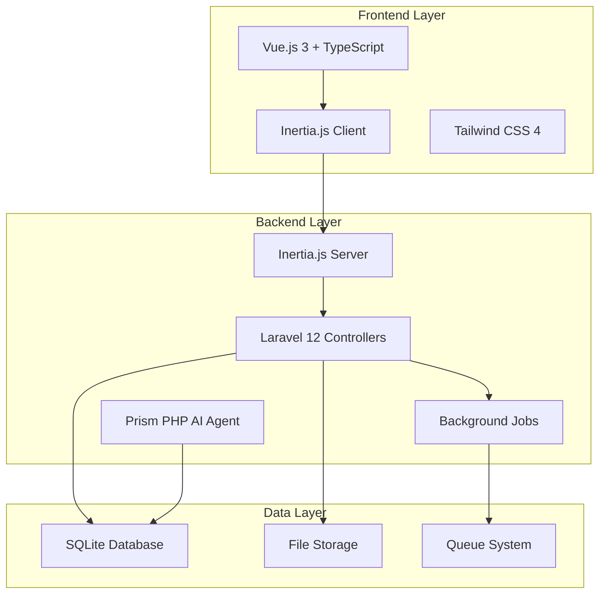
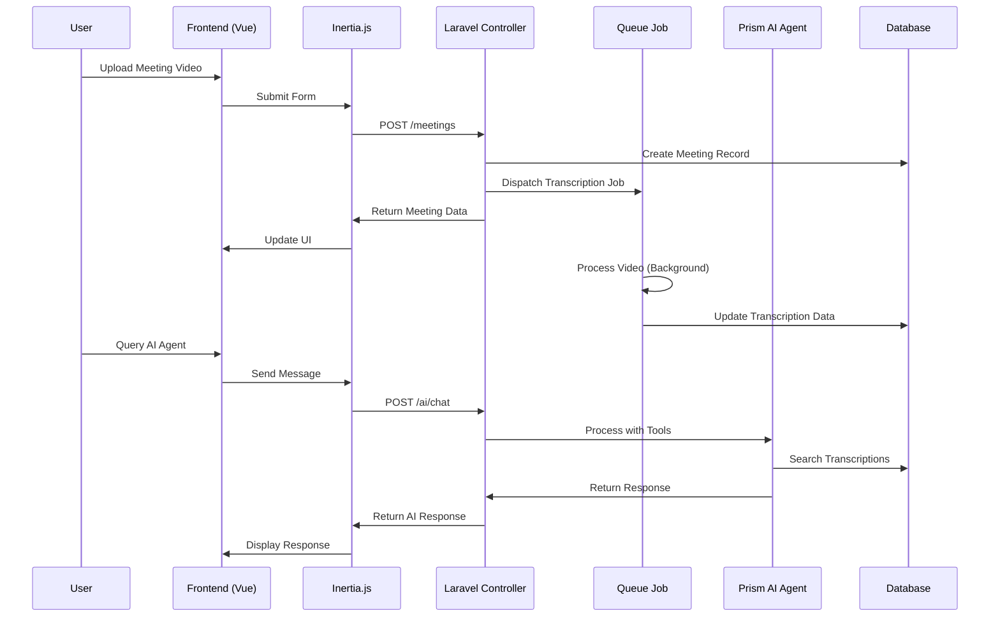

# Design Document

## Overview

The AI Meeting Platform is built on a modern Laravel 12 backend with Vue.js 3 frontend using Inertia.js for seamless SPA-like experiences. The system leverages background job processing for video transcription, SQLite for development storage, and Prism PHP for AI conversation capabilities. The architecture emphasizes real-time status updates, efficient video handling, and intelligent search capabilities across meeting transcriptions.

## Architecture

### High-Level Architecture



### Request Flow Architecture



## Components and Interfaces

### Backend Components

#### Models

**Client Model**
```php
class Client extends Model
{
    protected $fillable = ['name', 'email', 'company', 'phone'];
    
    public function meetings(): HasMany
    {
        return $this->hasMany(Meeting::class);
    }
}
```

**Meeting Model**
```php
class Meeting extends Model
{
    protected $fillable = [
        'client_id', 'title', 'video_path', 'status', 
        'duration', 'uploaded_at', 'processing_started_at', 
        'processing_completed_at'
    ];
    
    protected $casts = [
        'uploaded_at' => 'datetime',
        'processing_started_at' => 'datetime',
        'processing_completed_at' => 'datetime',
        'duration' => 'integer'
    ];
    
    public function client(): BelongsTo
    {
        return $this->belongsTo(Client::class);
    }
    
    public function transcriptions(): HasMany
    {
        return $this->hasMany(Transcription::class);
    }
}
```

**Transcription Model**
```php
class Transcription extends Model
{
    protected $fillable = [
        'meeting_id', 'speaker', 'text', 'start_time', 
        'end_time', 'confidence'
    ];
    
    protected $casts = [
        'start_time' => 'float',
        'end_time' => 'float',
        'confidence' => 'float'
    ];
    
    public function meeting(): BelongsTo
    {
        return $this->belongsTo(Meeting::class);
    }
}
```

#### Controllers

**ClientController**
- `index()`: List all clients with meeting counts
- `store()`: Create new client
- `show()`: Display client details with meetings
- `update()`: Update client information
- `destroy()`: Delete client (with validation)

**MeetingController**
- `index()`: List meetings with filtering capabilities
- `store()`: Handle video upload and create meeting record
- `show()`: Display meeting with video player and transcriptions
- `update()`: Update meeting metadata
- `destroy()`: Delete meeting and associated files

**AIAgentController**
- `chat()`: Handle AI conversation requests
- `search()`: Direct search endpoint for transcriptions

#### Background Jobs

**TranscribeMeetingJob**
```php
class TranscribeMeetingJob implements ShouldQueue
{
    use Dispatchable, InteractsWithQueue, Queueable, SerializesModels;
    
    public function __construct(
        public Meeting $meeting
    ) {}
    
    public function handle(): void
    {
        // Update status to processing
        // Simulate transcription with sleep based on video duration
        // Generate fake transcription data using Faker
        // Update meeting status to completed
    }
}
```

#### AI Agent Integration

**MeetingSearchTool** (Prism PHP Tool)
```php
class MeetingSearchTool extends Tool
{
    public function execute(array $parameters): array
    {
        $query = $parameters['query'];
        $clientId = $parameters['client_id'] ?? null;
        
        return Transcription::query()
            ->when($clientId, fn($q) => $q->whereHas('meeting', fn($q) => $q->where('client_id', $clientId)))
            ->where('text', 'like', "%{$query}%")
            ->with(['meeting.client'])
            ->get()
            ->map(fn($t) => [
                'text' => $t->text,
                'speaker' => $t->speaker,
                'timestamp' => $t->start_time,
                'meeting_title' => $t->meeting->title,
                'client_name' => $t->meeting->client->name,
                'meeting_id' => $t->meeting->id
            ])
            ->toArray();
    }
}
```

### Frontend Components

#### Vue.js Components Structure

**Pages (resources/js/pages/)**
- `Dashboard.vue`: Main dashboard with recent meetings
- `Clients/Index.vue`: Client management interface
- `Clients/Show.vue`: Individual client view with meetings
- `Meetings/Index.vue`: Meetings list with filtering
- `Meetings/Show.vue`: Meeting detail with video player
- `Meetings/Create.vue`: Meeting upload form
- `AI/Chat.vue`: AI conversation interface

**Shared Components (resources/js/lib/)**
- `VideoPlayer.vue`: Custom video player with transcription sync
- `TranscriptionViewer.vue`: Scrollable transcription with timestamps
- `MeetingStatusBadge.vue`: Status indicator with progress
- `ClientSelector.vue`: Dropdown for client selection
- `MeetingFilters.vue`: Filter controls for meetings list
- `AIChat.vue`: Chat interface for AI agent
- `UploadProgress.vue`: File upload progress indicator

#### Key Frontend Interfaces

**VideoPlayer Component**
```typescript
interface VideoPlayerProps {
  videoUrl: string;
  transcriptions: Transcription[];
  currentTime?: number;
}

interface VideoPlayerEmits {
  timeUpdate: [time: number];
  transcriptionClick: [timestamp: number];
}
```

**Meeting Interface**
```typescript
interface Meeting {
  id: number;
  title: string;
  client: Client;
  status: 'pending' | 'processing' | 'completed' | 'failed';
  video_path: string;
  duration: number;
  uploaded_at: string;
  processing_started_at?: string;
  processing_completed_at?: string;
  transcriptions?: Transcription[];
}

interface Transcription {
  id: number;
  speaker: string;
  text: string;
  start_time: number;
  end_time: number;
  confidence: number;
}
```

## Data Models

### Database Schema

```sql
-- Clients table
CREATE TABLE clients (
    id INTEGER PRIMARY KEY AUTOINCREMENT,
    name VARCHAR(255) NOT NULL,
    email VARCHAR(255) UNIQUE,
    company VARCHAR(255),
    phone VARCHAR(255),
    created_at TIMESTAMP,
    updated_at TIMESTAMP
);

-- Meetings table
CREATE TABLE meetings (
    id INTEGER PRIMARY KEY AUTOINCREMENT,
    client_id INTEGER NOT NULL,
    title VARCHAR(255) NOT NULL,
    video_path VARCHAR(500) NOT NULL,
    status VARCHAR(50) DEFAULT 'pending',
    duration INTEGER, -- in seconds
    uploaded_at TIMESTAMP,
    processing_started_at TIMESTAMP NULL,
    processing_completed_at TIMESTAMP NULL,
    created_at TIMESTAMP,
    updated_at TIMESTAMP,
    FOREIGN KEY (client_id) REFERENCES clients(id) ON DELETE CASCADE
);

-- Transcriptions table
CREATE TABLE transcriptions (
    id INTEGER PRIMARY KEY AUTOINCREMENT,
    meeting_id INTEGER NOT NULL,
    speaker VARCHAR(255),
    text TEXT NOT NULL,
    start_time REAL NOT NULL, -- in seconds
    end_time REAL NOT NULL,   -- in seconds
    confidence REAL DEFAULT 1.0,
    created_at TIMESTAMP,
    updated_at TIMESTAMP,
    FOREIGN KEY (meeting_id) REFERENCES meetings(id) ON DELETE CASCADE
);

-- Indexes for performance
CREATE INDEX idx_meetings_client_id ON meetings(client_id);
CREATE INDEX idx_meetings_status ON meetings(status);
CREATE INDEX idx_transcriptions_meeting_id ON transcriptions(meeting_id);
CREATE INDEX idx_transcriptions_text ON transcriptions(text);
CREATE INDEX idx_transcriptions_start_time ON transcriptions(start_time);
```

### File Storage Structure

```
storage/app/
├── meetings/
│   ├── {client_id}/
│   │   ├── {meeting_id}/
│   │   │   ├── video.mp4
│   │   │   └── thumbnail.jpg
│   │   └── ...
│   └── ...
└── temp/
    └── uploads/
```

## Error Handling

### Backend Error Handling

**File Upload Errors**
- Invalid file format: Return 422 with specific format requirements
- File too large: Return 413 with size limits
- Storage errors: Return 500 with retry instructions
- Missing client association: Return 422 with validation errors

**Transcription Job Errors**
- Video processing failure: Update meeting status to 'failed', log detailed error
- Timeout errors: Implement job retry logic with exponential backoff
- Storage errors: Ensure cleanup of partial data

**AI Agent Errors**
- API rate limits: Implement graceful degradation with user notification
- Search query errors: Return helpful error messages with suggestions
- Tool execution failures: Log errors and provide fallback responses

### Frontend Error Handling

**Upload Error States**
- Network errors: Show retry button with progress preservation
- Validation errors: Display field-specific error messages
- Server errors: Show user-friendly error with support contact

**Video Player Error States**
- Video load failures: Display error message with reload option
- Transcription sync issues: Graceful degradation to manual navigation
- Network interruptions: Pause and show reconnection status

**AI Chat Error States**
- Connection errors: Show offline indicator with retry capability
- Response timeouts: Display timeout message with retry option
- Invalid queries: Provide query suggestions and examples

## Testing Strategy

### Integration Testing with Pest v4 Browser Testing

**Client Management Tests**
```php
it('can create and manage clients through the web interface')
    ->browse(function (Browser $browser) {
        $browser->visit('/clients')
                ->click('@create-client-button')
                ->type('@client-name', 'Test Client')
                ->type('@client-email', 'test@example.com')
                ->click('@save-client')
                ->assertSee('Test Client')
                ->assertPathIs('/clients');
    });
```

**Meeting Upload and Processing Tests**
```php
it('can upload meeting video and track processing status')
    ->browse(function (Browser $browser) {
        $client = Client::factory()->create();
        
        $browser->visit('/meetings/create')
                ->select('@client-selector', $client->id)
                ->type('@meeting-title', 'Test Meeting')
                ->attach('@video-upload', storage_path('test-video.mp4'))
                ->click('@upload-button')
                ->waitForText('Processing')
                ->assertSee('Elapsed time:')
                ->assertSee('Estimated remaining:');
    });
```

**Video Player and Transcription Tests**
```php
it('can play video and navigate via transcription timestamps')
    ->browse(function (Browser $browser) {
        $meeting = Meeting::factory()->completed()->create();
        
        $browser->visit("/meetings/{$meeting->id}")
                ->waitFor('@video-player')
                ->click('@transcription-timestamp[data-time="30"]')
                ->pause(1000)
                ->assertScript('document.querySelector("video").currentTime', 30);
    });
```

**AI Agent Interaction Tests**
```php
it('can interact with AI agent and receive search results')
    ->browse(function (Browser $browser) {
        $meeting = Meeting::factory()->withTranscriptions()->create();
        
        $browser->visit('/ai/chat')
                ->type('@chat-input', 'Find mentions of budget in meetings')
                ->click('@send-button')
                ->waitForText('Found')
                ->assertSee($meeting->title)
                ->click('@result-link')
                ->assertPathIs("/meetings/{$meeting->id}");
    });
```

**Filter and Search Tests**
```php
it('can filter meetings by client and status')
    ->browse(function (Browser $browser) {
        $client = Client::factory()->create(['name' => 'Acme Corp']);
        $meeting = Meeting::factory()->create(['client_id' => $client->id]);
        
        $browser->visit('/meetings')
                ->select('@client-filter', $client->id)
                ->select('@status-filter', 'completed')
                ->click('@apply-filters')
                ->assertSee($meeting->title)
                ->assertDontSee('Other Meeting');
    });
```

### Test Data Management

**Factories for Realistic Test Data**
```php
// MeetingFactory
public function definition(): array
{
    return [
        'client_id' => Client::factory(),
        'title' => fake()->sentence(3),
        'video_path' => 'meetings/test-video.mp4',
        'status' => 'pending',
        'duration' => fake()->numberBetween(300, 3600),
        'uploaded_at' => now(),
    ];
}

public function completed(): static
{
    return $this->state(fn() => [
        'status' => 'completed',
        'processing_started_at' => now()->subMinutes(10),
        'processing_completed_at' => now()->subMinutes(2),
    ]);
}
```

**Test Environment Setup**
- Isolated SQLite database for each test
- Mock file storage using Laravel's fake disk
- Prism AI agent mocking for consistent responses
- Video file fixtures for upload testing

This design provides a comprehensive foundation for building the AI meeting transcription platform with clear separation of concerns, robust error handling, and thorough testing coverage using modern Laravel and Vue.js best practices.