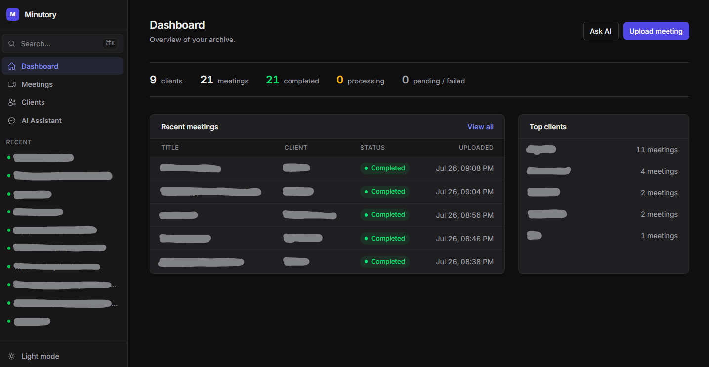
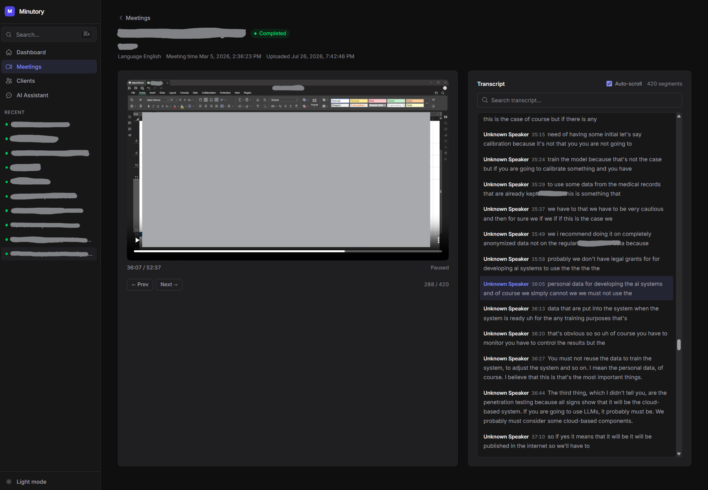
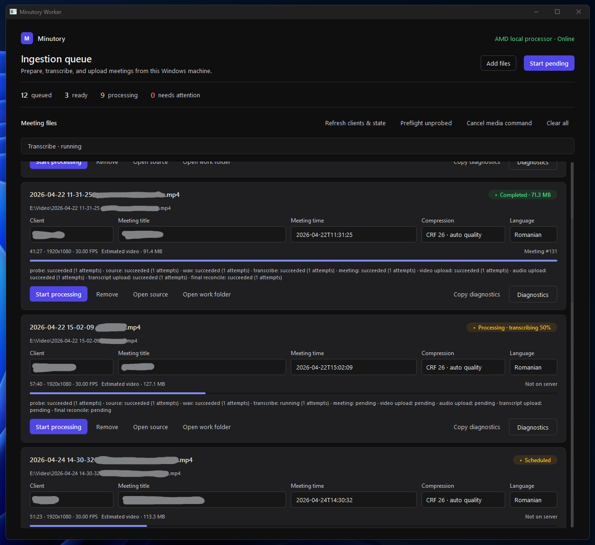
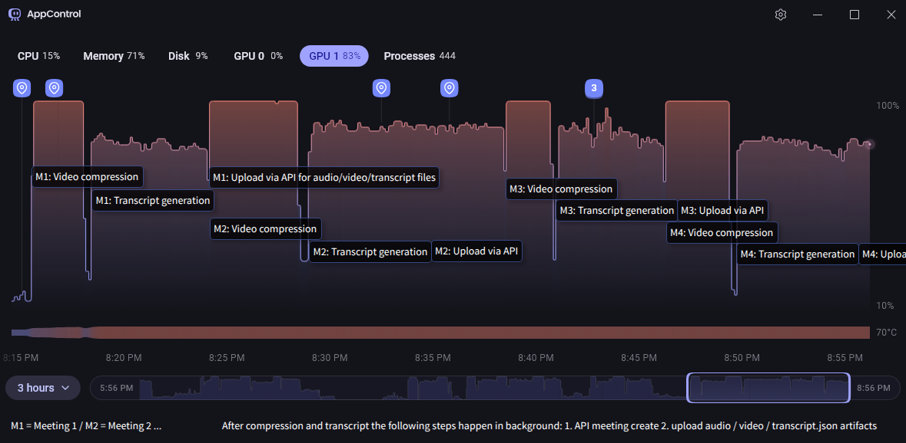

# Minutory - AI Meeting Platform

Minutory is a meeting archive and transcription platform built with Laravel and
Vue. Recordings can be uploaded through the web application or processed in a
native Windows queue, then reviewed in a synchronized video and transcript
workspace. An OpenRouter-powered assistant can search the transcript archive and
return relevant meeting context.

## Current Features

- Client management and a filterable, sortable meeting archive
- Dashboard statistics, recent meetings, top clients, and quick actions
- Browser uploads for MP4, MOV, AVI, and WebM recordings up to 500 MB
- Filename-derived meeting title and date suggestions with timezone-safe storage
- Queue-backed transcription with Parakeet, Whisper, or Qwen server runtimes
- Native Windows ingestion queue with local AMD GPU transcription
- Timestamped transcript playback, segment seeking, filtering, auto-scroll, and
  `?t=<seconds>` deep links
- `Ctrl/Cmd+K` spotlight search for clients and meeting titles
- AI assistant and direct transcript keyword search with client and speaker filters
- Polling-based pending, processing, completed, and failed status updates
- Authenticated, throttled, and idempotent Worker API for durable artifact uploads

## Screenshots

| Web dashboard | Synchronized meeting player and transcript |
| --- | --- |
| [](screenshots/dashboard.png) | [](screenshots/meeting-player-transcript.png) |

| Windows ingestion queue | GPU use across the local processing pipeline |
| --- | --- |
| [](screenshots/windows-worker-gui.png) | [](screenshots/windows-worker-gpu-usage-graph.png) |

## How It Works

Minutory currently supports two ingestion and transcription paths.

### Web Upload

1. Laravel stores the uploaded video under
   `storage/app/public/meetings/{client_id}/{meeting_id}/`.
2. A unique database-queue job extracts mono 16 kHz PCM WAV audio with FFmpeg.
3. The Python runtime transcribes with the selected `parakeet`, `whisper`, or
   `qwen` driver.
4. Minutory validates the normalized `transcript.json`, transactionally imports
   its segments, and marks the meeting completed.
5. The meeting page synchronizes the imported segments with video playback.

Retranscription preserves the existing database transcript until the replacement
JSON has been generated and validated successfully. See the
[transcription runtime documentation](transcribe-microservice/README.md) for
driver and model details.

### Windows Worker

The [Minutory Windows Worker](minutory-windows-worker/README.md) is a native
PySide6 desktop queue for preparing several recordings on Windows 11. It is
currently targeted at Python 3.12, FasterWhisper Large v3, CTranslate2 ROCm/HIP,
and an AMD Radeon RX 7900 XTX.

For every queue item the worker durably persists these stages in SQLite:

1. Probe the source recording.
2. Copy or compress the video and extract WAV audio.
3. Transcribe locally in Romanian or English.
4. Create or recover the server meeting idempotently.
5. Upload video, audio, and normalized transcript artifacts independently.
6. Reconcile remote hashes and sizes before declaring completion.

One serialized media/GPU lane keeps a single model loaded, while two I/O workers
can create meetings, upload artifacts, and reconcile prior items in parallel.
Failed uploads have separate retry controls and do not rerun successful media or
ASR stages. The worker performs transcription itself and always sends
`start_transcript_server=false`.

#### Windows Operator Setup

1. Configure the Laravel server's ignored `.env` with a strong
   `WORKER_API_TOKEN` and ensure FFprobe is available to the server.
2. Copy `minutory-windows-worker/.env.example` to
   `minutory-windows-worker/.env`.
3. Set `MINUTORY_API_BASE_URL` and set `MINUTORY_API_TOKEN` to the same value as
   the server's `WORKER_API_TOKEN`. Non-loopback server URLs must use HTTPS.
4. Obtain a release-approved ignored
   `minutory-windows-worker/manifests/runtime-assets.local.json` containing the
   immutable runtime URLs and verified archive/installed-tree SHA-256 values.
5. Launch `minutory-windows-worker/start.bat`. Startup verifies the complete
   Python, FFmpeg, ROCm, GPU, dependency, and model runtime before opening the UI.
6. Add or drop recordings, review the detected metadata, select a client,
   compression preset, and language, then use **Start pending**.

Bootstrap fails closed when assets are unresolved, incomplete, stale, or
modified. Runtime data remains inside the worker's ignored `.venv/`, `libs/`,
`models/`, `cache/`, `work/`, `state/`, and `logs/` directories. For release
asset preparation, diagnostics, retries, shutdown behavior, and developer setup,
read the [separate Windows Worker README](minutory-windows-worker/README.md) and
[worker architecture](minutory-windows-worker/docs/architecture.md).

## Architecture

| Area | Technology |
| --- | --- |
| Backend | PHP 8.2+, Laravel 12, Inertia.js 2, database queues |
| Frontend | Vue 3.5, TypeScript, Tailwind CSS 4, Vite 7 |
| Data | SQLite by default, Eloquent, public filesystem artifacts |
| Server ASR | Python 3.12, FFmpeg, Parakeet, FasterWhisper, or Qwen3-ASR |
| Windows worker | PySide6, SQLite/WAL, FFmpeg, FasterWhisper, CTranslate2 ROCm/HIP |
| AI | Prism PHP, OpenRouter, and the `search_meetings` tool |
| Testing | Pest 4, Playwright dependencies, Node utility tests, Pytest |

The web interface uses Inertia rather than a separate public SPA API. The
Windows application communicates through the Bearer-authenticated
`/api/v1/worker` API, which supports client lookup, idempotent meeting creation,
reconciliation, and separate video, audio, and transcript uploads.

SQLite is the default development and test database. Laravel connections are
also configured for MySQL, MariaDB, PostgreSQL, and SQL Server; deployments using
another driver should run the full test suite against that database.

## Requirements

- PHP 8.2 or newer; the repository's local runtime target is PHP 8.4
- Composer 2
- Node.js 22.12 or newer and npm
- SQLite by default, or another configured Laravel database
- FFmpeg and FFprobe for server-side media processing
- Python 3.12 and the managed transcription runtime for server-side ASR
- An OpenRouter API key to use the AI assistant

The Windows worker has additional hardware and verified-runtime requirements;
see its [operator documentation](minutory-windows-worker/README.md).

## Getting Started

Install the application dependencies:

```bash
composer install
npm ci
```

Copy `.env.example` to an ignored `.env`, then initialize the default SQLite
installation:

```bash
php -r "file_exists('database/database.sqlite') || touch('database/database.sqlite');"
php artisan key:generate
php artisan migrate
php artisan storage:link
```

The storage link is required because meeting videos are served from the public
disk. To enable the AI assistant, add the currently required provider credential
to `.env`:

```dotenv
OPENROUTER_API_KEY=your-key
# OPENROUTER_URL=https://openrouter.ai/api/v1
```

Start Laravel, the queue listener, and Vite together:

```bash
composer dev
```

Other development and build commands:

```bash
composer dev:ssr
npm run dev
npm run build
npm run build:ssr
```

### Server Transcription

The checked-in server runtime is built for Minutory's custom Debian/glibc Lerd
environment. It expects FFmpeg, `/opt/minutory-venv/bin/python`, and cached model
artifacts under `storage/app/model`.

```bash
lerd check
lerd rebuild
```

Select the default runtime in `.env`:

```dotenv
TRANSCRIBING_DRIVER=parakeet
TRANSCRIBING_LANGUAGE=ro
TRANSCRIBING_DEVICE=cpu
TRANSCRIBING_COMPUTE_TYPE=auto
```

The transcription job can run for up to 10,800 seconds. `composer dev` uses a
one-hour queue-listener timeout, so use a worker timeout longer than the job for
long recordings or CPU-heavy Qwen transcription, while keeping
`DB_QUEUE_RETRY_AFTER` higher than the worker timeout:

```bash
php artisan queue:work --tries=1 --timeout=10900 --memory=512
```

Queue a meeting for safe retranscription with a specific driver:

```bash
php artisan meeting:transcribe 91 parakeet
php artisan meeting:transcribe 91 whisper
php artisan meeting:transcribe 91 qwen
```

Recover pending or failed meetings that do not already have a database-queue job:

```bash
php artisan app:process-meetings --dry-run
php artisan app:process-meetings
```

These recovery commands inspect Laravel's database queue directly and therefore
require `QUEUE_CONNECTION=database`.

## Windows Worker Development

From `minutory-windows-worker/`:

```powershell
uv sync --extra dev
$env:QT_QPA_PLATFORM = "offscreen"
uv run pytest
uv run ruff format --check .
uv run ruff check .
uv run mypy src/minutory_worker
```

Useful read-only or redacted diagnostics:

```powershell
uv run minutory-worker validate-config
uv run minutory-worker list-state
uv run python -m minutory_worker.runtime_verify
```

Worker tests use fake process, ASR, and HTTP transports; they do not require a
GPU, FFmpeg, a model, server credentials, or network access.

## Testing and Quality

```bash
# PHP feature and integration tests
composer test

# Frontend checks
npm run typecheck
npm run format:check
npm run test:frontend

# Format PHP and frontend sources
./vendor/bin/pint
npm run format

# ESLint currently applies fixes
npm run lint
```

`npm run test:frontend` uses POSIX timezone environment assignments and should be
run from a compatible shell. Browser test sources and Playwright are present, but
the default PHPUnit configuration currently runs the Feature and Integration
suites.

## Data Model

- **Client** - contact and company information; has many meetings
- **Meeting** - client, title, recording time, video path, duration, processing
  state, errors, and artifact metadata
- **Transcription** - meeting segment text, timestamps, optional speaker label,
  and confidence

## Current Limitations and Security Notes

- Human-facing web routes currently have no login or per-user authorization; use
  Minutory as a trusted single-install application or protect it at the deployment
  boundary.
- The Worker API is separately protected by a shared Bearer token, layered rate
  limits, idempotency keys, strict artifact validation, and hash reconciliation.
- AI chat uses OpenRouter and sends prompts and relevant meeting context to that
  external provider.
- The current transcription runtimes produce timestamped segments but do not
  perform active speaker diarization. Speaker labels are retained when supplied
  by an ingestion source.
- Structured summaries and action-item extraction are not implemented yet.
- Web processing status is refreshed by polling rather than WebSockets.
- The Windows bootstrap intentionally requires a release-approved local asset
  manifest; no standalone PyInstaller package is currently provided.

## License

MIT License - see [LICENSE.md](LICENSE.md).
