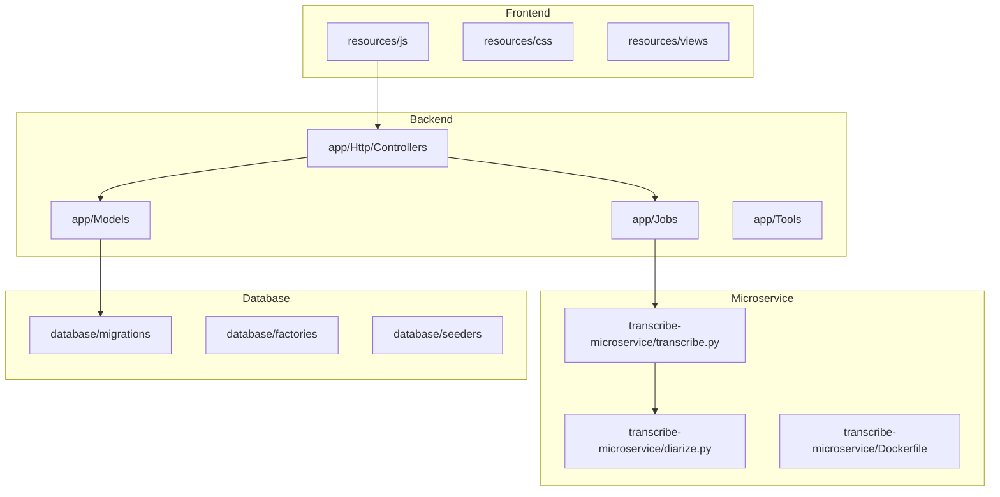
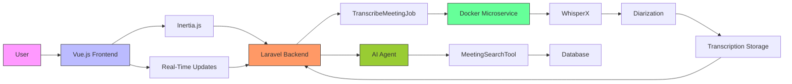
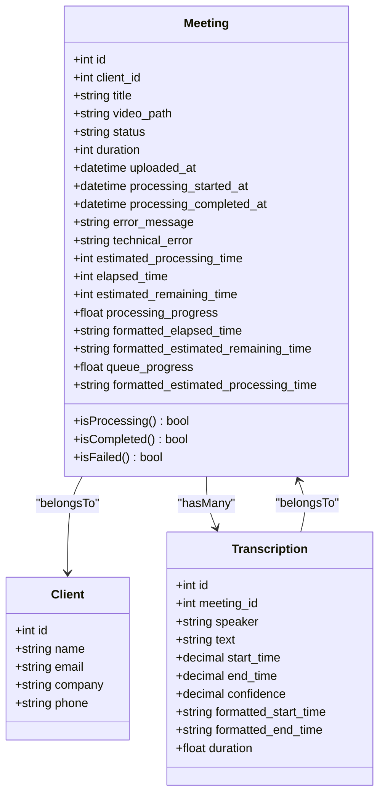
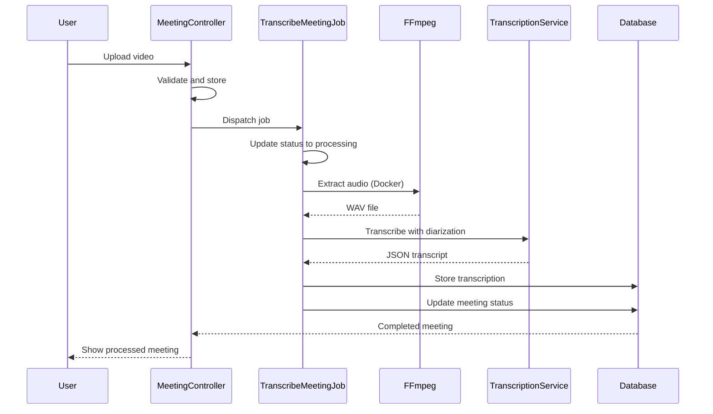
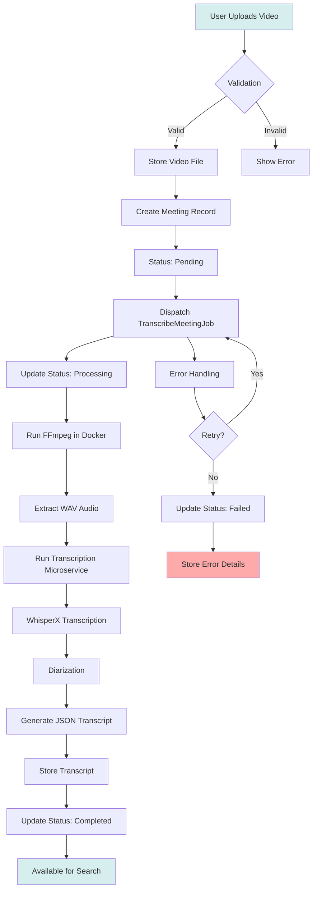
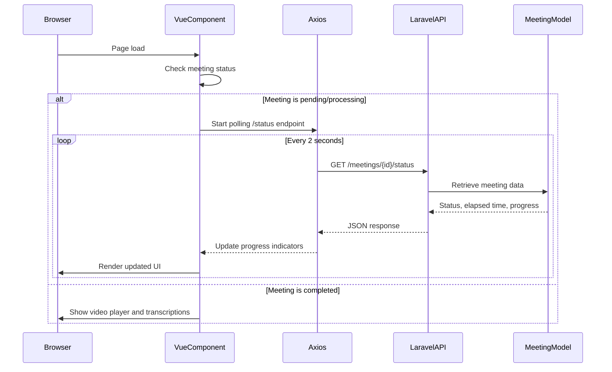
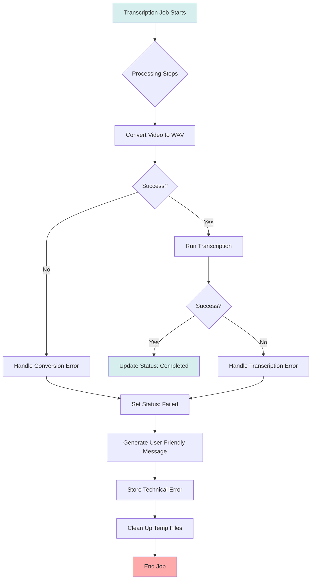
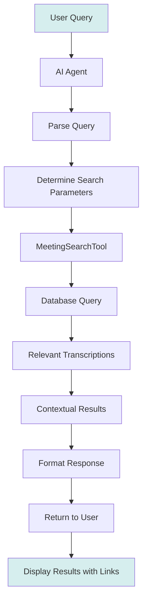

# System Overview

## Table of Contents
1. [Introduction](#introduction)
2. [Project Structure](#project-structure)
3. [Core Components](#core-components)
4. [Architecture Overview](#architecture-overview)
5. [Detailed Component Analysis](#detailed-component-analysis)
6. [Data Flow and Processing Pipeline](#data-flow-and-processing-pipeline)
7. [User Interface and Real-Time Updates](#user-interface-and-real-time-updates)
8. [Error Handling and Resilience](#error-handling-and-resilience)
9. [AI Agent and Search Functionality](#ai-agent-and-search-functionality)
10. [Conclusion](#conclusion)

## Introduction

Minutory is an AI-powered meeting platform that enables users to upload video recordings, automatically transcribe them with speaker identification, and interact with the content through natural language queries. The system provides synchronized playback of videos with transcriptions, client organization, real-time processing status tracking, and powerful search capabilities across all meetings. This document provides a comprehensive overview of the system's architecture, components, data flow, and functionality, making it accessible to both technical and non-technical users.

## Project Structure

The project follows a standard Laravel application structure with a Vue.js frontend integrated via Inertia.js. The backend is organized into controllers, models, jobs, and tools, while the frontend consists of Vue components, pages, and utility functions. A separate Dockerized Python microservice handles the transcription and diarization processing.

**Diagram sources**
- [README.md](file://README.md)
- [project_structure](file://project_structure)

## Core Components

The system consists of several core components that work together to provide the complete meeting AI functionality. These include the Laravel backend with Inertia.js integration, the Vue.js frontend, the Dockerized Python transcription microservice, and the AI agent for natural language search.

**Section sources**
- [README.md](file://README.md)

## Architecture Overview

Minutory follows a modern web application architecture with a clear separation of concerns between the frontend, backend, and processing microservice. The system uses Laravel as the backend framework with Vue.js for the frontend, connected through Inertia.js for a seamless single-page application experience. The transcription processing is handled by a separate Dockerized Python microservice using WhisperX for speech-to-text conversion and speaker diarization.

**Diagram sources**
- [README.md](file://README.md)
- [app/Http/Controllers/MeetingController.php](file://app/Http/Controllers/MeetingController.php)
- [app/Jobs/TranscribeMeetingJob.php](file://app/Jobs/TranscribeMeetingJob.php)
- [transcribe-microservice/transcribe.py](file://transcribe-microservice/transcribe.py)

## Detailed Component Analysis

### Meeting Management

The meeting management system is centered around the Meeting model, which represents a recorded meeting with associated metadata and processing status. The MeetingController handles all HTTP requests related to meetings, including creation, retrieval, updating, and deletion.

**Diagram sources**
- [app/Models/Meeting.php](file://app/Models/Meeting.php)
- [app/Models/Client.php](file://app/Models/Client.php)
- [app/Models/Transcription.php](file://app/Models/Transcription.php)

**Section sources**
- [app/Models/Meeting.php](file://app/Models/Meeting.php)
- [app/Models/Transcription.php](file://app/Models/Transcription.php)

### Transcription Processing Pipeline

The transcription processing pipeline is implemented as a background job that orchestrates the conversion of video files to transcribed text with speaker identification. The TranscribeMeetingJob class handles the entire workflow, from video extraction to transcription and storage.

**Diagram sources**
- [app/Jobs/TranscribeMeetingJob.php](file://app/Jobs/TranscribeMeetingJob.php)
- [transcribe-microservice/transcribe.py](file://transcribe-microservice/transcribe.py)

**Section sources**
- [app/Jobs/TranscribeMeetingJob.php](file://app/Jobs/TranscribeMeetingJob.php)

## Data Flow and Processing Pipeline

The data flow in Minutory follows a clear pipeline from user upload to searchable transcription. When a user uploads a meeting video, the system stores the file and creates a meeting record with a "pending" status. A background job is then dispatched to process the video.

The processing pipeline consists of several steps:
1. The video file is extracted from storage
2. FFmpeg running in a Docker container converts the video to a WAV audio file
3. The WhisperX-based transcription service processes the audio file with speaker diarization
4. The resulting JSON transcript is stored in the filesystem
5. The meeting status is updated to "completed"

The pipeline includes comprehensive error handling, with the job configured to retry up to three times before marking the meeting as failed. The system also estimates processing time based on video duration, providing users with expected wait times.

**Diagram sources**
- [app/Http/Controllers/MeetingController.php](file://app/Http/Controllers/MeetingController.php)
- [app/Jobs/TranscribeMeetingJob.php](file://app/Jobs/TranscribeMeetingJob.php)
- [transcribe-microservice/transcribe.py](file://transcribe-microservice/transcribe.py)

**Section sources**
- [app/Http/Controllers/MeetingController.php](file://app/Http/Controllers/MeetingController.php)
- [app/Jobs/TranscribeMeetingJob.php](file://app/Jobs/TranscribeMeetingJob.php)

## User Interface and Real-Time Updates

The user interface is built with Vue.js 3 and TypeScript, providing a responsive and interactive experience. The frontend uses Inertia.js to communicate with the Laravel backend, enabling a single-page application feel without full page reloads.

A key feature of the UI is real-time status updates for meeting processing. When a meeting is in "pending" or "processing" status, the frontend polls the server every two seconds to get the latest status information. This allows users to see progress indicators, elapsed time, and estimated remaining time.

**Diagram sources**
- [resources/js/pages/Meetings/Show.vue](file://resources/js/pages/Meetings/Show.vue)
- [resources/js/lib/useRealTimeUpdates.ts](file://resources/js/lib/useRealTimeUpdates.ts)
- [app/Http/Controllers/MeetingController.php](file://app/Http/Controllers/MeetingController.php)

**Section sources**
- [resources/js/pages/Meetings/Show.vue](file://resources/js/pages/Meetings/Show.vue)
- [resources/js/lib/useRealTimeUpdates.ts](file://resources/js/lib/useRealTimeUpdates.ts)

## Error Handling and Resilience

The system implements comprehensive error handling at multiple levels to ensure reliability and provide meaningful feedback to users. The TranscribeMeetingJob class includes try-catch blocks around critical operations, with specific error handling for different failure scenarios.

When an error occurs during transcription, the job captures both a user-friendly error message and the technical error details. The user-friendly message is displayed in the UI, while the technical details are stored for debugging. The system distinguishes between different error types, such as missing video files, conversion failures, Docker issues, timeouts, and disk space problems, providing appropriate messages for each.

The job is configured with resilience features:
- Maximum of 3 retry attempts
- 1-hour timeout for the entire job
- Retry window of 30 minutes
- Backoff strategy with increasing delays (1, 5, and 15 minutes)

**Diagram sources**
- [app/Jobs/TranscribeMeetingJob.php](file://app/Jobs/TranscribeMeetingJob.php)

**Section sources**
- [app/Jobs/TranscribeMeetingJob.php](file://app/Jobs/TranscribeMeetingJob.php)

## AI Agent and Search Functionality

The AI agent functionality allows users to search meeting content using natural language queries. The system uses a Prism PHP Agent with a custom MeetingSearchTool that can perform SQL-like searches across all transcriptions.

When a user submits a query, the AI agent analyzes the request and uses the MeetingSearchTool to find relevant content. The tool searches across clients, meetings, and timestamped transcription segments, returning contextual results with deep links to specific points in the videos.

The search functionality is integrated into the frontend through the AI chat interface, where users can ask questions about meeting content and receive responses with references to specific meetings and timestamps.

**Diagram sources**
- [app/Http/Controllers/AIAgentController.php](file://app/Http/Controllers/AIAgentController.php)
- [app/Tools/MeetingSearchTool.php](file://app/Tools/MeetingSearchTool.php)

**Section sources**
- [app/Http/Controllers/AIAgentController.php](file://app/Http/Controllers/AIAgentController.php)
- [app/Tools/MeetingSearchTool.php](file://app/Tools/MeetingSearchTool.php)

## Conclusion

Minutory is a comprehensive AI-powered meeting platform that effectively combines modern web technologies with advanced speech processing capabilities. The system's architecture cleanly separates concerns between the frontend, backend, and processing microservice, enabling scalability and maintainability.

Key strengths of the system include:
- Seamless user experience with real-time status updates
- Robust error handling and resilience in the processing pipeline
- Accurate transcription with speaker diarization
- Powerful search capabilities through the AI agent
- Clean separation of concerns in the architecture

The platform successfully addresses the core use cases of meeting upload, processing, AI search, and client management, providing users with a powerful tool for extracting value from their meeting recordings.

**Referenced Files in This Document**   
- [README.md](file://README.md)
- [app/Http/Controllers/MeetingController.php](file://app/Http/Controllers/MeetingController.php)
- [app/Models/Meeting.php](file://app/Models/Meeting.php)
- [app/Models/Transcription.php](file://app/Models/Transcription.php)
- [app/Jobs/TranscribeMeetingJob.php](file://app/Jobs/TranscribeMeetingJob.php)
- [transcribe-microservice/transcribe.py](file://transcribe-microservice/transcribe.py)
- [transcribe-microservice/diarize.py](file://transcribe-microservice/diarize.py)
- [app/Http/Controllers/AIAgentController.php](file://app/Http/Controllers/AIAgentController.php)
- [app/Tools/MeetingSearchTool.php](file://app/Tools/MeetingSearchTool.php)
- [resources/js/pages/Meetings/Show.vue](file://resources/js/pages/Meetings/Show.vue)
- [resources/js/lib/useRealTimeUpdates.ts](file://resources/js/lib/useRealTimeUpdates.ts)