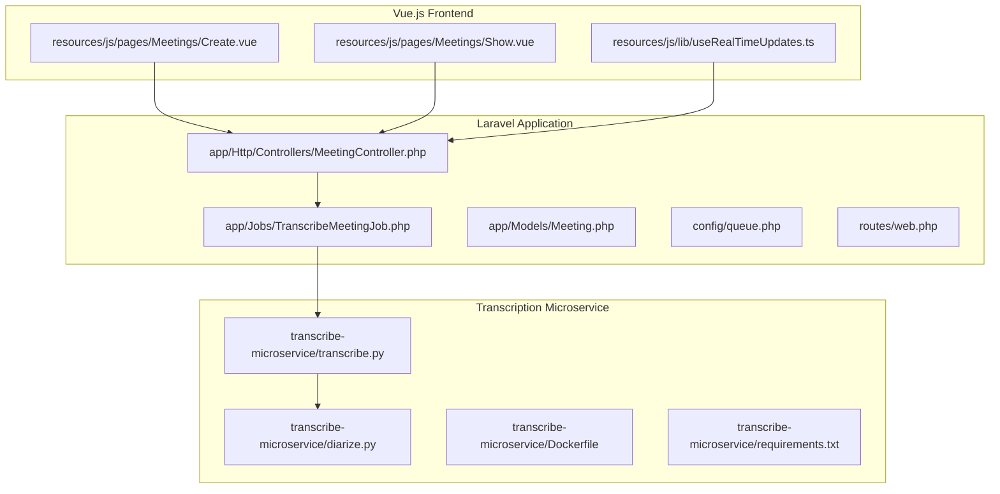
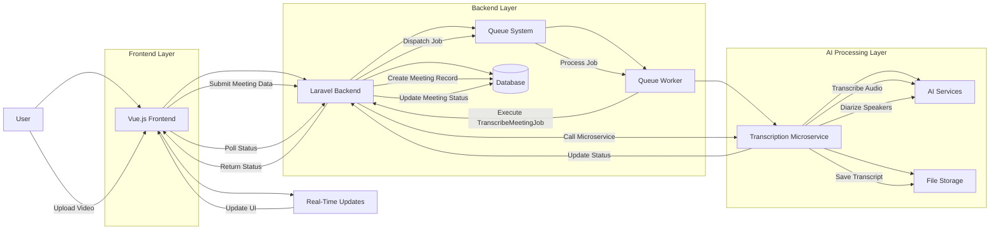
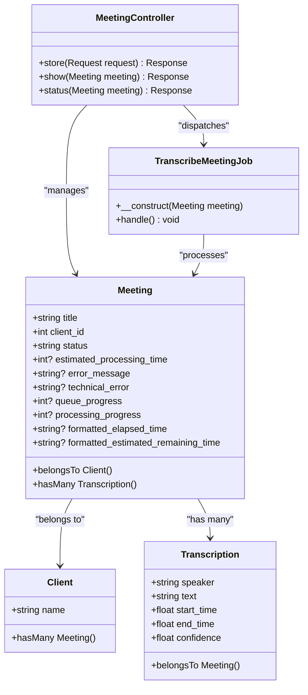
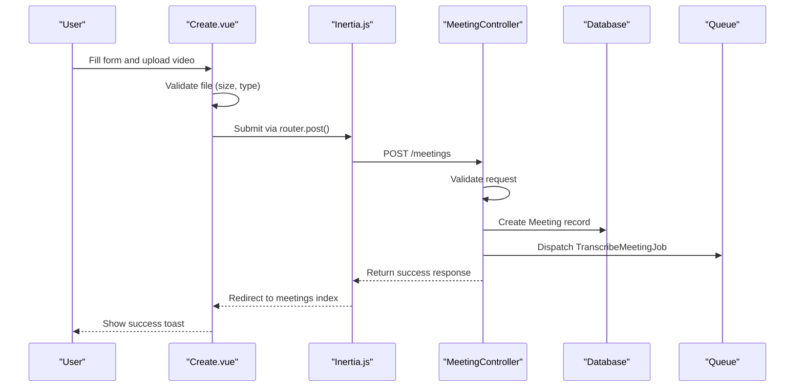
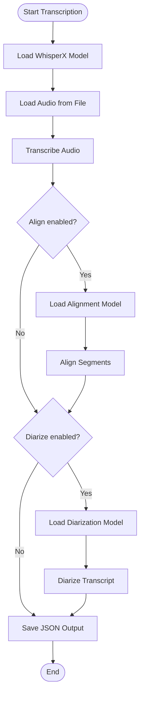
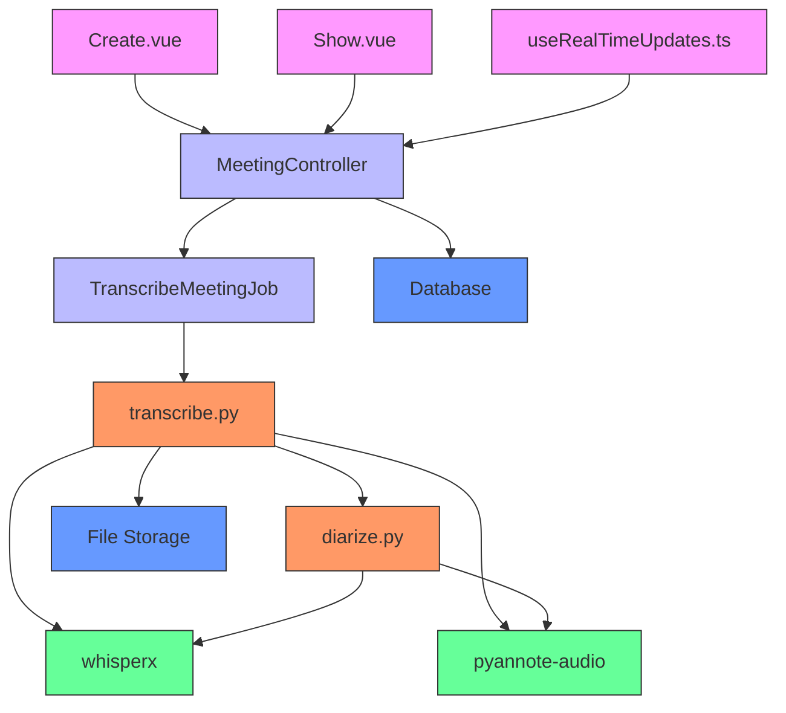

# Architecture Overview

## Table of Contents
1. [Introduction](#introduction)
2. [Project Structure](#project-structure)
3. [Core Components](#core-components)
4. [Architecture Overview](#architecture-overview)
5. [Detailed Component Analysis](#detailed-component-analysis)
6. [Dependency Analysis](#dependency-analysis)
7. [Performance Considerations](#performance-considerations)
8. [Troubleshooting Guide](#troubleshooting-guide)
9. [Conclusion](#conclusion)

## Introduction
The meetingai application is a full-stack web platform designed to automate the transcription and analysis of meeting videos using AI-powered speech recognition and speaker diarization. The system enables users to upload video files, which are then processed asynchronously through a dedicated Python microservice container. The architecture follows a modern separation of concerns, combining a Laravel backend with a Vue.js frontend via Inertia.js, and offloading computationally intensive transcription tasks to a Dockerized Python service using WhisperX and PyAnnote. This document provides a comprehensive overview of the system's architecture, component interactions, data flow, and key design patterns.

## Project Structure
The project follows a conventional Laravel application structure with clear separation between backend and frontend code, and a dedicated microservice for transcription processing.

**Diagram sources**
- [MeetingController.php](file://app/Http/Controllers/MeetingController.php#L1-L200)
- [TranscribeMeetingJob.php](file://app/Jobs/TranscribeMeetingJob.php#L1-L50)
- [Create.vue](file://resources/js/pages/Meetings/Create.vue#L1-L438)
- [Show.vue](file://resources/js/pages/Meetings/Show.vue#L1-L343)
- [transcribe.py](file://transcribe-microservice/transcribe.py#L1-L200)
- [diarize.py](file://transcribe-microservice/diarize.py#L1-L130)
- [Dockerfile](file://transcribe-microservice/Dockerfile#L1-L53)

**Section sources**
- [MeetingController.php](file://app/Http/Controllers/MeetingController.php#L1-L200)
- [Create.vue](file://resources/js/pages/Meetings/Create.vue#L1-L438)
- [transcribe.py](file://transcribe-microservice/transcribe.py#L1-L200)

## Core Components
The meetingai application consists of three primary architectural components: a Laravel backend that handles business logic and API routing, a Vue.js frontend with Inertia.js integration for dynamic user interfaces, and a Dockerized Python microservice responsible for AI-powered transcription and speaker diarization. The Laravel backend implements the MVC pattern with MeetingController handling HTTP requests, Meeting model managing database interactions, and TranscribeMeetingJob orchestrating asynchronous processing. The frontend uses Vue.js components like Create.vue and Show.vue to manage user interactions, while useRealTimeUpdates.ts provides real-time status polling. The transcription microservice, built with WhisperX and PyAnnote, runs in isolation via Docker, ensuring scalability and technology independence for the computationally intensive AI processing tasks.

**Section sources**
- [MeetingController.php](file://app/Http/Controllers/MeetingController.php#L1-L200)
- [Create.vue](file://resources/js/pages/Meetings/Create.vue#L1-L438)
- [Show.vue](file://resources/js/pages/Meetings/Show.vue#L1-L343)
- [useRealTimeUpdates.ts](file://resources/js/lib/useRealTimeUpdates.ts#L1-L87)
- [transcribe.py](file://transcribe-microservice/transcribe.py#L1-L200)

## Architecture Overview
The meetingai application follows a service-oriented architecture with clear separation between the web application and the AI processing microservice. The system is designed for asynchronous processing of large video files, using a queue-based workflow to ensure responsiveness and reliability.

**Diagram sources**
- [MeetingController.php](file://app/Http/Controllers/MeetingController.php#L1-L200)
- [TranscribeMeetingJob.php](file://app/Jobs/TranscribeMeetingJob.php#L1-L50)
- [Create.vue](file://resources/js/pages/Meetings/Create.vue#L1-L438)
- [Show.vue](file://resources/js/pages/Meetings/Show.vue#L1-L343)
- [useRealTimeUpdates.ts](file://resources/js/lib/useRealTimeUpdates.ts#L1-L87)
- [transcribe.py](file://transcribe-microservice/transcribe.py#L1-L200)

## Detailed Component Analysis

### Backend MVC Architecture
The Laravel backend implements a classic Model-View-Controller pattern, with the MeetingController serving as the primary entry point for meeting-related operations.

#### Class Diagram: Backend Models and Controllers

**Diagram sources**
- [MeetingController.php](file://app/Http/Controllers/MeetingController.php#L1-L200)
- [TranscribeMeetingJob.php](file://app/Jobs/TranscribeMeetingJob.php#L1-L50)
- [Meeting.php](file://app/Models/Meeting.php#L1-L30)
- [Client.php](file://app/Models/Client.php#L1-L15)
- [Transcription.php](file://app/Models/Transcription.php#L1-L20)

**Section sources**
- [MeetingController.php](file://app/Http/Controllers/MeetingController.php#L1-L200)
- [TranscribeMeetingJob.php](file://app/Jobs/TranscribeMeetingJob.php#L1-L50)
- [Meeting.php](file://app/Models/Meeting.php#L1-L30)

### Frontend Component Architecture
The frontend uses a component-based architecture with Vue.js, leveraging Inertia.js for seamless integration with the Laravel backend. Key components include Create.vue for uploading meetings and Show.vue for viewing processed results with synchronized video playback.

#### Sequence Diagram: Meeting Upload Flow

**Diagram sources**
- [Create.vue](file://resources/js/pages/Meetings/Create.vue#L1-L438)
- [MeetingController.php](file://app/Http/Controllers/MeetingController.php#L1-L200)

**Section sources**
- [Create.vue](file://resources/js/pages/Meetings/Create.vue#L1-L438)
- [MeetingController.php](file://app/Http/Controllers/MeetingController.php#L1-L200)

### Transcription Microservice
The transcription microservice is a Dockerized Python application that performs speech-to-text transcription and speaker diarization using state-of-the-art AI models. It runs in isolation from the main web application, communicating via file system and API calls.

#### Flowchart: Transcription Processing Pipeline

**Diagram sources**
- [transcribe.py](file://transcribe-microservice/transcribe.py#L1-L200)
- [diarize.py](file://transcribe-microservice/diarize.py#L1-L130)

**Section sources**
- [transcribe.py](file://transcribe-microservice/transcribe.py#L1-L200)
- [diarize.py](file://transcribe-microservice/diarize.py#L1-L130)

## Dependency Analysis
The system has well-defined dependencies between components, with minimal coupling between the web application and the transcription microservice.

**Diagram sources**
- [Create.vue](file://resources/js/pages/Meetings/Create.vue#L1-L438)
- [MeetingController.php](file://app/Http/Controllers/MeetingController.php#L1-L200)
- [TranscribeMeetingJob.php](file://app/Jobs/TranscribeMeetingJob.php#L1-L50)
- [transcribe.py](file://transcribe-microservice/transcribe.py#L1-L200)
- [diarize.py](file://transcribe-microservice/diarize.py#L1-L130)
- [requirements.txt](file://transcribe-microservice/requirements.txt#L1-L8)

**Section sources**
- [transcribe.py](file://transcribe-microservice/transcribe.py#L1-L200)
- [requirements.txt](file://transcribe-microservice/requirements.txt#L1-L8)

## Performance Considerations
The architecture is designed to handle computationally intensive video processing tasks efficiently. Large video files are processed asynchronously to prevent blocking the main application, with status updates provided through real-time polling. The transcription microservice can be scaled independently based on processing load, and supports both CPU and GPU execution through Docker configuration. For large meetings, the system provides estimated processing times and progress indicators to maintain a good user experience. The use of a queue system ensures that multiple transcription jobs can be processed in order, with worker processes that can be scaled horizontally. File size is limited to 500MB to balance processing time and storage requirements, while minimum size requirements prevent processing of invalid or empty files.

## Troubleshooting Guide
The system includes comprehensive error handling at multiple levels. During upload, Create.vue validates file type, size, and required fields before submission. The MeetingController performs server-side validation and handles file storage. The TranscribeMeetingJob includes error catching and status updates in case of processing failures. The transcription microservice logs detailed error messages and continues processing even if diarization fails. Users can view error details in the Show.vue interface, including technical error messages and retry options. Common issues include unsupported video formats, network interruptions during upload, and AI model loading failures. The system provides user-friendly error messages and recovery options, including retry mechanisms and detailed technical information for developers. Monitoring the queue system and worker processes is essential for maintaining system reliability, especially under heavy load.

**Section sources**
- [Create.vue](file://resources/js/pages/Meetings/Create.vue#L1-L438)
- [MeetingController.php](file://app/Http/Controllers/MeetingController.php#L1-L200)
- [TranscribeMeetingJob.php](file://app/Jobs/TranscribeMeetingJob.php#L1-L50)
- [Show.vue](file://resources/js/pages/Meetings/Show.vue#L1-L343)
- [transcribe.py](file://transcribe-microservice/transcribe.py#L1-L200)

## Conclusion
The meetingai application demonstrates a well-architected, scalable solution for AI-powered meeting transcription. By separating concerns between the Laravel web application and the Dockerized Python microservice, the system achieves both maintainability and performance. The use of asynchronous job processing ensures a responsive user experience, while real-time status updates keep users informed during potentially long processing times. The component-based frontend provides an intuitive interface for uploading and viewing meetings with synchronized video and transcription playback. The architecture supports future enhancements, such as adding new AI models, supporting additional file formats, or implementing webhooks for status updates. Overall, the system effectively balances complexity, performance, and user experience in a demanding AI processing workflow.

**Referenced Files in This Document**   
- [MeetingController.php](file://app/Http/Controllers/MeetingController.php#L1-L200)
- [TranscribeMeetingJob.php](file://app/Jobs/TranscribeMeetingJob.php#L1-L50)
- [Meeting.php](file://app/Models/Meeting.php#L1-L30)
- [Create.vue](file://resources/js/pages/Meetings/Create.vue#L1-L438)
- [Show.vue](file://resources/js/pages/Meetings/Show.vue#L1-L343)
- [useRealTimeUpdates.ts](file://resources/js/lib/useRealTimeUpdates.ts#L1-L87)
- [transcribe.py](file://transcribe-microservice/transcribe.py#L1-L200)
- [diarize.py](file://transcribe-microservice/diarize.py#L1-L130)
- [Dockerfile](file://transcribe-microservice/Dockerfile#L1-L53)
- [requirements.txt](file://transcribe-microservice/requirements.txt#L1-L8)