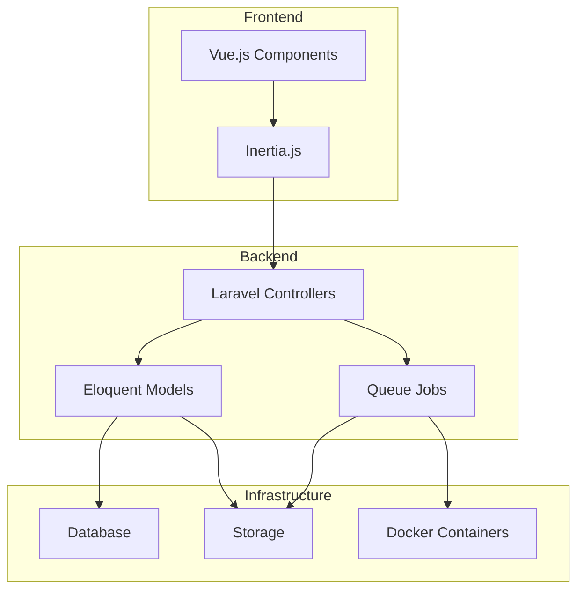
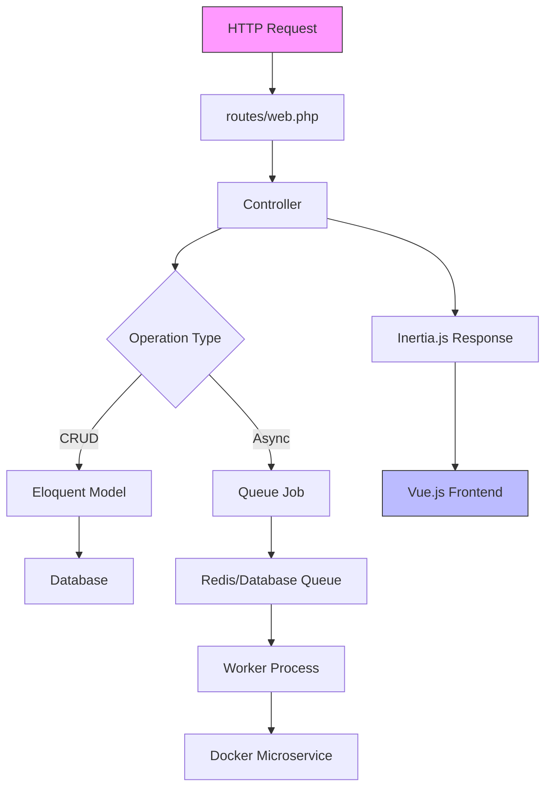
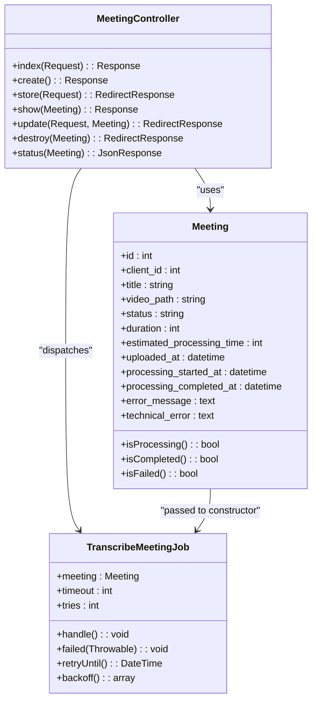
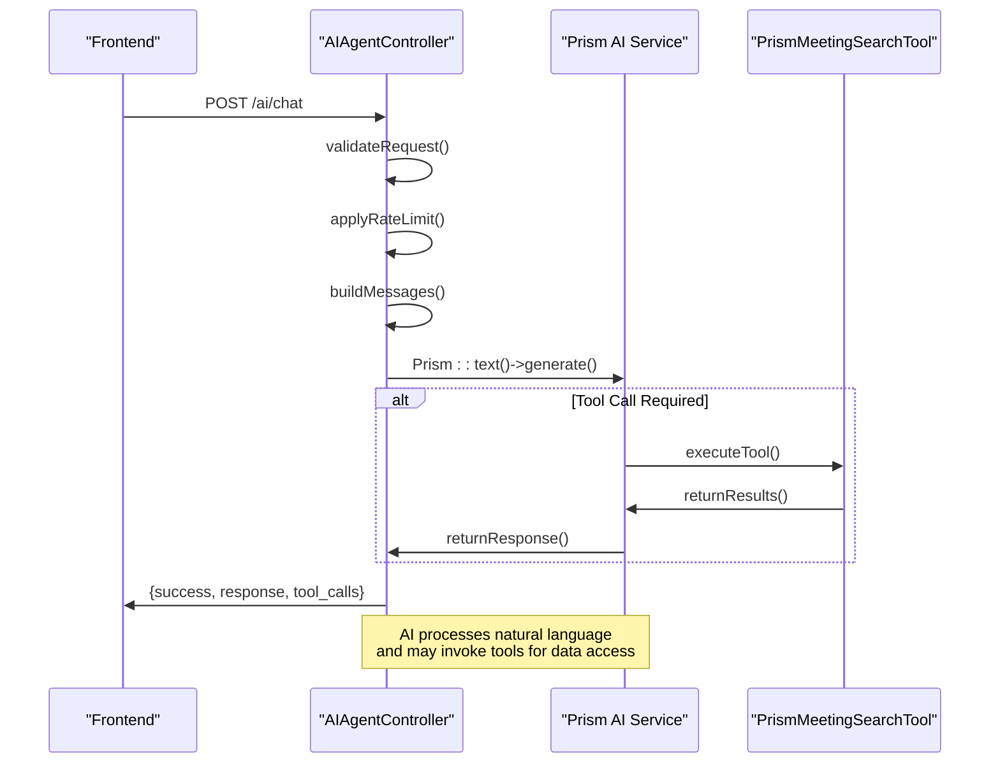
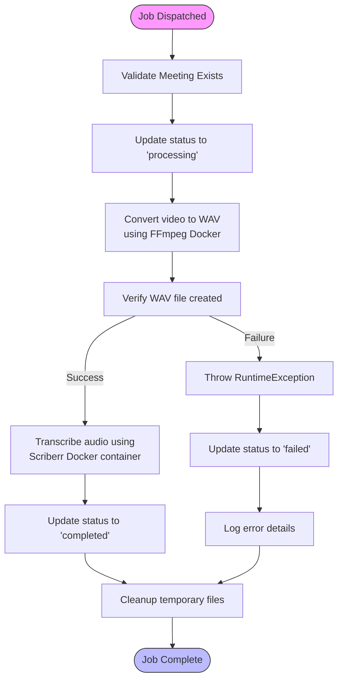
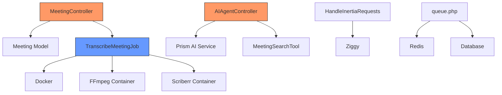
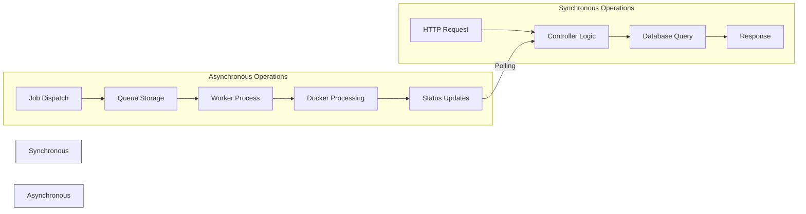

# Backend Architecture

## Table of Contents
1. [Introduction](#introduction)
2. [Project Structure](#project-structure)
3. [Core Components](#core-components)
4. [Architecture Overview](#architecture-overview)
5. [Detailed Component Analysis](#detailed-component-analysis)
6. [Dependency Analysis](#dependency-analysis)
7. [Performance Considerations](#performance-considerations)
8. [Troubleshooting Guide](#troubleshooting-guide)
9. [Conclusion](#conclusion)

## Introduction
The meetingai application is a Laravel-based backend system designed to manage meeting recordings, transcribe audio content, and provide AI-powered search capabilities over meeting content. The architecture follows the Model-View-Controller (MVC) pattern with Inertia.js enabling seamless integration between the Laravel backend and Vue.js frontend. The system handles large video files through asynchronous processing via Laravel's queue system, with Redis or database drivers configured in the queue.php file. Key components include meeting lifecycle management, AI agent interactions, and transcription processing workflows that leverage Docker containers for media processing.

## Project Structure
The project follows a standard Laravel directory structure with clear separation of concerns. The `app/Http/Controllers` directory contains controllers handling HTTP requests, `app/Models` contains Eloquent models managing data relationships, and `app/Jobs` contains queued jobs for asynchronous processing. The `resources/js` directory contains Vue.js components that render views via Inertia.js, while `routes/web.php` defines all application endpoints. Database schema is managed through migrations in `database/migrations`, and configuration files in the `config` directory control system behavior.

**Diagram sources**
- [web.php](file://routes/web.php#L1-L47)
- [MeetingController.php](file://app/Http/Controllers/MeetingController.php#L1-L305)

**Section sources**
- [MeetingController.php](file://app/Http/Controllers/MeetingController.php#L1-L305)
- [AIAgentController.php](file://app/Http/Controllers/AIAgentController.php#L1-L183)

## Core Components
The core components of the meetingai application include the MeetingController for managing meeting lifecycle operations, AIAgentController for handling AI interactions, TranscribeMeetingJob for asynchronous transcription processing, and Eloquent models (Meeting, Transcription, Client) for data management. The system uses Inertia.js to render Vue.js components from Laravel controllers, creating a seamless single-page application experience. Laravel's queue system enables background processing of video files through Dockerized microservices, while the HandleInertiaRequests middleware facilitates data sharing between backend and frontend.

**Section sources**
- [MeetingController.php](file://app/Http/Controllers/MeetingController.php#L1-L305)
- [AIAgentController.php](file://app/Http/Controllers/AIAgentController.php#L1-L183)
- [TranscribeMeetingJob.php](file://app/Jobs/TranscribeMeetingJob.php#L1-L400)

## Architecture Overview
The meetingai application follows a layered architecture with clear separation between presentation, business logic, and data access layers. HTTP requests enter through routes defined in web.php, which route to controller actions in the MVC pattern. Controllers handle request validation, business logic, and response formatting, while Eloquent models manage database interactions and relationships. For long-running operations like video transcription, controllers dispatch jobs to Laravel's queue system, which processes them asynchronously using configured drivers (database or Redis). The Inertia.js integration allows controllers to return Vue.js components directly, creating a hybrid server-client architecture.

**Diagram sources**
- [web.php](file://routes/web.php#L1-L47)
- [MeetingController.php](file://app/Http/Controllers/MeetingController.php#L1-L305)
- [TranscribeMeetingJob.php](file://app/Jobs/TranscribeMeetingJob.php#L1-L400)

## Detailed Component Analysis

### MeetingController Analysis
The MeetingController handles all meeting lifecycle operations including creation, listing, updating, and deletion. It implements comprehensive validation for meeting uploads, ensuring video files meet size and format requirements. The controller uses Eloquent's query builder for efficient database queries with filtering and sorting capabilities. Upon successful upload, it creates a meeting record and dispatches the TranscribeMeetingJob for asynchronous processing.

**Diagram sources**
- [MeetingController.php](file://app/Http/Controllers/MeetingController.php#L1-L305)
- [Meeting.php](file://app/Models/Meeting.php#L1-L179)
- [TranscribeMeetingJob.php](file://app/Jobs/TranscribeMeetingJob.php#L1-L400)

**Section sources**
- [MeetingController.php](file://app/Http/Controllers/MeetingController.php#L1-L305)
- [Meeting.php](file://app/Models/Meeting.php#L1-L179)

### AIAgentController Analysis
The AIAgentController manages AI interactions through two primary endpoints: chat and search. The chat method processes natural language queries using the Prism AI service with rate limiting to prevent abuse. It constructs a conversation history with system, user, and assistant messages, then calls the AI service with appropriate tools for meeting search. The search method provides direct access to meeting content search functionality, validating input parameters and returning structured results.

**Diagram sources**
- [AIAgentController.php](file://app/Http/Controllers/AIAgentController.php#L1-L183)
- [PrismMeetingSearchTool.php](file://app/Tools/PrismMeetingSearchTool.php#L1-L100)

**Section sources**
- [AIAgentController.php](file://app/Http/Controllers/AIAgentController.php#L1-L183)

### TranscribeMeetingJob Analysis
The TranscribeMeetingJob implements asynchronous processing of meeting videos through a multi-step workflow. It first converts video files to WAV format using FFmpeg in a Docker container, then transcribes the audio using a specialized transcription microservice. The job includes comprehensive error handling, retry logic, and cleanup procedures. It updates the meeting status throughout processing and stores error details for troubleshooting.

**Diagram sources**
- [TranscribeMeetingJob.php](file://app/Jobs/TranscribeMeetingJob.php#L1-L400)
- [transcribe.py](file://transcribe-microservice/transcribe.py#L1-L200)

**Section sources**
- [TranscribeMeetingJob.php](file://app/Jobs/TranscribeMeetingJob.php#L1-L400)

## Dependency Analysis
The meetingai application has a well-defined dependency structure with clear separation between components. The frontend depends on Inertia.js to receive data from Laravel controllers, while the backend controllers depend on Eloquent models for data access. The TranscribeMeetingJob depends on Docker for containerized execution of media processing tasks. Configuration files in the config directory control dependencies on external services like Redis for queuing and SMTP for email.

**Diagram sources**
- [queue.php](file://config/queue.php#L1-L113)
- [HandleInertiaRequests.php](file://app/Http/Middleware/HandleInertiaRequests.php#L1-L68)
- [TranscribeMeetingJob.php](file://app/Jobs/TranscribeMeetingJob.php#L1-L400)

**Section sources**
- [queue.php](file://config/queue.php#L1-L113)
- [HandleInertiaRequests.php](file://app/Http/Middleware/HandleInertiaRequests.php#L1-L68)

## Performance Considerations
The meetingai application employs several strategies to handle performance challenges, particularly with large video processing workloads. Synchronous operations are limited to CRUD operations and simple queries, while resource-intensive video processing is handled asynchronously through queued jobs. The system uses database indexing on frequently queried fields (client_id, status, uploaded_at) to optimize query performance. For real-time status updates, the frontend polls the status endpoint every 2 seconds, balancing freshness with server load.

The asynchronous processing model provides significant advantages for scalability. By offloading video transcription to background jobs, the main application remains responsive to user requests. The queue system can be scaled horizontally by adding worker processes, and Redis can be used as a high-performance queue driver for heavy workloads. The Docker-based processing architecture allows for easy scaling of transcription capacity by adding more worker nodes.

**Diagram sources**
- [MeetingController.php](file://app/Http/Controllers/MeetingController.php#L1-L305)
- [TranscribeMeetingJob.php](file://app/Jobs/TranscribeMeetingJob.php#L1-L400)
- [queue.php](file://config/queue.php#L1-L113)

## Troubleshooting Guide
The meetingai application includes comprehensive error handling and logging to facilitate troubleshooting. Controller actions use Laravel's validation system to provide user-friendly error messages for input issues. The TranscribeMeetingJob includes detailed error handling with user-friendly messages mapped to technical errors. All errors are logged with context for debugging, and failed jobs are recorded in the failed_jobs table.

Common issues and their solutions:
- **Video upload fails**: Check file size (max 500MB), format (MP4, MOV, AVI, WebM), and available disk space
- **Transcription fails**: Verify Docker is running, check container logs, ensure sufficient CPU and memory
- **AI chat rate limited**: Wait 1 minute before sending additional messages (10 requests per minute limit)
- **Database connection issues**: Verify database credentials in .env file and ensure database server is running
- **Queue processing stalled**: Check if queue workers are running (`php artisan queue:work`)

Error responses follow a consistent format with success/failure status, error messages, and appropriate HTTP status codes (422 for validation, 429 for rate limiting, 500 for server errors).

**Section sources**
- [MeetingController.php](file://app/Http/Controllers/MeetingController.php#L1-L305)
- [AIAgentController.php](file://app/Http/Controllers/AIAgentController.php#L1-L183)
- [TranscribeMeetingJob.php](file://app/Jobs/TranscribeMeetingJob.php#L1-L400)

## Conclusion
The meetingai application demonstrates a robust Laravel backend architecture that effectively handles the challenges of video processing and AI integration. By leveraging the MVC pattern with Inertia.js, the system provides a seamless user experience while maintaining clean separation of concerns. The asynchronous processing model using Laravel's queue system enables efficient handling of resource-intensive transcription tasks, with Docker providing isolation and scalability. Comprehensive error handling, validation, and logging ensure the system is maintainable and troubleshootable. The architecture is well-positioned to scale with increasing workloads through horizontal scaling of queue workers and optimization of the underlying infrastructure.

**Referenced Files in This Document**   
- [MeetingController.php](file://app/Http/Controllers/MeetingController.php)
- [AIAgentController.php](file://app/Http/Controllers/AIAgentController.php)
- [TranscribeMeetingJob.php](file://app/Jobs/TranscribeMeetingJob.php)
- [Meeting.php](file://app/Models/Meeting.php)
- [Transcription.php](file://app/Models/Transcription.php)
- [web.php](file://routes/web.php)
- [queue.php](file://config/queue.php)
- [HandleInertiaRequests.php](file://app/Http/Middleware/HandleInertiaRequests.php)
- [2025_08_10_135205_create_meetings_table.php](file://database/migrations/2025_08_10_135205_create_meetings_table.php)
- [2025_08_10_145951_add_estimated_processing_time_to_meetings_table.php](file://database/migrations/2025_08_10_145951_add_estimated_processing_time_to_meetings_table.php)
- [2025_08_10_160251_add_error_fields_to_meetings_table.php](file://database/migrations/2025_08_10_160251_add_error_fields_to_meetings_table.php)