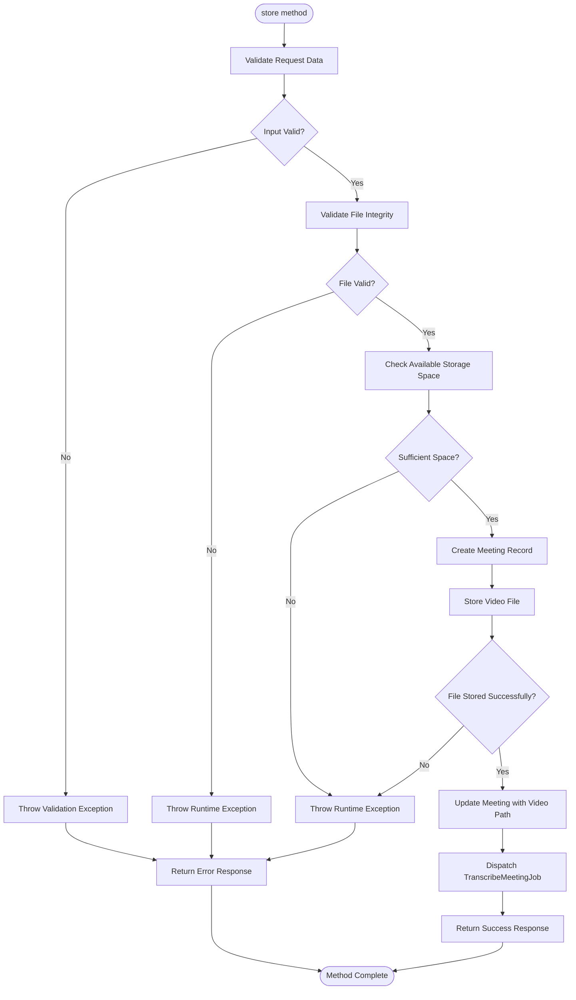
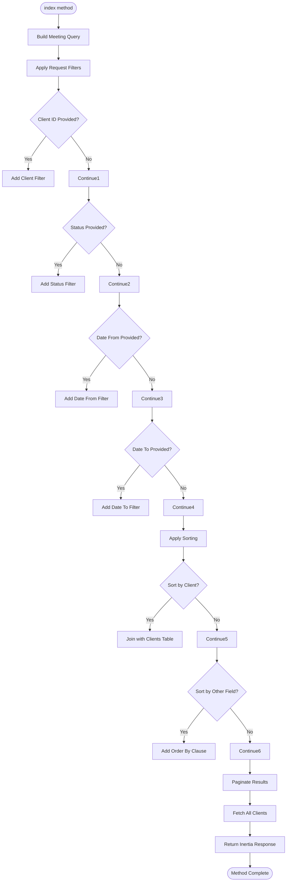
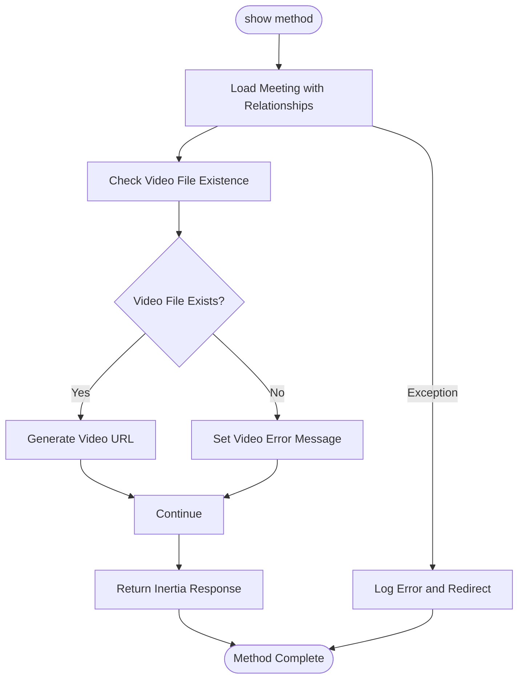
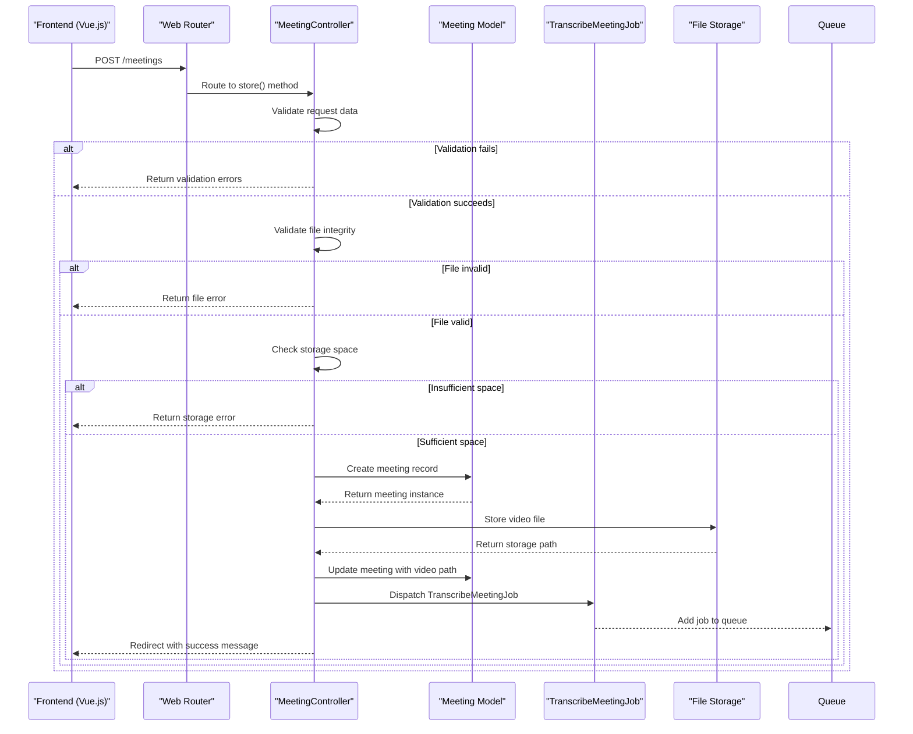
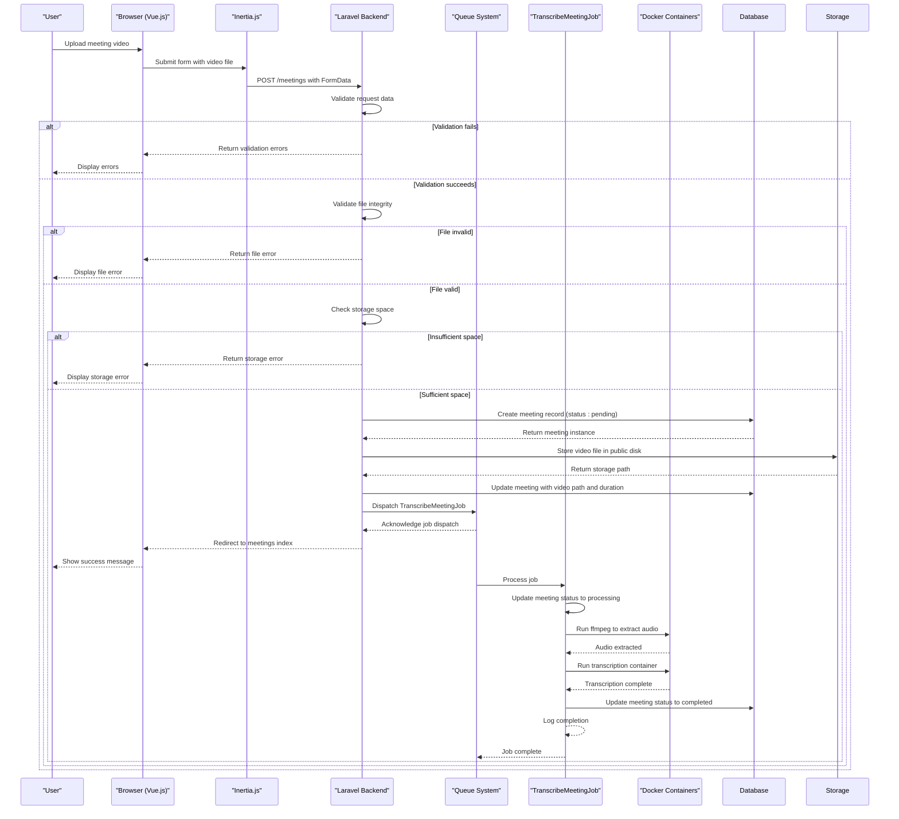
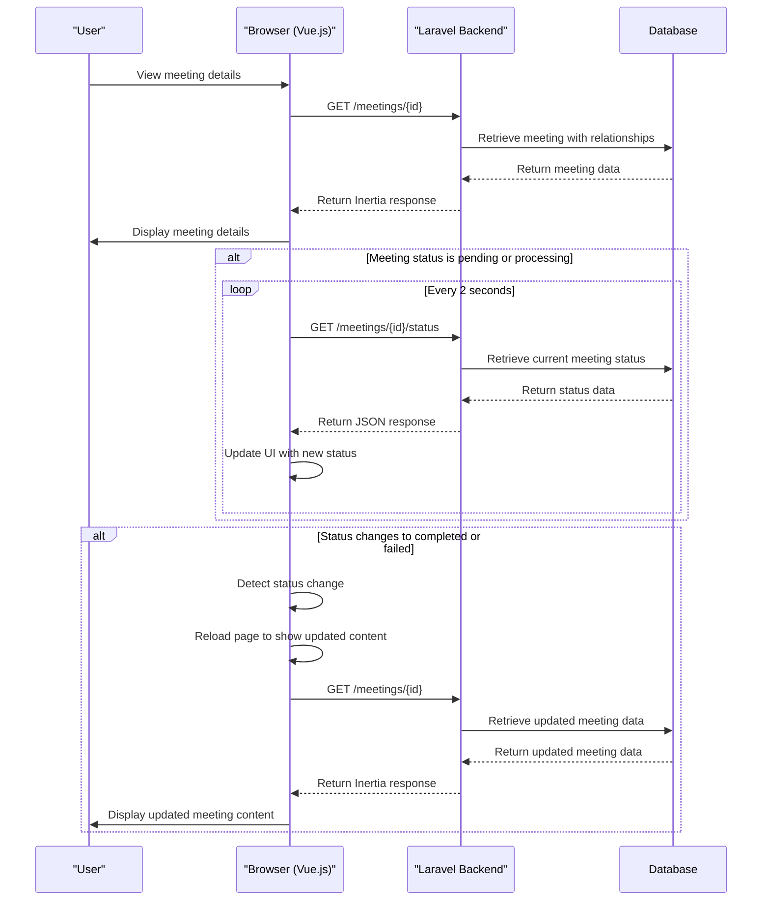

# Meeting Controller


## Table of Contents
1. [Introduction](#introduction)
2. [Core Responsibilities](#core-responsibilities)
3. [Public Methods Overview](#public-methods-overview)
4. [Request Validation and File Handling](#request-validation-and-file-handling)
5. [Meeting Creation Workflow](#meeting-creation-workflow)
6. [Meeting Listing and Filtering](#meeting-listing-and-filtering)
7. [Meeting Display and Real-Time Updates](#meeting-display-and-real-time-updates)
8. [Error Handling Strategies](#error-handling-strategies)
9. [Security Considerations](#security-considerations)
10. [Frontend Integration](#frontend-integration)
11. [Sequence Diagrams](#sequence-diagrams)
12. [Conclusion](#conclusion)

## Introduction
The MeetingController class is the central component responsible for managing the complete lifecycle of meetings within the meetingai application. It handles all HTTP requests related to meeting creation, listing, display, update, and deletion. The controller orchestrates the interaction between the frontend interface, backend models, and asynchronous processing jobs to provide a seamless user experience for uploading, processing, and viewing meeting recordings and their transcriptions.

**Section sources**
- [MeetingController.php](file://app/Http/Controllers/MeetingController.php#L0-L305)

## Core Responsibilities
The MeetingController manages the end-to-end meeting lifecycle with the following key responsibilities:

- **Meeting Creation**: Handles the upload of meeting video files through the store() method, validating input data and file integrity before creating database records.
- **Meeting Listing**: Provides the index() method to retrieve and display a paginated list of meetings with comprehensive filtering and sorting capabilities.
- **Meeting Display**: Implements the show() method to present detailed information about individual meetings, including video playback and transcription data.
- **Meeting Management**: Supports update and delete operations through dedicated controller methods.
- **Status Monitoring**: Offers a status() endpoint for real-time tracking of meeting processing progress.
- **Asynchronous Processing**: Integrates with the TranscribeMeetingJob to handle computationally intensive transcription tasks in the background.
- **Error Management**: Implements comprehensive error handling for various failure scenarios during the meeting processing pipeline.

The controller follows the Inertia.js pattern, returning Inertia responses that seamlessly integrate with the Vue.js frontend while maintaining server-side rendering benefits.

**Section sources**
- [MeetingController.php](file://app/Http/Controllers/MeetingController.php#L0-L305)

## Public Methods Overview

### store() Method
The store() method handles the creation of new meetings by processing uploaded video files. It performs comprehensive validation of form data, including required fields, client association, and file specifications. Upon successful validation, it creates a meeting record, stores the video file in organized storage, and dispatches the TranscribeMeetingJob for asynchronous processing.





**Diagram sources**
- [MeetingController.php](file://app/Http/Controllers/MeetingController.php#L50-L150)

**Section sources**
- [MeetingController.php](file://app/Http/Controllers/MeetingController.php#L50-L150)

### index() Method
The index() method retrieves a paginated list of meetings with support for multiple filtering and sorting options. It allows filtering by client, status, and date range, while supporting sorting by various attributes including uploaded date, title, client, status, and duration.





**Diagram sources**
- [MeetingController.php](file://app/Http/Controllers/MeetingController.php#L20-L50)

**Section sources**
- [MeetingController.php](file://app/Http/Controllers/MeetingController.php#L20-L50)

### show() Method
The show() method displays detailed information about a specific meeting, including video playback capabilities and transcription data. It handles video file existence verification and provides appropriate error messages when files are missing.





**Diagram sources**
- [MeetingController.php](file://app/Http/Controllers/MeetingController.php#L200-L250)

**Section sources**
- [MeetingController.php](file://app/Http/Controllers/MeetingController.php#L200-L250)

## Request Validation and File Handling
The MeetingController implements robust validation and file handling mechanisms to ensure data integrity and system reliability.

### Form Data Structure
The store() method expects the following form data structure for meeting upload:

:form_data_structure
- title: string (required, max 255 characters)
- client_id: integer (required, must reference existing client)
- video: file (required, specific types and size constraints)

### Validation Rules
The controller applies the following validation rules:

:validation_rules
- **Title**: Required string with maximum length of 255 characters
- **Client ID**: Required field that must reference an existing client record
- **Video File**: Required file with specific type, size, and integrity requirements

### File Validation
The controller performs multiple layers of file validation:

:file_validation_checks
- **File Type**: Restricted to MP4, MOV, AVI, and WebM formats
- **File Size**: Minimum 1MB, maximum 500MB
- **File Integrity**: Validates that the uploaded file is not corrupted
- **Storage Availability**: Checks for sufficient disk space before processing

### Client Association
Client association is enforced through database constraints and validation rules:

:client_association_enforcement
- The client_id field must reference an existing client record in the database
- The validation rule 'exists:clients,id' ensures referential integrity
- The Meeting model establishes a BelongsTo relationship with the Client model

**Section sources**
- [MeetingController.php](file://app/Http/Controllers/MeetingController.php#L50-L150)
- [Meeting.php](file://app/Models/Meeting.php#L0-L179)

## Meeting Creation Workflow
The meeting creation workflow involves a coordinated sequence of operations from request receipt to job dispatching.

### Request Flow
The complete request flow from route definition to job dispatching:





**Diagram sources**
- [MeetingController.php](file://app/Http/Controllers/MeetingController.php#L50-L150)
- [TranscribeMeetingJob.php](file://app/Jobs/TranscribeMeetingJob.php#L0-L400)

**Section sources**
- [MeetingController.php](file://app/Http/Controllers/MeetingController.php#L50-L150)

### Meeting Record Creation
When a valid meeting upload request is received, the controller creates a new Meeting record with initial status:

:meeting_record_creation
- **Status**: Set to 'pending' initially
- **Uploaded At**: Timestamp of upload
- **Video Path**: Initially empty, updated after file storage
- **Duration**: Estimated for initial display
- **Estimated Processing Time**: Calculated based on video duration

### Job Dispatching
After successfully creating the meeting record and storing the video file, the controller dispatches the TranscribeMeetingJob:

:job_dispatching_process
- The job is dispatched with the created Meeting instance
- The job will process the video asynchronously
- The meeting status will be updated to 'processing' by the job
- Users receive immediate feedback that the upload was successful

**Section sources**
- [MeetingController.php](file://app/Http/Controllers/MeetingController.php#L50-L150)
- [TranscribeMeetingJob.php](file://app/Jobs/TranscribeMeetingJob.php#L0-L400)

## Meeting Listing and Filtering
The index() method provides comprehensive meeting listing functionality with advanced filtering and sorting capabilities.

### Filtering Options
Users can filter meetings using the following criteria:

:filtering_options
- **Client**: Filter by specific client
- **Status**: Filter by meeting status (pending, processing, completed, failed)
- **Date Range**: Filter by upload date range
- **Combined Filters**: Multiple filters can be applied simultaneously

### Sorting Capabilities
The controller supports sorting by multiple attributes:

:sorting_capabilities
- **Uploaded Date**: Sort by upload timestamp
- **Title**: Sort alphabetically by meeting title
- **Client**: Sort by client name
- **Status**: Sort by meeting status
- **Duration**: Sort by meeting duration
- **Sort Direction**: Support for both ascending and descending order

### Pagination
The listing implements server-side pagination:

:pagination_details
- **Page Size**: 15 meetings per page
- **Query String Preservation**: Maintains filter and sort parameters in pagination links
- **Efficient Querying**: Uses Laravel's paginate() method for optimized database queries

**Section sources**
- [MeetingController.php](file://app/Http/Controllers/MeetingController.php#L20-L50)
- [Index.vue](file://resources/js/pages/Meetings/Index.vue#L0-L357)

## Meeting Display and Real-Time Updates
The show() method and related components provide a rich interface for viewing meeting details and tracking processing progress.

### Real-Time Status Updates
The controller supports real-time status monitoring through the status() endpoint:

:real_time_status_endpoint
- **Endpoint**: GET /meetings/{meeting}/status
- **Response Format**: JSON with current status and progress metrics
- **Polling Mechanism**: Frontend polls this endpoint every 2 seconds for pending/processing meetings
- **Progress Metrics**: Includes elapsed time, estimated remaining time, and processing progress percentage

### Status Badge and Progress Indicator
The frontend components provide visual feedback on meeting status:

:status_visual_components
- **Pending**: Blue badge with queue progress indicator
- **Processing**: Yellow badge with processing progress indicator
- **Completed**: Green badge with completion details
- **Failed**: Red badge with error information

### Video Player Integration
The Show.vue component integrates a video player with transcription synchronization:

:video_player_features
- **Synchronized Playback**: Video playback synchronized with transcription display
- **Timestamp Navigation**: Clicking on transcription timestamps seeks to corresponding video position
- **Navigation Controls**: Previous/next buttons for navigating between transcription segments
- **Error Handling**: Graceful handling of video loading and playback errors

**Section sources**
- [MeetingController.php](file://app/Http/Controllers/MeetingController.php#L200-L305)
- [Show.vue](file://resources/js/pages/Meetings/Show.vue#L0-L344)

## Error Handling Strategies
The MeetingController implements comprehensive error handling for various failure scenarios.

### Upload Failures
Handling of upload-related failures:

:upload_failure_handling
- **Validation Errors**: Return to form with input preserved and specific error messages
- **File Integrity Issues**: Detect and report corrupted or invalid files
- **Storage Space Issues**: Check available disk space and report insufficient storage
- **File Storage Failures**: Handle cases where file storage fails despite available space

### Validation Errors
The controller provides user-friendly validation error messages:

:validation_error_messages
- **Title Required**: "Please enter a meeting title."
- **Title Too Long**: "Meeting title cannot exceed 255 characters."
- **Client Required**: "Please select a client for this meeting."
- **Invalid Client**: "The selected client is invalid."
- **Video Required**: "Please select a video file to upload."
- **Invalid File**: "The uploaded file is not valid."
- **Wrong File Type**: "The video must be a file of type: MP4, MOV, AVI, or WebM."
- **File Too Large**: "The video file size cannot exceed 500MB."
- **File Too Small**: "The video file must be at least 1MB."

### Processing Exceptions
Handling of exceptions during the processing pipeline:

:processing_exception_handling
- **Transaction Safety**: Meeting records are deleted if subsequent steps fail
- **Comprehensive Logging**: All errors are logged with context for debugging
- **User-Friendly Messages**: Technical errors are translated into user-friendly messages
- **Graceful Degradation**: System continues to function despite individual meeting failures

**Section sources**
- [MeetingController.php](file://app/Http/Controllers/MeetingController.php#L50-L150)
- [TranscribeMeetingJob.php](file://app/Jobs/TranscribeMeetingJob.php#L0-L400)

## Security Considerations
The MeetingController implements several security measures to protect the application and user data.

### User Authorization
While not explicitly shown in the provided code, proper authorization should be implemented:

:authorization_requirements
- **Authentication**: Ensure users are authenticated before accessing meeting endpoints
- **Authorization**: Verify that users have permission to access, create, or modify meetings
- **Client Access Control**: Ensure users can only access meetings for clients they are authorized to view

### File Type Validation
Robust file type validation prevents security risks:

:file_type_validation_security
- **MIME Type Checking**: Validate file types based on MIME types, not just file extensions
- **File Integrity Verification**: Check that uploaded files are valid and not corrupted
- **File Size Limits**: Prevent denial-of-service attacks through resource exhaustion
- **Secure Storage**: Store files in a location not directly accessible via web requests

### Input Sanitization
The controller leverages Laravel's built-in security features:

:input_sanitization_measures
- **Automatic XSS Protection**: Laravel automatically escapes output in Blade templates
- **CSRF Protection**: Inertia.js integration includes CSRF token handling
- **SQL Injection Prevention**: Eloquent ORM protects against SQL injection
- **File Path Security**: Proper handling of file paths to prevent directory traversal attacks

**Section sources**
- [MeetingController.php](file://app/Http/Controllers/MeetingController.php#L50-L150)

## Frontend Integration
The MeetingController integrates seamlessly with the Vue.js frontend through Inertia.js.

### Inertia.js Responses
The controller returns Inertia responses that integrate with the Vue.js frontend:

:inertia_response_structure
- **Index Method**: Returns meetings list and clients for filtering
- **Create Method**: Returns clients list for client selection
- **Show Method**: Returns meeting details, video URL, and error information
- **Shared Data**: Leverages Inertia's shared data for consistent application state

### Form Integration
The Create.vue component integrates with the store() method:

:form_integration_details
- **Multipart Form**: Uses enctype="multipart/form-data" for file uploads
- **Progress Indicators**: Shows upload progress during file transfer
- **Error Display**: Displays validation errors inline with form fields
- **Drag and Drop**: Supports drag-and-drop file upload with visual feedback
- **File Validation**: Client-side validation complements server-side validation

### Route Integration
The web.php routes file maps URLs to controller methods:


```php
Route::middleware(['auth'])->group(function () {
    Route::resource('meetings', MeetingController::class);
    Route::get('/meetings/{meeting}/status', [MeetingController::class, 'status']);
});
```


**Diagram sources**
- [web.php](file://routes/web.php#L0-L50)
- [Create.vue](file://resources/js/pages/Meetings/Create.vue#L0-L439)
- [MeetingController.php](file://app/Http/Controllers/MeetingController.php#L0-L305)

**Section sources**
- [MeetingController.php](file://app/Http/Controllers/MeetingController.php#L0-L305)
- [Create.vue](file://resources/js/pages/Meetings/Create.vue#L0-L439)
- [web.php](file://routes/web.php#L0-L50)

## Sequence Diagrams

### Meeting Upload and Processing Flow




**Diagram sources**
- [MeetingController.php](file://app/Http/Controllers/MeetingController.php#L50-L150)
- [TranscribeMeetingJob.php](file://app/Jobs/TranscribeMeetingJob.php#L0-L400)

### Real-Time Status Update Flow




**Diagram sources**
- [MeetingController.php](file://app/Http/Controllers/MeetingController.php#L200-L305)
- [Show.vue](file://resources/js/pages/Meetings/Show.vue#L0-L344)

## Conclusion
The MeetingController is a comprehensive and robust component that effectively manages the entire meeting lifecycle in the meetingai application. It provides a well-structured API for meeting creation, listing, and display, with comprehensive validation, error handling, and security measures. The integration with Inertia.js enables a seamless user experience, while the asynchronous processing model ensures responsive performance even with large video files. The controller's design follows Laravel best practices and demonstrates a clear separation of concerns between request handling, business logic, and job dispatching. With its support for filtering, sorting, and real-time status updates, the MeetingController provides a solid foundation for a scalable meeting management system.

**Section sources**
- [MeetingController.php](file://app/Http/Controllers/MeetingController.php#L0-L305)
- [TranscribeMeetingJob.php](file://app/Jobs/TranscribeMeetingJob.php#L0-L400)
- [Meeting.php](file://app/Models/Meeting.php#L0-L179)

**Referenced Files in This Document**   
- [MeetingController.php](file://app/Http/Controllers/MeetingController.php#L0-L305)
- [TranscribeMeetingJob.php](file://app/Jobs/TranscribeMeetingJob.php#L0-L400)
- [Meeting.php](file://app/Models/Meeting.php#L0-L179)
- [Create.vue](file://resources/js/pages/Meetings/Create.vue#L0-L439)
- [Index.vue](file://resources/js/pages/Meetings/Index.vue#L0-L357)
- [Show.vue](file://resources/js/pages/Meetings/Show.vue#L0-L344)
- [web.php](file://routes/web.php#L0-L50)