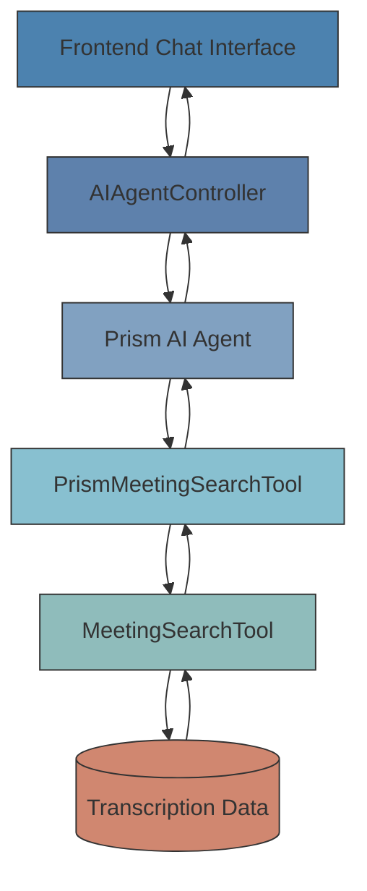
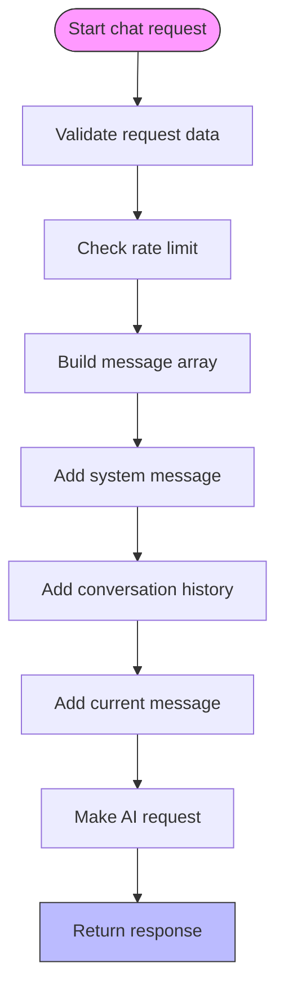
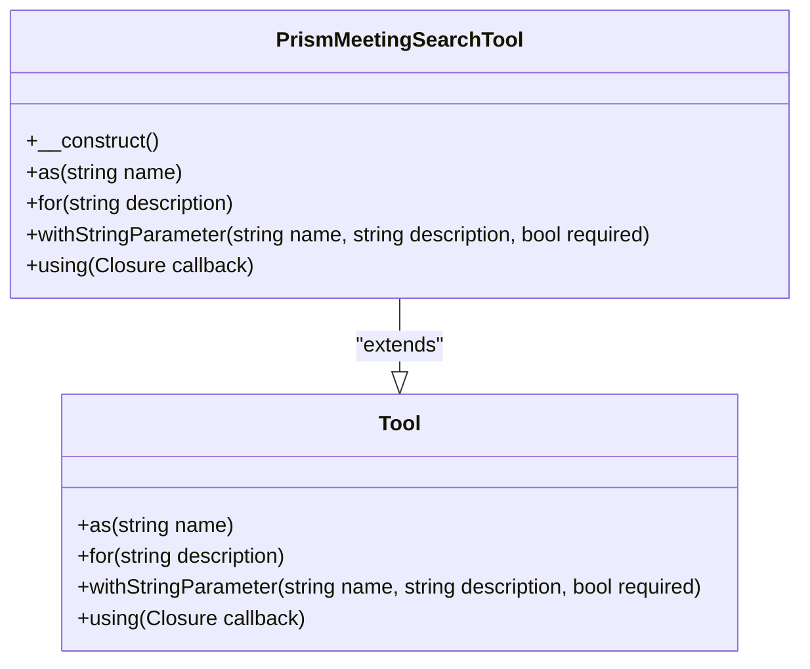
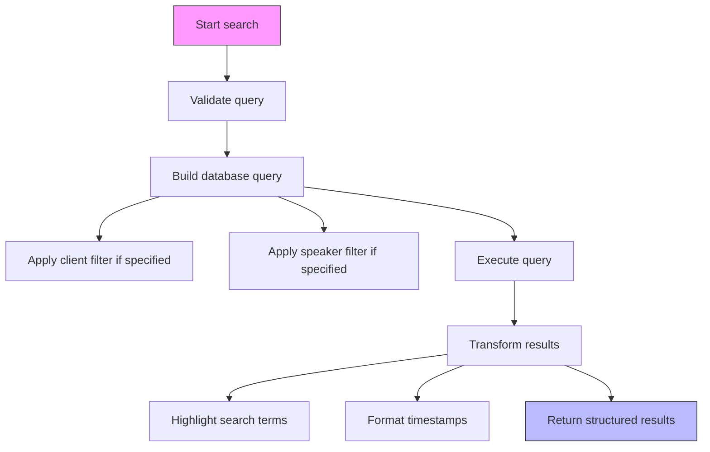
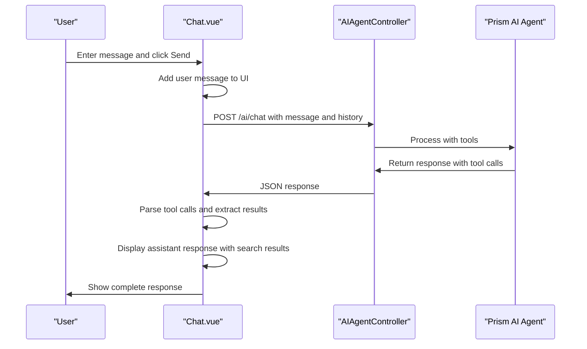
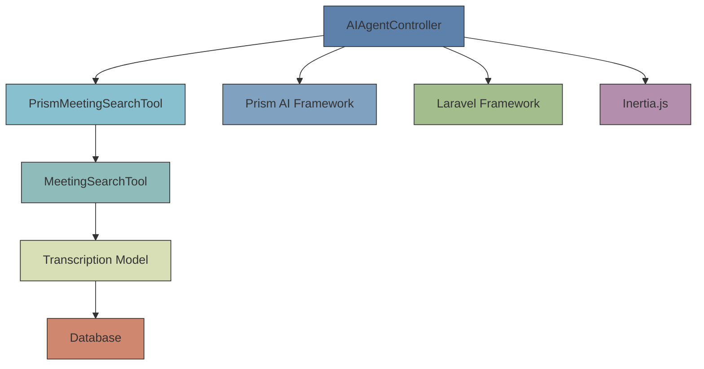

# AI Agent Controller


## Table of Contents
1. [Introduction](#introduction)
2. [Core Components](#core-components)
3. [Architecture Overview](#architecture-overview)
4. [Detailed Component Analysis](#detailed-component-analysis)
5. [Dependency Analysis](#dependency-analysis)
6. [Performance Considerations](#performance-considerations)
7. [Troubleshooting Guide](#troubleshooting-guide)

## Introduction
The AI Agent Controller is a central component of the meetingai application that enables natural language interaction with meeting transcription data. It provides an AI-powered chat interface that allows users to search through transcribed content using conversational queries. The system integrates with the Prism AI agent framework to process user requests, leverage specialized tools for contextual search, and return responses with relevant meeting excerpts. This document details the implementation of the `chat()` method, its integration with search tools, request validation, conversation management, and error handling strategies.

## Core Components
The AI Agent system consists of several interconnected components that work together to provide intelligent search capabilities over meeting transcription data. The core components include the AIAgentController which handles HTTP requests, the PrismMeetingSearchTool that acts as an AI tool interface, the MeetingSearchTool that performs actual database queries, and the frontend Chat.vue component that provides the user interface.

**Section sources**
- [AIAgentController.php](file://app/Http/Controllers/AIAgentController.php#L1-L183)
- [PrismMeetingSearchTool.php](file://app/Tools/PrismMeetingSearchTool.php#L1-L50)
- [MeetingSearchTool.php](file://app/Tools/MeetingSearchTool.php#L1-L86)
- [Chat.vue](file://resources/js/pages/AI/Chat.vue#L1-L307)

## Architecture Overview
The AI Agent system follows a layered architecture where user requests flow from the frontend interface through the controller layer to the AI agent system, which then utilizes specialized tools to access data and generate responses. The architecture enables natural language queries to be transformed into structured database searches against transcription data.





**Diagram sources**
- [AIAgentController.php](file://app/Http/Controllers/AIAgentController.php#L1-L183)
- [PrismMeetingSearchTool.php](file://app/Tools/PrismMeetingSearchTool.php#L1-L50)
- [MeetingSearchTool.php](file://app/Tools/MeetingSearchTool.php#L1-L86)

## Detailed Component Analysis

### AIAgentController Analysis
The AIAgentController class handles AI-powered interactions in the meetingai application, primarily through its `chat()` method which processes natural language queries and returns AI-generated responses with relevant meeting excerpts.

#### Request Validation and Rate Limiting
The `chat()` method implements comprehensive request validation to ensure data integrity and system stability. It validates that the message parameter is present, is a string, and does not exceed 1000 characters. The conversation history is validated as an array with a maximum of 50 items to prevent excessive memory usage.


```php
$request->validate([
    'message' => 'required|string|max:1000',
    'conversation_history' => 'array|max:50'
]);
```


The controller also implements rate limiting to prevent abuse, allowing a maximum of 10 requests per minute per IP address. This is implemented using Laravel's cache system with a key based on the client's IP address.


```php
$cacheKey = 'ai_chat_' . $request->ip();
$requestCount = cache()->get($cacheKey, 0);
if ($requestCount >= 10) {
    return response()->json([
        'success' => false,
        'error' => 'Too many requests. Please wait a moment before sending another message.'
    ], 429);
}
```


**Section sources**
- [AIAgentController.php](file://app/Http/Controllers/AIAgentController.php#L15-L40)

#### Conversation History Management
The controller manages conversation history by building a message array that includes system instructions, previous conversation history, and the current user message. It uses value objects from the Prism framework (SystemMessage, UserMessage, AssistantMessage) to structure the conversation context.





**Diagram sources**
- [AIAgentController.php](file://app/Http/Controllers/AIAgentController.php#L60-L100)

#### AI Integration and Response Processing
The controller integrates with the Prism AI agent system by configuring a text generation request with specific parameters. It uses the OpenRouter provider with the 'openai/gpt-oss-120b' model and includes the PrismMeetingSearchTool to enable contextual search capabilities.


```php
$response = Prism::text()
    ->using(Provider::OpenRouter, 'openai/gpt-oss-120b')
    ->withMessages($messages)
    ->withTools([new PrismMeetingSearchTool()])
    ->generate();
```


The response is processed to extract the AI-generated text and any tool calls that were executed during processing. Tool call information is transformed into a JSON-friendly format for frontend consumption.


```json
{
    "success": true,
    "response": "Found 2 results for 'budget':\n\n*Project Kickoff Meeting* (Acme Corp)\nSpeaker: John Smith at 12:34\nText: We need to finalize the **budget** allocation for Q3.\nLink: /meetings/1?t=754\n\n*Budget Review* (Acme Corp)\nSpeaker: Sarah Johnson at 05:22\nText: The marketing **budget** has been approved.\nLink: /meetings/2?t=322",
    "tool_calls": [
        {
            "name": "search_meetings",
            "arguments": {
                "query": "budget",
                "limit": 10
            }
        }
    ]
}
```


**Section sources**
- [AIAgentController.php](file://app/Http/Controllers/AIAgentController.php#L100-L150)

### Tool Integration Analysis

#### PrismMeetingSearchTool Implementation
The PrismMeetingSearchTool extends the Prism\Prism\Tool class and defines a search interface for the AI agent. It specifies the tool name, description, and parameters that can be used by the AI system when generating responses.





**Diagram sources**
- [PrismMeetingSearchTool.php](file://app/Tools/PrismMeetingSearchTool.php#L1-L50)

The tool is configured with four parameters:
- `query`: Required string parameter for the search query
- `client_id`: Optional string parameter to filter by client
- `speaker`: Optional string parameter to filter by speaker
- `limit`: Optional string parameter for maximum results (default: 10)

The tool's callback function processes these parameters, validates them, and delegates to the MeetingSearchTool for actual search execution.

**Section sources**
- [PrismMeetingSearchTool.php](file://app/Tools/PrismMeetingSearchTool.php#L1-L50)

#### MeetingSearchTool Implementation
The MeetingSearchTool provides the actual database search functionality by querying the Transcription model with various filters. It implements a static search method that accepts parameters and returns structured results.





**Diagram sources**
- [MeetingSearchTool.php](file://app/Tools/MeetingSearchTool.php#L1-L86)

The search implementation uses Laravel's query builder to filter transcriptions based on the search query (using LIKE operator), optional client ID, and optional speaker name. Results are ordered by start time and limited to the specified number of items.


```php
$results = Transcription::query()
    ->with(['meeting.client'])
    ->where('text', 'like', "%{$query}%")
    ->when($clientId, function ($q) use ($clientId) {
        return $q->whereHas('meeting', function ($q) use ($clientId) {
            $q->where('client_id', $clientId);
        });
    })
    ->when($speaker, function ($q) use ($speaker) {
        return $q->where('speaker', 'like', "%{$speaker}%");
    })
    ->orderBy('start_time', 'asc')
    ->limit($limit)
    ->get()
```


Each result is transformed to include meeting metadata, client information, speaker details, highlighted text, formatted timestamps, and deep links to the specific moment in the meeting.

**Section sources**
- [MeetingSearchTool.php](file://app/Tools/MeetingSearchTool.php#L1-L86)

### Frontend Integration Analysis
The frontend Chat.vue component provides the user interface for interacting with the AI agent. It manages the chat state, handles user input, and displays responses with embedded search results.

#### Request/Response Flow
The frontend implements a complete request/response cycle for AI interactions:





**Diagram sources**
- [Chat.vue](file://resources/js/pages/AI/Chat.vue#L1-L307)
- [AIAgentController.php](file://app/Http/Controllers/AIAgentController.php#L1-L183)

The component sends the current message along with the conversation history (excluding the current message) to maintain context across interactions. It implements retry logic with exponential backoff for network errors and displays appropriate error messages to users.

**Section sources**
- [Chat.vue](file://resources/js/pages/AI/Chat.vue#L1-L307)

## Dependency Analysis
The AI Agent system has several key dependencies that enable its functionality:





**Diagram sources**
- [AIAgentController.php](file://app/Http/Controllers/AIAgentController.php#L1-L183)
- [PrismMeetingSearchTool.php](file://app/Tools/PrismMeetingSearchTool.php#L1-L50)
- [MeetingSearchTool.php](file://app/Tools/MeetingSearchTool.php#L1-L86)
- [Transcription.php](file://app/Models/Transcription.php#L1-L49)

The system depends on the Prism AI framework for natural language processing capabilities, Laravel for backend infrastructure, and Inertia.js for seamless frontend integration. The configuration in config/prism.php specifies the OpenRouter provider with API credentials managed through environment variables.

**Section sources**
- [prism.php](file://config/prism.php#L1-L56)

## Performance Considerations
The AI Agent system implements several performance optimizations to handle latency-sensitive AI responses:

- **Rate Limiting**: Prevents abuse and ensures fair usage of AI resources
- **Request Validation**: Reduces processing overhead by rejecting invalid requests early
- **Caching**: Uses Laravel's cache system for rate limiting counters
- **Query Optimization**: The MeetingSearchTool uses database indexing-friendly queries with proper filtering
- **Timeout Handling**: Implements 30-second timeout on frontend requests to prevent hanging
- **Error Recovery**: Includes retry logic with exponential backoff for transient failures

For complex queries, the system may experience increased latency due to the AI processing time and database search operations. Monitoring is implemented through Laravel's logging system, which records processing time, message length, and response metrics for analysis.

## Troubleshooting Guide
The system implements comprehensive error handling to provide meaningful feedback to users and developers:

### Common Error Scenarios
- **429 Too Many Requests**: Triggered when rate limit is exceeded (more than 10 requests per minute)
- **408 Request Timeout**: Occurs when the AI service takes too long to respond
- **422 Validation Error**: Returned for invalid input data
- **500 Server Error**: Indicates internal server issues
- **503 Service Unavailable**: Network or service connectivity problems

### Error Response Examples

```json
{
    "success": false,
    "error": "Too many requests. Please wait a moment before sending another message."
}
```


```json
{
    "success": false,
    "error": "The request timed out. Please try again with a shorter message."
}
```


### Configuration Requirements
Ensure the following environment variables are set in the .env file:
- `OPENROUTER_API_KEY`: API key for OpenRouter service
- `PRISM_SERVER_ENABLED`: Set to true to enable Prism server routes
- Rate limiting and AI service timeouts can be adjusted in the AIAgentController code

**Section sources**
- [AIAgentController.php](file://app/Http/Controllers/AIAgentController.php#L150-L183)
- [prism.php](file://config/prism.php#L1-L56)
- [Chat.vue](file://resources/js/pages/AI/Chat.vue#L1-L307)

**Referenced Files in This Document**   
- [AIAgentController.php](file://app/Http/Controllers/AIAgentController.php#L1-L183)
- [PrismMeetingSearchTool.php](file://app/Tools/PrismMeetingSearchTool.php#L1-L50)
- [MeetingSearchTool.php](file://app/Tools/MeetingSearchTool.php#L1-L86)
- [prism.php](file://config/prism.php#L1-L56)
- [Chat.vue](file://resources/js/pages/AI/Chat.vue#L1-L307)
- [Transcription.php](file://app/Models/Transcription.php#L1-L49)