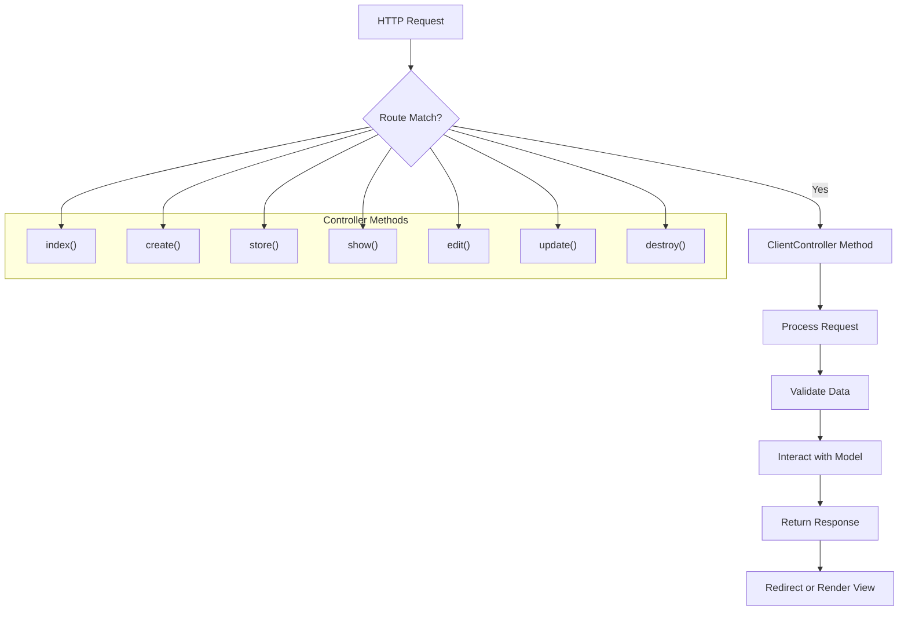
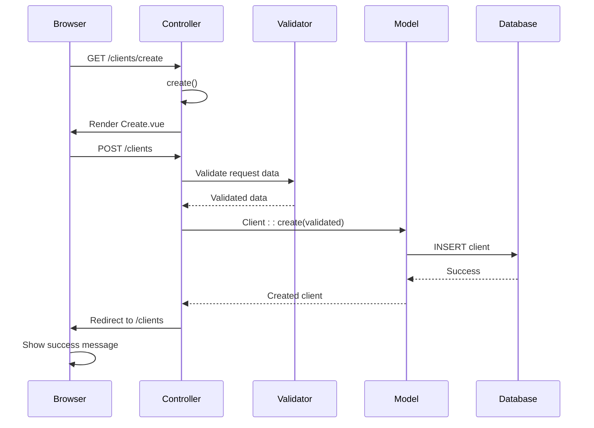
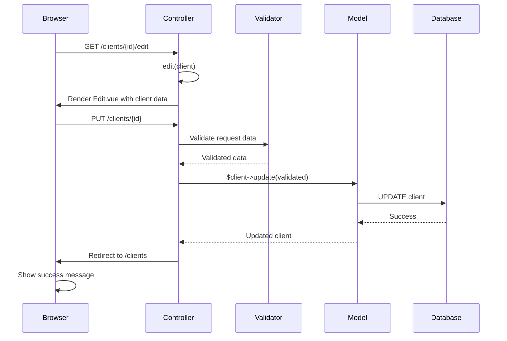
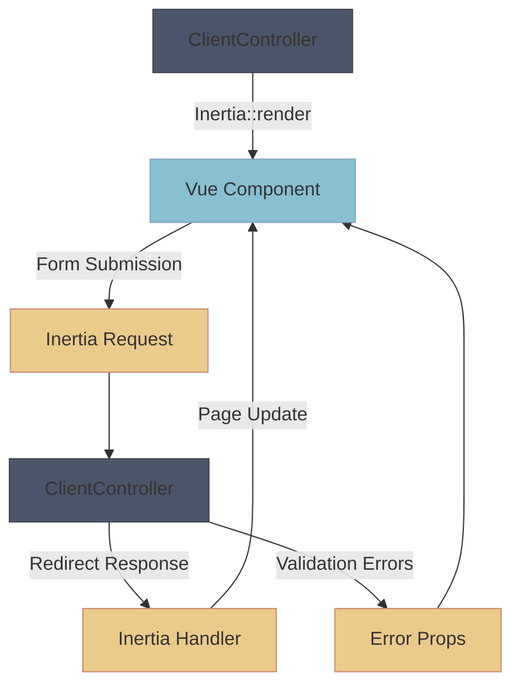
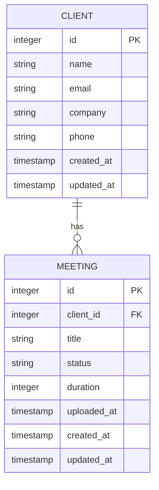

# Client Controller


## Table of Contents
1. [Introduction](#introduction)
2. [Client Data Structure](#client-data-structure)
3. [CRUD Operations Overview](#crud-operations-overview)
4. [Index Operation](#index-operation)
5. [Create and Store Operations](#create-and-store-operations)
6. [Edit and Update Operations](#edit-and-update-operations)
7. [Destroy Operation](#destroy-operation)
8. [Frontend Integration](#frontend-integration)
9. [Validation and Error Handling](#validation-and-error-handling)
10. [Client-Meeting Relationships](#client-meeting-relationships)
11. [Security Considerations](#security-considerations)
12. [Request Flow and Workflow Examples](#request-flow-and-workflow-examples)

## Introduction
The ClientController class in the meetingai application manages organizational client entities through a comprehensive set of CRUD (Create, Read, Update, Delete) operations. This controller serves as the backend interface for client management, handling requests from the frontend Inertia.js components and interacting with the Eloquent Client model for data persistence. The controller implements proper validation, error handling, and business logic to ensure data integrity and enforce application rules, particularly around client deletion when associated meetings exist. This document provides a detailed analysis of the ClientController's functionality, integration with frontend components, and relationship with other models in the system.

**Section sources**
- [ClientController.php](file://app/Http/Controllers/ClientController.php#L1-L94)

## Client Data Structure
The Client model defines the structure and properties of client entities in the application. It extends the Eloquent Model class and includes fillable attributes that can be mass-assigned during creation or update operations.


```json
{
  "id": "integer",
  "name": "string",
  "email": "string|null",
  "company": "string|null",
  "phone": "string|null",
  "created_at": "datetime",
  "updated_at": "datetime"
}
```


The model specifies the following attributes as fillable, allowing them to be assigned through mass assignment:
- **name**: Required string with a maximum length of 255 characters
- **email**: Nullable email address field
- **company**: Nullable string field for company name
- **phone**: Nullable string field for phone number

Additionally, the model includes a cast for `email_verified_at` to ensure it's treated as a datetime object when accessed.

**Section sources**
- [Client.php](file://app/Models/Client.php#L1-L27)

## CRUD Operations Overview
The ClientController implements a complete set of CRUD operations following RESTful conventions. Each operation serves a specific purpose in the client management lifecycle:

- **index()**: Retrieves all clients with meeting counts for display in a list
- **create()**: Returns the view for creating a new client
- **store()**: Processes form submission and creates a new client
- **show()**: Displays detailed information about a specific client
- **edit()**: Returns the view for editing an existing client
- **update()**: Processes form submission and updates an existing client
- **destroy()**: Deletes a client after validation

These methods follow Laravel's resource controller pattern and are mapped to routes through the Route::resource() method in web.php.





**Diagram sources**
- [ClientController.php](file://app/Http/Controllers/ClientController.php#L1-L94)
- [web.php](file://routes/web.php#L1-L47)

**Section sources**
- [ClientController.php](file://app/Http/Controllers/ClientController.php#L1-L94)

## Index Operation
The index() method retrieves all clients from the database and prepares them for display in the client listing interface. This method uses Eloquent's withCount() to efficiently load the number of associated meetings for each client, which is displayed in the UI.


```php
public function index(): Response
{
    $clients = Client::withCount('meetings')
        ->orderBy('name')
        ->get();

    return Inertia::render('Clients/Index', [
        'clients' => $clients
    ]);
}
```


The method performs the following operations:
1. Queries the database for all clients using Client::withCount('meetings')
2. Orders the results alphabetically by name
3. Returns an Inertia response that renders the Clients/Index Vue component
4. Passes the clients collection to the frontend with meeting counts

The withCount() method generates a `meetings_count` attribute for each client, which is used in the frontend to display the number of meetings and to disable the delete button when meetings exist.

**Section sources**
- [ClientController.php](file://app/Http/Controllers/ClientController.php#L7-L17)
- [Index.vue](file://resources/js/pages/Clients/Index.vue#L1-L121)

## Create and Store Operations
The create() and store() methods handle the creation of new clients through a two-step process: displaying the creation form and processing the form submission.

### Create Method
The create() method returns the Vue component for creating a new client:


```php
public function create(): Response
{
    return Inertia::render('Clients/Create');
}
```


### Store Method
The store() method processes the form submission, validates the data, and creates a new client:


```php
public function store(Request $request): RedirectResponse
{
    $validated = $request->validate([
        'name' => 'required|string|max:255',
        'email' => 'nullable|email|unique:clients,email',
        'company' => 'nullable|string|max:255',
        'phone' => 'nullable|string|max:255',
    ]);

    Client::create($validated);

    return redirect()->route('clients.index')
        ->with('success', 'Client created successfully.');
}
```


Key aspects of the store() method:
- **Validation**: Ensures the name is required, email is unique across clients, and all fields adhere to type and length constraints
- **Persistence**: Uses Eloquent's create() method to store the validated data
- **Response**: Redirects to the clients index with a success message

The validation rules prevent duplicate email addresses and ensure data integrity.





**Diagram sources**
- [ClientController.php](file://app/Http/Controllers/ClientController.php#L19-L38)
- [Create.vue](file://resources/js/pages/Clients/Create.vue#L1-L127)

**Section sources**
- [ClientController.php](file://app/Http/Controllers/ClientController.php#L19-L38)
- [Create.vue](file://resources/js/pages/Clients/Create.vue#L1-L127)

## Edit and Update Operations
The edit() and update() methods handle the modification of existing clients through a form-based interface.

### Edit Method
The edit() method retrieves a specific client and passes it to the editing interface:


```php
public function edit(Client $client): Response
{
    return Inertia::render('Clients/Edit', [
        'client' => $client
    ]);
}
```


### Update Method
The update() method processes the form submission and updates the client record:


```php
public function update(Request $request, Client $client): RedirectResponse
{
    $validated = $request->validate([
        'name' => 'required|string|max:255',
        'email' => [
            'nullable',
            'email',
            Rule::unique('clients', 'email')->ignore($client->id)
        ],
        'company' => 'nullable|string|max:255',
        'phone' => 'nullable|string|max:255',
    ]);

    $client->update($validated);

    return redirect()->route('clients.index')
        ->with('success', 'Client updated successfully.');
}
```


Key aspects of the update() method:
- **Route Model Binding**: The $client parameter is automatically resolved from the route parameter
- **Validation**: Similar to store(), but with email uniqueness rule that ignores the current client's email
- **Persistence**: Uses the model instance's update() method to modify existing data
- **Response**: Redirects to the clients index with a success message

The Rule::unique() with ignore($client->id) ensures that a client can keep its current email while preventing conflicts with other clients' emails.





**Diagram sources**
- [ClientController.php](file://app/Http/Controllers/ClientController.php#L50-L74)
- [Edit.vue](file://resources/js/pages/Clients/Edit.vue#L1-L130)

**Section sources**
- [ClientController.php](file://app/Http/Controllers/ClientController.php#L50-L74)
- [Edit.vue](file://resources/js/pages/Clients/Edit.vue#L1-L130)

## Destroy Operation
The destroy() method handles client deletion with a critical business rule: clients with associated meetings cannot be deleted.


```php
public function destroy(Client $client): RedirectResponse
{
    // Check if client has meetings
    if ($client->meetings()->count() > 0) {
        return redirect()->route('clients.index')
            ->with('error', 'Cannot delete client with existing meetings.');
    }

    $client->delete();

    return redirect()->route('clients.index')
        ->with('success', 'Client deleted successfully.');
}
```


The method implements the following logic:
1. Checks if the client has any associated meetings using the meetings() relationship
2. If meetings exist, returns to the index page with an error message
3. If no meetings exist, deletes the client record
4. Returns to the index page with a success message

This prevents data integrity issues that could arise from orphaned meetings. The frontend also implements client-side validation to disable the delete button when meetings exist, providing a better user experience.

**Section sources**
- [ClientController.php](file://app/Http/Controllers/ClientController.php#L76-L94)
- [Index.vue](file://resources/js/pages/Clients/Index.vue#L1-L121)

## Frontend Integration
The ClientController integrates with Vue.js components through Inertia.js, creating a seamless single-page application experience. The controller methods return Inertia responses that render specific Vue components with data.

### Component Mapping
- **index()** → Clients/Index.vue: Displays client list with meeting counts
- **create()** → Clients/Create.vue: Form for creating new clients
- **edit()** → Clients/Edit.vue: Form for editing existing clients
- **show()** → Clients/Show.vue: Detailed view of a client and their meetings

### Data Flow
The frontend components use Inertia's useForm() helper to manage form state and validation errors:


```typescript
const form = useForm({
  name: '',
  email: '',
  company: '',
  phone: '',
})

const submit = () => {
  form.post(route('clients.store'))
}
```


When validation fails, Laravel returns error messages that are automatically mapped to the form.errors object in the frontend, providing real-time feedback.

### Client-Server Communication
The integration follows this pattern:
1. Controller returns Inertia response with component name and props
2. Inertia renders the Vue component in the current page
3. Form submissions are sent via Inertia requests
4. Controller processes request and returns redirect or error response
5. Inertia handles the response, updating the page without full reload





**Diagram sources**
- [ClientController.php](file://app/Http/Controllers/ClientController.php#L1-L94)
- [Index.vue](file://resources/js/pages/Clients/Index.vue#L1-L121)
- [Create.vue](file://resources/js/pages/Clients/Create.vue#L1-L127)
- [Edit.vue](file://resources/js/pages/Clients/Edit.vue#L1-L130)
- [Show.vue](file://resources/js/pages/Clients/Show.vue#L1-L184)

**Section sources**
- [ClientController.php](file://app/Http/Controllers/ClientController.php#L1-L94)
- [Index.vue](file://resources/js/pages/Clients/Index.vue#L1-L121)
- [Create.vue](file://resources/js/pages/Clients/Create.vue#L1-L127)
- [Edit.vue](file://resources/js/pages/Clients/Edit.vue#L1-L130)
- [Show.vue](file://resources/js/pages/Clients/Show.vue#L1-L184)

## Validation and Error Handling
The ClientController implements comprehensive validation to ensure data integrity and provide meaningful feedback to users.

### Validation Rules
The controller uses Laravel's validation system with the following rules:

**Store Operation:**
- **name**: required|string|max:255
- **email**: nullable|email|unique:clients,email
- **company**: nullable|string|max:255
- **phone**: nullable|string|max:255

**Update Operation:**
- **name**: required|string|max:255
- **email**: nullable|email|unique:clients,email (ignoring current client)
- **company**: nullable|string|max:255
- **phone**: nullable|string|max:255

### Error Response Formatting
When validation fails, Laravel automatically redirects back with error messages in the session. These are accessed in the frontend through Inertia's shared data or form error objects.

### Custom Business Validation
The destroy() method implements custom business logic validation:


```php
if ($client->meetings()->count() > 0) {
    return redirect()->route('clients.index')
        ->with('error', 'Cannot delete client with existing meetings.');
}
```


This prevents deletion of clients with associated meetings, maintaining referential integrity.

### Frontend Error Display
The Vue components display validation errors below the corresponding form fields:


```vue
<p v-if="form.errors.name" class="mt-1 text-sm text-red-600">
    {{ form.errors.name }}
</p>
```


This creates a seamless user experience where errors are displayed immediately and clearly.

**Section sources**
- [ClientController.php](file://app/Http/Controllers/ClientController.php#L28-L36)
- [ClientController.php](file://app/Http/Controllers/ClientController.php#L55-L63)
- [ClientController.php](file://app/Http/Controllers/ClientController.php#L76-L82)
- [Create.vue](file://resources/js/pages/Clients/Create.vue#L1-L127)
- [Edit.vue](file://resources/js/pages/Clients/Edit.vue#L1-L130)

## Client-Meeting Relationships
The application establishes a one-to-many relationship between clients and meetings, where each client can have multiple meetings.

### Model Relationships
**Client Model:**

```php
public function meetings(): HasMany
{
    return $this->hasMany(Meeting::class);
}
```


**Meeting Model:**

```php
public function client(): BelongsTo
{
    return $this->belongsTo(Client::class);
}
```


### Relationship Usage
The relationships are used throughout the application:

**In Index Operation:**

```php
$clients = Client::withCount('meetings')->get();
```

This eager loads the meeting count for each client, optimizing database queries.

**In Show Operation:**

```php
$client->load(['meetings' => function ($query) {
    $query->orderBy('created_at', 'desc');
}]);
```

This loads all meetings for a client, ordered by creation date.

### Frontend Integration
The relationship data is used in multiple Vue components:

**Clients/Index.vue:** Displays meeting counts and disables delete button when meetings exist
**Clients/Show.vue:** Lists all meetings associated with the client
**Meetings/Create.vue:** Allows selecting a client when creating a new meeting

### Data Filtering
The relationship enables filtering and sorting of meetings by client, and clients by their meeting activity. The top clients dashboard component uses meeting counts to identify most active clients.





**Diagram sources**
- [Client.php](file://app/Models/Client.php#L1-L27)
- [Meeting.php](file://app/Models/Meeting.php#L1-L25)
- [ClientController.php](file://app/Http/Controllers/ClientController.php#L7-L17)
- [ClientController.php](file://app/Http/Controllers/ClientController.php#L39-L49)

**Section sources**
- [Client.php](file://app/Models/Client.php#L1-L27)
- [Meeting.php](file://app/Models/Meeting.php#L1-L25)
- [ClientController.php](file://app/Http/Controllers/ClientController.php#L7-L17)
- [ClientController.php](file://app/Http/Controllers/ClientController.php#L39-L49)
- [Show.vue](file://resources/js/pages/Clients/Show.vue#L1-L184)

## Security Considerations
The ClientController implements several security measures to protect data integrity and prevent common vulnerabilities.

### Mass Assignment Protection
The Client model uses the $fillable property to specify which attributes can be mass-assigned:


```php
protected $fillable = [
    'name',
    'email',
    'company',
    'phone',
];
```


This prevents malicious users from setting protected attributes like id, created_at, or updated_at through form submissions.

### Input Validation
Comprehensive validation is applied to all user inputs:

- **Type validation**: Ensures data types match expectations
- **Length constraints**: Prevents excessively long inputs
- **Email validation**: Uses Laravel's built-in email validation
- **Uniqueness constraints**: Prevents duplicate email addresses

### Business Logic Protection
The destroy() method implements critical business rule enforcement:


```php
if ($client->meetings()->count() > 0) {
    return redirect()->route('clients.index')
        ->with('error', 'Cannot delete client with existing meetings.');
}
```


This prevents accidental deletion of clients with associated meetings, maintaining referential integrity.

### Route Model Binding
The controller uses Laravel's route model binding to automatically resolve client instances:


```php
public function edit(Client $client): Response
```


This ensures that only valid client IDs are processed and reduces the risk of ID manipulation attacks.

### CSRF Protection
While not explicitly shown in the code, Laravel's web routes are protected by CSRF middleware by default, preventing cross-site request forgery attacks on form submissions.

**Section sources**
- [Client.php](file://app/Models/Client.php#L1-L27)
- [ClientController.php](file://app/Http/Controllers/ClientController.php#L28-L36)
- [ClientController.php](file://app/Http/Controllers/ClientController.php#L55-L63)
- [ClientController.php](file://app/Http/Controllers/ClientController.php#L76-L82)

## Request Flow and Workflow Examples
This section illustrates the complete workflow for common client management operations, showing the interaction between frontend and backend components.

### Client Creation Workflow
1. User navigates to /clients and clicks "Add Client"
2. Browser requests GET /clients/create
3. ClientController.create() returns Inertia response
4. Inertia renders Clients/Create.vue component
5. User fills form and submits
6. Browser sends POST /clients with form data
7. ClientController.store() validates data
8. Validated data is used to create new Client record
9. Controller redirects to /clients with success message
10. Inertia updates page, showing new client in list

### Client Update Workflow
1. User clicks "Edit" on a client in the list
2. Browser requests GET /clients/{id}/edit
3. ClientController.edit() retrieves client and returns Inertia response
4. Inertia renders Clients/Edit.vue with client data
5. User modifies fields and submits
6. Browser sends PUT /clients/{id} with updated data
7. ClientController.update() validates data (allowing current email)
8. Client record is updated in database
9. Controller redirects to /clients with success message
10. Inertia updates page, reflecting changes

### Client Deletion Workflow
1. User clicks "Delete" on a client without meetings
2. Frontend confirms deletion
3. Browser sends DELETE /clients/{id}
4. ClientController.destroy() checks meeting count (0)
5. Client record is deleted from database
6. Controller redirects to /clients with success message
7. Inertia updates page, removing client from list

For clients with meetings, the deletion is blocked both in the frontend (disabled button) and backend (validation check), with an error message displayed.


```mermaid
flowchart TD
A[User Action] --> B{Operation Type}
B --> |Create| C[GET /clients/create]
B --> |Edit| D[GET /clients/{id}/edit]
B --> |Delete| E[DELETE /clients/{id}]
C --> F[Render Create Form]
F --> G[Submit Form]
G --> H[POST /clients]
H --> I[Validate & Create]
I --> J[Redirect to Index]
D --> K[Render Edit Form]
K --> L[Submit Changes]
L --> M[PUT /clients/{id}]
M --> N[Validate & Update]
N --> O[Redirect to Index]
E --> P[Check Meetings]
P --> |No Meetings| Q[Delete Client]
P --> |Has Meetings| R[Show Error]
Q --> S[Redirect to Index]
R --> T[Stay on Page]
J --> U[Show Success Message]
O --> U
S --> U
T --> V[Show Error Message]
```


**Diagram sources**
- [ClientController.php](file://app/Http/Controllers/ClientController.php#L1-L94)
- [Create.vue](file://resources/js/pages/Clients/Create.vue#L1-L127)
- [Edit.vue](file://resources/js/pages/Clients/Edit.vue#L1-L130)
- [Index.vue](file://resources/js/pages/Clients/Index.vue#L1-L121)

**Section sources**
- [ClientController.php](file://app/Http/Controllers/ClientController.php#L1-L94)
- [Create.vue](file://resources/js/pages/Clients/Create.vue#L1-L127)
- [Edit.vue](file://resources/js/pages/Clients/Edit.vue#L1-L130)
- [Index.vue](file://resources/js/pages/Clients/Index.vue#L1-L121)
- [ClientManagementWorkflowTest.php](file://tests/Browser/ClientManagementWorkflowTest.php#L1-L250)

**Referenced Files in This Document**   
- [ClientController.php](file://app/Http/Controllers/ClientController.php#L1-L94)
- [Client.php](file://app/Models/Client.php#L1-L27)
- [Meeting.php](file://app/Models/Meeting.php#L1-L25)
- [web.php](file://routes/web.php#L1-L47)
- [Index.vue](file://resources/js/pages/Clients/Index.vue#L1-L121)
- [Create.vue](file://resources/js/pages/Clients/Create.vue#L1-L127)
- [Edit.vue](file://resources/js/pages/Clients/Edit.vue#L1-L130)
- [Show.vue](file://resources/js/pages/Clients/Show.vue#L1-L184)
- [ClientManagementWorkflowTest.php](file://tests/Browser/ClientManagementWorkflowTest.php#L1-L250)