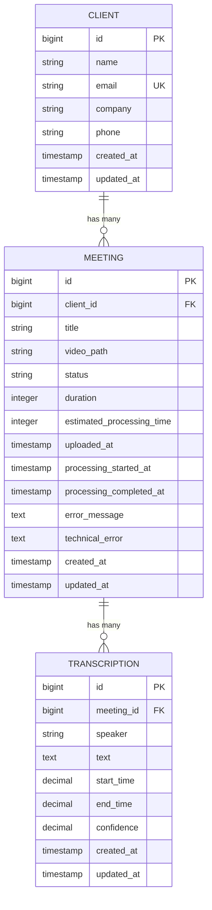
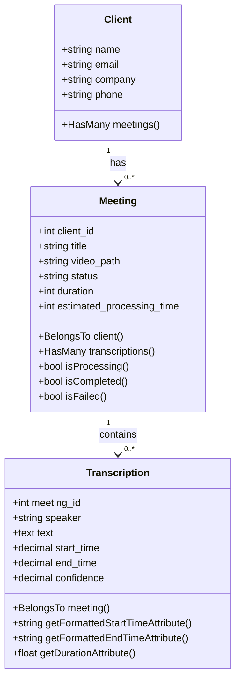

# Backend Data Models


## Table of Contents
1. [Introduction](#introduction)
2. [Core Data Models Overview](#core-data-models-overview)
3. [Client Model](#client-model)
4. [Meeting Model](#meeting-model)
5. [Transcription Model](#transcription-model)
6. [Database Schema and Migrations](#database-schema-and-migrations)
7. [Model Relationships](#model-relationships)
8. [Accessors, Mutators, and Appended Attributes](#accessors-mutators-and-appended-attributes)
9. [Business Logic and Status Tracking](#business-logic-and-status-tracking)
10. [Model Factories and Test Data](#model-factories-and-test-data)
11. [Query Patterns and Usage Examples](#query-patterns-and-usage-examples)

## Introduction
This document provides comprehensive documentation for the core Eloquent models in the **meetingai** application. It details the structure, relationships, business logic, and lifecycle of the primary data models: `Client`, `Meeting`, and `Transcription`. The analysis includes database schema mappings, attribute casting, accessors, factory definitions, and workflow management features such as processing status and error tracking. This documentation is designed to be accessible to both technical and non-technical stakeholders, offering clear explanations and practical examples.

## Core Data Models Overview
The **meetingai** application revolves around three core Eloquent models that represent the primary domain entities:

- **Client**: Represents an organization or individual who uploads meeting recordings.
- **Meeting**: Represents a recorded meeting associated with a client, containing metadata and processing status.
- **Transcription**: Represents the spoken content of a meeting, broken down into time-stamped segments with speaker identification.

These models are interconnected through well-defined relationships and support a workflow-driven architecture where meetings transition through various processing states.





**Diagram sources**
- [Client.php](file://app/Models/Client.php)
- [Meeting.php](file://app/Models/Meeting.php)
- [Transcription.php](file://app/Models/Transcription.php)

## Client Model

### Model Definition and Attributes
The `Client` model represents a customer or organization using the meeting transcription service. It stores basic contact and organizational information.

**Key Attributes:**
- `name`: Full name of the client (required)
- `email`: Email address, must be unique and nullable
- `company`: Company name (nullable)
- `phone`: Contact phone number (nullable)

**Section sources**
- [Client.php](file://app/Models/Client.php#L1-L28)
- [2025_08_10_135157_create_clients_table.php](file://database/migrations/2025_08_10_135157_create_clients_table.php#L1-L32)

### Database Schema
The `clients` table is defined in the migration file and includes:

- Primary key: `id` (auto-incrementing)
- Unique constraint on `email`
- Indexes on `created_at` and `updated_at` (via `timestamps()`)
- Soft deletes not implemented


```php
Schema::create('clients', function (Blueprint $table) {
    $table->id();
    $table->string('name');
    $table->string('email')->unique()->nullable();
    $table->string('company')->nullable();
    $table->string('phone')->nullable();
    $table->timestamps();
});
```


### Model Configuration
- **Mass Assignment**: Protected via `$fillable` array
- **Casting**: `email_verified_at` cast to `datetime`
- **Factory**: Uses `ClientFactory` for test and seed data


```php
protected $fillable = ['name', 'email', 'company', 'phone'];
protected $casts = ['email_verified_at' => 'datetime'];
```


## Meeting Model

### Model Definition and Attributes
The `Meeting` model is the central entity in the application, representing a recorded meeting that undergoes transcription processing.

**Key Attributes:**
- `client_id`: Foreign key linking to `clients` table
- `title`: Descriptive title of the meeting
- `video_path`: Filesystem path to the uploaded video
- `status`: Current processing state (`pending`, `processing`, `completed`, `failed`)
- `duration`: Length of the meeting in seconds
- `estimated_processing_time`: Predicted processing duration in seconds
- `uploaded_at`: Timestamp when the meeting was uploaded
- `processing_started_at`: Timestamp when processing began
- `processing_completed_at`: Timestamp when processing finished
- `error_message`: User-friendly error description
- `technical_error`: Detailed technical error information

**Section sources**
- [Meeting.php](file://app/Models/Meeting.php#L1-L179)
- [2025_08_10_135205_create_meetings_table.php](file://database/migrations/2025_08_10_135205_create_meetings_table.php#L1-L41)
- [2025_08_10_145951_add_estimated_processing_time_to_meetings_table.php](file://database/migrations/2025_08_10_145951_add_estimated_processing_time_to_meetings_table.php#L1-L29)
- [2025_08_10_160251_add_error_fields_to_meetings_table.php](file://database/migrations/2025_08_10_160251_add_error_fields_to_meetings_table.php#L1-L29)

### Database Schema
The `meetings` table has evolved through multiple migrations:

1. Initial creation with core fields
2. Addition of `estimated_processing_time` for progress estimation
3. Addition of `error_message` and `technical_error` for failure handling

**Indexes:**
- `client_id`: Foreign key index
- `status`: For filtering by processing state
- `uploaded_at`: For chronological queries


```php
$table->foreignId('client_id')->constrained()->onDelete('cascade');
$table->index('status');
$table->index('uploaded_at');
```


### Model Configuration
- **Mass Assignment**: Controlled via `$fillable` array
- **Casting**: Timestamps and integers properly typed
- **Appended Attributes**: 7 computed fields for UI display


```php
protected $casts = [
    'uploaded_at' => 'datetime',
    'processing_started_at' => 'datetime',
    'processing_completed_at' => 'datetime',
    'duration' => 'integer',
    'estimated_processing_time' => 'integer',
];

protected $appends = [
    'elapsed_time',
    'estimated_remaining_time',
    'processing_progress',
    'formatted_elapsed_time',
    'formatted_estimated_remaining_time',
    'queue_progress',
    'formatted_estimated_processing_time',
];
```


## Transcription Model

### Model Definition and Attributes
The `Transcription` model stores the textual content of a meeting, broken down into time-coded segments.

**Key Attributes:**
- `meeting_id`: Foreign key linking to `meetings` table
- `speaker`: Name of the speaker (nullable)
- `text`: Transcribed speech content
- `start_time`: Start time in seconds (with millisecond precision)
- `end_time`: End time in seconds (with millisecond precision)
- `confidence`: Confidence score of transcription accuracy (0.00–1.00)

**Section sources**
- [Transcription.php](file://app/Models/Transcription.php#L1-L51)
- [2025_08_10_135210_create_transcriptions_table.php](file://database/migrations/2025_08_10_135210_create_transcriptions_table.php#L1-L39)

### Database Schema
The `transcriptions` table is optimized for time-based queries:

- **Precision**: `start_time` and `end_time` use `DECIMAL(10,3)` for millisecond accuracy
- **Confidence**: Stored as `DECIMAL(3,2)` with default 1.00
- **Indexes**: On `meeting_id` and `start_time` for efficient retrieval


```php
$table->decimal('start_time', 10, 3);
$table->decimal('end_time', 10, 3);
$table->decimal('confidence', 3, 2)->default(1.00);
$table->index('meeting_id');
$table->index('start_time');
```


### Model Configuration
- **Casting**: Decimal fields properly typed
- **Accessors**: Formatted time display and duration calculation


```php
protected $casts = [
    'start_time' => 'decimal:3',
    'end_time' => 'decimal:3',
    'confidence' => 'decimal:2',
];
```


## Model Relationships

### Client → Meeting (One-to-Many)
A client can have multiple meetings.


```php
public function meetings(): HasMany
{
    return $this->hasMany(Meeting::class);
}
```


### Meeting → Client (Many-to-One)
Each meeting belongs to one client.


```php
public function client(): BelongsTo
{
    return $this->belongsTo(Client::class);
}
```


### Meeting → Transcription (One-to-Many)
A meeting can have multiple transcription segments.


```php
public function transcriptions(): HasMany
{
    return $this->hasMany(Transcription::class);
}
```


### Transcription → Meeting (Many-to-One)
Each transcription segment belongs to one meeting.


```php
public function meeting(): BelongsTo
{
    return $this->belongsTo(Meeting::class);
}
```





**Diagram sources**
- [Client.php](file://app/Models/Client.php#L1-L28)
- [Meeting.php](file://app/Models/Meeting.php#L1-L179)
- [Transcription.php](file://app/Models/Transcription.php#L1-L51)

## Accessors, Mutators, and Appended Attributes

### Computed Attributes in Meeting Model
The `Meeting` model includes several accessors that provide derived data for the frontend:

| Attribute | Description | Example |
|---------|-------------|---------|
| `elapsed_time` | Seconds since processing started | 45 |
| `estimated_remaining_time` | Predicted seconds until completion | 15 |
| `processing_progress` | Percentage of processing completed | 75.0 |
| `formatted_elapsed_time` | MM:SS format of elapsed time | "0:45" |
| `queue_progress` | Simulated progress for pending meetings | 66.7 |


```php
public function getElapsedTimeAttribute(): ?int
{
    if (!$this->processing_started_at) return null;
    $endTime = $this->processing_completed_at ?? now();
    return $this->processing_started_at->diffInSeconds($endTime);
}
```


### Formatted Output in Transcription Model
Provides user-friendly time formatting:


```php
public function getFormattedStartTimeAttribute(): string
{
    $minutes = floor($this->start_time / 60);
    $seconds = $this->start_time % 60;
    return sprintf('%02d:%05.2f', $minutes, $seconds);
}

public function getDurationAttribute(): float
{
    return $this->end_time - $this->start_time;
}
```


**Section sources**
- [Meeting.php](file://app/Models/Meeting.php#L50-L170)
- [Transcription.php](file://app/Models/Transcription.php#L30-L50)

## Business Logic and Status Tracking

### Status Management Methods
The `Meeting` model includes helper methods for state checking:


```php
public function isProcessing(): bool
{
    return $this->status === 'processing';
}

public function isCompleted(): bool
{
    return $this->status === 'completed';
}

public function isFailed(): bool
{
    return $this->status === 'failed';
}
```


### Processing Workflow
The system tracks meeting processing through several stages:

1. **Pending**: Meeting uploaded, waiting in queue
2. **Processing**: Transcription job is running
3. **Completed**: Transcription finished successfully
4. **Failed**: Processing encountered an error

### Progress Estimation
The system estimates processing time as **1 second per minute of video** (minimum 10 seconds):


```php
$estimatedTotalProcessingTime = max(10, $this->duration / 60);
```


For pending meetings, a simulated `queue_progress` shows wait time progress based on a 30-second expected wait.

**Section sources**
- [Meeting.php](file://app/Models/Meeting.php#L40-L50)
- [MeetingFactory.php](file://database/factories/MeetingFactory.php#L20-L25)

## Model Factories and Test Data

### ClientFactory
Generates realistic client data with optional null fields:


```php
return [
    'name' => fake()->name(),
    'email' => fake()->unique()->safeEmail(),
    'company' => fake()->company(),
    'phone' => fake()->phoneNumber(),
];
```


State modifiers allow creation of clients without email, company, or phone.

### MeetingFactory
Creates meetings with realistic processing states:

- **Default**: Random status with appropriate timestamps
- **States**: `pending()`, `processing()`, `completed()`, `failed()`
- **Relationships**: Automatically creates associated client
- **Complex State**: `withTranscriptions()` creates a completed meeting with 5–20 transcription segments


```php
public function withTranscriptions(int $count = null): static
{
    return $this->completed()->afterCreating(function (Meeting $meeting) use ($count) {
        // Creates transcription segments with realistic timing
    });
}
```


### TranscriptionFactory
Generates transcription segments with:
- Realistic speaker names
- Variable segment durations (3–15 seconds)
- Confidence scores between 0.7 and 1.0
- Proper time sequencing

**Section sources**
- [ClientFactory.php](file://database/factories/ClientFactory.php#L1-L59)
- [MeetingFactory.php](file://database/factories/MeetingFactory.php#L1-L115)
- [TranscriptionFactory.php](file://database/factories/TranscriptionFactory.php#L1-L40)

## Query Patterns and Usage Examples

### Common Query Patterns
**Find all processing meetings:**

```php
$processingMeetings = Meeting::where('status', 'processing')->get();
```


**Get meetings for a specific client:**

```php
$clientMeetings = Client::find(1)->meetings;
```


**Find failed meetings with technical details:**

```php
$failedMeetings = Meeting::where('status', 'failed')
    ->whereNotNull('technical_error')
    ->get();
```


### SQL Output Examples
**Query:** `Meeting::where('status', 'completed')->first()`

```sql
SELECT * FROM "meetings" WHERE "status" = 'completed' LIMIT 1
```


**Query:** `$client->meetings()->where('status', 'processing')->count()`

```sql
SELECT COUNT(*) FROM "meetings" WHERE "meetings"."client_id" = ? AND "status" = 'processing'
```


### Controller Usage Pattern

```php
// In MeetingController
$meeting = Meeting::with('client', 'transcriptions')->findOrFail($id);
return inertia('Meeting/Show', compact('meeting'));
```


This eager-loads related models to avoid N+1 query problems.

**Section sources**
- [Meeting.php](file://app/Models/Meeting.php)
- [Client.php](file://app/Models/Client.php)
- [Transcription.php](file://app/Models/Transcription.php)
- [MeetingController.php](file://app/Http/Controllers/MeetingController.php)

**Referenced Files in This Document**   
- [Client.php](file://app/Models/Client.php)
- [Meeting.php](file://app/Models/Meeting.php)
- [Transcription.php](file://app/Models/Transcription.php)
- [User.php](file://app/Models/User.php)
- [2025_08_10_135157_create_clients_table.php](file://database/migrations/2025_08_10_135157_create_clients_table.php)
- [2025_08_10_135205_create_meetings_table.php](file://database/migrations/2025_08_10_135205_create_meetings_table.php)
- [2025_08_10_135210_create_transcriptions_table.php](file://database/migrations/2025_08_10_135210_create_transcriptions_table.php)
- [2025_08_10_145951_add_estimated_processing_time_to_meetings_table.php](file://database/migrations/2025_08_10_145951_add_estimated_processing_time_to_meetings_table.php)
- [2025_08_10_160251_add_error_fields_to_meetings_table.php](file://database/migrations/2025_08_10_160251_add_error_fields_to_meetings_table.php)
- [ClientFactory.php](file://database/factories/ClientFactory.php)
- [MeetingFactory.php](file://database/factories/MeetingFactory.php)
- [TranscriptionFactory.php](file://database/factories/TranscriptionFactory.php)