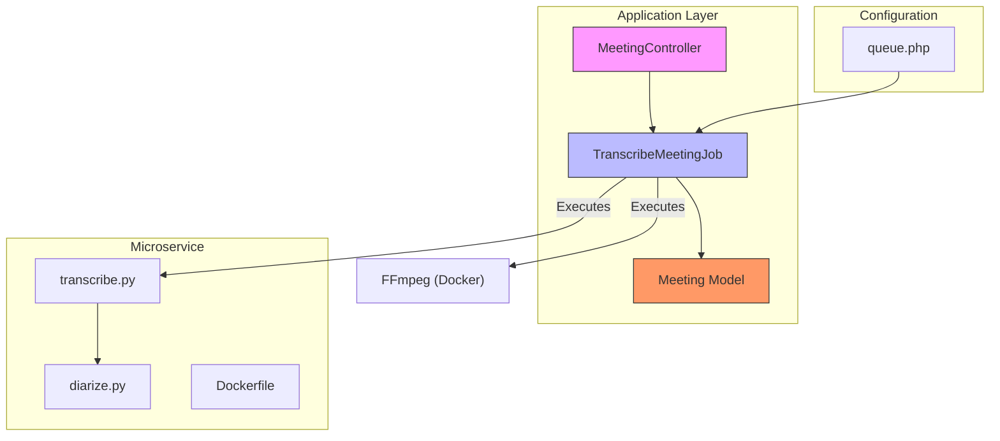
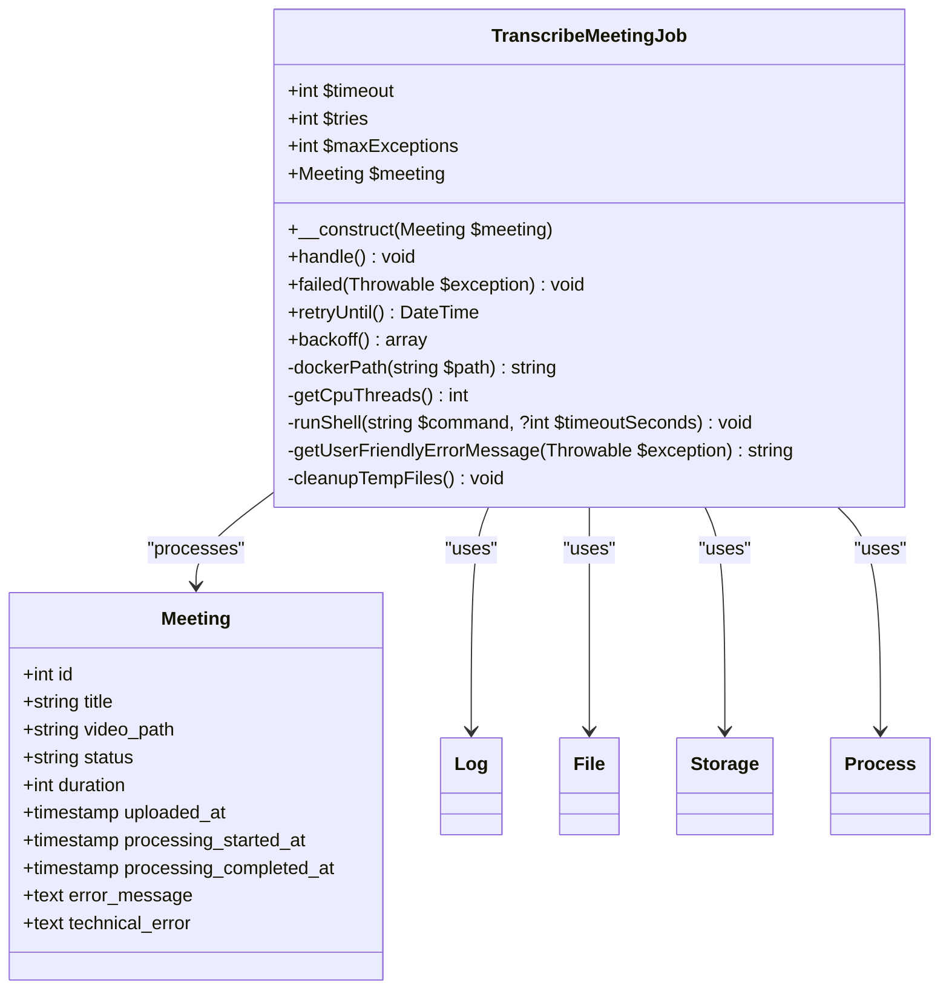
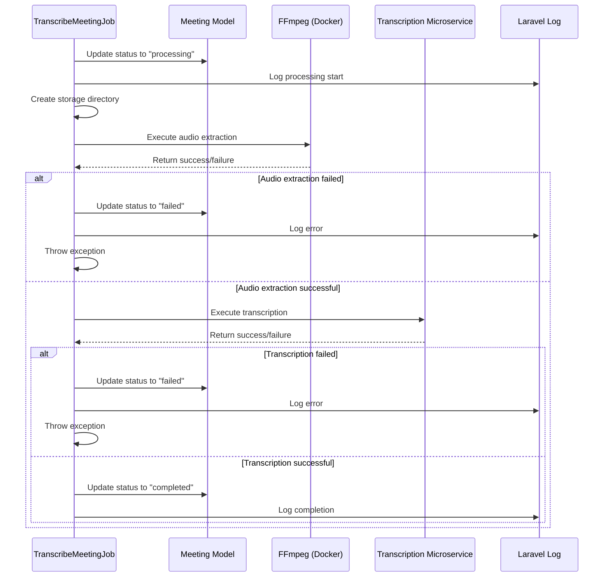
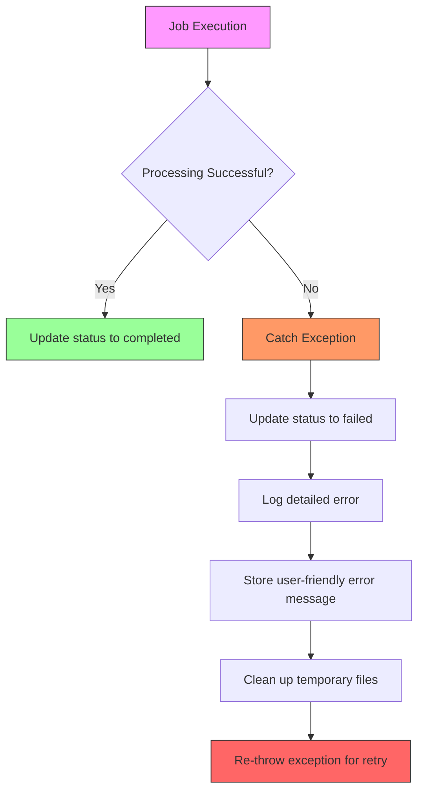
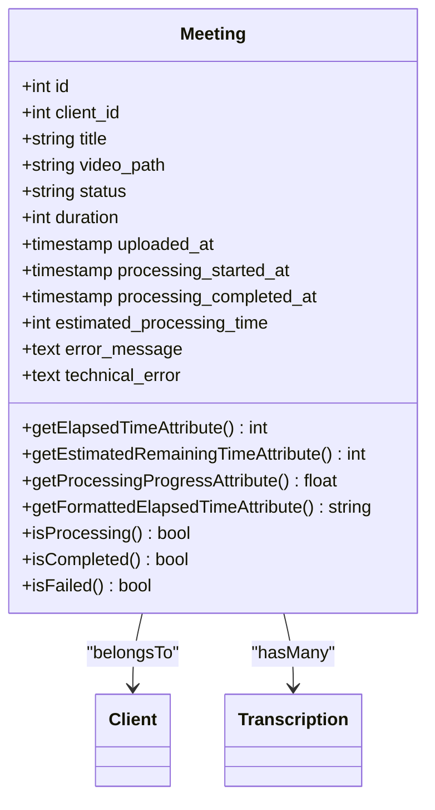
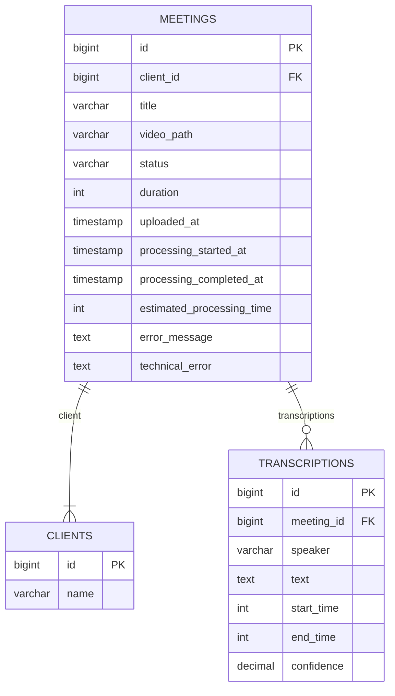
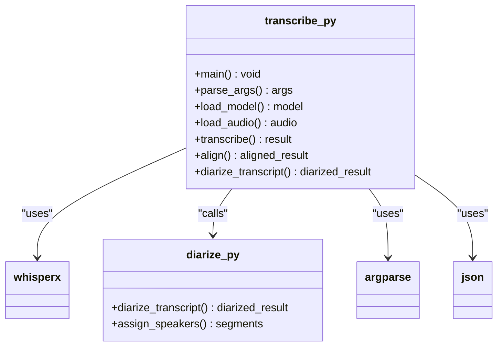
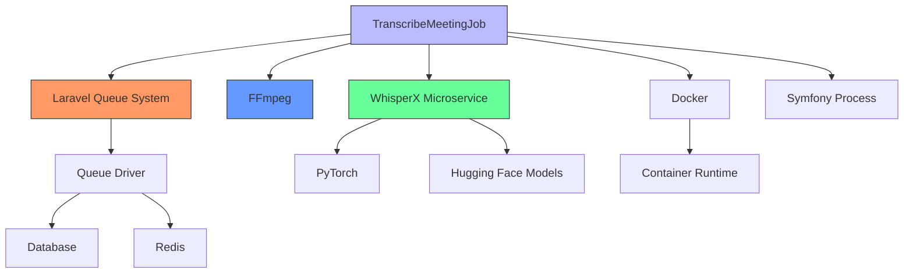

# Background Job Processing


## Table of Contents
1. [Introduction](#introduction)
2. [Project Structure](#project-structure)
3. [Core Components](#core-components)
4. [Architecture Overview](#architecture-overview)
5. [Detailed Component Analysis](#detailed-component-analysis)
6. [Dependency Analysis](#dependency-analysis)
7. [Performance Considerations](#performance-considerations)
8. [Troubleshooting Guide](#troubleshooting-guide)
9. [Conclusion](#conclusion)

## Introduction
The meetingai application implements a robust background job system to handle computationally intensive video transcription tasks asynchronously. This document details the architecture and implementation of the TranscribeMeetingJob, which leverages Laravel's queue system to process video files without blocking HTTP requests. The system extracts audio from uploaded videos using FFmpeg, transcribes the audio using a Python-based microservice with WhisperX, and updates the meeting record with transcription results. The documentation covers job lifecycle management, error handling, queue configuration options, and monitoring strategies essential for production deployment.

## Project Structure
The project follows a standard Laravel MVC architecture with dedicated directories for jobs, models, controllers, and configuration files. The background processing system is centered around the TranscribeMeetingJob class in the app/Jobs directory, which coordinates with the Meeting model and MeetingController. The transcribe-microservice directory contains the Python implementation for audio transcription, packaged as a Docker container for consistent execution across environments.





**Diagram sources**
- [TranscribeMeetingJob.php](file://app/Jobs/TranscribeMeetingJob.php)
- [MeetingController.php](file://app/Http/Controllers/MeetingController.php)
- [Meeting.php](file://app/Models/Meeting.php)
- [queue.php](file://config/queue.php)
- [transcribe.py](file://transcribe-microservice/transcribe.py)

**Section sources**
- [TranscribeMeetingJob.php](file://app/Jobs/TranscribeMeetingJob.php)
- [MeetingController.php](file://app/Http/Controllers/MeetingController.php)
- [Meeting.php](file://app/Models/Meeting.php)

## Core Components
The core components of the background job system include the TranscribeMeetingJob class, which implements Laravel's ShouldQueue interface for asynchronous execution. The job processes video files by first extracting audio using FFmpeg in a Docker container, then transcribing the audio using a Python microservice with WhisperX. The Meeting model stores transcription status and progress information, while the MeetingController dispatches the job when a new meeting is uploaded. The system uses Laravel's queue configuration to determine the queue driver and connection settings.

**Section sources**
- [TranscribeMeetingJob.php](file://app/Jobs/TranscribeMeetingJob.php)
- [Meeting.php](file://app/Models/Meeting.php)
- [MeetingController.php](file://app/Http/Controllers/MeetingController.php)

## Architecture Overview
The background job architecture follows a producer-consumer pattern where the MeetingController acts as the producer by dispatching transcription jobs, and queue workers act as consumers that process the jobs. The system uses Laravel's queue abstraction to support multiple drivers including database, Redis, and sync. When a job is dispatched, it is serialized and stored in the queue, where it waits to be processed by an available worker. The job execution involves multiple external processes including Docker containers for FFmpeg and the transcription microservice, with comprehensive error handling and retry mechanisms.

```mermaid
graph LR
A["HTTP Request"] --> B["MeetingController"]
B --> C["Store Meeting & Video"]
C --> D["Dispatch TranscribeMeetingJob"]
D --> E["Queue (database/redis)"]
E --> F["Queue Worker"]
F --> G["TranscribeMeetingJob::handle()"]
G --> H["Extract Audio with FFmpeg"]
H --> I["Transcribe with Python Microservice"]
I --> J["Update Meeting Status"]
J --> K["Store Transcript"]
style A fill:#ffcccc,stroke:#333
style B fill:#ccffcc,stroke:#333
style E fill:#ccccff,stroke:#333
style F fill:#ccffcc,stroke:#333
style G fill:#bbf,stroke:#333
```





**Diagram sources**
- [TranscribeMeetingJob.php](file://app/Jobs/TranscribeMeetingJob.php)
- [MeetingController.php](file://app/Http/Controllers/MeetingController.php)
- [queue.php](file://config/queue.php)

## Detailed Component Analysis

### TranscribeMeetingJob Analysis
The TranscribeMeetingJob class implements the core video processing logic, handling the complete workflow from audio extraction to transcription and status updates. The job is designed with robust error handling, retry mechanisms, and resource management to ensure reliable processing of large video files.

#### Job Configuration and Properties
The job class defines several configuration properties that control its behavior:


```php
public $timeout = 3600; // 1 hour timeout
public $tries = 3; // Allow 3 attempts
public $maxExceptions = 3;
```


These settings ensure the job has sufficient time to process large videos while limiting the number of retry attempts to prevent infinite loops. The retryUntil method specifies that retries should stop after 30 minutes, and the backoff strategy implements exponential backoff with delays of 1, 5, and 15 minutes between attempts.





**Diagram sources**
- [TranscribeMeetingJob.php](file://app/Jobs/TranscribeMeetingJob.php#L15-L40)
- [Meeting.php](file://app/Models/Meeting.php#L10-L35)

**Section sources**
- [TranscribeMeetingJob.php](file://app/Jobs/TranscribeMeetingJob.php)

#### Job Execution Workflow
The handle() method implements a comprehensive workflow for processing meeting videos:

1. **Status Update**: The job begins by updating the meeting status to "processing" and recording the start time.
2. **Directory Setup**: It creates a dedicated storage directory for the meeting's processing files.
3. **Audio Extraction**: Uses FFmpeg in a Docker container to extract WAV audio from the video file.
4. **Transcription**: Executes the transcription microservice in Docker to generate a JSON transcript.
5. **Completion**: Updates the meeting status to "completed" upon successful processing.





**Diagram sources**
- [TranscribeMeetingJob.php](file://app/Jobs/TranscribeMeetingJob.php#L50-L200)

**Section sources**
- [TranscribeMeetingJob.php](file://app/Jobs/TranscribeMeetingJob.php#L50-L200)

#### Audio Extraction Process
The job uses FFmpeg in a Docker container to extract audio from the uploaded video file. This approach ensures consistent behavior across different environments and avoids dependency issues. The command mounts the input video directory and output storage directory into the container, allowing FFmpeg to access the files:


```php
$ffmpegCmd = sprintf(
    'docker run --rm -v "%s:/in/" -v "%s:/out" %s -hide_banner -y -i "/in/%s" -vn -acodec pcm_s16le -ar 16000 -ac 1 "/out/audio.wav"',
    $inDirDocker,
    $outDirDocker,
    escapeshellarg($ffmpegImage),
    str_replace('"', '\"', $inFileBase)
);
```


The audio is converted to WAV format with specific parameters: 16kHz sample rate, mono channel, and 16-bit PCM encoding, which are optimal for speech recognition.

#### Transcription Microservice Integration
The job integrates with a Python-based transcription microservice using Docker. The microservice uses WhisperX for speech recognition with additional features like speaker diarization and alignment:


```php
$scriberrCmd = sprintf(
    'docker run --rm -v "%s:/input.wav" -v "%s:/transcript.json" %s transcribe.py --audio-file /input.wav --model-size medium --output-file /transcript.json --threads %d --language ro --diarize --align --device cpu --compute-type int8',
    $wavMount,
    $transcriptMount,
    escapeshellarg($scriberrImage),
    $threads
);
```


The command passes several parameters to optimize performance and accuracy, including the model size, language (Romanian), and CPU thread count. The use of Docker ensures that the microservice runs in a consistent environment with all dependencies properly configured.

#### Error Handling and Recovery
The job implements comprehensive error handling at multiple levels:





**Diagram sources**
- [TranscribeMeetingJob.php](file://app/Jobs/TranscribeMeetingJob.php#L150-L190)

**Section sources**
- [TranscribeMeetingJob.php](file://app/Jobs/TranscribeMeetingJob.php#L150-L190)

The failed() method provides additional error handling when a job exceeds its retry attempts. It captures detailed error information and updates the meeting record with both user-friendly and technical error messages:


```php
public function failed(\Throwable $exception): void
{
    Log::error("TranscribeMeetingJob failed for meeting {$this->meeting->id}", [
        'error' => $exception->getMessage(),
        'trace' => $exception->getTraceAsString(),
        'meeting_id' => $this->meeting->id,
        'video_path' => $this->meeting->video_path,
        'attempts' => $this->attempts()
    ]);

    $this->meeting->update([
        'status' => 'failed',
        'processing_completed_at' => now(),
        'error_message' => $this->getUserFriendlyErrorMessage($exception),
        'technical_error' => $exception->getMessage()
    ]);

    $this->cleanupTempFiles();
}
```


The getUserFriendlyErrorMessage() method translates technical errors into user-friendly messages, improving the user experience when transcription fails.

#### Resource Management
The job includes several resource management features to ensure efficient execution:

- **CPU Thread Detection**: The getCpuThreads() method automatically detects the number of available CPU cores and configures the transcription process to use them efficiently.
- **Temporary File Cleanup**: The cleanupTempFiles() method removes temporary WAV and JSON files after processing to conserve disk space.
- **Path Normalization**: The dockerPath() method ensures file paths are properly formatted for Docker execution across different operating systems.

### Meeting Model Analysis
The Meeting model serves as the central data structure for tracking transcription status and progress. It includes several calculated attributes that provide real-time information about processing status.





**Diagram sources**
- [Meeting.php](file://app/Models/Meeting.php)

**Section sources**
- [Meeting.php](file://app/Models/Meeting.php)

The model's database schema has evolved through multiple migrations to support the transcription workflow:





**Diagram sources**
- [2025_08_10_135205_create_meetings_table.php](file://database/migrations/2025_08_10_135205_create_meetings_table.php)
- [2025_08_10_145951_add_estimated_processing_time_to_meetings_table.php](file://database/migrations/2025_08_10_145951_add_estimated_processing_time_to_meetings_table.php)
- [2025_08_10_160251_add_error_fields_to_meetings_table.php](file://database/migrations/2025_08_10_160251_add_error_fields_to_meetings_table.php)

The model includes several calculated attributes that provide real-time processing information:

- **elapsed_time**: The number of seconds since processing started
- **estimated_remaining_time**: Estimated time remaining for processing
- **processing_progress**: Processing progress as a percentage
- **queue_progress**: Simulated progress for pending jobs

These attributes enable the frontend to display real-time progress indicators without requiring additional database queries.

### Transcription Microservice Analysis
The transcription microservice is implemented in Python using the WhisperX library, which extends OpenAI's Whisper model with speaker diarization and alignment capabilities.





**Diagram sources**
- [transcribe.py](file://transcribe-microservice/transcribe.py)
- [diarize.py](file://transcribe-microservice/diarize.py)

The microservice supports several key features:

- **Model Selection**: Configurable model size (tiny, base, small, medium, large) to balance accuracy and performance
- **Speaker Diarization**: Identifies different speakers in the audio
- **Alignment**: Improves timestamp accuracy of transcription segments
- **Multi-threading**: Configurable CPU thread usage for improved performance
- **Docker Integration**: Runs in a containerized environment for consistency

The microservice is designed to be invoked from the Laravel job via Docker, receiving command-line arguments for configuration and producing a JSON output file with the transcription results.

## Dependency Analysis
The background job system has several key dependencies that enable its functionality:





**Diagram sources**
- [TranscribeMeetingJob.php](file://app/Jobs/TranscribeMeetingJob.php)
- [queue.php](file://config/queue.php)
- [transcribe.py](file://transcribe-microservice/transcribe.py)

**Section sources**
- [TranscribeMeetingJob.php](file://app/Jobs/TranscribeMeetingJob.php)
- [queue.php](file://config/queue.php)

The system relies on external tools and services:
- **Laravel Queue System**: Provides the foundation for asynchronous job processing
- **FFmpeg**: Handles audio extraction from video files
- **WhisperX**: Performs speech recognition and transcription
- **Docker**: Ensures consistent execution environment
- **Symfony Process**: Executes shell commands from PHP
- **Queue Drivers**: Database or Redis for job storage and coordination

## Performance Considerations
The background job system has several performance characteristics that impact its scalability and efficiency:

### Queue Driver Comparison
The system supports multiple queue drivers, each with different performance implications:

| Driver | Latency | Throughput | Reliability | Use Case |
|--------|--------|-----------|------------|----------|
| sync | Low | Low | Low | Development |
| database | Medium | Medium | High | Small production |
| redis | High | High | High | Large production |

The default configuration uses the database driver, which provides good reliability but may become a bottleneck under high load. For production environments with high concurrency, Redis is recommended due to its in-memory performance and support for advanced queue patterns.

### Resource Utilization
The transcription process is CPU-intensive, particularly during the speech recognition phase. The job automatically detects available CPU cores and configures the transcription process to use them efficiently. For large video files, the process can consume significant memory and disk I/O.

### Scalability Recommendations
For production environments handling large video files and high concurrency:

1. **Use Redis Queue**: Provides better performance and scalability than database queues
2. **Horizontal Scaling**: Run multiple queue workers across different servers
3. **Resource Monitoring**: Monitor CPU, memory, and disk usage during processing
4. **Job Prioritization**: Implement priority queues for urgent transcription requests
5. **Rate Limiting**: Prevent system overload by limiting concurrent processing

### Processing Time Estimation
The system estimates processing time based on video duration, assuming approximately 1 second of processing time per minute of video. This estimation is used to provide users with progress updates and expected completion times.

## Troubleshooting Guide
This section provides guidance for diagnosing and resolving common issues with the background job system.

### Common Error Scenarios
**Video File Not Found**
- **Symptoms**: "Video file not found at path" error
- **Causes**: File was moved or deleted, incorrect storage path
- **Solutions**: Verify file exists in storage, check storage disk configuration

**WAV Conversion Failed**
- **Symptoms**: "WAV conversion did not produce expected file" error
- **Causes**: Corrupted video file, unsupported format, FFmpeg issues
- **Solutions**: Validate video file integrity, ensure FFmpeg is available

**Docker Execution Errors**
- **Symptoms**: "Command failed (exit X)" errors
- **Causes**: Docker not running, insufficient permissions, image pull failures
- **Solutions**: Verify Docker service is running, check container logs, ensure images are available

**Transcription Timeout**
- **Symptoms**: Job fails after 1 hour
- **Causes**: Very large video files, insufficient CPU resources
- **Solutions**: Increase timeout, optimize video files, add more processing resources

### Monitoring and Debugging
The system provides several mechanisms for monitoring job execution:

- **Laravel Log**: Detailed logging of job execution steps and errors
- **Failed Jobs Table**: Stores information about jobs that exceeded retry attempts
- **Meeting Status Fields**: Real-time tracking of processing progress
- **Queue Workers**: Command-line tools for managing and monitoring workers

For production environments, consider implementing Laravel Horizon for advanced queue monitoring, which provides a dashboard for tracking job throughput, runtime, and failure rates.

### Configuration Issues
**Queue Driver Not Working**
- Verify QUEUE_CONNECTION environment variable matches a configured connection
- Ensure database tables are migrated (jobs, failed_jobs)
- For Redis, verify Redis server is accessible and credentials are correct

**Docker Image Issues**
- Ensure Docker images are built and available
- Verify image names in services configuration match actual images
- Check Docker daemon is running and accessible

**CPU Detection Problems**
- On Windows, ensure PowerShell is available for CPU detection
- On Linux, verify nproc or getconf commands are available
- Set NUMBER_OF_PROCESSORS environment variable as fallback

**Section sources**
- [TranscribeMeetingJob.php](file://app/Jobs/TranscribeMeetingJob.php#L250-L350)
- [queue.php](file://config/queue.php)
- [Meeting.php](file://app/Models/Meeting.php#L50-L100)

## Conclusion
The background job system in the meetingai application provides a robust solution for asynchronous video transcription. By leveraging Laravel's queue system, the application can handle computationally intensive tasks without blocking HTTP requests, ensuring a responsive user experience. The TranscribeMeetingJob implementation demonstrates best practices in job design, including comprehensive error handling, retry mechanisms, and resource management. The integration with a Python-based transcription microservice via Docker ensures consistent execution across environments while maintaining separation of concerns. For production deployment, the system should use Redis as the queue driver and implement monitoring tools like Laravel Horizon to ensure reliable operation at scale. The architecture supports horizontal scaling and can be extended to handle additional processing tasks as needed.

**Referenced Files in This Document**   
- [TranscribeMeetingJob.php](file://app/Jobs/TranscribeMeetingJob.php)
- [queue.php](file://config/queue.php)
- [MeetingController.php](file://app/Http/Controllers/MeetingController.php)
- [Meeting.php](file://app/Models/Meeting.php)
- [2025_08_10_135205_create_meetings_table.php](file://database/migrations/2025_08_10_135205_create_meetings_table.php)
- [2025_08_10_145951_add_estimated_processing_time_to_meetings_table.php](file://database/migrations/2025_08_10_145951_add_estimated_processing_time_to_meetings_table.php)
- [2025_08_10_160251_add_error_fields_to_meetings_table.php](file://database/migrations/2025_08_10_160251_add_error_fields_to_meetings_table.php)
- [transcribe.py](file://transcribe-microservice/transcribe.py)
- [diarize.py](file://transcribe-microservice/diarize.py)