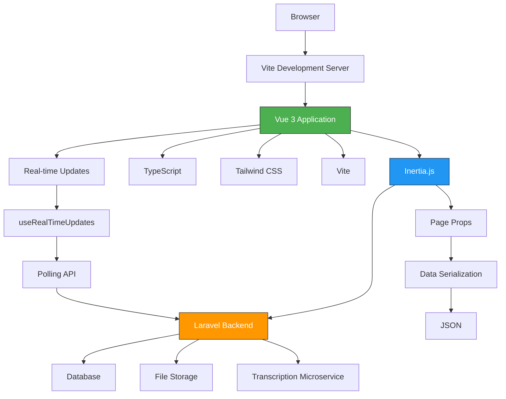
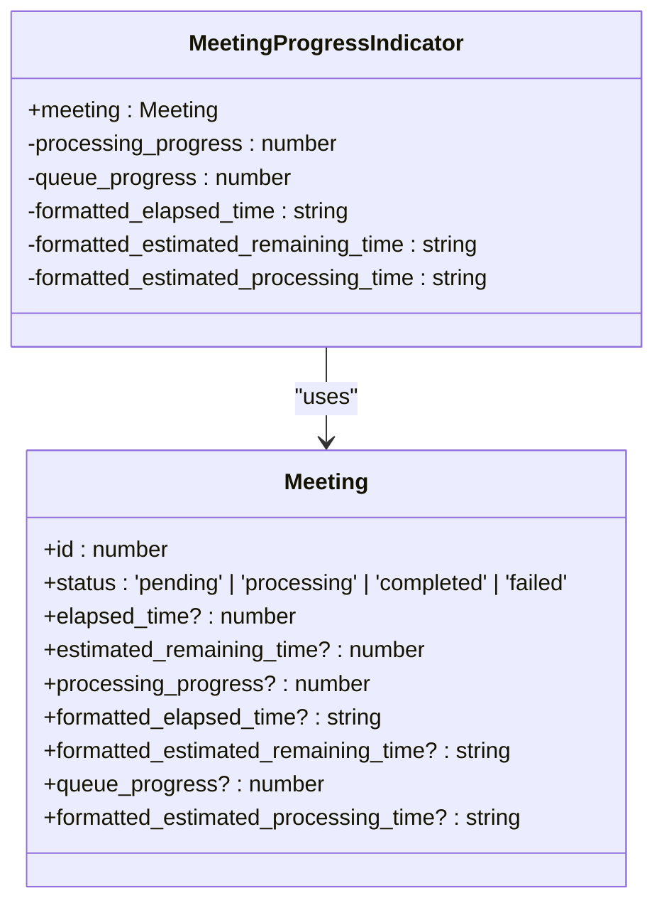
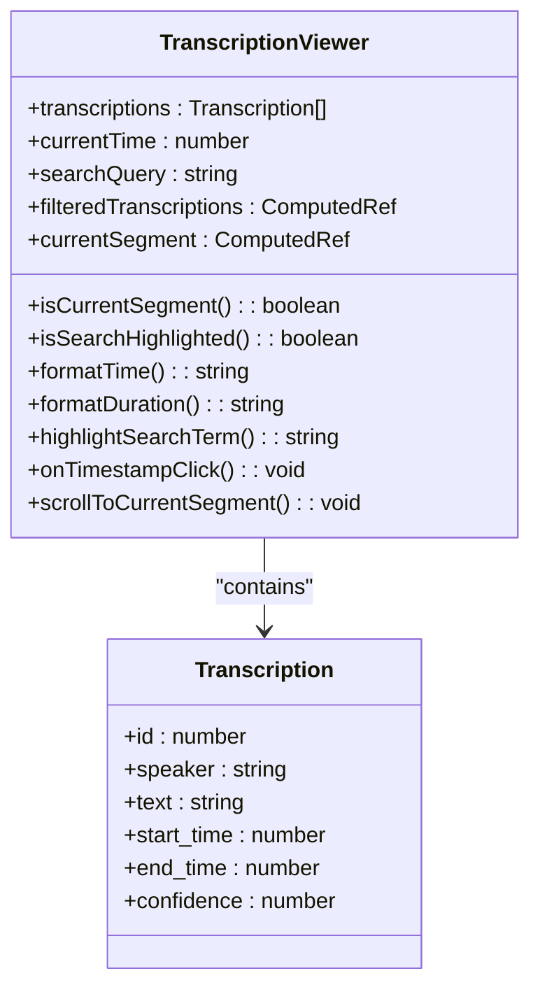
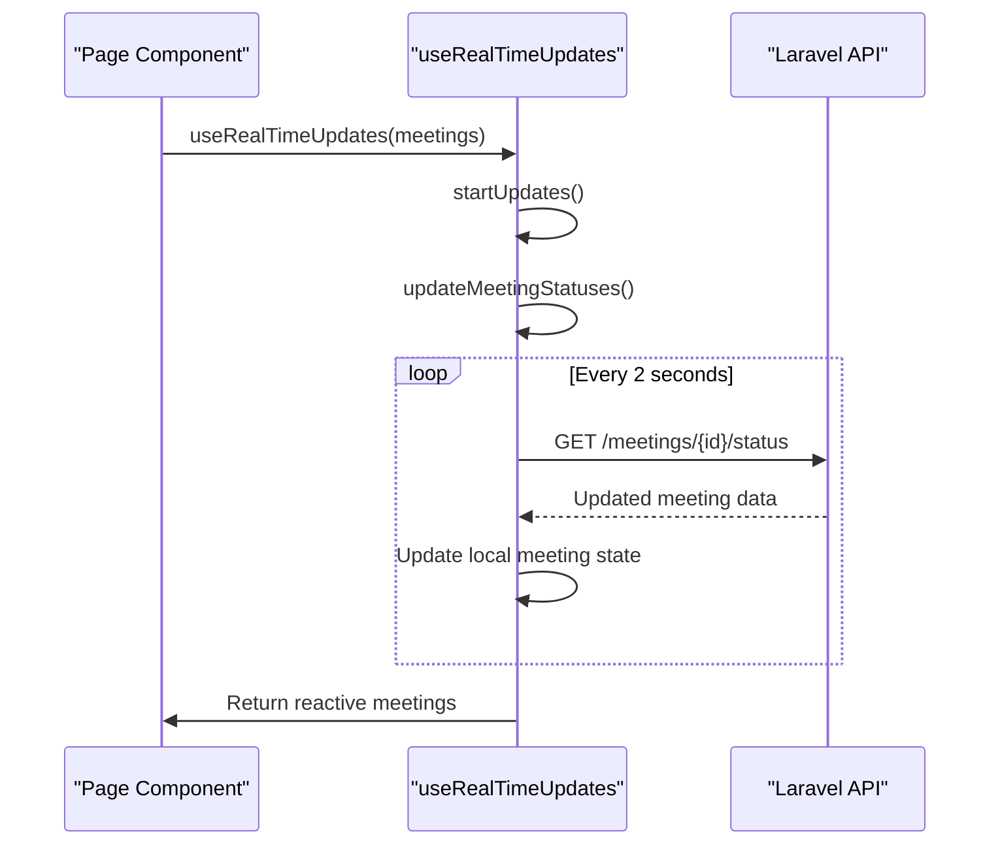
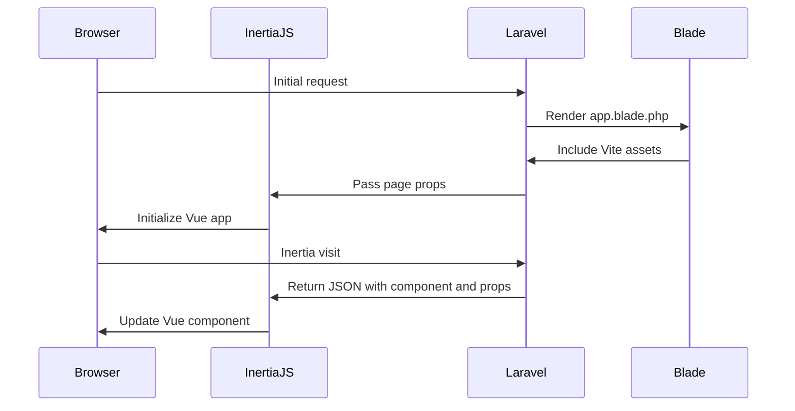
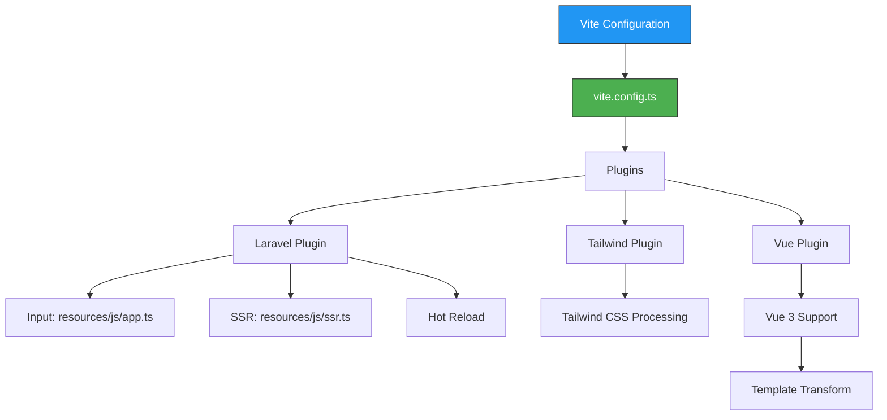
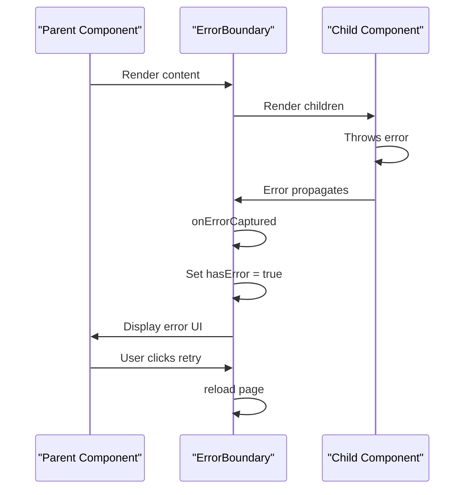

# Frontend Architecture


## Table of Contents
1. [Introduction](#introduction)
2. [Project Structure](#project-structure)
3. [Core Components](#core-components)
4. [Architecture Overview](#architecture-overview)
5. [Detailed Component Analysis](#detailed-component-analysis)
6. [Dependency Analysis](#dependency-analysis)
7. [Performance Considerations](#performance-considerations)
8. [Troubleshooting Guide](#troubleshooting-guide)
9. [Conclusion](#conclusion)

## Introduction
The meetingai application features a modern Vue.js frontend built with Vue 3 and TypeScript, leveraging Inertia.js for seamless integration with a Laravel backend. This architecture enables a single-page application (SPA) experience while maintaining server-side rendering capabilities. The frontend is organized into reusable library components and feature-based pages, providing a scalable structure for managing meeting uploads, processing status visualization, transcription playback, and AI chat interactions. Key architectural decisions include real-time updates via polling, robust error handling, and comprehensive type safety through TypeScript.

## Project Structure
The frontend codebase is organized under the `resources/js` directory with a clear separation between reusable components, pages, and utility modules. The structure follows a feature-based organization with distinct directories for pages and shared components.

```mermaid
graph TB
js[resources/js]
subgraph js
lib[lib/]
pages[pages/]
types[types/]
app[app.ts]
ssr[ssr.ts]
end
lib --> AppLayout[AppLayout.vue]
lib --> MeetingProgressIndicator[MeetingProgressIndicator.vue]
lib --> TranscriptionViewer[TranscriptionViewer.vue]
lib --> ErrorBoundary[ErrorBoundary.vue]
lib --> useRealTimeUpdates[useRealTimeUpdates.ts]
lib --> retryUtils[retryUtils.ts]
lib --> errorHandler[errorHandler.ts]
pages --> AI[AI/]
pages --> Clients[Clients/]
pages --> Meetings[Meetings/]
pages --> Dashboard[Dashboard.vue]
pages --> Welcome[Welcome.vue]
AI --> Chat[Chat.vue]
Clients --> Create[Create.vue]
Clients --> Edit[Edit.vue]
Clients --> Index[Index.vue]
Clients --> Show[Show.vue]
Meetings --> Create[Create.vue]
Meetings --> Index[Index.vue]
Meetings --> Show[Show.vue]
types --> index[types/index.d.ts]
types --> globals[types/globals.d.ts]
style js fill:#f9f,stroke:#333
style lib fill:#bbf,stroke:#333
style pages fill:#bbf,stroke:#333
style types fill:#bbf,stroke:#333
```





**Diagram sources**
- [resources/js/lib/MeetingProgressIndicator.vue](file://resources/js/lib/MeetingProgressIndicator.vue)
- [resources/js/pages/Meetings/Show.vue](file://resources/js/pages/Meetings/Show.vue)
- [resources/js/types/index.d.ts](file://resources/js/types/index.d.ts)

**Section sources**
- [resources/js/app.ts](file://resources/js/app.ts)
- [resources/js/lib/MeetingProgressIndicator.vue](file://resources/js/lib/MeetingProgressIndicator.vue)

## Core Components
The frontend architecture is built around several core components that handle key functionality:

- **MeetingProgressIndicator**: Visualizes the processing status of uploaded meetings with progress bars and time estimates
- **TranscriptionViewer**: Provides synchronized playback of transcriptions with search functionality and timestamp navigation
- **useRealTimeUpdates**: Composable function that implements WebSocket-like functionality via polling for real-time status updates
- **ErrorBoundary**: Component that catches and handles errors in the Vue component tree
- **AppLayout**: Base layout component that provides consistent application structure

These components work together to create a cohesive user experience for managing meeting recordings and their AI-generated transcriptions.

**Section sources**
- [resources/js/lib/MeetingProgressIndicator.vue](file://resources/js/lib/MeetingProgressIndicator.vue)
- [resources/js/lib/TranscriptionViewer.vue](file://resources/js/lib/TranscriptionViewer.vue)
- [resources/js/lib/useRealTimeUpdates.ts](file://resources/js/lib/useRealTimeUpdates.ts)

## Architecture Overview
The frontend architecture follows a component-based design pattern with Vue 3 and TypeScript, integrated with Laravel via Inertia.js. The application is initialized through `app.ts`, which sets up the Inertia.js-powered SPA and configures global error handling.





**Diagram sources**
- [resources/js/app.ts](file://resources/js/app.ts)
- [app/Http/Middleware/HandleInertiaRequests.php](file://app/Http/Middleware/HandleInertiaRequests.php)
- [resources/views/app.blade.php](file://resources/views/app.blade.php)

## Detailed Component Analysis

### MeetingProgressIndicator Analysis
The MeetingProgressIndicator component provides visual feedback for the processing status of meeting recordings, which is critical for user experience during long-running video processing tasks.





**Diagram sources**
- [resources/js/lib/MeetingProgressIndicator.vue](file://resources/js/lib/MeetingProgressIndicator.vue)

**Section sources**
- [resources/js/lib/MeetingProgressIndicator.vue](file://resources/js/lib/MeetingProgressIndicator.vue)

#### Implementation Details
The component displays different visual states based on the meeting's status:

- **Pending**: Shows queue progress with yellow progress bar and estimated processing time
- **Processing**: Displays processing progress with blue progress bar, elapsed time, and estimated remaining time
- **Completed**: Shows success state with green checkmark and total processing time
- **Failed**: Displays error state with red warning icon and retry instructions

The component uses Tailwind CSS for styling and provides smooth transitions between states. The progress bars use CSS transitions for a fluid visual experience.

### TranscriptionViewer Analysis
The TranscriptionViewer component enables synchronized playback of transcriptions with the original video, allowing users to navigate through meeting content efficiently.





**Diagram sources**
- [resources/js/lib/TranscriptionViewer.vue](file://resources/js/lib/TranscriptionViewer.vue)

**Section sources**
- [resources/js/lib/TranscriptionViewer.vue](file://resources/js/lib/TranscriptionViewer.vue)

#### Implementation Details
The component features several key capabilities:

- **Search functionality**: Allows users to search within transcriptions with real-time highlighting
- **Synchronized playback**: Clicking on a timestamp navigates to that point in the video
- **Current segment tracking**: Automatically highlights the transcription segment corresponding to the current video time
- **Smooth scrolling**: Scrolls the current segment into view with smooth animation
- **Duration formatting**: Converts time values into human-readable formats

The component uses Vue's reactivity system to automatically update the UI when the current time changes, ensuring the displayed transcription stays synchronized with the video playback.

### useRealTimeUpdates Composable Analysis
The useRealTimeUpdates composable provides WebSocket-like functionality through polling, enabling real-time updates without requiring a WebSocket connection.





**Diagram sources**
- [resources/js/lib/useRealTimeUpdates.ts](file://resources/js/lib/useRealTimeUpdates.ts)

**Section sources**
- [resources/js/lib/useRealTimeUpdates.ts](file://resources/js/lib/useRealTimeUpdates.ts)

#### Implementation Details
The composable implements the following pattern:

- Accepts an array of meetings and returns a shallowRef of updated meetings
- Filters meetings to only update those with 'pending' or 'processing' status
- Uses axios to fetch updated status from the Laravel backend
- Merges updated data while preserving existing fields
- Implements automatic polling with a 2-second interval
- Starts polling when the component is mounted and stops when unmounted
- Handles errors gracefully with console logging

This approach provides real-time updates without the complexity of WebSocket connections, making it suitable for environments where WebSockets might be blocked or unavailable.

### Inertia.js Integration Analysis
The integration between Inertia.js and the Laravel backend enables a seamless SPA experience with server-side rendering capabilities.





**Diagram sources**
- [resources/js/app.ts](file://resources/js/app.ts)
- [resources/views/app.blade.php](file://resources/views/app.blade.php)
- [app/Http/Middleware/HandleInertiaRequests.php](file://app/Http/Middleware/HandleInertiaRequests.php)

**Section sources**
- [resources/js/app.ts](file://resources/js/app.ts)
- [app/Http/Middleware/HandleInertiaRequests.php](file://app/Http/Middleware/HandleInertiaRequests.php)

#### Implementation Details
Key aspects of the Inertia.js integration:

- **Page props**: Data is serialized from Laravel to Vue components through Inertia's page props mechanism
- **Shared data**: The HandleInertiaRequests middleware shares user, flash messages, CSRF token, and Ziggy route data
- **Component resolution**: Vite and Laravel-Vite-Plugin resolve Vue components based on the requested route
- **Server-side rendering**: Configured in inertia.php with SSR enabled and a dedicated URL
- **Asset management**: Vite handles asset compilation and hot module replacement

The integration allows for a hybrid approach where the initial page load includes server-rendered content, while subsequent navigation happens client-side without full page reloads.

### TypeScript Typing Analysis
The application uses TypeScript extensively for type safety across components, with type definitions in index.d.ts and globals.d.ts.


```mermaid
classDiagram
class AppPageProps {
+name : string
+quote : { message : string; author : string }
+auth : Auth
+ziggy : Config & { location : string }
+csrf_token : string
+flash? : { success? : string; error? : string }
}
class Auth {
+user : User
}
class User {
+id : number
+name : string
+email : string
+avatar? : string
+email_verified_at : string | null
+created_at : string
+updated_at : string
}
class Client {
+id : number
+name : string
+email : string | null
+company : string | null
+phone : string | null
+meetings_count? : number
+meetings? : Meeting[]
+created_at : string
+updated_at : string
}
class Meeting {
+id : number
+client_id : number
+title : string
+video_path : string
+status : 'pending' | 'processing' | 'completed' | 'failed'
+duration : number | null
+uploaded_at : string
+processing_started_at : string | null
+processing_completed_at : string | null
+client? : Client
+created_at : string
+updated_at : string
}
AppPageProps <|-- Auth
Auth <|-- User
Meeting <|-- Client
```


**Diagram sources**
- [resources/js/types/index.d.ts](file://resources/js/types/index.d.ts)
- [resources/js/types/globals.d.ts](file://resources/js/types/globals.d.ts)

**Section sources**
- [resources/js/types/index.d.ts](file://resources/js/types/index.d.ts)
- [resources/js/types/globals.d.ts](file://resources/js/types/globals.d.ts)

#### Implementation Details
The type system provides several benefits:

- **AppPageProps**: Extends Inertia's PageProps with application-specific types
- **Module augmentation**: Extends Vue's ComponentCustomProperties with $inertia, $page, and $headManager
- **ImportMeta extension**: Adds VITE_APP_NAME to ImportMetaEnv
- **Generic typing**: Uses generics in AppPageProps to allow additional props
- **Union types**: Uses union types for status fields (e.g., 'pending' | 'processing' | 'completed' | 'failed')

This comprehensive typing system ensures type safety across the entire application, reducing runtime errors and improving developer experience.

### Asset Building Analysis
The application uses Vite for asset building with Tailwind CSS for styling, providing a modern development experience.





**Diagram sources**
- [vite.config.ts](file://vite.config.ts)
- [package.json](file://package.json)

**Section sources**
- [vite.config.ts](file://vite.config.ts)

#### Implementation Details
Key aspects of the asset building configuration:

- **Vite plugins**: Uses @vitejs/plugin-vue, laravel-vite-plugin, and @tailwindcss/vite
- **Laravel integration**: Configured with input file (app.ts) and SSR entry point (ssr.ts)
- **Tailwind CSS**: Integrated via @tailwindcss/vite plugin for JIT compilation
- **Vue configuration**: Configured with transformAssetUrls to handle asset URLs
- **Development scripts**: Includes build, dev, and SSR build scripts in package.json

This configuration enables fast development with hot module replacement and optimized production builds.

### Error Boundary Analysis
The ErrorBoundary component implements a robust error handling pattern to prevent application crashes and provide graceful recovery options.





**Diagram sources**
- [resources/js/lib/ErrorBoundary.vue](file://resources/js/lib/ErrorBoundary.vue)

**Section sources**
- [resources/js/lib/ErrorBoundary.vue](file://resources/js/lib/ErrorBoundary.vue)

#### Implementation Details
The error boundary implements the following pattern:

- Uses Vue's onErrorCaptured hook to catch errors in child components
- Displays a user-friendly error message with recovery options
- Provides "Try Again" button that reloads the page
- Provides "Go to Dashboard" button that navigates to the home page
- Includes technical details in a collapsible section for debugging
- Logs errors to the console for developer visibility

This approach ensures that errors in one part of the application don't bring down the entire interface, providing a more resilient user experience.

## Dependency Analysis
The frontend dependencies are managed through npm with a focus on modern tooling and frameworks.


```mermaid
graph TD
A[meetingai Frontend] --> B[@inertiajs/vue3]
A --> C[vue]
A --> D[tailwindcss]
A --> E[vite]
A --> F[@vitejs/plugin-vue]
A --> G[laravel-vite-plugin]
A --> H[@tailwindcss/vite]
A --> I[typescript]
A --> J[ziggy-js]
B --> K[@inertiajs/core]
K --> L[axios]
K --> M[es-toolkit]
style A fill:#4CAF50,stroke:#333,color:white
```


**Diagram sources**
- [package.json](file://package.json)
- [package-lock.json](file://package-lock.json)

**Section sources**
- [package.json](file://package.json)

## Performance Considerations
The application implements several performance optimizations:

- **Vite**: Uses Vite for fast development server startup and hot module replacement
- **Code splitting**: Inertia.js automatically splits code by page component
- **Polling optimization**: The useRealTimeUpdates composable only polls active meetings
- **Shallow refs**: Uses shallowRef for performance when deep reactivity is not needed
- **Computed properties**: Uses computed properties to avoid redundant calculations
- **Event delegation**: Uses event delegation for better performance in lists

For long-running video processing tasks, the application provides real-time feedback through the MeetingProgressIndicator component, which helps manage user expectations during potentially lengthy operations.

## Troubleshooting Guide
Common issues and their solutions:

**Section sources**
- [resources/js/lib/errorHandler.ts](file://resources/js/lib/errorHandler.ts)
- [resources/js/lib/ErrorBoundary.vue](file://resources/js/lib/ErrorBoundary.vue)

### Network Errors
- **Symptom**: "Failed to update status for meeting" in console
- **Solution**: Check network connectivity and API endpoint availability
- **Prevention**: Implement retry logic with exponential backoff

### Type Errors
- **Symptom**: TypeScript compilation errors
- **Solution**: Ensure type definitions in index.d.ts match API responses
- **Prevention**: Use strict TypeScript configuration

### Inertia.js Issues
- **Symptom**: Page not updating after navigation
- **Solution**: Check that page component paths match file structure
- **Prevention**: Use consistent naming conventions

### Vite Build Problems
- **Symptom**: Assets not loading in production
- **Solution**: Run `npm run build` and verify manifest.json
- **Prevention**: Test build process regularly

## Conclusion
The meetingai frontend architecture demonstrates a well-structured Vue 3 application with TypeScript, leveraging Inertia.js for seamless Laravel integration. The component-based design promotes reusability and maintainability, while the use of composables like useRealTimeUpdates enables clean separation of concerns. The comprehensive type system ensures type safety across the application, and the error boundary pattern provides resilience against runtime errors. The integration of Vite and Tailwind CSS delivers a modern development experience with fast builds and responsive design. Overall, the architecture effectively supports the application's core functionality of uploading, processing, and interacting with meeting recordings through AI-powered features.

**Referenced Files in This Document**   
- [app.ts](file://resources/js/app.ts)
- [MeetingProgressIndicator.vue](file://resources/js/lib/MeetingProgressIndicator.vue)
- [TranscriptionViewer.vue](file://resources/js/lib/TranscriptionViewer.vue)
- [useRealTimeUpdates.ts](file://resources/js/lib/useRealTimeUpdates.ts)
- [index.d.ts](file://resources/js/types/index.d.ts)
- [globals.d.ts](file://resources/js/types/globals.d.ts)
- [vite.config.ts](file://vite.config.ts)
- [ErrorBoundary.vue](file://resources/js/lib/ErrorBoundary.vue)
- [retryUtils.ts](file://resources/js/lib/retryUtils.ts)
- [app.blade.php](file://resources/views/app.blade.php)
- [HandleInertiaRequests.php](file://app/Http/Middleware/HandleInertiaRequests.php)