# Component Library


## Table of Contents
1. [Introduction](#introduction)
2. [Core Components Overview](#core-components-overview)
3. [UI Controls](#ui-controls)
4. [Layout Wrappers](#layout-wrappers)
5. [Status Indicators](#status-indicators)
6. [Feedback Elements](#feedback-elements)
7. [Media Components](#media-components)
8. [Utility Functions](#utility-functions)
9. [Composables](#composables)
10. [Error Handling and Resilience](#error-handling-and-resilience)
11. [Integration Examples](#integration-examples)
12. [Accessibility and Responsive Design](#accessibility-and-responsive-design)

## Introduction
The MeetingAI frontend component library provides a comprehensive set of reusable Vue components, utility functions, and composables that power the application's user interface. This library enables consistent UI patterns, robust error handling, and real-time data synchronization across the application. The components are built with accessibility, responsiveness, and maintainability in mind, leveraging Vue 3's composition API and Tailwind CSS for styling.

**Section sources**
- [AppLayout.vue](file://resources/js/lib/AppLayout.vue)
- [FormField.vue](file://resources/js/lib/FormField.vue)

## Core Components Overview
The component library is organized into several categories based on functionality:
- **UI Controls**: FormField, FormValidator
- **Layout Wrappers**: AppLayout, ErrorBoundary
- **Status Indicators**: MeetingProgressIndicator, MeetingStatusBadge
- **Feedback Elements**: Toast, LoadingSpinner
- **Media Components**: VideoPlayer, TranscriptionViewer
- **Utilities**: errorHandler.ts, retryUtils.ts, utils.ts
- **Composables**: useRealTimeUpdates.ts

These components follow a consistent design system with proper TypeScript typing, accessibility features, and responsive behavior. They are designed to work together seamlessly while remaining independently reusable.


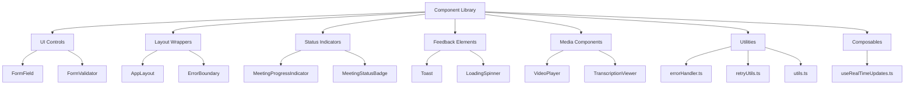


**Diagram sources**
- [AppLayout.vue](file://resources/js/lib/AppLayout.vue)
- [FormField.vue](file://resources/js/lib/FormField.vue)
- [FormValidator.vue](file://resources/js/lib/FormValidator.vue)
- [MeetingProgressIndicator.vue](file://resources/js/lib/MeetingProgressIndicator.vue)
- [MeetingStatusBadge.vue](file://resources/js/lib/MeetingStatusBadge.vue)
- [Toast.vue](file://resources/js/lib/Toast.vue)
- [LoadingSpinner.vue](file://resources/js/lib/LoadingSpinner.vue)
- [VideoPlayer.vue](file://resources/js/lib/VideoPlayer.vue)
- [TranscriptionViewer.vue](file://resources/js/lib/TranscriptionViewer.vue)
- [errorHandler.ts](file://resources/js/lib/errorHandler.ts)
- [retryUtils.ts](file://resources/js/lib/retryUtils.ts)
- [utils.ts](file://resources/js/lib/utils.ts)
- [useRealTimeUpdates.ts](file://resources/js/lib/useRealTimeUpdates.ts)

## UI Controls

### FormField Component
The FormField component is a versatile input control that supports multiple input types including text, email, password, number, textarea, and select. It provides built-in validation feedback, loading states, and accessibility features.

**Props:**
- `modelValue`: The input value (string | number)
- `type`: Input type ('text' | 'email' | 'password' | 'number' | 'tel' | 'url' | 'textarea' | 'select')
- `label`: Field label text
- `placeholder`: Placeholder text
- `help`: Help text displayed below the field
- `error`: Error message to display
- `required`: Whether the field is required
- `disabled`: Whether the field is disabled
- `readonly`: Whether the field is read-only
- `loading`: Whether to show a loading spinner
- `showSuccess`: Whether to show a success indicator
- `autocomplete`: Autocomplete attribute
- `rows`: Number of rows for textarea
- `maxLength`: Maximum character count
- `options`: Options for select input
- `validateOnBlur`: Whether to validate on blur
- `validateOnInput`: Whether to validate on input
- `validator`: Custom validation function

**Events:**
- `update:modelValue`: Emitted when the input value changes
- `blur`: Emitted when the field loses focus
- `focus`: Emitted when the field gains focus
- `validate`: Emitted when validation occurs

**Slots:**
- Default slot for custom content


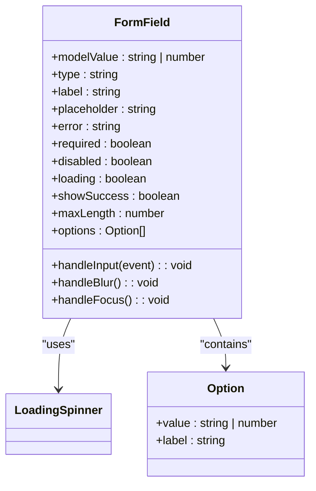


**Diagram sources**
- [FormField.vue](file://resources/js/lib/FormField.vue)
- [LoadingSpinner.vue](file://resources/js/lib/LoadingSpinner.vue)

**Section sources**
- [FormField.vue](file://resources/js/lib/FormField.vue)

### FormValidator Component
The FormValidator component provides a flexible validation system for forms, supporting both built-in and custom validation rules. It uses the renderless pattern, exposing validation state through scoped slots.

**Props:**
- `validationRules`: Object defining validation rules for each field
- `showErrorsOnSubmit`: Whether to show errors when form is submitted
- `validateOnBlur`: Whether to validate fields on blur
- `validateOnInput`: Whether to validate fields on input
- `formClass`: CSS classes to apply to the form element

**Events:**
- `submit`: Emitted when the form is submitted, with validation status and errors
- `validation-change`: Emitted when validation state changes

**Scoped Slot Props:**
- `errors`: Object containing field error messages
- `hasErrors`: Whether the form has any errors
- `isSubmitting`: Whether the form is currently being submitted
- `isValid`: Whether the form is valid
- `validate(fieldName)`: Method to validate a specific field
- `clearErrors(fieldName)`: Method to clear errors for a specific field

**Validation Rules:**
- `required`: Field is required
- `min`: Minimum length/value
- `max`: Maximum length/value
- `email`: Must be a valid email
- `url`: Must be a valid URL
- `pattern`: Must match specified RegExp
- `custom`: Custom validation function


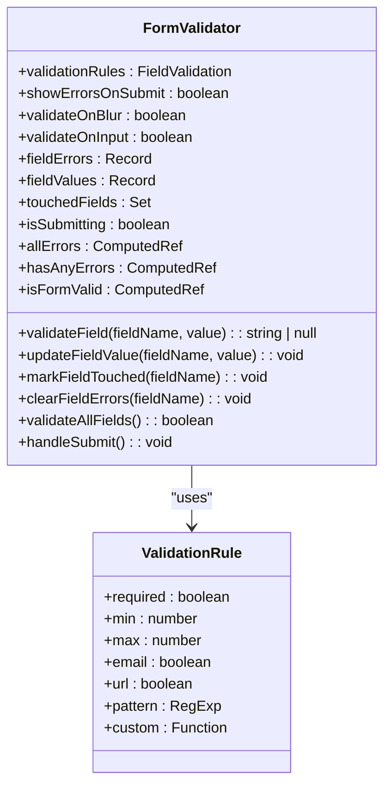


**Diagram sources**
- [FormValidator.vue](file://resources/js/lib/FormValidator.vue)

**Section sources**
- [FormValidator.vue](file://resources/js/lib/FormValidator.vue)

## Layout Wrappers

### AppLayout Component
The AppLayout component serves as the primary layout wrapper for the application, providing consistent navigation, header, and content structure across all pages.

**Features:**
- Responsive navigation with mobile menu
- Flash message display (success/error)
- ErrorBoundary wrapper for graceful error recovery
- Consistent spacing and typography
- Active link highlighting

**Structure:**
- Navigation bar with logo and links
- Mobile-responsive menu
- Flash message display area
- Main content area with consistent padding

**Accessibility Features:**
- Proper semantic HTML structure
- Keyboard navigation support
- ARIA labels for interactive elements
- Focus management


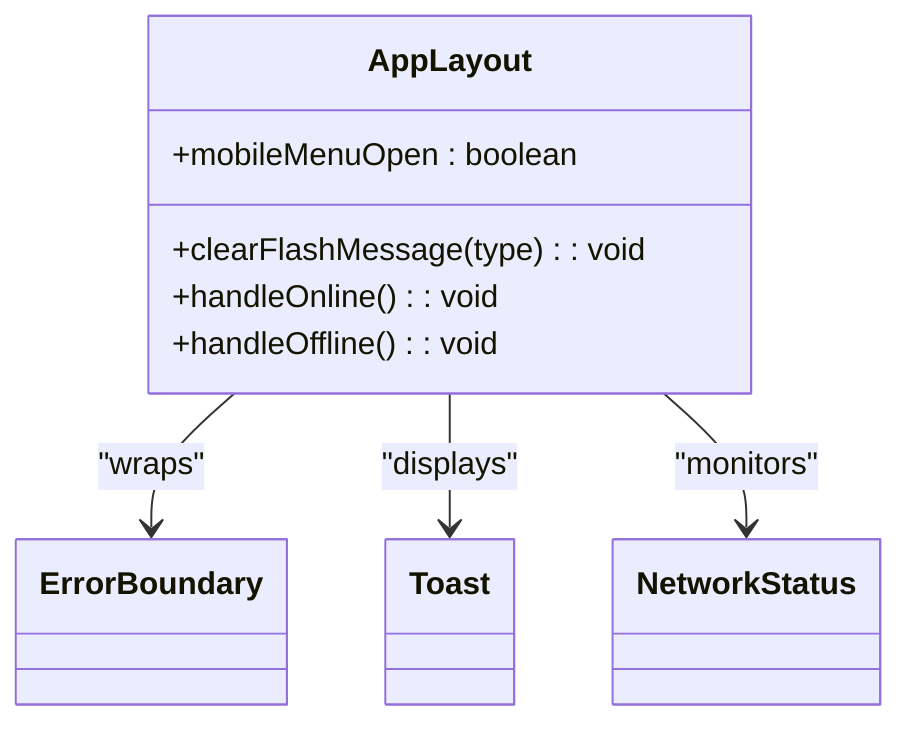


**Diagram sources**
- [AppLayout.vue](file://resources/js/lib/AppLayout.vue)
- [ErrorBoundary.vue](file://resources/js/lib/ErrorBoundary.vue)
- [Toast.vue](file://resources/js/lib/Toast.vue)
- [NetworkStatus.vue](file://resources/js/lib/NetworkStatus.vue)

**Section sources**
- [AppLayout.vue](file://resources/js/lib/AppLayout.vue)

## Status Indicators

### MeetingProgressIndicator Component
The MeetingProgressIndicator component visually displays the processing status of a meeting, showing progress bars and timing information based on the meeting's current state.

**States:**
- **Pending**: Shows queue progress with estimated processing time
- **Processing**: Shows processing progress with elapsed and remaining time
- **Completed**: Shows completion status with total processing time
- **Failed**: Shows failure status with retry suggestion

**Props:**
- `meeting`: Meeting object with status and timing properties

**Meeting Interface:**

```typescript
interface Meeting {
  id: number
  status: 'pending' | 'processing' | 'completed' | 'failed'
  elapsed_time?: number | null
  estimated_remaining_time?: number | null
  processing_progress?: number | null
  formatted_elapsed_time?: string | null
  formatted_estimated_remaining_time?: string | null
  queue_progress?: number | null
  formatted_estimated_processing_time?: string | null
}
```


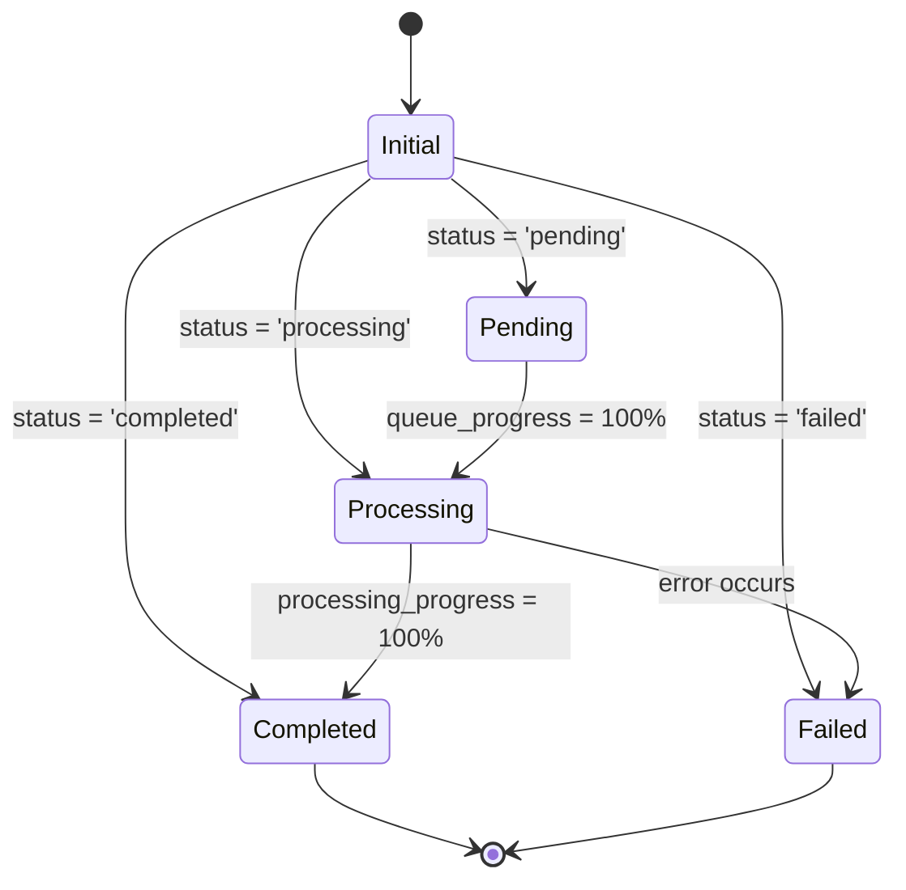


**Diagram sources**
- [MeetingProgressIndicator.vue](file://resources/js/lib/MeetingProgressIndicator.vue)

**Section sources**
- [MeetingProgressIndicator.vue](file://resources/js/lib/MeetingProgressIndicator.vue)

### MeetingStatusBadge Component
The MeetingStatusBadge component displays a compact status indicator for meetings, with visual cues, icons, and interactive elements for failed meetings.

**Features:**
- Color-coded status badges
- Animated spinner for pending/processing states
- Error details display for failed meetings
- Retry functionality
- Technical error details toggle

**Props:**
- `meeting`: Meeting object with status and error information
- `showProgress`: Whether to show progress indicators
- `canRetry`: Whether retry is allowed
- `isRetrying`: Whether a retry is in progress

**Events:**
- `retry`: Emitted when retry is requested


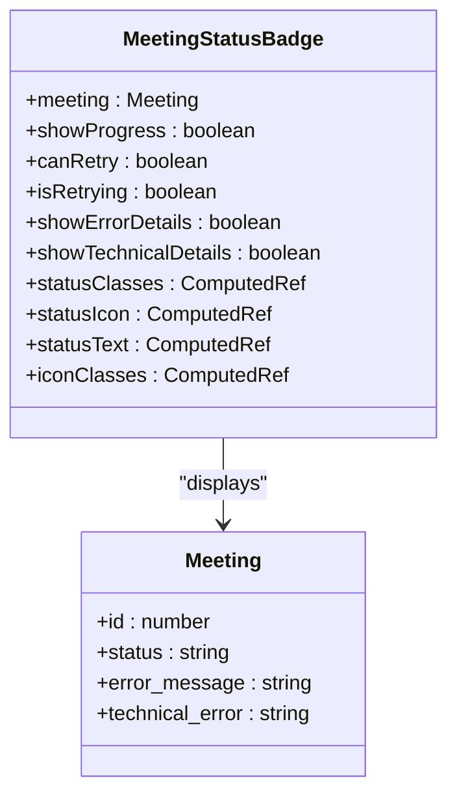


**Diagram sources**
- [MeetingStatusBadge.vue](file://resources/js/lib/MeetingStatusBadge.vue)

**Section sources**
- [MeetingStatusBadge.vue](file://resources/js/lib/MeetingStatusBadge.vue)

## Feedback Elements

### Toast Component
The Toast component provides temporary, non-blocking notifications to users, supporting multiple types and interactive actions.

**Features:**
- Multiple toast types (success, error, warning, info)
- Auto-dismissal with configurable duration
- Manual dismissal
- Action buttons with primary/secondary styling
- Global registration for easy access

**Props:**
- `toasts`: Array of toast objects to display

**Toast Interface:**

```typescript
interface Toast {
  id: string
  type: 'success' | 'error' | 'warning' | 'info'
  title: string
  message?: string
  duration?: number
  actions?: ToastAction[]
}
```


**ToastAction Interface:**

```typescript
interface ToastAction {
  label: string
  handler: () => void
  primary?: boolean
}
```


**Global Methods:**
- `showSuccess(title, message, options)`
- `showError(title, message, options)`
- `showWarning(title, message, options)`
- `showInfo(title, message, options)`
- `addToast(toast)`
- `removeToast(id)`
- `clearAll()`


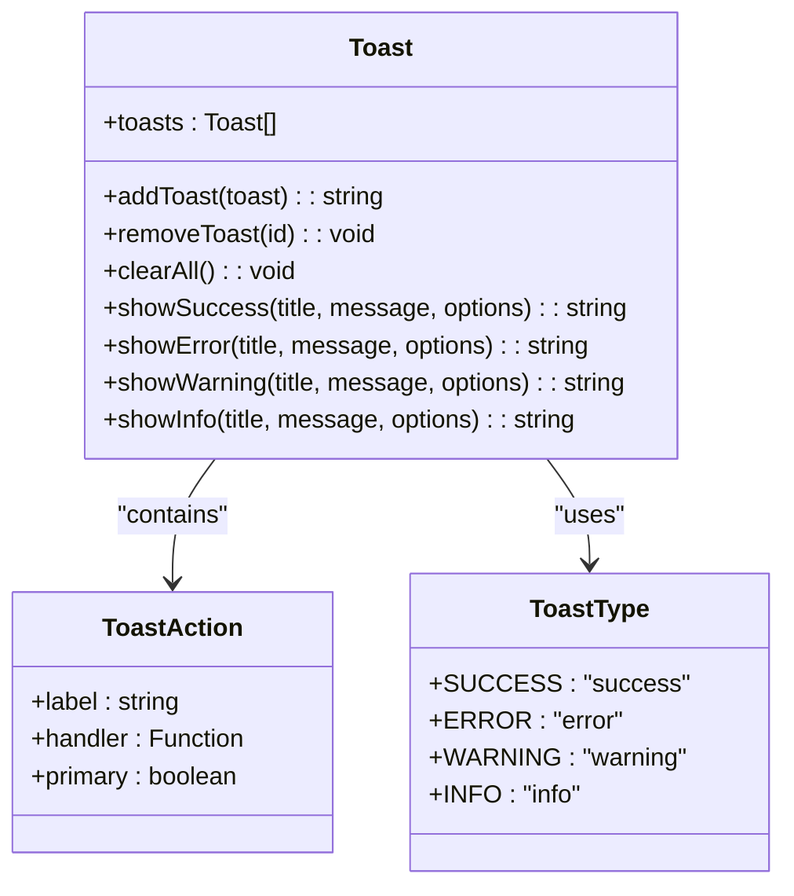


**Diagram sources**
- [Toast.vue](file://resources/js/lib/Toast.vue)

**Section sources**
- [Toast.vue](file://resources/js/lib/Toast.vue)

### LoadingSpinner Component
The LoadingSpinner component displays a loading indicator with optional text and overlay functionality.

**Props:**
- `size`: Size of the spinner ('sm' | 'md' | 'lg' | 'xl')
- `color`: Color of the spinner
- `text`: Optional loading text
- `subtext`: Optional subtext
- `overlay`: Whether to display as an overlay
- `fullscreen`: Whether to display as fullscreen overlay
- `showDot`: Whether to show a center dot

**Features:**
- Multiple size options
- Customizable color
- Text and subtext display
- Overlay modes (element overlay or fullscreen)
- Responsive sizing


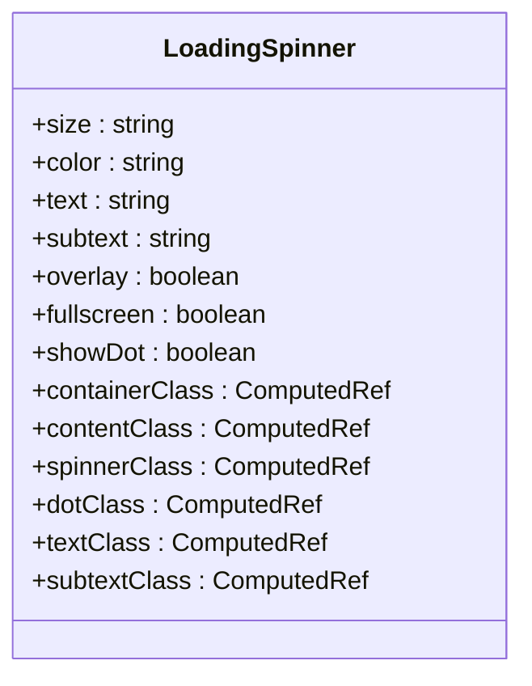


**Diagram sources**
- [LoadingSpinner.vue](file://resources/js/lib/LoadingSpinner.vue)

**Section sources**
- [LoadingSpinner.vue](file://resources/js/lib/LoadingSpinner.vue)

## Media Components

### VideoPlayer Component
The VideoPlayer component provides a customizable video playback interface with error handling and integration capabilities.

**Props:**
- `videoUrl`: URL of the video to play
- `currentTime`: Current playback time (for synchronization)

**Events:**
- `timeUpdate`: Emitted when playback time changes
- `durationChange`: Emitted when video duration is known
- `play`: Emitted when playback starts
- `pause`: Emitted when playback pauses
- `ended`: Emitted when playback ends
- `error`: Emitted when a video error occurs

**Features:**
- Native HTML5 video controls
- Loading state with spinner
- Error state with retry functionality
- Time display (current/duration)
- Playback status indicator
- Error-specific user guidance
- Automatic retry with toast notifications


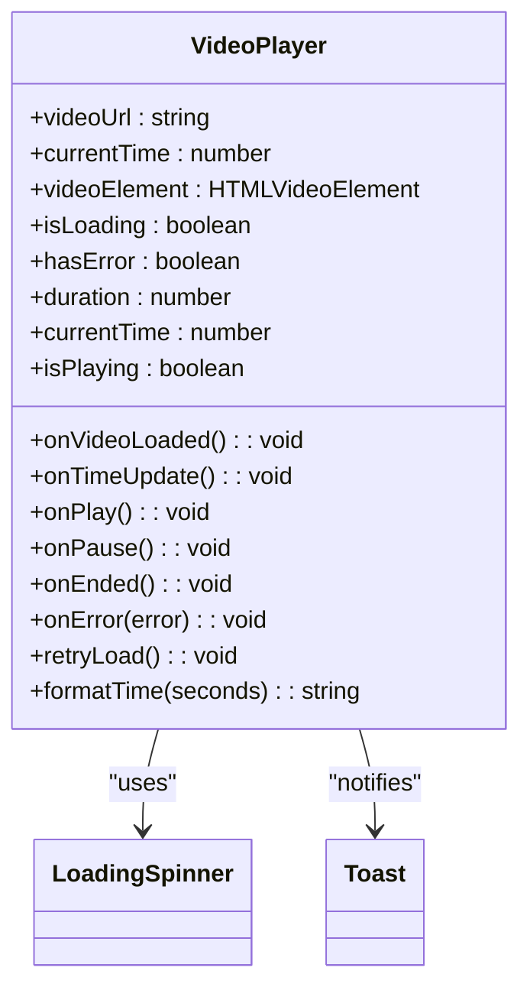


**Diagram sources**
- [VideoPlayer.vue](file://resources/js/lib/VideoPlayer.vue)
- [LoadingSpinner.vue](file://resources/js/lib/LoadingSpinner.vue)
- [Toast.vue](file://resources/js/lib/Toast.vue)

**Section sources**
- [VideoPlayer.vue](file://resources/js/lib/VideoPlayer.vue)

### TranscriptionViewer Component
The TranscriptionViewer component displays meeting transcriptions with search functionality and video synchronization.

**Props:**
- `transcriptions`: Array of transcription segments
- `currentTime`: Current video playback time

**Events:**
- `timestampClick`: Emitted when a timestamp is clicked

**Features:**
- Search functionality with highlighting
- Current segment highlighting
- Search result highlighting
- Click-to-seek functionality
- Speaker identification
- Time formatting
- Duration display
- Smooth scrolling to current segment

**Transcription Interface:**

```typescript
interface Transcription {
  id: number
  speaker: string
  text: string
  start_time: number
  end_time: number
  confidence: number
}
```


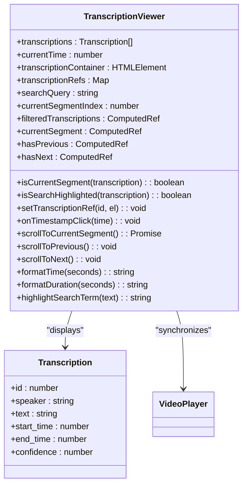


**Diagram sources**
- [TranscriptionViewer.vue](file://resources/js/lib/TranscriptionViewer.vue)
- [VideoPlayer.vue](file://resources/js/lib/VideoPlayer.vue)

**Section sources**
- [TranscriptionViewer.vue](file://resources/js/lib/TranscriptionViewer.vue)

## Utility Functions

### errorHandler.ts
The errorHandler.ts module provides a comprehensive error handling system with error categorization, user-friendly messaging, and logging.

**ErrorContext Interface:**

```typescript
interface ErrorContext {
  component?: string
  action?: string
  data?: any
  userId?: string | number
}
```


**ErrorDetails Interface:**

```typescript
interface ErrorDetails {
  message: string
  code?: string | number
  type: 'network' | 'validation' | 'server' | 'client' | 'unknown'
  recoverable: boolean
  userMessage: string
  technicalMessage?: string
  suggestions?: string[]
}
```


**ErrorHandler Class:**
- Singleton pattern with getInstance()
- parseError(): Categorizes and formats errors
- handleError(): Handles errors with user feedback
- logError(): Logs errors with context
- showUserMessage(): Displays user-friendly error messages

**Error Types Handled:**
- Network errors
- HTTP status codes (400, 401, 403, 404, 413, 422, 429, 500+)
- File upload errors
- Validation errors
- JavaScript client errors
- Unknown errors


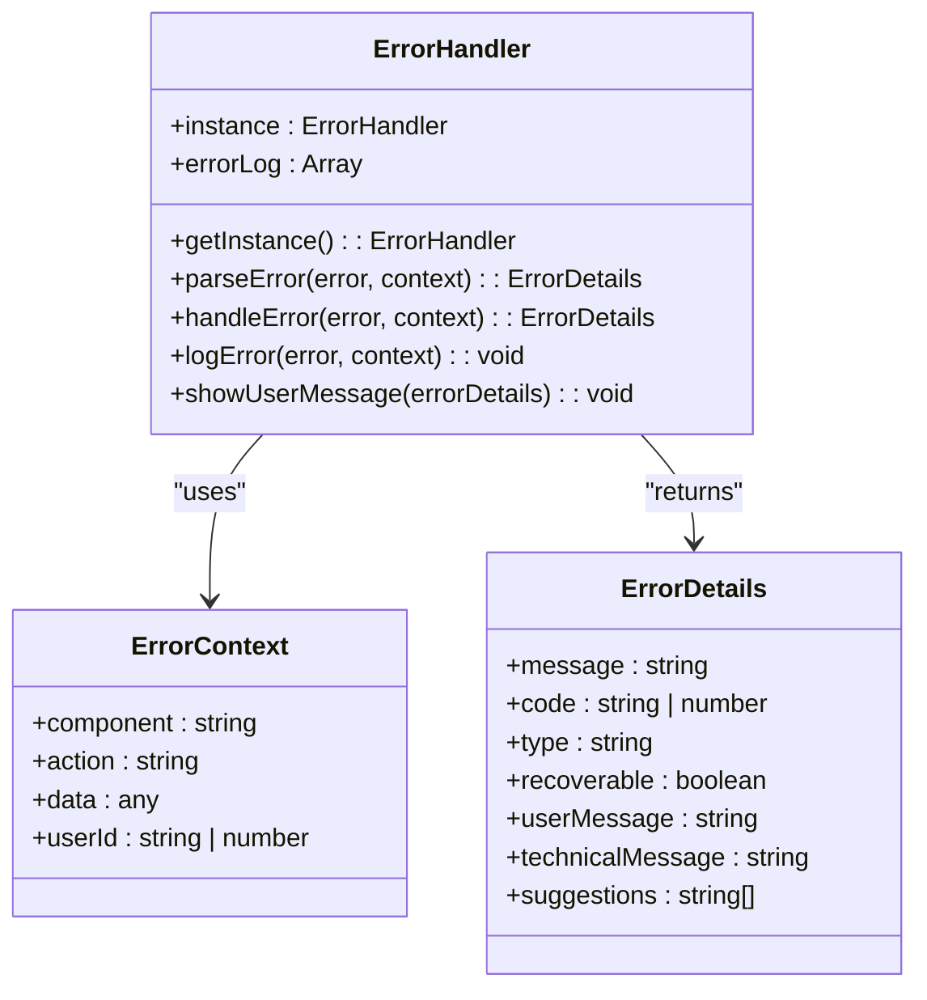


**Diagram sources**
- [errorHandler.ts](file://resources/js/lib/errorHandler.ts)

**Section sources**
- [errorHandler.ts](file://resources/js/lib/errorHandler.ts)

### retryUtils.ts
The retryUtils.ts module provides robust retry mechanisms for handling transient failures, particularly in network operations.

**RetryOptions Interface:**

```typescript
interface RetryOptions {
  maxAttempts?: number
  delay?: number
  backoff?: 'linear' | 'exponential'
  maxDelay?: number
  retryCondition?: (error: any) => boolean
  onRetry?: (attempt: number, error: any) => void
}
```


**RetryError Class:**
- Extends Error with attempt tracking
- Contains last error information

**Key Functions:**
- `retry()`: Generic retry function with configurable options
- `sleep()`: Utility for delaying execution
- `retryNetworkRequest()`: Specialized for network requests
- `retryWithBackoff()`: Exponential backoff implementation
- `makeRetryable()`: Decorator for making functions retryable
- `retryFileUpload()`: Specialized for file uploads
- `CircuitBreaker`: Prevents cascading failures

**Retry Strategies:**
- Exponential backoff with jitter
- Linear backoff
- Configurable retry conditions
- Attempt tracking
- Delay customization


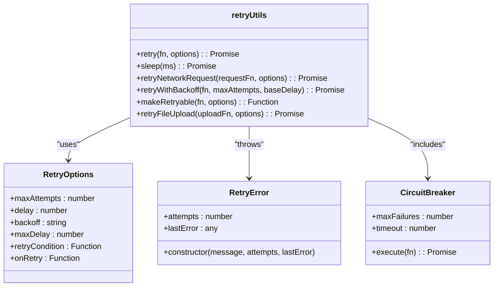


**Diagram sources**
- [retryUtils.ts](file://resources/js/lib/retryUtils.ts)

**Section sources**
- [retryUtils.ts](file://resources/js/lib/retryUtils.ts)

### utils.ts
The utils.ts module provides common utility functions for the application.

**cn() Function:**
- Combines class names using clsx and tailwind-merge
- Resolves Tailwind CSS class conflicts
- Supports conditional classes
- Optimizes class ordering


```typescript
export function cn(...inputs: ClassValue[]) {
    return twMerge(clsx(inputs));
}
```


This utility is essential for working with Tailwind CSS, ensuring that conflicting classes are properly resolved and that the final class string is optimized.

**Section sources**
- [utils.ts](file://resources/js/lib/utils.ts)

## Composables

### useRealTimeUpdates Composable
The useRealTimeUpdates composable provides real-time status updates for meetings through periodic polling.

**Function Signature:**

```typescript
function useRealTimeUpdates<T extends BaseMeeting>(meetings: T[])
```


**BaseMeeting Interface:**

```typescript
interface BaseMeeting {
  id: number
  status: 'pending' | 'processing' | 'completed' | 'failed'
  elapsed_time?: number | null
  estimated_remaining_time?: number | null
  processing_progress?: number | null
  formatted_elapsed_time?: string | null
  formatted_estimated_remaining_time?: string | null
  queue_progress?: number | null
}
```


**Returned Properties:**
- `meetings`: Reactive array of updated meetings
- `startUpdates()`: Starts the polling interval
- `stopUpdates()`: Stops the polling interval
- `updateMeetingStatuses()`: Manually triggers an update

**Features:**
- Automatic polling every 2 seconds
- Mounted/unmounted lifecycle handling
- Selective updating of active meetings
- Type-safe preservation of extra fields
- Error handling for individual meeting updates


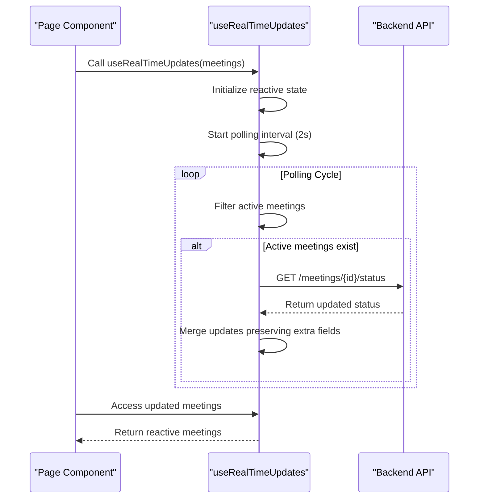


**Diagram sources**
- [useRealTimeUpdates.ts](file://resources/js/lib/useRealTimeUpdates.ts)

**Section sources**
- [useRealTimeUpdates.ts](file://resources/js/lib/useRealTimeUpdates.ts)

## Error Handling and Resilience

### ErrorBoundary Component
The ErrorBoundary component provides graceful error recovery by catching errors in child components and displaying a fallback UI.

**Features:**
- Catches errors in child component tree
- Displays user-friendly error message
- Provides refresh option
- Prevents application crashes
- Maintains application state

**Implementation:**
- Uses Vue's errorCaptured hook
- Tracks error state
- Provides fallback content
- Allows recovery attempts

**Section sources**
- [ErrorBoundary.vue](file://resources/js/lib/ErrorBoundary.vue)

### NetworkStatus Component
The NetworkStatus component monitors network connectivity and provides offline/online status.

**Features:**
- Listens to browser online/offline events
- Displays connection status
- Handles reconnection scenarios
- Prevents duplicate timeouts
- Exposes status globally

**Implementation:**
- Uses window online/offline events
- Manages reconnection timeout
- Provides reactive status
- Cleans up event listeners


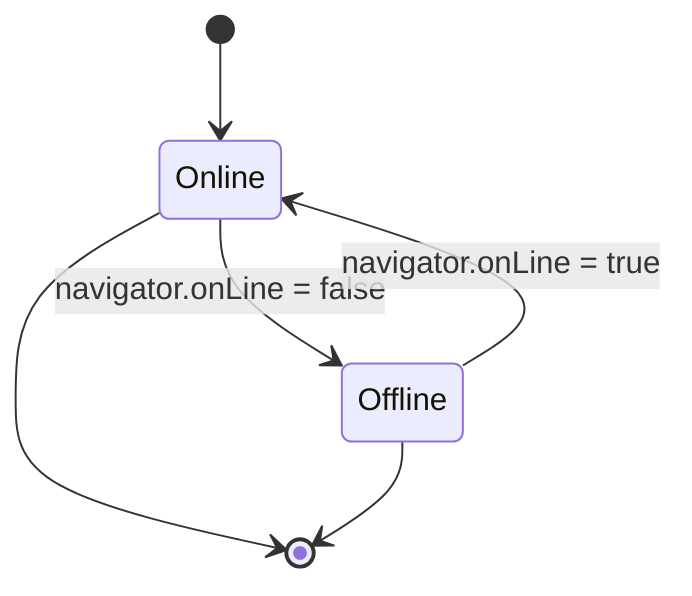


**Diagram sources**
- [NetworkStatus.vue](file://resources/js/lib/NetworkStatus.vue)

**Section sources**
- [NetworkStatus.vue](file://resources/js/lib/NetworkStatus.vue)

## Integration Examples

### Meetings Index Page Integration
The Meetings Index page demonstrates the integration of multiple library components, particularly the useRealTimeUpdates composable.


```typescript
// In Meetings/Index.vue
const { meetings: realtimeMeetings } = useRealTimeUpdates(props.meetings.data)

// Keep real-time list in sync when Inertia updates props
watch(
  () => props.meetings.data,
  (newMeetings) => {
    realtimeMeetings.value = [...newMeetings]
  }
)
```


This implementation:
1. Initializes real-time updates with current meetings
2. Watches for prop changes from Inertia.js
3. Synchronizes the real-time meetings with server-updated data
4. Maintains reactivity throughout the component lifecycle

**Section sources**
- [Index.vue](file://resources/js/pages/Meetings/Index.vue)
- [useRealTimeUpdates.ts](file://resources/js/lib/useRealTimeUpdates.ts)

## Accessibility and Responsive Design

### Accessibility Features
The component library implements comprehensive accessibility features:

**Keyboard Navigation:**
- All interactive elements are keyboard accessible
- Logical tab order
- Focus indicators
- Skip links where appropriate

**Screen Reader Support:**
- ARIA labels and roles
- Semantic HTML structure
- Proper heading hierarchy
- Descriptive alt text for icons

**Color and Contrast:**
- Sufficient color contrast
- Color-independent information
- Focus states with adequate contrast
- Reduced motion options

**Form Accessibility:**
- Proper label associations
- Error messaging with ARIA live regions
- Required field indicators
- Help text associations

### Responsive Design Patterns
The components are designed to work across all device sizes:

**Breakpoint Strategy:**
- Mobile-first approach
- Tailwind CSS responsive classes
- Flexible layouts
- Touch-friendly targets

**Responsive Components:**
- AppLayout: Collapsible mobile menu
- FormField: Full-width on mobile
- Toast: Positioned appropriately on small screens
- VideoPlayer: Responsive aspect ratio

**Media Queries:**
- Utilizes Tailwind's responsive prefixes (sm, md, lg, xl)
- Adapts layout and spacing
- Adjusts font sizes
- Modifies interaction patterns

**Section sources**
- [AppLayout.vue](file://resources/js/lib/AppLayout.vue)
- [FormField.vue](file://resources/js/lib/FormField.vue)
- [Toast.vue](file://resources/js/lib/Toast.vue)
- [VideoPlayer.vue](file://resources/js/lib/VideoPlayer.vue)

**Referenced Files in This Document**   
- [AppLayout.vue](file://resources/js/lib/AppLayout.vue)
- [FormField.vue](file://resources/js/lib/FormField.vue)
- [FormValidator.vue](file://resources/js/lib/FormValidator.vue)
- [MeetingProgressIndicator.vue](file://resources/js/lib/MeetingProgressIndicator.vue)
- [MeetingStatusBadge.vue](file://resources/js/lib/MeetingStatusBadge.vue)
- [Toast.vue](file://resources/js/lib/Toast.vue)
- [LoadingSpinner.vue](file://resources/js/lib/LoadingSpinner.vue)
- [VideoPlayer.vue](file://resources/js/lib/VideoPlayer.vue)
- [TranscriptionViewer.vue](file://resources/js/lib/TranscriptionViewer.vue)
- [errorHandler.ts](file://resources/js/lib/errorHandler.ts)
- [retryUtils.ts](file://resources/js/lib/retryUtils.ts)
- [useRealTimeUpdates.ts](file://resources/js/lib/useRealTimeUpdates.ts)
- [utils.ts](file://resources/js/lib/utils.ts)
- [NetworkStatus.vue](file://resources/js/lib/NetworkStatus.vue)
- [ErrorBoundary.vue](file://resources/js/lib/ErrorBoundary.vue)
- [Index.vue](file://resources/js/pages/Meetings/Index.vue)