# Pages Structure


## Table of Contents
1. [Introduction](#introduction)
2. [Routing and Navigation Structure](#routing-and-navigation-structure)
3. [Dashboard and Welcome Pages](#dashboard-and-welcome-pages)
4. [Meetings Pages](#meetings-pages)
5. [Clients Pages](#clients-pages)
6. [AI Chat Interface](#ai-chat-interface)
7. [Form Handling and Data Submission](#form-handling-and-data-submission)
8. [Data Display and Table Rendering](#data-display-and-table-rendering)
9. [Real-time Updates and Streaming](#real-time-updates-and-streaming)
10. [Ziggy Route Integration](#ziggy-route-integration)

## Introduction
The meetingai application implements a modern frontend architecture using Inertia.js to seamlessly integrate Vue.js components with Laravel's backend. This document details the page structure, routing mechanism, and component functionality across the application. The system enables users to manage clients, upload and process meeting recordings, view transcriptions, and interact with an AI assistant for meeting content analysis. The frontend components receive data through Inertia props from Laravel controllers and utilize Ziggy for consistent route generation in JavaScript.

## Routing and Navigation Structure
The application uses Inertia.js to create a single-page application experience while maintaining Laravel's traditional server-side routing. URLs are mapped to Vue pages through Laravel's route definitions and Inertia's page resolution system.


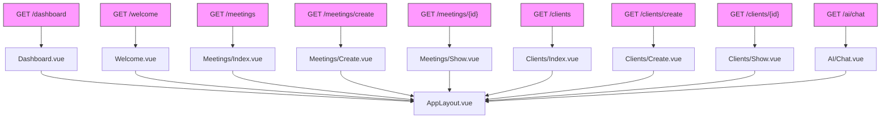


**Diagram sources**
- [web.php](file://routes/web.php)
- [app.ts](file://resources/js/app.ts)
- [HandleInertiaRequests.php](file://app/Http/Middleware/HandleInertiaRequests.php)

**Section sources**
- [web.php](file://routes/web.php)
- [app.ts](file://resources/js/app.ts)
- [inertia.php](file://config/inertia.php)

## Dashboard and Welcome Pages
The Dashboard and Welcome pages serve as entry points to the application. The Dashboard provides an overview of the user's meetings and clients, while the Welcome page offers onboarding guidance for new users. Both pages extend the AppLayout component, which provides a consistent application shell with navigation and styling. These pages receive minimal data via Inertia props, primarily focusing on providing navigation to the core functionality of meeting management and client organization.

## Meetings Pages
The Meetings pages provide comprehensive functionality for uploading, listing, and viewing meeting recordings. The system handles the complete lifecycle of meeting processing from upload to transcription and analysis.

### Meetings/Create.vue
The Create page implements a sophisticated meeting upload form with drag-and-drop functionality, file validation, and upload progress tracking.


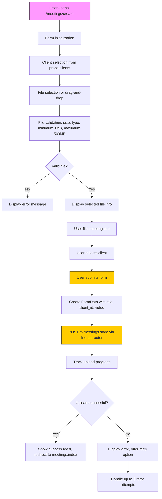


**Diagram sources**
- [Create.vue](file://resources/js/pages/Meetings/Create.vue)
- [MeetingController.php](file://app/Http/Controllers/MeetingController.php)

**Section sources**
- [Create.vue](file://resources/js/pages/Meetings/Create.vue)

### Meetings/Index.vue
The Index page displays meetings in a table format with filtering, sorting, and pagination capabilities.


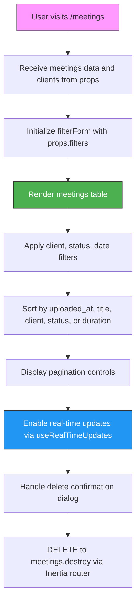


**Diagram sources**
- [Index.vue](file://resources/js/pages/Meetings/Index.vue)
- [MeetingController.php](file://app/Http/Controllers/MeetingController.php)

**Section sources**
- [Index.vue](file://resources/js/pages/Meetings/Index.vue)

### Meetings/Show.vue
The Show page displays detailed information about a specific meeting, including video playback and transcription synchronization.


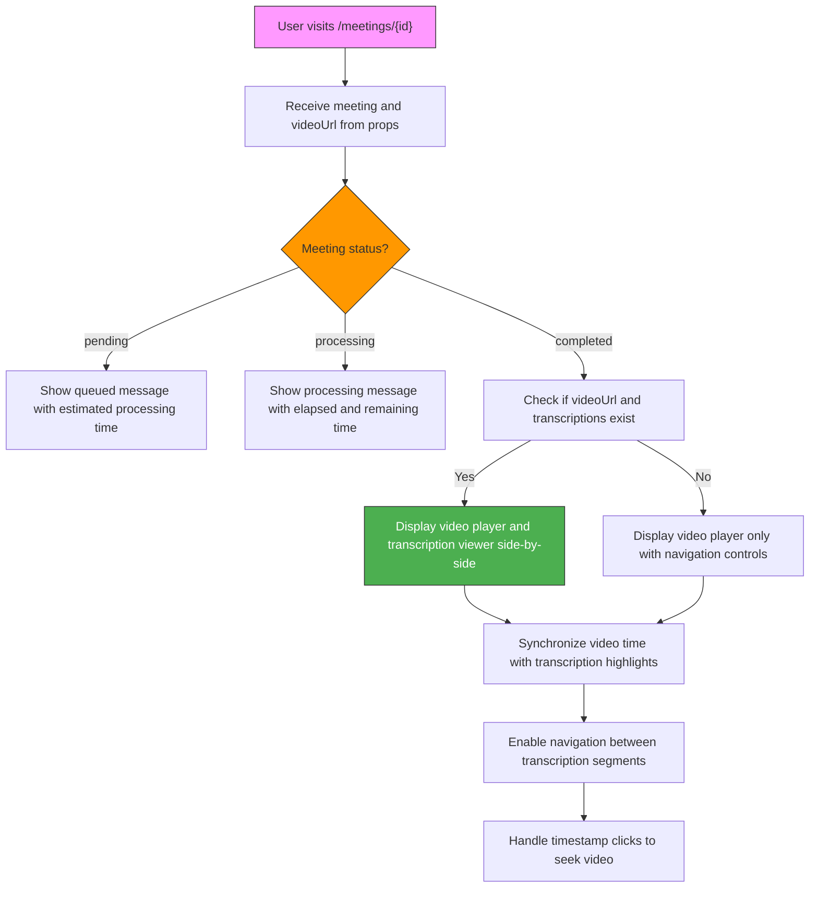


**Diagram sources**
- [Show.vue](file://resources/js/pages/Meetings/Show.vue)
- [MeetingController.php](file://app/Http/Controllers/MeetingController.php)

**Section sources**
- [Show.vue](file://resources/js/pages/Meetings/Show.vue)

## Clients Pages
The Clients pages implement CRUD operations for managing client information, which is used to organize meetings.

### Clients/Create.vue
The Create page provides a form for adding new clients to the system.


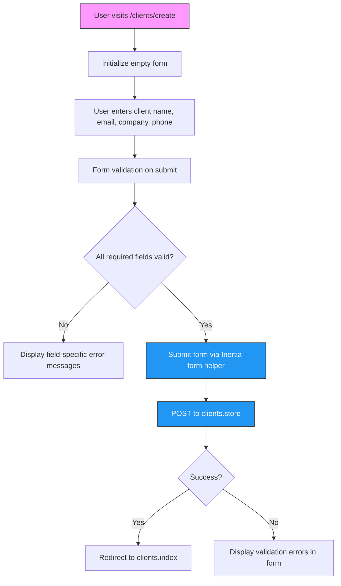


**Diagram sources**
- [Create.vue](file://resources/js/pages/Clients/Create.vue)
- [ClientController.php](file://app/Http/Controllers/ClientController.php)

**Section sources**
- [Create.vue](file://resources/js/pages/Clients/Create.vue)

### Clients/Index.vue
The Index page displays a table of all clients with their associated meeting counts.


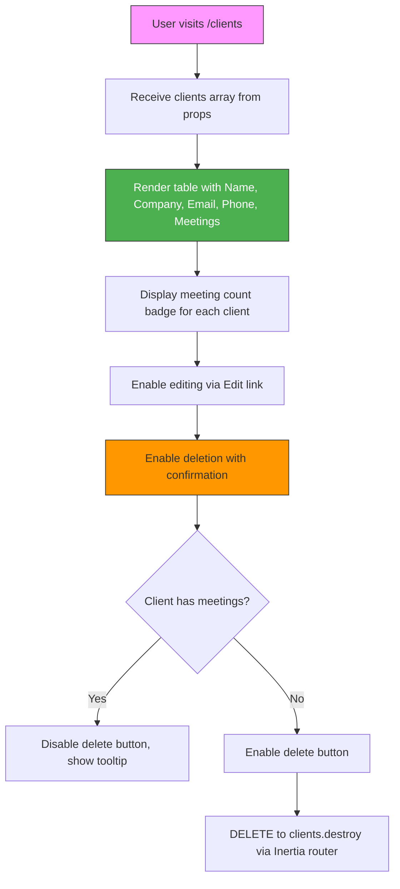


**Diagram sources**
- [Index.vue](file://resources/js/pages/Clients/Index.vue)
- [ClientController.php](file://app/Http/Controllers/ClientController.php)

**Section sources**
- [Index.vue](file://resources/js/pages/Clients/Index.vue)

### Clients/Show.vue
The Show page displays detailed client information and their associated meetings.


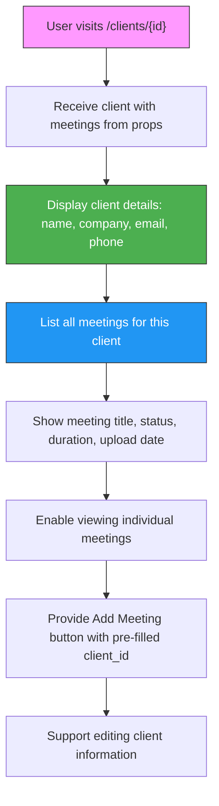


**Diagram sources**
- [Show.vue](file://resources/js/pages/Clients/Show.vue)
- [ClientController.php](file://app/Http/Controllers/ClientController.php)

**Section sources**
- [Show.vue](file://resources/js/pages/Clients/Show.vue)

## AI Chat Interface
The AI Chat interface provides natural language interaction with meeting content through the AIAgentController API.


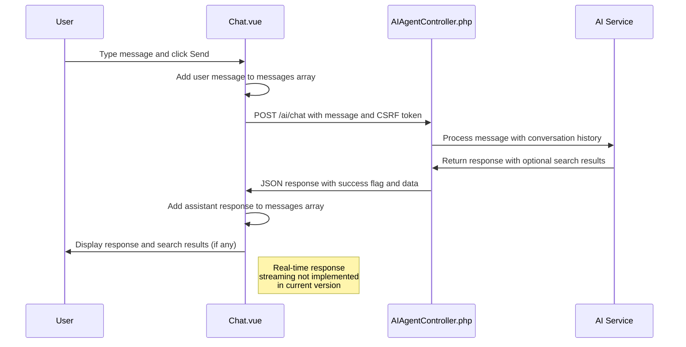


**Diagram sources**
- [Chat.vue](file://resources/js/pages/AI/Chat.vue)
- [AIAgentController.php](file://app/Http/Controllers/AIAgentController.php)

**Section sources**
- [Chat.vue](file://resources/js/pages/AI/Chat.vue)

## Form Handling and Data Submission
The application implements robust form handling across various pages, using Inertia's form helpers and direct submission methods.

### Form Submission Process

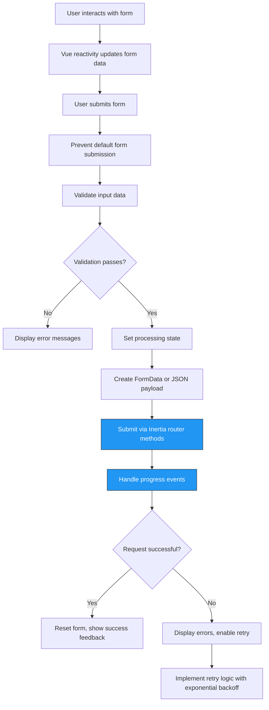


**Section sources**
- [Create.vue](file://resources/js/pages/Meetings/Create.vue)
- [Clients/Create.vue](file://resources/js/pages/Clients/Create.vue)

## Data Display and Table Rendering
The application uses consistent patterns for displaying data in tabular format, particularly in index pages.

### Table Rendering Pattern

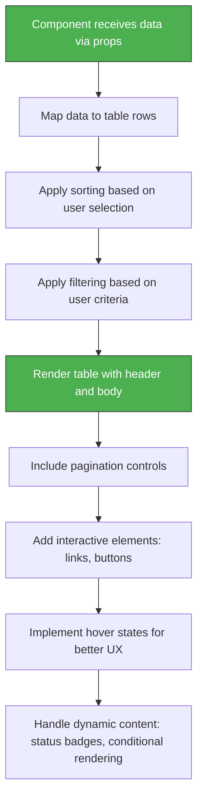


**Section sources**
- [Index.vue](file://resources/js/pages/Meetings/Index.vue)
- [Clients/Index.vue](file://resources/js/pages/Clients/Index.vue)

## Real-time Updates and Streaming
The application implements real-time updates for meeting status and processing progress.

### Real-time Update Flow

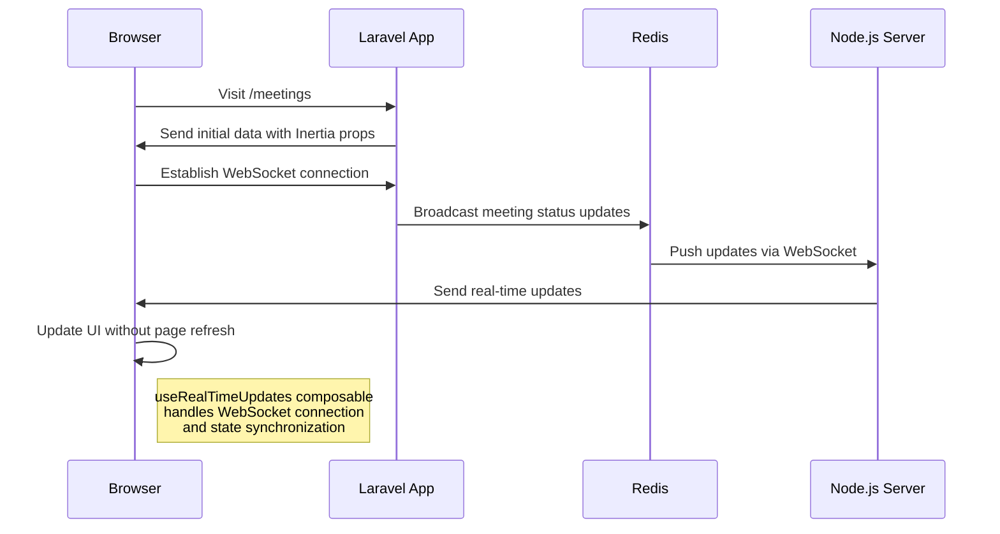


**Section sources**
- [Index.vue](file://resources/js/pages/Meetings/Index.vue)
- [useRealTimeUpdates.ts](file://resources/js/lib/useRealTimeUpdates.ts)

## Ziggy Route Integration
The application uses Ziggy for consistent route generation between Laravel and JavaScript.


```mermaid
classDiagram
class Ziggy {
+routes : Object
+location : Object
+defaults : Object
}
class route {
+__construct(routes, location, defaults)
+get(name, params, absolute)
+post(name, params, absolute)
+put(name, params, absolute)
+patch(name, params, absolute)
+delete(name, params, absolute)
+current(name)
+is(name)
}
class InertiaRouter {
+get(url, data, options)
+post(url, data, options)
+put(url, data, options)
+patch(url, data, options)
+delete(url, data, options)
}
route --> Ziggy : "uses"
InertiaRouter --> route : "calls"
VueComponent --> InertiaRouter : "invokes"
VueComponent --> route : "generates URLs"
note right of Ziggy
Ziggy provides Laravel-style
route helpers in JavaScript
allowing consistent URL
generation across frontend
and backend
end note
```


**Diagram sources**
- [app.ts](file://resources/js/app.ts)
- [ziggy.d.ts](file://resources/js/types/ziggy.d.ts)
- [web.php](file://routes/web.php)

**Section sources**
- [app.ts](file://resources/js/app.ts)
- [ziggy.d.ts](file://resources/js/types/ziggy.d.ts)

**Referenced Files in This Document**   
- [app.ts](file://resources/js/app.ts)
- [ziggy.d.ts](file://resources/js/types/ziggy.d.ts)
- [HandleInertiaRequests.php](file://app/Http/Middleware/HandleInertiaRequests.php)
- [inertia.php](file://config/inertia.php)
- [web.php](file://routes/web.php)
- [Create.vue](file://resources/js/pages/Meetings/Create.vue)
- [Index.vue](file://resources/js/pages/Meetings/Index.vue)
- [Show.vue](file://resources/js/pages/Meetings/Show.vue)
- [Clients/Create.vue](file://resources/js/pages/Clients/Create.vue)
- [Clients/Index.vue](file://resources/js/pages/Clients/Index.vue)
- [Clients/Show.vue](file://resources/js/pages/Clients/Show.vue)
- [Chat.vue](file://resources/js/pages/AI/Chat.vue)