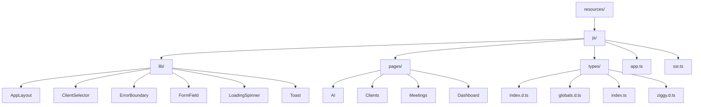

# State Management and Typing


## Table of Contents
1. [Introduction](#introduction)
2. [Project Structure](#project-structure)
3. [Frontend Application Initialization](#frontend-application-initialization)
4. [TypeScript Typing System](#typescript-typing-system)
5. [Type Usage in Components and Composables](#type-usage-in-components-and-composables)
6. [Integration with Vite and TypeScript Configuration](#integration-with-vite-and-typescript-configuration)
7. [Impact on Developer Experience and Runtime Safety](#impact-on-developer-experience-and-runtime-safety)
8. [Conclusion](#conclusion)

## Introduction
The meetingai application leverages Vue 3 with Inertia.js for frontend rendering, providing a seamless single-page application experience integrated with a Laravel backend. Central to its frontend architecture are robust state management practices and a comprehensive TypeScript typing system that ensures type safety across components, API responses, and shared utilities. This document details how the application initializes the Vue instance, defines and uses TypeScript interfaces for core models such as Meeting, Client, and Transcription, and integrates these types throughout the codebase to enhance developer experience and reduce runtime errors.

## Project Structure
The frontend codebase is organized under the `resources/js` directory, which contains modular components, pages, utilities, and type definitions. The structure follows a feature-based organization with dedicated folders for reusable components (`lib`), page-level components (`pages`), and type definitions (`types`). This modular layout supports maintainability and scalability, enabling clear separation of concerns between UI components, business logic, and type contracts.





**Diagram sources**
- [resources/js/app.ts](file://resources/js/app.ts)
- [resources/js/types/index.d.ts](file://resources/js/types/index.d.ts)
- [resources/js/types/globals.d.ts](file://resources/js/types/globals.d.ts)
- [resources/js/types/index.ts](file://resources/js/types/index.ts)

## Frontend Application Initialization
The entry point for the frontend application is `app.ts`, which initializes the Vue 3 application using Inertia.js. This file is responsible for setting up the root Vue instance, registering global plugins, and configuring error handling.

### Vue and Inertia Initialization
The `createInertiaApp` function from `@inertiajs/vue3` is used to bootstrap the application. It dynamically resolves page components based on the route name and mounts the app to the DOM element provided by Inertia.


```ts
import { createInertiaApp } from '@inertiajs/vue3';
import { resolvePageComponent } from 'laravel-vite-plugin/inertia-helpers';
import { createApp, h } from 'vue';
import { ZiggyVue } from 'ziggy-js';

createInertiaApp({
    title: (title) => (title ? `${title} - ${appName}` : appName),
    resolve: (name) => resolvePageComponent(`./pages/${name}.vue`, import.meta.glob<DefineComponent>('./pages/**/*.vue')),
    setup({ el, App, props, plugin }) {
        const app = createApp({ render: () => h(App, props) })
            .use(plugin)
            .use(ZiggyVue);

        app.mount(el);
    },
});
```


This setup enables server-side rendering compatibility and supports dynamic imports for efficient code splitting.

### Global Error Handling
The application configures a global error handler via `app.config.errorHandler`, which logs errors and delegates to a centralized `errorHandler` utility for structured reporting.


```ts
app.config.errorHandler = (error, instance, info) => {
    console.error('Vue error:', error, info);
    errorHandler.handleError(error, {
        component: instance?.$options.name || 'unknown',
        action: 'vue_error',
        data: { info }
    });
};
```


A development-only warning handler is also registered to capture Vue runtime warnings.

### Server-Side Rendering Support
The `ssr.ts` file provides server-side rendering support using `@inertiajs/vue3/server`. It uses `renderToString` from Vue’s server renderer to generate HTML on the server.


```ts
createServer((page) =>
    createInertiaApp({
        page,
        render: renderToString,
        resolve: resolvePage,
        setup: ({ App, props, plugin }) =>
            createSSRApp({ render: () => h(App, props) })
                .use(plugin)
                .use(ZiggyVue, {
                    ...page.props.ziggy,
                    location: new URL(page.props.ziggy.location),
                }),
    }),
);
```


This ensures consistent hydration between server and client, improving performance and SEO.

**Section sources**
- [resources/js/app.ts](file://resources/js/app.ts#L1-L43)
- [resources/js/ssr.ts](file://resources/js/ssr.ts#L1-L31)

## TypeScript Typing System
The application employs a robust TypeScript typing system to ensure type safety across components, API responses, and shared utilities. Type definitions are centralized in the `types/` directory and imported using a path alias `@/*` that maps to `resources/js/*`.

### Core Model Interfaces
The primary data models—`Client`, `Meeting`, and `Transcription`—are defined in `types/index.ts` and `types/index.d.ts`. These interfaces provide compile-time guarantees about data structure.

#### Client Interface
Represents a business client with optional contact details and metadata.


```ts
export interface Client {
  id: number;
  name: string;
  email?: string;
  company?: string;
  phone?: string;
  meetings_count?: number;
  created_at: string;
  updated_at: string;
}
```


Note: There is a slight variation between `index.d.ts` (where `email`, `company`, `phone` are `string | null`) and `index.ts` (where they are optional `string`). This discrepancy should be resolved for consistency.

#### Meeting Interface
Represents a recorded meeting with status tracking, timestamps, and relationships.


```ts
export interface Meeting {
  id: number;
  title: string;
  client_id: number;
  client: Client;
  status: 'pending' | 'processing' | 'completed' | 'failed';
  video_path: string;
  duration: number | null;
  uploaded_at: string;
  processing_started_at: string | null;
  processing_completed_at: string | null;
  created_at: string;
  updated_at: string;
  transcriptions?: Transcription[];
}
```


Additional computed properties like `formatted_elapsed_time` may be added at the component level (e.g., in `Show.vue`), but the core interface remains consistent.

#### Transcription Interface
Represents a segment of transcribed speech with timing and speaker identification.


```ts
export interface Transcription {
  id: number;
  meeting_id: number;
  speaker: string;
  text: string;
  start_time: number;
  end_time: number;
  confidence: number;
  created_at: string;
  updated_at: string;
  meeting?: Meeting;
}
```


### Shared Page Props
The `AppPageProps` interface in `index.d.ts` defines the shape of data passed from the Laravel backend to Vue components via Inertia.


```ts
export type AppPageProps<T extends Record<string, unknown> = Record<string, unknown>> = T & {
    name: string;
    quote: { message: string; author: string };
    auth: Auth;
    ziggy: Config & { location: string };
    csrf_token: string;
    flash?: {
        success?: string;
        error?: string;
    };
};
```


This includes authentication state, Ziggy route helper configuration, CSRF token, and flash messages.

### Global Type Extensions
The `globals.d.ts` file extends global interfaces to improve type safety:

- **ImportMeta**: Adds typing for `import.meta.env.VITE_APP_NAME`
- **PageProps**: Extends Inertia’s `PageProps` with `AppPageProps`
- **ComponentCustomProperties**: Adds types for `$inertia`, `$page`, and `$headManager`


```ts
declare module 'vue' {
    interface ComponentCustomProperties {
        $inertia: typeof Router;
        $page: Page;
        $headManager: ReturnType<typeof createHeadManager>;
    }
}
```


This enables safe access to Inertia and page state within Vue components.

### Pagination Type
A generic `PaginatedResponse<T>` interface standardizes paginated API responses:


```ts
export interface PaginatedResponse<T> {
  data: T[];
  links: Array<{ url: string | null; label: string; active: boolean }>;
  from: number;
  to: number;
  total: number;
  current_page: number;
  last_page: number;
  per_page: number;
}
```


Specific type aliases like `PaginatedMeetings` and `PaginatedClients` are exported for convenience.

**Section sources**
- [resources/js/types/index.ts](file://resources/js/types/index.ts#L1-L56)
- [resources/js/types/index.d.ts](file://resources/js/types/index.d.ts#L1-L54)
- [resources/js/types/globals.d.ts](file://resources/js/types/globals.d.ts#L1-L26)

## Type Usage in Components and Composables
TypeScript interfaces are actively used across components and composables to enforce type safety and improve developer tooling.

### Component Props Typing
Components import types to define props with strict typing. For example:


```ts
// lib/ClientSelector.vue
import type { Client } from '@/types';

defineProps<{
  clients: Client[];
  modelValue: number | null;
}>();
```


This ensures that only valid `Client` objects are passed and prevents runtime type errors.

### API Response Handling
When fetching data from the backend, responses are typed using the defined interfaces:


```ts
// Example in a composable or method
const { data } = await axios.get<PaginatedMeetings>('/api/meetings');
data.value.meetings.forEach(meeting => {
  console.log(meeting.title); // Type-safe access
});
```


### Composable Return Types
Composables use TypeScript to define return structures:


```ts
// useRealTimeUpdates.ts
export function useRealTimeUpdates() {
  return {
    connect: (meetingId: number) => { /* ... */ },
    onStatusUpdate: (callback: (status: string) => void) => { /* ... */ }
  };
}
```


Though not explicitly typed in the provided code, adding return type annotations would further enhance safety.

### Local Interface Definitions
Some components define local interfaces that extend or subset the global types. For example, `Show.vue` defines a simplified `Client` interface with only `id` and `name`. While this works, it risks divergence from the canonical type and should be avoided in favor of importing the shared interface.

**Section sources**
- [resources/js/lib/ClientSelector.vue](file://resources/js/lib/ClientSelector.vue#L35)
- [resources/js/pages/Clients/Edit.vue](file://resources/js/pages/Clients/Edit.vue#L111)
- [resources/js/pages/Clients/Index.vue](file://resources/js/pages/Clients/Index.vue#L102)
- [resources/js/pages/Clients/Show.vue](file://resources/js/pages/Clients/Show.vue#L133)
- [resources/js/pages/Meetings/Show.vue](file://resources/js/pages/Meetings/Show.vue#L209-L221)
- [resources/js/lib/TranscriptionViewer.vue](file://resources/js/lib/TranscriptionViewer.vue#L70-L77)

## Integration with Vite and TypeScript Configuration
The `tsconfig.json` file configures the TypeScript compiler to work seamlessly with Vite and the project structure.

### Key Compiler Options
- **`target: "ESNext"`**: Enables modern JavaScript features.
- **`module: "ESNext"`**: Uses ES modules for compatibility with Vite.
- **`moduleResolution: "bundler"`**: Supports bundler-specific resolution (e.g., Vite).
- **`resolveJsonModule: true`**: Allows importing JSON files.
- **`allowJs: true`**: Enables inclusion of JavaScript files in the compilation.
- **`noEmit: true`**: Relies on Vite for transpilation; TypeScript only checks types.
- **`strict: true`**: Enables all strict type-checking options.
- **`skipLibCheck: true`**: Improves build performance by skipping type checks on `.d.ts` files.

### Path Aliasing
The `paths` option enables importing from `@/` as an alias for `resources/js/`:


```json
"paths": {
  "@/*": ["./resources/js/*"]
}
```


This simplifies imports and avoids relative path complexity.

### Type Inclusion
The `types` array includes:
- `vite/client` – Types for Vite’s import.meta.env
- `./resources/js/types` – Application-specific types
- `node` – Node.js built-in types

This ensures that all necessary type definitions are available globally.

**Section sources**
- [tsconfig.json](file://tsconfig.json#L1-L127)

## Impact on Developer Experience and Runtime Safety
The combination of Vue 3, Inertia.js, and TypeScript significantly enhances both developer experience and runtime reliability.

### Developer Experience Benefits
- **Autocompletion and IntelliSense**: IDEs can provide accurate suggestions based on type definitions.
- **Refactoring Safety**: Renaming a property in an interface automatically highlights all usages.
- **Error Detection at Compile Time**: Prevents common bugs like accessing undefined properties.
- **Documentation via Types**: Interfaces serve as living documentation of data structures.

### Runtime Error Reduction
- **Prevents Invalid State**: Type guards ensure components receive expected data shapes.
- **Catches API Contract Violations**: If the backend returns unexpected data, TypeScript will flag mismatches during development.
- **Improves Debugging**: Clear error messages from the type system reduce time spent diagnosing issues.

### Recommendations for Improvement
- **Unify Type Definitions**: Resolve discrepancies between `index.d.ts` and `index.ts` for `Client` and other models.
- **Avoid Local Interfaces**: Prefer importing shared types over redefining them in components.
- **Add JSDoc Comments**: Document interfaces and types for better maintainability.
- **Use Type Guards**: Implement runtime type checking for API responses to catch server-side bugs.

## Conclusion
The meetingai application demonstrates a well-structured approach to frontend state management and type safety. By initializing Vue 3 with Inertia.js in `app.ts`, defining comprehensive TypeScript interfaces in the `types/` directory, and integrating with Vite through a carefully configured `tsconfig.json`, the application achieves a high degree of maintainability and reliability. The use of shared types across components ensures consistency, while global error handling and SSR support enhance robustness. Continued adherence to type safety practices will further reduce bugs and improve developer productivity.

**Referenced Files in This Document**   
- [app.ts](file://resources/js/app.ts)
- [ssr.ts](file://resources/js/ssr.ts)
- [types/index.d.ts](file://resources/js/types/index.d.ts)
- [types/globals.d.ts](file://resources/js/types/globals.d.ts)
- [types/index.ts](file://resources/js/types/index.ts)
- [tsconfig.json](file://tsconfig.json)
- [lib/ClientSelector.vue](file://resources/js/lib/ClientSelector.vue)
- [pages/Clients/Edit.vue](file://resources/js/pages/Clients/Edit.vue)
- [pages/Clients/Index.vue](file://resources/js/pages/Clients/Index.vue)
- [pages/Clients/Show.vue](file://resources/js/pages/Clients/Show.vue)
- [pages/Meetings/Show.vue](file://resources/js/pages/Meetings/Show.vue)
- [lib/TranscriptionViewer.vue](file://resources/js/lib/TranscriptionViewer.vue)