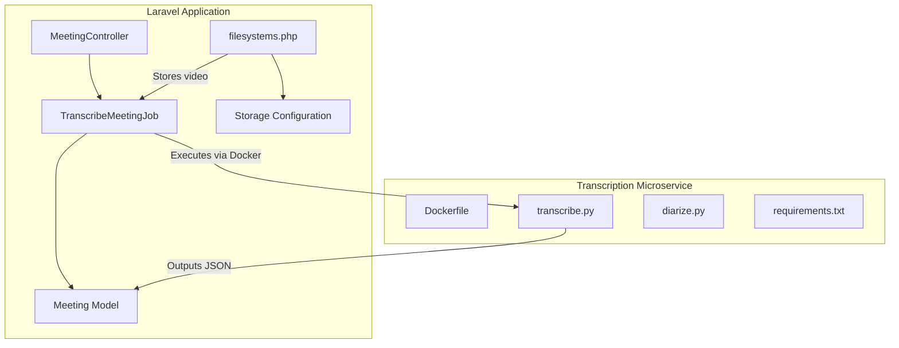
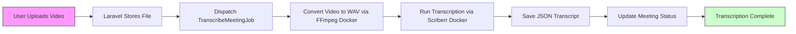
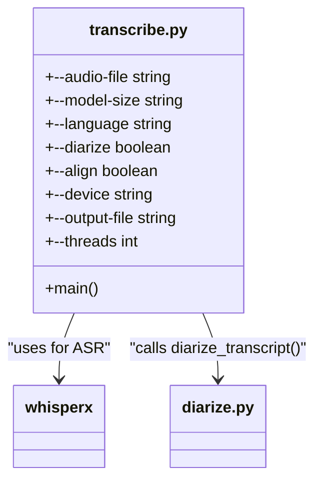
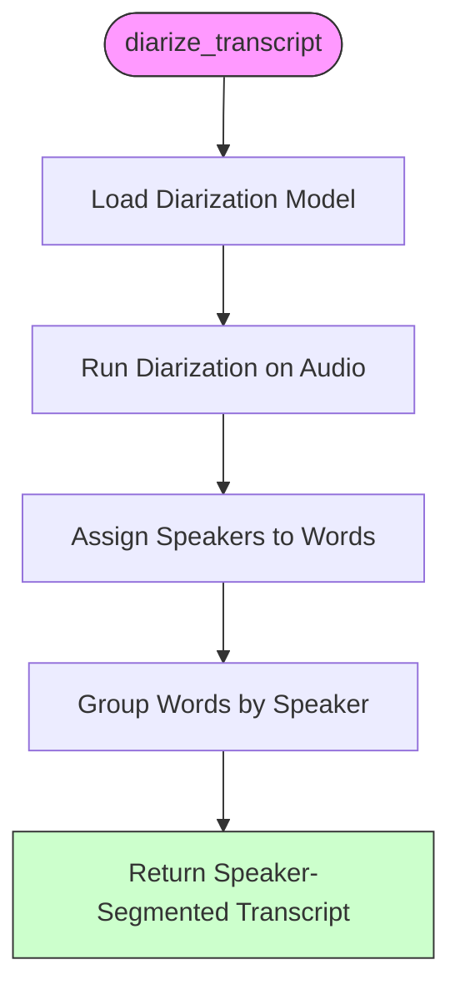
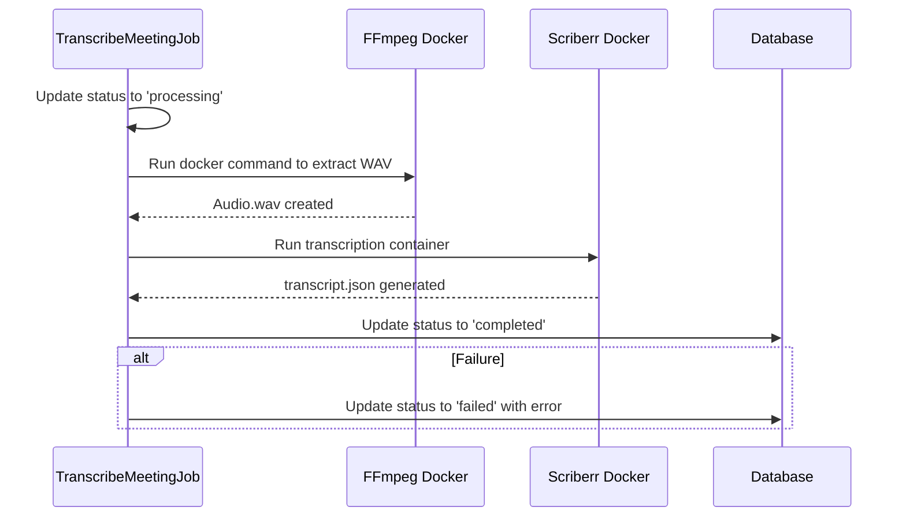
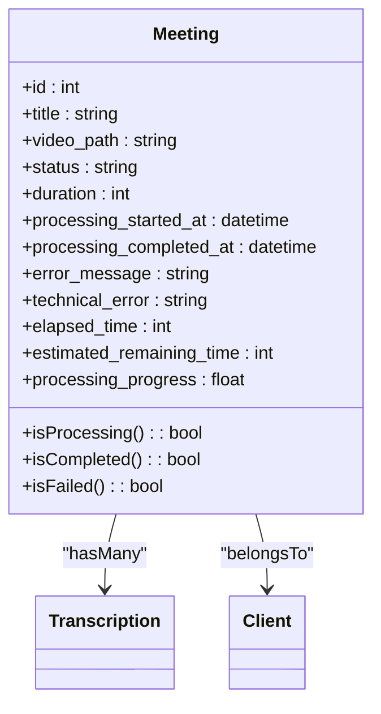

# Microservice Integration


## Table of Contents
1. [Introduction](#introduction)
2. [Project Structure](#project-structure)
3. [Core Components](#core-components)
4. [Architecture Overview](#architecture-overview)
5. [Detailed Component Analysis](#detailed-component-analysis)
6. [Data Flow and Processing Pipeline](#data-flow-and-processing-pipeline)
7. [Error Handling and Resilience](#error-handling-and-resilience)
8. [File Storage and Temporary Management](#file-storage-and-temporary-management)
9. [Security Considerations](#security-considerations)
10. [Scalability and Performance](#scalability-and-performance)
11. [Conclusion](#conclusion)

## Introduction
The transcription microservice in the meetingai application is a specialized component responsible for processing uploaded meeting videos to generate transcriptions with speaker diarization. This document details the integration between the Laravel-based web application and a Dockerized Python microservice that performs compute-intensive audio processing. The architecture separates concerns by delegating speech-to-text and speaker separation tasks to an isolated service, enabling scalability, maintainability, and technology-specific optimization.

## Project Structure
The project follows a layered Laravel application structure with a co-located microservice implemented in Python. The transcription functionality is split across two domains: the Laravel backend handles job orchestration and data persistence, while the Python microservice executes the actual transcription logic.





**Diagram sources**
- [TranscribeMeetingJob.php](file://app/Jobs/TranscribeMeetingJob.php)
- [transcribe.py](file://transcribe-microservice/transcribe.py)
- [filesystems.php](file://config/filesystems.php)

**Section sources**
- [TranscribeMeetingJob.php](file://app/Jobs/TranscribeMeetingJob.php#L1-L400)
- [Dockerfile](file://transcribe-microservice/Dockerfile#L1-L54)

## Core Components
The system's core functionality revolves around several key components:
- **TranscribeMeetingJob**: Laravel job that orchestrates the transcription workflow
- **transcribe.py**: Python script that performs speech-to-text using WhisperX
- **diarize.py**: Module that adds speaker identification using pyannote-audio
- **Meeting Model**: Eloquent model tracking transcription status and metadata
- **Dockerized Environment**: Containerized runtime with FFmpeg and ML dependencies

These components work together to extract audio from video, transcribe speech, and identify speakers.

**Section sources**
- [transcribe.py](file://transcribe-microservice/transcribe.py#L1-L201)
- [diarize.py](file://transcribe-microservice/diarize.py#L1-L131)
- [Meeting.php](file://app/Models/Meeting.php#L1-L179)

## Architecture Overview
The architecture follows a microservices pattern where compute-intensive tasks are offloaded to a specialized container. When a user uploads a meeting video, Laravel dispatches a queued job that coordinates with the Python microservice through Docker containers.





**Diagram sources**
- [TranscribeMeetingJob.php](file://app/Jobs/TranscribeMeetingJob.php#L50-L350)
- [Dockerfile](file://transcribe-microservice/Dockerfile#L1-L54)

## Detailed Component Analysis

### Transcription Microservice (Python)
The Python microservice is containerized using Docker and leverages state-of-the-art machine learning models for transcription and diarization.

#### transcribe.py Module
This script serves as the main entry point for the transcription process, handling command-line arguments and coordinating the transcription pipeline.





**Diagram sources**
- [transcribe.py](file://transcribe-microservice/transcribe.py#L1-L201)

**Section sources**
- [transcribe.py](file://transcribe-microservice/transcribe.py#L1-L201)

#### diarize.py Module
Implements speaker diarization by integrating pyannote-audio with WhisperX output to assign speaker labels to transcription segments.





**Diagram sources**
- [diarize.py](file://transcribe-microservice/diarize.py#L1-L131)

**Section sources**
- [diarize.py](file://transcribe-microservice/diarize.py#L1-L131)

### Laravel Integration Components

#### TranscribeMeetingJob
This queued job manages the entire transcription workflow, from audio extraction to final status update.





**Diagram sources**
- [TranscribeMeetingJob.php](file://app/Jobs/TranscribeMeetingJob.php#L50-L350)

**Section sources**
- [TranscribeMeetingJob.php](file://app/Jobs/TranscribeMeetingJob.php#L1-L400)

#### Meeting Model
The Meeting model tracks the state of transcription processing and provides calculated attributes for progress monitoring.





**Diagram sources**
- [Meeting.php](file://app/Models/Meeting.php#L1-L179)

**Section sources**
- [Meeting.php](file://app/Models/Meeting.php#L1-L179)

## Data Flow and Processing Pipeline
The data flow begins when a meeting video is uploaded and ends when a complete transcription is stored and linked to the meeting record.


**Diagram sources**
- [TranscribeMeetingJob.php](file://app/Jobs/TranscribeMeetingJob.php#L50-L350)
- [filesystems.php](file://config/filesystems.php#L1-L81)
- [Meeting.php](file://app/Models/Meeting.php#L1-L179)

**Section sources**
- [TranscribeMeetingJob.php](file://app/Jobs/TranscribeMeetingJob.php#L1-L400)
- [filesystems.php](file://config/filesystems.php#L1-L81)

## Error Handling and Resilience
The system implements comprehensive error handling at multiple levels to ensure reliability and provide meaningful feedback.

### Job-Level Error Handling
The TranscribeMeetingJob includes try-catch blocks around critical operations and updates the meeting record with error details when processing fails.


```php
// In TranscribeMeetingJob.php
try {
    // Processing steps
} catch (\Throwable $e) {
    $this->meeting->update([
        'status' => 'failed',
        'error_message' => $this->getUserFriendlyErrorMessage($e),
        'technical_error' => $e->getMessage()
    ]);
}
```


The job also implements retry logic with exponential backoff:
- Maximum of 3 attempts
- Retry intervals: 60, 300, and 900 seconds
- Retry window of 30 minutes

**Section sources**
- [TranscribeMeetingJob.php](file://app/Jobs/TranscribeMeetingJob.php#L250-L399)

## File Storage and Temporary Management
The application uses Laravel's filesystem abstraction to manage file storage, with specific configurations for different file types.

### Filesystem Configuration
The `filesystems.php` configuration defines multiple disks:
- **public**: For user-uploaded video files, accessible via URL
- **local**: For private application data
- **s3**: For cloud storage (currently configured but not actively used for transcription)


```php
// config/filesystems.php
'public' => [
    'driver' => 'local',
    'root' => storage_path('app/public'),
    'url' => env('APP_URL').'/storage',
    'visibility' => 'public',
],
```


### Temporary File Management
The system creates temporary files during processing:
- WAV audio extracted from video
- JSON transcription output
- Per-meeting directories under `storage/{meeting_id}/`

These files are cleaned up after processing:
- Successful processing: files retained for potential future use
- Failed processing: cleanup attempted in the `failed()` method
- Directory structure: `storage/{meeting_id}/audio.wav` and `storage/{meeting_id}/transcript.json`

**Section sources**
- [filesystems.php](file://config/filesystems.php#L1-L81)
- [TranscribeMeetingJob.php](file://app/Jobs/TranscribeMeetingJob.php#L350-L399)

## Security Considerations
The integration addresses several security aspects when executing external processes and handling user uploads.

### External Process Security
The system uses Symfony Process to execute Docker commands, which provides:
- Proper escaping of shell arguments via `escapeshellarg()`
- Timeout enforcement (1 hour job timeout)
- Isolation through Docker containers
- Limited container privileges (`--rm` flag removes containers after execution)

### Input Validation
While explicit validation code isn't shown, the system includes safeguards:
- Verification that video files exist before processing
- Use of Docker volume mounts to control file access
- Environment variable configuration for service images
- Structured error messages that don't expose system details to users

### Configuration Security
External service configurations are environment-driven:

```php
// config/services.php
'scriberr' => [
    'image' => env('SCRIBERR_DOCKER_IMAGE', 'scriberr-local:latest'),
],
```


This allows different images to be used in development, staging, and production environments.

**Section sources**
- [TranscribeMeetingJob.php](file://app/Jobs/TranscribeMeetingJob.php#L150-L200)
- [services.php](file://config/services.php#L1-L46)

## Scalability and Performance
The architecture provides several advantages for scalability and performance optimization.

### Horizontal Scaling
The microservice design enables:
- Independent scaling of transcription workers
- Potential to run multiple transcription containers simultaneously
- Queue-based processing that handles load spikes
- Isolation of resource-intensive tasks from the main application

### Performance Optimizations
Several performance considerations are implemented:
- CPU thread optimization based on host capabilities
- Layered Docker builds that leverage caching
- Efficient memory management in Python code
- Progress tracking and estimated completion times

### Resource Management
The system dynamically adapts to available resources:
- Automatic detection of CPU cores for threading
- Configurable model sizes (medium model used in production)
- Memory cleanup in diarization code, especially for CUDA
- Use of lightweight Docker images

The Dockerfile supports both CPU and GPU execution through build arguments, allowing deployment flexibility based on available infrastructure.

**Section sources**
- [Dockerfile](file://transcribe-microservice/Dockerfile#L1-L54)
- [TranscribeMeetingJob.php](file://app/Jobs/TranscribeMeetingJob.php#L200-L250)
- [transcribe.py](file://transcribe-microservice/transcribe.py#L1-L201)

## Conclusion
The transcription microservice integration in meetingai demonstrates a well-architected approach to handling compute-intensive tasks in a web application. By containerizing the Python transcription service and orchestrating it through Laravel jobs, the system achieves separation of concerns, improved scalability, and technology-specific optimization. The use of Docker provides consistent execution environments, while the queue-based architecture ensures reliability and fault tolerance. The comprehensive error handling, progress tracking, and security considerations make this a robust solution for processing meeting videos at scale. Future enhancements could include support for cloud storage backends, distributed worker pools, and real-time transcription updates.

**Referenced Files in This Document**  
- [transcribe.py](file://transcribe-microservice/transcribe.py)
- [diarize.py](file://transcribe-microservice/diarize.py)
- [Dockerfile](file://transcribe-microservice/Dockerfile)
- [requirements.txt](file://transcribe-microservice/requirements.txt)
- [TranscribeMeetingJob.php](file://app/Jobs/TranscribeMeetingJob.php)
- [Meeting.php](file://app/Models/Meeting.php)
- [filesystems.php](file://config/filesystems.php)
- [services.php](file://config/services.php)