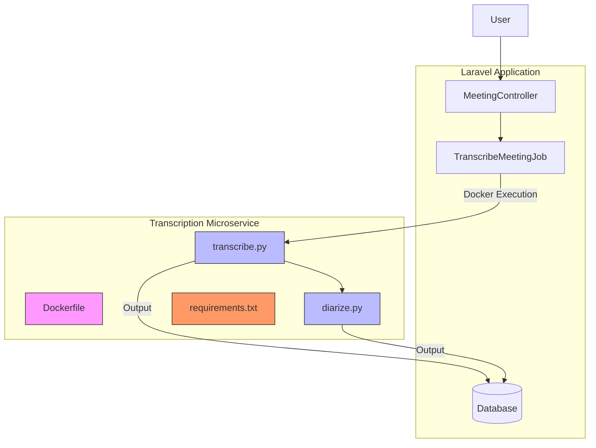
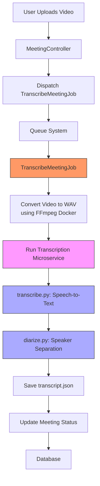
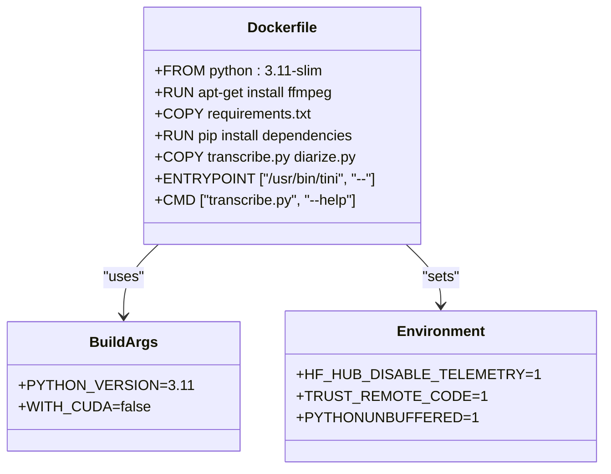
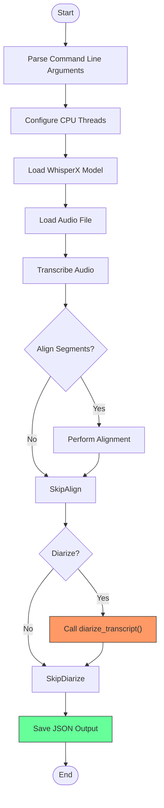
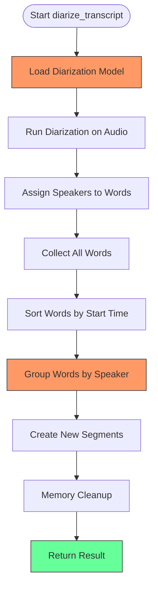
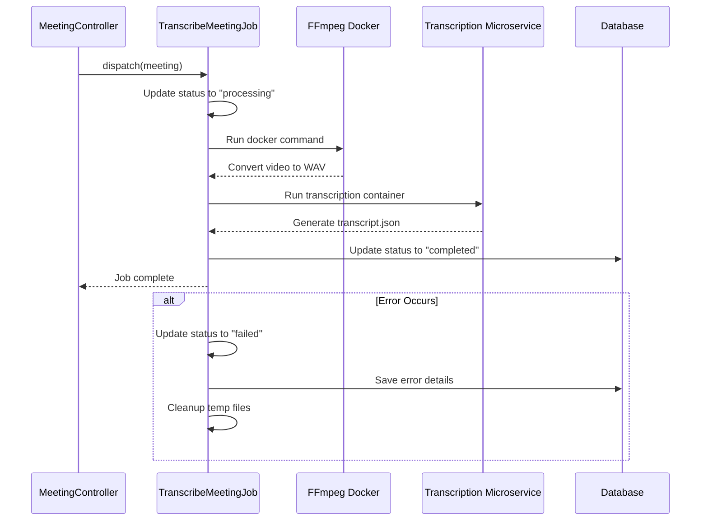
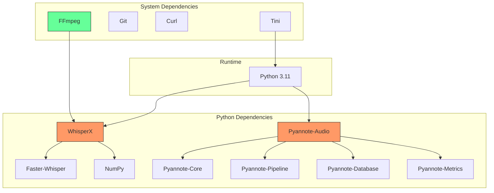

# Microservice Architecture

## Table of Contents
1. [Introduction](#introduction)
2. [Project Structure](#project-structure)
3. [Core Components](#core-components)
4. [Architecture Overview](#architecture-overview)
5. [Detailed Component Analysis](#detailed-component-analysis)
6. [Dependency Analysis](#dependency-analysis)
7. [Performance Considerations](#performance-considerations)
8. [Troubleshooting Guide](#troubleshooting-guide)
9. [Conclusion](#conclusion)

## Introduction
This document provides comprehensive architectural documentation for the transcription microservice in the meetingai application. The microservice is responsible for processing video files into transcribed and diarized text, enabling speaker-aware meeting transcription. The service is implemented as a Dockerized Python application that leverages state-of-the-art speech recognition and speaker diarization models. The architecture follows a microservices pattern, with clear separation between the Laravel application and the transcription processing component, enabling independent scaling, deployment, and technology stack evolution.

## Project Structure
The transcription microservice is organized as a self-contained component within the larger meetingai application. It resides in the `transcribe-microservice` directory and contains all necessary files for building, running, and documenting the service. The main application components include the transcription and diarization scripts, Docker configuration, and dependency specifications. The Laravel application integrates with this microservice through a job queue system, maintaining loose coupling between the components.

**Diagram sources**
- [Dockerfile](file://transcribe-microservice/Dockerfile)
- [transcribe.py](file://transcribe-microservice/transcribe.py)
- [diarize.py](file://transcribe-microservice/diarize.py)
- [TranscribeMeetingJob.php](file://app/Jobs/TranscribeMeetingJob.php)
- [MeetingController.php](file://app/Http/Controllers/MeetingController.php)

**Section sources**
- [Dockerfile](file://transcribe-microservice/Dockerfile)
- [transcribe.py](file://transcribe-microservice/transcribe.py)
- [diarize.py](file://transcribe-microservice/diarize.py)

## Core Components
The transcription microservice consists of several core components that work together to process video files into structured transcriptions with speaker identification. The system is built around two main Python scripts: `transcribe.py` for speech-to-text conversion and `diarize.py` for speaker separation. These components are containerized using Docker, ensuring consistent execution environments across different deployment targets. The integration with the Laravel application is mediated through the `TranscribeMeetingJob`, which handles the orchestration of file processing and result persistence.

**Section sources**
- [transcribe.py](file://transcribe-microservice/transcribe.py#L1-L201)
- [diarize.py](file://transcribe-microservice/diarize.py#L1-L131)
- [TranscribeMeetingJob.php](file://app/Jobs/TranscribeMeetingJob.php#L1-L400)

## Architecture Overview
The transcription microservice follows a clean separation of concerns between the application logic and infrastructure concerns. The architecture is designed to be stateless and idempotent, processing input files and producing output without maintaining internal state between executions. This design enables horizontal scaling and fault tolerance. The microservice communicates with the Laravel application through a well-defined interface: file paths and structured JSON output. The containerization approach provides technology stack independence, allowing the transcription service to evolve independently of the main application.

**Diagram sources**
- [TranscribeMeetingJob.php](file://app/Jobs/TranscribeMeetingJob.php#L1-L400)
- [transcribe.py](file://transcribe-microservice/transcribe.py#L1-L201)
- [diarize.py](file://transcribe-microservice/diarize.py#L1-L131)

## Detailed Component Analysis

### Transcription Microservice Analysis
The transcription microservice is implemented as a Docker container that packages all necessary dependencies for speech processing. The service uses WhisperX for speech-to-text transcription and pyannote-audio for speaker diarization. The container is built from a Python base image and includes FFmpeg for audio extraction from video files. The architecture supports both CPU and GPU execution through build-time configuration, allowing deployment flexibility based on available hardware resources.

#### Docker Configuration Analysis

**Diagram sources**
- [Dockerfile](file://transcribe-microservice/Dockerfile#L1-L54)

**Section sources**
- [Dockerfile](file://transcribe-microservice/Dockerfile#L1-L54)

### Transcribe.py Analysis
The `transcribe.py` script implements the core speech-to-text functionality with optional alignment and diarization. The script follows a modular design with clear separation between configuration, model loading, audio processing, and result formatting. It accepts various command-line arguments to control the transcription process, including model size, language specification, device selection, and compute type. The script handles both CPU and GPU execution with appropriate memory management and threading configuration.

#### Transcription Processing Flow

**Diagram sources**
- [transcribe.py](file://transcribe-microservice/transcribe.py#L1-L201)

**Section sources**
- [transcribe.py](file://transcribe-microservice/transcribe.py#L1-L201)

### Diarize.py Analysis
The `diarize.py` module implements speaker diarization functionality, assigning speaker labels to transcribed segments. The module uses pyannote-audio's diarization pipeline to identify speaker turns in the audio and then aligns these speaker segments with the transcribed words. The implementation includes careful memory management, particularly important when running on GPU, by clearing CUDA cache before and after diarization. The function returns a structured result with segments grouped by consecutive speaker turns.

#### Diarization Algorithm Flow

**Diagram sources**
- [diarize.py](file://transcribe-microservice/diarize.py#L1-L131)

**Section sources**
- [diarize.py](file://transcribe-microservice/diarize.py#L1-L131)

### TranscribeMeetingJob Analysis
The `TranscribeMeetingJob` class orchestrates the entire transcription workflow within the Laravel application. As a queued job, it handles video-to-audio conversion using FFmpeg in Docker, followed by transcription and diarization using the transcription microservice. The job implements robust error handling with retry logic and comprehensive logging. It updates the meeting status throughout the process, providing visibility into the transcription progress.

#### Job Execution Sequence

**Diagram sources**
- [TranscribeMeetingJob.php](file://app/Jobs/TranscribeMeetingJob.php#L1-L400)

**Section sources**
- [TranscribeMeetingJob.php](file://app/Jobs/TranscribeMeetingJob.php#L1-L400)

## Dependency Analysis
The transcription microservice has a well-defined dependency structure that separates infrastructure dependencies from application logic. The Docker container encapsulates all Python and system-level dependencies, creating a reproducible execution environment. The Laravel application depends on the microservice through a contract defined by file paths and JSON output format, rather than direct code dependencies. This loose coupling enables independent evolution of both components.

**Diagram sources**
- [requirements.txt](file://transcribe-microservice/requirements.txt#L1-L9)
- [Dockerfile](file://transcribe-microservice/Dockerfile#L1-L54)

**Section sources**
- [requirements.txt](file://transcribe-microservice/requirements.txt#L1-L9)
- [Dockerfile](file://transcribe-microservice/Dockerfile#L1-L54)

## Performance Considerations
The transcription microservice is designed with performance and resource efficiency in mind. The architecture supports GPU acceleration through optional CUDA build configuration, significantly reducing processing time for large audio files. The service implements CPU thread optimization by configuring PyTorch and BLAS libraries based on available cores. Memory management is carefully handled, particularly during the diarization phase, with explicit garbage collection and CUDA cache clearing to prevent memory leaks in long-running processes.

The stateless nature of the microservice enables horizontal scaling, where multiple instances can process different meetings concurrently. The idempotent processing behavior ensures consistent results even if jobs are retried due to transient failures. The use of Docker containers provides consistent performance characteristics across different deployment environments, from development to production.

## Troubleshooting Guide
When troubleshooting issues with the transcription microservice, consider the following common scenarios and their solutions:

**Section sources**
- [TranscribeMeetingJob.php](file://app/Jobs/TranscribeMeetingJob.php#L1-L400)
- [transcribe.py](file://transcribe-microservice/transcribe.py#L1-L201)
- [diarize.py](file://transcribe-microservice/diarize.py#L1-L131)

### Common Issues and Solutions
- **Video file not found**: Verify that the video path exists in the public storage disk and that the file was properly uploaded.
- **Docker command failures**: Ensure Docker is running and that the required images (ffmpeg and scriberr-local) are available.
- **CUDA memory errors**: For GPU processing, ensure sufficient VRAM is available and consider using smaller model sizes.
- **Diarization model authentication**: If using private pyannote models, ensure HF_API_KEY is set in the environment.
- **Processing timeouts**: Large files may exceed the 1-hour job timeout; consider increasing the timeout or optimizing file size.
- **Missing dependencies**: Verify that all Python packages in requirements.txt are properly installed in the Docker image.

## Conclusion
The transcription microservice in meetingai exemplifies a well-designed microservices architecture that effectively separates concerns between the application layer and processing layer. By containerizing the speech processing functionality, the system achieves technology stack independence, fault isolation, and independent scalability. The clear separation between `transcribe.py` and `diarize.py` promotes maintainability and allows for independent optimization of each processing stage. The integration with Laravel through `TranscribeMeetingJob` provides a robust orchestration layer that handles file management, error recovery, and status tracking. This architecture enables the system to process meeting recordings into structured, speaker-aware transcriptions reliably and efficiently.

**Referenced Files in This Document**   
- [Dockerfile](file://transcribe-microservice/Dockerfile)
- [requirements.txt](file://transcribe-microservice/requirements.txt)
- [transcribe.py](file://transcribe-microservice/transcribe.py)
- [diarize.py](file://transcribe-microservice/diarize.py)
- [TranscribeMeetingJob.php](file://app/Jobs/TranscribeMeetingJob.php)
- [MeetingController.php](file://app/Http/Controllers/MeetingController.php)
- [README.md](file://transcribe-microservice/README.md)