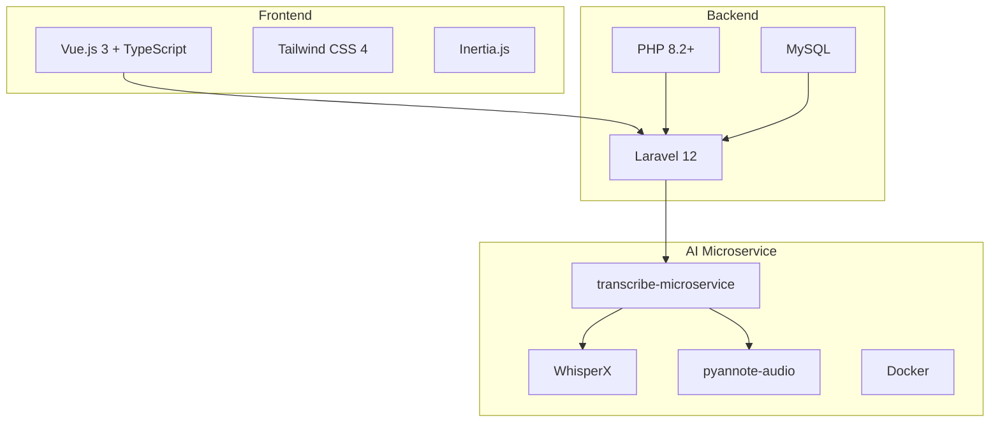
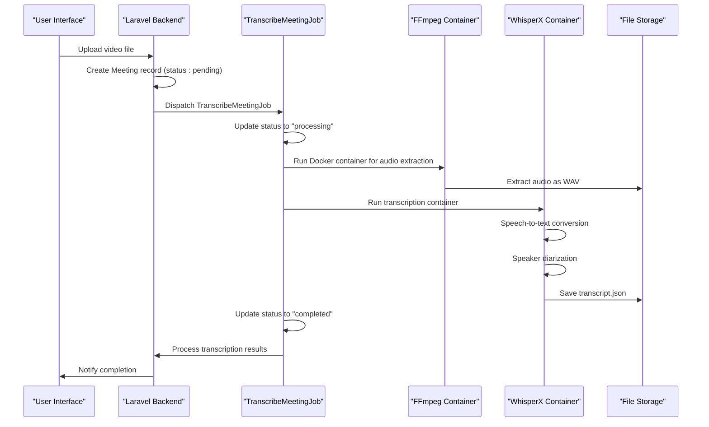
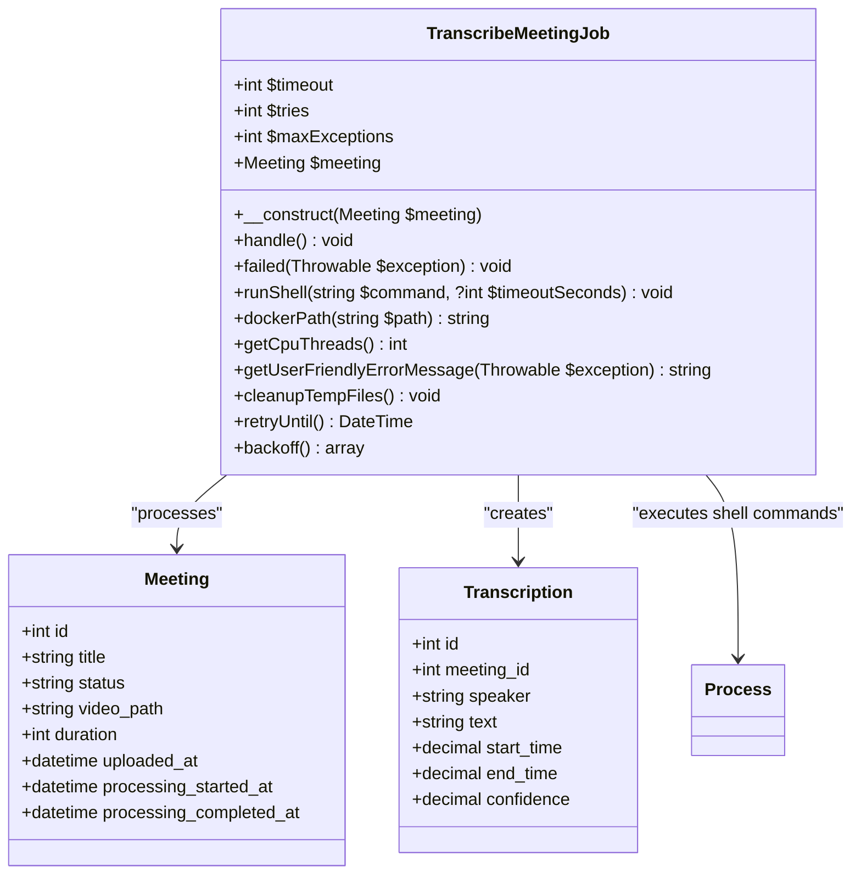
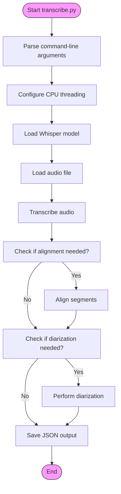
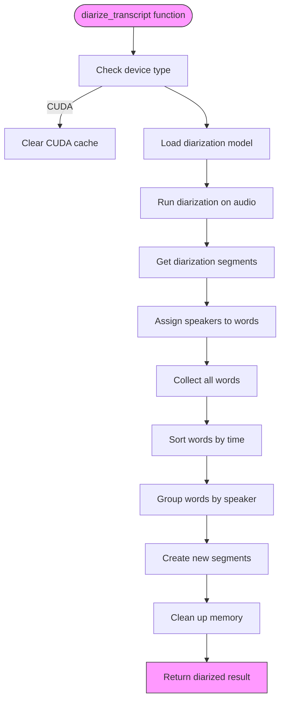

# Transcription Processing Pipeline

## Table of Contents
1. [Introduction](#introduction)
2. [Project Structure](#project-structure)
3. [Core Components](#core-components)
4. [Architecture Overview](#architecture-overview)
5. [Detailed Component Analysis](#detailed-component-analysis)
6. [Processing Workflow](#processing-workflow)
7. [Output Structure](#output-structure)
8. [Error Handling](#error-handling)
9. [Performance Considerations](#performance-considerations)
10. [Troubleshooting Guide](#troubleshooting-guide)

## Introduction
The Transcription Processing Pipeline is a comprehensive system designed to convert video meeting recordings into structured, speaker-labeled transcripts. This document provides a detailed analysis of the pipeline's architecture, workflow, and implementation. The system leverages modern AI technologies including WhisperX for speech-to-text conversion and pyannote-audio for speaker diarization, orchestrated through a robust Laravel-based backend with Docker containerization. The pipeline handles the complete journey from video file input to structured transcription output, managing format conversion, temporary file handling, and error recovery throughout the process.

## Project Structure
The project follows a layered architecture with clear separation between frontend, backend, and AI processing components. The main structure organizes code by functionality, with distinct directories for application logic, models, jobs, and external microservices.

**Diagram sources**
- [README.md](file://README.md#L26-L110)

**Section sources**
- [Project Structure](file://#L1-L100)

## Core Components
The transcription pipeline consists of several core components that work together to process video files and generate structured transcripts. The main components include the TranscribeMeetingJob orchestrator, the transcribe.py microservice for speech-to-text conversion, and the diarize.py script for speaker identification. These components are supported by Laravel models (Meeting and Transcription) that store processing state and results. The system uses Docker containers to isolate the AI processing environment, ensuring consistent behavior across different deployment environments. The pipeline is designed to be fault-tolerant, with retry mechanisms and comprehensive error handling to ensure reliable processing even with large or problematic input files.

**Section sources**
- [TranscribeMeetingJob.php](file://app/Jobs/TranscribeMeetingJob.php#L1-L400)
- [transcribe.py](file://transcribe-microservice/transcribe.py#L1-L201)
- [diarize.py](file://transcribe-microservice/diarize.py#L1-L131)

## Architecture Overview
The transcription pipeline follows a microservices architecture where the main Laravel application orchestrates processing through a dedicated AI microservice container. This design separates concerns and allows the computationally intensive transcription tasks to run in an isolated environment with optimized dependencies.

**Diagram sources**
- [TranscribeMeetingJob.php](file://app/Jobs/TranscribeMeetingJob.php#L40-L120)
- [transcribe.py](file://transcribe-microservice/transcribe.py#L1-L201)

## Detailed Component Analysis

### TranscribeMeetingJob Analysis
The TranscribeMeetingJob class is the central orchestrator of the transcription pipeline, responsible for managing the entire processing workflow from start to finish. It implements Laravel's ShouldQueue interface, allowing it to run as a background job with configurable retry policies.

**Diagram sources**
- [TranscribeMeetingJob.php](file://app/Jobs/TranscribeMeetingJob.php#L1-L400)

**Section sources**
- [TranscribeMeetingJob.php](file://app/Jobs/TranscribeMeetingJob.php#L1-L400)

### transcribe.py Analysis
The transcribe.py script implements the core speech-to-text functionality using the WhisperX library. It provides a command-line interface for transcription with support for speaker diarization and audio alignment.

**Diagram sources**
- [transcribe.py](file://transcribe-microservice/transcribe.py#L1-L201)

**Section sources**
- [transcribe.py](file://transcribe-microservice/transcribe.py#L1-L201)

### diarize.py Analysis
The diarize.py script handles speaker diarization, identifying who spoke when in the audio recording. It uses the pyannote-audio library to analyze the audio and assign speaker labels to transcription segments.

**Diagram sources**
- [diarize.py](file://transcribe-microservice/diarize.py#L1-L131)

**Section sources**
- [diarize.py](file://transcribe-microservice/diarize.py#L1-L131)

## Processing Workflow
The transcription processing pipeline follows a well-defined sequence of steps to convert video files into structured transcripts with speaker identification. The workflow begins when a user uploads a video file through the web interface, triggering the creation of a Meeting record with status "pending". The system then dispatches a TranscribeMeetingJob to process the meeting in the background.

The first processing step involves audio extraction from the video file using FFmpeg. The TranscribeMeetingJob executes a Docker container with FFmpeg to convert the input video into a WAV audio file with specific parameters: mono channel, 16kHz sample rate, and PCM 16-bit encoding. This standardized audio format ensures compatibility with the speech recognition models.

Once the audio is extracted, the pipeline proceeds to speech-to-text conversion using the WhisperX model. The system launches a Docker container running transcribe.py, which loads a pre-trained Whisper model (configured as "medium" size in the current implementation) to transcribe the audio. The transcription process breaks the audio into segments, each with associated text, timestamps, and confidence scores.

After transcription, the pipeline applies speaker diarization to identify different speakers in the recording. The diarize.py script uses the pyannote-audio library to analyze speaker characteristics and assign speaker labels to each segment. This involves loading a specialized diarization model, processing the audio to detect speaker changes, and then aligning these speaker segments with the transcribed text.

Throughout the workflow, the system manages temporary files in a dedicated directory structure organized by meeting ID. The job handles potential failures at each stage, with comprehensive error checking to validate the successful completion of audio extraction and transcription steps. Progress is tracked through the Meeting model's status field, which transitions from "pending" to "processing" and finally to "completed" upon successful processing.

**Section sources**
- [TranscribeMeetingJob.php](file://app/Jobs/TranscribeMeetingJob.php#L40-L120)
- [transcribe.py](file://transcribe-microservice/transcribe.py#L1-L201)
- [diarize.py](file://transcribe-microservice/diarize.py#L1-L131)

## Output Structure
The transcription pipeline produces a structured JSON output that contains detailed information about the transcribed audio, including text content, timing information, and speaker identification. The output structure follows the WhisperX format with additional processing applied by the diarization component.

The primary output is a JSON file containing an array of segments, where each segment represents a continuous portion of speech with consistent speaker identity. Each segment includes the following properties:
- **start**: Start time in seconds (float)
- **end**: End time in seconds (float) 
- **text**: Transcribed text content (string)
- **speaker**: Speaker identifier (string, e.g., "speaker_1")
- **words**: Array of individual words with their timestamps

The Meeting and Transcription models in the Laravel application store this information in a normalized database structure. The Meeting model tracks overall processing status and metadata, while the Transcription model stores individual segments as separate records with the following fields:
- **meeting_id**: Foreign key to the Meeting record
- **speaker**: Speaker label (string)
- **text**: Transcribed text (string)
- **start_time**: Start time in seconds (decimal)
- **end_time**: End time in seconds (decimal)
- **confidence**: Confidence score of the transcription (decimal)

The database schema includes appropriate data type casting to ensure precision in time measurements and confidence scores. The Transcription model also provides accessor methods to format timestamps and calculate segment duration, enhancing usability in the application interface.

**Section sources**
- [transcribe.py](file://transcribe-microservice/transcribe.py#L1-L201)
- [Transcription.php](file://app/Models/Transcription.php#L1-L49)
- [Meeting.php](file://app/Models/Meeting.php)

## Error Handling
The transcription pipeline implements comprehensive error handling at multiple levels to ensure reliability and provide meaningful feedback when issues occur. The system is designed to gracefully handle various failure scenarios while maintaining data integrity and user experience.

The TranscribeMeetingJob implements a robust exception handling strategy with try-catch blocks surrounding critical operations. When an error occurs during processing, the job catches the exception, logs detailed error information, and updates the Meeting record status to "failed" with appropriate error messages. The job is configured with a timeout of 3600 seconds (1 hour) and allows up to 3 retry attempts, providing resilience against transient issues.

Specific error scenarios are handled with targeted validation and recovery mechanisms:
- **Invalid file formats**: The system checks for the existence of the input video file before processing. If the file is not found, a RuntimeException is thrown with a clear message.
- **Audio extraction failures**: After running FFmpeg, the system verifies that the expected WAV file was created. If the file is missing, an exception is raised indicating conversion failure.
- **Transcription failures**: The transcribe.py script includes error handling for model loading issues, such as falling back from float16 to float32 compute type if hardware acceleration is not supported.
- **Diarization failures**: The diarize.py script wraps diarization operations in try-catch blocks, allowing the pipeline to continue with speaker labels set to "unknown" if diarization fails.

The system also implements a getUserFriendlyErrorMessage method that translates technical error messages into user-friendly descriptions. For example, Docker-related errors are presented as "Transcription service is temporarily unavailable" rather than exposing low-level container errors. This approach ensures that end users receive actionable feedback without being overwhelmed by technical details.

Temporary file cleanup is handled in the failed() method, which removes processing artifacts to prevent disk space issues. The cleanupTempFiles method removes WAV and JSON files created during processing, ensuring that failed jobs do not leave behind orphaned files.

**Section sources**
- [TranscribeMeetingJob.php](file://app/Jobs/TranscribeMeetingJob.php#L120-L350)
- [transcribe.py](file://transcribe-microservice/transcribe.py#L1-L201)
- [diarize.py](file://transcribe-microservice/diarize.py#L1-L131)

## Performance Considerations
The transcription pipeline incorporates several performance optimizations to handle large video files efficiently and provide responsive user experience. The system is designed to balance processing speed, resource utilization, and accuracy.

For large video files, the pipeline leverages Docker containers to isolate resource-intensive operations. The transcribe.py script is configured to use multiple CPU threads based on the host system's capabilities, determined by the getCpuThreads() method in TranscribeMeetingJob. This method queries the operating system for the number of logical processors, allowing the system to maximize CPU utilization during transcription.

Memory management is a critical consideration, especially when using GPU acceleration. The pipeline implements explicit memory cleanup between processing stages. Before diarization, the system releases the transcription model from memory and clears the CUDA cache to free up GPU memory. This two-stage approach (transcription followed by diarization) prevents memory overflow that could occur if both models were loaded simultaneously.

The system configures threading at multiple levels to optimize performance:
- **PyTorch threading**: The number of PyTorch threads is set to match the available CPU cores
- **BLAS libraries**: Environment variables (OMP_NUM_THREADS, MKL_NUM_THREADS, etc.) are set to control threading in underlying mathematical libraries
- **Interoperability threads**: PyTorch's interop threads are set to half the number of CPU threads to balance parallelism

Processing time estimation is implemented in the Meeting model factory, where estimated_processing_time is calculated as approximately one second per minute of video duration. This allows the system to provide users with realistic expectations for processing completion.

The job is configured with a generous timeout of one hour to accommodate long meetings, with shorter timeouts for individual processing steps (ffmpeg command has a 55-minute timeout, transcription has a 48-minute timeout). This tiered timeout approach ensures that individual steps don't consume the entire processing window.

**Section sources**
- [TranscribeMeetingJob.php](file://app/Jobs/TranscribeMeetingJob.php#L1-L400)
- [transcribe.py](file://transcribe-microservice/transcribe.py#L1-L201)

## Troubleshooting Guide
This section provides guidance for diagnosing and resolving common issues encountered with the transcription pipeline. The troubleshooting approach follows the processing workflow, addressing potential problems at each stage.

**Video File Not Found**
- **Symptom**: "Video file not found at path" error
- **Cause**: The video file was moved, deleted, or the storage path is misconfigured
- **Solution**: Verify the video_path in the Meeting record points to an existing file in the public storage disk

**Audio Extraction Failure**
- **Symptom**: "WAV conversion did not produce expected file" error
- **Cause**: FFmpeg container failed to process the video, possibly due to unsupported format or corruption
- **Solution**: Check Docker logs for FFmpeg errors, verify the input video is not corrupted, and ensure the container has proper file permissions

**Docker-Related Issues**
- **Symptom**: "Command failed (exit X)" with Docker error messages
- **Cause**: Docker daemon not running, insufficient permissions, or image not available
- **Solution**: Ensure Docker is running, verify the user has Docker permissions, and check that the required images (jrottenberg/ffmpeg and scriberr-local) are available

**Long Processing Times**
- **Symptom**: Job times out before completion
- **Cause**: Large video files exceeding the one-hour timeout
- **Solution**: Increase the $timeout property in TranscribeMeetingJob, or process very large files in segments

**Memory Issues**
- **Symptom**: Process crashes during diarization with out-of-memory errors
- **Cause**: Insufficient RAM or GPU memory for large audio files
- **Solution**: Process shorter segments, reduce batch size in transcribe.py, or use CPU instead of CUDA for processing

**Missing Speaker Labels**
- **Symptom**: Transcripts without speaker identification
- **Cause**: Diarization failed or was not enabled
- **Solution**: Verify the --diarize flag is set in the scriberrCmd, check for HF_API_KEY if using private diarization models

**Configuration Issues**
- **Symptom**: Unexpected behavior or errors related to paths or settings
- **Cause**: Environment-specific path issues or misconfigured services
- **Solution**: Verify services.ffmpeg.image and services.scriberr.image in configuration, check path handling in dockerPath() method for Windows/Linux compatibility

**Section sources**
- [TranscribeMeetingJob.php](file://app/Jobs/TranscribeMeetingJob.php#L1-L400)
- [transcribe.py](file://transcribe-microservice/transcribe.py#L1-L201)
- [diarize.py](file://transcribe-microservice/diarize.py#L1-L131)

**Referenced Files in This Document**   
- [TranscribeMeetingJob.php](file://app/Jobs/TranscribeMeetingJob.php#L1-L400)
- [transcribe.py](file://transcribe-microservice/transcribe.py#L1-L201)
- [diarize.py](file://transcribe-microservice/diarize.py#L1-L131)
- [Meeting.php](file://app/Models/Meeting.php)
- [Transcription.php](file://app/Models/Transcription.php)
- [README.md](file://transcribe-microservice/README.md#L1-L77)