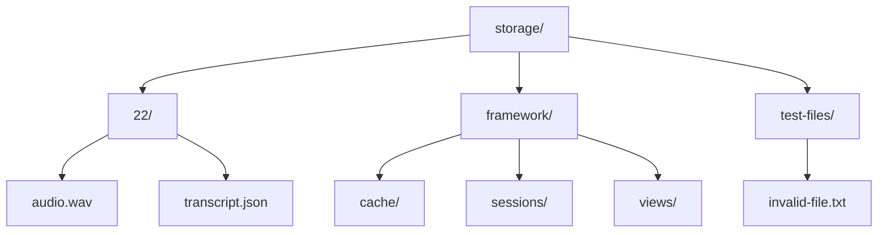
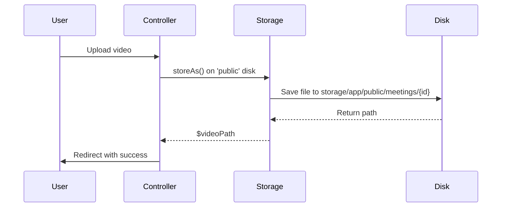
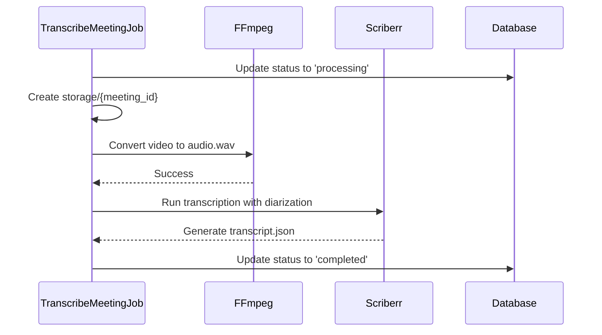

# File System Integration


## Table of Contents
1. [Introduction](#introduction)
2. [Storage Configuration](#storage-configuration)
3. [Directory Structure and File Path Conventions](#directory-structure-and-file-path-conventions)
4. [File Operations and Laravel's Storage Facade](#file-operations-and-laravels-storage-facade)
5. [Transcription Job Workflow](#transcription-job-workflow)
6. [Microservice File I/O Handling](#microservice-file-i-o-handling)
7. [File Integrity and Security Practices](#file-integrity-and-security-practices)
8. [Cleanup Strategies and Temporary File Management](#cleanup-strategies-and-temporary-file-management)
9. [Race Conditions and File Locking](#race-conditions-and-file-locking)
10. [Conclusion](#conclusion)

## Introduction
This document details the file system integration between Laravel and a Python-based transcription microservice. It explains how uploaded video files are stored, processed into audio, transcribed, and how the resulting JSON transcripts are shared between systems. The architecture leverages Laravel’s filesystem abstraction, Dockerized processing, and secure file handling practices to ensure reliable and scalable transcription workflows.

**Section sources**
- [filesystems.php](file://config/filesystems.php)
- [TranscribeMeetingJob.php](file://app/Jobs/TranscribeMeetingJob.php)

## Storage Configuration
The `filesystems.php` configuration file defines multiple disks for different storage purposes. The application uses both local and potential cloud storage (e.g., S3), with the default disk set via environment variable.

### Local and Public Disks
Two primary local disks are configured:
- **local**: Used for private file storage, rooted at `storage/app/private`
- **public**: Designed for publicly accessible files, rooted at `storage/app/public`, with symbolic links enabled via `php artisan storage:link`


```php
'disks' => [
    'local' => [
        'driver' => 'local',
        'root' => storage_path('app/private'),
        'serve' => true,
        'throw' => false,
    ],
    'public' => [
        'driver' => 'local',
        'root' => storage_path('app/public'),
        'url' => env('APP_URL').'/storage',
        'visibility' => 'public',
    ],
]
```


The `public` disk is used to store uploaded video files so they can be served directly by the web server after the symbolic link is created.

### Cloud Storage (S3)
An S3 disk is pre-configured for potential cloud integration, using AWS credentials from environment variables. This allows seamless migration to cloud storage without code changes.


```php
's3' => [
    'driver' => 's3',
    'key' => env('AWS_ACCESS_KEY_ID'),
    'secret' => env('AWS_SECRET_ACCESS_KEY'),
    'region' => env('AWS_DEFAULT_REGION'),
    'bucket' => env('AWS_BUCKET'),
    'url' => env('AWS_URL'),
    'endpoint' => env('AWS_ENDPOINT'),
],
```


**Section sources**
- [filesystems.php](file://config/filesystems.php#L48-L81)

## Directory Structure and File Path Conventions
The system follows a structured approach to file organization under the `storage/` directory.

### Input Video Storage
Uploaded videos are stored in the public disk using the path pattern:

```
meetings/{client_id}/{meeting_id}/video.{extension}
```

This hierarchical structure groups videos by client and meeting, enabling efficient organization and cleanup.

### Per-Meeting Processing Directories
During transcription, each meeting gets its own processing directory:

```
storage/{meeting_id}/
```

This directory contains:
- `audio.wav`: Extracted audio from the video
- `transcript.json`: Final transcription output

For example, meeting ID `22` uses `storage/22/transcript.json`.

### Framework and Temporary Storage
Laravel also uses:
- `storage/framework/cache`: For cache files
- `storage/framework/sessions`: Session storage
- `storage/framework/views`: Compiled Blade templates





**Diagram sources**
- [TranscribeMeetingJob.php](file://app/Jobs/TranscribeMeetingJob.php#L61-L64)
- [filesystems.php](file://config/filesystems.php#L52-L57)

**Section sources**
- [TranscribeMeetingJob.php](file://app/Jobs/TranscribeMeetingJob.php#L61-L64)
- [filesystems.php](file://config/filesystems.php#L52-L57)

## File Operations and Laravel's Storage Facade
Laravel’s `Storage` facade is used throughout the application for file operations, providing an abstraction layer over the underlying filesystem.

### Video Upload and Storage
In `MeetingController.php`, the uploaded video is stored using:

```php
$videoPath = $videoFile->storeAs($storagePath, $fileName, 'public');
```

This stores the file on the `public` disk and returns the relative path.

### File Existence and Deletion
Key operations include:
- **Check existence**: `Storage::disk('public')->exists($path)`
- **Delete file**: `Storage::disk('public')->delete($path)`
- **Delete directory**: `Storage::disk('public')->deleteDirectory($path)`

These are used during upload validation and meeting deletion.

### Symbolic Link for Web Access
The `public/storage` directory is symlinked to `storage/app/public`, allowing direct web access to uploaded files via URLs like `/storage/meetings/1/22/video.mp4`.





**Diagram sources**
- [MeetingController.php](file://app/Http/Controllers/MeetingController.php#L138-L144)
- [filesystems.php](file://config/filesystems.php#L58-L63)

**Section sources**
- [MeetingController.php](file://app/Http/Controllers/MeetingController.php#L138-L144)

## Transcription Job Workflow
The `TranscribeMeetingJob` handles the end-to-end transcription process, coordinating between Laravel and the Python microservice via shared filesystem locations.

### Job Initialization and Status Updates
The job begins by updating the meeting status to "processing" and creating a dedicated directory:

```php
$storageDir = base_path() . '/storage/' . $meetingId;
File::makeDirectory($storageDir, 0755, true);
```


### Video to Audio Conversion
Using Docker and `jrottenberg/ffmpeg`, the job extracts audio:

```bash
docker run --rm -v "/host/in:/in/" -v "/host/out:/out" ffmpeg -i "/in/video.mp4" -vn -acodec pcm_s16le -ar 16000 -ac 1 "/out/audio.wav"
```

The input video is mounted from the `public` disk, and the output WAV is written to the meeting’s storage directory.

### Transcription with Python Microservice
The `scriberr-local` Docker container runs `transcribe.py`, processing `audio.wav` and writing `transcript.json`. The command includes parameters for:
- Model size (`medium`)
- Speaker diarization
- Word alignment
- CPU threading


```php
$scriberrCmd = sprintf(
    'docker run --rm -v "%s:/input.wav" -v "%s:/transcript.json" %s transcribe.py --audio-file /input.wav --model-size medium --output-file /transcript.json --threads %d --language ro --diarize --align --device cpu --compute-type int8',
    $wavMount,
    $transcriptMount,
    escapeshellarg($scriberrImage),
    $threads
);
```





**Diagram sources**
- [TranscribeMeetingJob.php](file://app/Jobs/TranscribeMeetingJob.php#L70-L130)
- [transcribe.py](file://transcribe-microservice/transcribe.py#L1-L50)

**Section sources**
- [TranscribeMeetingJob.php](file://app/Jobs/TranscribeMeetingJob.php#L70-L130)

## Microservice File I/O Handling
The Python microservice (`transcribe.py`) reads the audio file, processes it, and writes the JSON transcript to the shared location.

### Argument Parsing and Configuration
The script accepts:
- `--audio-file`: Input WAV path
- `--output-file`: Output JSON path
- `--diarize`, `--align`: Processing options
- `--device`, `--compute-type`: Performance settings

### Transcription Pipeline
1. Load WhisperX model
2. Transcribe audio segments
3. Optionally align segments
4. Optionally perform speaker diarization using `diarize.py`
5. Write structured JSON output

### Diarization Implementation
The `diarize.py` script:
- Loads a speaker diarization model
- Processes the audio to detect speaker changes
- Assigns speaker labels to transcription segments
- Groups words by speaker to create coherent segments


```python
def diarize_transcript(audio_file, transcript, device="cpu"):
    diarize_model = whisperx.diarize.DiarizationPipeline(model_name="pyannote/speaker-diarization-3.1", device=device)
    diarize_segments = diarize_model(audio_file)
    return whisperx.assign_word_speakers(diarize_segments, transcript)
```


**Section sources**
- [transcribe.py](file://transcribe-microservice/transcribe.py#L1-L201)
- [diarize.py](file://transcribe-microservice/diarize.py#L1-L131)

## File Integrity and Security Practices
The system implements several measures to ensure file integrity and prevent security vulnerabilities.

### Input Validation
Before processing:
- Video file existence is verified: `Storage::disk('public')->exists($videoPath)`
- Missing files throw a `RuntimeException`

### Path Traversal Prevention
All file paths are derived from validated database fields (`$meeting->video_path`), not user input. The `dockerPath` method normalizes paths:

```php
private function dockerPath(string $path): string
{
    $real = realpath($path) ?: $path;
    return str_replace('\\', '/', $real);
}
```

This prevents directory traversal by resolving to absolute paths.

### File Integrity Verification
After FFmpeg conversion:

```php
if (!File::exists($wavPath)) {
    throw new \RuntimeException("WAV conversion did not produce expected file");
}
```

Ensures the audio extraction succeeded before transcription.

### Error Handling and Logging
All file operations are wrapped in try-catch blocks with detailed logging, including:
- Command execution output
- Error messages
- Stack traces

**Section sources**
- [TranscribeMeetingJob.php](file://app/Jobs/TranscribeMeetingJob.php#L58-L60)
- [TranscribeMeetingJob.php](file://app/Jobs/TranscribeMeetingJob.php#L94-L97)

## Cleanup Strategies and Temporary File Management
The system includes automated cleanup to manage disk usage.

### Post-Processing Cleanup
In the `failed()` method, temporary files are removed:

```php
private function cleanupTempFiles(): void
{
    $storageDir = base_path() . '/storage/' . $this->meeting->id;
    if (File::exists($storageDir)) {
        $files = File::files($storageDir);
        foreach ($files as $file) {
            if (in_array($file->getExtension(), ['wav', 'json'])) {
                File::delete($file->getPathname());
            }
        }
        if (empty(File::files($storageDir))) {
            File::deleteDirectory($storageDir);
        }
    }
}
```


### Cleanup Trigger
This runs automatically when:
- The job fails after retries
- Manual cleanup is needed

### Video File Retention
Uploaded video files in the `public` disk are retained until the meeting is deleted, at which point both the video and its directory are removed.

**Section sources**
- [TranscribeMeetingJob.php](file://app/Jobs/TranscribeMeetingJob.php#L340-L370)
- [MeetingController.php](file://app/Http/Controllers/MeetingController.php#L250-L257)

## Race Conditions and File Locking
The current implementation does not use explicit file locking, relying instead on Laravel's queue system to prevent concurrent processing.

### Queue-Based Concurrency Control
- Each `TranscribeMeetingJob` is queued and processed sequentially
- The job checks and updates the meeting status in the database
- Multiple jobs for the same meeting are prevented by application logic

### Atomic Status Updates
Database updates (e.g., status changes) are atomic operations, ensuring consistency even if multiple processes attempt updates.

### Potential Race Condition
A race condition could occur if:
- Two jobs process the same meeting (prevented by queue design)
- File system operations conflict (mitigated by per-meeting directories)

No file-level locks are used; isolation is achieved through directory separation and queued execution.

**Section sources**
- [TranscribeMeetingJob.php](file://app/Jobs/TranscribeMeetingJob.php#L45-L50)
- [TranscribeMeetingJob.php](file://app/Jobs/TranscribeMeetingJob.php#L145-L150)

## Conclusion
The file system integration between Laravel and the transcription microservice is robust and well-structured. It uses Laravel’s filesystem abstraction for flexible storage, per-meeting directories for isolation, Docker for processing isolation, and comprehensive error handling. Security is maintained through path validation and input sanitization, while cleanup strategies prevent disk exhaustion. The system is designed for scalability, with potential for cloud storage integration and distributed processing.

**Referenced Files in This Document**   
- [filesystems.php](file://config/filesystems.php)
- [TranscribeMeetingJob.php](file://app/Jobs/TranscribeMeetingJob.php)
- [transcribe.py](file://transcribe-microservice/transcribe.py)
- [diarize.py](file://transcribe-microservice/diarize.py)
- [MeetingController.php](file://app/Http/Controllers/MeetingController.php)
- [transcript.json](file://storage/22/transcript.json)