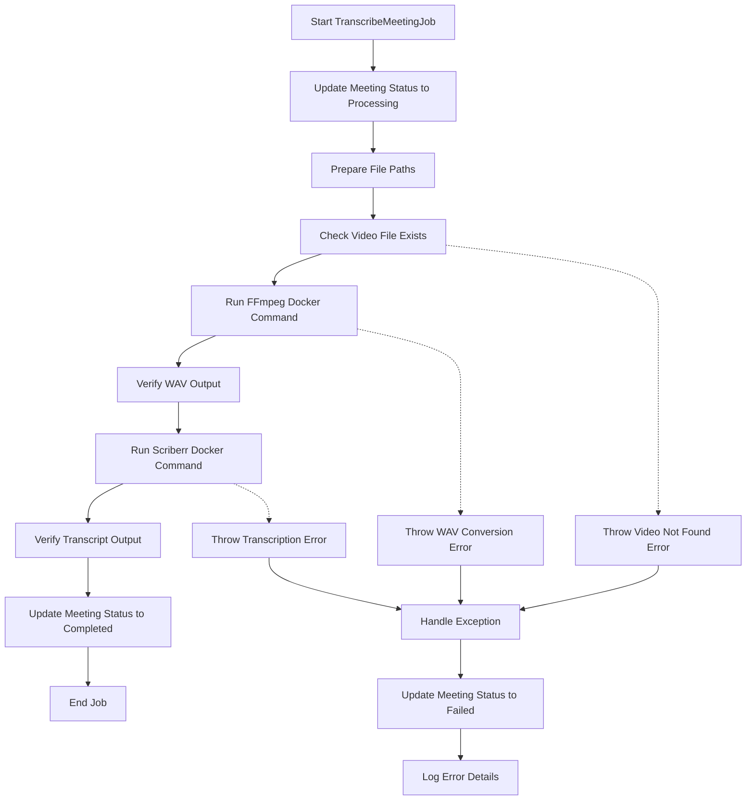
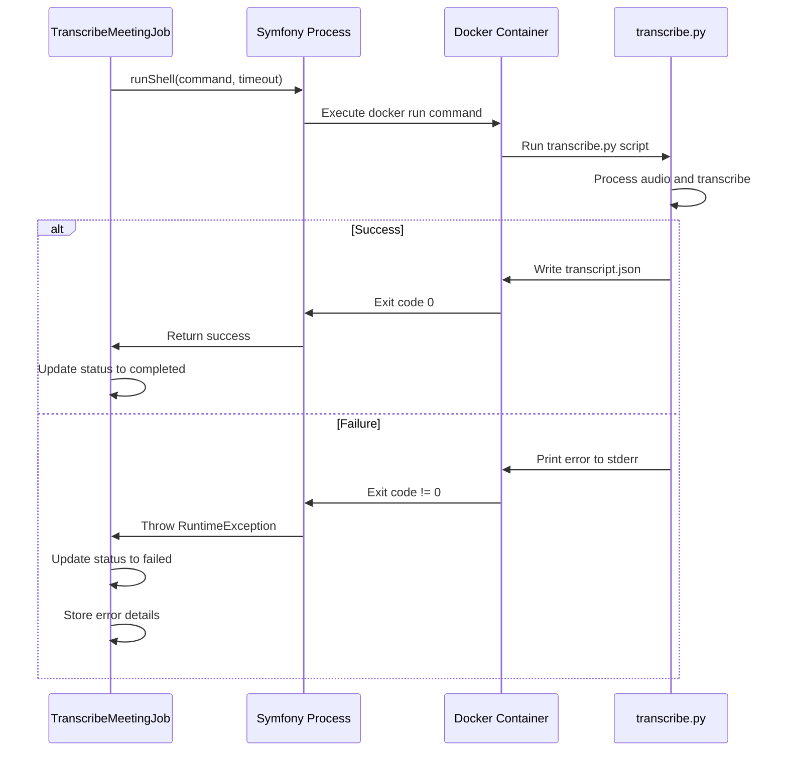
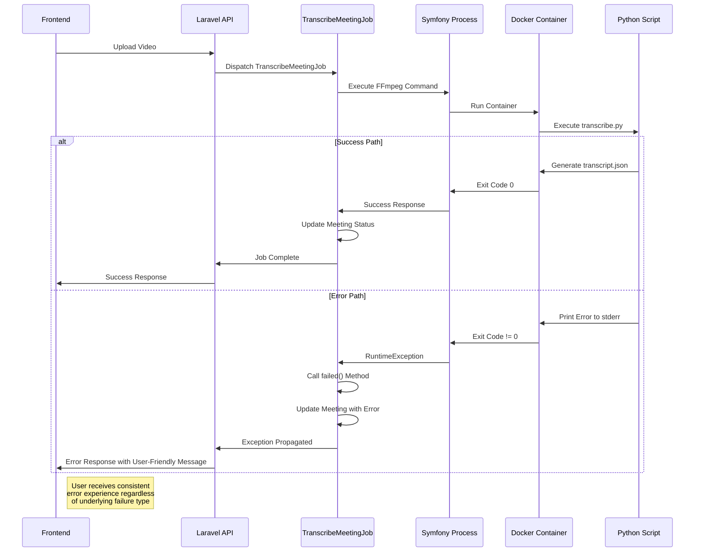

# Process Execution and Error Handling


## Table of Contents
1. [Process Execution Workflow](#process-execution-workflow)
2. [Error Detection and Propagation](#error-detection-and-propagation)
3. [Error Handling Strategy](#error-handling-strategy)
4. [Common Failure Modes](#common-failure-modes)
5. [Retry Mechanism](#retry-mechanism)
6. [Process Execution Flow](#process-execution-flow)
7. [Error Propagation Sequence](#error-propagation-sequence)

## Process Execution Workflow

The transcription workflow is orchestrated by the `TranscribeMeetingJob` class, which uses the Symfony Process component to securely invoke Dockerized Python scripts. The process involves two main stages: video-to-audio conversion using FFmpeg and transcription using WhisperX.

The job begins by updating the meeting status to "processing" and preparing the necessary file paths for input and output. It then executes two Docker commands sequentially:

1. **Audio Extraction**: Uses FFmpeg to extract WAV audio from the input video file
2. **Transcription**: Invokes the `transcribe.py` script with WhisperX for speech-to-text conversion, diarization, and alignment

Each Docker command is executed through the Symfony Process component, which provides secure process isolation and execution control.





**Diagram sources**
- [TranscribeMeetingJob.php](file://app/Jobs/TranscribeMeetingJob.php#L31-L141)

**Section sources**
- [TranscribeMeetingJob.php](file://app/Jobs/TranscribeMeetingJob.php#L31-L141)

## Error Detection and Propagation

The system implements a comprehensive error detection mechanism that captures failures at multiple levels:

**Exit Code Monitoring**: The Symfony Process component monitors the exit codes of executed commands. Any non-zero exit code triggers a `ProcessFailedException`, which is converted to a `\RuntimeException` with detailed error information.

**Python Script Exception Handling**: The `transcribe.py` script includes robust error handling for common issues:
- GPU memory management during diarization
- Compute type compatibility (e.g., float16 vs float32)
- Model loading failures
- Audio processing errors

**Output Validation**: The system validates the existence of critical output files:
- Confirms WAV file creation after FFmpeg execution
- Verifies JSON transcript generation after transcription
- Validates file paths and permissions

When errors occur in the Python scripts, they are captured via stderr and propagated back to the Laravel application through the process exit code and error output.





**Diagram sources**
- [TranscribeMeetingJob.php](file://app/Jobs/TranscribeMeetingJob.php#L278-L320)
- [transcribe.py](file://transcribe-microservice/transcribe.py#L1-L201)

**Section sources**
- [TranscribeMeetingJob.php](file://app/Jobs/TranscribeMeetingJob.php#L278-L320)
- [transcribe.py](file://transcribe-microservice/transcribe.py#L1-L201)

## Error Handling Strategy

The error handling strategy is implemented through a multi-layered approach that ensures robust failure management and user-friendly error reporting.

**Laravel-Level Error Handling**: The `TranscribeMeetingJob` class uses try-catch blocks to capture exceptions and update the meeting record with error details:


```php
try {
    // Process execution code
} catch (\Throwable $e) {
    Log::error("Transcription failed for meeting {$this->meeting->id}: " . $e->getMessage());
    
    $this->meeting->update([
        'status' => 'failed',
        'processing_completed_at' => now(),
    ]);
    
    throw $e;
}
```


**Structured Error Storage**: When a job fails, the `failed()` method is automatically called, storing error information in the database:

- `error_message`: User-friendly error message
- `technical_error`: Raw exception message for debugging


```php
public function failed(\Throwable $exception): void
{
    $this->meeting->update([
        'status' => 'failed',
        'processing_completed_at' => now(),
        'error_message' => $this->getUserFriendlyErrorMessage($exception),
        'technical_error' => $exception->getMessage()
    ]);
}
```


**User-Friendly Error Mapping**: The system converts technical errors into user-friendly messages:


```php
private function getUserFriendlyErrorMessage(\Throwable $exception): string
{
    $message = $exception->getMessage();

    if (str_contains($message, 'Video file not found')) {
        return 'The video file could not be found. It may have been moved or deleted.';
    }

    if (str_contains($message, 'docker') || str_contains($message, 'Docker')) {
        return 'Transcription service is temporarily unavailable. Please try again later.';
    }

    // Additional error mappings...
}
```


**Section sources**
- [TranscribeMeetingJob.php](file://app/Jobs/TranscribeMeetingJob.php#L297-L398)
- [2025_08_10_160251_add_error_fields_to_meetings_table.php](file://database/migrations/2025_08_10_160251_add_error_fields_to_meetings_table.php#L1-L29)
- [Meeting.php](file://app/Models/Meeting.php#L1-L179)

## Common Failure Modes

The system anticipates and handles several common failure scenarios:

**Missing Dependencies**: If Docker is not available or the required images are not present, the system captures the error and provides a user-friendly message about service unavailability.

**GPU Memory Issues**: The Python scripts implement memory management strategies:
- Clear CUDA cache before diarization
- Release model memory when switching between processing stages
- Use memory-efficient compute types (int8)


```python
if args.device == "cuda":
    try:
        import torch
        # Release model from memory to free CUDA memory
        del model
        gc.collect()
        torch.cuda.empty_cache()
    except (ImportError, NameError) as e:
        print(f"Could not fully clear memory: {e}")
```


**Malformed Output**: The system validates the JSON output structure and handles cases where the transcription process produces incomplete or corrupted files.

**Resource Constraints**: The system monitors system resources and adjusts processing parameters accordingly:
- Dynamically determines CPU thread count
- Sets appropriate compute types based on available resources
- Implements timeout protection

**Code Example: Process Execution with Timeout**

```php
private function runShell(string $command, ?int $timeoutSeconds = null): void
{
    $process = Process::fromShellCommandline($command, base_path(), null, null, $timeoutSeconds);
    $process->run(function ($type, $buffer) {
        if ($type === Process::OUT) {
            Log::info(trim($buffer));
        } else {
            Log::warning(trim($buffer));
        }
    });

    if (!$process->isSuccessful()) {
        $exitCode = $process->getExitCode();
        $err = $process->getErrorOutput() ?: $process->getOutput();
        throw new \RuntimeException("Command failed (exit {$exitCode}): {$err}");
    }
}
```


**Section sources**
- [TranscribeMeetingJob.php](file://app/Jobs/TranscribeMeetingJob.php#L278-L320)
- [transcribe.py](file://transcribe-microservice/transcribe.py#L1-L201)
- [diarize.py](file://transcribe-microservice/diarize.py#L1-L131)

## Retry Mechanism

The system implements a robust retry mechanism to handle transient failures:

**Retry Configuration**:
- Maximum of 3 attempts (`$tries = 3`)
- Retries allowed for 30 minutes (`retryUntil()`)
- Exponential backoff strategy: 1 minute, 5 minutes, 15 minutes


```php
public $tries = 3;
public $maxExceptions = 3;

public function retryUntil(): \DateTime
{
    return now()->addMinutes(30);
}

public function backoff(): array
{
    return [60, 300, 900]; // 1 minute, 5 minutes, 15 minutes
}
```


**Retry Conditions**: The system automatically retries on various failure types:
- Temporary Docker service unavailability
- Network connectivity issues
- Resource contention
- Transient file system errors

**Cleanup on Failure**: After each failed attempt, temporary files are cleaned up to prevent disk space issues:


```php
private function cleanupTempFiles(): void
{
    try {
        $meetingId = $this->meeting->id;
        $storageDir = base_path() . DIRECTORY_SEPARATOR . 'storage' . DIRECTORY_SEPARATOR . $meetingId;
        
        if (File::exists($storageDir)) {
            $files = File::files($storageDir);
            foreach ($files as $file) {
                if (in_array($file->getExtension(), ['wav', 'json'])) {
                    File::delete($file->getPathname());
                }
            }
            
            if (empty(File::files($storageDir))) {
                File::deleteDirectory($storageDir);
            }
        }
    } catch (\Exception $e) {
        Log::warning("Failed to cleanup temp files for meeting {$this->meeting->id}: " . $e->getMessage());
    }
}
```


**Section sources**
- [TranscribeMeetingJob.php](file://app/Jobs/TranscribeMeetingJob.php#L353-L398)

## Process Execution Flow

The complete process execution flow demonstrates how the system orchestrates the transcription workflow with proper error handling:


```mermaid
flowchart TD
A[Job Dispatched] --> B[handle() Method]
B --> C{Validate Video File}
C --> |Exists| D[Run FFmpeg Command]
C --> |Not Found| E[Throw Exception]
D --> F{WAV File Created?}
F --> |Yes| G[Run Transcription Command]
F --> |No| H[Throw Exception]
G --> I{Transcription Successful?}
I --> |Yes| J[Update Status: Completed]
I --> |No| K[Call failed() Method]
J --> L[Job Complete]
K --> M[Update Status: Failed]
M --> N[Store Error Messages]
N --> O[Log Technical Details]
O --> P{Retries Remaining?}
P --> |Yes| Q[Wait Backoff Period]
Q --> B
P --> |No| R[Final Failure]
E --> K
H --> K
style C fill:#f9f,stroke:#333
style F fill:#f9f,stroke:#333
style I fill:#f9f,stroke:#333
style P fill:#f9f,stroke:#333
```


**Diagram sources**
- [TranscribeMeetingJob.php](file://app/Jobs/TranscribeMeetingJob.php#L31-L141)
- [TranscribeMeetingJob.php](file://app/Jobs/TranscribeMeetingJob.php#L297-L398)

## Error Propagation Sequence

The error propagation sequence illustrates how errors are captured and handled throughout the system:





**Diagram sources**
- [TranscribeMeetingJob.php](file://app/Jobs/TranscribeMeetingJob.php#L278-L320)
- [transcribe.py](file://transcribe-microservice/transcribe.py#L1-L201)
- [Meeting.php](file://app/Models/Meeting.php#L1-L179)

**Referenced Files in This Document**   
- [TranscribeMeetingJob.php](file://app/Jobs/TranscribeMeetingJob.php#L1-L400)
- [transcribe.py](file://transcribe-microservice/transcribe.py#L1-L201)
- [diarize.py](file://transcribe-microservice/diarize.py#L1-L131)
- [Meeting.php](file://app/Models/Meeting.php#L1-L179)
- [2025_08_10_160251_add_error_fields_to_meetings_table.php](file://database/migrations/2025_08_10_160251_add_error_fields_to_meetings_table.php#L1-L29)