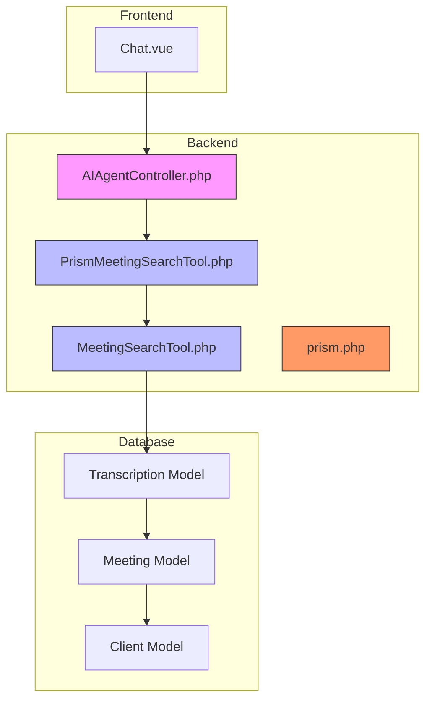
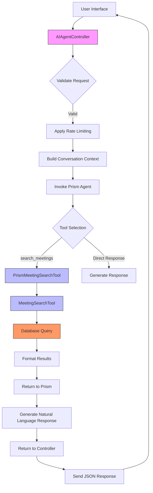
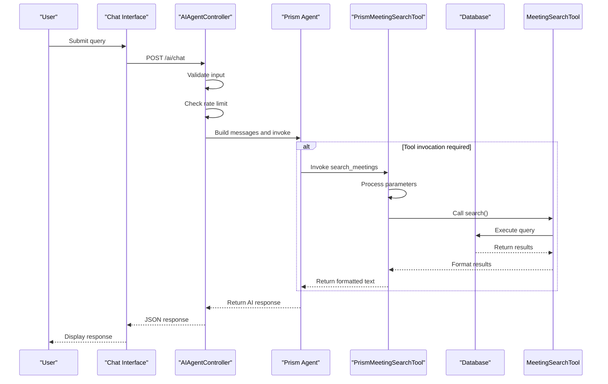
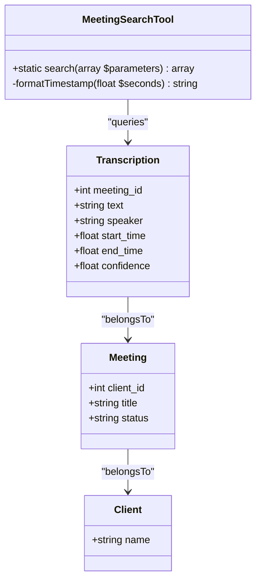
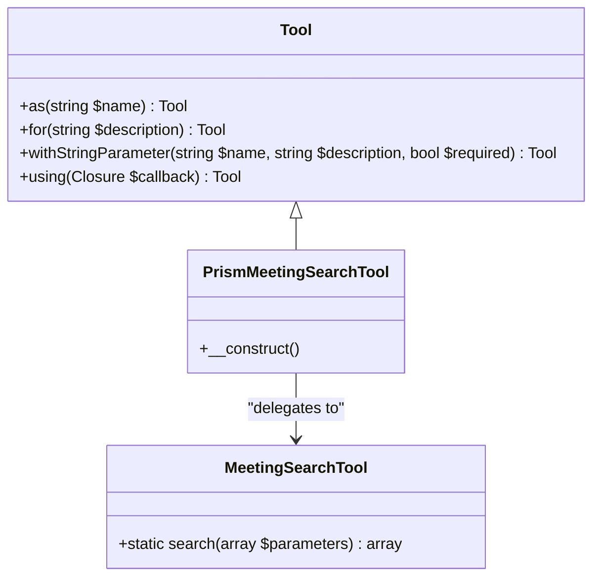
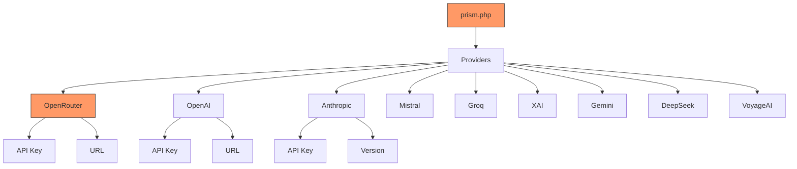
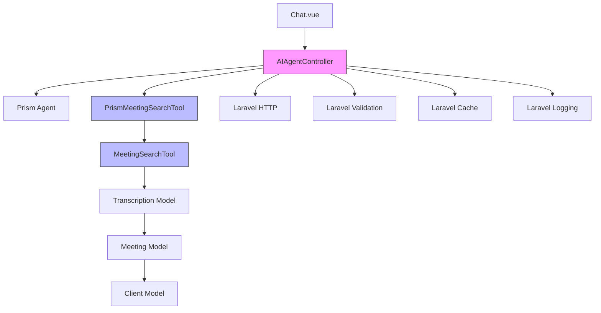

# AI Agent Architecture

## Table of Contents
1. [Introduction](#introduction)
2. [Project Structure](#project-structure)
3. [Core Components](#core-components)
4. [Architecture Overview](#architecture-overview)
5. [Detailed Component Analysis](#detailed-component-analysis)
6. [Dependency Analysis](#dependency-analysis)
7. [Performance Considerations](#performance-considerations)
8. [Troubleshooting Guide](#troubleshooting-guide)
9. [Conclusion](#conclusion)

## Introduction
This document provides comprehensive architectural documentation for the AI agent system in the meetingai application. The system enables users to search through meeting transcriptions using natural language queries via an AI-powered interface. The architecture follows a tool-based extension pattern where AI agents can invoke specialized tools to retrieve information from the database. The core components include the AIAgentController as the entry point, the Prism AI framework for agent orchestration, and the MeetingSearchTool for querying transcription data. This documentation details the request lifecycle, security model, performance characteristics, and extensibility of the system.

## Project Structure
The meetingai application follows a standard Laravel MVC architecture with additional components for AI integration. The AI agent functionality is primarily contained within the app/Http/Controllers, app/Tools, and config directories. The frontend interface is implemented using Vue.js with Inertia.js for server-side rendering. The system integrates with the Prism AI framework through configuration and custom tool implementations.

**Diagram sources**
- [AIAgentController.php](file://app/Http/Controllers/AIAgentController.php)
- [MeetingSearchTool.php](file://app/Tools/MeetingSearchTool.php)
- [PrismMeetingSearchTool.php](file://app/Tools/PrismMeetingSearchTool.php)
- [prism.php](file://config/prism.php)

**Section sources**
- [AIAgentController.php](file://app/Http/Controllers/AIAgentController.php)
- [MeetingSearchTool.php](file://app/Tools/MeetingSearchTool.php)
- [PrismMeetingSearchTool.php](file://app/Tools/PrismMeetingSearchTool.php)
- [prism.php](file://config/prism.php)

## Core Components
The AI agent system in meetingai consists of three core components that work together to process natural language queries and return relevant meeting transcription excerpts. The AIAgentController serves as the HTTP entry point, receiving user queries and orchestrating the AI response process. The PrismMeetingSearchTool acts as an adapter between the Prism AI framework and the application-specific search functionality, defining the tool interface that the AI agent can invoke. The MeetingSearchTool contains the actual database query logic for searching through transcriptions, applying filters, and formatting results with timestamps and context.

**Section sources**
- [AIAgentController.php](file://app/Http/Controllers/AIAgentController.php#L1-L182)
- [MeetingSearchTool.php](file://app/Tools/MeetingSearchTool.php#L1-L85)
- [PrismMeetingSearchTool.php](file://app/Tools/PrismMeetingSearchTool.php#L1-L49)

## Architecture Overview
The AI agent architecture follows a layered pattern with clear separation of concerns between the presentation layer, application logic, and data access. The system leverages the Prism AI framework to handle natural language understanding and tool selection, while custom components handle domain-specific functionality. When a user submits a query through the chat interface, the request flows through the AIAgentController, which validates input and applies rate limiting. The controller then delegates to the Prism agent, which determines whether to use the search_meetings tool based on the query content. If the tool is selected, the Prism framework invokes the PrismMeetingSearchTool, which in turn calls the MeetingSearchTool to execute the database query. The results are formatted and returned through the response chain.

**Diagram sources**
- [AIAgentController.php](file://app/Http/Controllers/AIAgentController.php)
- [PrismMeetingSearchTool.php](file://app/Tools/PrismMeetingSearchTool.php)
- [MeetingSearchTool.php](file://app/Tools/MeetingSearchTool.php)

## Detailed Component Analysis

### AIAgentController Analysis
The AIAgentController serves as the entry point for all AI-powered search queries in the meetingai application. It exposes two primary endpoints: chat for natural language interaction with the AI agent, and search for direct programmatic access to meeting transcription search. The controller implements input validation to ensure messages are within acceptable length limits and conversation history is properly structured. It also implements a basic rate limiting mechanism using the application cache to prevent abuse, allowing up to 10 requests per minute per IP address. The controller handles errors gracefully, providing specific error messages for validation failures, timeouts, rate limiting, and network issues.

**Diagram sources**
- [AIAgentController.php](file://app/Http/Controllers/AIAgentController.php#L1-L182)

**Section sources**
- [AIAgentController.php](file://app/Http/Controllers/AIAgentController.php#L1-L182)
- [web.php](file://routes/web.php#L1-L45)

### MeetingSearchTool Analysis
The MeetingSearchTool provides the core functionality for searching through meeting transcriptions by natural language. It implements a static search method that accepts query parameters including the search term, optional client ID filter, speaker filter, and result limit. The tool constructs a database query using Laravel's query builder, joining the Transcription model with related Meeting and Client models to provide full context. The search uses a case-insensitive LIKE operator to find matches in the transcription text. Results are ordered by timestamp to maintain chronological context and limited to prevent excessive data retrieval. Each result is processed to highlight the search term, format the timestamp, and include relevant metadata such as meeting title, client name, speaker, and a direct link to the meeting at the specific timestamp.

**Diagram sources**
- [MeetingSearchTool.php](file://app/Tools/MeetingSearchTool.php#L1-L85)

**Section sources**
- [MeetingSearchTool.php](file://app/Tools/MeetingSearchTool.php#L1-L85)
- [AIAgentTest.php](file://tests/Feature/AIAgentTest.php#L1-L44)

### PrismMeetingSearchTool Analysis
The PrismMeetingSearchTool serves as an adapter between the Prism AI framework and the application's MeetingSearchTool. It extends the Prism\Prism\Tool class and defines the interface that the AI agent uses to invoke the search functionality. The tool is configured with a name (search_meetings), description, and parameter schema that includes the required query parameter and optional client_id, speaker, and limit parameters. The tool's execution logic validates and normalizes input parameters, calls the MeetingSearchTool::search method, and formats the results into a natural language response that the AI agent can incorporate into its reply. This pattern allows the AI agent to understand when and how to use this tool based on the user's natural language query.

**Diagram sources**
- [PrismMeetingSearchTool.php](file://app/Tools/PrismMeetingSearchTool.php#L1-L49)

**Section sources**
- [PrismMeetingSearchTool.php](file://app/Tools/PrismMeetingSearchTool.php#L1-L49)
- [AIAgentController.php](file://app/Http/Controllers/AIAgentController.php#L1-L182)

### Configuration Analysis
The prism.php configuration file contains the settings for the Prism AI framework, specifically the configuration for various AI providers including OpenRouter. The configuration is environment-driven, using Laravel's env() function to retrieve API keys and endpoint URLs from environment variables. For OpenRouter, the configuration includes the API key and base URL. This separation of configuration from code allows for easy switching between AI providers and secure management of credentials. The configuration also includes settings for other providers like OpenAI, Anthropic, and Mistral, indicating the system's potential for multi-provider support.

**Diagram sources**
- [prism.php](file://config/prism.php#L1-L55)

**Section sources**
- [prism.php](file://config/prism.php#L1-L55)
- [AIAgentController.php](file://app/Http/Controllers/AIAgentController.php#L1-L182)

## Dependency Analysis
The AI agent system has a clear dependency hierarchy with well-defined interfaces between components. The AIAgentController depends on the Prism AI framework classes for message handling and agent invocation, as well as the PrismMeetingSearchTool for tool integration. The PrismMeetingSearchTool depends on the MeetingSearchTool for actual search functionality, creating a delegation pattern that separates AI framework integration from business logic. The MeetingSearchTool depends on the Transcription model and its relationships with Meeting and Client models for data access. The entire system depends on Laravel's core components for HTTP handling, validation, caching, and logging. The frontend Chat.vue component depends on the AIAgentController endpoints for all AI interactions.

**Diagram sources**
- [AIAgentController.php](file://app/Http/Controllers/AIAgentController.php)
- [PrismMeetingSearchTool.php](file://app/Tools/PrismMeetingSearchTool.php)
- [MeetingSearchTool.php](file://app/Tools/MeetingSearchTool.php)

**Section sources**
- [AIAgentController.php](file://app/Http/Controllers/AIAgentController.php#L1-L182)
- [PrismMeetingSearchTool.php](file://app/Tools/PrismMeetingSearchTool.php#L1-L49)
- [MeetingSearchTool.php](file://app/Tools/MeetingSearchTool.php#L1-L85)
- [Chat.vue](file://resources/js/pages/AI/Chat.vue#L1-L209)

## Performance Considerations
The AI agent system incorporates several performance optimizations and considerations. The AIAgentController implements rate limiting to prevent abuse and protect backend resources. The MeetingSearchTool applies a limit parameter (default 10, maximum 50) to prevent excessive database queries and result sets. The database query uses indexing-friendly patterns with the LIKE operator and appropriate joins. However, the current implementation uses a simple text search without full-text indexing, which may impact performance as the dataset grows. The system also lacks caching for search results, meaning identical queries will re-execute database searches. The AI request includes a timeout mechanism in the frontend (30 seconds) to prevent hanging requests. There is a trade-off between response speed and comprehensiveness, as more comprehensive searches would require scanning more data but could impact response time.

**Section sources**
- [AIAgentController.php](file://app/Http/Controllers/AIAgentController.php#L1-L182)
- [MeetingSearchTool.php](file://app/Tools/MeetingSearchTool.php#L1-L85)
- [Chat.vue](file://resources/js/pages/AI/Chat.vue#L1-L209)

## Troubleshooting Guide
The AI agent system includes several mechanisms for troubleshooting and error handling. The AIAgentController logs both successful and failed requests with relevant metadata for monitoring and debugging. Error responses are categorized with appropriate HTTP status codes: 422 for validation errors, 429 for rate limiting, 408 for timeouts, and 500 for internal server errors. The system handles various error types with specific messages to guide users. Common issues include empty search queries, which are handled gracefully with a specific error message, and rate limiting, which informs users to wait before retrying. Database errors in the MeetingSearchTool are caught and returned as formatted error responses. The frontend also handles network errors and displays appropriate messages to users.

**Section sources**
- [AIAgentController.php](file://app/Http/Controllers/AIAgentController.php#L1-L182)
- [MeetingSearchTool.php](file://app/Tools/MeetingSearchTool.php#L1-L85)
- [AIAgentTest.php](file://tests/Feature/AIAgentTest.php#L1-L44)
- [AIAgentInteractionTest.php](file://tests/Browser/AIAgentInteractionTest.php#L1-L292)

## Conclusion
The AI agent architecture in meetingai effectively combines natural language processing with domain-specific search functionality through a well-structured tool-based extension pattern. The system provides a seamless interface for users to query meeting transcriptions using natural language, with results enriched with contextual information and timestamps. The architecture demonstrates good separation of concerns, with clear boundaries between the AI framework integration, business logic, and data access layers. The implementation includes essential features such as input validation, rate limiting, and comprehensive error handling. For future improvements, consider implementing full-text database indexing for faster searches, adding result caching to improve performance for repeated queries, and expanding the tool system to support additional capabilities like summarization or sentiment analysis.

**Referenced Files in This Document**   
- [AIAgentController.php](file://app/Http/Controllers/AIAgentController.php)
- [MeetingSearchTool.php](file://app/Tools/MeetingSearchTool.php)
- [PrismMeetingSearchTool.php](file://app/Tools/PrismMeetingSearchTool.php)
- [prism.php](file://config/prism.php)
- [AIAgentTest.php](file://tests/Feature/AIAgentTest.php)
- [AIAgentInteractionTest.php](file://tests/Browser/AIAgentInteractionTest.php)
- [Chat.vue](file://resources/js/pages/AI/Chat.vue)
- [web.php](file://routes/web.php)