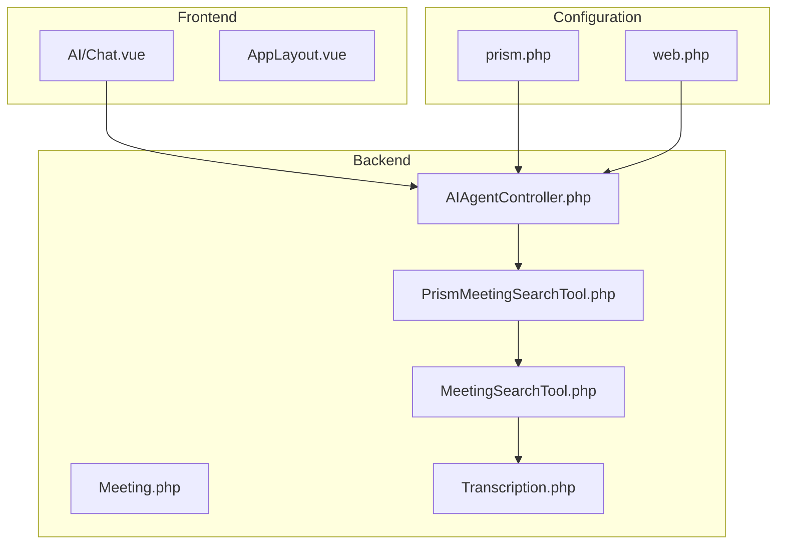
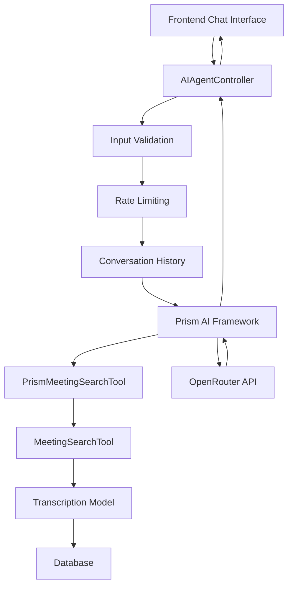
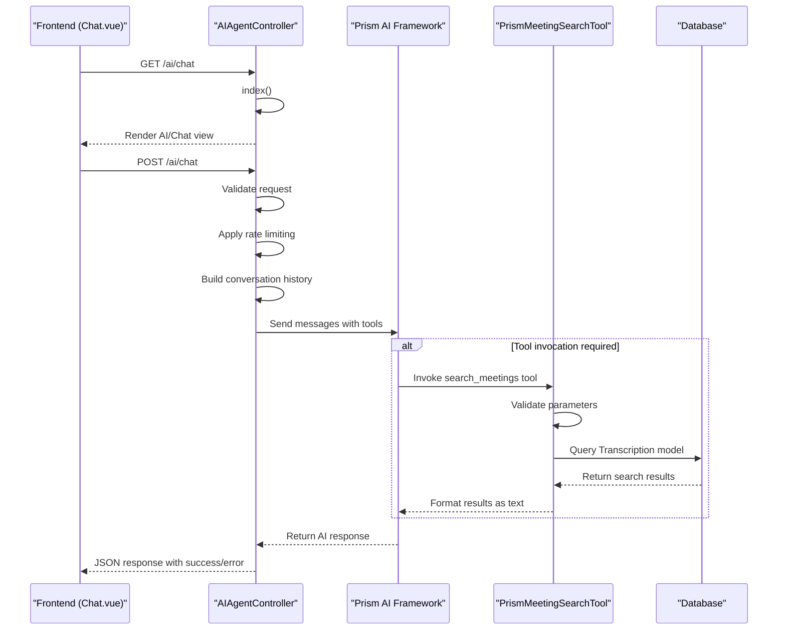
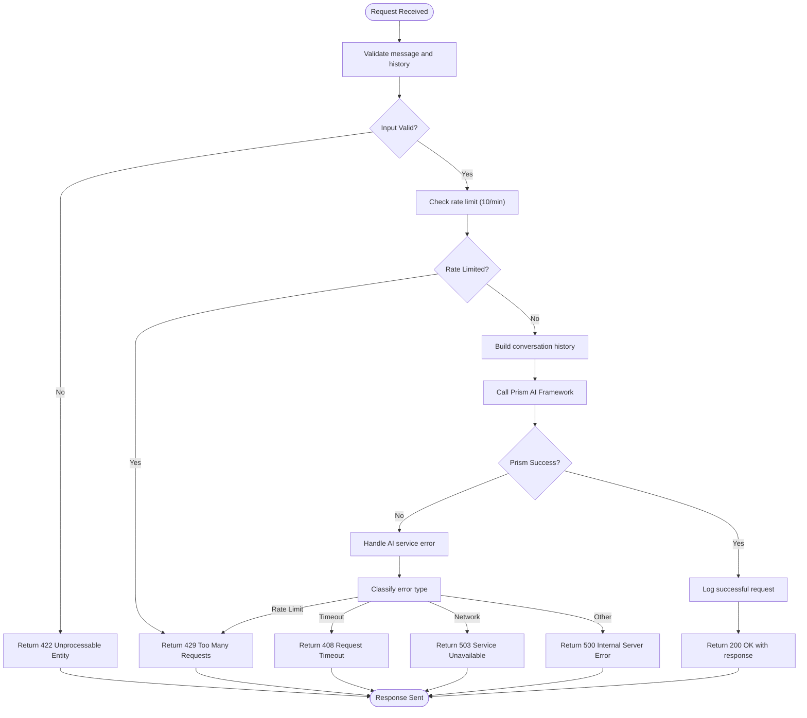
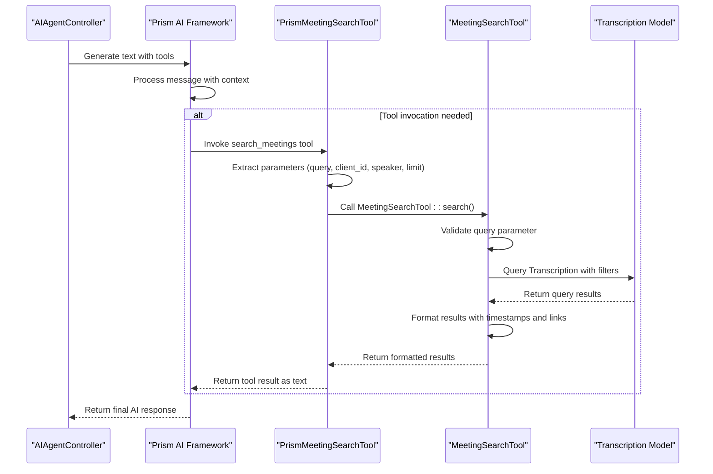
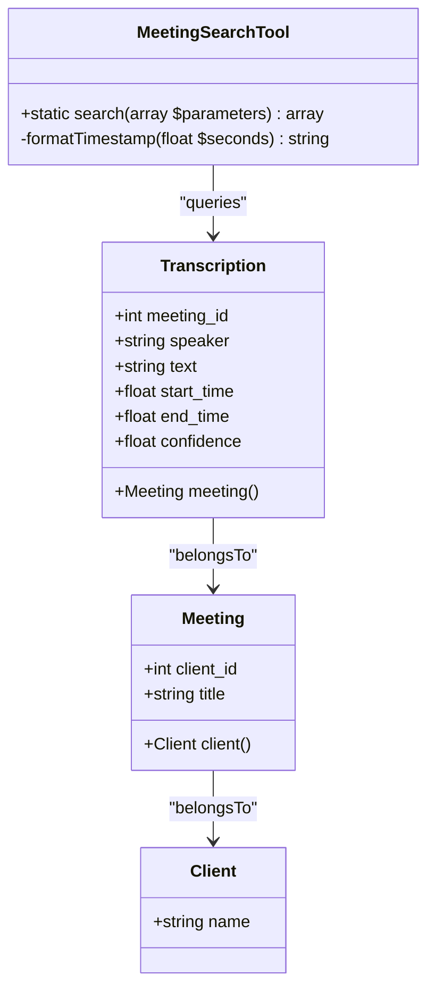
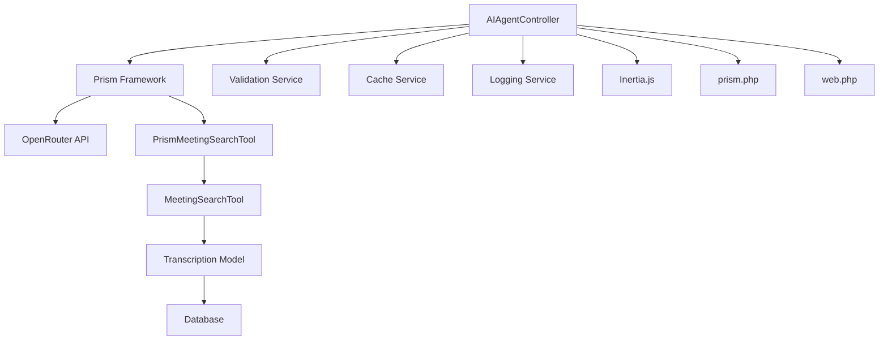

# AIAgentController Implementation

## Table of Contents
1. [Introduction](#introduction)
2. [Project Structure](#project-structure)
3. [Core Components](#core-components)
4. [Architecture Overview](#architecture-overview)
5. [Detailed Component Analysis](#detailed-component-analysis)
6. [Dependency Analysis](#dependency-analysis)
7. [Performance Considerations](#performance-considerations)
8. [Troubleshooting Guide](#troubleshooting-guide)
9. [Conclusion](#conclusion)

## Introduction
The AIAgentController serves as the central API endpoint for handling AI-powered queries in the meetingai application. It acts as the bridge between the frontend AI chat interface and the Prism AI agent framework, which communicates with external AI services through the OpenRouter API. This controller receives user input from the chat interface, processes and validates requests, orchestrates tool execution for meeting data search, and returns structured responses to the frontend. The implementation leverages Inertia.js for server-side rendering of the chat interface and incorporates robust error handling, rate limiting, and input validation to ensure a reliable user experience.

## Project Structure
The meetingai application follows a standard Laravel MVC architecture with additional components for AI integration and real-time functionality. The project structure is organized into logical directories for controllers, models, tools, and frontend components. The AIAgentController resides in the app/Http/Controllers directory alongside other controllers, while AI-related tools are located in the app/Tools directory. Frontend components are implemented using Vue.js within the resources/js/pages directory, following a component-based architecture. Configuration for the Prism AI framework is stored in the config directory, and routes are defined in the routes/web.php file.

**Diagram sources**
- [AIAgentController.php](file://app/Http/Controllers/AIAgentController.php)
- [PrismMeetingSearchTool.php](file://app/Tools/PrismMeetingSearchTool.php)
- [MeetingSearchTool.php](file://app/Tools/MeetingSearchTool.php)
- [prism.php](file://config/prism.php)
- [web.php](file://routes/web.php)
- [Chat.vue](file://resources/js/pages/AI/Chat.vue)

**Section sources**
- [AIAgentController.php](file://app/Http/Controllers/AIAgentController.php)
- [PrismMeetingSearchTool.php](file://app/Tools/PrismMeetingSearchTool.php)
- [MeetingSearchTool.php](file://app/Tools/MeetingSearchTool.php)
- [prism.php](file://config/prism.php)
- [web.php](file://routes/web.php)
- [Chat.vue](file://resources/js/pages/AI/Chat.vue)

## Core Components
The AIAgentController is the central component for AI-powered meeting query processing, coordinating between the frontend interface and backend AI services. It implements three primary methods: index() for rendering the chat interface, chat() for processing AI queries with tool orchestration, and search() for direct meeting transcription searches. The controller integrates with the Prism AI framework through the OpenRouter provider, using a specifically configured GPT model for text generation. It also implements rate limiting using Laravel's cache system to prevent abuse, with a limit of 10 requests per minute per IP address. Input validation ensures message length does not exceed 1000 characters and conversation history is limited to 50 entries.

**Section sources**
- [AIAgentController.php](file://app/Http/Controllers/AIAgentController.php#L1-L182)

## Architecture Overview
The AIAgentController operates within a layered architecture that separates concerns between presentation, business logic, and data access. When a user submits a query through the AI chat interface, the request is routed to the AIAgentController's chat method. The controller first validates the input and applies rate limiting, then constructs a conversation history with system, user, and assistant messages. This context is passed to the Prism AI framework, which may invoke the PrismMeetingSearchTool to retrieve relevant meeting data. The tool executes searches against the Transcription model, which is linked to Meeting and Client models through Eloquent relationships. The AI response is then formatted and returned to the frontend, where it is displayed along with any search results.

**Diagram sources**
- [AIAgentController.php](file://app/Http/Controllers/AIAgentController.php)
- [PrismMeetingSearchTool.php](file://app/Tools/PrismMeetingSearchTool.php)
- [MeetingSearchTool.php](file://app/Tools/MeetingSearchTool.php)

## Detailed Component Analysis

### AIAgentController Analysis
The AIAgentController is responsible for handling all AI-related requests in the meetingai application. It extends the base Controller class and implements three public methods to support the AI chat functionality.

#### Controller Methods and Request Flow

**Diagram sources**
- [AIAgentController.php](file://app/Http/Controllers/AIAgentController.php#L1-L182)
- [PrismMeetingSearchTool.php](file://app/Tools/PrismMeetingSearchTool.php#L1-L50)
- [MeetingSearchTool.php](file://app/Tools/MeetingSearchTool.php#L1-L86)

**Section sources**
- [AIAgentController.php](file://app/Http/Controllers/AIAgentController.php#L1-L182)

#### Request Validation and Error Handling
The AIAgentController implements comprehensive request validation and error handling to ensure robust operation. The chat method validates that the message parameter is present, is a string, and does not exceed 1000 characters. Conversation history is validated as an array with a maximum of 50 entries. The controller implements a basic rate limiting mechanism using Laravel's cache system, allowing 10 requests per minute per IP address. Error handling is implemented through try-catch blocks that capture validation exceptions and general exceptions, logging errors and returning appropriate HTTP status codes and error messages to the client.

**Diagram sources**
- [AIAgentController.php](file://app/Http/Controllers/AIAgentController.php#L1-L182)

**Section sources**
- [AIAgentController.php](file://app/Http/Controllers/AIAgentController.php#L1-L182)

### Tool Integration Analysis
The AIAgentController integrates with AI tools through the PrismMeetingSearchTool, which enables the AI agent to search through meeting transcriptions and provide contextually relevant responses.

#### Tool Orchestration Flow

**Diagram sources**
- [AIAgentController.php](file://app/Http/Controllers/AIAgentController.php#L1-L182)
- [PrismMeetingSearchTool.php](file://app/Tools/PrismMeetingSearchTool.php#L1-L50)
- [MeetingSearchTool.php](file://app/Tools/MeetingSearchTool.php#L1-L86)

**Section sources**
- [PrismMeetingSearchTool.php](file://app/Tools/PrismMeetingSearchTool.php#L1-L50)
- [MeetingSearchTool.php](file://app/Tools/MeetingSearchTool.php#L1-L86)

#### MeetingSearchTool Implementation
The MeetingSearchTool provides the core functionality for searching through meeting transcriptions. It implements a static search method that accepts query parameters and returns structured results. The tool uses Laravel's query builder to search the Transcription model, with optional filtering by client ID and speaker. Results are enhanced with formatted timestamps, highlighted search terms, and direct links to the relevant meeting timestamps. The tool handles errors gracefully, returning structured error responses when queries fail or return no results.

**Diagram sources**
- [MeetingSearchTool.php](file://app/Tools/MeetingSearchTool.php#L1-L86)
- [Transcription.php](file://app/Models/Transcription.php)
- [Meeting.php](file://app/Models/Meeting.php)
- [Client.php](file://app/Models/Client.php)

**Section sources**
- [MeetingSearchTool.php](file://app/Tools/MeetingSearchTool.php#L1-L86)

## Dependency Analysis
The AIAgentController has several key dependencies that enable its functionality. It depends on the Prism AI framework for natural language processing and tool orchestration, which is configured through the prism.php configuration file. The controller uses Laravel's built-in validation, caching, and logging services for input validation, rate limiting, and error monitoring. It also depends on Inertia.js for server-side rendering of the chat interface. The AI tools depend on Eloquent models to access meeting transcription data, creating a dependency chain from the controller to the database layer. The OpenRouter API integration is configured through environment variables, with fallback values defined in the configuration file.

**Diagram sources**
- [AIAgentController.php](file://app/Http/Controllers/AIAgentController.php)
- [prism.php](file://config/prism.php)
- [web.php](file://routes/web.php)
- [PrismMeetingSearchTool.php](file://app/Tools/PrismMeetingSearchTool.php)
- [MeetingSearchTool.php](file://app/Tools/MeetingSearchTool.php)

**Section sources**
- [AIAgentController.php](file://app/Http/Controllers/AIAgentController.php)
- [prism.php](file://config/prism.php)
- [web.php](file://routes/web.php)

## Performance Considerations
The AIAgentController implementation includes several performance considerations to ensure responsive operation. The rate limiting mechanism prevents abuse and protects server resources, while input validation reduces the risk of processing invalid or malicious requests. The search functionality is optimized through database indexing on the Transcription model's text, meeting_id, and speaker fields. The controller logs processing time for successful requests, enabling performance monitoring and optimization. The frontend implements a 30-second timeout for API requests, providing feedback to users if the AI service is slow to respond. The use of Laravel's cache system for rate limiting is efficient and scalable, though a more sophisticated rate limiting solution could be implemented for high-traffic scenarios.

## Troubleshooting Guide
Common issues with the AIAgentController typically fall into several categories: configuration errors, API connectivity issues, and data access problems. For configuration issues, ensure that the OPENROUTER_API_KEY environment variable is set correctly and that the prism.php configuration file is properly configured. For API connectivity issues, verify network connectivity and check that the OpenRouter service is available. Rate limiting errors (429) can be resolved by waiting for the rate limit window to expire or adjusting the rate limit configuration. Search functionality issues may indicate problems with the database or missing indexes on the Transcription model. Error logs in the Laravel log files can provide detailed information about specific failures, including stack traces and request details.

**Section sources**
- [AIAgentController.php](file://app/Http/Controllers/AIAgentController.php#L1-L182)
- [prism.php](file://config/prism.php)
- [MeetingSearchTool.php](file://app/Tools/MeetingSearchTool.php#L1-L86)

## Conclusion
The AIAgentController provides a robust and well-structured implementation for handling AI-powered queries in the meetingai application. By integrating the Prism AI framework with custom tools for meeting data search, it enables users to interact naturally with their meeting transcriptions. The controller follows Laravel best practices with proper separation of concerns, comprehensive error handling, and security measures like input validation and rate limiting. The integration with Inertia.js provides a seamless user experience, while the modular tool architecture allows for easy extension with additional capabilities. This implementation serves as an effective foundation for AI-powered meeting analysis and could be extended with additional features like sentiment analysis, action item extraction, or meeting summarization.

**Referenced Files in This Document**   
- [AIAgentController.php](file://app/Http/Controllers/AIAgentController.php)
- [PrismMeetingSearchTool.php](file://app/Tools/PrismMeetingSearchTool.php)
- [MeetingSearchTool.php](file://app/Tools/MeetingSearchTool.php)
- [prism.php](file://config/prism.php)
- [web.php](file://routes/web.php)
- [Chat.vue](file://resources/js/pages/AI/Chat.vue)