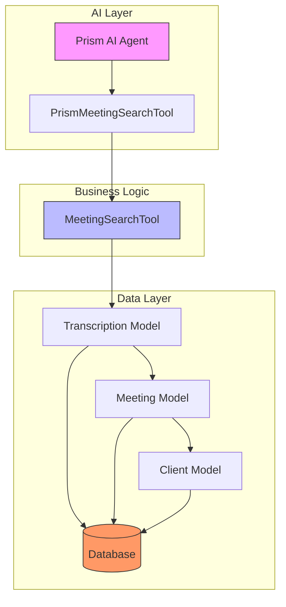
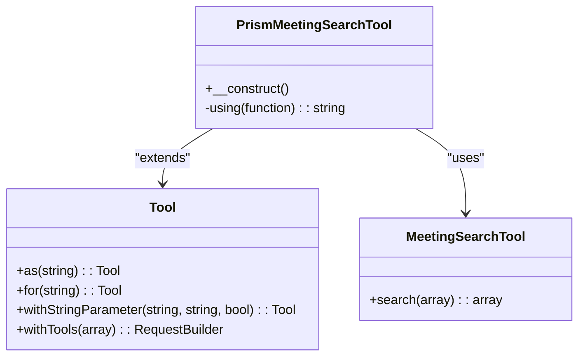
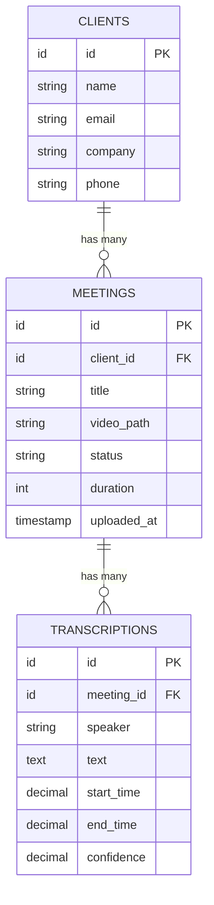
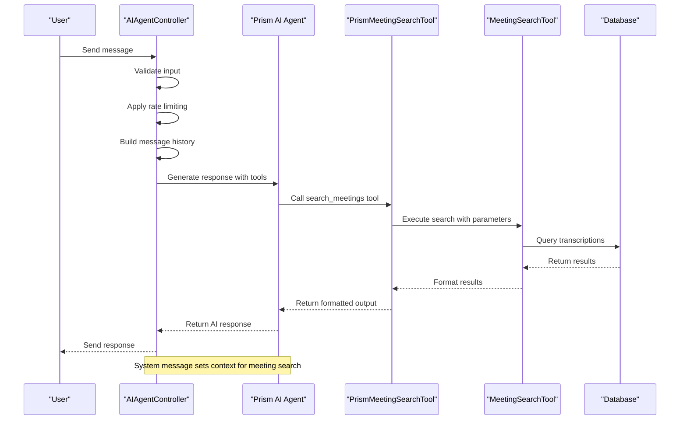
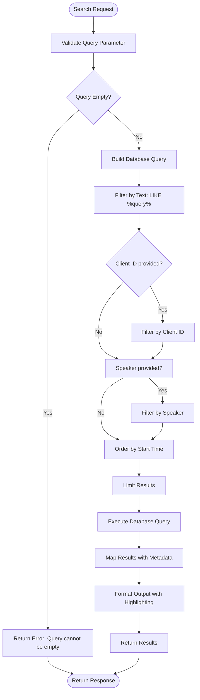
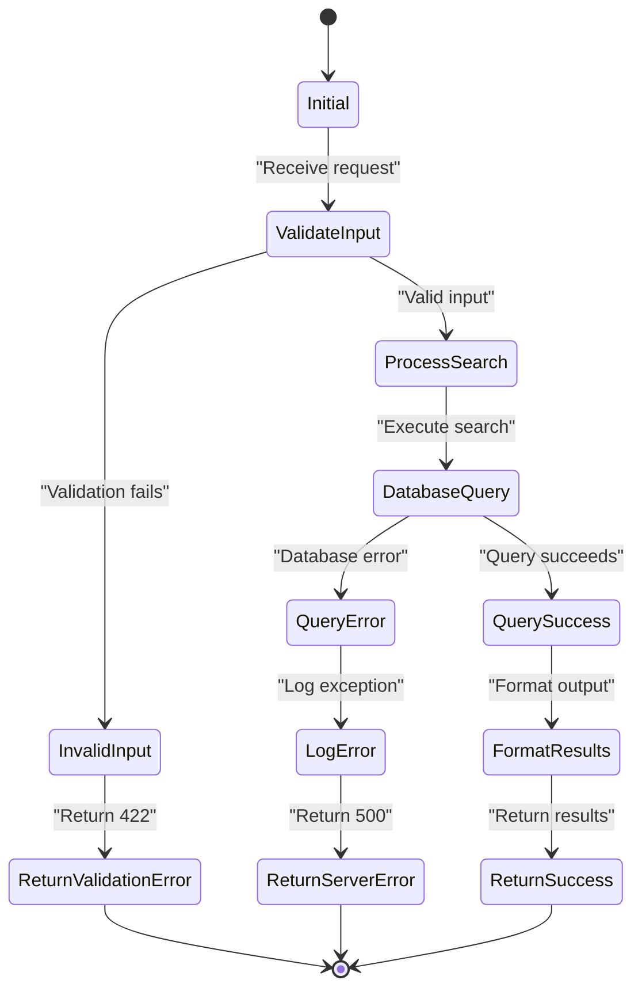

# MeetingSearchTool Functionality


## Table of Contents
1. [Introduction](#introduction)
2. [Core Architecture](#core-architecture)
3. [MeetingSearchTool Implementation](#meetingsearchtool-implementation)
4. [Prism Integration Layer](#prism-integration-layer)
5. [Database Schema and Indexing](#database-schema-and-indexing)
6. [AI Agent Integration](#ai-agent-integration)
7. [Search Query Processing](#search-query-processing)
8. [Result Formatting and Output](#result-formatting-and-output)
9. [Error Handling and Validation](#error-handling-and-validation)
10. [Performance Considerations](#performance-considerations)

## Introduction
The MeetingSearchTool class provides natural language search capabilities over meeting transcription data, enabling AI agents to retrieve specific content from recorded meetings. This document details the implementation, integration, and operational characteristics of the search functionality within the meetingAI platform. The tool allows users to search transcriptions by keyword, filter by client or speaker, and retrieve contextually relevant excerpts with metadata including timestamps and speaker information.

**Section sources**
- [MeetingSearchTool.php](file://app/Tools/MeetingSearchTool.php#L1-L85)

## Core Architecture
The search functionality is implemented as a layered architecture with distinct components for business logic, AI integration, and database access. The MeetingSearchTool handles core search operations, while PrismMeetingSearchTool adapts this functionality for AI agent consumption. The system integrates with Laravel's Eloquent ORM for database operations and leverages the Prism framework for AI tool integration.





**Diagram sources**
- [MeetingSearchTool.php](file://app/Tools/MeetingSearchTool.php#L1-L85)
- [PrismMeetingSearchTool.php](file://app/Tools/PrismMeetingSearchTool.php#L1-L49)

## MeetingSearchTool Implementation
The MeetingSearchTool class provides a static search method that accepts search parameters and returns formatted results. It implements full-text search using SQL LIKE operations on transcription text, with filtering capabilities for client context and speaker identification.


```php
public static function search(array $parameters): array
{
    $query = $parameters['query'] ?? '';
    $clientId = $parameters['client_id'] ?? null;
    $speaker = $parameters['speaker'] ?? null;
    $limit = $parameters['limit'] ?? 10;

    if (empty($query)) {
        return [
            'error' => 'Search query cannot be empty'
        ];
    }

    try {
        $results = Transcription::query()
            ->with(['meeting.client'])
            ->where('text', 'like', "%{$query}%")
            ->when($clientId, function ($q) use ($clientId) {
                return $q->whereHas('meeting', function ($q) use ($clientId) {
                    $q->where('client_id', $clientId);
                });
            })
            ->when($speaker, function ($q) use ($speaker) {
                return $q->where('speaker', 'like', "%{$speaker}%");
            })
            ->orderBy('start_time', 'asc')
            ->limit($limit)
            ->get()
            // ... mapping logic
    }
}
```


The tool uses Laravel's query builder with eager loading to minimize database queries and includes error handling for database exceptions. Results are mapped to include meeting metadata, client information, and formatted timestamps.

**Section sources**
- [MeetingSearchTool.php](file://app/Tools/MeetingSearchTool.php#L1-L85)

## Prism Integration Layer
The PrismMeetingSearchTool class wraps the MeetingSearchTool functionality for integration with the Prism AI agent framework. It defines a tool interface with parameter schema and handles type conversion and validation.





**Diagram sources**
- [PrismMeetingSearchTool.php](file://app/Tools/PrismMeetingSearchTool.php#L1-L49)

The integration layer defines the following parameters:
- **query**: Required string parameter for the search term
- **client_id**: Optional integer parameter to filter by client
- **speaker**: Optional string parameter to filter by speaker name
- **limit**: Optional integer parameter to control result count (1-50)

The tool validates and sanitizes input parameters, converting numeric strings to integers and enforcing limits on the result count.

**Section sources**
- [PrismMeetingSearchTool.php](file://app/Tools/PrismMeetingSearchTool.php#L1-L49)

## Database Schema and Indexing
The search functionality relies on a well-structured database schema with appropriate indexing for performance. The core tables include transcriptions, meetings, and clients with defined relationships.





**Diagram sources**
- [2025_08_10_135210_create_transcriptions_table.php](file://database/migrations/2025_08_10_135210_create_transcriptions_table.php#L1-L38)
- [2025_08_10_135205_create_meetings_table.php](file://database/migrations/2025_08_10_135205_create_meetings_table.php#L1-L40)
- [2025_08_10_135157_create_clients_table.php](file://database/migrations/2025_08_10_135157_create_clients_table.php#L1-L31)

Key schema details:
- Transcriptions table has a foreign key to meetings with cascade delete
- Meetings table has a foreign key to clients with cascade delete
- Indexes are defined on `meeting_id`, `start_time`, and `client_id` for query performance
- The text field uses TEXT type to accommodate long transcription segments
- Start and end times use decimal with millisecond precision (10,3)

**Section sources**
- [2025_08_10_135210_create_transcriptions_table.php](file://database/migrations/2025_08_10_135210_create_transcriptions_table.php#L1-L38)
- [2025_08_10_135205_create_meetings_table.php](file://database/migrations/2025_08_10_135205_create_meetings_table.php#L1-L40)

## AI Agent Integration
The MeetingSearchTool is integrated into the AI system through the AIAgentController, which handles chat requests and orchestrates tool usage. The controller configures the Prism agent with the search tool and manages the conversation flow.





**Diagram sources**
- [AIAgentController.php](file://app/Http/Controllers/AIAgentController.php#L1-L182)
- [PrismMeetingSearchTool.php](file://app/Tools/PrismMeetingSearchTool.php#L1-L49)

The integration includes:
- Rate limiting (10 requests per minute per IP)
- Input validation for message length and conversation history
- System message to guide AI behavior and tool usage
- Error handling with specific responses for timeout, rate limit, and network errors
- Logging of successful requests and errors for monitoring

**Section sources**
- [AIAgentController.php](file://app/Http/Controllers/AIAgentController.php#L1-L182)

## Search Query Processing
The search functionality processes queries through a multi-step pipeline that includes parameter validation, database querying, and result transformation.





**Diagram sources**
- [MeetingSearchTool.php](file://app/Tools/MeetingSearchTool.php#L1-L85)

The query processing includes:
- Eager loading of meeting and client relationships to prevent N+1 queries
- Conditional filtering using Laravel's `when()` method
- Case-insensitive text search using SQL LIKE with wildcards
- Ascending order by start time to maintain chronological context
- Result limiting to prevent excessive data retrieval

**Section sources**
- [MeetingSearchTool.php](file://app/Tools/MeetingSearchTool.php#L1-L85)

## Result Formatting and Output
Search results are formatted to provide rich context for both AI consumption and direct API usage. The output includes metadata, formatted timestamps, and highlighted search terms.


```php
return [
    'meeting_id' => $transcription->meeting->id,
    'meeting_title' => $transcription->meeting->title,
    'client_name' => $transcription->meeting->client->name,
    'speaker' => $transcription->speaker,
    'text' => $highlightedText,
    'timestamp' => (float) $transcription->start_time,
    'formatted_timestamp' => self::formatTimestamp($transcription->start_time),
    'confidence' => $transcription->confidence,
    'meeting_url' => route('meetings.show', $transcription->meeting->id)
];
```


The formatting includes:
- **Highlighted text**: Search terms are wrapped in `**` for emphasis
- **Formatted timestamp**: Converted to HH:MM:SS or MM:SS format
- **Confidence score**: Speech recognition confidence level
- **Direct meeting link**: URL to view the meeting with timestamp anchor
- **Client context**: Client name for organizational context

The final output structure provides:
- Results array with formatted excerpts
- Total count of results found
- Original search parameters for context
- Error information if the search failed

**Section sources**
- [MeetingSearchTool.php](file://app/Tools/MeetingSearchTool.php#L1-L85)

## Error Handling and Validation
The search system implements comprehensive error handling at multiple levels to ensure reliability and provide meaningful feedback.





**Diagram sources**
- [MeetingSearchTool.php](file://app/Tools/MeetingSearchTool.php#L1-L85)
- [AIAgentController.php](file://app/Http/Controllers/AIAgentController.php#L1-L182)

Error handling strategies include:
- **Input validation**: Empty query check in MeetingSearchTool
- **Database exception handling**: Try-catch block around query execution
- **Type validation**: Numeric conversion and range checking in Prism wrapper
- **HTTP validation**: Request validation in AIAgentController
- **Rate limiting**: IP-based request limiting to prevent abuse
- **Graceful degradation**: Specific error messages for different failure modes

The system returns structured error responses with appropriate HTTP status codes and user-friendly messages.

**Section sources**
- [MeetingSearchTool.php](file://app/Tools/MeetingSearchTool.php#L1-L85)
- [AIAgentController.php](file://app/Http/Controllers/AIAgentController.php#L1-L182)

## Performance Considerations
The search implementation includes several performance optimizations to handle large transcription datasets efficiently.

**Query Optimization**
- Eager loading of relationships to prevent N+1 query problems
- Index usage on frequently queried columns (meeting_id, start_time, client_id)
- Result limiting to control data transfer size
- Selective field retrieval through model mapping

**Indexing Strategy**
The database schema includes the following indexes:
- `meeting_id` index on transcriptions table for join performance
- `start_time` index for chronological ordering
- `client_id` index on meetings table for client-based filtering
- Foreign key constraints with cascade delete for data integrity

**Limitations**
- **Full-text search**: The system uses LIKE queries rather than full-text search, which may impact performance with large datasets
- **No embedding-based retrieval**: The current implementation does not use semantic search or vector embeddings
- **SQLite limitations**: The note in the migration indicates SQLite is used, which lacks full-text indexing capabilities
- **Linear text matching**: Search is based on exact substring matching rather than semantic similarity

**Optimization Recommendations**
1. Implement database-level full-text search when migrating to MySQL or PostgreSQL
2. Add composite indexes for common query patterns (e.g., meeting_id + start_time)
3. Consider caching frequent search queries
4. Implement pagination instead of simple limits for large result sets
5. Add text normalization (lowercase, stemming) for more robust matching

The current implementation provides acceptable performance for moderate datasets but may require enhancement for larger-scale deployments.

**Section sources**
- [2025_08_10_135210_create_transcriptions_table.php](file://database/migrations/2025_08_10_135210_create_transcriptions_table.php#L1-L38)
- [MeetingSearchTool.php](file://app/Tools/MeetingSearchTool.php#L1-L85)

**Referenced Files in This Document**   
- [MeetingSearchTool.php](file://app/Tools/MeetingSearchTool.php#L1-L85)
- [PrismMeetingSearchTool.php](file://app/Tools/PrismMeetingSearchTool.php#L1-L49)
- [AIAgentController.php](file://app/Http/Controllers/AIAgentController.php#L1-L182)
- [2025_08_10_135210_create_transcriptions_table.php](file://database/migrations/2025_08_10_135210_create_transcriptions_table.php#L1-L38)
- [2025_08_10_135205_create_meetings_table.php](file://database/migrations/2025_08_10_135205_create_meetings_table.php#L1-L40)
- [2025_08_10_135157_create_clients_table.php](file://database/migrations/2025_08_10_135157_create_clients_table.php#L1-L31)
- [index.ts](file://resources/js/types/index.ts#L0-L38)