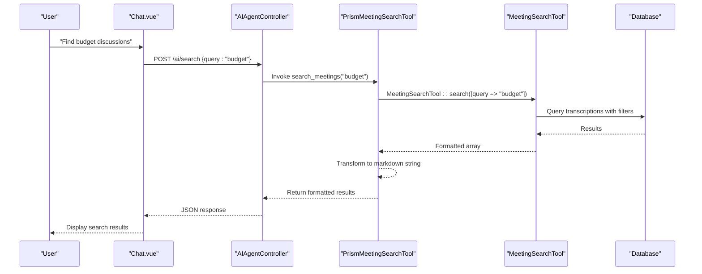
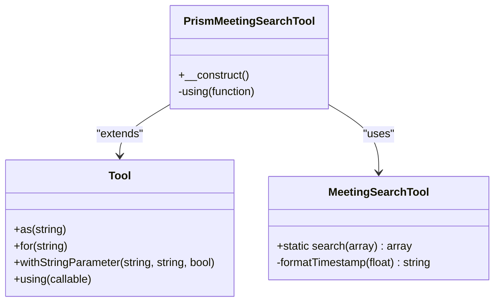
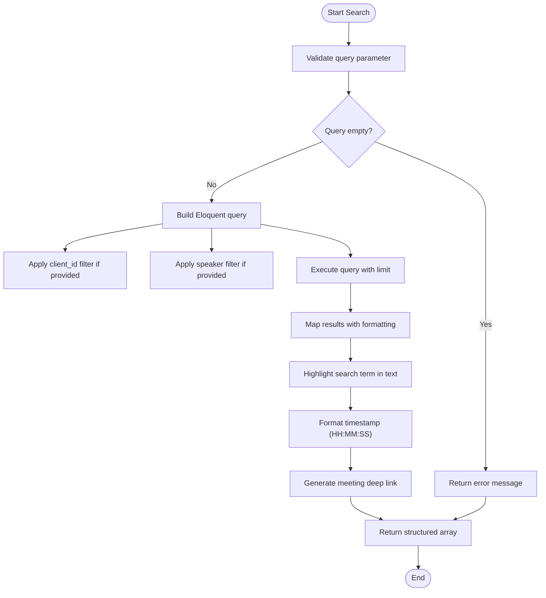
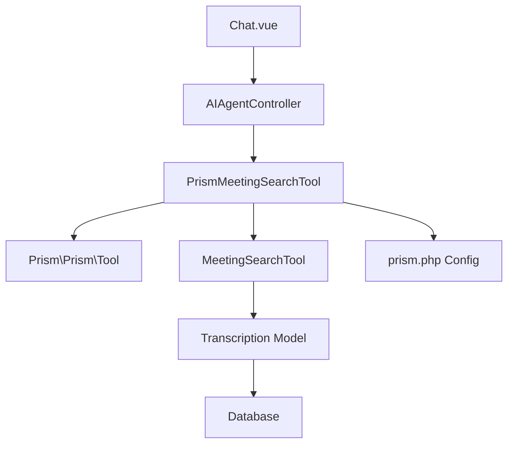

# PrismMeetingSearchTool Extension


## Table of Contents
1. [Introduction](#introduction)
2. [Project Structure](#project-structure)
3. [Core Components](#core-components)
4. [Architecture Overview](#architecture-overview)
5. [Detailed Component Analysis](#detailed-component-analysis)
6. [Dependency Analysis](#dependency-analysis)
7. [Performance Considerations](#performance-considerations)
8. [Troubleshooting Guide](#troubleshooting-guide)
9. [Conclusion](#conclusion)

## Introduction
The **PrismMeetingSearchTool** is a specialized extension of the core **MeetingSearchTool**, designed to enhance integration with the **Prism AI agent framework**. It enables AI-driven search capabilities across meeting transcriptions by enriching results with structured metadata and formatting optimized for OpenRouter API consumption. This document details its implementation, configuration, and operational advantages over the base tool.

## Project Structure
The application follows a Laravel-based MVC architecture with a clear separation between AI tooling, business logic, and frontend interfaces. The **PrismMeetingSearchTool** resides in the `app/Tools` directory alongside its parent class, while configuration is managed via the `config/prism.php` file.


```mermaid
graph TB
subgraph "Tools"
A[PrismMeetingSearchTool]
B[MeetingSearchTool]
end
subgraph "Configuration"
C[prism.php]
D[OpenRouter API Settings]
end
subgraph "Frontend"
E[Chat.vue]
end
subgraph "Controllers"
F[AIAgentController]
end
A --> B : "extends"
A --> C : "uses config"
F --> A : "invokes tool"
E --> F : "sends queries"
```


**Diagram sources**
- [PrismMeetingSearchTool.php](file://app/Tools/PrismMeetingSearchTool.php#L1-L50)
- [MeetingSearchTool.php](file://app/Tools/MeetingSearchTool.php#L1-L86)
- [prism.php](file://config/prism.php#L1-L56)
- [AIAgentController.php](file://app/Http/Controllers/AIAgentController.php#L1-L100)
- [Chat.vue](file://resources/js/pages/AI/Chat.vue#L1-L200)

**Section sources**
- [PrismMeetingSearchTool.php](file://app/Tools/PrismMeetingSearchTool.php#L1-L50)
- [MeetingSearchTool.php](file://app/Tools/MeetingSearchTool.php#L1-L86)

## Core Components
The **PrismMeetingSearchTool** extends the **Prism\Prism\Tool** class to register itself as an AI-accessible function. It wraps the static **MeetingSearchTool::search()** method, transforming its structured array output into a formatted string optimized for AI agent consumption.

Key responsibilities:
- Parameter validation and type casting
- Error handling with user-friendly messages
- Result formatting with markdown and hyperlinks
- Integration with Prism AI agent via tool registration

**Section sources**
- [PrismMeetingSearchTool.php](file://app/Tools/PrismMeetingSearchTool.php#L1-L50)
- [MeetingSearchTool.php](file://app/Tools/MeetingSearchTool.php#L1-L86)

## Architecture Overview
The **PrismMeetingSearchTool** acts as a bridge between the AI agent framework and the underlying meeting search functionality. It leverages the **Prism PHP** package to expose search capabilities as a callable tool, while using configuration from **prism.php** to connect to external AI providers like OpenRouter.





**Diagram sources**
- [PrismMeetingSearchTool.php](file://app/Tools/PrismMeetingSearchTool.php#L1-L50)
- [MeetingSearchTool.php](file://app/Tools/MeetingSearchTool.php#L1-L86)
- [AIAgentController.php](file://app/Http/Controllers/AIAgentController.php#L1-L100)
- [Chat.vue](file://resources/js/pages/AI/Chat.vue#L1-L200)

## Detailed Component Analysis

### PrismMeetingSearchTool Implementation
The **PrismMeetingSearchTool** class extends **Prism\Prism\Tool** and configures itself during construction with specific parameters and execution logic.

#### Class Diagram




**Diagram sources**
- [PrismMeetingSearchTool.php](file://app/Tools/PrismMeetingSearchTool.php#L1-L50)
- [MeetingSearchTool.php](file://app/Tools/MeetingSearchTool.php#L1-L86)

#### Key Implementation Details
- **Tool Registration**: Registers as `search_meetings` with descriptive metadata
- **Parameter Configuration**: Defines `query` (required), `client_id`, `speaker`, and `limit` (optional)
- **Execution Logic**: Uses a closure to process search parameters and format results
- **Type Safety**: Casts `client_id` and `limit` to integers with bounds checking
- **Result Formatting**: Returns markdown-formatted string with bold titles, speaker info, and deep links

**Section sources**
- [PrismMeetingSearchTool.php](file://app/Tools/PrismMeetingSearchTool.php#L1-L50)

### MeetingSearchTool Core Functionality
The base **MeetingSearchTool** provides the actual database search logic using Laravel's Eloquent ORM.

#### Search Algorithm Flowchart




**Diagram sources**
- [MeetingSearchTool.php](file://app/Tools/MeetingSearchTool.php#L1-L86)

#### Key Features
- **Eager Loading**: Uses `with(['meeting.client'])` to prevent N+1 queries
- **Conditional Filtering**: Uses `when()` for optional client and speaker filters
- **Text Highlighting**: Wraps search terms in `**` for markdown rendering
- **Error Handling**: Catches exceptions and returns structured error arrays
- **Timestamp Formatting**: Converts seconds to HH:MM:SS format

**Section sources**
- [MeetingSearchTool.php](file://app/Tools/MeetingSearchTool.php#L1-L86)

## Dependency Analysis
The **PrismMeetingSearchTool** depends on several components across the application:





**Diagram sources**
- [PrismMeetingSearchTool.php](file://app/Tools/PrismMeetingSearchTool.php#L1-L50)
- [MeetingSearchTool.php](file://app/Tools/MeetingSearchTool.php#L1-L86)
- [prism.php](file://config/prism.php#L1-L56)
- [AIAgentController.php](file://app/Http/Controllers/AIAgentController.php#L1-L100)
- [Chat.vue](file://resources/js/pages/AI/Chat.vue#L1-L200)

## Performance Considerations
- **Query Optimization**: The base **MeetingSearchTool** uses database-level filtering and limits
- **Caching Opportunity**: Results could be cached based on query parameters
- **Limit Enforcement**: Maximum limit capped at 50 results to prevent performance issues
- **Text Search**: Uses `LIKE` operator which may benefit from full-text indexing
- **Memory Usage**: Results are processed in memory via `map()` function

## Troubleshooting Guide
Common issues and solutions:

**Empty Query Error**
- **Symptom**: "Search query cannot be empty"
- **Cause**: Query parameter missing or whitespace-only
- **Solution**: Ensure query contains valid search terms

**No Results Found**
- **Symptom**: "No results found for query"
- **Cause**: No matching transcription text
- **Solution**: Verify meeting transcriptions exist and contain relevant content

**Invalid Client ID**
- **Symptom**: Results not filtered by client
- **Cause**: Non-numeric client_id passed
- **Solution**: Pass valid numeric client ID

**Link Generation Failure**
- **Symptom**: Broken deep links in results
- **Cause**: Route name mismatch
- **Solution**: Verify `route('meetings.show', $id)` is correctly defined

**Section sources**
- [PrismMeetingSearchTool.php](file://app/Tools/PrismMeetingSearchTool.php#L1-L50)
- [MeetingSearchTool.php](file://app/Tools/MeetingSearchTool.php#L1-L86)

## Conclusion
The **PrismMeetingSearchTool** effectively extends the base **MeetingSearchTool** to provide AI-optimized search results with enhanced formatting and metadata. Its integration with the Prism framework enables seamless AI agent interactions, while maintaining robust error handling and performance considerations. The tool demonstrates a clean separation of concerns between AI interface and core business logic, making it a maintainable and scalable component of the meeting intelligence system.

**Referenced Files in This Document**   
- [PrismMeetingSearchTool.php](file://app/Tools/PrismMeetingSearchTool.php#L1-L50)
- [MeetingSearchTool.php](file://app/Tools/MeetingSearchTool.php#L1-L86)
- [prism.php](file://config/prism.php#L1-L56)
- [AIAgentController.php](file://app/Http/Controllers/AIAgentController.php#L1-L100)
- [Chat.vue](file://resources/js/pages/AI/Chat.vue#L1-L200)