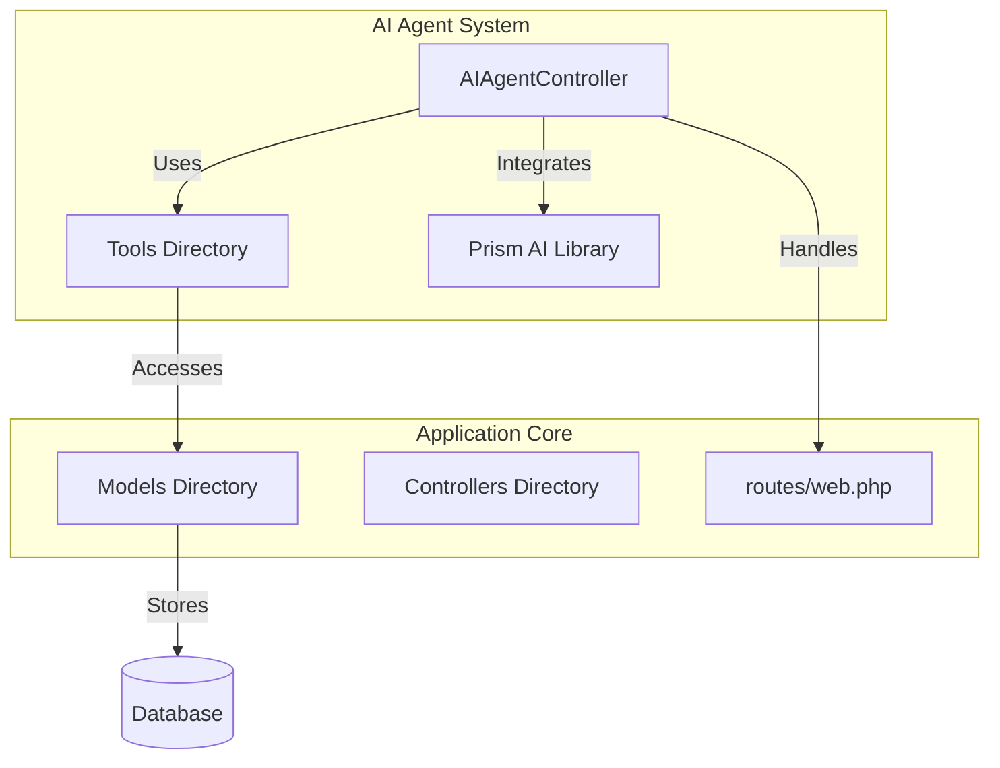
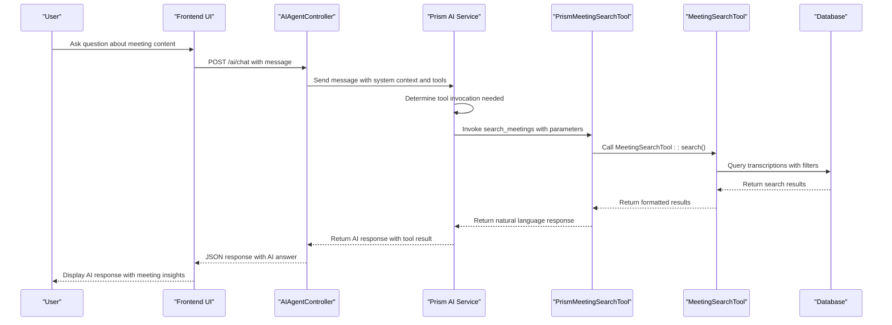
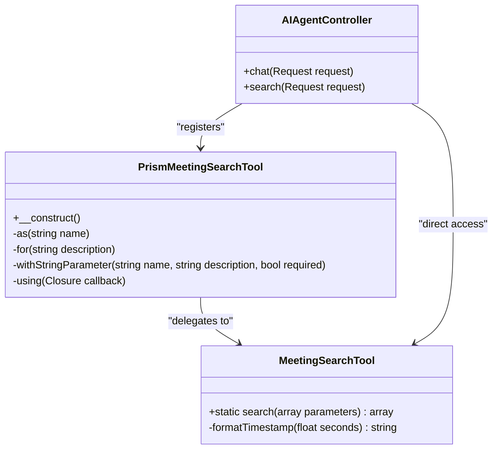
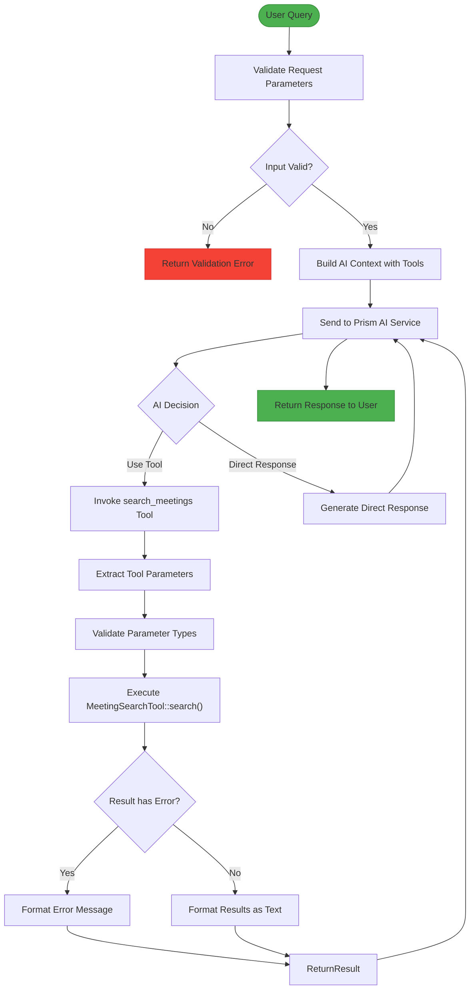
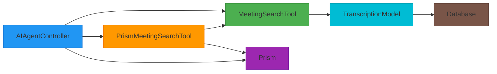

# Tool-Based AI Extension System

## Table of Contents
1. [Introduction](#introduction)
2. [Project Structure](#project-structure)
3. [Core Components](#core-components)
4. [Architecture Overview](#architecture-overview)
5. [Detailed Component Analysis](#detailed-component-analysis)
6. [Dependency Analysis](#dependency-analysis)
7. [Performance Considerations](#performance-considerations)
8. [Troubleshooting Guide](#troubleshooting-guide)
9. [Conclusion](#conclusion)

## Introduction
This document provides comprehensive architectural documentation for the tool-based AI extension system in the meeting transcription platform. The system enables an AI agent to interact with internal application data through a dynamic tool registration and invocation mechanism. The design centers around a contract-based approach where tools define their capabilities, parameters, and execution logic, allowing the AI agent to intelligently select and use appropriate tools based on user queries. This architecture facilitates extensibility, maintainability, and secure access to application data through well-defined interfaces.

## Project Structure
The project follows a Laravel-based MVC architecture with a dedicated Tools directory for AI extension components. The AI agent functionality is implemented through controllers, tools, and external AI service integration via the Prism library. The system separates concerns between tool logic (business operations) and tool interface (AI interaction contract).

**Diagram sources**
- [AIAgentController.php](file://app/Http/Controllers/AIAgentController.php)
- [MeetingSearchTool.php](file://app/Tools/MeetingSearchTool.php)
- [PrismMeetingSearchTool.php](file://app/Tools/PrismMeetingSearchTool.php)
- [web.php](file://routes/web.php)

**Section sources**
- [AIAgentController.php](file://app/Http/Controllers/AIAgentController.php)
- [web.php](file://routes/web.php)

## Core Components
The AI extension system consists of two primary components: the tool implementation (MeetingSearchTool) and the tool interface (PrismMeetingSearchTool). The MeetingSearchTool contains the business logic for searching meeting transcriptions, while the PrismMeetingSearchTool wraps this logic with an AI-friendly interface that defines the tool contract, including name, description, parameters, and response format. The AIAgentController orchestrates the interaction between user requests, the AI service, and registered tools.

**Section sources**
- [MeetingSearchTool.php](file://app/Tools/MeetingSearchTool.php)
- [PrismMeetingSearchTool.php](file://app/Tools/PrismMeetingSearchTool.php)
- [AIAgentController.php](file://app/Http/Controllers/AIAgentController.php)

## Architecture Overview
The tool-based extension system follows a wrapper pattern where domain-specific tools are wrapped with AI interaction contracts. When a user query requires data access, the AI service identifies the appropriate tool to invoke based on the tool's description and parameter schema. The system then executes the tool with validated parameters and returns formatted results to the AI service for natural language response generation.

**Diagram sources**
- [AIAgentController.php](file://app/Http/Controllers/AIAgentController.php#L40-L182)
- [PrismMeetingSearchTool.php](file://app/Tools/PrismMeetingSearchTool.php#L10-L50)
- [MeetingSearchTool.php](file://app/Tools/MeetingSearchTool.php#L10-L85)

## Detailed Component Analysis

### Tool Interface and Contract Analysis
The system implements a two-layer tool architecture where the interface layer (PrismMeetingSearchTool) defines the contract for AI interaction, and the implementation layer (MeetingSearchTool) contains the business logic. This separation allows for flexible tool design and easy maintenance.

**Diagram sources**
- [PrismMeetingSearchTool.php](file://app/Tools/PrismMeetingSearchTool.php#L10-L50)
- [MeetingSearchTool.php](file://app/Tools/MeetingSearchTool.php#L10-L85)
- [AIAgentController.php](file://app/Http/Controllers/AIAgentController.php#L10-L40)

**Section sources**
- [PrismMeetingSearchTool.php](file://app/Tools/PrismMeetingSearchTool.php)
- [MeetingSearchTool.php](file://app/Tools/MeetingSearchTool.php)

### Tool Registration and Invocation Flow
The system follows a specific workflow for tool discovery, validation, and execution. When a user submits a query, the AI agent evaluates whether existing tools can fulfill the request based on the tool descriptions and parameter requirements.

**Diagram sources**
- [AIAgentController.php](file://app/Http/Controllers/AIAgentController.php#L40-L182)
- [PrismMeetingSearchTool.php](file://app/Tools/PrismMeetingSearchTool.php#L10-L50)

**Section sources**
- [AIAgentController.php](file://app/Http/Controllers/AIAgentController.php)
- [PrismMeetingSearchTool.php](file://app/Tools/PrismMeetingSearchTool.php)

## Dependency Analysis
The tool-based extension system has a clear dependency hierarchy that ensures separation of concerns while enabling seamless integration between components. The architecture follows dependency inversion principles where higher-level modules define interfaces that lower-level modules implement.

**Diagram sources**
- [AIAgentController.php](file://app/Http/Controllers/AIAgentController.php)
- [PrismMeetingSearchTool.php](file://app/Tools/PrismMeetingSearchTool.php)
- [MeetingSearchTool.php](file://app/Tools/MeetingSearchTool.php)

**Section sources**
- [AIAgentController.php](file://app/Http/Controllers/AIAgentController.php)
- [PrismMeetingSearchTool.php](file://app/Tools/PrismMeetingSearchTool.php)
- [MeetingSearchTool.php](file://app/Tools/MeetingSearchTool.php)

## Performance Considerations
The system incorporates several performance optimizations to ensure responsive AI interactions. The tool execution includes parameter validation and type casting to prevent unnecessary database queries. The search functionality implements query limiting and proper indexing through Eloquent's query builder. Rate limiting is applied at the controller level to prevent abuse of the AI service. Error handling is designed to provide meaningful feedback without exposing sensitive system information.

## Troubleshooting Guide
Common issues in the tool-based extension system typically involve parameter validation, tool registration, or database query performance. The system logs both successful and failed AI interactions for monitoring and debugging purposes.

**Section sources**
- [AIAgentController.php](file://app/Http/Controllers/AIAgentController.php#L100-L182)
- [MeetingSearchTool.php](file://app/Tools/MeetingSearchTool.php#L10-L85)

## Conclusion
The tool-based AI extension system provides a robust framework for integrating AI capabilities with internal application data. By separating tool interface from implementation, the system achieves flexibility and maintainability. The contract-based approach with well-defined parameter schemas enables reliable tool discovery and invocation by the AI agent. Security is maintained through parameter validation and error handling, while performance is optimized through query limiting and rate limiting. This architecture can be easily extended to support additional tools for various business domains by following the established pattern of interface wrapper and implementation class.

**Referenced Files in This Document**   
- [MeetingSearchTool.php](file://app/Tools/MeetingSearchTool.php)
- [PrismMeetingSearchTool.php](file://app/Tools/PrismMeetingSearchTool.php)
- [AIAgentController.php](file://app/Http/Controllers/AIAgentController.php)
- [web.php](file://routes/web.php)