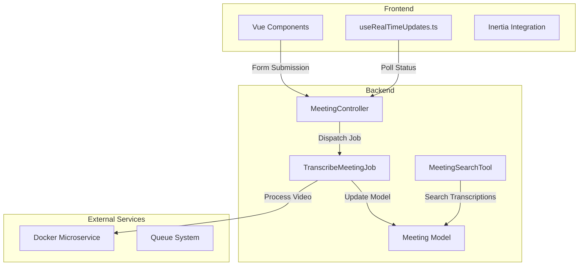
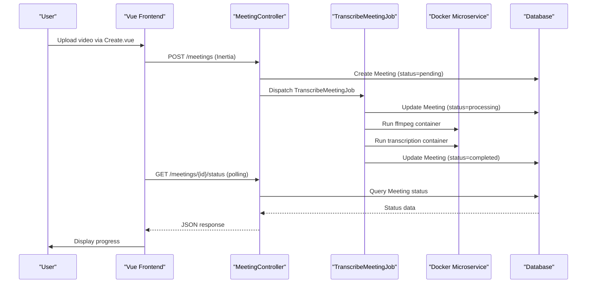
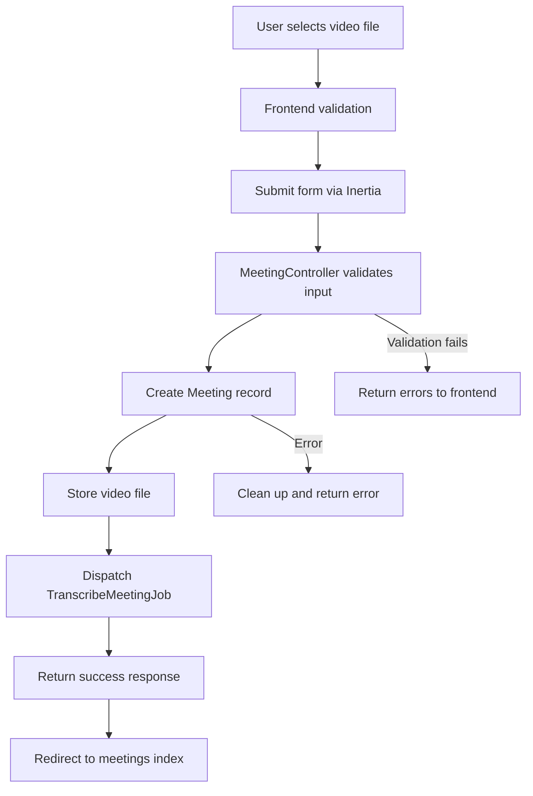
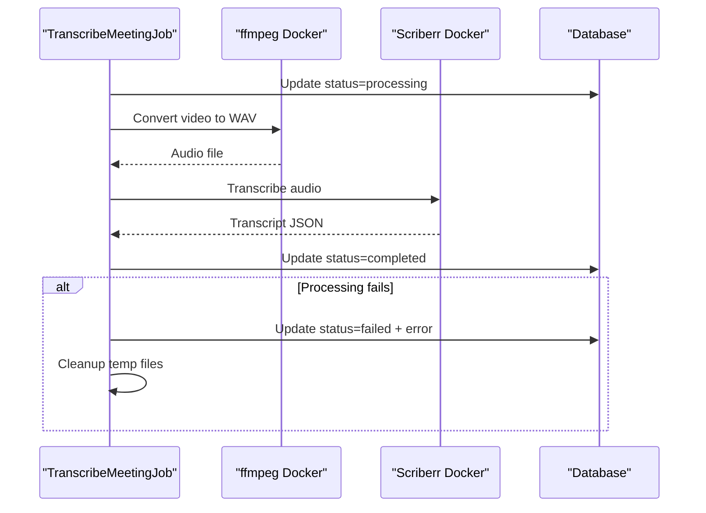
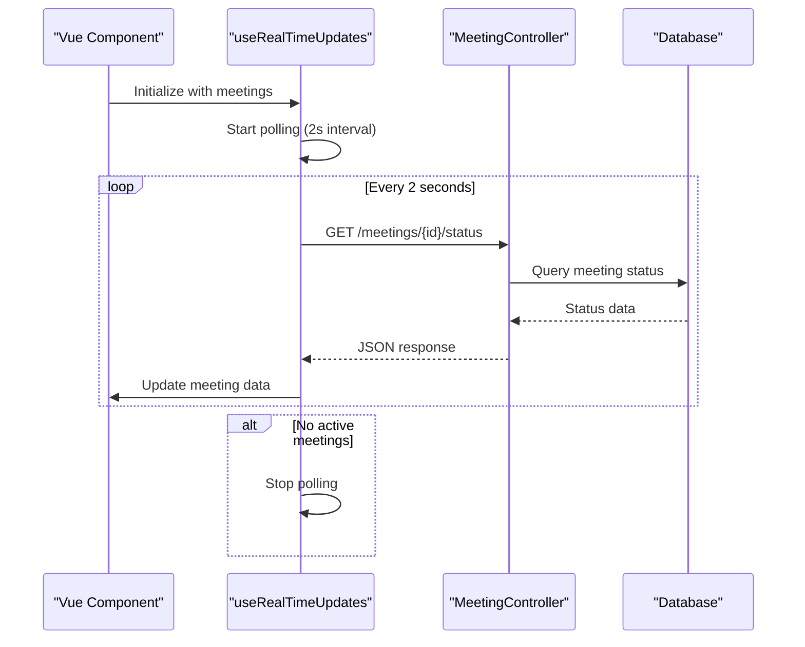
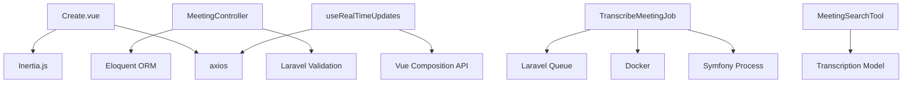

# Data Flow and Integration


## Table of Contents
1. [Introduction](#introduction)
2. [Project Structure](#project-structure)
3. [Core Components](#core-components)
4. [Architecture Overview](#architecture-overview)
5. [Detailed Component Analysis](#detailed-component-analysis)
6. [Dependency Analysis](#dependency-analysis)
7. [Performance Considerations](#performance-considerations)
8. [Troubleshooting Guide](#troubleshooting-guide)
9. [Conclusion](#conclusion)

## Introduction
This document provides a comprehensive analysis of the end-to-end data flow in the meetingai application, tracing the journey of a meeting from video upload to AI-powered search functionality. The system follows a well-defined workflow where user-uploaded videos are processed through a series of orchestrated steps involving Laravel backend services, queue-based job processing, Docker microservices, and Vue.js frontend components. The architecture emphasizes data consistency, error handling, and real-time user feedback through polling mechanisms. This documentation maps the complete integration points between frontend and backend components, details the data model relationships, and illustrates how AI capabilities are enabled once transcriptions are completed.

## Project Structure
The meetingai application follows a standard Laravel directory structure with clear separation between backend logic in PHP and frontend components in TypeScript/Vue.js. The backend resides in the `app/` directory with controllers, jobs, and models organized in their respective subdirectories. Frontend components are located in `resources/js/` with Vue components organized by feature in the `pages/` directory and shared utilities in the `lib/` directory. The application uses Inertia.js for seamless integration between Laravel and Vue.js, allowing server-side rendering with dynamic frontend interactivity. Key directories include `app/Jobs` for asynchronous processing, `app/Tools` for AI integration, and `transcribe-microservice` for the Docker-based transcription service.





**Diagram sources**
- [MeetingController.php](file://app/Http/Controllers/MeetingController.php#L76-L175)
- [TranscribeMeetingJob.php](file://app/Jobs/TranscribeMeetingJob.php#L31-L278)
- [useRealTimeUpdates.ts](file://resources/js/lib/useRealTimeUpdates.ts#L0-L87)
- [MeetingSearchTool.php](file://app/Tools/MeetingSearchTool.php#L0-L85)
- [Meeting.php](file://app/Models/Meeting.php#L0-L178)

**Section sources**
- [MeetingController.php](file://app/Http/Controllers/MeetingController.php#L76-L175)
- [TranscribeMeetingJob.php](file://app/Jobs/TranscribeMeetingJob.php#L31-L278)
- [useRealTimeUpdates.ts](file://resources/js/lib/useRealTimeUpdates.ts#L0-L87)

## Core Components
The core components of the meetingai application include the MeetingController which handles HTTP requests for meeting management, the TranscribeMeetingJob which processes videos asynchronously, the Meeting model which represents the primary data entity, and the useRealTimeUpdates composable which enables frontend status polling. The MeetingSearchTool provides AI-powered search capabilities over completed transcriptions. These components work together to create a seamless workflow from video upload to searchable content. The system uses Laravel's queue system to handle long-running transcription tasks, ensuring the main application remains responsive. Data relationships are clearly defined with Meeting belonging to Client and having one or more Transcription records.

**Section sources**
- [MeetingController.php](file://app/Http/Controllers/MeetingController.php#L76-L175)
- [TranscribeMeetingJob.php](file://app/Jobs/TranscribeMeetingJob.php#L31-L278)
- [Meeting.php](file://app/Models/Meeting.php#L0-L178)
- [Transcription.php](file://app/Models/Transcription.php#L0-L50)
- [MeetingSearchTool.php](file://app/Tools/MeetingSearchTool.php#L0-L85)

## Architecture Overview
The meetingai application follows a layered architecture with clear separation between presentation, application logic, and data processing layers. The frontend Vue.js components communicate with Laravel controllers through Inertia.js, which handles both server-side rendering and API-like interactions. When a user uploads a meeting video, the MeetingController creates a Meeting record and dispatches a TranscribeMeetingJob to the queue. This job is processed by a worker that uses Docker containers to extract audio and generate transcriptions. The frontend uses the useRealTimeUpdates composable to poll for status changes every 2 seconds, providing real-time feedback to users. Once processing is complete, the AI agent can search through transcriptions using the MeetingSearchTool. The architecture is designed for eventual consistency, with the system state converging as processing completes.





**Diagram sources**
- [MeetingController.php](file://app/Http/Controllers/MeetingController.php#L76-L175)
- [TranscribeMeetingJob.php](file://app/Jobs/TranscribeMeetingJob.php#L31-L278)
- [useRealTimeUpdates.ts](file://resources/js/lib/useRealTimeUpdates.ts#L0-L87)
- [Meeting.php](file://app/Models/Meeting.php#L0-L178)

## Detailed Component Analysis

### Meeting Upload and Creation
The meeting upload process begins with the Create.vue component in the frontend, which provides a form for users to upload video files. When the form is submitted, it sends a POST request to the MeetingController's store method via Inertia.js. The controller validates the input, creates a Meeting record with 'pending' status, stores the video file in the public storage disk, and dispatches the TranscribeMeetingJob. The Meeting model includes attributes for tracking processing status, timestamps, and error information. The system estimates processing time based on video duration to provide users with expected wait times.





**Diagram sources**
- [Create.vue](file://resources/js/pages/Meetings/Create.vue#L215-L355)
- [MeetingController.php](file://app/Http/Controllers/MeetingController.php#L76-L175)
- [Meeting.php](file://app/Models/Meeting.php#L0-L178)

**Section sources**
- [Create.vue](file://resources/js/pages/Meetings/Create.vue#L215-L355)
- [MeetingController.php](file://app/Http/Controllers/MeetingController.php#L76-L175)

### Transcription Processing Pipeline
The TranscribeMeetingJob implements the core processing pipeline for meeting videos. When executed, it updates the Meeting status to 'processing', extracts audio from the video using ffmpeg in a Docker container, and then transcribes the audio using a specialized transcription microservice. The job handles errors gracefully, updating the Meeting record with error messages if processing fails. The system uses Laravel's queue system with retry logic (3 attempts) and a 1-hour timeout. The job also calculates CPU threads available on the host to optimize transcription performance. Upon completion, the Meeting status is updated to 'completed', enabling AI search functionality.





**Diagram sources**
- [TranscribeMeetingJob.php](file://app/Jobs/TranscribeMeetingJob.php#L31-L278)
- [Meeting.php](file://app/Models/Meeting.php#L0-L178)

**Section sources**
- [TranscribeMeetingJob.php](file://app/Jobs/TranscribeMeetingJob.php#L31-L278)

### Real-Time Status Updates
The frontend implements real-time status updates using the useRealTimeUpdates composable, which polls the server every 2 seconds for meeting status changes. This composable accepts an array of meetings and returns a reactive reference that automatically updates when status changes are detected. The polling only occurs for meetings with 'pending' or 'processing' status, optimizing network usage. The MeetingController provides a dedicated status endpoint that returns comprehensive status information including elapsed time, estimated remaining time, and processing progress as a percentage. This enables the frontend to display detailed progress indicators to users.





**Diagram sources**
- [useRealTimeUpdates.ts](file://resources/js/lib/useRealTimeUpdates.ts#L0-L87)
- [web.php](file://routes/web.php#L39-L46)
- [Meeting.php](file://app/Models/Meeting.php#L0-L178)

**Section sources**
- [useRealTimeUpdates.ts](file://resources/js/lib/useRealTimeUpdates.ts#L0-L87)

### AI-Powered Search Functionality
Once a meeting is processed and transcribed, the AI agent can search its content using the MeetingSearchTool. This tool provides a static search method that queries the Transcription model for text matching the search query. Results are enriched with metadata including meeting title, client name, speaker, and timestamp. The search supports filtering by client and speaker, and highlights matching terms in the results. The AI agent controller exposes an API endpoint at POST /ai/search that validates input and returns structured search results. This enables users to ask natural language questions about meeting content through the AI chat interface.


```mermaid
flowchart TD
A[User asks question] --> B[AIAgentController receives query]
B --> C[Validate search parameters]
C --> D[MeetingSearchTool::search()]
D --> E[Query Transcription model]
E --> F[Map results with metadata]
F --> G[Highlight search terms]
G --> H[Return structured results]
H --> I[Display in chat interface]
C --> |Invalid query| J[Return error response]
D --> |Database error| K[Return error response]
```


**Diagram sources**
- [MeetingSearchTool.php](file://app/Tools/MeetingSearchTool.php#L0-L85)
- [web.php](file://routes/web.php#L44-L46)

**Section sources**
- [MeetingSearchTool.php](file://app/Tools/MeetingSearchTool.php#L0-L85)

## Dependency Analysis
The meetingai application has a well-defined dependency structure with clear boundaries between components. The frontend Vue components depend on Inertia.js for server communication and axios for API requests. The backend controllers depend on Laravel's request validation and Eloquent ORM. The TranscribeMeetingJob depends on Symfony's Process component for executing shell commands and Docker for containerized processing. The system uses Laravel's queue system for asynchronous job processing, with jobs depending on the database for state persistence. The MeetingSearchTool depends on the Transcription model for data access. External dependencies include Docker for containerization, ffmpeg for audio processing, and a custom transcription microservice.





**Diagram sources**
- [Create.vue](file://resources/js/pages/Meetings/Create.vue#L215-L355)
- [MeetingController.php](file://app/Http/Controllers/MeetingController.php#L76-L175)
- [TranscribeMeetingJob.php](file://app/Jobs/TranscribeMeetingJob.php#L31-L278)
- [MeetingSearchTool.php](file://app/Tools/MeetingSearchTool.php#L0-L85)
- [useRealTimeUpdates.ts](file://resources/js/lib/useRealTimeUpdates.ts#L0-L87)

**Section sources**
- [Create.vue](file://resources/js/pages/Meetings/Create.vue#L215-L355)
- [MeetingController.php](file://app/Http/Controllers/MeetingController.php#L76-L175)
- [TranscribeMeetingJob.php](file://app/Jobs/TranscribeMeetingJob.php#L31-L278)
- [MeetingSearchTool.php](file://app/Tools/MeetingSearchTool.php#L0-L85)
- [useRealTimeUpdates.ts](file://resources/js/lib/useRealTimeUpdates.ts#L0-L87)

## Performance Considerations
The meetingai application implements several performance optimizations to handle resource-intensive video processing. The transcription job runs asynchronously in the background, preventing blocking of the main application. The system estimates processing time based on video duration to provide users with realistic expectations. The useRealTimeUpdates composable optimizes polling by only checking meetings that are actively processing. The transcription microservice runs in Docker containers, isolating resource usage and allowing for scaling. The database queries for search functionality use indexing on the text column for faster lookups. Error handling includes cleanup of temporary files to prevent disk space issues. The system also implements retry logic with exponential backoff for transient failures.

## Troubleshooting Guide
Common issues in the meetingai application typically relate to file processing, Docker connectivity, or queue processing. If meetings remain in 'pending' status, check that the queue worker is running. If processing fails with Docker errors, verify that Docker is running and accessible. File upload issues may stem from size limits (500MB maximum) or unsupported formats (only MP4, MOV, AVI, WebM). Insufficient disk space can cause processing failures, particularly for large files. The system logs detailed error information in Laravel's log files, including stack traces for debugging. The Meeting model stores both user-friendly error messages and technical error details to aid troubleshooting. Network issues may affect the frontend polling mechanism, but the system gracefully handles failed status updates.

**Section sources**
- [TranscribeMeetingJob.php](file://app/Jobs/TranscribeMeetingJob.php#L278-L320)
- [Meeting.php](file://app/Models/Meeting.php#L0-L178)
- [useRealTimeUpdates.ts](file://resources/js/lib/useRealTimeUpdates.ts#L36-L87)

## Conclusion
The meetingai application demonstrates a robust end-to-end workflow for processing meeting videos and enabling AI-powered search. The architecture effectively separates concerns between frontend and backend components while maintaining seamless integration through Inertia.js. The use of queued jobs and Docker containers allows for scalable processing of resource-intensive tasks. The real-time status updates provide excellent user experience despite the lack of WebSockets, using efficient polling mechanisms. Data consistency is maintained through careful transaction management and error handling. The system's modular design makes it extensible for additional features while the clear data model relationships ensure maintainability. Overall, the implementation balances performance, reliability, and user experience in a comprehensive solution for meeting intelligence.

**Referenced Files in This Document**   
- [MeetingController.php](file://app/Http/Controllers/MeetingController.php#L76-L175)
- [TranscribeMeetingJob.php](file://app/Jobs/TranscribeMeetingJob.php#L31-L278)
- [useRealTimeUpdates.ts](file://resources/js/lib/useRealTimeUpdates.ts#L0-L87)
- [MeetingSearchTool.php](file://app/Tools/MeetingSearchTool.php#L0-L85)
- [Meeting.php](file://app/Models/Meeting.php#L0-L178)
- [Transcription.php](file://app/Models/Transcription.php#L0-L50)
- [web.php](file://routes/web.php#L39-L46)
- [Create.vue](file://resources/js/pages/Meetings/Create.vue#L215-L355)