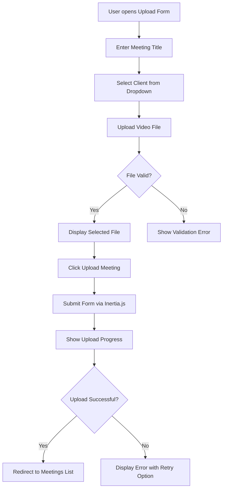
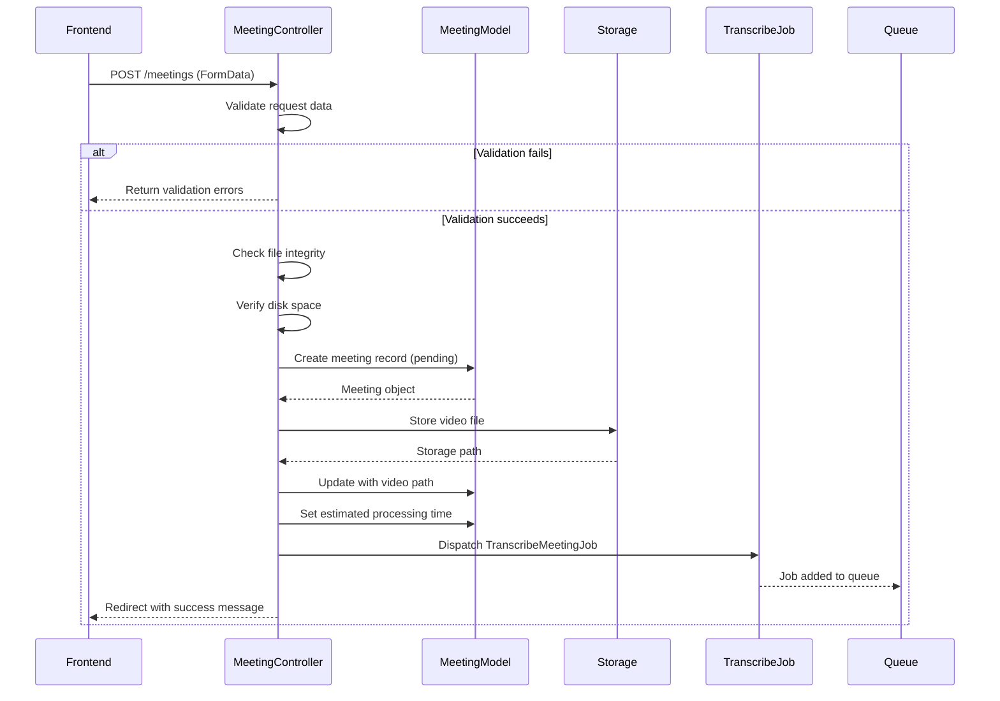
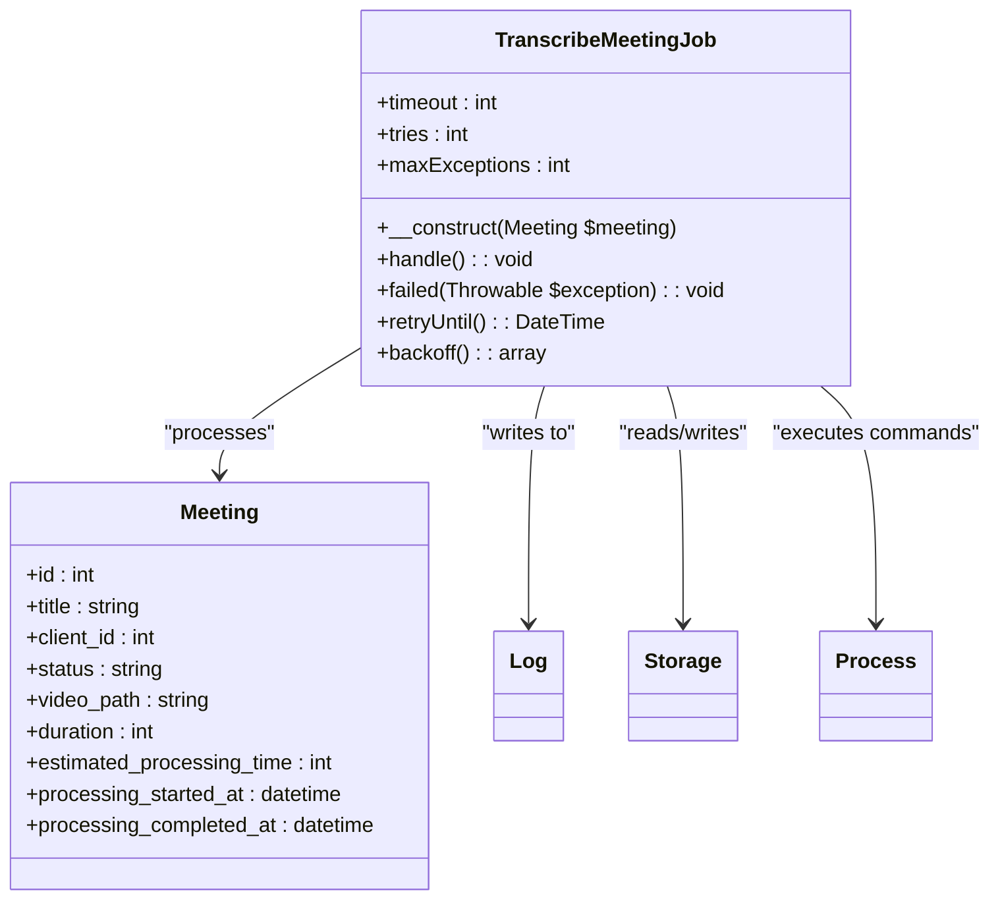
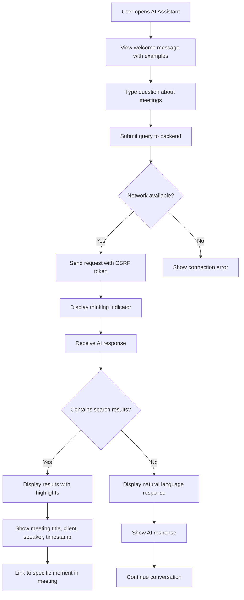
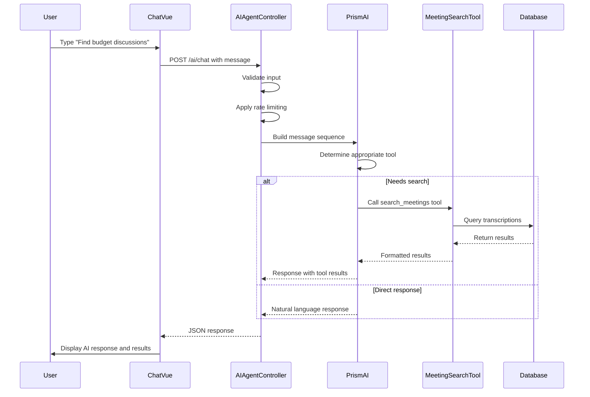
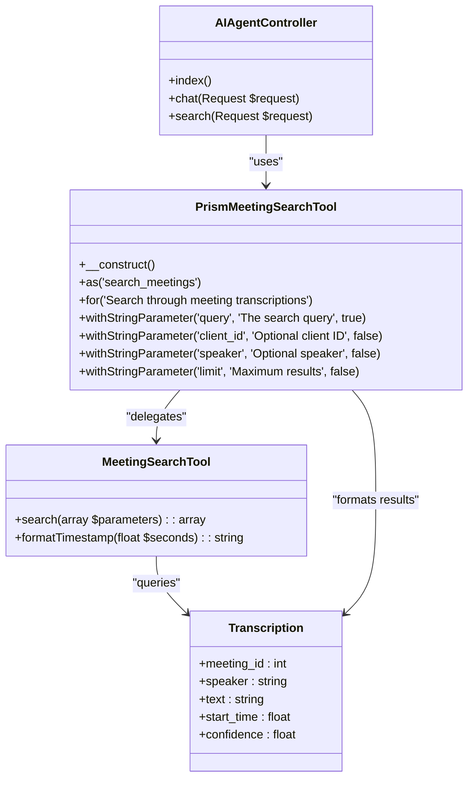
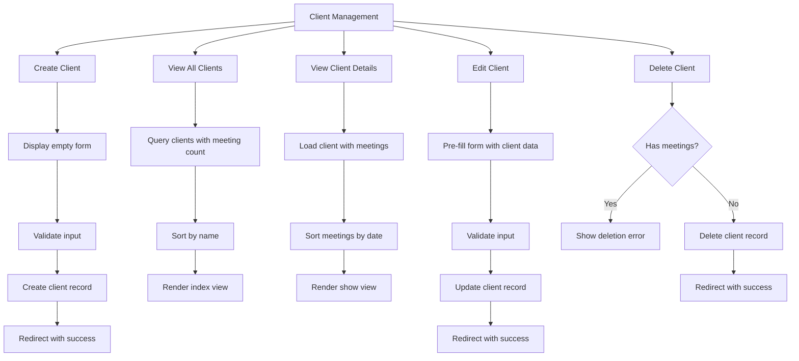
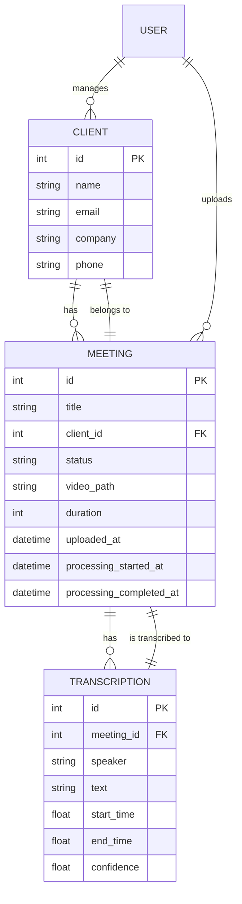

# Core Features

## Table of Contents
1. [Meeting Upload](#meeting-upload)
2. [AI-Powered Search](#ai-powered-search)
3. [Client Management](#client-management)
4. [Feature Relationships](#feature-relationships)
5. [Common Issues and Troubleshooting](#common-issues-and-troubleshooting)
6. [Best Practices and Performance Considerations](#best-practices-and-performance-considerations)

## Meeting Upload

The meeting upload feature enables users to upload video files for transcription and analysis. The process involves a frontend form, backend validation, file handling, and job dispatching for transcription processing.

### Frontend Form Implementation

The meeting upload form is implemented in `Create.vue` and provides a user-friendly interface with drag-and-drop functionality, file validation, and real-time feedback.

**Diagram sources**
- [Create.vue](file://e:/Herd/meetingai/resources/js/pages/Meetings/Create.vue#L1-L439)

**Section sources**
- [Create.vue](file://e:/Herd/meetingai/resources/js/pages/Meetings/Create.vue#L1-L439)

The form includes client-side validation for file type, size, and required fields. It supports MP4, MOV, AVI, and WebM formats with a maximum size of 500MB and minimum of 1MB. The implementation uses Inertia.js for seamless page transitions and form submission.

Key validation rules in the frontend:
- **Title**: Required field with descriptive placeholder
- **Client**: Required selection from existing clients
- **Video**: Required file with format and size validation
- **Drag-and-drop**: Visual feedback when files are dragged over the drop zone

The form provides real-time feedback including upload progress percentage, success notifications, and error recovery options with retry functionality.

### Backend Processing and Validation

The backend implementation in `MeetingController.php` handles the meeting upload request with comprehensive validation and error handling.

**Diagram sources**
- [MeetingController.php](file://e:/Herd/meetingai/app/Http/Controllers/MeetingController.php#L1-L305)

**Section sources**
- [MeetingController.php](file://e:/Herd/meetingai/app/Http/Controllers/MeetingController.php#L1-L305)

The `store` method in `MeetingController` implements server-side validation that mirrors frontend rules:
- **Title**: Required string with maximum 255 characters
- **Client ID**: Required and must exist in clients table
- **Video**: Required file with specific types (MP4, MOV, AVI, WebM), maximum 500MB, minimum 1MB

Additional backend validations include:
- File integrity check using `$videoFile->isValid()`
- Disk space verification accounting for processing overhead
- Transactional-like behavior where meeting records are deleted if subsequent steps fail

The controller creates a meeting record with status "pending" before storing the video file in organized storage paths: `meetings/{client_id}/{meeting_id}/video.{extension}`. This structure maintains client-meeting relationships and enables efficient file management.

### Job Dispatching and Transcription Processing

After successful upload, the system dispatches a `TranscribeMeetingJob` to process the video file asynchronously. This job handles the complete transcription workflow including video processing, audio extraction, and AI transcription.

**Diagram sources**
- [TranscribeMeetingJob.php](file://e:/Herd/meetingai/app/Jobs/TranscribeMeetingJob.php#L1-L400)
- [MeetingController.php](file://e:/Herd/meetingai/app/Http/Controllers/MeetingController.php#L1-L305)

**Section sources**
- [TranscribeMeetingJob.php](file://e:/Herd/meetingai/app/Jobs/TranscribeMeetingJob.php#L1-L400)

The job implements robust error handling with:
- **Retry mechanism**: Up to 3 attempts with exponential backoff (60, 300, 900 seconds)
- **Failure handling**: Detailed error logging and user-friendly error messages
- **Resource cleanup**: Automatic cleanup of temporary files on failure
- **Timeout protection**: 1-hour timeout with intermediate command timeouts

The transcription process follows these steps:
1. Update meeting status to "processing"
2. Convert video to WAV format using FFmpeg in Docker
3. Run transcription using Scriberr model with diarization and alignment
4. Store results and update meeting status to "completed" or "failed"

The job uses Docker containers for both FFmpeg (video processing) and Scriberr (transcription), ensuring consistent execution environments and isolation from the main application.

## AI-Powered Search

The AI-powered search feature allows users to query meeting transcriptions using natural language. The system combines a chat interface with AI capabilities and specialized tools for meeting content search.

### Chat Interface Implementation

The chat interface is implemented in `Chat.vue` and provides an interactive experience for users to search through meeting content.

**Diagram sources**
- [Chat.vue](file://e:/Herd/meetingai/resources/js/pages/AI/Chat.vue#L1-L307)

**Section sources**
- [Chat.vue](file://e:/Herd/meetingai/resources/js/pages/AI/Chat.vue#L1-L307)

The interface includes several user experience features:
- **Welcome state**: Shows example queries when no messages exist
- **Message history**: Displays conversation with user and AI messages
- **Typing indicator**: Shows "Thinking..." when processing requests
- **Search result display**: Formats results with meeting context and timestamps
- **Error handling**: Provides retry options for failed requests
- **Network awareness**: Detects offline status and shows appropriate messages

The component uses Inertia.js for page rendering and implements retry logic with exponential backoff for network requests. It also includes a timeout mechanism (30 seconds) to prevent hanging requests.

### AI Agent and Tool Integration

The backend AI agent is implemented in `AIAgentController.php` and integrates with the Prism AI system to process user queries and execute appropriate tools.

**Diagram sources**
- [AIAgentController.php](file://e:/Herd/meetingai/app/Http/Controllers/AIAgentController.php#L1-L183)
- [PrismMeetingSearchTool.php](file://e:/Herd/meetingai/app/Tools/PrismMeetingSearchTool.php#L1-L50)

**Section sources**
- [AIAgentController.php](file://e:/Herd/meetingai/app/Http/Controllers/AIAgentController.php#L1-L183)

The `chat` method in `AIAgentController` implements the following workflow:
1. Validate user input (required message, maximum 1000 characters)
2. Apply rate limiting (10 requests per minute per IP)
3. Construct conversation history with system, user, and assistant messages
4. Send request to Prism AI with the `PrismMeetingSearchTool`
5. Process response and return to frontend

The system uses OpenRouter with the `openai/gpt-oss-120b` model and includes comprehensive error handling for various failure scenarios:
- **Validation errors**: Return 422 status with specific error messages
- **Rate limiting**: Return 429 status when limits are exceeded
- **Timeouts**: Handle with appropriate user messages
- **Network errors**: Provide guidance for connection issues
- **Authentication errors**: Handle session expiration

### Meeting Search Tool Implementation

The meeting search functionality is implemented through two complementary classes: `MeetingSearchTool` for direct database queries and `PrismMeetingSearchTool` for AI integration.

**Diagram sources**
- [PrismMeetingSearchTool.php](file://e:/Herd/meetingai/app/Tools/PrismMeetingSearchTool.php#L1-L50)
- [MeetingSearchTool.php](file://e:/Herd/meetingai/app/Tools/MeetingSearchTool.php#L1-L86)

**Section sources**
- [PrismMeetingSearchTool.php](file://e:/Herd/meetingai/app/Tools/PrismMeetingSearchTool.php#L1-L50)
- [MeetingSearchTool.php](file://e:/Herd/meetingai/app/Tools/MeetingSearchTool.php#L1-L86)

The `MeetingSearchTool::search` method implements the core search logic:
- **Query validation**: Ensures search query is not empty
- **Database query**: Searches transcription text with LIKE operator
- **Filtering**: Applies client and speaker filters when provided
- **Result formatting**: Highlights search terms and formats timestamps
- **Error handling**: Returns structured error responses

The `PrismMeetingSearchTool` acts as an adapter between the AI system and the search functionality, defining the tool interface that the AI can understand and use. It:
- Defines the tool name as "search_meetings"
- Specifies required and optional parameters
- Handles type conversion and validation
- Formats results in a natural language format for the AI
- Translates AI tool calls to actual search operations

## Client Management

The client management feature provides full CRUD (Create, Read, Update, Delete) operations for managing client records, which serve as containers for related meetings.

### CRUD Operations Implementation

The client management functionality is implemented in `ClientController.php` with standard RESTful actions for all CRUD operations.

**Diagram sources**
- [ClientController.php](file://e:/Herd/meetingai/app/Http/Controllers/ClientController.php#L1-L95)

**Section sources**
- [ClientController.php](file://e:/Herd/meetingai/app/Http/Controllers/ClientController.php#L1-L95)

The controller methods provide the following functionality:

**Index (`index`)**: Retrieves all clients with their meeting counts, sorted by name, for display in the client list view.

**Create (`create`)**: Displays an empty form for creating a new client.

**Store (`store`)**: Handles client creation with validation:
- Name is required (maximum 255 characters)
- Email is optional but must be unique if provided
- Company and phone are optional fields

**Show (`show`)**: Displays a specific client with their associated meetings sorted by creation date.

**Edit (`edit`)**: Displays a pre-filled form for editing an existing client.

**Update (`update`)**: Handles client updates with validation similar to store, but with email uniqueness check that ignores the current client's email.

**Destroy (`destroy`)**: Implements a safety check that prevents deletion of clients with existing meetings, enforcing data integrity.

### Frontend Components

The client management feature includes Vue components for each operation:
- `Clients/Index.vue`: Displays the list of all clients with meeting counts
- `Clients/Create.vue`: Form for creating new clients
- `Clients/Edit.vue`: Form for updating existing clients
- `Clients/Show.vue`: Detailed view of a client and their meetings

These components follow the same Inertia.js pattern as other views, providing a seamless single-page application experience. The components include proper validation feedback and success/error messaging.

## Feature Relationships

The core features of the meetingai application are interconnected, forming a cohesive system for meeting management and analysis.

**Diagram sources**
- [ClientController.php](file://e:/Herd/meetingai/app/Http/Controllers/ClientController.php#L1-L95)
- [MeetingController.php](file://e:/Herd/meetingai/app/Http/Controllers/MeetingController.php#L1-L305)
- [TranscribeMeetingJob.php](file://e:/Herd/meetingai/app/Jobs/TranscribeMeetingJob.php#L1-L400)

**Section sources**
- [ClientController.php](file://e:/Herd/meetingai/app/Http/Controllers/ClientController.php#L1-L95)
- [MeetingController.php](file://e:/Herd/meetingai/app/Http/Controllers/MeetingController.php#L1-L305)

The key relationships are:
- **Clients own meetings**: Each meeting belongs to a client, establishing ownership and organization
- **Meetings have transcriptions**: Each processed meeting generates a transcription with segmented content
- **AI searches transcriptions**: The AI-powered search queries the transcription database to find relevant content
- **Clients provide context**: Client information is included in search results, providing additional context

This relationship structure enables features like:
- Filtering meetings by client
- Searching within specific client meetings
- Displaying client information in meeting details
- Preventing deletion of clients with existing meetings

## Common Issues and Troubleshooting

### Upload Failures

Common upload issues and their solutions:

**File size too large**: The system limits uploads to 500MB. For larger files, users should:
- Compress the video before uploading
- Split long recordings into smaller segments
- Use lower resolution recordings

**Invalid file format**: Only MP4, MOV, AVI, and WebM formats are supported. Users should:
- Convert files to a supported format using video conversion tools
- Ensure the file extension matches the actual format
- Check that the file is not corrupted

**Insufficient storage space**: The system checks available disk space before processing. Solutions include:
- Freeing up space on the server
- Configuring external storage solutions
- Implementing automatic cleanup of old files

**Network interruptions**: The frontend includes retry functionality for failed uploads. Best practices:
- Ensure stable internet connection
- Use the retry button when uploads fail
- Avoid closing the browser during upload

### Transcription Errors

Common transcription issues and troubleshooting:

**Processing failures**: The `TranscribeMeetingJob` includes comprehensive error handling. Common causes:
- **Docker not running**: Ensure Docker service is available
- **Insufficient CPU/memory**: Allocate more resources to Docker containers
- **Corrupted video files**: Verify file integrity before upload

**Long processing times**: Large files take proportionally longer to process. The system estimates processing time based on video duration. For very large files:
- Be patient as processing completes
- Monitor progress through the meeting status
- Consider breaking large meetings into smaller segments

**Poor transcription quality**: The system uses a medium-sized model with CPU processing. For better accuracy:
- Ensure good audio quality in recordings
- Use the diarization feature to distinguish speakers
- Consider upgrading to GPU processing for faster, more accurate results

### AI Response Delays

Issues with AI-powered search responsiveness:

**Rate limiting**: The system limits requests to 10 per minute per IP. If users encounter rate limits:
- Wait a moment before sending additional requests
- Combine multiple questions into a single, more comprehensive query
- Implement client-side request queuing

**Network latency**: The AI service may have variable response times. Mitigation strategies:
- Implement proper loading indicators
- Set appropriate timeouts (30 seconds in the current implementation)
- Provide clear feedback when requests are processing

**Complex queries**: Some queries require extensive search operations. For optimal performance:
- Use specific search terms rather than broad concepts
- Include client or speaker filters when possible
- Limit result counts for faster responses

## Best Practices and Performance Considerations

### Feature Usage Best Practices

**Meeting Upload**:
- Use descriptive titles that include date and purpose
- Organize meetings by client for better management
- Ensure good audio quality for accurate transcription
- Keep individual meeting files under 500MB for optimal processing

**AI-Powered Search**:
- Use specific keywords rather than general concepts
- Include speaker names when searching for specific contributions
- Use time-based queries like "discussions from last week"
- Combine multiple criteria (client, speaker, topic) for precise results

**Client Management**:
- Create clients before uploading related meetings
- Use consistent naming conventions
- Keep contact information up to date
- Organize related meetings under the appropriate client

### Performance Considerations

**Large Video Files**:
- Processing time scales with video duration (approximately 1 second per minute of video)
- Large files consume significant temporary storage during processing
- Consider implementing chunked processing for very large files
- Monitor server resources (CPU, memory, disk space) during processing

**Database Performance**:
- The transcription search uses LIKE queries which can be slow on large datasets
- Consider implementing full-text search or dedicated search engines (Elasticsearch) for large volumes
- Index key fields like `meeting_id`, `speaker`, and `start_time`
- Implement pagination for large result sets

**AI Service Optimization**:
- Cache frequent search queries to reduce AI service calls
- Implement result caching for common queries
- Monitor API usage and costs
- Consider implementing query queuing during peak usage

**System Architecture**:
- The current Docker-based processing provides isolation but adds overhead
- Consider GPU acceleration for transcription jobs to improve speed
- Implement proper monitoring and alerting for job processing
- Use dedicated workers for transcription jobs to avoid impacting web servers

By following these best practices and considering the performance implications, users can maximize the effectiveness of the meetingai application while maintaining system stability and responsiveness.

**Referenced Files in This Document**   
- [Create.vue](file://e:/Herd/meetingai/resources/js/pages/Meetings/Create.vue)
- [MeetingController.php](file://e:/Herd/meetingai/app/Http/Controllers/MeetingController.php)
- [TranscribeMeetingJob.php](file://e:/Herd/meetingai/app/Jobs/TranscribeMeetingJob.php)
- [Chat.vue](file://e:/Herd/meetingai/resources/js/pages/AI/Chat.vue)
- [AIAgentController.php](file://e:/Herd/meetingai/app/Http/Controllers/AIAgentController.php)
- [MeetingSearchTool.php](file://e:/Herd/meetingai/app/Tools/MeetingSearchTool.php)
- [PrismMeetingSearchTool.php](file://e:/Herd/meetingai/app/Tools/PrismMeetingSearchTool.php)
- [ClientController.php](file://e:/Herd/meetingai/app/Http/Controllers/ClientController.php)