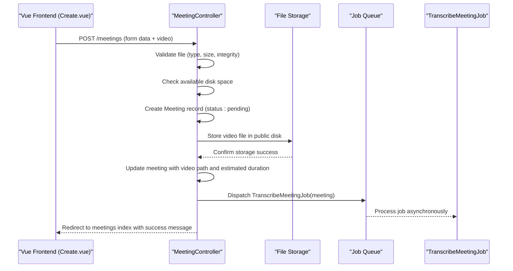
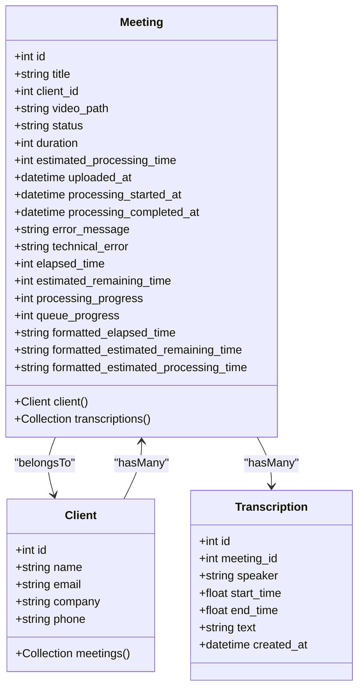
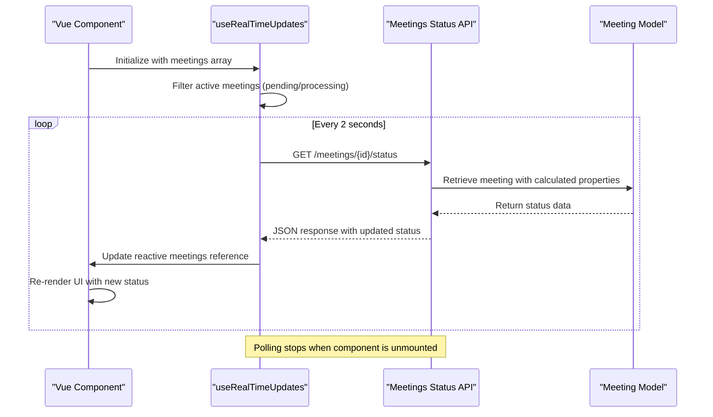
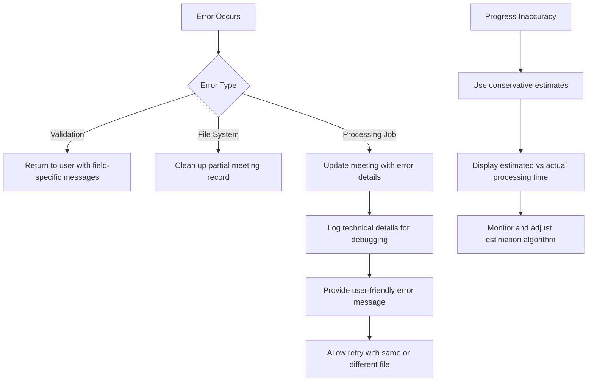

# Meeting Management


## Table of Contents
1. [Meeting Upload and Backend Processing](#meeting-upload-and-backend-processing)
2. [Meeting Model and Attributes](#meeting-model-and-attributes)
3. [Frontend Components Overview](#frontend-components-overview)
4. [Real-Time Status Updates](#real-time-status-updates)
5. [Error Handling and Common Issues](#error-handling-and-common-issues)
6. [Best Practices and Optimization](#best-practices-and-optimization)

## Meeting Upload and Backend Processing

The meeting upload process is orchestrated through the `MeetingController@store` method, which handles file validation, storage, and job dispatching. The workflow begins when a user submits a video file via the frontend form in `Create.vue`.

The controller performs comprehensive validation on the uploaded file:
- **File type**: Only MP4, MOV, AVI, and WebM formats are accepted
- **Size constraints**: Minimum 1MB and maximum 500MB
- **Integrity check**: Validates that the uploaded file is not corrupted
- **Disk space verification**: Ensures sufficient storage is available (1.5x file size)

Upon successful validation, the system creates a `Meeting` record with initial status "pending" and stores the video in a structured path: `meetings/{client_id}/{meeting_id}/video.{extension}` using Laravel's public disk storage.

After storing the video, the system calculates two key processing metrics:
- **Duration**: Estimated randomly between 5-60 minutes for demonstration purposes
- **Estimated processing time**: Calculated as 1 second per minute of video duration, with a minimum of 10 seconds

Finally, the `TranscribeMeetingJob` is dispatched to process the meeting asynchronously, enabling non-blocking transcription while providing immediate feedback to the user.





**Diagram sources**
- [MeetingController.php](file://app/Http/Controllers/MeetingController.php#L100-L200)
- [TranscribeMeetingJob.php](file://app/Jobs/TranscribeMeetingJob.php#L1-L30)

**Section sources**
- [MeetingController.php](file://app/Http/Controllers/MeetingController.php#L100-L200)

## Meeting Model and Attributes

The `Meeting` model represents a recorded meeting with comprehensive metadata and processing state tracking. Key attributes include:

- **Core metadata**:
  - `title`: String, required, max 255 characters
  - `client_id`: Foreign key to Client model
  - `video_path`: Storage path to the video file
  - `uploaded_at`: Timestamp when the meeting was uploaded

- **Processing state**:
  - `status`: Enum with values "pending", "processing", "completed", "failed"
  - `duration`: Integer representing video duration in seconds
  - `estimated_processing_time`: Integer representing estimated processing duration in seconds
  - `processing_started_at`: Timestamp when processing began
  - `processing_completed_at`: Timestamp when processing completed

- **Error tracking** (added via migration):
  - `error_message`: User-friendly error description
  - `technical_error`: Detailed technical error message

The model includes several calculated properties that enhance the user experience:
- `elapsed_time`: Seconds since processing started
- `estimated_remaining_time`: Projected seconds until completion
- `processing_progress`: Percentage completion (0-100)
- `queue_progress`: Position in processing queue
- Formatted time displays (e.g., "5:30" instead of 330 seconds)





**Diagram sources**
- [Meeting.php](file://app/Models/Meeting.php)
- [2025_08_10_145951_add_estimated_processing_time_to_meetings_table.php](file://database/migrations/2025_08_10_145951_add_estimated_processing_time_to_meetings_table.php#L1-L27)
- [2025_08_10_160251_add_error_fields_to_meetings_table.php](file://database/migrations/2025_08_10_160251_add_error_fields_to_meetings_table.php#L1-L27)

**Section sources**
- [MeetingFactory.php](file://database/factories/MeetingFactory.php#L1-L80)

## Frontend Components Overview

The frontend implementation consists of three primary Vue components that provide a complete user interface for meeting management.

### Create.vue: Meeting Upload Interface

The `Create.vue` component provides a form for uploading new meetings. It includes:
- Client selection dropdown
- Title input field
- File input with drag-and-drop support
- Real-time validation feedback
- Submission handling with error recovery

When the form is submitted, it sends a multipart POST request to the `MeetingController@store` endpoint with the video file and metadata.

### Index.vue: Meeting List Management

The `Index.vue` component displays a paginated list of all meetings with:
- Filtering by client and status
- Sorting by various attributes
- Search functionality
- Real-time status updates for active meetings
- Queue position indicators for pending meetings

The component uses Inertia.js to maintain state during navigation and filtering operations.

### Show.vue: Meeting Playback and Transcription

The `Show.vue` component provides detailed view of a single meeting with:
- Video player integration
- Transcription display synchronized with video timeline
- Processing status indicators
- Error messages when video or transcription is unavailable
- Real-time status polling during processing


```mermaid
flowchart TD
A[Create.vue] --> |Upload Meeting| B(MeetingController@store)
B --> C{Validation}
C --> |Success| D[Store Video File]
D --> E[Create Meeting Record]
E --> F[Dispatch TranscribeMeetingJob]
F --> G[Update UI with Success]
H[Index.vue] --> |List Meetings| I(MeetingController@index)
I --> J[Apply Filters & Sorting]
J --> K[Return Paginated Results]
K --> L[Display Meeting List]
M[Show.vue] --> |View Meeting| N(MeetingController@show)
N --> O[Load Meeting with Relations]
O --> P[Generate Video URL]
P --> Q[Display Video & Transcription]
```


**Diagram sources**
- [Create.vue](file://resources/js/pages/Meetings/Create.vue)
- [Index.vue](file://resources/js/pages/Meetings/Index.vue)
- [Show.vue](file://resources/js/pages/Meetings/Show.vue)

**Section sources**
- [Create.vue](file://resources/js/pages/Meetings/Create.vue)
- [Index.vue](file://resources/js/pages/Meetings/Index.vue)
- [Show.vue](file://resources/js/pages/Meetings/Show.vue)

## Real-Time Status Updates

The system implements real-time status synchronization using a combination of frontend polling and backend API endpoints. The `useRealTimeUpdates.ts` composable manages this functionality.

The process works as follows:
1. When a page loads with active meetings (status: "pending" or "processing"), the composable starts polling
2. It makes GET requests to `/meetings/{id}/status` every 2 seconds
3. The response contains updated status information including progress metrics
4. The frontend merges this data with existing meeting objects while preserving other properties
5. The UI automatically updates to reflect the latest status

The `MeetingController@status` method returns a JSON response with comprehensive status information:
- Current processing status
- Elapsed processing time
- Estimated remaining time
- Processing progress percentage
- Queue position (for pending meetings)
- Formatted time displays for better readability





**Diagram sources**
- [useRealTimeUpdates.ts](file://resources/js/lib/useRealTimeUpdates.ts#L1-L87)
- [MeetingController.php](file://app/Http/Controllers/MeetingController.php#L280-L305)

**Section sources**
- [useRealTimeUpdates.ts](file://resources/js/lib/useRealTimeUpdates.ts#L1-L87)

## Error Handling and Common Issues

The system implements comprehensive error handling across both frontend and backend components.

### Backend Error Handling

The `MeetingController@store` method uses a try-catch block to handle various failure scenarios:
- **Validation errors**: Thrown by Laravel's validator, automatically returned to frontend
- **File system errors**: Runtime exceptions for storage failures, with automatic cleanup
- **General exceptions**: Caught and logged with full stack trace for debugging

When the `TranscribeMeetingJob` fails, it implements robust error handling:
- Logs detailed error information including exit codes and output
- Updates the meeting record with user-friendly and technical error messages
- Implements retry logic with exponential backoff (1, 5, 15 minutes)
- Limits retries to 3 attempts within a 30-minute window

### Common Issues and Solutions

**Large File Uploads**:
- Issue: 500MB limit may be insufficient for high-resolution recordings
- Solution: Implement chunked uploads or increase server limits with proper resource monitoring

**Processing Failures**:
- Issue: Transcription service may fail due to audio quality or format issues
- Solution: The system captures both user-friendly and technical error messages, enabling targeted troubleshooting

**Progress Tracking Inaccuracies**:
- Issue: Estimated processing time may not reflect actual processing duration
- Solution: The system uses a conservative estimate (1 second per minute of video) but acknowledges this may vary based on system load and video complexity

**Network Interruptions**:
- The frontend includes error handling in the real-time updates composable, logging failures without breaking the user interface
- Network status monitoring provides visual feedback when connectivity is lost





**Section sources**
- [MeetingController.php](file://app/Http/Controllers/MeetingController.php#L150-L200)
- [TranscribeMeetingJob.php](file://app/Jobs/TranscribeMeetingJob.php#L300-L398)

## Best Practices and Optimization

### Video File Optimization

To ensure optimal processing performance and user experience:

**Recommended Formats**:
- **MP4 with H.264**: Best compatibility and compression
- **WebM with VP9**: Good for web-first applications
- Avoid MOV and AVI for large files due to less efficient compression

**Optimal Specifications**:
- Resolution: 720p or 1080p (avoid 4K unless necessary)
- Frame rate: 24-30 fps (avoid 60 fps for meetings)
- Audio: Mono or stereo, 44.1kHz or 48kHz
- Bitrate: 2-5 Mbps for video, 128-256 kbps for audio

### Job Queue Performance Monitoring

**Queue Configuration**:
- Monitor queue length and processing time
- Adjust worker count based on typical load
- Implement queue prioritization for urgent meetings

**Performance Metrics to Track**:
- Average processing time vs. estimated time
- Job failure rate
- Disk I/O during processing
- Memory usage per job

**Scaling Recommendations**:
- Use dedicated workers for transcription jobs
- Consider horizontal scaling with multiple worker servers
- Implement auto-scaling based on queue depth
- Monitor disk space and implement cleanup policies for temporary files

### System Optimization

**Storage Optimization**:
- Use separate storage for processed vs. raw files
- Implement automated cleanup of temporary processing files
- Consider cloud storage for scalability

**Caching Strategy**:
- Cache frequently accessed meeting lists
- Implement Redis for session and queue management
- Cache processed transcription results

**Monitoring and Alerts**:
- Set up alerts for job failures and queue backlogs
- Monitor disk space and processing times
- Log key metrics for capacity planning

**Referenced Files in This Document**   
- [MeetingController.php](file://app/Http/Controllers/MeetingController.php#L1-L305)
- [TranscribeMeetingJob.php](file://app/Jobs/TranscribeMeetingJob.php#L1-L398)
- [Meeting.php](file://app/Models/Meeting.php)
- [Create.vue](file://resources/js/pages/Meetings/Create.vue)
- [Index.vue](file://resources/js/pages/Meetings/Index.vue)
- [Show.vue](file://resources/js/pages/Meetings/Show.vue)
- [useRealTimeUpdates.ts](file://resources/js/lib/useRealTimeUpdates.ts#L1-L87)
- [MeetingFactory.php](file://database/factories/MeetingFactory.php#L1-L80)
- [2025_08_10_145951_add_estimated_processing_time_to_meetings_table.php](file://database/migrations/2025_08_10_145951_add_estimated_processing_time_to_meetings_table.php#L1-L27)
- [2025_08_10_160251_add_error_fields_to_meetings_table.php](file://database/migrations/2025_08_10_160251_add_error_fields_to_meetings_table.php#L1-L27)