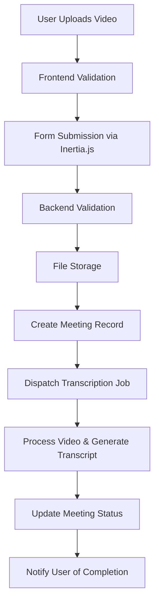
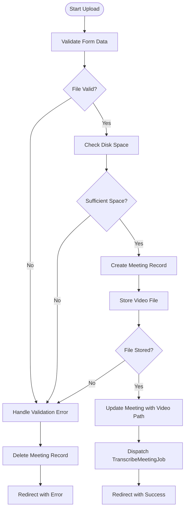
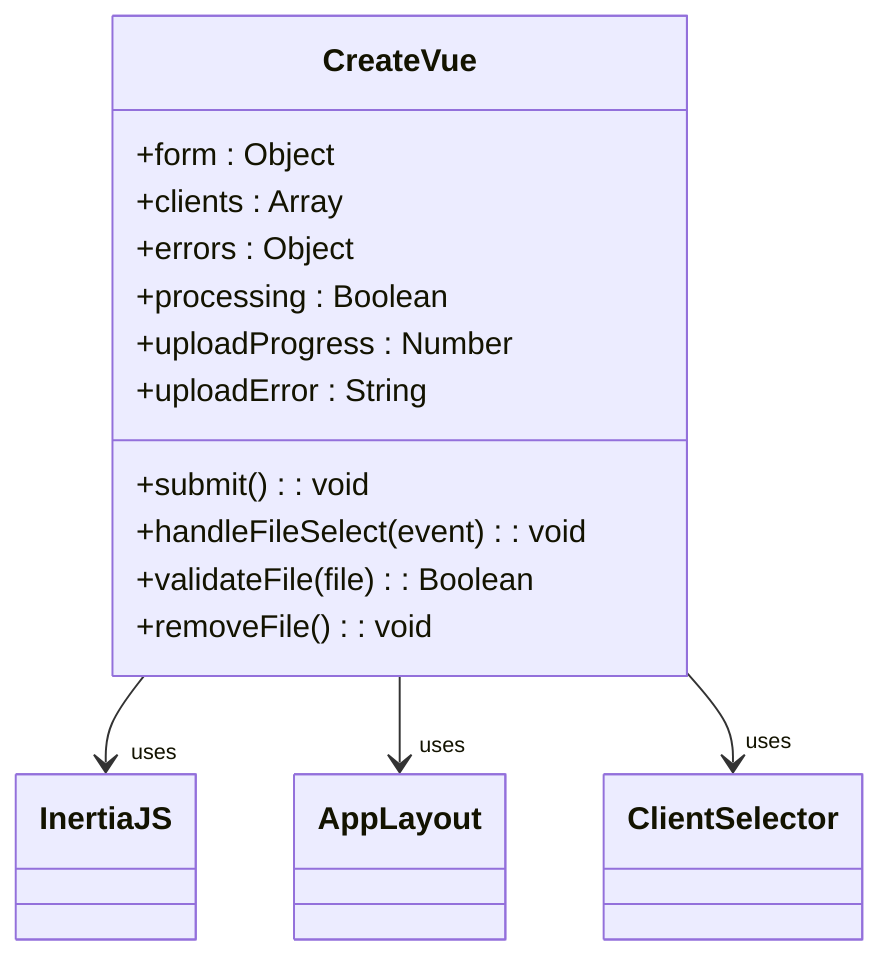
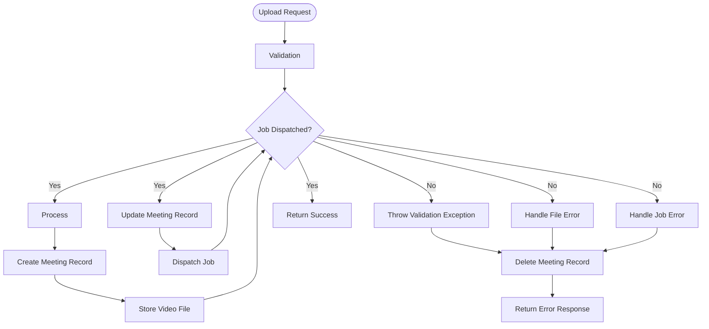
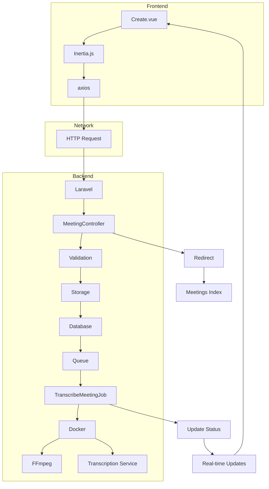

# Meeting Upload


## Table of Contents
1. [Introduction](#introduction)
2. [File Upload Process Overview](#file-upload-process-overview)
3. [Backend Implementation](#backend-implementation)
4. [Frontend Form and Submission](#frontend-form-and-submission)
5. [Validation Rules](#validation-rules)
6. [Storage and File Path Management](#storage-and-file-path-management)
7. [Error Handling](#error-handling)
8. [Common Issues and Best Practices](#common-issues-and-best-practices)
9. [Request and Response Examples](#request-and-response-examples)
10. [Architecture Diagram](#architecture-diagram)

## Introduction
The Meeting Upload feature enables users to upload video recordings of meetings for automated transcription and analysis. This document details the implementation of the file upload process, covering both frontend and backend components, validation rules, storage mechanisms, error handling, and best practices for deployment.

## File Upload Process Overview
The meeting upload process follows a structured workflow from user interface interaction to backend processing:
1. User selects a client and uploads a video file via the frontend form
2. Frontend validates file properties before submission
3. Backend validates the request and stores the file
4. A Meeting record is created with initial "pending" status
5. The TranscribeMeetingJob is dispatched to process the video
6. The system provides real-time status updates during processing





**Diagram sources**
- [MeetingController.php](file://app/Http/Controllers/MeetingController.php#L0-L305)
- [Create.vue](file://resources/js/pages/Meetings/Create.vue#L0-L439)
- [TranscribeMeetingJob.php](file://app/Jobs/TranscribeMeetingJob.php#L0-L400)

## Backend Implementation

### MeetingController Implementation
The `MeetingController` handles the upload process through its `store` method, which implements comprehensive validation, file storage, and record creation.

**Section sources**
- [MeetingController.php](file://app/Http/Controllers/MeetingController.php#L0-L305)

#### Upload Method Logic




**Diagram sources**
- [MeetingController.php](file://app/Http/Controllers/MeetingController.php#L0-L305)

### Validation Rules
The backend implements strict validation rules for meeting uploads:

**:Validation Rules**
- **Title**: Required, string, maximum 255 characters
- **Client ID**: Required, must exist in clients table
- **Video File**: Required, must be valid file
- **Video Format**: Must be MP4, MOV, AVI, or WebM
- **Video Size**: Minimum 1MB, maximum 500MB

These rules are implemented using Laravel's validation system with custom error messages:


```php
$validated = $request->validate([
    'title' => 'required|string|max:255',
    'client_id' => 'required|exists:clients,id',
    'video' => [
        'required',
        'file',
        File::types(['mp4', 'mov', 'avi', 'webm'])
            ->max(500 * 1024) // 500MB max
            ->min(1024) // 1MB min
    ]
]);
```


**Section sources**
- [MeetingController.php](file://app/Http/Controllers/MeetingController.php#L0-L305)

### File Storage Process
The system uses Laravel's filesystem abstraction to store uploaded videos:

1. Creates a meeting record with "pending" status
2. Stores the video file in a structured path: `meetings/{client_id}/{meeting_id}/video.{extension}`
3. Updates the meeting record with the stored file path
4. Dispatches the transcription job for processing

The storage uses the 'public' disk configured in `filesystems.php`, which maps to `storage/app/public` and is served via the `storage` symlink.

**Section sources**
- [MeetingController.php](file://app/Http/Controllers/MeetingController.php#L0-L305)
- [filesystems.php](file://config/filesystems.php#L0-L81)

## Frontend Form and Submission

### Create.vue Component
The frontend upload interface is implemented in `Create.vue`, a Vue component that provides a user-friendly form for uploading meeting videos.

**Section sources**
- [Create.vue](file://resources/js/pages/Meetings/Create.vue#L0-L439)

#### Form Structure
The form includes three main components:
- Meeting title input field
- Client selection dropdown
- Video file upload with drag-and-drop support





**Diagram sources**
- [Create.vue](file://resources/js/pages/Meetings/Create.vue#L0-L439)

#### Submission Handling
The form submission is handled by Inertia.js, which manages the file upload process and provides progress feedback:


```javascript
const submit = () => {
    if (!form.video || !validateFile(form.video)) return

    processing.value = true
    uploadProgress.value = 0
    uploadError.value = ''

    const formData = new FormData()
    formData.append('title', form.title)
    formData.append('client_id', form.client_id)
    formData.append('video', form.video)

    router.post(route('meetings.store'), formData, {
        onProgress: (progress) => {
            if (progress?.percentage !== undefined) {
                uploadProgress.value = Math.round(progress.percentage)
            }
        },
        onSuccess: () => {
            processing.value = false
            uploadProgress.value = null
        },
        onError: (errors) => {
            processing.value = false
            uploadProgress.value = null
        }
    })
}
```


**Section sources**
- [Create.vue](file://resources/js/pages/Meetings/Create.vue#L0-L439)

## Validation Rules

### Frontend Validation
The frontend implements client-side validation to provide immediate feedback:

**:Frontend Validation Rules**
- **File Type**: Validates MIME types: video/mp4, video/quicktime, video/x-msvideo, video/webm
- **File Size**: Maximum 500MB (524,288,000 bytes), minimum 1MB (1,048,576 bytes)
- **Required Fields**: Title, client selection, and video file are required

The validation occurs both on file selection and drag-and-drop:


```javascript
const validateFile = (file: File): boolean => {
    const maxSize = 500 * 1024 * 1024 // 500MB
    const minSize = 1024 * 1024 // 1MB
    const allowedTypes = ['video/mp4', 'video/quicktime', 'video/x-msvideo', 'video/webm']
    
    if (!allowedTypes.includes(file.type)) {
        uploadError.value = 'Please select a valid video file (MP4, MOV, AVI, or WebM)'
        return false
    }
    
    if (file.size > maxSize) {
        uploadError.value = 'File size must be less than 500MB'
        return false
    }
    
    if (file.size < minSize) {
        uploadError.value = 'File size must be at least 1MB'
        return false
    }
    
    return true
}
```


**Section sources**
- [Create.vue](file://resources/js/pages/Meetings/Create.vue#L0-L439)

### Backend Validation
The backend performs server-side validation to ensure data integrity:

**:Backend Validation Rules**
- **Field Presence**: Ensures title, client_id, and video are present
- **Data Types**: Validates that fields are of correct type
- **Client Existence**: Verifies client_id exists in the database
- **File Integrity**: Checks if the uploaded file is valid
- **Disk Space**: Verifies sufficient storage space is available

The backend validation complements the frontend validation, providing a secure and reliable upload process.

**Section sources**
- [MeetingController.php](file://app/Http/Controllers/MeetingController.php#L0-L305)

## Storage and File Path Management

### Filesystem Configuration
The application uses Laravel's filesystem configuration to manage file storage:


```php
'disks' => [
    'public' => [
        'driver' => 'local',
        'root' => storage_path('app/public'),
        'url' => env('APP_URL').'/storage',
        'visibility' => 'public',
    ],
]
```


**Section sources**
- [filesystems.php](file://config/filesystems.php#L0-L81)

### File Path Structure
Uploaded videos are stored in an organized directory structure:

`:File Path Structure`
- Root: `storage/app/public/meetings/`
- Client-specific: `meetings/{client_id}/`
- Meeting-specific: `meetings/{client_id}/{meeting_id}/`
- Final path: `meetings/{client_id}/{meeting_id}/video.{original_extension}`

This structure provides:
- Logical organization by client and meeting
- Easy file retrieval and management
- Simplified cleanup when meetings are deleted

### Security Considerations
The system implements several security measures for file storage:

- Files are stored outside the web root in `storage/app/public`
- Public access is provided through a symbolic link (`public/storage`)
- The original filename is not preserved (stored as "video.{extension}")
- File paths are stored in the database and not exposed directly
- Files are validated for type and integrity before storage

**Section sources**
- [filesystems.php](file://config/filesystems.php#L0-L81)
- [MeetingController.php](file://app/Http/Controllers/MeetingController.php#L0-L305)

## Error Handling

### Backend Error Handling
The `store` method implements comprehensive error handling with transactional integrity:





**Diagram sources**
- [MeetingController.php](file://app/Http/Controllers/MeetingController.php#L0-L305)

### Frontend Error Handling
The frontend provides user-friendly error handling with recovery options:

**:Error States**
- **Validation Errors**: Displayed inline with form fields
- **Upload Errors**: Shown in a dedicated error panel with retry options
- **Network Errors**: Handled with automatic retry logic
- **Progress Interruption**: Prevents accidental page navigation

The component includes a retry mechanism that allows users to attempt the upload up to three times:


```javascript
const retryUpload = () => {
    if (retryCount.value < maxRetries) {
        retryCount.value++
        uploadError.value = ''
        submit()
    } else {
        uploadError.value = 'Maximum retry attempts reached. Please try a different file or contact support.'
    }
}
```


**Section sources**
- [Create.vue](file://resources/js/pages/Meetings/Create.vue#L0-L439)

## Common Issues and Best Practices

### Common Issues
The following issues are commonly encountered with file uploads:

**:Common Upload Issues**
- **Large File Timeouts**: Requests exceeding server timeout limits
- **Unsupported Formats**: Users uploading non-video files or unsupported video formats
- **Concurrent Uploads**: Multiple uploads competing for server resources
- **Disk Space Exhaustion**: Insufficient storage for large video files
- **Network Interruptions**: Unstable connections causing upload failures

### Best Practices

#### Server Configuration
To handle large video uploads effectively, configure server limits appropriately:

**:PHP Configuration**
- `upload_max_filesize = 512M`
- `post_max_size = 512M`
- `max_execution_time = 3600`
- `max_input_time = 3600`
- `memory_limit = 512M`

**:Nginx Configuration**

```
client_max_body_size 512M;
client_body_timeout 3600s;
client_header_timeout 3600s;
fastcgi_read_timeout 3600s;
```


**:Apache Configuration**

```
LimitRequestBody 536870912
Timeout 3600
```


#### Storage Optimization
Use appropriate storage drivers based on deployment environment:

- **Local Storage**: For development and small-scale deployments
- **S3/Cloud Storage**: For production environments with high availability requirements
- **CDN Integration**: For improved video delivery performance

#### MIME Type Validation
Implement secure MIME type validation to prevent file upload vulnerabilities:

- Use both extension and MIME type checking
- Verify file signatures (magic bytes) for critical applications
- Sanitize file paths to prevent directory traversal
- Implement file size limits at both frontend and backend

**Section sources**
- [MeetingController.php](file://app/Http/Controllers/MeetingController.php#L0-L305)
- [filesystems.php](file://config/filesystems.php#L0-L81)

## Request and Response Examples

### Successful Upload Request
**:Request Payload**

```json
POST /meetings HTTP/1.1
Content-Type: multipart/form-data

Form Data:
- title: "Quarterly Review Meeting"
- client_id: "123"
- video: [video file: quarterly-review.mp4]
```


**:Success Response**

```json
HTTP/1.1 302 Found
Location: /meetings

Session Data:
- success: "Meeting uploaded successfully and is being processed."
```


### Validation Error Response
**:Error Response**

```json
HTTP/1.1 302 Found
Location: /meetings/create

Session Data:
- error: "The video file size cannot exceed 500MB."
- title: "Quarterly Review Meeting"
- client_id: "123"
```


### Frontend Error Handling
**:Client-Side Error Display**

```json
{
    "video": "File size must be less than 500MB",
    "uploadProgress": null,
    "uploadError": "File size must be less than 500MB"
}
```


**Section sources**
- [MeetingController.php](file://app/Http/Controllers/MeetingController.php#L0-L305)
- [Create.vue](file://resources/js/pages/Meetings/Create.vue#L0-L439)

## Architecture Diagram
The following diagram illustrates the complete meeting upload architecture:





**Diagram sources**
- [MeetingController.php](file://app/Http/Controllers/MeetingController.php#L0-L305)
- [Create.vue](file://resources/js/pages/Meetings/Create.vue#L0-L439)
- [TranscribeMeetingJob.php](file://app/Jobs/TranscribeMeetingJob.php#L0-L400)
- [Meeting.php](file://app/Models/Meeting.php#L0-L179)
- [filesystems.php](file://config/filesystems.php#L0-L81)

**Referenced Files in This Document**   
- [MeetingController.php](file://app/Http/Controllers/MeetingController.php#L0-L305)
- [Create.vue](file://resources/js/pages/Meetings/Create.vue#L0-L439)
- [filesystems.php](file://config/filesystems.php#L0-L81)
- [Meeting.php](file://app/Models/Meeting.php#L0-L179)
- [TranscribeMeetingJob.php](file://app/Jobs/TranscribeMeetingJob.php#L0-L400)
- [MeetingUploadTest.php](file://tests/Feature/MeetingUploadTest.php#L0-L190)