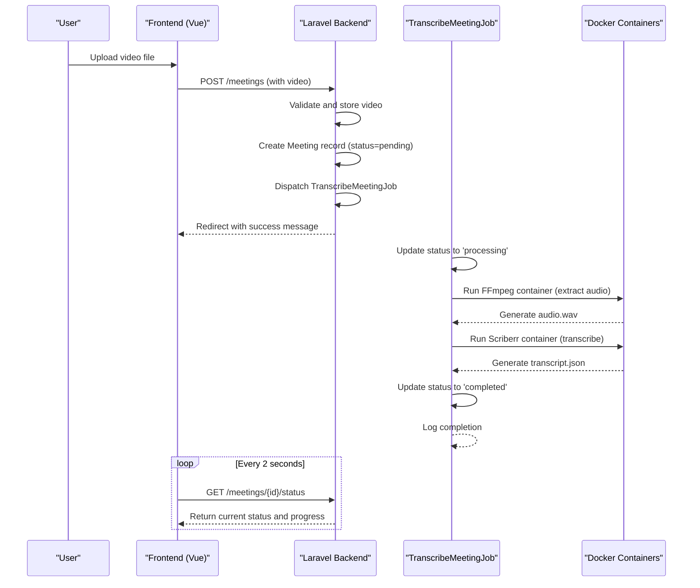
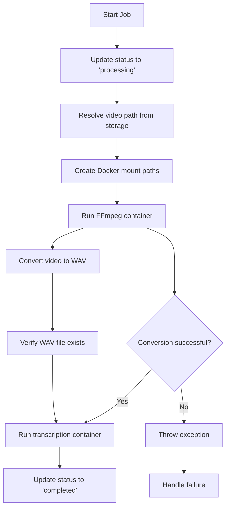
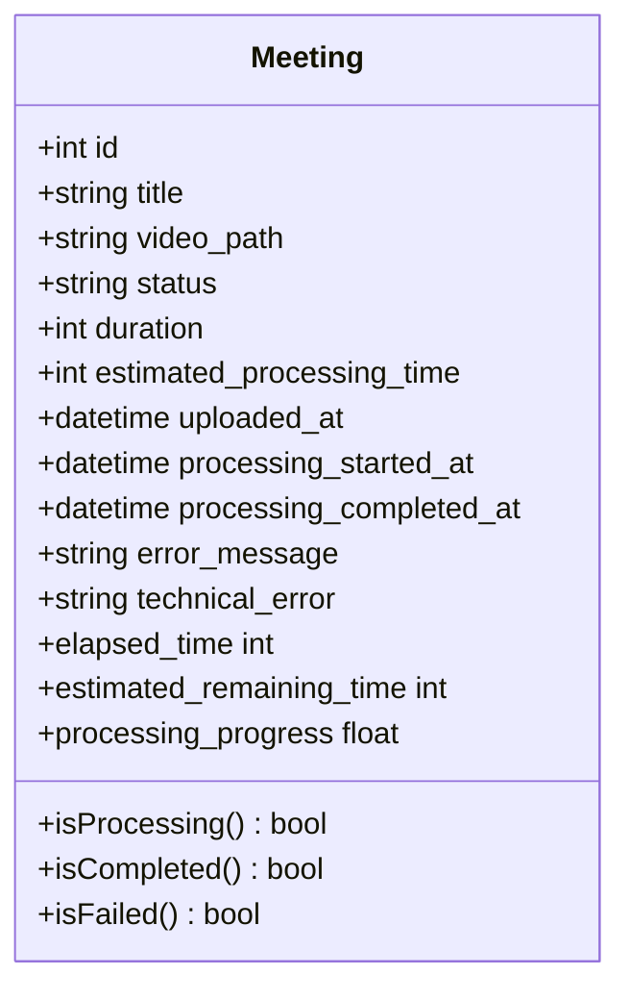
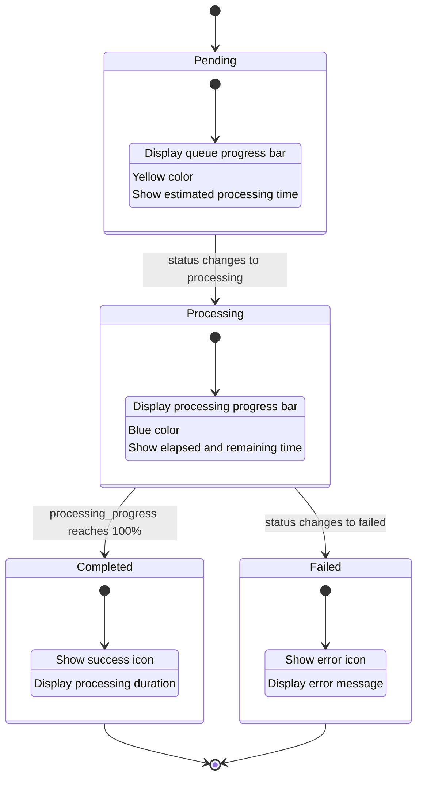
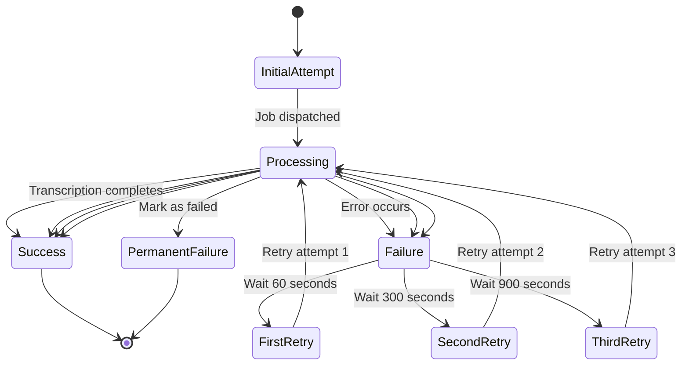

# Meeting Processing


## Table of Contents
1. [Meeting Processing Lifecycle](#meeting-processing-lifecycle)
2. [TranscribeMeetingJob Implementation](#transcribemeetingjob-implementation)
3. [Meeting Model Processing Attributes](#meeting-model-processing-attributes)
4. [Real-Time Frontend Updates](#real-time-frontend-updates)
5. [Error Handling and Retry Logic](#error-handling-and-retry-logic)
6. [Common Issues and Recommendations](#common-issues-and-recommendations)

## Meeting Processing Lifecycle

The meeting processing workflow begins when a user uploads a video file through the web interface and concludes when the transcription is complete and available for viewing. The system follows a well-defined sequence of operations to ensure reliable processing and status tracking.





**Diagram sources**
- [MeetingController.php](file://app/Http/Controllers/MeetingController.php#L76-L150)
- [TranscribeMeetingJob.php](file://app/Jobs/TranscribeMeetingJob.php#L45-L100)
- [web.php](file://routes/web.php#L15)

**Section sources**
- [MeetingController.php](file://app/Http/Controllers/MeetingController.php#L76-L150)
- [TranscribeMeetingJob.php](file://app/Jobs/TranscribeMeetingJob.php#L45-L100)

## TranscribeMeetingJob Implementation

The `TranscribeMeetingJob` class handles the core transcription workflow, executing as a queued job after a meeting is uploaded. It orchestrates the conversion of video to audio and the subsequent transcription using Dockerized microservices.

### Job Dispatch and Initialization

When a meeting is uploaded, the `MeetingController` dispatches the `TranscribeMeetingJob` with the newly created `Meeting` model instance. The job is queued for asynchronous processing, allowing the web request to complete immediately.


```php
TranscribeMeetingJob::dispatch($meeting);
```


The job is configured with specific execution parameters:

- **Timeout**: 3600 seconds (1 hour) maximum execution time
- **Retry attempts**: 3 attempts on failure
- **Retry window**: 30 minutes from initial dispatch
- **Backoff strategy**: 60, 300, and 900 seconds (1, 5, and 15 minutes)

### Audio Extraction with FFmpeg

The job first extracts audio from the uploaded video using FFmpeg running in a Docker container. This process converts the video file to a WAV format with specific parameters optimized for transcription:

- **Sample rate**: 16,000 Hz
- **Bit depth**: 16-bit PCM
- **Channels**: Mono (1 channel)
- **Codec**: PCM signed 16-bit little endian





**Diagram sources**
- [TranscribeMeetingJob.php](file://app/Jobs/TranscribeMeetingJob.php#L80-L120)

**Section sources**
- [TranscribeMeetingJob.php](file://app/Jobs/TranscribeMeetingJob.php#L45-L150)

### Transcription with Scriberr Microservice

After audio extraction, the job invokes the transcription microservice (Scriberr) via Docker. The microservice uses WhisperX for speech recognition with the following configuration:

- **Model size**: Medium
- **Language**: Romanian (ro)
- **Features**: Speaker diarization, alignment
- **Device**: CPU
- **Compute type**: int8
- **Threading**: Dynamically determined based on host CPU cores

The transcription process includes:
1. Loading the WhisperX model
2. Transcribing the audio segments
3. Aligning transcribed text with audio timing
4. Diarizing speakers (identifying who spoke when)
5. Saving results as JSON


```python
# transcribe.py command executed by the job
docker run --rm \
  -v "/path/to/audio.wav:/input.wav" \
  -v "/path/to/transcript.json:/transcript.json" \
  scriberr-local:latest transcribe.py \
  --audio-file /input.wav \
  --model-size medium \
  --output-file /transcript.json \
  --threads 4 \
  --language ro \
  --diarize --align \
  --device cpu --compute-type int8
```


**Section sources**
- [TranscribeMeetingJob.php](file://app/Jobs/TranscribeMeetingJob.php#L120-L180)
- [transcribe.py](file://transcribe-microservice/transcribe.py#L1-L50)

## Meeting Model Processing Attributes

The `Meeting` model contains several attributes that track the processing state and progress of transcription jobs.

### Status Field

The `status` attribute represents the current state of the meeting processing:

- **pending**: Meeting uploaded, waiting in queue
- **processing**: Actively being transcribed
- **completed**: Transcription finished successfully
- **failed**: Processing encountered an error


```php
// Status check methods
public function isProcessing(): bool { return $this->status === 'processing'; }
public function isCompleted(): bool { return $this->status === 'completed'; }
public function isFailed(): bool { return $this->status === 'failed'; }
```


### Time Tracking Attributes

The model tracks processing times through several timestamp fields:

- **uploaded_at**: When the video was uploaded
- **processing_started_at**: When transcription began
- **processing_completed_at**: When transcription finished

Derived time attributes include:

- **elapsed_time**: Seconds since processing started
- **formatted_elapsed_time**: Human-readable elapsed time (MM:SS)
- **estimated_remaining_time**: Projected seconds remaining
- **formatted_estimated_remaining_time**: Human-readable remaining time

### Progress Calculation

The model calculates processing progress based on video duration and elapsed time:


```php
public function getProcessingProgressAttribute(): ?float
{
    if (!$this->isProcessing() || !$this->processing_started_at || !$this->duration) {
        return null;
    }

    $estimatedTotalProcessingTime = max(10, $this->duration / 60);
    $elapsedTime = $this->elapsed_time;
    
    return min(100, ($elapsedTime / $estimatedTotalProcessingTime) * 100);
}
```


For queued meetings, progress is simulated based on time since upload:


```php
public function getQueueProgressAttribute(): ?float
{
    if ($this->status !== 'pending' || !$this->estimated_processing_time || !$this->uploaded_at) {
        return null;
    }

    $queueWaitTime = 30; // Assume 30 seconds to start processing
    $elapsedSinceUpload = $this->uploaded_at->diffInSeconds(now());
    
    return min(100, ($elapsedSinceUpload / $queueWaitTime) * 100);
}
```


### Error Tracking

When processing fails, the model stores error information:

- **error_message**: User-friendly error description
- **technical_error**: Detailed technical error message
- **status**: Set to 'failed'





**Diagram sources**
- [Meeting.php](file://app/Models/Meeting.php#L15-L45)

**Section sources**
- [Meeting.php](file://app/Models/Meeting.php#L15-L100)

## Real-Time Frontend Updates

The system provides real-time status updates to the frontend using a polling mechanism implemented with Vue.js composition API.

### Status Polling Mechanism

The `useRealTimeUpdates` composable manages the polling process:


```typescript
export function useRealTimeUpdates<T extends BaseMeeting>(meetings: T[]) {
  const updatedMeetings = shallowRef<T[]>([...meetings])
  let intervalId: number | null = null

  const updateMeetingStatuses = async () => {
    const activeMeetings = updatedMeetings.value.filter(
      (meeting) => meeting.status === 'pending' || meeting.status === 'processing'
    )

    if (activeMeetings.length === 0) {
      return
    }

    const updatePromises = activeMeetings.map(async (meeting) => {
      try {
        const response = await axios.get(`/meetings/${meeting.id}/status`)
        const updatedData = response.data as Partial<T>
        
        const index = updatedMeetings.value.findIndex((m) => m.id === meeting.id)
        if (index !== -1) {
          updatedMeetings.value[index] = {
            ...(updatedMeetings.value[index] as T),
            ...(updatedData as T),
          }
        }
      } catch (error) {
        console.error(`Failed to update status for meeting ${meeting.id}:`, error)
      }
    })

    await Promise.all(updatePromises)
  }

  const startUpdates = () => {
    updateMeetingStatuses()
    intervalId = window.setInterval(updateMeetingStatuses, 2000)
  }

  onMounted(() => {
    startUpdates()
  })

  return {
    meetings: updatedMeetings,
    startUpdates,
    stopUpdates,
    updateMeetingStatuses,
  }
}
```


### API Endpoint

The `MeetingController` provides a dedicated endpoint for status updates:


```php
public function status(Meeting $meeting)
{
    try {
        return response()->json([
            'success' => true,
            'data' => [
                'id' => $meeting->id,
                'status' => $meeting->status,
                'elapsed_time' => $meeting->elapsed_time,
                'estimated_remaining_time' => $meeting->estimated_remaining_time,
                'processing_progress' => $meeting->processing_progress,
                'formatted_elapsed_time' => $meeting->formatted_elapsed_time,
                'formatted_estimated_remaining_time' => $meeting->formatted_estimated_remaining_time,
                'queue_progress' => $meeting->queue_progress,
                'formatted_estimated_processing_time' => $meeting->formatted_estimated_processing_time,
            ]
        ]);
    } catch (\Exception $e) {
        return response()->json([
            'success' => false,
            'error' => 'Failed to retrieve meeting status'
        ], 500);
    }
}
```


The route is defined in `web.php`:


```php
Route::get('meetings/{meeting}/status', [MeetingController::class, 'status'])->name('meetings.status');
```


### Visual Progress Indicator

The `MeetingProgressIndicator.vue` component renders the processing status:





**Diagram sources**
- [useRealTimeUpdates.ts](file://resources/js/lib/useRealTimeUpdates.ts#L1-L87)
- [MeetingController.php](file://app/Http/Controllers/MeetingController.php#L274-L304)
- [web.php](file://routes/web.php#L15)
- [MeetingProgressIndicator.vue](file://resources/js/lib/MeetingProgressIndicator.vue#L1-L100)

**Section sources**
- [useRealTimeUpdates.ts](file://resources/js/lib/useRealTimeUpdates.ts#L1-L87)
- [MeetingController.php](file://app/Http/Controllers/MeetingController.php#L274-L304)
- [MeetingProgressIndicator.vue](file://resources/js/lib/MeetingProgressIndicator.vue#L1-L100)

## Error Handling and Retry Logic

The system implements comprehensive error handling at multiple levels to ensure reliability and provide meaningful feedback.

### Job-Level Error Handling

The `TranscribeMeetingJob` class includes robust error handling in its `handle()` method:


```php
try {
    // Processing steps...
} catch (\Throwable $e) {
    Log::error("Transcription failed for meeting {$this->meeting->id}: " . $e->getMessage());
    
    $this->meeting->update([
        'status' => 'failed',
        'processing_completed_at' => now(),
    ]);
    
    throw $e;
}
```


### Failure Callback

The `failed()` method is automatically called when a job exceeds its retry attempts:


```php
public function failed(\Throwable $exception): void
{
    Log::error("TranscribeMeetingJob failed for meeting {$this->meeting->id}", [
        'error' => $exception->getMessage(),
        'trace' => $exception->getTraceAsString(),
        'meeting_id' => $this->meeting->id,
        'video_path' => $this->meeting->video_path,
        'attempts' => $this->attempts()
    ]);

    $this->meeting->update([
        'status' => 'failed',
        'processing_completed_at' => now(),
        'error_message' => $this->getUserFriendlyErrorMessage($exception),
        'technical_error' => $exception->getMessage()
    ]);

    $this->cleanupTempFiles();
}
```


### User-Friendly Error Messages

The job converts technical errors into user-friendly messages:


```php
private function getUserFriendlyErrorMessage(\Throwable $exception): string
{
    $message = $exception->getMessage();

    if (str_contains($message, 'Video file not found')) {
        return 'The video file could not be found. It may have been moved or deleted.';
    }

    if (str_contains($message, 'WAV conversion')) {
        return 'Failed to process the video file. The file may be corrupted or in an unsupported format.';
    }

    if (str_contains($message, 'docker') || str_contains($message, 'Docker')) {
        return 'Transcription service is temporarily unavailable. Please try again later.';
    }

    if (str_contains($message, 'timeout') || str_contains($message, 'timed out')) {
        return 'Transcription took too long to complete. This may happen with very large files.';
    }

    if (str_contains($message, 'disk') || str_contains($message, 'space')) {
        return 'Insufficient storage space available for processing.';
    }

    return 'An unexpected error occurred during transcription. Please try uploading the file again.';
}
```


### Retry Configuration

The job implements intelligent retry logic:


```php
public function retryUntil(): \DateTime
{
    return now()->addMinutes(30); // Allow retries for 30 minutes
}

public function backoff(): array
{
    return [60, 300, 900]; // 1 minute, 5 minutes, 15 minutes
}
```





**Diagram sources**
- [TranscribeMeetingJob.php](file://app/Jobs/TranscribeMeetingJob.php#L300-L350)

**Section sources**
- [TranscribeMeetingJob.php](file://app/Jobs/TranscribeMeetingJob.php#L250-L350)

## Common Issues and Recommendations

### Common Issues

#### Docker Container Failures
- **Symptoms**: "Transcription service is temporarily unavailable" errors
- **Causes**: Docker daemon not running, insufficient resources, image pull failures
- **Solutions**: Ensure Docker is running, verify image availability, check resource limits

#### Transcription Timeouts
- **Symptoms**: "Transcription took too long to complete" errors
- **Causes**: Large video files, slow CPU, resource contention
- **Solutions**: Increase job timeout, optimize model size, scale processing infrastructure

#### Inaccurate Progress Estimation
- **Symptoms**: Progress bar jumps or stalls
- **Causes**: Estimated processing time based on video duration only
- **Solutions**: Implement more sophisticated progress tracking, use actual processing metrics

#### Insufficient Storage Space
- **Symptoms**: "Insufficient storage space available" errors
- **Causes**: Temporary files not cleaned up, disk space monitoring not implemented
- **Solutions**: Regular cleanup jobs, disk space alerts, automated scaling

### Recommendations

#### Monitoring Queue Performance
- Implement queue monitoring with tools like Laravel Horizon
- Track job duration, failure rates, and queue depth
- Set up alerts for abnormal queue behavior

#### Scaling Workers
- Use multiple queue workers based on CPU cores
- Implement horizontal scaling with additional worker servers
- Consider priority queues for different meeting sizes

#### Debugging Processing Bottlenecks
- Enable detailed logging in the transcription microservice
- Monitor CPU and memory usage during processing
- Profile the FFmpeg and transcription steps separately
- Implement distributed processing for large files

#### System Improvements
- Add WebSocket support for real-time updates instead of polling
- Implement circuit breakers for Docker service calls
- Add retry logic with exponential backoff in the microservice
- Implement distributed locking to prevent duplicate processing
- Add comprehensive metrics collection and monitoring

**Referenced Files in This Document**   
- [TranscribeMeetingJob.php](file://app/Jobs/TranscribeMeetingJob.php)
- [Meeting.php](file://app/Models/Meeting.php)
- [MeetingController.php](file://app/Http/Controllers/MeetingController.php)
- [useRealTimeUpdates.ts](file://resources/js/lib/useRealTimeUpdates.ts)
- [MeetingProgressIndicator.vue](file://resources/js/lib/MeetingProgressIndicator.vue)
- [transcribe.py](file://transcribe-microservice/transcribe.py)
- [web.php](file://routes/web.php)