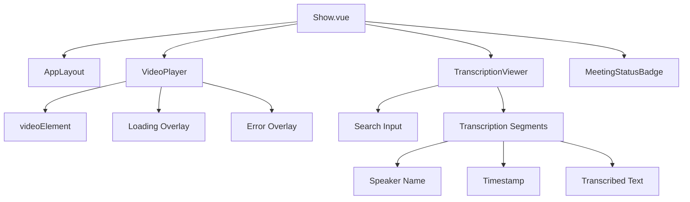
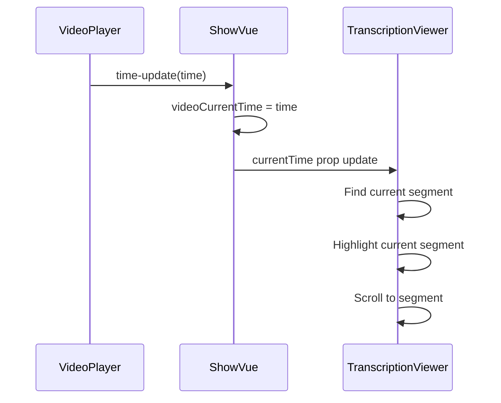
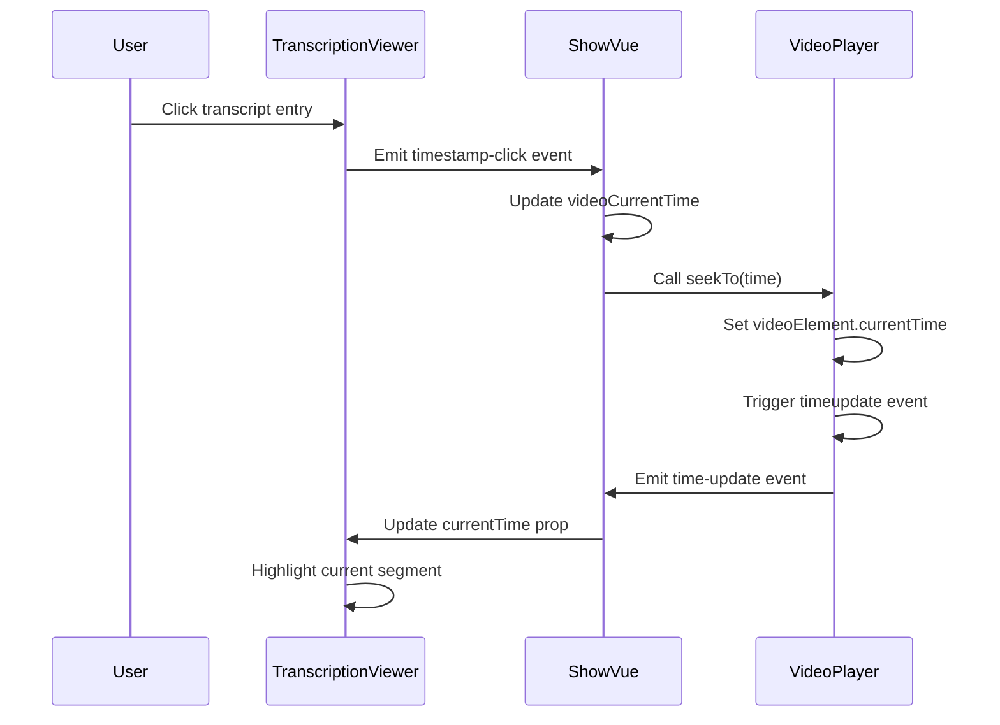

# Meeting Display


## Table of Contents
1. [Meeting Data Retrieval](#meeting-data-retrieval)
2. [Frontend Page Structure](#frontend-page-structure)
3. [Video and Transcription Synchronization](#video-and-transcription-synchronization)
4. [Data Transformation and Display](#data-transformation-and-display)
5. [User Interaction Flow](#user-interaction-flow)
6. [Common Issues and Troubleshooting](#common-issues-and-troubleshooting)
7. [Best Practices](#best-practices)

## Meeting Data Retrieval

The `MeetingController` retrieves a completed meeting and its associated transcription data through the `show` method, which is responsible for preparing the data sent to the frontend. The controller loads the meeting with its related `client` and `transcriptions`, ensuring transcriptions are ordered by start time.


```php
public function show(Meeting $meeting): Response
{
    try {
        $meeting->load(['client', 'transcriptions' => function ($query) {
            $query->orderBy('start_time');
        }]);
        
        $videoUrl = null;
        $videoError = null;
        
        if ($meeting->video_path) {
            if (Storage::disk('public')->exists($meeting->video_path)) {
                $videoUrl = asset('storage/' . $meeting->video_path);
            } else {
                $videoError = 'Video file not found. It may have been moved or deleted.';
            }
        } else {
            $videoError = 'No video file associated with this meeting.';
        }

        return Inertia::render('Meetings/Show', [
            'meeting' => $meeting,
            'videoUrl' => $videoUrl,
            'videoError' => $videoError
        ]);
    } catch (\Exception $e) {
        \Log::error('Failed to load meeting', [
            'meeting_id' => $meeting->id,
            'error' => $e->getMessage()
        ]);

        return redirect()->route('meetings.index')
            ->with('error', 'Failed to load meeting details. Please try again.');
    }
}
```


The `Meeting` model defines the relationship with transcriptions through the `transcriptions()` method, which establishes a one-to-many relationship with the `Transcription` model. The model also includes several computed attributes (appended values) that provide formatted time information for display, such as `formatted_elapsed_time`, `formatted_estimated_remaining_time`, and `formatted_estimated_processing_time`.

**Section sources**
- [MeetingController.php](file://app/Http/Controllers/MeetingController.php#L200-L304)
- [Meeting.php](file://app/Models/Meeting.php#L1-L179)

## Frontend Page Structure

The meeting display page is implemented in `Show.vue`, which uses a responsive layout to present the video player and transcription viewer. The page structure adapts based on screen size and meeting status, using a two-column layout on large screens when both video and transcription are available, and a single-column layout otherwise.

The component imports and uses several key subcomponents:
- `VideoPlayer.vue`: Handles video playback and controls
- `TranscriptionViewer.vue`: Displays and manages transcription segments
- `MeetingStatusBadge.vue`: Shows the current status of the meeting
- `AppLayout.vue`: Provides the overall application layout

The template includes conditional rendering for different meeting statuses:
- **Pending**: Shows a queued status with estimated processing time
- **Processing**: Displays progress with elapsed and remaining time
- **Completed**: Renders the video player and transcription viewer
- **Failed**: Shows error information





**Diagram sources**
- [Show.vue](file://resources/js/pages/Meetings/Show.vue#L0-L343)
- [VideoPlayer.vue](file://resources/js/lib/VideoPlayer.vue#L0-L247)
- [TranscriptionViewer.vue](file://resources/js/lib/TranscriptionViewer.vue#L0-L245)

**Section sources**
- [Show.vue](file://resources/js/pages/Meetings/Show.vue#L0-L343)

## Video and Transcription Synchronization

The synchronization between video playback and transcription segments is achieved through shared state management and event communication between components. The `Show.vue` component acts as the central coordinator, maintaining the current video time and propagating it to both the video player and transcription viewer.

The `VideoPlayer` component emits a `time-update` event whenever the video's current time changes, which is captured by the parent `Show.vue` component:


```javascript
const onVideoTimeUpdate = (time: number) => {
    videoCurrentTime.value = time
}
```


This current time is then passed as a prop to the `TranscriptionViewer` component, which uses it to determine which transcription segment is currently active:


```javascript
const currentSegment = computed(() => {
    return props.transcriptions.find(t =>
        props.currentTime >= t.start_time && props.currentTime <= t.end_time
    )
})
```


When the current segment changes, the `TranscriptionViewer` automatically scrolls the active segment into view:


```javascript
watch(currentSegment, (newSegment) => {
    if (newSegment) {
        const index = filteredTranscriptions.value.findIndex(t => t.id === newSegment.id)
        currentSegmentIndex.value = index
        scrollToCurrentSegment()
    }
})
```





**Diagram sources**
- [Show.vue](file://resources/js/pages/Meetings/Show.vue#L200-L343)
- [VideoPlayer.vue](file://resources/js/lib/VideoPlayer.vue#L0-L247)
- [TranscriptionViewer.vue](file://resources/js/lib/TranscriptionViewer.vue#L0-L245)

**Section sources**
- [Show.vue](file://resources/js/pages/Meetings/Show.vue#L200-L343)
- [VideoPlayer.vue](file://resources/js/lib/VideoPlayer.vue#L0-L247)
- [TranscriptionViewer.vue](file://resources/js/lib/TranscriptionViewer.vue#L0-L245)

## Data Transformation and Display

The data transformation process begins with the backend models and continues through the frontend components to present user-friendly information. The `Transcription` model in the backend provides accessor methods for formatting time values:


```php
public function getFormattedStartTimeAttribute(): string
{
    $minutes = floor($this->start_time / 60);
    $seconds = $this->start_time % 60;
    return sprintf('%02d:%05.2f', $minutes, $seconds);
}
```


However, the frontend handles most formatting to ensure consistency across components. Both `VideoPlayer` and `TranscriptionViewer` include `formatTime` utility functions that convert seconds into human-readable time strings:


```javascript
const formatTime = (seconds: number): string => {
    const hours = Math.floor(seconds / 3600)
    const minutes = Math.floor((seconds % 3600) / 60)
    const remainingSeconds = Math.floor(seconds % 60)
    
    if (hours > 0) {
        return `${hours}:${minutes.toString().padStart(2, '0')}:${remainingSeconds.toString().padStart(2, '0')}`
    }
    return `${minutes}:${remainingSeconds.toString().padStart(2, '0')}`
}
```


Each transcription segment is displayed with speaker identification, timestamp, duration, and the transcribed text. The `TranscriptionViewer` component renders segments with visual indicators for the current segment and search matches:


```vue
<div v-for="transcription in filteredTranscriptions" :key="transcription.id"
    :class="[
        'transcription-segment p-3 rounded-lg cursor-pointer transition-all duration-200',
        {
            'bg-blue-100 border-l-4 border-blue-500 shadow-sm': isCurrentSegment(transcription),
            'bg-white hover:bg-gray-100 border-l-4 border-transparent': !isCurrentSegment(transcription),
            'ring-2 ring-yellow-300': isSearchHighlighted(transcription)
        }
    ]">
    <div class="flex items-start justify-between mb-2">
        <div class="flex items-center space-x-2">
            <span class="font-medium text-gray-900 text-sm">
                {{ transcription.speaker || 'Unknown Speaker' }}
            </span>
            <span class="text-xs px-2 py-1 bg-gray-200 text-gray-600 rounded-full hover:bg-blue-200 transition-colors"
                :title="`Click to jump to ${formatTime(transcription.start_time)}`">
                {{ formatTime(transcription.start_time) }}
            </span>
        </div>
        <div class="text-xs text-gray-500">
            {{ formatDuration(transcription.end_time - transcription.start_time) }}
        </div>
    </div>
    <p class="text-gray-700 leading-relaxed" v-html="highlightSearchTerm(transcription.text)"></p>
</div>
```


**Section sources**
- [Transcription.php](file://app/Models/Transcription.php#L1-L51)
- [Show.vue](file://resources/js/pages/Meetings/Show.vue#L0-L343)
- [TranscriptionViewer.vue](file://resources/js/lib/TranscriptionViewer.vue#L0-L245)

## User Interaction Flow

The primary user interaction flow allows users to click on a transcript entry to seek the video to the corresponding timestamp. This interaction is implemented through event handling between components.

When a user clicks on a transcription segment, the `TranscriptionViewer` emits a `timestamp-click` event:


```javascript
const onTimestampClick = (time: number) => {
    emit('timestampClick', time)
}
```


The parent `Show.vue` component captures this event and updates the video player's position:


```javascript
const onTranscriptionTimestampClick = (time: number) => {
    videoCurrentTime.value = time
    if (videoPlayerRef.value) {
        videoPlayerRef.value.seekTo(time)
    }
}
```


The `VideoPlayer` component exposes a `seekTo` method that directly controls the HTML5 video element:


```javascript
const seekTo = (time: number) => {
    if (videoElement.value) {
        videoElement.value.currentTime = time
    }
}

defineExpose({
    seekTo,
    play,
    pause,
    videoElement
})
```


The component also provides navigation buttons to move between transcription segments:


```javascript
const goToPrevious = () => {
    if (transcriptionViewerRef.value) {
        transcriptionViewerRef.value.scrollToPrevious()
    }
}

const goToNext = () => {
    if (transcriptionViewerRef.value) {
        transcriptionViewerRef.value.scrollToNext()
    }
}
```





**Diagram sources**
- [Show.vue](file://resources/js/pages/Meetings/Show.vue#L200-L343)
- [TranscriptionViewer.vue](file://resources/js/lib/TranscriptionViewer.vue#L0-L245)
- [VideoPlayer.vue](file://resources/js/lib/VideoPlayer.vue#L0-L247)

**Section sources**
- [Show.vue](file://resources/js/pages/Meetings/Show.vue#L200-L343)
- [TranscriptionViewer.vue](file://resources/js/lib/TranscriptionViewer.vue#L0-L245)
- [VideoPlayer.vue](file://resources/js/lib/VideoPlayer.vue#L0-L247)

## Common Issues and Troubleshooting

### Missing Transcription Data
When transcription data is missing, the system handles it gracefully by displaying appropriate messages. In the `Show.vue` component, conditional rendering checks for the presence of transcriptions:


```vue
<div v-if="!meeting.transcriptions || meeting.transcriptions.length === 0" 
     class="text-center py-8 text-gray-500">
    <p>No transcription available for this meeting.</p>
</div>
```


The backend ensures transcriptions are loaded with the meeting data, but if none exist, the frontend displays a clear message to the user.

### Desynchronized Playback
Desynchronization between video and transcription can occur due to network latency or timing inaccuracies. The system mitigates this by:
1. Using the video element's native `timeupdate` event for accurate timing
2. Debouncing rapid time updates to prevent excessive re-rendering
3. Implementing a watch on the `currentTime` prop to ensure the video player stays synchronized


```javascript
watch(() => props.currentTime, (newTime) => {
    if (videoElement.value && Math.abs(videoElement.value.currentTime - newTime) > 1) {
        videoElement.value.currentTime = newTime
    }
})
```


### Rendering Performance with Large Transcripts
For meetings with extensive transcription data, the system implements several performance optimizations:
- Virtual scrolling is not implemented, but the container has a fixed height with overflow
- Search functionality filters the displayed segments, reducing the number of rendered elements
- Computed properties efficiently filter and process transcription data


```javascript
const filteredTranscriptions = computed(() => {
    if (!searchQuery.value.trim()) {
        return props.transcriptions
    }

    const query = searchQuery.value.toLowerCase()
    return props.transcriptions.filter(t =>
        t.text.toLowerCase().includes(query) ||
        t.speaker.toLowerCase().includes(query)
    )
})
```


The component also uses Vue's `v-for` with unique keys and efficient reactivity to minimize unnecessary re-renders.

**Section sources**
- [Show.vue](file://resources/js/pages/Meetings/Show.vue#L0-L343)
- [TranscriptionViewer.vue](file://resources/js/lib/TranscriptionViewer.vue#L0-L245)
- [VideoPlayer.vue](file://resources/js/lib/VideoPlayer.vue#L0-L247)

## Best Practices

### Optimizing Data Loading
To optimize data loading, consider implementing:
- Lazy loading of transcription data for very long meetings
- Pagination or virtual scrolling for large transcript sets
- Caching of processed meeting data to reduce database queries


```javascript
// Example: Add caching to MeetingController
public function show(Meeting $meeting): Response
{
    $cacheKey = "meeting_display_{$meeting->id}";
    $cacheDuration = now()->addMinutes(5);
    
    $data = Cache::remember($cacheKey, $cacheDuration, function () use ($meeting) {
        $meeting->load(['client', 'transcriptions' => function ($query) {
            $query->orderBy('start_time');
        }]);
        
        return [
            'meeting' => $meeting,
            'videoUrl' => $this->getVideoUrl($meeting),
            'videoError' => null
        ];
    });
    
    return Inertia::render('Meetings/Show', $data);
}
```


### Client-Side Search within Transcripts
The current implementation includes a robust client-side search feature that highlights matching text using HTML markup:


```javascript
const highlightSearchTerm = (text: string): string => {
    if (!searchQuery.value.trim()) return text

    const query = searchQuery.value.trim()
    const regex = new RegExp(`(${query})`, 'gi')
    return text.replace(regex, '<mark class="bg-yellow-200 px-1 rounded">$1</mark>')
}
```


Additional enhancements could include:
- Case-sensitive search toggle
- Whole word matching option
- Search result counters and navigation

### Enhancing Accessibility for Screen Readers
To improve accessibility, implement the following enhancements:


```vue
<!-- Add ARIA labels and roles -->
<div role="region" aria-label="Video Player" class="video-player-container">
    <video
        ref="videoElement"
        aria-label="Meeting video"
        controls
    >
</video>
</div>

<div role="region" aria-label="Transcription" class="transcription-viewer">
    <div v-for="transcription in filteredTranscriptions" 
         :key="transcription.id"
         role="button"
         tabindex="0"
         aria-label="Go to ${formatTime(transcription.start_time)} - ${transcription.speaker}"
         @click="onTimestampClick(transcription.start_time)"
         @keydown.enter="onTimestampClick(transcription.start_time)"
         @keydown.space="onTimestampClick(transcription.start_time)">
</div>
</div>
```


Additional accessibility improvements:
- Ensure keyboard navigation works for all interactive elements
- Provide sufficient color contrast for text and background
- Use semantic HTML elements appropriately
- Add screen reader-only text for contextual information
- Implement proper focus management during navigation

**Section sources**
- [Show.vue](file://resources/js/pages/Meetings/Show.vue#L0-L343)
- [TranscriptionViewer.vue](file://resources/js/lib/TranscriptionViewer.vue#L0-L245)
- [VideoPlayer.vue](file://resources/js/lib/VideoPlayer.vue#L0-L247)

**Referenced Files in This Document**   
- [MeetingController.php](file://app/Http/Controllers/MeetingController.php#L200-L304)
- [Meeting.php](file://app/Models/Meeting.php#L1-L179)
- [Transcription.php](file://app/Models/Transcription.php#L1-L51)
- [Show.vue](file://resources/js/pages/Meetings/Show.vue#L0-L343)
- [VideoPlayer.vue](file://resources/js/lib/VideoPlayer.vue#L0-L247)
- [TranscriptionViewer.vue](file://resources/js/lib/TranscriptionViewer.vue#L0-L245)