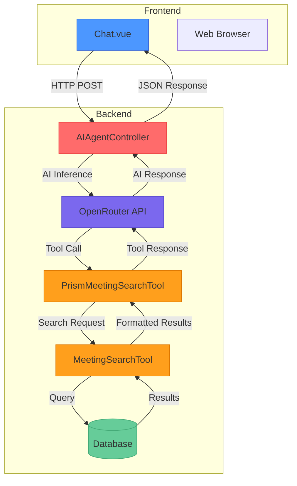
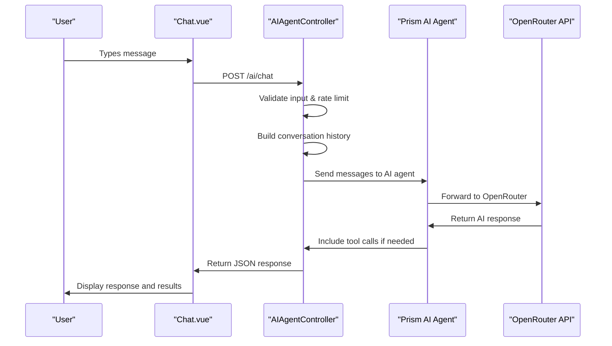
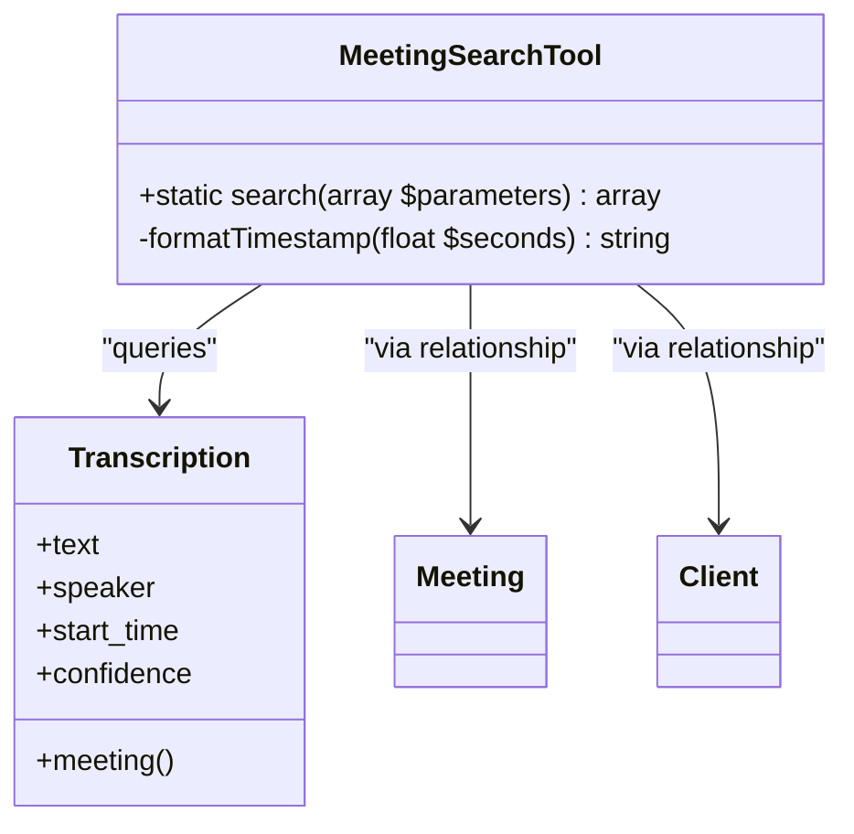
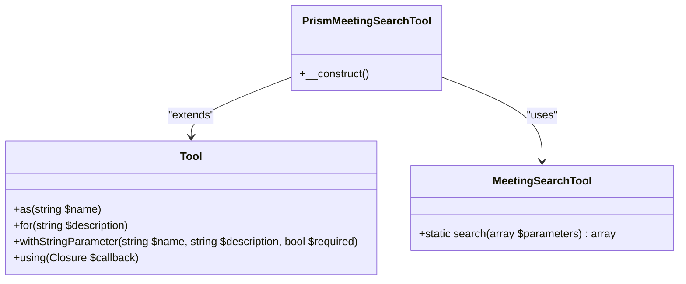
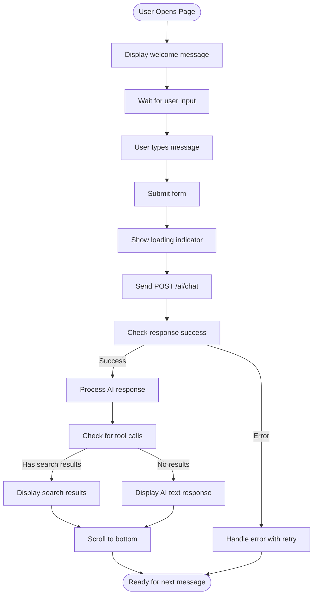
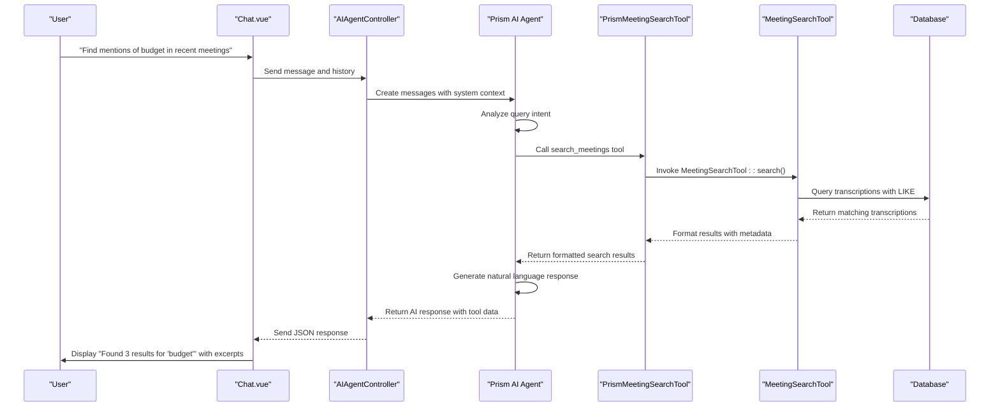
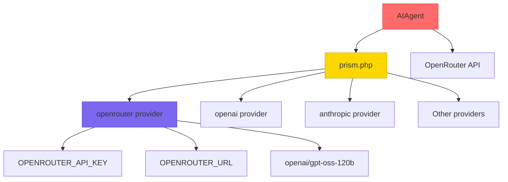
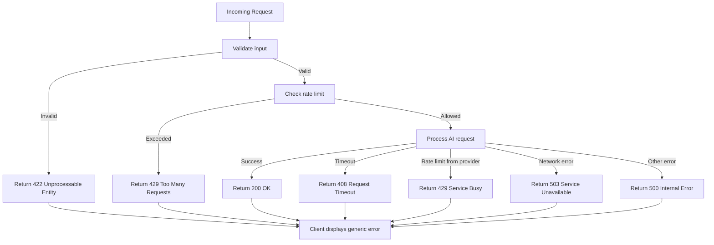

# AI Integration

## Table of Contents
1. [AI Integration Overview](#ai-integration-overview)
2. [Core Components](#core-components)
3. [Architecture Overview](#architecture-overview)
4. [Detailed Component Analysis](#detailed-component-analysis)
5. [Tool Calling and Search Flow](#tool-calling-and-search-flow)
6. [Configuration and External Services](#configuration-and-external-services)
7. [Error Handling and Rate Limiting](#error-handling-and-rate-limiting)
8. [Best Practices and Troubleshooting](#best-practices-and-troubleshooting)

## AI Integration Overview
The AI Integration feature enables users to query transcribed meeting content using natural language. The system leverages an AI agent powered by the Prism framework to interpret user queries, invoke search tools, and return contextual responses with timestamped excerpts. This integration connects frontend chat interfaces with backend AI inference and database search capabilities to deliver a seamless conversational experience for retrieving meeting insights.

## Core Components
The AI integration consists of several key components that work together to process natural language queries and return relevant meeting content:
- **AIAgentController**: Handles incoming chat requests and orchestrates AI inference
- **PrismMeetingSearchTool**: AI tool that enables searching through meeting transcriptions
- **MeetingSearchTool**: Backend service that performs database queries on transcribed content
- **Chat.vue**: Frontend component that renders the chat interface and displays results
- **prism.php**: Configuration file for AI service providers including OpenRouter

These components form a complete pipeline from user input to AI-generated responses with embedded search results.

**Section sources**
- [AIAgentController.php](file://app/Http/Controllers/AIAgentController.php#L1-L183)
- [PrismMeetingSearchTool.php](file://app/Tools/PrismMeetingSearchTool.php#L1-L50)
- [MeetingSearchTool.php](file://app/Tools/MeetingSearchTool.php#L1-L86)
- [Chat.vue](file://resources/js/pages/AI/Chat.vue#L1-L307)

## Architecture Overview
The AI integration follows a client-server architecture with a clear separation between frontend and backend components. The system processes natural language queries through an AI agent that can invoke specialized tools to search meeting content.

**Diagram sources**
- [AIAgentController.php](file://app/Http/Controllers/AIAgentController.php#L1-L183)
- [PrismMeetingSearchTool.php](file://app/Tools/PrismMeetingSearchTool.php#L1-L50)
- [MeetingSearchTool.php](file://app/Tools/MeetingSearchTool.php#L1-L86)
- [Chat.vue](file://resources/js/pages/AI/Chat.vue#L1-L307)

## Detailed Component Analysis

### AIAgentController Analysis
The AIAgentController handles all AI-related HTTP requests, serving as the entry point for the AI integration. It has three main methods: index() for rendering the chat interface, chat() for processing natural language queries, and search() for direct search requests.

The chat() method validates user input, implements rate limiting, constructs a conversation history with system context, and routes the query to the Prism AI agent. It includes comprehensive error handling for validation, timeouts, rate limits, and network issues.

**Diagram sources**
- [AIAgentController.php](file://app/Http/Controllers/AIAgentController.php#L1-L183)

**Section sources**
- [AIAgentController.php](file://app/Http/Controllers/AIAgentController.php#L1-L183)

### MeetingSearchTool Analysis
The MeetingSearchTool provides the core functionality for searching transcribed meeting content. It queries the database for transcription records that match the search criteria, with support for filtering by client, speaker, and result limits.

The tool returns structured results with highlighted search terms, formatted timestamps, and metadata about each meeting. It handles errors gracefully and returns user-friendly error messages when searches fail.

**Diagram sources**
- [MeetingSearchTool.php](file://app/Tools/MeetingSearchTool.php#L1-L86)

**Section sources**
- [MeetingSearchTool.php](file://app/Tools/MeetingSearchTool.php#L1-L86)

### PrismMeetingSearchTool Analysis
The PrismMeetingSearchTool acts as a bridge between the AI agent and the backend search functionality. It extends the Prism Tool class and defines the interface that the AI agent uses to search meeting content.

This tool specifies the parameters available for search (query, client_id, speaker, limit) and their validation rules. When invoked by the AI agent, it calls the MeetingSearchTool and formats the results in a way that the AI can understand and incorporate into its response.

**Diagram sources**
- [PrismMeetingSearchTool.php](file://app/Tools/PrismMeetingSearchTool.php#L1-L50)

**Section sources**
- [PrismMeetingSearchTool.php](file://app/Tools/PrismMeetingSearchTool.php#L1-L50)

### Chat.vue Analysis
The Chat.vue component provides the user interface for interacting with the AI assistant. It displays a chat interface where users can type queries and receive responses with embedded search results.

The component manages the conversation state, handles form submission, displays loading indicators, and formats search results with clickable links to specific timestamps in meeting recordings. It includes error handling with retry functionality and toast notifications.

**Diagram sources**
- [Chat.vue](file://resources/js/pages/AI/Chat.vue#L1-L307)

**Section sources**
- [Chat.vue](file://resources/js/pages/AI/Chat.vue#L1-L307)

## Tool Calling and Search Flow
The tool calling process enables the AI agent to search meeting content when needed to answer user queries. This flow demonstrates how natural language queries are converted into database searches and back into conversational responses.

**Diagram sources**
- [AIAgentController.php](file://app/Http/Controllers/AIAgentController.php#L1-L183)
- [PrismMeetingSearchTool.php](file://app/Tools/PrismMeetingSearchTool.php#L1-L50)
- [MeetingSearchTool.php](file://app/Tools/MeetingSearchTool.php#L1-L86)
- [Chat.vue](file://resources/js/pages/AI/Chat.vue#L1-L307)

## Configuration and External Services
The AI integration is configured through the prism.php configuration file, which defines the available AI providers including OpenRouter. The system uses OpenRouter API for AI inference, allowing access to various large language models.

**Diagram sources**
- [prism.php](file://config/prism.php#L1-L56)

**Section sources**
- [prism.php](file://config/prism.php#L1-L56)

## Error Handling and Rate Limiting
The AI integration includes comprehensive error handling and rate limiting to ensure reliability and prevent abuse. The system handles various error types with appropriate user feedback and implements both client-side and server-side protections.

**Diagram sources**
- [AIAgentController.php](file://app/Http/Controllers/AIAgentController.php#L1-L183)

**Section sources**
- [AIAgentController.php](file://app/Http/Controllers/AIAgentController.php#L1-L183)

## Best Practices and Troubleshooting

### Common Issues and Solutions
**Delayed AI Responses**
- *Cause*: Network latency, AI provider processing time, or complex queries requiring multiple tool calls
- *Solution*: Implement client-side loading indicators and optimize queries to be more specific

**Irrelevant Search Results**
- *Cause*: Broad search queries or limitations in the LIKE-based text search
- *Solution*: Use more specific keywords and leverage filters (client, speaker) when available

**Tool Execution Errors**
- *Cause*: Database connectivity issues, malformed parameters, or permission problems
- *Solution*: Check server logs, validate input parameters, and ensure database connectivity

### Best Practices for Effective Queries
- **Be specific**: Instead of "What was discussed about the project?", ask "What did Sarah say about the Q3 project timeline?"
- **Use keywords**: Focus on specific terms like "budget", "deadline", "requirements" rather than general topics
- **Leverage filters**: Include client or speaker names when searching across multiple meetings
- **Keep queries concise**: Stay under the 1000-character limit for optimal processing

### Handling Rate Limits
The system implements rate limiting at multiple levels:
- **Client-side**: Retry logic with exponential backoff (up to 3 attempts)
- **Server-side**: 10 requests per minute per IP address
- **Provider-side**: OpenRouter API rate limits (handled with appropriate error responses)

When encountering rate limits, users should wait a few moments before retrying their request. For high-volume use cases, consider implementing user authentication to track limits per user rather than per IP address.

**Section sources**
- [AIAgentController.php](file://app/Http/Controllers/AIAgentController.php#L1-L183)
- [Chat.vue](file://resources/js/pages/AI/Chat.vue#L1-L307)

**Referenced Files in This Document**   
- [AIAgentController.php](file://app/Http/Controllers/AIAgentController.php)
- [MeetingSearchTool.php](file://app/Tools/MeetingSearchTool.php)
- [PrismMeetingSearchTool.php](file://app/Tools/PrismMeetingSearchTool.php)
- [prism.php](file://config/prism.php)
- [Chat.vue](file://resources/js/pages/AI/Chat.vue)