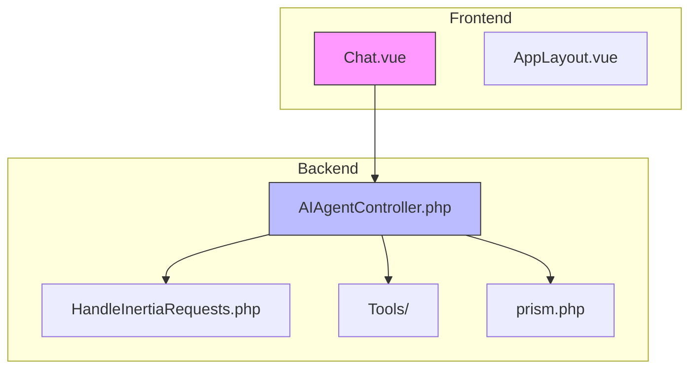
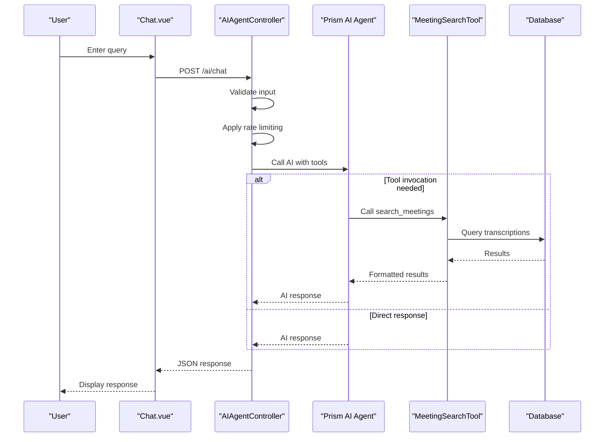
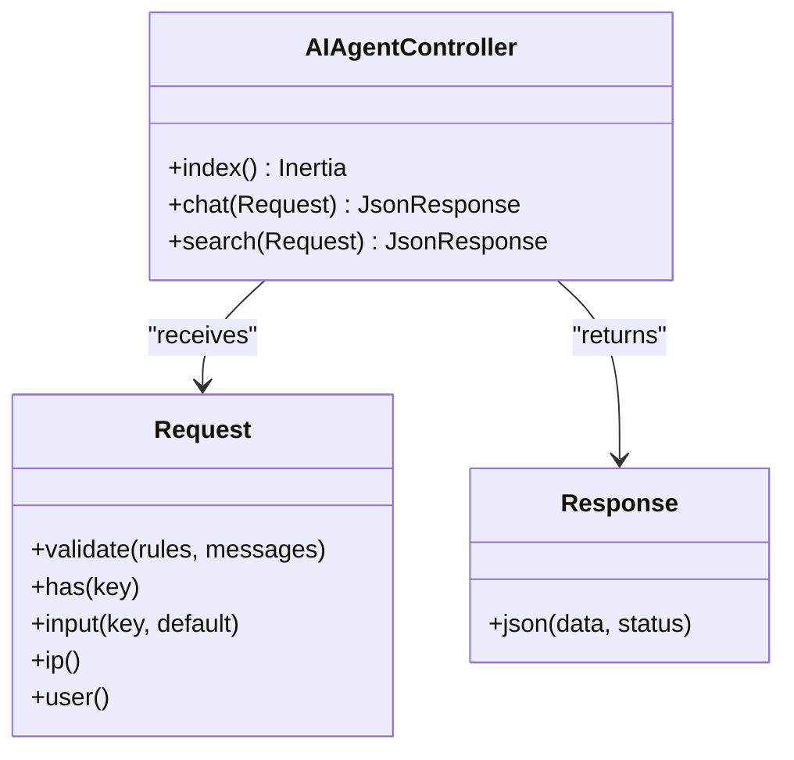
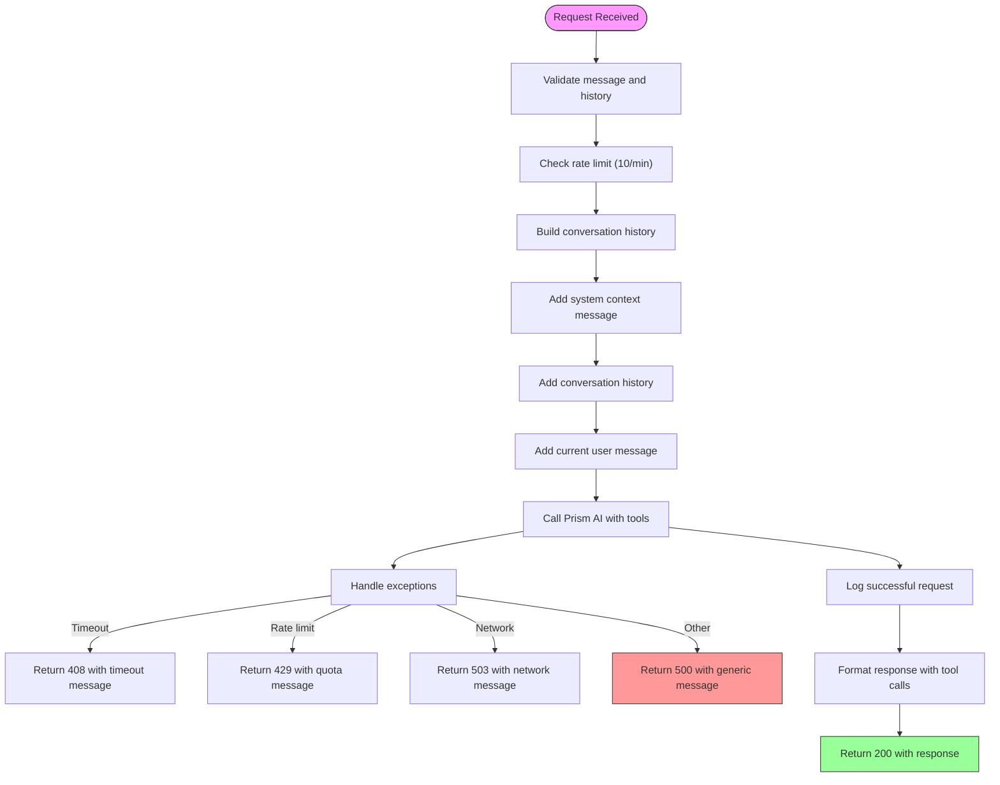
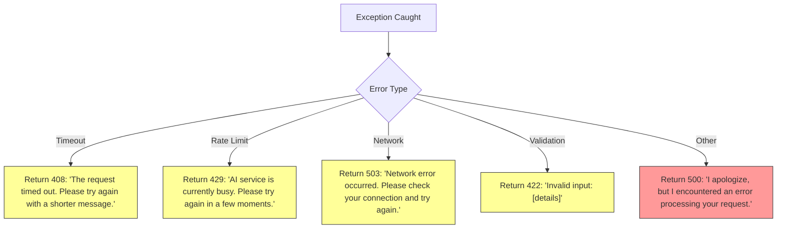
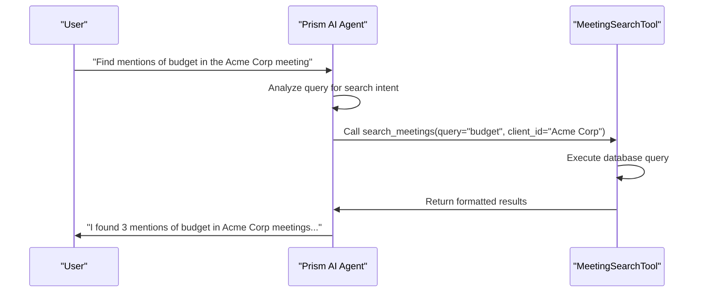
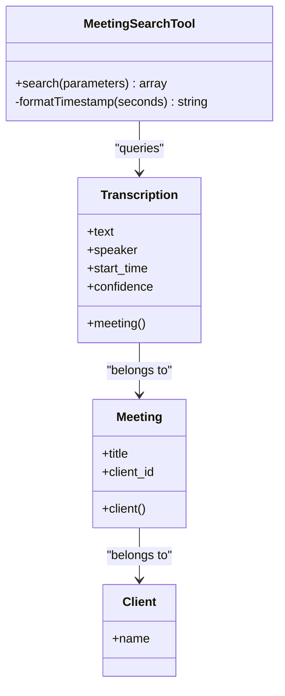
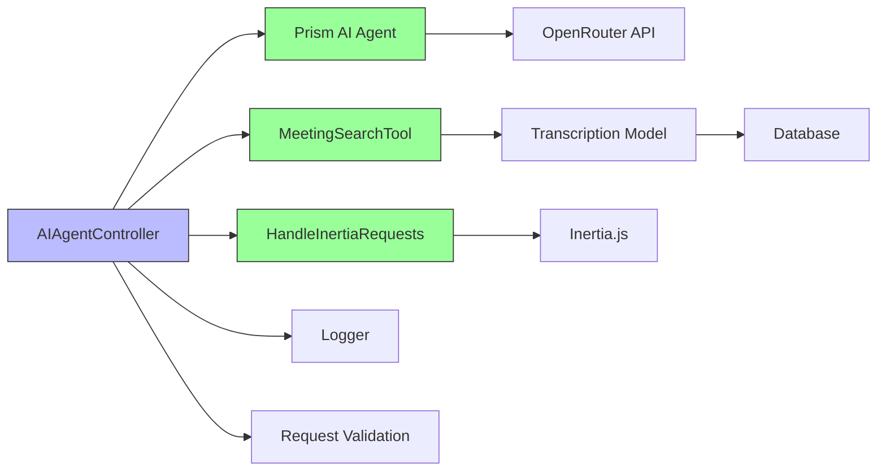

# AI Agent Controller


## Table of Contents
1. [Introduction](#introduction)
2. [Project Structure](#project-structure)
3. [Core Components](#core-components)
4. [Architecture Overview](#architecture-overview)
5. [Detailed Component Analysis](#detailed-component-analysis)
6. [Dependency Analysis](#dependency-analysis)
7. [Performance Considerations](#performance-considerations)
8. [Troubleshooting Guide](#troubleshooting-guide)
9. [Conclusion](#conclusion)

## Introduction
The AIAgentController serves as the central backend entry point for all AI-related interactions in the MeetingAI platform. It receives natural language queries from the frontend Chat.vue component, validates input, and orchestrates AI processing through the Prism framework using the OpenRouter API. The controller manages two primary endpoints: chat and search. The chat endpoint enables conversational AI interactions with integrated tool calling (specifically MeetingSearchTool), while the search endpoint provides direct access to meeting transcription search functionality. This document provides a comprehensive analysis of the controller's implementation, request/response flows, error handling, and integration with supporting components.

## Project Structure
The MeetingAI application follows a standard Laravel MVC architecture with clear separation of concerns. The AI functionality is centered around the AIAgentController in the controllers directory, with supporting tools in the Tools namespace. Frontend components are organized in the resources/js/pages/AI directory, while configuration for the AI integration is maintained in the config directory.





**Diagram sources**
- [AIAgentController.php](file://app/Http/Controllers/AIAgentController.php)
- [Chat.vue](file://resources/js/pages/AI/Chat.vue)

**Section sources**
- [AIAgentController.php](file://app/Http/Controllers/AIAgentController.php)
- [Chat.vue](file://resources/js/pages/AI/Chat.vue)

## Core Components
The core components of the AI system include the AIAgentController which handles HTTP requests, the PrismMeetingSearchTool which enables the AI to search meeting transcriptions, and the MeetingSearchTool which performs the actual database queries. The system uses Inertia.js for frontend integration and OpenRouter as the AI provider. The controller implements rate limiting, input validation, and comprehensive error handling to ensure reliable operation.

**Section sources**
- [AIAgentController.php](file://app/Http/Controllers/AIAgentController.php#L15-L182)
- [PrismMeetingSearchTool.php](file://app/Tools/PrismMeetingSearchTool.php#L1-L50)
- [MeetingSearchTool.php](file://app/Tools/MeetingSearchTool.php#L1-L86)

## Architecture Overview
The AI architecture follows a request-response pattern with tool integration. When a user submits a query in the Chat interface, the request flows through the HandleInertiaRequests middleware to the AIAgentController. The controller validates the input, applies rate limiting, and constructs a conversation with system context. It then invokes the Prism AI agent with the MeetingSearchTool registered, allowing the AI to call this tool when needed. The AI response is formatted and returned to the frontend for display.





**Diagram sources**
- [AIAgentController.php](file://app/Http/Controllers/AIAgentController.php#L22-L142)
- [Chat.vue](file://resources/js/pages/AI/Chat.vue#L1-L307)
- [PrismMeetingSearchTool.php](file://app/Tools/PrismMeetingSearchTool.php#L1-L50)

## Detailed Component Analysis

### AIAgentController Analysis
The AIAgentController handles AI interactions through two primary methods: chat and search. The chat method processes natural language queries, while the search method provides direct access to meeting search functionality.

#### Controller Methods




**Diagram sources**
- [AIAgentController.php](file://app/Http/Controllers/AIAgentController.php#L15-L182)

#### Chat Endpoint Implementation
The chat endpoint implements a comprehensive workflow for handling AI interactions:





**Diagram sources**
- [AIAgentController.php](file://app/Http/Controllers/AIAgentController.php#L22-L105)

**Section sources**
- [AIAgentController.php](file://app/Http/Controllers/AIAgentController.php#L22-L105)

#### Request/Response Formats
The chat endpoint expects and returns the following JSON structures:

**Request Payload**

```json
{
  "message": "Find mentions of budget in recent meetings",
  "conversation_history": [
    {
      "role": "user",
      "content": "What did John say about the project timeline?"
    },
    {
      "role": "assistant",
      "content": "John mentioned the project timeline during the Q2 planning meeting..."
    }
  ]
}
```


**Successful Response**

```json
{
  "success": true,
  "response": "I found several mentions of budget in recent meetings...",
  "tool_calls": [
    {
      "name": "search_meetings",
      "arguments": {
        "query": "budget",
        "limit": 10
      },
      "result": {
        "results": [
          {
            "meeting_id": 22,
            "meeting_title": "Q2 Planning",
            "client_name": "Acme Corp",
            "speaker": "John Smith",
            "text": "We need to **budget** carefully for the upcoming quarter",
            "timestamp": 1234.5,
            "formatted_timestamp": "20:34:30",
            "confidence": 0.95,
            "meeting_url": "/meetings/22"
          }
        ]
      }
    }
  ]
}
```


**Error Response**

```json
{
  "success": false,
  "error": "Too many requests. Please wait a moment before sending another message."
}
```


**Section sources**
- [AIAgentController.php](file://app/Http/Controllers/AIAgentController.php#L22-L105)
- [Chat.vue](file://resources/js/pages/AI/Chat.vue#L1-L307)

#### Authentication and Security
The AIAgentController leverages Laravel's built-in authentication and CSRF protection:

- **CSRF Protection**: The frontend includes the CSRF token from the shared props in all requests
- **Rate Limiting**: Basic IP-based rate limiting (10 requests per minute)
- **Input Validation**: Server-side validation of message content and conversation history
- **Shared Data**: The HandleInertiaRequests middleware provides the CSRF token to the frontend


```php
// CSRF token provided to frontend
'csrf_token' => fn () => csrf_token(),
```


**Section sources**
- [AIAgentController.php](file://app/Http/Controllers/AIAgentController.php#L22-L105)
- [HandleInertiaRequests.php](file://app/Http/Middleware/HandleInertiaRequests.php#L1-L68)

#### Error Handling Strategies
The controller implements comprehensive error handling with specific responses for different error types:





The system also logs detailed error information including the message, stack trace, and client IP for debugging purposes.

**Section sources**
- [AIAgentController.php](file://app/Http/Controllers/AIAgentController.php#L85-L105)

### Tool Integration Analysis
The AI agent's ability to search meeting transcriptions is enabled through the tool integration system.

#### Tool Selection and Execution
The Prism AI agent uses function calling to determine when to invoke the MeetingSearchTool based on the user's query:





**Diagram sources**
- [PrismMeetingSearchTool.php](file://app/Tools/PrismMeetingSearchTool.php#L1-L50)
- [MeetingSearchTool.php](file://app/Tools/MeetingSearchTool.php#L1-L86)

#### MeetingSearchTool Implementation
The MeetingSearchTool provides the actual search functionality:





**Diagram sources**
- [MeetingSearchTool.php](file://app/Tools/MeetingSearchTool.php#L1-L86)

The search method implements the following logic:
1. Validates input parameters
2. Builds a database query with optional filters for client and speaker
3. Searches transcription text using LIKE operator
4. Formats results with highlighted search terms and timestamps
5. Returns structured data for the AI to consume

**Section sources**
- [MeetingSearchTool.php](file://app/Tools/MeetingSearchTool.php#L1-L86)

#### PrismMeetingSearchTool Integration
The PrismMeetingSearchTool acts as an adapter between the AI agent and the MeetingSearchTool:


```php
$this->as('search_meetings')
    ->for('Search through meeting transcriptions to find specific content, topics, or keywords')
    ->withStringParameter('query', 'The search query to find in meeting transcriptions', true)
    ->withStringParameter('client_id', 'Optional client ID to filter search results to specific client meetings', false)
    ->withStringParameter('speaker', 'Optional speaker name to filter results to specific speaker', false)
    ->withStringParameter('limit', 'Maximum number of results to return (default: 10)', false)
```


This configuration exposes the search functionality to the AI agent with clear parameter definitions and descriptions.

**Section sources**
- [PrismMeetingSearchTool.php](file://app/Tools/PrismMeetingSearchTool.php#L1-L50)

## Dependency Analysis
The AIAgentController depends on several key components to provide its functionality:





**Diagram sources**
- [AIAgentController.php](file://app/Http/Controllers/AIAgentController.php)
- [PrismMeetingSearchTool.php](file://app/Tools/PrismMeetingSearchTool.php)
- [MeetingSearchTool.php](file://app/Tools/MeetingSearchTool.php)

The controller has direct dependencies on:
- **Prism AI Agent**: For processing natural language and tool calling
- **MeetingSearchTool**: For searching meeting transcriptions
- **HandleInertiaRequests**: For middleware processing and shared data
- **Logger**: For logging requests and errors
- **Request Validation**: For input validation
- **Cache**: For rate limiting implementation

**Section sources**
- [AIAgentController.php](file://app/Http/Controllers/AIAgentController.php#L15-L182)

## Performance Considerations
The AI system implements several performance optimizations:

- **Rate Limiting**: Prevents abuse and ensures fair usage (10 requests per minute per IP)
- **Input Validation**: Limits message length (1000 characters) and conversation history (50 messages)
- **Caching**: Uses Laravel's cache system for rate limiting counters
- **Logging**: Logs processing time and response sizes for monitoring
- **Timeout Handling**: Implements proper error responses for timeout scenarios

The system also faces potential performance challenges:
- **AI Latency**: External API calls may introduce delays
- **Database Queries**: Full-text search on transcription text could be slow with large datasets
- **Network Reliability**: Dependence on external AI services

Best practices for addressing these include:
- Implementing proper retry logic with exponential backoff
- Adding response caching for common queries
- Monitoring processing times and scaling resources as needed
- Using database indexing to optimize search performance

## Troubleshooting Guide
Common issues and their solutions:

**Timeout Errors (408)**
- **Cause**: AI service took too long to respond
- **Solution**: Try with a shorter message or query
- **Frontend Handling**: Retry with exponential backoff up to 3 times

**Rate Limiting (429)**
- **Cause**: More than 10 requests in one minute from the same IP
- **Solution**: Wait a moment before sending another message
- **Configuration**: Rate limit threshold is configurable in the controller

**Network Errors (503)**
- **Cause**: Connection issues with AI service or database
- **Solution**: Check network connectivity and retry
- **Monitoring**: Check service status and logs

**Empty Search Results**
- **Cause**: No matches found for the query
- **Solution**: Try different keywords or broaden the search
- **Note**: The system returns a success response with empty results rather than an error

**Malformed AI Responses**
- **Cause**: AI service returned unexpected format
- **Solution**: The system catches exceptions and returns appropriate error messages
- **Debugging**: Check logs for detailed error information

**Section sources**
- [AIAgentController.php](file://app/Http/Controllers/AIAgentController.php#L85-L105)
- [Chat.vue](file://resources/js/pages/AI/Chat.vue#L1-L307)

## Conclusion
The AIAgentController provides a robust foundation for AI-powered meeting analysis, effectively bridging the frontend interface with AI capabilities and database functionality. Its implementation demonstrates best practices in API design, including proper input validation, rate limiting, comprehensive error handling, and clear request/response formats. The integration with the Prism AI agent and MeetingSearchTool enables powerful natural language search capabilities, allowing users to find specific information in meeting transcriptions through conversational queries. The system's modular design makes it extensible for additional tools and features while maintaining reliability and performance.

**Referenced Files in This Document**   
- [AIAgentController.php](file://app/Http/Controllers/AIAgentController.php)
- [Chat.vue](file://resources/js/pages/AI/Chat.vue)
- [MeetingSearchTool.php](file://app/Tools/MeetingSearchTool.php)
- [PrismMeetingSearchTool.php](file://app/Tools/PrismMeetingSearchTool.php)
- [HandleInertiaRequests.php](file://app/Http/Middleware/HandleInertiaRequests.php)
- [prism.php](file://config/prism.php)