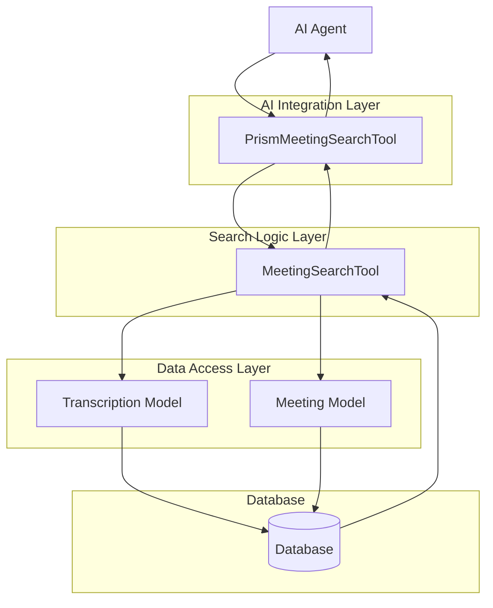
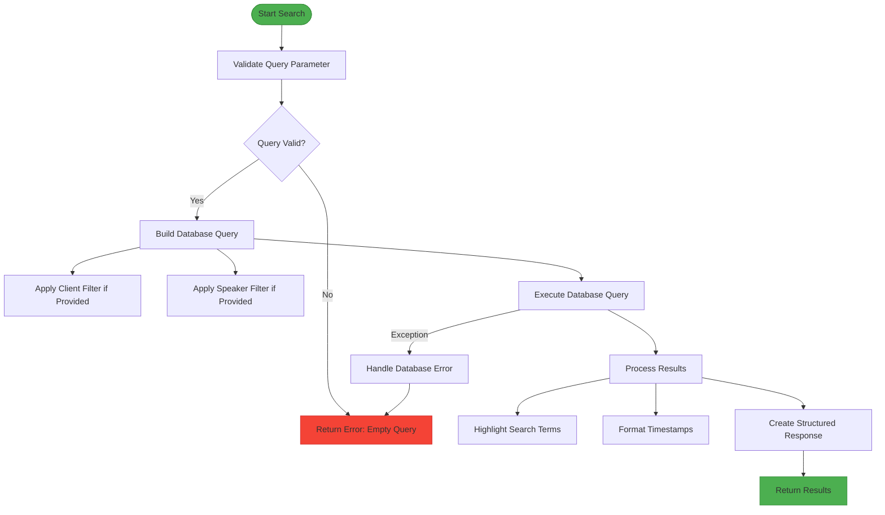
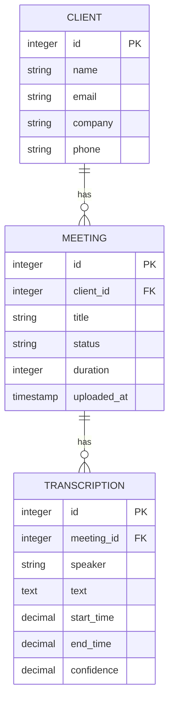
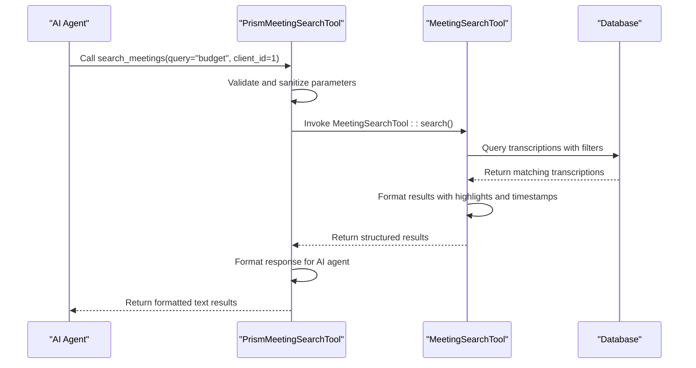
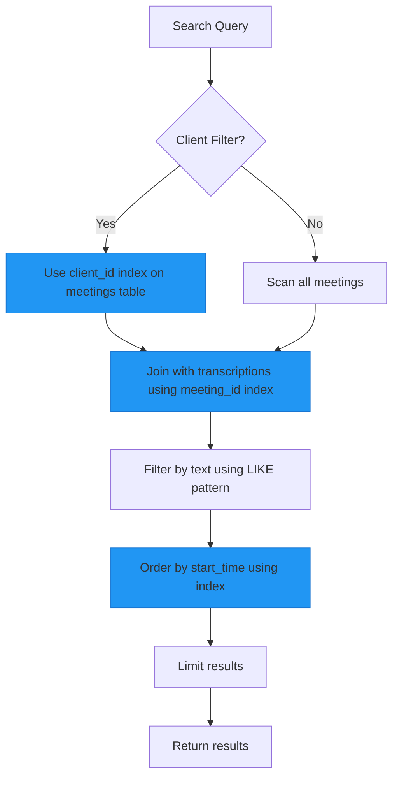

# Meeting Search Tool

## Table of Contents
1. [Introduction](#introduction)
2. [Core Components](#core-components)
3. [Architecture Overview](#architecture-overview)
4. [Detailed Component Analysis](#detailed-component-analysis)
5. [Integration with AI Agent](#integration-with-ai-agent)
6. [Performance Considerations](#performance-considerations)
7. [Troubleshooting Guide](#troubleshooting-guide)
8. [Extension Possibilities](#extension-possibilities)

## Introduction
The Meeting Search Tool is a critical component of the MeetingAI platform that enables natural language search across transcribed meeting content. This tool allows users and AI agents to find specific topics, keywords, or discussions within recorded meetings by searching through transcribed text, speaker information, and client context. The system is designed to provide relevant excerpts with timestamps, enabling quick navigation to important discussion points. The tool integrates seamlessly with the Prism AI agent framework, allowing conversational queries about meeting content.

## Core Components
The Meeting Search Tool consists of two primary components: the core search functionality implemented in `MeetingSearchTool.php` and the AI integration layer in `PrismMeetingSearchTool.php`. These components work together to provide a robust search capability that can be invoked through both direct API calls and AI-driven conversations. The search functionality leverages Laravel's Eloquent ORM to query the database efficiently, applying filters for clients, speakers, and keywords while retrieving relevant transcription excerpts with contextual information.

**Section sources**
- [MeetingSearchTool.php](file://app/Tools/MeetingSearchTool.php#L1-L85)
- [PrismMeetingSearchTool.php](file://app/Tools/PrismMeetingSearchTool.php#L1-L49)

## Architecture Overview
The Meeting Search Tool follows a layered architecture pattern, with clear separation between the AI integration layer, business logic, and data access components. The tool is invoked by the AI agent through the Prism framework, which translates natural language queries into structured function calls. The search logic processes these parameters, queries the database through Eloquent models, and returns formatted results that can be presented to users.

**Diagram sources**
- [PrismMeetingSearchTool.php](file://app/Tools/PrismMeetingSearchTool.php#L1-L49)
- [MeetingSearchTool.php](file://app/Tools/MeetingSearchTool.php#L1-L85)
- [Transcription.php](file://app/Models/Transcription.php#L1-L50)
- [Meeting.php](file://app/Models/Meeting.php#L1-L178)

## Detailed Component Analysis

### MeetingSearchTool Analysis
The `MeetingSearchTool` class provides the core search functionality through its static `search` method. This method accepts an array of parameters including the search query, client ID, speaker name, and result limit. The implementation includes input validation, database querying with appropriate filters, and result formatting.

**Diagram sources**
- [MeetingSearchTool.php](file://app/Tools/MeetingSearchTool.php#L1-L85)

**Section sources**
- [MeetingSearchTool.php](file://app/Tools/MeetingSearchTool.php#L1-L85)

### Data Model Relationships
The search functionality relies on the relationship between the `Transcription`, `Meeting`, and `Client` models. Each transcription belongs to a meeting, and each meeting belongs to a client. This relationship chain allows the search tool to retrieve not only the transcribed text but also the meeting title and client name, providing rich context for search results.

**Diagram sources**
- [Client.php](file://app/Models/Client.php#L1-L27)
- [Meeting.php](file://app/Models/Meeting.php#L1-L178)
- [Transcription.php](file://app/Models/Transcription.php#L1-L50)

## Integration with AI Agent

### PrismMeetingSearchTool Implementation
The `PrismMeetingSearchTool` class implements the interface required by the Prism AI agent framework. It defines the tool schema with parameters for query, client_id, speaker, and limit, specifying which parameters are required and their descriptions. The tool uses a closure to process the AI agent's function call, validate and sanitize input parameters, invoke the core `MeetingSearchTool::search` method, and format the results for presentation to the user.

**Diagram sources**
- [PrismMeetingSearchTool.php](file://app/Tools/PrismMeetingSearchTool.php#L1-L49)
- [MeetingSearchTool.php](file://app/Tools/MeetingSearchTool.php#L1-L85)

**Section sources**
- [PrismMeetingSearchTool.php](file://app/Tools/PrismMeetingSearchTool.php#L1-L49)

### AIAgentController Integration
The `AIAgentController` integrates the search tool into the application's AI capabilities by registering the `PrismMeetingSearchTool` when making requests to the AI service. The controller handles user messages, maintains conversation history, and processes the AI response, which may include tool calls to search meetings. This integration allows users to ask natural language questions about meeting content, which are then translated into structured search queries.

**Section sources**
- [AIAgentController.php](file://app/Http/Controllers/AIAgentController.php#L1-L182)

## Performance Considerations

### Database Indexing Strategy
The database schema includes strategic indexes to optimize search performance. The `transcriptions` table has indexes on `meeting_id` and `start_time`, while the `meetings` table has indexes on `client_id`, `status`, and `uploaded_at`. These indexes support the common query patterns used by the search tool, particularly the filtering by client and ordering by timestamp.

**Diagram sources**
- [2025_08_10_135210_create_transcriptions_table.php](file://database/migrations/2025_08_10_135210_create_transcriptions_table.php#L1-L37)
- [2025_08_10_135205_create_meetings_table.php](file://database/migrations/2025_08_10_135205_create_meetings_table.php#L1-L39)

### Search Performance Analysis
The current implementation uses SQL LIKE queries for text search, which can be inefficient for large datasets. While the system performs well for moderate amounts of transcription data, performance may degrade as the dataset grows. The lack of full-text indexing (noted in the migration comments) means that text searches require full table scans with pattern matching, which is suboptimal for large volumes of text data.

**Section sources**
- [2025_08_10_135210_create_transcriptions_table.php](file://database/migrations/2025_08_10_135210_create_transcriptions_table.php#L1-L37)
- [MeetingSearchTool.php](file://app/Tools/MeetingSearchTool.php#L1-L85)

## Troubleshooting Guide

### Common Issues and Solutions
The Meeting Search Tool may encounter several common issues that affect its functionality and performance. Understanding these issues and their solutions is crucial for maintaining a reliable search experience.

**Empty Search Results**
- **Cause**: The search query may not match any transcribed text, or filters may be too restrictive.
- **Solution**: Verify that the search query is correct and consider removing filters to broaden the search. Check that meetings have completed processing and contain transcriptions.

**Slow Response Times**
- **Cause**: Large transcription datasets without full-text indexing can lead to slow LIKE queries.
- **Solution**: Monitor query performance and consider implementing full-text search capabilities for larger datasets. Ensure database indexes are properly maintained.

**Incomplete Search Results**
- **Cause**: The default limit of 10 results may not return all relevant excerpts.
- **Solution**: Increase the limit parameter in the search request to retrieve more results. Consider implementing pagination for comprehensive searches.

**Section sources**
- [MeetingSearchTool.php](file://app/Tools/MeetingSearchTool.php#L1-L85)
- [PrismMeetingSearchTool.php](file://app/Tools/PrismMeetingSearchTool.php#L1-L49)

## Extension Possibilities
The Meeting Search Tool can be extended with additional filters and search capabilities to enhance its functionality. Potential extensions include date range filtering, sentiment analysis, topic extraction, and speaker diarization accuracy filtering. The modular design of the tool makes it relatively straightforward to add new parameters and query conditions. For improved performance with large datasets, implementing full-text search with dedicated search engines like Elasticsearch or PostgreSQL's full-text search capabilities would significantly enhance search speed and relevance ranking.

**Referenced Files in This Document**   
- [MeetingSearchTool.php](file://app/Tools/MeetingSearchTool.php)
- [PrismMeetingSearchTool.php](file://app/Tools/PrismMeetingSearchTool.php)
- [AIAgentController.php](file://app/Http/Controllers/AIAgentController.php)
- [Transcription.php](file://app/Models/Transcription.php)
- [Meeting.php](file://app/Models/Meeting.php)
- [Client.php](file://app/Models/Client.php)
- [2025_08_10_135210_create_transcriptions_table.php](file://database/migrations/2025_08_10_135210_create_transcriptions_table.php)
- [2025_08_10_135205_create_meetings_table.php](file://database/migrations/2025_08_10_135205_create_meetings_table.php)