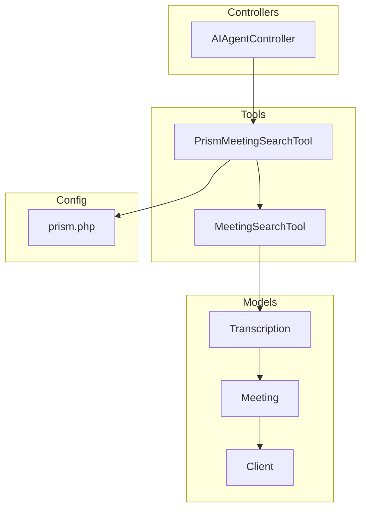
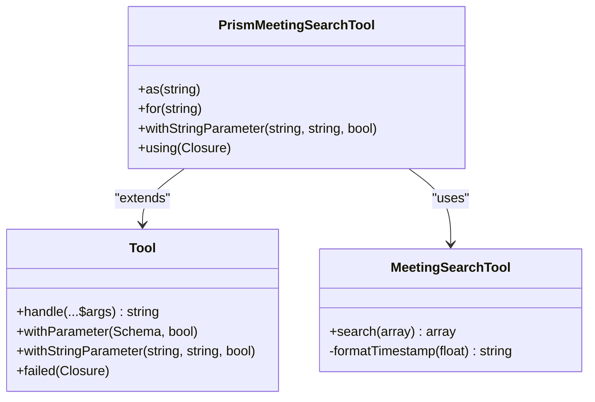
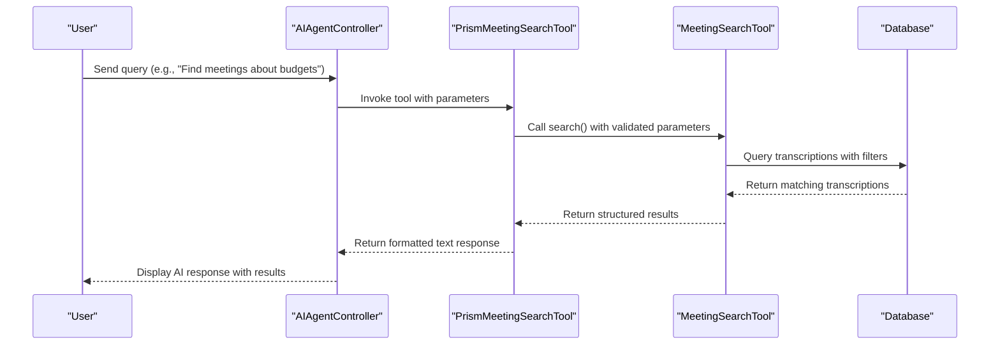
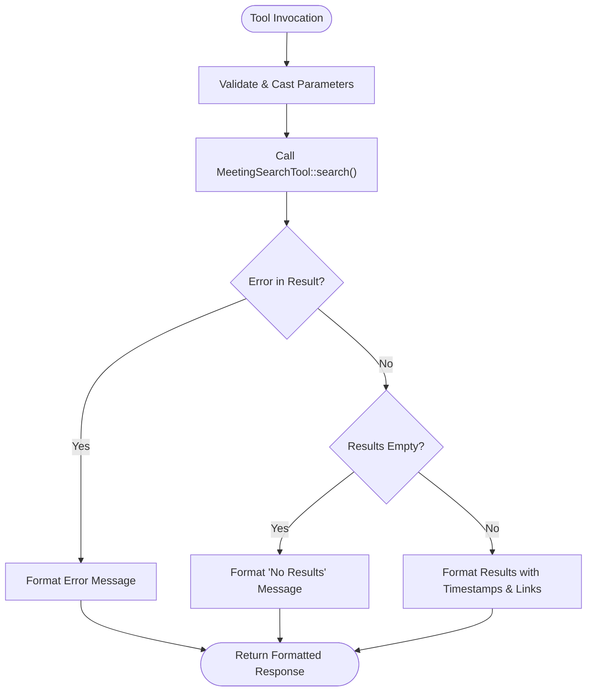
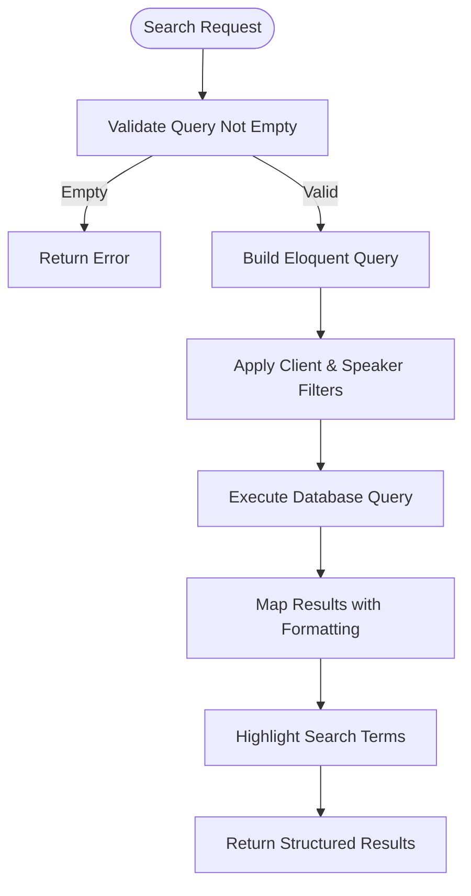
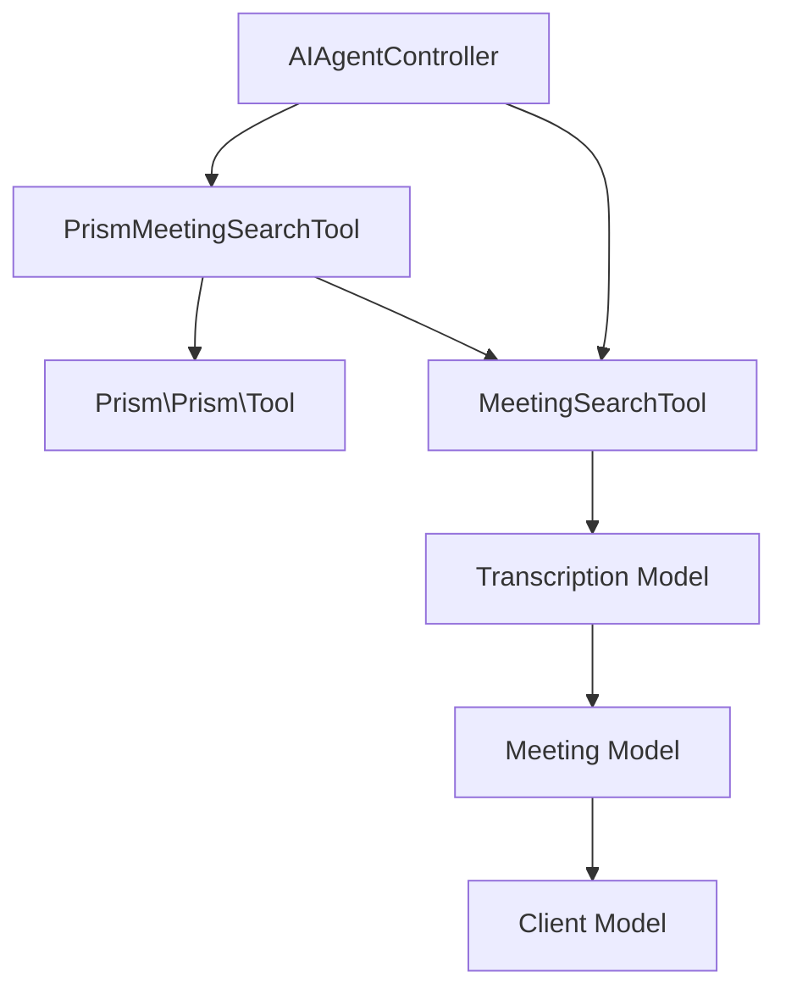

# Prism Meeting Search Tool

## Table of Contents
1. [Introduction](#introduction)
2. [Project Structure](#project-structure)
3. [Core Components](#core-components)
4. [Architecture Overview](#architecture-overview)
5. [Detailed Component Analysis](#detailed-component-analysis)
6. [Dependency Analysis](#dependency-analysis)
7. [Performance Considerations](#performance-considerations)
8. [Troubleshooting Guide](#troubleshooting-guide)
9. [Conclusion](#conclusion)

## Introduction
The **Prism Meeting Search Tool** is a specialized adapter designed to integrate meeting search functionality into the Prism AI framework. It extends the base `MeetingSearchTool` to make it compatible with Prism's tool execution system, enabling AI agents to query meeting transcriptions using natural language. This document provides a comprehensive analysis of its implementation, configuration, integration points, and best practices for maintaining compatibility and reliability.

The tool enables users to search through transcribed meeting content by keywords, speaker names, or client context, returning formatted results with timestamps and direct links. It acts as a bridge between the AI agent and the application's search backend, transforming structured queries into human-readable responses.

**Section sources**
- [PrismMeetingSearchTool.php](file://app/Tools/PrismMeetingSearchTool.php#L1-L50)
- [MeetingSearchTool.php](file://app/Tools/MeetingSearchTool.php#L1-L86)

## Project Structure
The project follows a Laravel-based MVC architecture with a clear separation of concerns. The PrismMeetingSearchTool resides in the `app/Tools` directory alongside its base class, while configuration for the Prism framework is located in the `config` directory. The AI agent interface is managed through the `AIAgentController`, which orchestrates tool usage.

Key directories:
- `app/Tools`: Contains both `MeetingSearchTool` and `PrismMeetingSearchTool`
- `config`: Houses `prism.php` for framework configuration
- `app/Http/Controllers`: Includes `AIAgentController` for AI interactions
- `app/Models`: Contains `Transcription` and `Meeting` models used in search operations

**Diagram sources**
- [PrismMeetingSearchTool.php](file://app/Tools/PrismMeetingSearchTool.php#L1-L50)
- [MeetingSearchTool.php](file://app/Tools/MeetingSearchTool.php#L1-L86)
- [AIAgentController.php](file://app/Http/Controllers/AIAgentController.php#L1-L183)
- [Transcription.php](file://app/Models/Transcription.php#L1-L51)

## Core Components
The core functionality revolves around two main classes: `PrismMeetingSearchTool` and `MeetingSearchTool`. The former adapts the latter for use within the Prism AI framework by conforming to the `Tool` interface and formatting responses appropriately for AI consumption.

`MeetingSearchTool` provides the actual search logic using Laravel's Eloquent ORM to query transcription records, while `PrismMeetingSearchTool` wraps this functionality with parameter validation, error handling, and response formatting required by the AI agent.

**Diagram sources**
- [PrismMeetingSearchTool.php](file://app/Tools/PrismMeetingSearchTool.php#L1-L50)
- [MeetingSearchTool.php](file://app/Tools/MeetingSearchTool.php#L1-L86)
- [Tool.php](file://vendor/prism-php/prism/src/Tool.php#L1-L356)

**Section sources**
- [PrismMeetingSearchTool.php](file://app/Tools/PrismMeetingSearchTool.php#L1-L50)
- [MeetingSearchTool.php](file://app/Tools/MeetingSearchTool.php#L1-L86)

## Architecture Overview
The architecture follows a layered pattern where the AI agent (via `AIAgentController`) invokes `PrismMeetingSearchTool`, which delegates to `MeetingSearchTool` for actual data retrieval. Results are formatted for natural language presentation before being returned to the user.

**Diagram sources**
- [AIAgentController.php](file://app/Http/Controllers/AIAgentController.php#L1-L183)
- [PrismMeetingSearchTool.php](file://app/Tools/PrismMeetingSearchTool.php#L1-L50)
- [MeetingSearchTool.php](file://app/Tools/MeetingSearchTool.php#L1-L86)

## Detailed Component Analysis

### PrismMeetingSearchTool Analysis
The `PrismMeetingSearchTool` class extends the Prism framework's `Tool` class to integrate with the AI agent system. It defines a tool named `search_meetings` with four parameters: `query` (required), `client_id`, `speaker`, and `limit` (all optional).

The tool uses a closure-based execution model where the `using()` method defines the logic that runs when the tool is invoked. It validates and sanitizes input parameters, calls the base `MeetingSearchTool::search()` method, and formats the response for natural language consumption.

Key features:
- Input validation and type casting for `client_id` and `limit`
- Error handling with user-friendly messages
- Response formatting with markdown-style emphasis
- Direct links to specific timestamps in meetings

**Diagram sources**
- [PrismMeetingSearchTool.php](file://app/Tools/PrismMeetingSearchTool.php#L1-L50)

**Section sources**
- [PrismMeetingSearchTool.php](file://app/Tools/PrismMeetingSearchTool.php#L1-L50)

### MeetingSearchTool Analysis
The base `MeetingSearchTool` implements the core search functionality using Laravel's query builder. It searches transcription records for text matching the query, with optional filtering by client and speaker.

The search uses Eloquent relationships to eager-load meeting and client data, preventing N+1 query issues. Results are processed to highlight search terms and format timestamps in a user-friendly way (HH:MM:SS or MM:SS).

Key implementation details:
- Uses `where('text', 'like', "%{$query}%")` for pattern matching
- Applies filters using `when()` conditional clauses
- Limits results to prevent excessive data retrieval
- Maps results to include meeting URLs with timestamp anchors

**Diagram sources**
- [MeetingSearchTool.php](file://app/Tools/MeetingSearchTool.php#L1-L86)

**Section sources**
- [MeetingSearchTool.php](file://app/Tools/MeetingSearchTool.php#L1-L86)

### Configuration Analysis
The `prism.php` configuration file does not contain any specific settings for the `PrismMeetingSearchTool`. Instead, it configures the broader Prism framework, including AI providers (OpenAI, Anthropic, etc.) and their API endpoints and keys.

The tool itself does not rely on configuration parameters from this file, as it delegates the actual search logic to `MeetingSearchTool`. However, the AI agent's behavior (including tool selection) is influenced by the provider settings in this configuration.

Relevant configuration sections:
- `providers.openai`: Configures OpenAI API access
- `providers.anthropic`: Configures Anthropic API access
- `prism_server.enabled`: Controls whether the Prism server routes are enabled

**Section sources**
- [prism.php](file://config/prism.php#L1-L56)

## Dependency Analysis
The `PrismMeetingSearchTool` has a clear dependency hierarchy:

The tool depends on:
- The Prism framework's `Tool` class for integration
- The base `MeetingSearchTool` for search logic
- Eloquent models for data access
- The `AIAgentController` for invocation context

Notably, both tools are used directly by the `AIAgentController`, which can invoke either the raw `MeetingSearchTool` (via the search endpoint) or the wrapped `PrismMeetingSearchTool` (via the AI chat interface).

**Diagram sources**
- [PrismMeetingSearchTool.php](file://app/Tools/PrismMeetingSearchTool.php#L1-L50)
- [MeetingSearchTool.php](file://app/Tools/MeetingSearchTool.php#L1-L86)
- [AIAgentController.php](file://app/Http/Controllers/AIAgentController.php#L1-L183)

**Section sources**
- [PrismMeetingSearchTool.php](file://app/Tools/PrismMeetingSearchTool.php#L1-L50)
- [MeetingSearchTool.php](file://app/Tools/MeetingSearchTool.php#L1-L86)
- [AIAgentController.php](file://app/Http/Controllers/AIAgentController.php#L1-L183)

## Performance Considerations
The search functionality has several performance implications:

1. **Database Query Efficiency**: The search uses a `LIKE` pattern match on the `text` field, which cannot use standard B-tree indexes efficiently. For large datasets, consider implementing full-text search (e.g., MySQL FULLTEXT or PostgreSQL tsvector).

2. **Result Limiting**: Both tools enforce a maximum limit of 50 results, with a default of 10, preventing excessive data retrieval.

3. **Eager Loading**: The `MeetingSearchTool` uses `with(['meeting.client'])` to prevent N+1 query problems when accessing related data.

4. **Caching Opportunities**: Search results could be cached based on query parameters, especially for common searches.

5. **Input Sanitization**: The `PrismMeetingSearchTool` validates and casts input parameters, preventing potential injection issues and ensuring consistent data types.

For optimal performance with large transcription datasets, consider:
- Implementing database-level full-text indexing
- Adding caching at the `MeetingSearchTool` level
- Using database pagination for large result sets
- Monitoring query performance with Laravel's query log

**Section sources**
- [MeetingSearchTool.php](file://app/Tools/MeetingSearchTool.php#L1-L86)
- [PrismMeetingSearchTool.php](file://app/Tools/PrismMeetingSearchTool.php#L1-L50)

## Troubleshooting Guide
Common issues and solutions:

### Configuration Mismatches
**Issue**: AI agent fails to invoke `PrismMeetingSearchTool`
**Solution**: Ensure the tool is properly registered in the `AIAgentController` and that the Prism framework is correctly installed via Composer.

### Tool Registration Failures
**Issue**: "Tool not found" errors when invoking search
**Solution**: Verify that `new PrismMeetingSearchTool()` is passed to `withTools()` in the `AIAgentController`. Check for autoloading issues by running `composer dump-autoload`.

### Inconsistent Search Results
**Issue**: Different results between direct search and AI-invoked search
**Solution**: Ensure both interfaces use the same `MeetingSearchTool::search()` method. The `AIAgentController` has a separate `search()` method that should maintain parity with the tool's implementation.

### Parameter Validation Errors
**Issue**: "Unknown parameters" or "Type mismatch" errors
**Solution**: Verify that the AI model is passing parameters that match the tool's schema (query: string, client_id: numeric string, speaker: string, limit: numeric string).

### Empty Results
**Issue**: No results returned despite matching content
**Solution**: Check that the search query is not empty and that the database contains transcriptions with the searched text. The search is case-insensitive but requires exact word matching within the text.

### Performance Issues
**Issue**: Slow search response times
**Solution**: Implement database indexing on the `text` column or migrate to full-text search. Consider caching frequent queries.

**Section sources**
- [PrismMeetingSearchTool.php](file://app/Tools/PrismMeetingSearchTool.php#L1-L50)
- [MeetingSearchTool.php](file://app/Tools/MeetingSearchTool.php#L1-L86)
- [AIAgentController.php](file://app/Http/Controllers/AIAgentController.php#L1-L183)

## Conclusion
The **Prism Meeting Search Tool** successfully bridges the gap between natural language AI interactions and structured meeting data search. By extending the base `MeetingSearchTool` with Prism framework compatibility, it enables seamless integration of meeting content search into AI-powered workflows.

Key strengths include:
- Clean separation between AI interface and search logic
- Robust error handling and user-friendly responses
- Flexible parameter system compatible with AI tool calling
- Efficient database queries with proper eager loading

To maintain reliability and performance:
1. Keep both search implementations in sync
2. Monitor query performance as data volume grows
3. Consider implementing full-text search for large datasets
4. Ensure consistent error handling across both tools
5. Validate tool parameters thoroughly in the AI context

The current implementation provides a solid foundation for AI-assisted meeting analysis, with clear pathways for future enhancements in search accuracy, performance, and feature richness.

**Referenced Files in This Document**   
- [PrismMeetingSearchTool.php](file://app/Tools/PrismMeetingSearchTool.php#L1-L50)
- [MeetingSearchTool.php](file://app/Tools/MeetingSearchTool.php#L1-L86)
- [prism.php](file://config/prism.php#L1-L56)
- [AIAgentController.php](file://app/Http/Controllers/AIAgentController.php#L1-L183)
- [Tool.php](file://vendor/prism-php/prism/src/Tool.php#L1-L356)
- [Transcription.php](file://app/Models/Transcription.php#L1-L51)
- [Meeting.php](file://app/Models/Meeting.php#L1-L35)