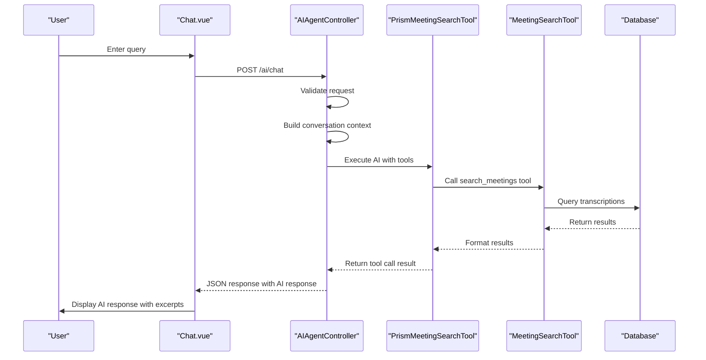
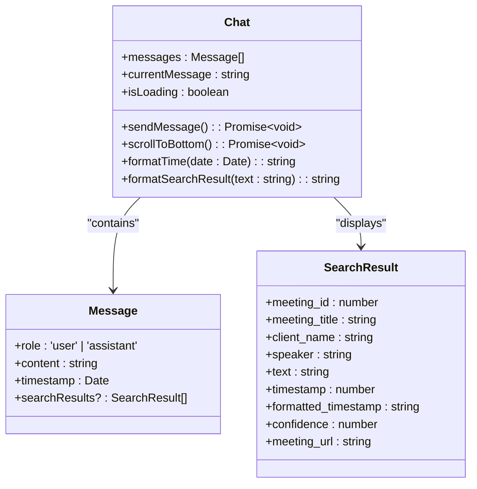
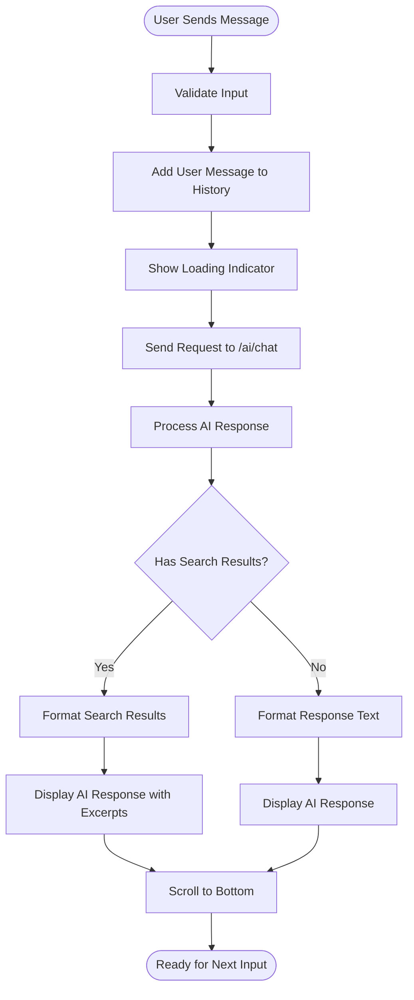
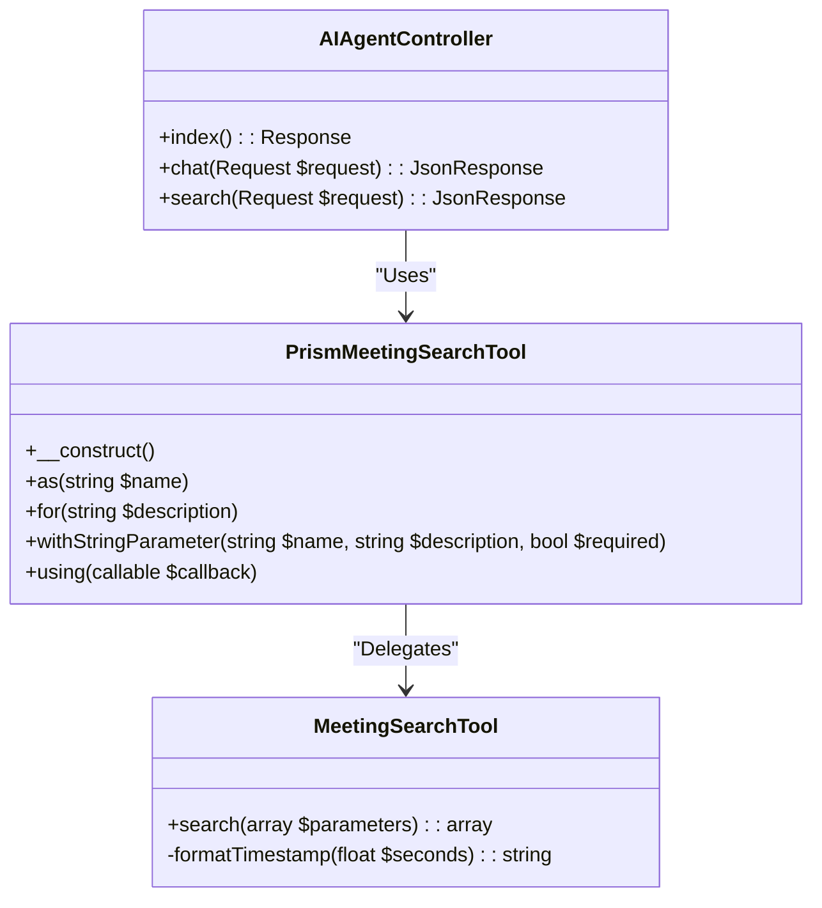
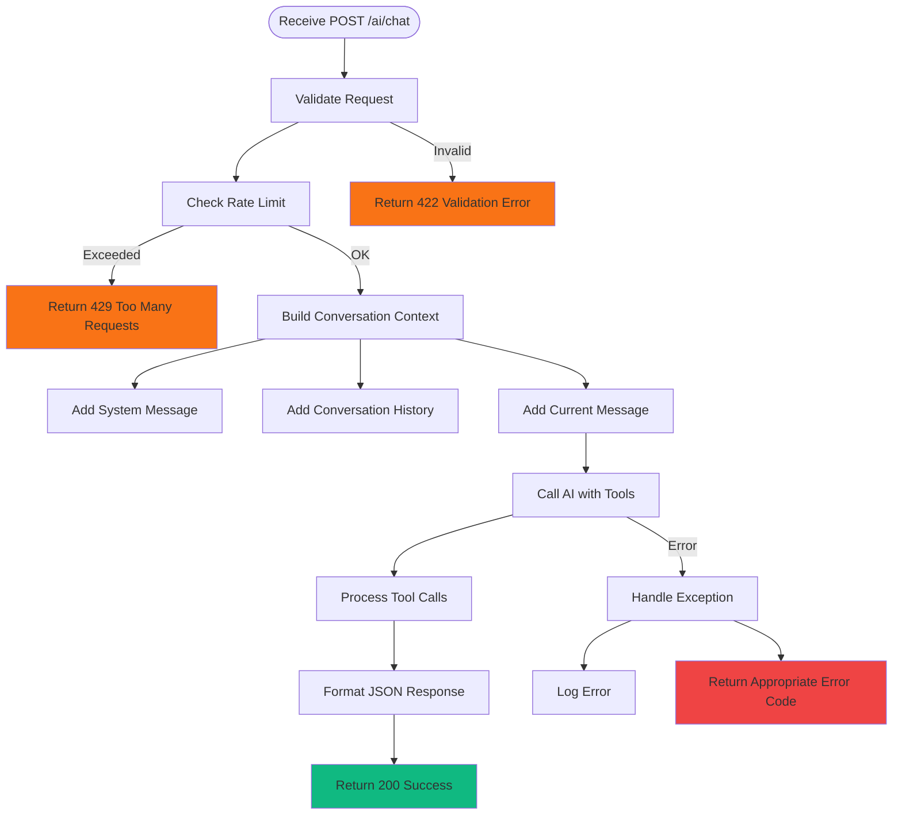
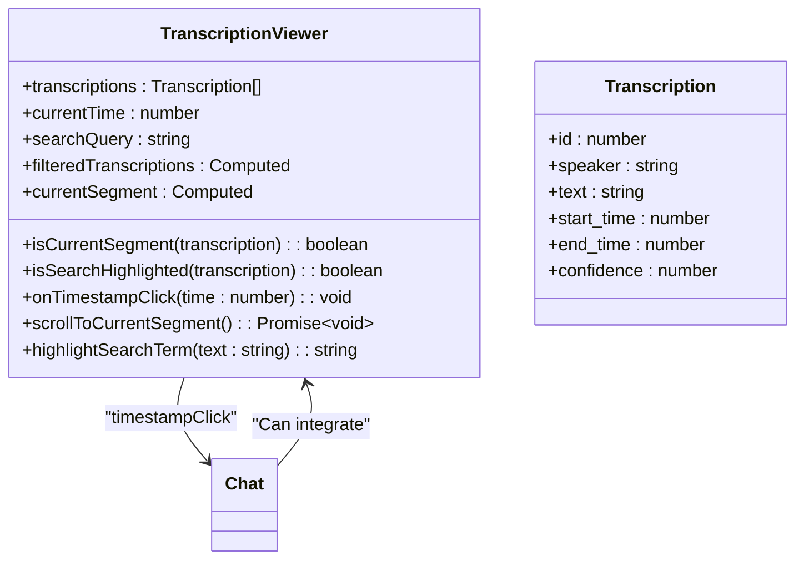
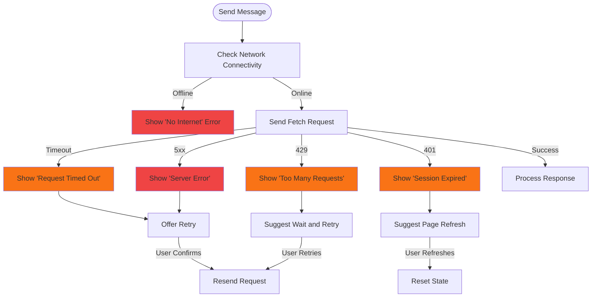

# AI Frontend Integration


## Table of Contents
1. [Introduction](#introduction)
2. [Project Structure](#project-structure)
3. [Core Components](#core-components)
4. [Architecture Overview](#architecture-overview)
5. [Detailed Component Analysis](#detailed-component-analysis)
6. [State Management and Real-Time Updates](#state-management-and-real-time-updates)
7. [Error Handling and User Experience](#error-handling-and-user-experience)
8. [Performance and Optimization](#performance-and-optimization)
9. [Troubleshooting Guide](#troubleshooting-guide)
10. [Best Practices](#best-practices)

## Introduction
This document provides a comprehensive analysis of the AI frontend integration in the MeetingAI application, focusing on the conversational search interface implemented in the Chat.vue component. The system enables users to query meeting transcriptions using natural language, with AI-powered responses that include timestamped excerpts and contextual links. The integration spans frontend components, backend controllers, and AI tooling, creating a seamless experience for searching and retrieving information from recorded meetings.

## Project Structure
The project follows a standard Laravel-Vue.js architecture with Inertia.js for frontend-backend integration. Key directories include:
- `app/Http/Controllers`: Backend controllers handling AI and meeting logic
- `app/Tools`: AI tool implementations for meeting search functionality
- `resources/js/pages/AI`: Frontend AI interface components
- `resources/js/lib`: Shared UI components and composables


```mermaid
graph TB
subgraph "Frontend"
Chat[Chat.vue]
TranscriptionViewer[TranscriptionViewer.vue]
AppLayout[AppLayout.vue]
useRealTimeUpdates[useRealTimeUpdates.ts]
end
subgraph "Backend"
AIAgentController[AIAgentController.php]
PrismMeetingSearchTool[PrismMeetingSearchTool.php]
MeetingSearchTool[MeetingSearchTool.php]
end
Chat --> AIAgentController : "POST /ai/chat"
AIAgentController --> PrismMeetingSearchTool : "Tool Call"
PrismMeetingSearchTool --> MeetingSearchTool : "Search Execution"
TranscriptionViewer --> Chat : "Shared Context"
useRealTimeUpdates --> Chat : "State Updates"
style Chat fill:#4C9AFF,stroke:#333
style AIAgentController fill:#10B981,stroke:#333
```


**Diagram sources**
- [Chat.vue](file://resources/js/pages/AI/Chat.vue#L1-L307)
- [AIAgentController.php](file://app/Http/Controllers/AIAgentController.php#L1-L183)
- [PrismMeetingSearchTool.php](file://app/Tools/PrismMeetingSearchTool.php#L1-L50)
- [MeetingSearchTool.php](file://app/Tools/MeetingSearchTool.php#L1-L86)

**Section sources**
- [Chat.vue](file://resources/js/pages/AI/Chat.vue#L1-L307)
- [AIAgentController.php](file://app/Http/Controllers/AIAgentController.php#L1-L183)

## Core Components
The AI integration consists of several core components that work together to provide conversational search capabilities:
- **Chat.vue**: Main user interface for AI interaction
- **AIAgentController.php**: Backend endpoint for AI processing
- **PrismMeetingSearchTool.php**: AI tool for meeting search
- **MeetingSearchTool.php**: Core search implementation
- **TranscriptionViewer.vue**: Component for synchronized playback
- **useRealTimeUpdates.ts**: Composable for real-time state updates

These components form a cohesive system where user queries are processed through the AI agent, which uses specialized tools to search meeting transcriptions and return contextual responses with timestamped excerpts.

**Section sources**
- [Chat.vue](file://resources/js/pages/AI/Chat.vue#L1-L307)
- [AIAgentController.php](file://app/Http/Controllers/AIAgentController.php#L1-L183)
- [PrismMeetingSearchTool.php](file://app/Tools/PrismMeetingSearchTool.php#L1-L50)
- [MeetingSearchTool.php](file://app/Tools/MeetingSearchTool.php#L1-L86)

## Architecture Overview
The AI frontend integration follows a client-server architecture with AI agent pattern. The frontend Chat component captures user queries and sends them to the backend AIAgentController, which orchestrates AI processing and tool execution. The system uses a layered approach with clear separation of concerns between UI, business logic, and data access.





**Diagram sources**
- [Chat.vue](file://resources/js/pages/AI/Chat.vue#L1-L307)
- [AIAgentController.php](file://app/Http/Controllers/AIAgentController.php#L1-L183)
- [PrismMeetingSearchTool.php](file://app/Tools/PrismMeetingSearchTool.php#L1-L50)
- [MeetingSearchTool.php](file://app/Tools/MeetingSearchTool.php#L1-L86)

## Detailed Component Analysis

### Chat Component Analysis
The Chat.vue component provides the user interface for conversational search with the AI meeting assistant. It captures user queries, displays the conversation history, and renders AI responses with embedded timestamped excerpts from meeting transcriptions.





**Diagram sources**
- [Chat.vue](file://resources/js/pages/AI/Chat.vue#L1-L307)

**Section sources**
- [Chat.vue](file://resources/js/pages/AI/Chat.vue#L1-L307)

#### User Interface and Interaction Flow
The Chat component provides a clean, intuitive interface for conversational search. The UI consists of three main sections:
1. **Header**: Displays the AI assistant title and introductory message
2. **Message Area**: Shows the conversation history with user and AI messages
3. **Input Form**: Allows users to enter new queries

When a user submits a query, the component:
1. Adds the user message to the conversation history
2. Shows a loading indicator
3. Sends the request to the AIAgentController via fetch API
4. Processes the AI response and displays it
5. Scrolls to the bottom of the message area

The component uses Inertia.js for page state management and CSRF token handling, ensuring secure communication with the backend.

#### AI Response Rendering
The Chat component renders AI responses with rich formatting, including embedded search results when relevant. Search results are displayed as cards containing:
- Meeting title and client name
- Speaker information and timestamp
- Excerpt text with search terms highlighted
- Link to view the excerpt in context

The component formats search result text by converting markdown-style bold syntax to HTML with yellow background highlighting, making key information stand out.





**Diagram sources**
- [Chat.vue](file://resources/js/pages/AI/Chat.vue#L1-L307)

**Section sources**
- [Chat.vue](file://resources/js/pages/AI/Chat.vue#L1-L307)

### Backend AI Processing
The AIAgentController.php handles AI processing requests from the frontend. It validates input, builds conversation context, and orchestrates AI generation with tool integration.





**Diagram sources**
- [AIAgentController.php](file://app/Http/Controllers/AIAgentController.php#L1-L183)
- [PrismMeetingSearchTool.php](file://app/Tools/PrismMeetingSearchTool.php#L1-L50)
- [MeetingSearchTool.php](file://app/Tools/MeetingSearchTool.php#L1-L86)

**Section sources**
- [AIAgentController.php](file://app/Http/Controllers/AIAgentController.php#L1-L183)
- [PrismMeetingSearchTool.php](file://app/Tools/PrismMeetingSearchTool.php#L1-L50)
- [MeetingSearchTool.php](file://app/Tools/MeetingSearchTool.php#L1-L86)

#### Request Processing Flow
The chat method in AIAgentController processes incoming AI requests through the following steps:





**Diagram sources**
- [AIAgentController.php](file://app/Http/Controllers/AIAgentController.php#L1-L183)

**Section sources**
- [AIAgentController.php](file://app/Http/Controllers/AIAgentController.php#L1-L183)

#### Tool Integration
The AI system uses a tool-based approach where the AI agent can call specialized functions to retrieve information. The PrismMeetingSearchTool acts as an adapter between the AI system and the core MeetingSearchTool.

When a user asks about meeting content, the AI may call the search_meetings tool with parameters including:
- **query**: The search term or phrase
- **client_id**: Optional client filter
- **speaker**: Optional speaker filter
- **limit**: Maximum number of results

The tool executes the search and returns formatted results that the AI can incorporate into its response.

### Transcription Viewer Integration
The TranscriptionViewer.vue component provides synchronized playback functionality that can be integrated with the AI chat system.





**Diagram sources**
- [TranscriptionViewer.vue](file://resources/js/lib/TranscriptionViewer.vue#L1-L246)

**Section sources**
- [TranscriptionViewer.vue](file://resources/js/lib/TranscriptionViewer.vue#L1-L246)

The component allows users to:
- Search through transcription text
- Click on timestamps to jump to specific points in the meeting
- View highlighted search results
- Navigate between segments with keyboard shortcuts

While not directly integrated with the Chat component in the current implementation, the TranscriptionViewer could be enhanced to display AI search results in context, providing a seamless experience between conversational search and detailed transcription review.

## State Management and Real-Time Updates
The application uses a combination of Vue 3's Composition API and custom composables for state management. The Chat component manages its state locally with reactive refs, while shared functionality is abstracted into reusable composables.

### useRealTimeUpdates Composable
The useRealTimeUpdates.ts composable provides real-time status updates for meetings, which could be extended to support AI processing status.


```mermaid
classDiagram
class useRealTimeUpdates {
+useRealTimeUpdates<T>(meetings : T[]) : { meetings, startUpdates, stopUpdates, updateMeetingStatuses }
-updatedMeetings : Ref<T[]>
-intervalId : number | null
-updateMeetingStatuses() : Promise~void~
-startUpdates() : void
-stopUpdates() : void
}
class BaseMeeting {
+id : number
+status : 'pending' | 'processing' | 'completed' | 'failed'
+elapsed_time? : number | null
+estimated_remaining_time? : number | null
+processing_progress? : number | null
+formatted_elapsed_time? : string | null
+formatted_estimated_remaining_time? : string | null
+queue_progress? : number | null
}
useRealTimeUpdates --> BaseMeeting : "Generic constraint"
```


**Diagram sources**
- [useRealTimeUpdates.ts](file://resources/js/lib/useRealTimeUpdates.ts#L1-L88)

**Section sources**
- [useRealTimeUpdates.ts](file://resources/js/lib/useRealTimeUpdates.ts#L1-L88)

The composable:
- Polls the server every 2 seconds for updated meeting statuses
- Filters to only update meetings that are pending or processing
- Merges updated data while preserving existing fields
- Automatically starts and stops polling based on component lifecycle

This pattern could be adapted for the AI chat interface to provide real-time updates during long-running AI operations, showing processing status and estimated completion time.

## Error Handling and User Experience
The system implements comprehensive error handling to provide a robust user experience even when issues occur.

### Frontend Error Handling
The Chat component includes sophisticated error handling with:
- Network connectivity detection
- Request timeout handling (30 seconds)
- Automatic retry logic with exponential backoff
- Detailed error messages tailored to specific error types
- Toast notifications with retry options





**Diagram sources**
- [Chat.vue](file://resources/js/pages/AI/Chat.vue#L1-L307)

**Section sources**
- [Chat.vue](file://resources/js/pages/AI/Chat.vue#L1-L307)

### Backend Error Handling
The AIAgentController implements robust error handling with:
- Input validation with custom error messages
- Rate limiting to prevent abuse
- Comprehensive logging of errors and processing times
- Specific error responses for different failure modes
- Graceful degradation when AI services are unavailable

The system distinguishes between different types of errors and returns appropriate HTTP status codes and user-friendly messages, helping users understand what went wrong and how to proceed.

## Performance and Optimization
The AI integration includes several performance optimizations to ensure a responsive user experience.

### Request Optimization
- **Rate Limiting**: Client IP-based rate limiting (10 requests/minute) prevents abuse
- **Input Validation**: Server-side validation ensures data integrity
- **Caching**: Rate limit counters use Laravel's cache system
- **Timeouts**: 30-second request timeout prevents hanging operations
- **Error Recovery**: Automatic retry with exponential backoff for transient failures

### UI Performance
- **Virtual Scrolling**: Message container uses overflow-y-auto for smooth scrolling
- **Efficient Rendering**: Vue's reactivity system minimizes DOM updates
- **Loading States**: Clear loading indicators provide feedback during processing
- **Optimized Images**: Emoji in empty state are lightweight text characters

The system balances thorough error handling with performance considerations, ensuring reliability without sacrificing responsiveness.

## Troubleshooting Guide
This section addresses common issues that may occur with the AI frontend integration and provides solutions.

### Delayed Responses
**Symptoms**: AI responses take longer than expected or time out.

**Causes and Solutions**:
- **Network Latency**: Check internet connection and retry
- **AI Service Load**: The AI service may be busy; wait and retry
- **Complex Queries**: Long or complex queries take more processing time; try shorter queries
- **Rate Limiting**: Too many requests in a short period; wait a minute before retrying

**Prevention**: Implement response streaming to show partial results as they become available.

### Broken Timestamp Links
**Symptoms**: Clicking on timestamp links in search results doesn't navigate to the correct meeting time.

**Causes and Solutions**:
- **Missing Query Parameter**: Ensure the URL includes ?t={timestamp}
- **Player Implementation**: Verify the meeting player correctly handles the t parameter
- **Timestamp Format**: Confirm timestamps are in seconds, not milliseconds

**Fix**: The current implementation correctly formats timestamps and includes them in URLs.

### Cross-Component Communication Bugs
**Symptoms**: Components don't update correctly when state changes.

**Causes and Solutions**:
- **Stale Props**: Use watch to sync real-time updates with Inertia-provided props
- **Event Emission**: Ensure events are properly emitted and handled
- **State Synchronization**: Use shared composables for cross-component state

**Example**: The Meetings Index page correctly uses watch to keep real-time updates in sync with filtered results.

### Common Error Scenarios
| Error Type | HTTP Status | User Message | Developer Action |
|-----------|-----------|-------------|------------------|
| Validation Error | 422 | "Please enter a message." | Verify input validation rules |
| Rate Limit Exceeded | 429 | "Too many requests. Please wait..." | Check cache implementation |
| Request Timeout | 408 | "Request timed out. Please try again..." | Adjust timeout settings |
| Session Expired | 401 | "Your session has expired. Please refresh..." | Verify authentication |
| Server Error | 500 | "I apologize, but I encountered an error..." | Check server logs |

**Section sources**
- [Chat.vue](file://resources/js/pages/AI/Chat.vue#L1-L307)
- [AIAgentController.php](file://app/Http/Controllers/AIAgentController.php#L1-L183)

## Best Practices
This section provides recommendations for enhancing the user experience and system reliability.

### Enhancing User Experience
1. **Typing Indicators**: Add a typing indicator when the AI is processing
2. **Response Streaming**: Stream AI responses character by character for immediate feedback
3. **Query Suggestions**: Provide autocomplete or suggestion dropdown as users type
4. **Voice Input**: Add speech-to-text capability for hands-free queries
5. **Response Summarization**: Allow users to request shorter or longer responses

### Reliability Improvements
1. **Fallback Mechanisms**: Implement secondary AI providers when primary is unavailable
2. **Caching**: Cache frequent queries to reduce AI processing load
3. **Progressive Enhancement**: Provide basic search functionality when AI is unavailable
4. **Monitoring**: Add comprehensive monitoring of AI response times and success rates
5. **User Feedback**: Allow users to rate AI responses to improve future interactions

### Security Considerations
1. **Input Sanitization**: Ensure all AI-generated HTML is properly sanitized
2. **Rate Limiting**: Maintain rate limits to prevent abuse
3. **Authentication**: Ensure all AI endpoints require authentication
4. **Data Privacy**: Implement proper access controls so users only see their authorized meetings
5. **Audit Logging**: Log AI interactions for security and compliance

### Performance Optimization
1. **Lazy Loading**: Load AI components only when needed
2. **Connection Pooling**: Maintain persistent connections to AI services
3. **Batch Processing**: Allow batch queries for multiple related questions
4. **Client-Side Caching**: Cache recent responses in browser storage
5. **Compression**: Use response compression for large AI outputs

These best practices can significantly enhance the usability, reliability, and performance of the AI frontend integration.

**Referenced Files in This Document**   
- [Chat.vue](file://resources/js/pages/AI/Chat.vue#L1-L307)
- [TranscriptionViewer.vue](file://resources/js/lib/TranscriptionViewer.vue#L1-L246)
- [AIAgentController.php](file://app/Http/Controllers/AIAgentController.php#L1-L183)
- [PrismMeetingSearchTool.php](file://app/Tools/PrismMeetingSearchTool.php#L1-L50)
- [MeetingSearchTool.php](file://app/Tools/MeetingSearchTool.php#L1-L86)
- [AppLayout.vue](file://resources/js/lib/AppLayout.vue#L1-L234)
- [useRealTimeUpdates.ts](file://resources/js/lib/useRealTimeUpdates.ts#L1-L88)
- [NetworkStatus.vue](file://resources/js/lib/NetworkStatus.vue#L1-L98)
- [Toast.vue](file://resources/js/lib/Toast.vue)