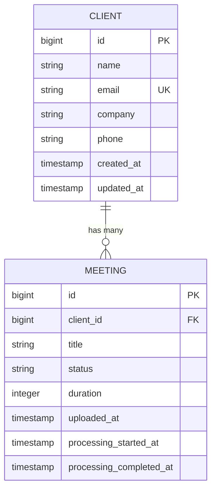
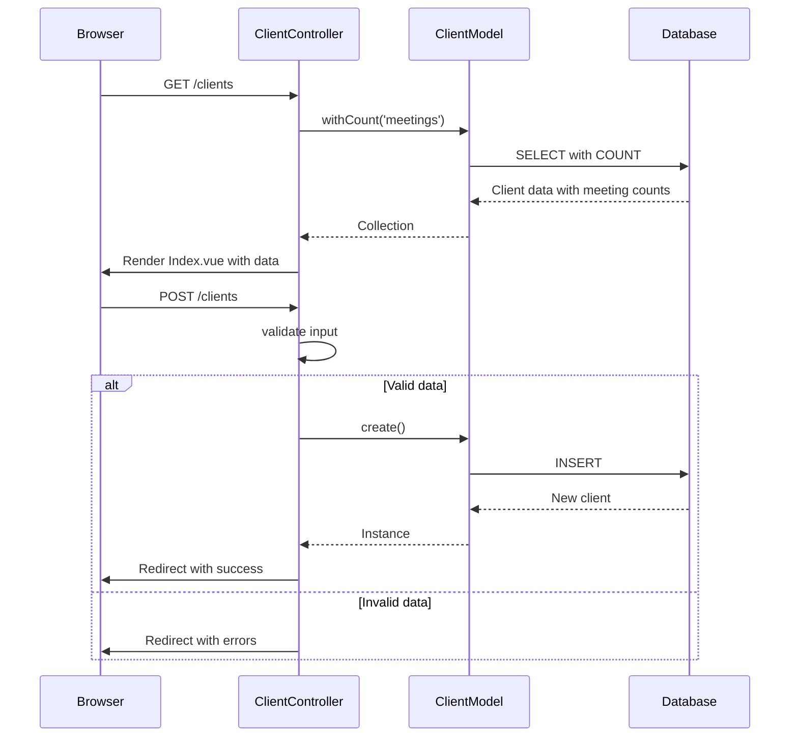
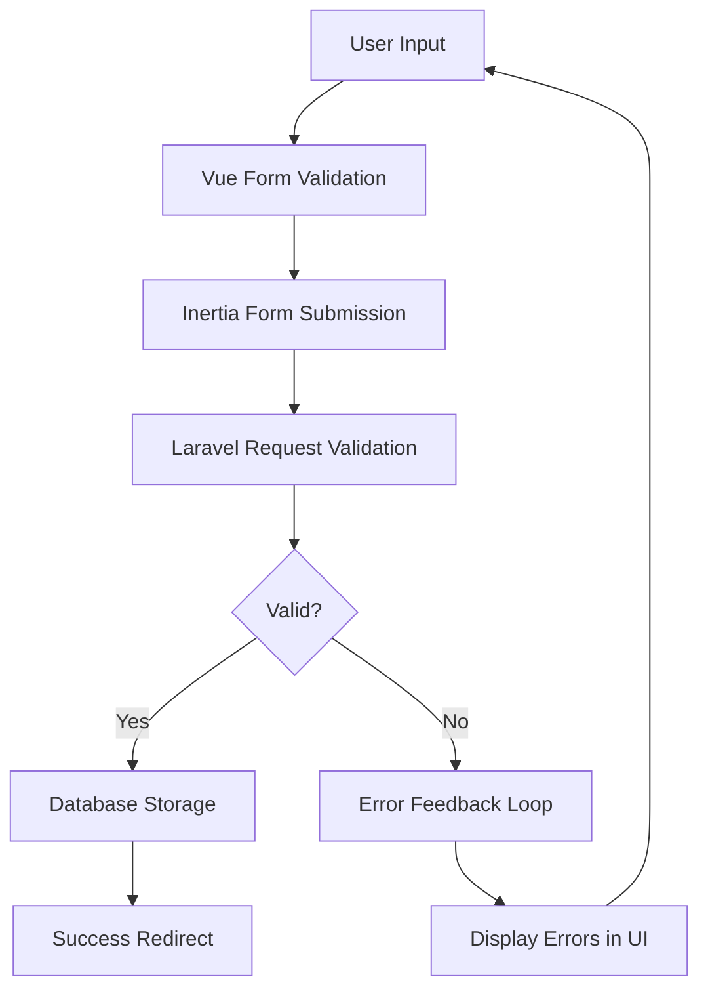

# Client Management


## Table of Contents
1. [Client Model Structure](#client-model-structure)
2. [CRUD Operations in ClientController](#crud-operations-in-clientcontroller)
3. [Frontend Components Overview](#frontend-components-overview)
4. [Data Flow and Validation](#data-flow-and-validation)
5. [Client-Meeting Relationship](#client-meeting-relationship)
6. [API Request Examples](#api-request-examples)
7. [Common Issues and Constraints](#common-issues-and-constraints)
8. [UI State Management](#ui-state-management)
9. [Best Practices and Access Control](#best-practices-and-access-control)

## Client Model Structure

The `Client` model represents a business entity or contact associated with meetings. It stores essential contact information and maintains a relationship with the `Meeting` entity.





**Diagram sources**
- [Client.php](file://app/Models/Client.php#L1-L27)
- [Meeting.php](file://app/Models/Meeting.php#L1-L178)
- [create_clients_table.php](file://database/migrations/2025_08_10_135157_create_clients_table.php#L1-L31)

### Field Definitions
- **name**: Required string (max 255 characters) - Primary identifier for the client
- **email**: Optional unique string - Contact email with uniqueness constraint
- **company**: Optional string - Organization name
- **phone**: Optional string - Contact phone number
- **timestamps**: Automatically managed `created_at` and `updated_at` fields

The database schema enforces a unique constraint on the email field and uses standard Laravel timestamp fields.

**Section sources**
- [Client.php](file://app/Models/Client.php#L1-L27)
- [create_clients_table.php](file://database/migrations/2025_08_10_135157_create_clients_table.php#L1-L31)

## CRUD Operations in ClientController

The `ClientController` implements full CRUD functionality using Laravel's Inertia.js integration for seamless frontend communication.





**Diagram sources**
- [ClientController.php](file://app/Http/Controllers/ClientController.php#L1-L94)

### Operation Details

**Index Operation**
Retrieves all clients with their meeting counts, ordered alphabetically by name:

```php
public function index(): Response
{
    $clients = Client::withCount('meetings')
        ->orderBy('name')
        ->get();
    return Inertia::render('Clients/Index', ['clients' => $clients]);
}
```


**Store Operation**
Creates a new client with validation:
- Name: required, string, max 255
- Email: optional, valid email format, unique across clients
- Company and phone: optional strings

**Update Operation**
Updates existing client with special email validation that ignores the current client's email:

```php
'email' => [
    'nullable',
    'email',
    Rule::unique('clients', 'email')->ignore($client->id)
]
```


**Destroy Operation**
Implements a soft constraint preventing deletion of clients with associated meetings.

**Section sources**
- [ClientController.php](file://app/Http/Controllers/ClientController.php#L1-L94)

## Frontend Components Overview

The Vue.js frontend components provide a complete user interface for client management operations.

### Create.vue
The form component for creating new clients features:
- Real-time validation feedback
- Loading state during submission
- Inertia.js form helper for seamless submission
- Responsive grid layout

**Section sources**
- [Create.vue](file://resources/js/pages/Clients/Create.vue#L1-L126)

### Edit.vue
Enables modification of existing client data with:
- Pre-populated form fields from props
- Client ID passed via route parameter
- PUT request submission using Inertia's form helper
- Consistent UI with Create.vue

**Section sources**
- [Edit.vue](file://resources/js/pages/Clients/Edit.vue#L1-L129)

### Index.vue
Displays the client listing with:
- Table view showing name, company, contact info, and meeting count
- Add Client button for new client creation
- Edit and Delete action buttons
- Delete button disabled when client has meetings
- Empty state with call-to-action when no clients exist

**Section sources**
- [Index.vue](file://resources/js/pages/Clients/Index.vue#L1-L120)

### Show.vue
Presents detailed client information including:
- Client metadata (name, company, email, phone)
- List of associated meetings with status indicators
- Add Meeting button pre-filled with client context
- Formatted duration and date displays
- Status badge coloring based on meeting state

**Section sources**
- [Show.vue](file://resources/js/pages/Clients/Show.vue#L1-L183)

## Data Flow and Validation

The application implements a robust data flow from frontend input to backend storage with comprehensive validation at multiple levels.





**Diagram sources**
- [ClientController.php](file://app/Http/Controllers/ClientController.php#L1-L94)
- [Create.vue](file://resources/js/pages/Clients/Create.vue#L1-L126)

### Validation Layers
1. **Frontend Validation**: Visual feedback on form fields with error messages
2. **Backend Validation**: Server-side validation with Laravel's validator
3. **Database Constraints**: Unique email constraint at database level

Error messages are passed back through Inertia's shared data system and displayed next to respective form fields.

**Section sources**
- [ClientController.php](file://app/Http/Controllers/ClientController.php#L1-L94)
- [Create.vue](file://resources/js/pages/Clients/Create.vue#L1-L126)

## Client-Meeting Relationship

Clients serve as organizational units for meetings, enabling structured data management and filtering.

### Database Relationship
The `meetings` table contains a `client_id` foreign key that references the `clients` table, establishing a one-to-many relationship.

### Functional Usage
- **Meeting Organization**: Meetings are grouped by client in the UI
- **AI Query Context**: Client context can be used to filter AI search results
- **Navigation**: Users can navigate from client to their meetings and vice versa
- **Creation Flow**: New meetings can be created with pre-selected client context

The `Show.vue` component displays all meetings for a client, ordered by creation date (newest first), with visual indicators for meeting status and duration.

**Section sources**
- [Client.php](file://app/Models/Client.php#L1-L27)
- [Meeting.php](file://app/Models/Meeting.php#L1-L178)
- [Show.vue](file://resources/js/pages/Clients/Show.vue#L1-L183)

## API Request Examples

### Create Client Request

```http
POST /clients
Content-Type: application/x-www-form-urlencoded

name=Acme+Corporation&email=contact%40acme.com&company=Acme+Corp&phone=%2B1-555-123-4567
```


**Successful Response**: Redirect to `/clients` with success message

**Validation Error Response**: Redirect back with error messages in session

### List Clients Request

```http
GET /clients
Accept: text/html
```


**Response**: HTML page with Inertia data containing:

```json
{
  "clients": [
    {
      "id": 1,
      "name": "Acme Corporation",
      "email": "contact@acme.com",
      "company": "Acme Corp",
      "phone": "+1-555-123-4567",
      "meetings_count": 5,
      "created_at": "2025-08-10T13:52:00.000000Z",
      "updated_at": "2025-08-10T13:52:00.000000Z"
    }
  ]
}
```


**Section sources**
- [ClientController.php](file://app/Http/Controllers/ClientController.php#L1-L94)

## Common Issues and Constraints

### Duplicate Client Names
The system allows duplicate client names since names are not unique identifiers. This enables tracking multiple contacts from the same organization.

**Mitigation**: Users should include distinguishing information in the name field (e.g., "Acme Corp - John Doe").

### Email Uniqueness
Email addresses must be unique across all clients, enforced by both validation rules and database constraints.

**Conflict Resolution**: The system prevents creation of clients with existing emails and provides clear error feedback.

### Deletion Constraints
Clients cannot be deleted if they have associated meetings, enforced in the `destroy` method:


```php
if ($client->meetings()->count() > 0) {
    return redirect()->route('clients.index')
        ->with('error', 'Cannot delete client with existing meetings.');
}
```


This prevents orphaned meetings and maintains data integrity.

**Section sources**
- [ClientController.php](file://app/Http/Controllers/ClientController.php#L77-L94)

## UI State Management

The application uses Inertia.js for seamless state management between Laravel and Vue.js components.

### Form State
The `useForm` composable from Inertia provides:
- Automatic loading states (`form.processing`)
- Error handling (`form.errors`)
- Validation feedback
- Progress indicators

### Navigation and Feedback
- Success and error messages are passed via Laravel's session flash system
- Page redirects maintain context through route names
- Client context is preserved through route parameters

### Empty States
Components include dedicated UI for empty states:
- Index.vue shows "No clients" message with "Add Client" button
- Show.vue displays "No meetings" message with "Add Meeting" option

**Section sources**
- [Create.vue](file://resources/js/pages/Clients/Create.vue#L1-L126)
- [Index.vue](file://resources/js/pages/Clients/Index.vue#L1-L120)
- [Show.vue](file://resources/js/pages/Clients/Show.vue#L1-L183)

## Best Practices and Access Control

### Data Organization
- Use descriptive client names that include both organization and contact person
- Populate email fields when available for communication purposes
- Maintain consistent company naming conventions
- Regularly review and consolidate duplicate client entries

### Access Control Considerations
While not implemented in the current code, recommended access control measures include:
- Role-based access to client management features
- Ownership-based restrictions on client modification
- Audit logging for client creation and deletion
- Permission checks before allowing client deletion

### Performance Optimization
- The `withCount('meetings')` method efficiently retrieves meeting counts without loading all meetings
- Indexing on the `name` field supports fast alphabetical sorting
- Eager loading prevents N+1 query problems when displaying client details

**Section sources**
- [ClientController.php](file://app/Http/Controllers/ClientController.php#L1-L94)
- [Client.php](file://app/Models/Client.php#L1-L27)

**Referenced Files in This Document**   
- [ClientController.php](file://app/Http/Controllers/ClientController.php#L1-L94)
- [Client.php](file://app/Models/Client.php#L1-L27)
- [Meeting.php](file://app/Models/Meeting.php#L1-L178)
- [create_clients_table.php](file://database/migrations/2025_08_10_135157_create_clients_table.php#L1-L31)
- [Create.vue](file://resources/js/pages/Clients/Create.vue#L1-L126)
- [Edit.vue](file://resources/js/pages/Clients/Edit.vue#L1-L129)
- [Index.vue](file://resources/js/pages/Clients/Index.vue#L1-L120)
- [Show.vue](file://resources/js/pages/Clients/Show.vue#L1-L183)