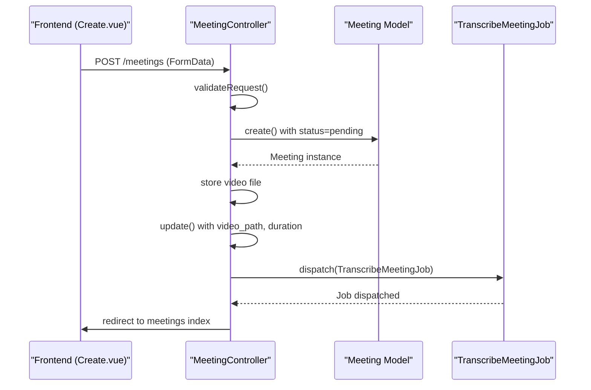
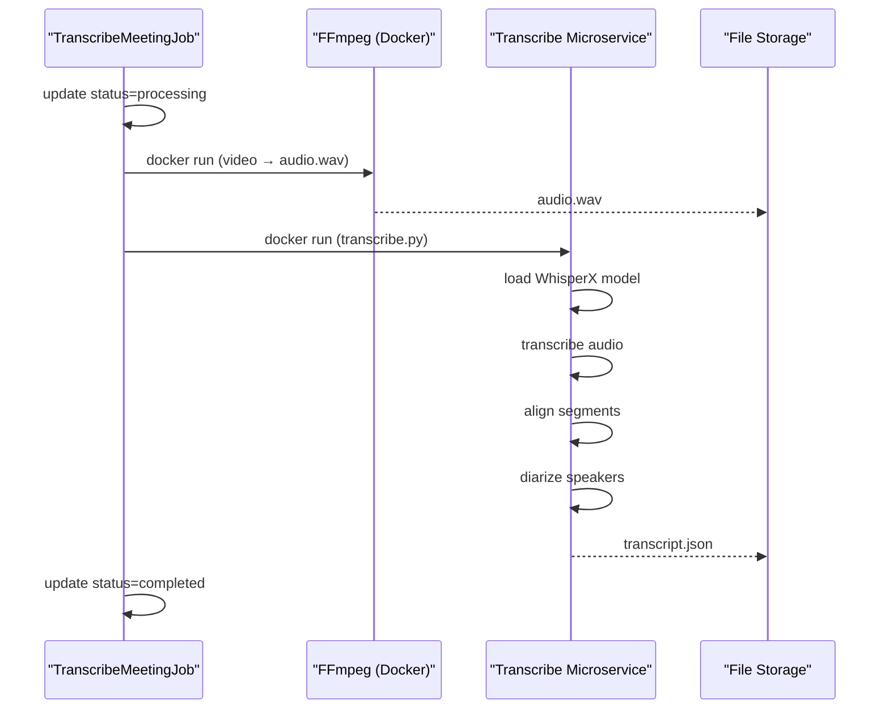
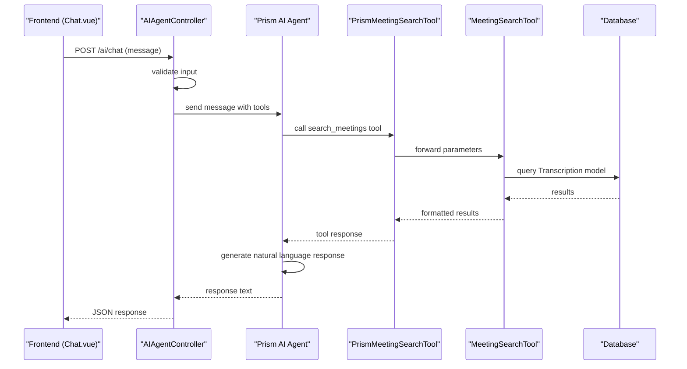
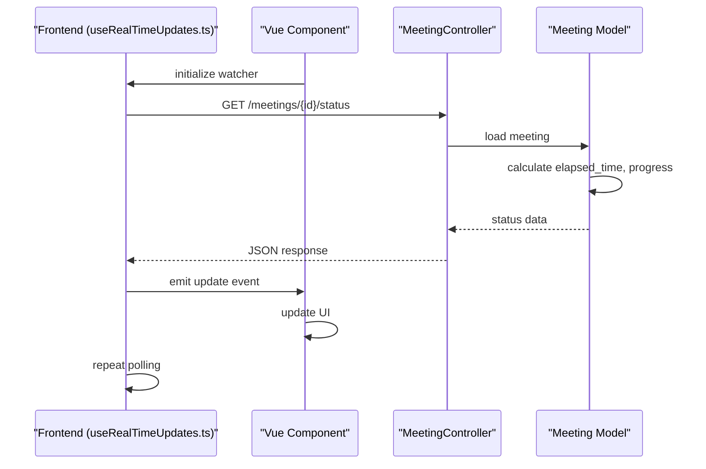

# Data Flow

## Table of Contents
1. [Introduction](#introduction)
2. [Upload Flow](#upload-flow)
3. [Processing Pipeline](#processing-pipeline)
4. [AI Search Flow](#ai-search-flow)
5. [Real-Time Updates](#real-time-updates)
6. [Data Transformations and Validation](#data-transformations-and-validation)
7. [Error Handling Mechanisms](#error-handling-mechanisms)
8. [Data Consistency and Race Conditions](#data-consistency-and-race-conditions)
9. [Large Payload Handling](#large-payload-handling)
10. [Performance Optimization](#performance-optimization)

## Introduction
This document provides a comprehensive analysis of the data flow in the meetingai application, detailing the end-to-end journey from user upload to AI-powered search results. The system follows a modern architecture with a Laravel backend, Vue frontend, and Dockerized microservices for transcription processing. The data flow is divided into three main phases: upload, processing, and search. Each phase includes validation, error handling, and status tracking mechanisms to ensure reliability and user transparency.

## Upload Flow

The upload flow begins with frontend submission through the Create.vue component and proceeds through the MeetingController to create a Meeting model and dispatch a background job.

**Diagram sources**
- [Create.vue](file://resources/js/pages/Meetings/Create.vue#L215-L355)
- [MeetingController.php](file://app/Http/Controllers/MeetingController.php#L100-L250)

**Section sources**
- [Create.vue](file://resources/js/pages/Meetings/Create.vue#L175-L355)
- [MeetingController.php](file://app/Http/Controllers/MeetingController.php#L100-L250)

### Frontend Submission
The frontend implementation in Create.vue handles file selection, validation, and submission:
- File input accepts MP4, MOV, AVI, and WebM formats
- Size validation: minimum 1MB, maximum 500MB
- Inertia.js router handles form submission with progress tracking
- Error messages displayed for validation failures

### MeetingController Processing
The MeetingController.php handles the upload request with comprehensive validation and error handling:
- Validates title, client_id, and video file
- Checks file integrity and available disk space
- Creates Meeting record with initial status=pending
- Stores video file in organized directory structure
- Estimates processing time based on video duration
- Dispatches TranscribeMeetingJob for background processing

## Processing Pipeline

The processing pipeline executes asynchronously through the TranscribeMeetingJob, extracting audio with FFmpeg and transcribing with a Dockerized microservice.

**Diagram sources**
- [TranscribeMeetingJob.php](file://app/Jobs/TranscribeMeetingJob.php#L50-L200)
- [transcribe.py](file://transcribe-microservice/transcribe.py#L50-L150)

**Section sources**
- [TranscribeMeetingJob.php](file://app/Jobs/TranscribeMeetingJob.php#L50-L300)
- [transcribe.py](file://transcribe-microservice/transcribe.py#L1-L200)
- [diarize.py](file://transcribe-microservice/diarize.py#L1-L130)

### FFmpeg Audio Extraction
The TranscribeMeetingJob uses Dockerized FFmpeg to extract audio from the video file:
- Mounts input and output directories to Docker container
- Converts video to 16kHz mono WAV format for transcription
- Uses jrottenberg/ffmpeg:latest Docker image
- Validates output file creation

### Dockerized Transcription
The transcription microservice (transcribe.py) performs speech-to-text conversion:
- Uses WhisperX library for transcription
- Supports speaker diarization with pyannote/speaker-diarization-3.1
- Performs alignment of transcribed segments
- Configures CPU threading based on available cores
- Outputs structured JSON with timestamps and speaker labels

### Transcription Storage
The processed transcript is stored in the application's storage directory:
- File path: storage/{meeting_id}/transcript.json
- JSON format includes segments with text, timestamps, and speaker information
- No direct database storage of full transcripts (searchable via Transcription model)

## AI Search Flow

The AI search flow enables users to query meeting content through natural language, powered by the AIAgentController and search tools.

**Diagram sources**
- [AIAgentController.php](file://app/Http/Controllers/AIAgentController.php#L50-L150)
- [PrismMeetingSearchTool.php](file://app/Tools/PrismMeetingSearchTool.php)
- [MeetingSearchTool.php](file://app/Tools/MeetingSearchTool.php#L10-L50)

**Section sources**
- [AIAgentController.php](file://app/Http/Controllers/AIAgentController.php#L50-L180)
- [MeetingSearchTool.php](file://app/Tools/MeetingSearchTool.php#L1-L85)

### AIAgentController Processing
The AIAgentController handles AI chat requests with rate limiting and error handling:
- Validates message content and conversation history
- Implements rate limiting (10 requests per minute per IP)
- Constructs conversation context with system message
- Integrates with Prism AI platform using OpenRouter provider
- Handles tool calls for meeting search functionality

### MeetingSearchTool Database Query
The MeetingSearchTool performs database queries against transcribed content:
- Searches Transcription model for text matching the query
- Filters by client_id and speaker when specified
- Returns results with highlighted search terms
- Formats timestamps for display
- Includes meeting context (title, client, URL)

## Real-Time Updates

The application provides real-time updates on processing progress using the useRealTimeUpdates.ts hook and status endpoint.

**Diagram sources**
- [useRealTimeUpdates.ts](file://resources/js/lib/useRealTimeUpdates.ts)
- [MeetingController.php](file://app/Http/Controllers/MeetingController.php#L280-L300)

**Section sources**
- [useRealTimeUpdates.ts](file://resources/js/lib/useRealTimeUpdates.ts)
- [MeetingController.php](file://app/Http/Controllers/MeetingController.php#L280-L300)

### useRealTimeUpdates Implementation
The useRealTimeUpdates.ts composable provides real-time status tracking:
- Polls the status endpoint at regular intervals
- Handles connection errors with retry logic
- Emits events for status changes
- Calculates estimated remaining time
- Provides formatted time strings for display

### Status Endpoint
The MeetingController::status() method returns comprehensive processing information:
- Current status (pending, processing, completed, failed)
- Elapsed processing time
- Estimated remaining time
- Processing progress percentage
- Queue progress for pending meetings
- Formatted time strings for UI display

## Data Transformations and Validation

The system implements comprehensive data validation and transformation at multiple points in the flow.

### Upload Validation
The MeetingController applies strict validation to uploaded content:
- **Title**: required, string, max 255 characters
- **Client ID**: required, must exist in clients table
- **Video file**: required, specific types (MP4, MOV, AVI, WebM), size 1MB-500MB
- **File integrity**: validates uploaded file is not corrupted
- **Disk space**: checks available space before processing

### Data Transformation Points
Key data transformations occur throughout the pipeline:
- **Video to audio**: FFmpeg converts video to 16kHz mono WAV
- **Speech to text**: WhisperX transcribes audio with timestamps
- **Speaker diarization**: pyannote identifies and labels speakers
- **Text highlighting**: search results highlight matching terms
- **Timestamp formatting**: converts seconds to HH:MM:SS format

### Model Attribute Accessors
The Meeting model uses accessors to provide calculated values:
- **elapsed_time**: seconds since processing started
- **estimated_remaining_time**: projected time to completion
- **processing_progress**: percentage complete (0-100)
- **queue_progress**: simulated progress for pending meetings
- **formatted time attributes**: human-readable time strings

## Error Handling Mechanisms

The application implements comprehensive error handling across all components.

### Frontend Error Handling
The Create.vue component handles upload errors:
- Displays specific error messages for validation failures
- Shows generic error for upload failures
- Provides retry mechanism with exponential backoff
- Uses toast notifications for success and error states

### Backend Error Handling
The MeetingController and TranscribeMeetingJob implement robust error handling:
- **Validation exceptions**: returned to user with specific messages
- **Runtime exceptions**: caught and converted to user-friendly messages
- **Logging**: detailed error logging with context
- **Cleanup**: removes partial data on failure
- **Retry mechanisms**: jobs can retry up to 3 times

### Job Failure Handling
The TranscribeMeetingJob::failed() method handles job failures:
- Updates meeting status to failed
- Stores user-friendly and technical error messages
- Cleans up temporary files
- Logs detailed failure information
- Implements backoff strategy (60s, 300s, 900s)

### AI Error Handling
The AIAgentController handles various AI-related errors:
- **Validation errors**: invalid input format
- **Rate limiting**: too many requests
- **Timeouts**: request took too long
- **Network errors**: connection issues
- **Service errors**: AI platform failures

## Data Consistency and Race Conditions

The system addresses data consistency and potential race conditions through careful design.

### Status Update Strategy
The application uses a single-source-of-truth approach for meeting status:
- Status stored in Meeting model (database)
- Status updates performed synchronously within transactions
- No client-side state mutation without server confirmation
- Polling mechanism ensures eventual consistency

### Race Condition Prevention
Potential race conditions are mitigated through:
- **Database transactions**: atomic updates to meeting records
- **Job queuing**: Laravel queue ensures single job execution
- **File locking**: not explicitly implemented but Docker isolation reduces risk
- **Idempotent operations**: job can be retried safely

### Data Integrity Measures
The system maintains data integrity through:
- **Foreign key constraints**: ensures valid client references
- **File existence checks**: validates video and transcript files
- **Transaction safety**: database operations are atomic
- **Cleanup procedures**: removes orphaned files on deletion

## Large Payload Handling

The application implements strategies to handle large transcription payloads efficiently.

### File Storage Strategy
Large video and audio files are handled through:
- **Public disk storage**: files stored in storage/app/public
- **Organized directory structure**: meetings/{client_id}/{meeting_id}
- **Temporary processing files**: stored in storage/{meeting_id}
- **Automatic cleanup**: temporary files removed after processing

### Memory Management
The transcription microservice manages memory for large files:
- **CPU threading configuration**: optimizes resource usage
- **CUDA memory management**: clears cache before diarization
- **Progressive processing**: streams audio rather than loading entirely
- **Batch processing**: processes audio in chunks

### Database Optimization
The Transcription model is optimized for search performance:
- **Indexing**: text field indexed for full-text search
- **Eager loading**: with('meeting.client') prevents N+1 queries
- **Result limiting**: configurable limit (default 10)
- **Selective querying**: only retrieves needed fields

## Performance Optimization

The system includes several optimization strategies to reduce latency in the processing pipeline.

### Processing Pipeline Optimizations
- **Docker caching**: reuses containers for faster startup
- **Model caching**: WhisperX models cached in /scriberr/models
- **CPU optimization**: uses available cores for processing
- **Batch processing**: processes audio in batches
- **Parallel operations**: audio extraction and transcription in sequence but optimized

### Database Query Optimizations
- **Index usage**: ensures proper indexing on search fields
- **Eager loading**: prevents N+1 query problems
- **Query scoping**: limits results and uses efficient filtering
- **Connection pooling**: Laravel database connection management

### Frontend Performance
- **Lazy loading**: components loaded on demand
- **Efficient polling**: status updates only when needed
- **Caching**: browser caching of static assets
- **Code splitting**: Vite bundles optimized for performance

### Configuration-Based Optimizations
The system allows optimization through configuration:
- **Queue workers**: multiple workers can process jobs in parallel
- **Docker resources**: CPU and memory limits configurable
- **Model size**: Whisper model size configurable (tiny, base, small, etc.)
- **Compute type**: int8 for CPU, float16 for GPU
- **Batch size**: configurable for inference

**Referenced Files in This Document**   
- [MeetingController.php](file://app/Http/Controllers/MeetingController.php)
- [Meeting.php](file://app/Models/Meeting.php)
- [TranscribeMeetingJob.php](file://app/Jobs/TranscribeMeetingJob.php)
- [transcribe.py](file://transcribe-microservice/transcribe.py)
- [diarize.py](file://transcribe-microservice/diarize.py)
- [AIAgentController.php](file://app/Http/Controllers/AIAgentController.php)
- [MeetingSearchTool.php](file://app/Tools/MeetingSearchTool.php)
- [PrismMeetingSearchTool.php](file://app/Tools/PrismMeetingSearchTool.php)
- [Create.vue](file://resources/js/pages/Meetings/Create.vue)
- [useRealTimeUpdates.ts](file://resources/js/lib/useRealTimeUpdates.ts)