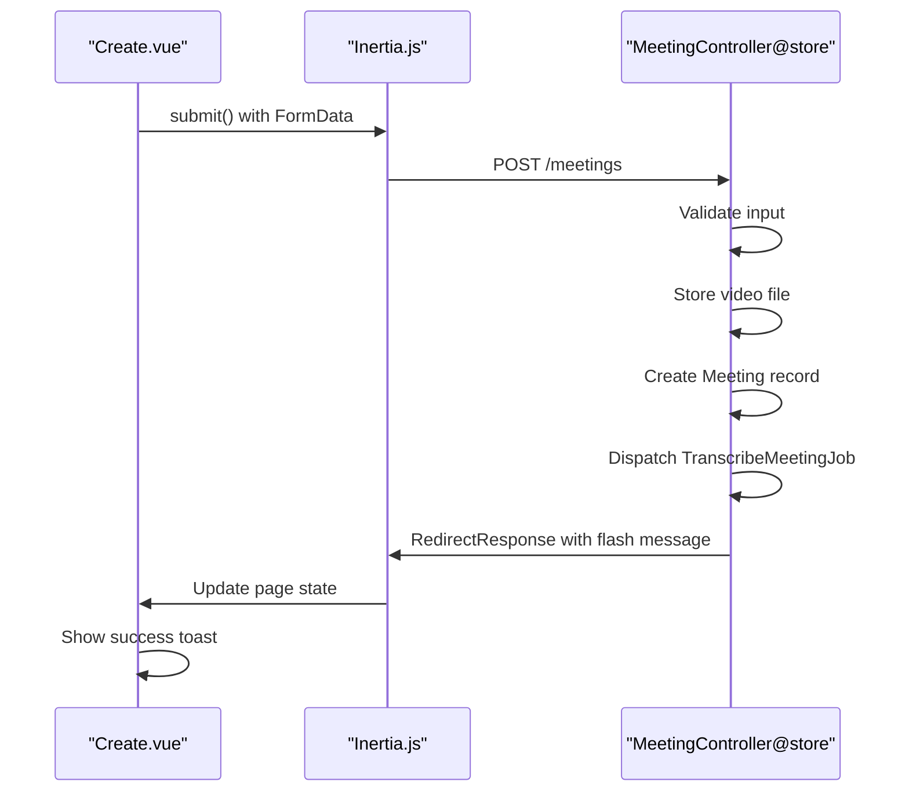
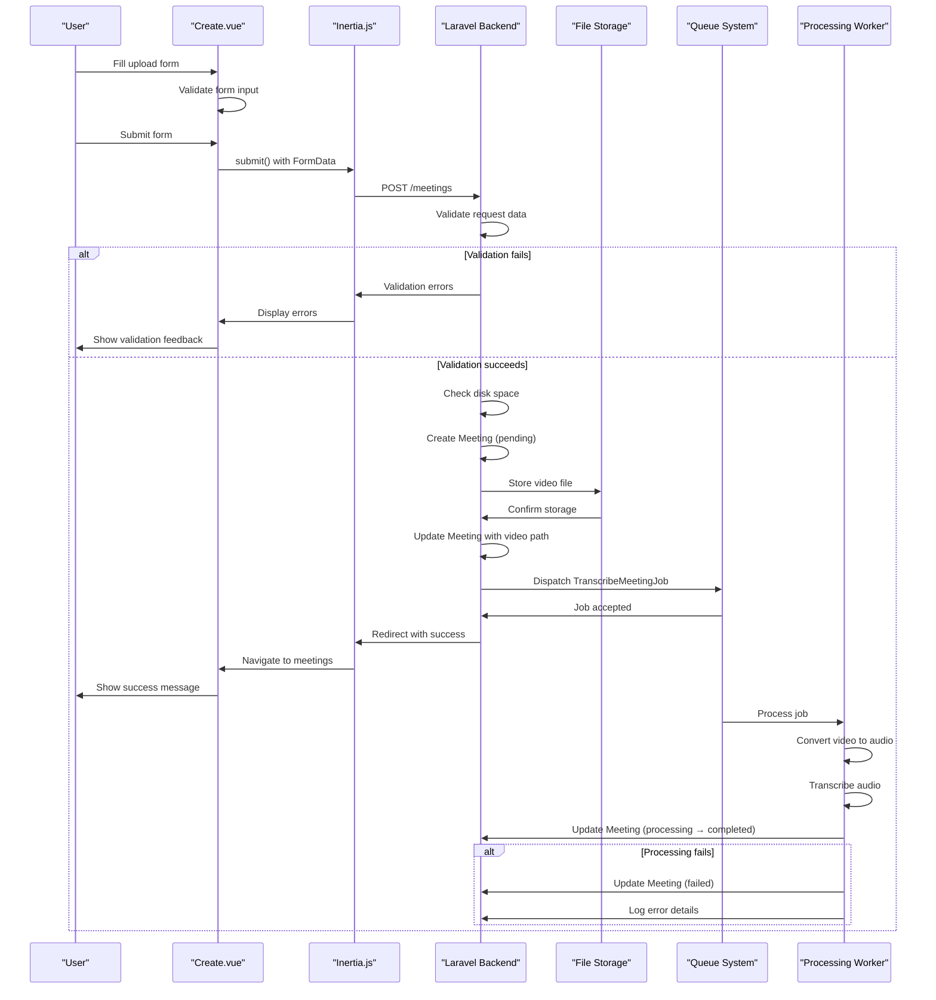

# Upload Flow


## Table of Contents
1. [Introduction](#introduction)
2. [Frontend Upload Form](#frontend-upload-form)
3. [Backend Upload Endpoint](#backend-upload-endpoint)
4. [Inertia.js Integration](#inertiajs-integration)
5. [Authentication and Authorization](#authentication-and-authorization)
6. [File Storage and Processing](#file-storage-and-processing)
7. [Error Handling and Recovery](#error-handling-and-recovery)
8. [Performance Considerations](#performance-considerations)
9. [Sequence Diagram](#sequence-diagram)

## Introduction
This document details the complete upload flow for meeting videos in the meetingai application. The process begins with a Vue.js frontend form in Create.vue, proceeds through Laravel backend validation and storage in MeetingController@store, and concludes with background processing via TranscribeMeetingJob. The integration between frontend and backend is facilitated by Inertia.js, enabling seamless page transitions and state management. The system handles large video files with progress tracking, validation, and error recovery mechanisms.

## Frontend Upload Form

The meeting upload form is implemented in the Create.vue component, which provides a user-friendly interface for uploading meeting videos. The form includes fields for meeting title, client selection, and video file upload with drag-and-drop functionality.

Key features of the frontend implementation:
- **Form Validation**: Client-side validation ensures required fields are filled before submission
- **Drag-and-Drop Interface**: Users can drag video files directly onto the upload zone
- **File Validation**: Immediate validation of file type, size (1MB-500MB), and format (MP4, MOV, AVI, WebM)
- **Progress Tracking**: Visual upload progress bar with percentage indicator
- **Error Recovery**: Retry mechanism for failed uploads with toast notifications
- **Navigation Protection**: Prevents accidental page navigation during upload

The form uses Inertia.js for submission, allowing for a SPA-like experience without full page reloads.

**Section sources**
- [Create.vue](file://resources/js/pages/Meetings/Create.vue#L1-L439)

## Backend Upload Endpoint

The MeetingController@store method handles the incoming meeting upload request. This endpoint performs comprehensive validation, stores the video file, creates a meeting record, and initiates background processing.


```php
public function store(Request $request): RedirectResponse
{
    $validated = $request->validate([
        'title' => 'required|string|max:255',
        'client_id' => 'required|exists:clients,id',
        'video' => [
            'required',
            'file',
            File::types(['mp4', 'mov', 'avi', 'webm'])
                ->max(500 * 1024) // 500MB max
                ->min(1024) // 1MB min
        ]
    ]);
```


The endpoint workflow:
1. Validates input data against defined rules
2. Checks file integrity and available disk space
3. Creates a Meeting model record with initial "pending" status
4. Stores the video file in organized directory structure
5. Updates meeting record with video path and estimated processing time
6. Dispatches TranscribeMeetingJob for background processing
7. Returns appropriate redirect response

Error handling includes cleanup of created records on failure and detailed error logging.

**Section sources**
- [MeetingController.php](file://app/Http/Controllers/MeetingController.php#L81-L180)

## Inertia.js Integration

Inertia.js serves as the bridge between the Vue.js frontend and Laravel backend, enabling tight integration without traditional API endpoints. The integration is configured through the HandleInertiaRequests middleware, which shares session flash messages, CSRF tokens, user data, and Ziggy route helpers.

Key integration points:
- **Data Sharing**: Flash messages (success, error) are automatically shared with the frontend
- **Form Submission**: router.post() from @inertiajs/vue3 handles form submission and response
- **Progress Monitoring**: onProgress callback provides real-time upload progress
- **Error Handling**: onError callback processes validation and server errors
- **Redirection**: onSuccess callback triggers redirect to meetings index with success message

The integration allows for traditional server-side rendering benefits while maintaining a responsive frontend experience.





**Diagram sources**
- [Create.vue](file://resources/js/pages/Meetings/Create.vue#L300-L350)
- [MeetingController.php](file://app/Http/Controllers/MeetingController.php#L81-L180)
- [HandleInertiaRequests.php](file://app/Http/Middleware/HandleInertiaRequests.php#L30-L60)

**Section sources**
- [Create.vue](file://resources/js/pages/Meetings/Create.vue#L300-L350)
- [MeetingController.php](file://app/Http/Controllers/MeetingController.php#L81-L180)
- [HandleInertiaRequests.php](file://app/Http/Middleware/HandleInertiaRequests.php#L30-L60)

## Authentication and Authorization

The upload flow is protected by Laravel's authentication system, which uses session-based guards and Eloquent user providers. Users must be authenticated to access the meeting upload functionality.

Authentication configuration:
- **Guard**: 'web' guard using session driver
- **Provider**: Eloquent provider with User model
- **Middleware**: Automatic session authentication for all routes

The User model extends Authenticatable and includes standard authentication features:
- Email and password authentication
- Password hashing
- Session management
- Basic user information (name, email)

While the current implementation doesn't include granular authorization checks for meeting uploads, the foundation is in place for role-based access control if needed in the future.

**Section sources**
- [User.php](file://app/Models/User.php#L1-L49)
- [auth.php](file://config/auth.php#L1-L114)

## File Storage and Processing

Video files are stored using Laravel's filesystem abstraction with the 'public' disk configuration. This setup allows direct URL access to uploaded videos while maintaining organized storage.

Storage configuration:
- **Root Directory**: storage/app/public
- **URL Prefix**: /storage (via symbolic link from public/storage)
- **Visibility**: Public (accessible via URL)
- **File Structure**: meetings/{client_id}/{meeting_id}/video.{extension}

The file storage process:
1. Video file is validated for type and size
2. Meeting record is created with pending status
3. File is stored in client-specific directory with meeting ID
4. Meeting record is updated with video path
5. Background job is dispatched for transcription processing

The TranscribeMeetingJob handles the actual video processing using Docker containers for ffmpeg (video to audio conversion) and a transcription service.

**Section sources**
- [filesystems.php](file://config/filesystems.php#L1-L81)
- [MeetingController.php](file://app/Http/Controllers/MeetingController.php#L120-L160)
- [TranscribeMeetingJob.php](file://app/Jobs/TranscribeMeetingJob.php#L30-L100)

## Error Handling and Recovery

The upload flow includes comprehensive error handling at both frontend and backend levels.

Frontend error handling:
- **Validation Errors**: Displayed inline with form fields
- **Upload Errors**: Shown in dedicated error section with retry options
- **Network Errors**: Handled through Inertia.js error callbacks
- **Progress Interruption**: Users prevented from navigating away during upload

Backend error handling:
- **Validation Exceptions**: Returned to frontend for display
- **Runtime Exceptions**: Meeting record cleaned up, user notified
- **General Exceptions**: Logged with full stack trace, generic error shown
- **Job Failures**: Detailed logging, user-friendly error messages

The system implements a retry mechanism with exponential backoff in the TranscribeMeetingJob, allowing for recovery from temporary failures.

**Section sources**
- [Create.vue](file://resources/js/pages/Meetings/Create.vue#L340-L390)
- [MeetingController.php](file://app/Http/Controllers/MeetingController.php#L160-L180)
- [TranscribeMeetingJob.php](file://app/Jobs/TranscribeMeetingJob.php#L250-L350)

## Performance Considerations

The upload flow is designed to handle various video formats and sizes with several performance optimizations:

**Large File Handling**
- 500MB file size limit prevents excessive resource consumption
- Streaming file uploads reduce memory usage
- Progress tracking provides user feedback during long uploads
- Background processing prevents request timeouts

**Video Processing Optimization**
- Docker containers isolate processing resources
- CPU thread detection optimizes transcription performance
- Estimated processing time provides user expectations
- Queue progress simulation for pending jobs

**Storage Efficiency**
- Organized directory structure by client and meeting
- Public disk with symbolic linking for efficient file serving
- Automatic cleanup of temporary processing files
- Empty directory removal after file deletion

**Scalability Considerations**
- Queue system allows horizontal scaling of processing workers
- Configurable Docker images for transcription services
- Flexible filesystem configuration (supports S3 and other cloud storage)
- Database indexing on frequently queried fields

**Section sources**
- [MeetingController.php](file://app/Http/Controllers/MeetingController.php#L100-L120)
- [TranscribeMeetingJob.php](file://app/Jobs/TranscribeMeetingJob.php#L150-L200)
- [Meeting.php](file://app/Models/Meeting.php#L50-L100)

## Sequence Diagram





**Diagram sources**
- [Create.vue](file://resources/js/pages/Meetings/Create.vue#L1-L439)
- [MeetingController.php](file://app/Http/Controllers/MeetingController.php#L81-L180)
- [TranscribeMeetingJob.php](file://app/Jobs/TranscribeMeetingJob.php#L1-L400)
- [Meeting.php](file://app/Models/Meeting.php#L1-L179)

**Referenced Files in This Document**   
- [Create.vue](file://resources/js/pages/Meetings/Create.vue)
- [MeetingController.php](file://app/Http/Controllers/MeetingController.php)
- [Meeting.php](file://app/Models/Meeting.php)
- [TranscribeMeetingJob.php](file://app/Jobs/TranscribeMeetingJob.php)
- [HandleInertiaRequests.php](file://app/Http/Middleware/HandleInertiaRequests.php)
- [filesystems.php](file://config/filesystems.php)
- [User.php](file://app/Models/User.php)
- [web.php](file://routes/web.php)