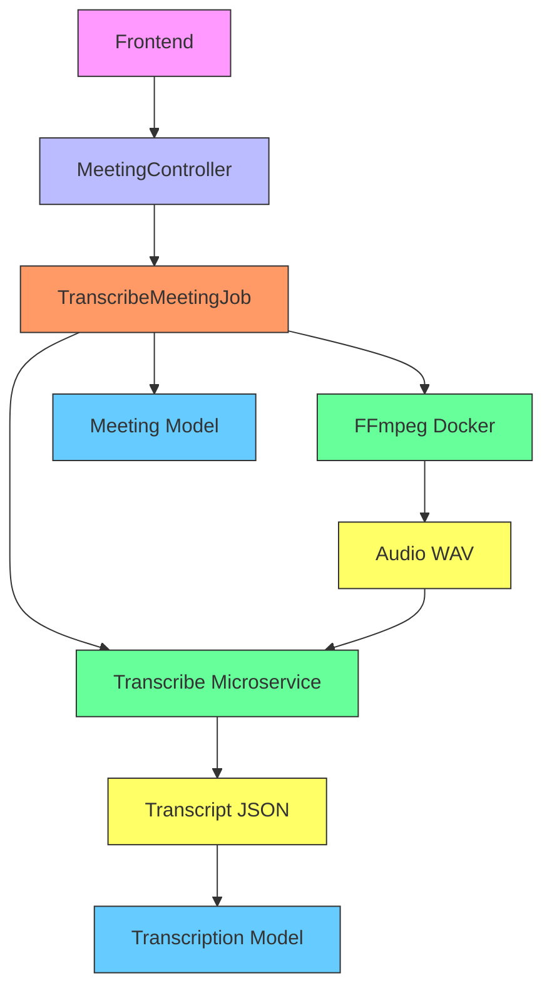
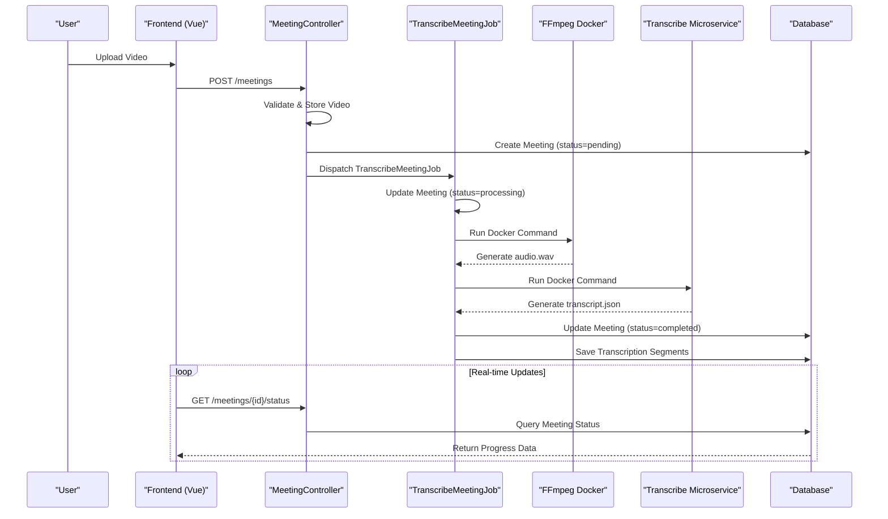
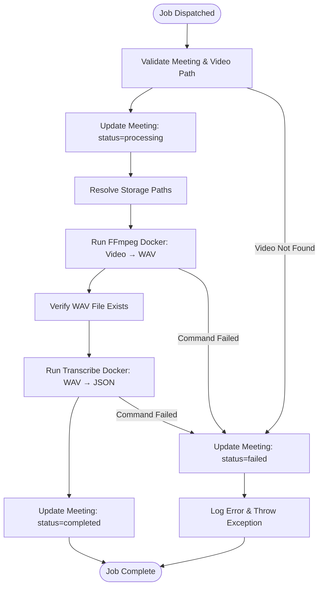
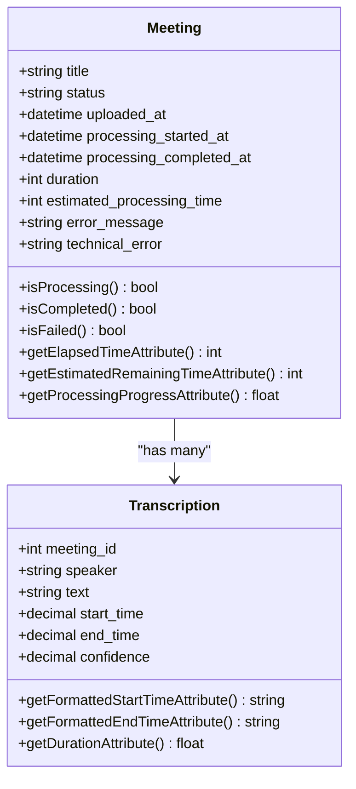
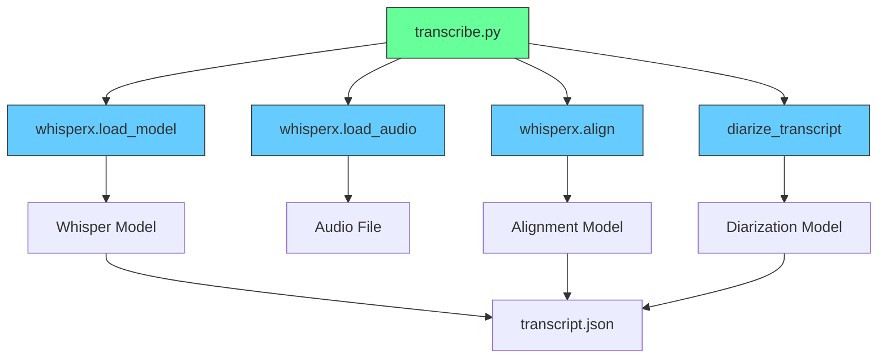
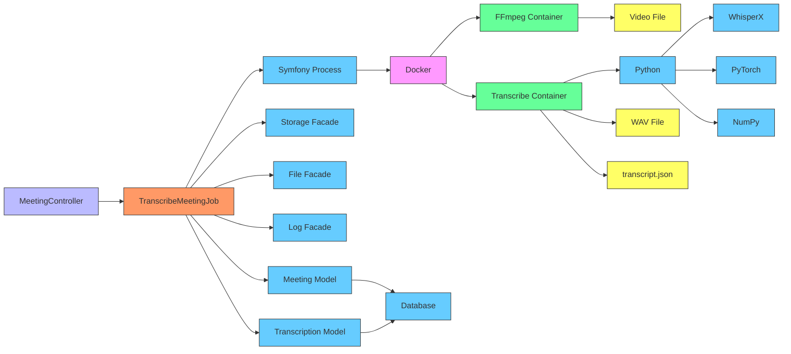
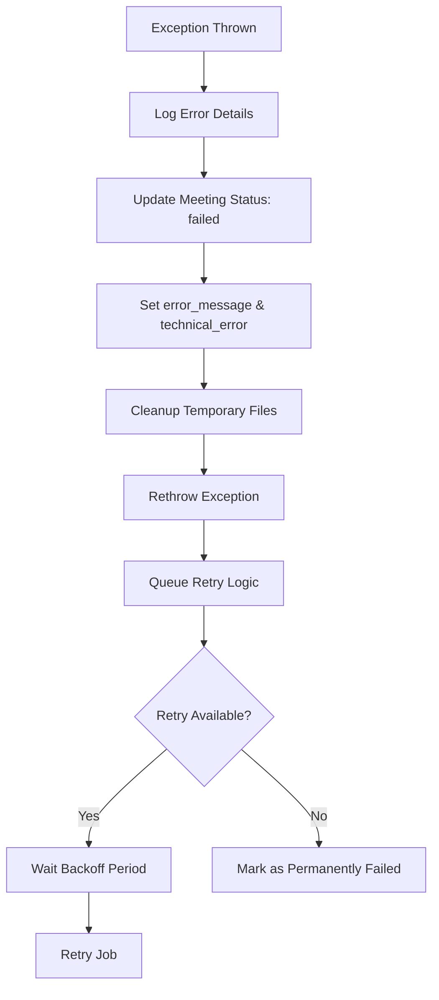

# Processing Pipeline

## Table of Contents
1. [Introduction](#introduction)
2. [Project Structure](#project-structure)
3. [Core Components](#core-components)
4. [Architecture Overview](#architecture-overview)
5. [Detailed Component Analysis](#detailed-component-analysis)
6. [Dependency Analysis](#dependency-analysis)
7. [Performance Considerations](#performance-considerations)
8. [Troubleshooting Guide](#troubleshooting-guide)
9. [Conclusion](#conclusion)

## Introduction
This document provides a comprehensive analysis of the asynchronous video transcription pipeline in the MeetingAI application. It details how the `TranscribeMeetingJob` is dispatched after a meeting upload, its execution flow, status management, error handling, and integration with Dockerized microservices. The system leverages Laravel's queue system, FFmpeg for audio extraction, and a custom WhisperX-based transcription microservice to process video files into structured transcriptions. The documentation is designed to be accessible to both technical and non-technical users, with clear explanations of complex processes and visual representations of key workflows.

## Project Structure
The project follows a standard Laravel application structure with a clear separation of concerns. The transcription pipeline is primarily implemented in the `app/Jobs` directory, with supporting models in `app/Models`, controllers in `app/Http/Controllers`, and a standalone microservice in `transcribe-microservice`. Configuration files in the `config` directory define queue and filesystem behavior. The frontend, built with Vue.js and Inertia.js, resides in `resources/js` and communicates with the backend via API endpoints.

**Diagram sources**
- [MeetingController.php](file://app/Http/Controllers/MeetingController.php#L1-L305)
- [TranscribeMeetingJob.php](file://app/Jobs/TranscribeMeetingJob.php#L1-L400)

**Section sources**
- [TranscribeMeetingJob.php](file://app/Jobs/TranscribeMeetingJob.php#L1-L400)
- [MeetingController.php](file://app/Http/Controllers/MeetingController.php#L1-L305)

## Core Components
The core components of the transcription pipeline include the `TranscribeMeetingJob` class, which orchestrates the entire process; the `Meeting` and `Transcription` models, which store metadata and results; the `transcribe.py` microservice, which performs speech-to-text conversion; and the Dockerized environment that isolates and runs the transcription workload. The pipeline is triggered by the `MeetingController` upon successful video upload and progresses through a series of well-defined states, with comprehensive error handling and retry logic.

**Section sources**
- [TranscribeMeetingJob.php](file://app/Jobs/TranscribeMeetingJob.php#L1-L400)
- [Meeting.php](file://app/Models/Meeting.php#L1-L179)
- [Transcription.php](file://app/Models/Transcription.php#L1-L51)
- [transcribe.py](file://transcribe-microservice/transcribe.py#L1-L201)

## Architecture Overview
The transcription pipeline follows an asynchronous, event-driven architecture. When a user uploads a video, the `MeetingController` creates a `Meeting` record and dispatches a `TranscribeMeetingJob` to the queue. The job is processed by a Laravel queue worker, which extracts audio using FFmpeg in a Docker container, then invokes the `transcribe.py` microservice in another Docker container to generate a JSON transcription. The results are stored in the `Transcription` model, and the `Meeting` model is updated with status and timing information throughout the process.

**Diagram sources**
- [MeetingController.php](file://app/Http/Controllers/MeetingController.php#L1-L305)
- [TranscribeMeetingJob.php](file://app/Jobs/TranscribeMeetingJob.php#L1-L400)
- [Meeting.php](file://app/Models/Meeting.php#L1-L179)

## Detailed Component Analysis

### TranscribeMeetingJob Analysis
The `TranscribeMeetingJob` class is the central orchestrator of the transcription pipeline. It implements Laravel's `ShouldQueue` interface and uses the `Queueable` trait to enable asynchronous processing. The job is dispatched with a `Meeting` model instance, which is automatically serialized and deserialized by Laravel's queue system.

#### Job Execution Flow

**Diagram sources**
- [TranscribeMeetingJob.php](file://app/Jobs/TranscribeMeetingJob.php#L1-L400)

**Section sources**
- [TranscribeMeetingJob.php](file://app/Jobs/TranscribeMeetingJob.php#L1-L400)

#### Audio Extraction with FFmpeg
The job uses Docker to run FFmpeg, ensuring consistent behavior across environments. The command converts the uploaded video to a 16kHz mono WAV file, which is the optimal input format for the transcription model. The input video is mounted from the `public` storage disk, and the output WAV is written to a meeting-specific directory in `storage/app/{meeting_id}`.

**Key FFmpeg Command Parameters:**
- `-vn`: Disable video recording
- `-acodec pcm_s16le`: 16-bit signed little-endian PCM audio
- `-ar 16000`: 16kHz sample rate
- `-ac 1`: Mono audio channel

#### Transcription with WhisperX Microservice
After audio extraction, the job invokes the `transcribe.py` microservice via Docker. The command includes several important parameters:
- `--model-size medium`: Balances accuracy and speed
- `--language ro`: Romanian language model
- `--diarize`: Enable speaker diarization
- `--align`: Perform forced alignment
- `--device cpu`: Use CPU for inference
- `--compute-type int8`: 8-bit integer computation for efficiency
- `--threads N`: Dynamically set based on host CPU cores

The number of threads is determined by the `getCpuThreads()` method, which queries the host system using platform-specific commands (`nproc` on Linux, `sysctl` on macOS, PowerShell on Windows).

### Meeting Model Analysis
The `Meeting` model tracks the state of each transcription job through several key fields:

**Meeting Model Attributes:**
- `status`: Current state (pending, processing, completed, failed)
- `uploaded_at`: Timestamp when video was uploaded
- `processing_started_at`: When job began processing
- `processing_completed_at`: When job finished (success or failure)
- `duration`: Estimated video duration in seconds
- `estimated_processing_time`: Estimated processing duration in seconds
- `error_message`: User-friendly error description
- `technical_error`: Raw exception message

**Diagram sources**
- [Meeting.php](file://app/Models/Meeting.php#L1-L179)
- [Transcription.php](file://app/Models/Transcription.php#L1-L51)

**Section sources**
- [Meeting.php](file://app/Models/Meeting.php#L1-L179)
- [Transcription.php](file://app/Models/Transcription.php#L1-L51)

#### Status Management and Progress Tracking
The `Meeting` model includes several computed attributes that provide real-time progress information:
- `elapsed_time`: Seconds since processing started
- `estimated_remaining_time`: Projected seconds until completion
- `processing_progress`: Percentage complete (0-100)
- `queue_progress`: Simulated progress for pending jobs

The estimated processing time is calculated as one second per minute of video duration, with a minimum of 10 seconds. This simple heuristic allows the frontend to display a realistic progress bar even before processing begins.

### Transcribe Microservice Analysis
The `transcribe.py` script is a Python application that uses the WhisperX library to perform speech-to-text conversion with speaker diarization and alignment.

#### Microservice Architecture

**Diagram sources**
- [transcribe.py](file://transcribe-microservice/transcribe.py#L1-L201)
- [diarize.py](file://transcribe-microservice/diarize.py)

**Section sources**
- [transcribe.py](file://transcribe-microservice/transcribe.py#L1-L201)

#### Key Processing Steps
1. **Model Loading**: Loads the Whisper model with specified size and language
2. **Audio Loading**: Loads the WAV file into memory
3. **Transcription**: Generates initial transcription segments
4. **Alignment**: (Optional) Aligns text to audio with precise timing
5. **Diarization**: (Optional) Identifies and labels different speakers
6. **Output**: Writes results to JSON file with speaker, text, and timing

The microservice is containerized using Docker, with a `Dockerfile` that installs all Python dependencies and sets up the runtime environment. The `requirements.txt` file specifies critical packages:
- `whisperx==3.4.2`: Speech recognition with alignment and diarization
- `faster-whisper==1.2.0`: High-performance Whisper implementation
- `pyannote-audio==3.3.2`: Speaker diarization
- `numpy==2.3.2`: Scientific computing

## Dependency Analysis
The transcription pipeline has a well-defined dependency graph, with clear separation between the Laravel application and the Python microservice.

**Diagram sources**
- [composer.json](file://composer.json)
- [requirements.txt](file://transcribe-microservice/requirements.txt#L1-L9)
- [TranscribeMeetingJob.php](file://app/Jobs/TranscribeMeetingJob.php#L1-L400)

**Section sources**
- [composer.json](file://composer.json)
- [requirements.txt](file://transcribe-microservice/requirements.txt#L1-L9)

## Performance Considerations
The pipeline is designed with performance and scalability in mind, but has several resource-intensive components that require careful management.

### Resource Constraints
- **CPU**: The transcription process is CPU-intensive, especially with larger models. The system dynamically allocates threads based on available CPU cores.
- **Memory**: WhisperX models can require several GB of RAM, particularly for larger model sizes.
- **Disk I/O**: Multiple file operations occur during processing (video read, WAV write, JSON write).
- **Disk Space**: Temporary files and model caching can consume significant storage.

### Scalability Considerations
- **Queue Configuration**: The `queue.php` configuration uses the `database` driver by default, which is suitable for development but may benefit from Redis or SQS in production for higher throughput.
- **Job Timeout**: Set to 3600 seconds (1 hour), which should accommodate even long videos.
- **Retry Logic**: Jobs are retried up to 3 times with exponential backoff (60, 300, 900 seconds), with a 30-minute retry window.
- **Parallel Processing**: Multiple jobs can run concurrently, limited only by system resources and queue worker count.

### Optimization Opportunities
- **Model Caching**: The Docker container downloads models on first run. Mounting a persistent volume to `/scriberr/models` would prevent repeated downloads.
- **GPU Acceleration**: The Docker build supports CUDA (`WITH_CUDA=true`), which would significantly speed up processing if GPUs are available.
- **Batch Processing**: For high-volume scenarios, batching multiple small jobs could improve resource utilization.
- **Frontend Optimization**: The real-time status updates use polling; WebSockets could reduce server load.

## Troubleshooting Guide
The system includes comprehensive error handling and logging to facilitate troubleshooting.

### Common Error Scenarios
- **Video File Not Found**: Typically caused by incorrect file paths or storage configuration issues.
- **WAV Conversion Failed**: Usually indicates corrupted video files or FFmpeg compatibility issues.
- **Docker Command Failed**: Often due to Docker not running, insufficient permissions, or resource constraints.
- **Transcription Timeout**: Occurs with very large files or underpowered systems.
- **Insufficient Disk Space**: Prevents both video storage and temporary processing files.

### Error Handling Implementation
The `TranscribeMeetingJob` class implements robust error handling:
- **try-catch blocks**: Wrap critical operations (FFmpeg, transcription)
- **Exception logging**: Detailed logs with stack traces
- **User-friendly messages**: Translated error messages stored in `error_message`
- **Technical details**: Raw exception messages stored in `technical_error`
- **Cleanup**: Temporary files are removed in the `failed()` method

**Diagram sources**
- [TranscribeMeetingJob.php](file://app/Jobs/TranscribeMeetingJob.php#L1-L400)

**Section sources**
- [TranscribeMeetingJob.php](file://app/Jobs/TranscribeMeetingJob.php#L1-L400)

### Monitoring and Debugging
- **Laravel Logs**: All job activity is logged via `Log::info()` and `Log::error()`
- **Failed Jobs Table**: Failed jobs are stored in the `failed_jobs` database table
- **Real-time Status**: Frontend can poll `/meetings/{id}/status` for progress updates
- **Docker Logs**: Container output is captured and logged

## Conclusion
The asynchronous video transcription pipeline in MeetingAI is a robust, well-architected system that effectively separates concerns between the Laravel application and the Python microservice. It provides reliable processing with comprehensive error handling, real-time progress tracking, and scalable design. The use of Docker ensures consistent behavior across environments, while the queue system enables efficient resource utilization. For production deployment, considerations around GPU acceleration, model caching, and queue backend selection would further enhance performance and reliability. The system demonstrates best practices in asynchronous processing, error management, and API design, making it a solid foundation for a video transcription service.

**Referenced Files in This Document**   
- [TranscribeMeetingJob.php](file://app/Jobs/TranscribeMeetingJob.php#L1-L400)
- [queue.php](file://config/queue.php#L1-L113)
- [filesystems.php](file://config/filesystems.php#L1-L81)
- [Meeting.php](file://app/Models/Meeting.php#L1-L179)
- [Transcription.php](file://app/Models/Transcription.php#L1-L51)
- [transcribe.py](file://transcribe-microservice/transcribe.py#L1-L201)
- [Dockerfile](file://transcribe-microservice/Dockerfile#L1-L54)
- [requirements.txt](file://transcribe-microservice/requirements.txt#L1-L9)
- [MeetingController.php](file://app/Http/Controllers/MeetingController.php#L1-L305)