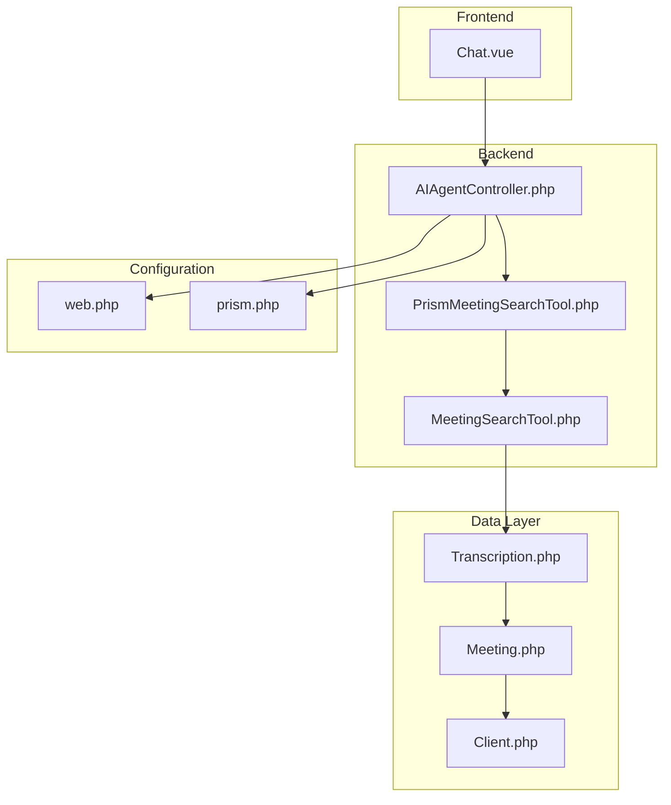
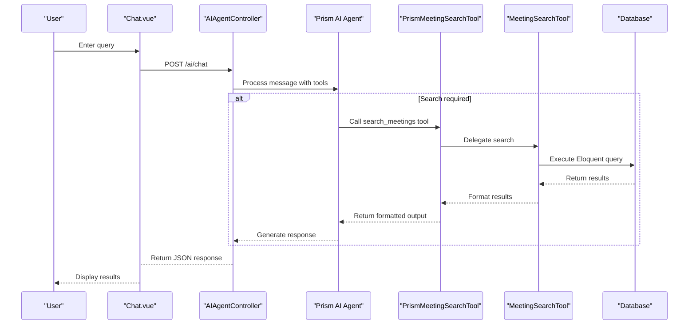
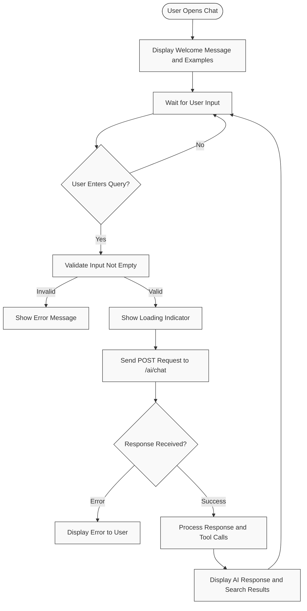
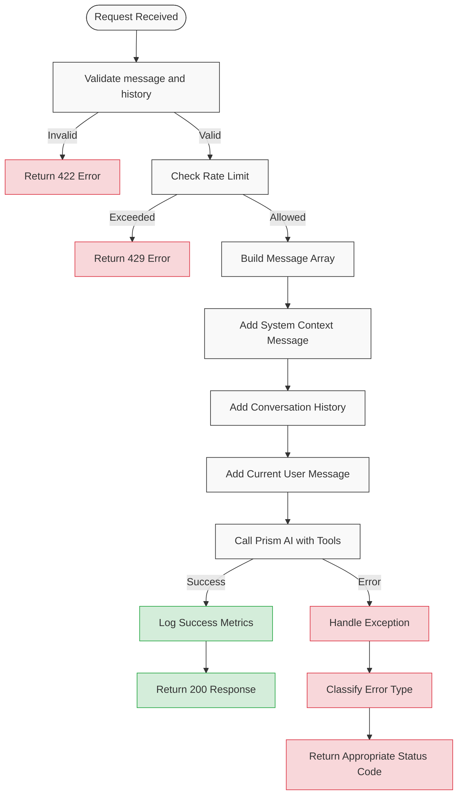
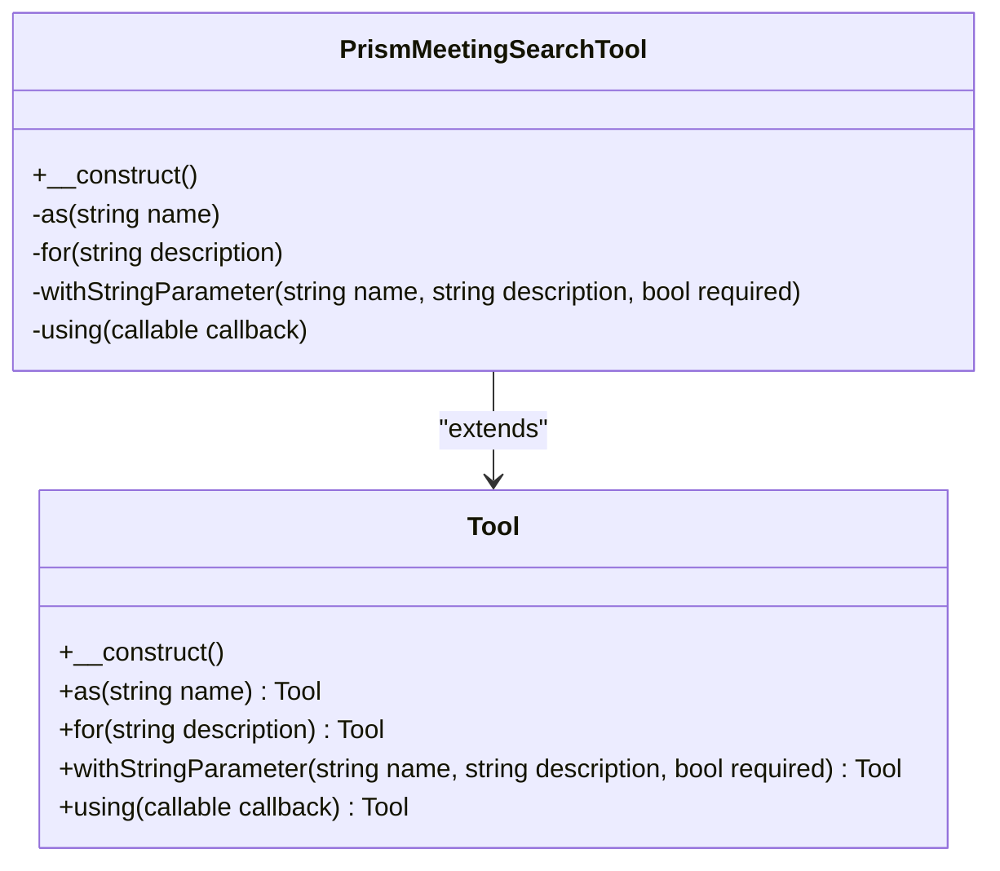
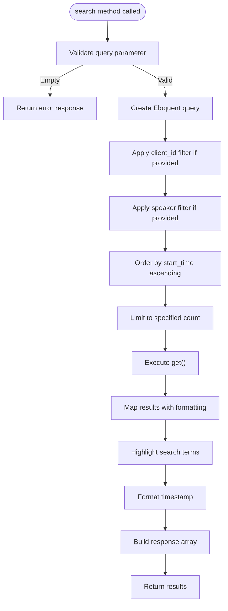
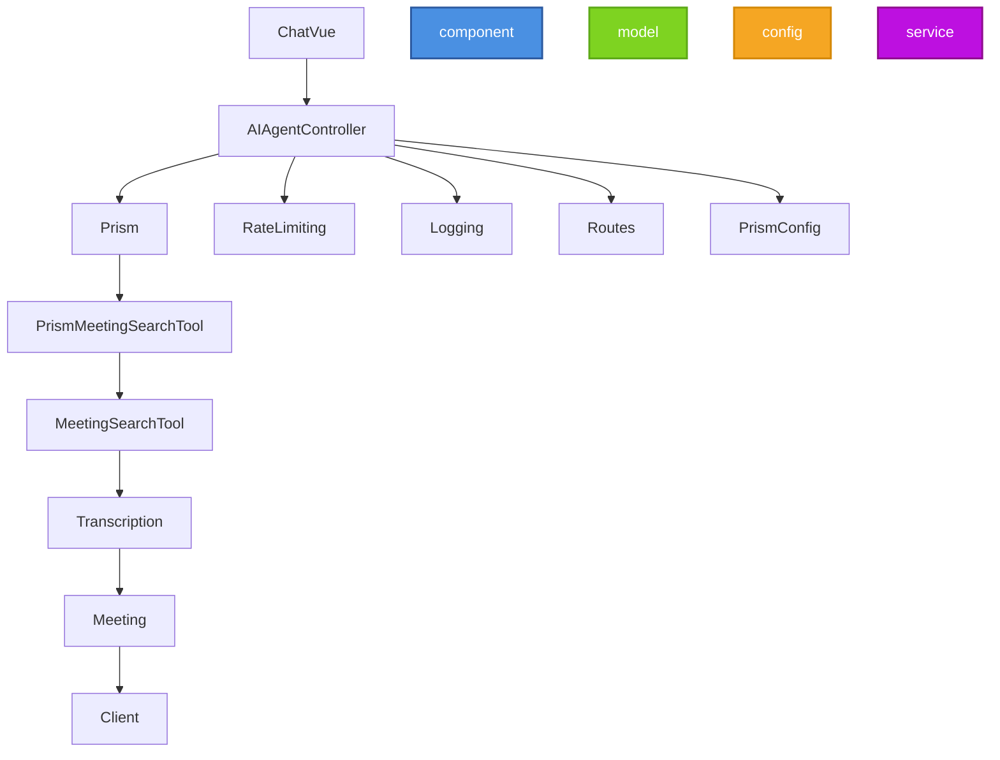

# AI Search Flow

## Table of Contents
1. [Introduction](#introduction)
2. [Project Structure](#project-structure)
3. [Core Components](#core-components)
4. [Architecture Overview](#architecture-overview)
5. [Detailed Component Analysis](#detailed-component-analysis)
6. [Dependency Analysis](#dependency-analysis)
7. [Performance Considerations](#performance-considerations)
8. [Troubleshooting Guide](#troubleshooting-guide)
9. [Conclusion](#conclusion)

## Introduction
This document provides a comprehensive overview of the AI-powered search flow in the meetingai application. It details how user queries are processed from the frontend interface through the backend AI agent and search tools, ultimately retrieving and formatting meeting transcription data. The system leverages natural language processing, database querying, and LLM integration to deliver contextual search results with timestamps and excerpts. Security, scalability, and extensibility considerations are also covered.

## Project Structure
The meetingai application follows a Laravel-based MVC architecture with a Vue.js frontend. The AI search functionality is distributed across several key directories:
- `resources/js/pages/AI/Chat.vue`: Frontend interface for user interaction
- `app/Http/Controllers/AIAgentController.php`: Backend API endpoint handler
- `app/Tools/`: Contains search tool implementations
- `app/Models/`: Data models for meetings, transcriptions, and clients
- `routes/web.php`: Defines API routes
- `config/prism.php`: Configures AI provider settings

**Diagram sources**
- [Chat.vue](file://resources/js/pages/AI/Chat.vue)
- [AIAgentController.php](file://app/Http/Controllers/AIAgentController.php)
- [MeetingSearchTool.php](file://app/Tools/MeetingSearchTool.php)
- [PrismMeetingSearchTool.php](file://app/Tools/PrismMeetingSearchTool.php)
- [Transcription.php](file://app/Models/Transcription.php)
- [Meeting.php](file://app/Models/Meeting.php)
- [Client.php](file://app/Models/Client.php)
- [web.php](file://routes/web.php)
- [prism.php](file://config/prism.php)

**Section sources**
- [Chat.vue](file://resources/js/pages/AI/Chat.vue)
- [AIAgentController.php](file://app/Http/Controllers/AIAgentController.php)

## Core Components
The AI search flow consists of several interconnected components:
- **Chat Interface**: Vue.js component for user input and result display
- **AI Agent Controller**: Handles API requests and orchestrates AI processing
- **Prism Meeting Search Tool**: Tool interface for the AI agent to invoke search functionality
- **Meeting Search Tool**: Core implementation for database querying and result formatting
- **Data Models**: Eloquent models representing meetings, transcriptions, and clients

These components work together to process natural language queries, execute database searches, and return formatted results through the AI agent.

**Section sources**
- [Chat.vue](file://resources/js/pages/AI/Chat.vue#L0-L307)
- [AIAgentController.php](file://app/Http/Controllers/AIAgentController.php#L0-L183)
- [PrismMeetingSearchTool.php](file://app/Tools/PrismMeetingSearchTool.php#L0-L50)
- [MeetingSearchTool.php](file://app/Tools/MeetingSearchTool.php#L0-L86)

## Architecture Overview
The AI search flow follows a request-response pattern with tool integration. User queries from the frontend are sent to the AIAgentController, which processes them using the Prism AI framework. When a search is required, the framework invokes the PrismMeetingSearchTool, which delegates to the MeetingSearchTool for database operations.

**Diagram sources**
- [Chat.vue](file://resources/js/pages/AI/Chat.vue#L0-L307)
- [AIAgentController.php](file://app/Http/Controllers/AIAgentController.php#L0-L183)
- [PrismMeetingSearchTool.php](file://app/Tools/PrismMeetingSearchTool.php#L0-L50)
- [MeetingSearchTool.php](file://app/Tools/MeetingSearchTool.php#L0-L86)

## Detailed Component Analysis

### Frontend Interface Analysis
The Chat.vue component provides the user interface for interacting with the AI assistant. It handles user input, displays conversation history, and renders search results with timestamps and excerpts.

**Diagram sources**
- [Chat.vue](file://resources/js/pages/AI/Chat.vue#L0-L307)

**Section sources**
- [Chat.vue](file://resources/js/pages/AI/Chat.vue#L0-L307)

### AIAgentController Analysis
The AIAgentController handles the /ai/chat endpoint and orchestrates the AI processing flow. It validates input, implements rate limiting, and interfaces with the Prism AI framework.

#### Key Features:
- Input validation with custom error messages
- Rate limiting based on IP address (10 requests per minute)
- Conversation history management
- Integration with Prism AI agent
- Error handling and logging

**Diagram sources**
- [AIAgentController.php](file://app/Http/Controllers/AIAgentController.php#L0-L183)

**Section sources**
- [AIAgentController.php](file://app/Http/Controllers/AIAgentController.php#L0-L183)

### PrismMeetingSearchTool Analysis
The PrismMeetingSearchTool serves as the bridge between the Prism AI agent and the underlying search functionality. It defines the tool interface that the AI agent can call.

#### Tool Definition:
- Name: `search_meetings`
- Description: Search through meeting transcriptions to find specific content
- Parameters:
  - `query`: The search query (required)
  - `client_id`: Filter by client ID (optional)
  - `speaker`: Filter by speaker name (optional)
  - `limit`: Maximum results to return (optional, default: 10)

**Diagram sources**
- [PrismMeetingSearchTool.php](file://app/Tools/PrismMeetingSearchTool.php#L0-L50)

**Section sources**
- [PrismMeetingSearchTool.php](file://app/Tools/PrismMeetingSearchTool.php#L0-L50)

### MeetingSearchTool Analysis
The MeetingSearchTool contains the core search logic, using Eloquent to query the database and format results for display.

#### Search Process:
1. Validate query parameter
2. Build Eloquent query with optional filters
3. Execute database query
4. Format results with timestamps and highlighting
5. Return structured response

**Diagram sources**
- [MeetingSearchTool.php](file://app/Tools/MeetingSearchTool.php#L0-L86)

**Section sources**
- [MeetingSearchTool.php](file://app/Tools/MeetingSearchTool.php#L0-L86)

## Dependency Analysis
The AI search flow components have clear dependencies that enable the end-to-end functionality.

**Diagram sources**
- [Chat.vue](file://resources/js/pages/AI/Chat.vue)
- [AIAgentController.php](file://app/Http/Controllers/AIAgentController.php)
- [PrismMeetingSearchTool.php](file://app/Tools/PrismMeetingSearchTool.php)
- [MeetingSearchTool.php](file://app/Tools/MeetingSearchTool.php)
- [Transcription.php](file://app/Models/Transcription.php)
- [Meeting.php](file://app/Models/Meeting.php)
- [Client.php](file://app/Models/Client.php)
- [web.php](file://routes/web.php)
- [prism.php](file://config/prism.php)

**Section sources**
- [Chat.vue](file://resources/js/pages/AI/Chat.vue)
- [AIAgentController.php](file://app/Http/Controllers/AIAgentController.php)
- [PrismMeetingSearchTool.php](file://app/Tools/PrismMeetingSearchTool.php)
- [MeetingSearchTool.php](file://app/Tools/MeetingSearchTool.php)

## Performance Considerations
The AI search flow has several performance characteristics to consider:

- **Frontend**: The Chat.vue component efficiently handles rendering with Vue's reactivity system and virtual DOM
- **Rate Limiting**: Implemented at the controller level to prevent abuse (10 requests per minute per IP)
- **Database Queries**: The MeetingSearchTool uses Eloquent with appropriate indexing on text, client_id, and speaker fields
- **Caching**: Rate limiting uses Laravel's cache system with a 60-second TTL
- **Timeouts**: The frontend implements a 30-second timeout for API requests
- **Query Optimization**: The search query uses `LIKE` with wildcards, which could benefit from full-text indexing for large datasets
- **Result Limiting**: Results are limited to 10 by default, with a maximum of 50

For high-volume scenarios, consider implementing:
- Database full-text search
- Redis caching of frequent queries
- Pagination for search results
- Asynchronous processing for complex queries

## Troubleshooting Guide
Common issues and their solutions:

**Section sources**
- [AIAgentController.php](file://app/Http/Controllers/AIAgentController.php#L100-L183)
- [MeetingSearchTool.php](file://app/Tools/MeetingSearchTool.php#L70-L86)
- [Chat.vue](file://resources/js/pages/AI/Chat.vue#L150-L200)

### Common Error Scenarios

| Error Type | Symptoms | Likely Causes | Solutions |
|-----------|----------|---------------|-----------|
| **Rate Limit Exceeded** | "Too many requests" error | User exceeded 10 requests/minute | Wait and retry, check for automated requests |
| **Network Error** | "Network error occurred" | Connectivity issues between frontend and backend | Check internet connection, verify server status |
| **Timeout** | "Request timed out" | Long processing time | Shorten query, check server load |
| **Validation Error** | "Please enter a message" | Empty or long message | Ensure message is 1-1000 characters |
| **Server Error** | "Server error. Please try again" | Backend exception | Check logs, verify database connectivity |
| **Session Expired** | "Your session has expired" | CSRF token invalid | Refresh page to get new token |

### Debugging Steps
1. Check browser developer tools for network request details
2. Verify the request payload contains proper message and conversation history
3. Examine server logs for detailed error messages
4. Test the direct search endpoint (`/ai/search`) with the same parameters
5. Verify database connectivity and query performance
6. Check environment variables for correct API keys and configuration

## Conclusion
The AI search flow in meetingai provides a robust system for natural language querying of meeting transcriptions. By integrating the Prism AI agent with custom search tools and Eloquent database queries, the system delivers contextual results with timestamps and excerpts. The architecture separates concerns effectively, with clear responsibilities for frontend, controller, tool, and data layers.

Key strengths include:
- Comprehensive error handling and user feedback
- Rate limiting for abuse prevention
- Flexible search with client and speaker filtering
- Clean separation between AI interface and search implementation
- Proper formatting of timestamps and highlighted results

For future enhancements, consider adding:
- Full-text database search for better performance
- Advanced filtering options (date range, confidence threshold)
- Result summarization for long transcripts
- Voice query support
- Multi-language search capabilities

The system provides a solid foundation for AI-powered meeting analysis that can be extended with additional tools and features as needed.

**Referenced Files in This Document**   
- [Chat.vue](file://resources/js/pages/AI/Chat.vue)
- [AIAgentController.php](file://app/Http/Controllers/AIAgentController.php)
- [MeetingSearchTool.php](file://app/Tools/MeetingSearchTool.php)
- [PrismMeetingSearchTool.php](file://app/Tools/PrismMeetingSearchTool.php)
- [Transcription.php](file://app/Models/Transcription.php)
- [Meeting.php](file://app/Models/Meeting.php)
- [Client.php](file://app/Models/Client.php)
- [web.php](file://routes/web.php)
- [prism.php](file://config/prism.php)