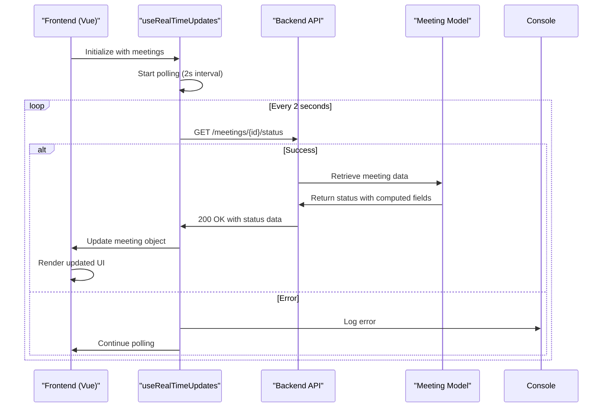
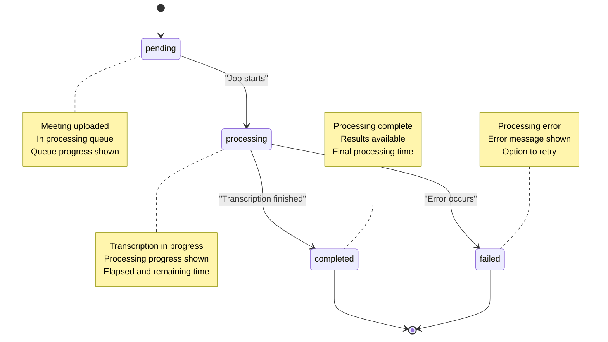
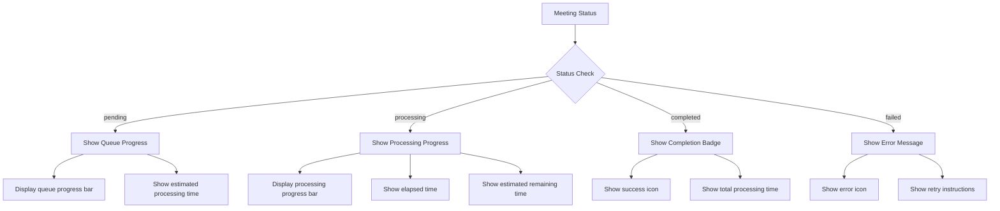
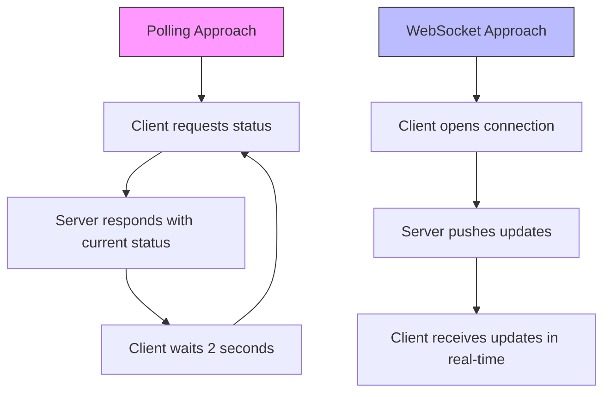

# Real-Time Updates


## Table of Contents
1. [Introduction](#introduction)
2. [Real-Time Updates Architecture](#real-time-updates-architecture)
3. [Core Components](#core-components)
4. [Meeting Status Lifecycle](#meeting-status-lifecycle)
5. [Frontend Implementation](#frontend-implementation)
6. [Backend Implementation](#backend-implementation)
7. [Error Handling and Resilience](#error-handling-and-resilience)
8. [Performance Considerations](#performance-considerations)
9. [User Experience](#user-experience)
10. [Conclusion](#conclusion)

## Introduction
The meetingai application implements a real-time status update mechanism to keep users informed about the processing status of their uploaded meeting recordings. This system provides continuous feedback during long-running transcription jobs, enhancing user experience by reducing uncertainty and providing estimated completion times. The implementation uses a polling-based approach to periodically check the backend for updated meeting status, with frontend components reacting to state changes to provide visual feedback.

## Real-Time Updates Architecture





**Diagram sources**
- [useRealTimeUpdates.ts](file://resources/js/lib/useRealTimeUpdates.ts)
- [MeetingController.php](file://app/Http/Controllers/MeetingController.php)
- [Meeting.php](file://app/Models/Meeting.php)

**Section sources**
- [useRealTimeUpdates.ts](file://resources/js/lib/useRealTimeUpdates.ts)
- [MeetingController.php](file://app/Http/Controllers/MeetingController.php)

## Core Components

The real-time updates system consists of several key components that work together to provide status updates:

- **useRealTimeUpdates.ts**: A Vue composable that establishes and manages the polling connection
- **MeetingProgressIndicator.vue**: A UI component that visually represents the processing status
- **Meeting.php**: The backend model that defines the status field lifecycle and computes progress metrics
- **MeetingController.php**: The API controller that exposes the status endpoint

These components form a cohesive system where the frontend polls the backend at regular intervals, retrieves updated status information, and updates the UI accordingly.

**Section sources**
- [useRealTimeUpdates.ts](file://resources/js/lib/useRealTimeUpdates.ts)
- [MeetingProgressIndicator.vue](file://resources/js/lib/MeetingProgressIndicator.vue)
- [Meeting.php](file://app/Models/Meeting.php)
- [MeetingController.php](file://app/Http/Controllers/MeetingController.php)

## Meeting Status Lifecycle





**Diagram sources**
- [Meeting.php](file://app/Models/Meeting.php)
- [MeetingController.php](file://app/Http/Controllers/MeetingController.php)

**Section sources**
- [Meeting.php](file://app/Models/Meeting.php)

## Frontend Implementation

### useRealTimeUpdates Composable

The `useRealTimeUpdates` composable is a Vue 3 composition function that manages the real-time status updates for meetings. It accepts an array of meeting objects and returns a reactive reference to updated meetings.


```typescript
export function useRealTimeUpdates<T extends BaseMeeting>(meetings: T[]) {
  const updatedMeetings = shallowRef<T[]>([...meetings])
  let intervalId: number | null = null

  const updateMeetingStatuses = async () => {
    const activeMeetings = updatedMeetings.value.filter(
      (meeting) => meeting.status === 'pending' || meeting.status === 'processing'
    )

    if (activeMeetings.length === 0) {
      return
    }

    try {
      const updatePromises = activeMeetings.map(async (meeting) => {
        try {
          const response = await axios.get(`/meetings/${meeting.id}/status`)
          const updatedData = response.data as Partial<T>

          const index = updatedMeetings.value.findIndex((m) => m.id === meeting.id)
          if (index !== -1) {
            updatedMeetings.value[index] = {
              ...(updatedMeetings.value[index] as T),
              ...(updatedData as T),
            }
          }
        } catch (error) {
          console.error(`Failed to update status for meeting ${meeting.id}:`, error)
        }
      })

      await Promise.all(updatePromises)
    } catch (error) {
      console.error('Failed to update meeting statuses:', error)
    }
  }

  const startUpdates = () => {
    updateMeetingStatuses()
    intervalId = window.setInterval(updateMeetingStatuses, 2000)
  }

  const stopUpdates = () => {
    if (intervalId) {
      clearInterval(intervalId)
      intervalId = null
    }
  }

  onMounted(() => {
    startUpdates()
  })

  onUnmounted(() => {
    stopUpdates()
  })

  return {
    meetings: updatedMeetings,
    startUpdates,
    stopUpdates,
    updateMeetingStatuses,
  }
}
```


**Section sources**
- [useRealTimeUpdates.ts](file://resources/js/lib/useRealTimeUpdates.ts)

### Meeting Progress Indicator

The `MeetingProgressIndicator.vue` component visually represents the current status of a meeting, with different visual states for each status:





**Diagram sources**
- [MeetingProgressIndicator.vue](file://resources/js/lib/MeetingProgressIndicator.vue)

**Section sources**
- [MeetingProgressIndicator.vue](file://resources/js/lib/MeetingProgressIndicator.vue)

## Backend Implementation

### Meeting Model Status Attributes

The `Meeting` model defines several computed attributes that provide real-time status information:

- **elapsed_time**: Seconds since processing started
- **estimated_remaining_time**: Estimated seconds until completion
- **processing_progress**: Percentage of processing completed (0-100)
- **formatted_elapsed_time**: Human-readable elapsed time (MM:SS)
- **formatted_estimated_remaining_time**: Human-readable remaining time (MM:SS)
- **queue_progress**: Percentage through the processing queue (0-100)
- **formatted_estimated_processing_time**: Human-readable estimated processing time (MM:SS)


```php
public function getProcessingProgressAttribute(): ?float
{
    if (!$this->isProcessing() || !$this->processing_started_at || !$this->duration) {
        return null;
    }

    $estimatedTotalProcessingTime = max(10, $this->duration / 60);
    $elapsedTime = $this->elapsed_time;
    
    return min(100, ($elapsedTime / $estimatedTotalProcessingTime) * 100);
}
```


**Section sources**
- [Meeting.php](file://app/Models/Meeting.php)

### Status API Endpoint

The `status` method in `MeetingController` provides the API endpoint for retrieving real-time meeting status:


```php
public function status(Meeting $meeting)
{
    try {
        return response()->json([
            'success' => true,
            'data' => [
                'id' => $meeting->id,
                'status' => $meeting->status,
                'elapsed_time' => $meeting->elapsed_time,
                'estimated_remaining_time' => $meeting->estimated_remaining_time,
                'processing_progress' => $meeting->processing_progress,
                'formatted_elapsed_time' => $meeting->formatted_elapsed_time,
                'formatted_estimated_remaining_time' => $meeting->formatted_estimated_remaining_time,
                'queue_progress' => $meeting->queue_progress,
                'formatted_estimated_processing_time' => $meeting->formatted_estimated_processing_time,
            ]
        ]);
    } catch (\Exception $e) {
        \Log::error('Failed to get meeting status', [
            'meeting_id' => $meeting->id,
            'error' => $e->getMessage()
        ]);

        return response()->json([
            'success' => false,
            'error' => 'Failed to retrieve meeting status'
        ], 500);
    }
}
```


**Section sources**
- [MeetingController.php](file://app/Http/Controllers/MeetingController.php)

## Error Handling and Resilience

The real-time updates system includes several error handling mechanisms:

1. **Individual Meeting Error Handling**: If a status update fails for a specific meeting, it logs the error but continues updating other meetings.


```typescript
try {
  const response = await axios.get(`/meetings/${meeting.id}/status`)
  // Update meeting data
} catch (error) {
  console.error(`Failed to update status for meeting ${meeting.id}:`, error)
}
```


2. **Batch Error Handling**: The system catches errors that occur during the batch update process.


```typescript
try {
  await Promise.all(updatePromises)
} catch (error) {
  console.error('Failed to update meeting statuses:', error)
}
```


3. **Graceful Degradation**: When all active meetings have completed processing, the polling stops automatically.

4. **Lifecycle Management**: The composable automatically starts polling when the component is mounted and stops when unmounted, preventing memory leaks.

**Section sources**
- [useRealTimeUpdates.ts](file://resources/js/lib/useRealTimeUpdates.ts)

## Performance Considerations

### Polling vs. WebSockets

The system uses polling (every 2 seconds) rather than WebSockets for several reasons:

- **Simplicity**: Polling is simpler to implement and debug
- **Compatibility**: Works reliably across different network environments
- **Resource Efficiency**: Only active meetings are polled
- **Scalability**: Easier to scale with existing infrastructure





**Diagram sources**
- [useRealTimeUpdates.ts](file://resources/js/lib/useRealTimeUpdates.ts)

### Optimization Strategies

1. **Selective Polling**: Only meetings with status 'pending' or 'processing' are polled.


```typescript
const activeMeetings = updatedMeetings.value.filter(
  (meeting) => meeting.status === 'pending' || meeting.status === 'processing'
)
```


2. **Efficient Updates**: Only active meetings are included in the update cycle, reducing unnecessary API calls.

3. **Debounced Updates**: The 2-second interval provides a balance between responsiveness and server load.

4. **Automatic Stop**: Polling stops when there are no active meetings, conserving resources.

**Section sources**
- [useRealTimeUpdates.ts](file://resources/js/lib/useRealTimeUpdates.ts)

## User Experience

### Visual Feedback System

The system provides comprehensive visual feedback through the `MeetingProgressIndicator` component:

- **Pending State**: Shows queue position and estimated processing time
- **Processing State**: Displays progress bar, elapsed time, and estimated remaining time
- **Completed State**: Shows success indicator and total processing time
- **Failed State**: Displays error message with retry instructions

### Real-Time Update Benefits

1. **Reduced Uncertainty**: Users know their meeting is being processed
2. **Progress Visibility**: Progress bars provide visual indication of advancement
3. **Time Estimates**: Users can plan their time based on estimated completion
4. **Immediate Feedback**: Status changes are reflected within 2 seconds
5. **Error Awareness**: Processing failures are communicated promptly

### Integration Example

In the `Index.vue` page, the real-time updates are integrated as follows:


```typescript
const { meetings: realtimeMeetings } = useRealTimeUpdates(props.meetings.data)

watch(
  () => props.meetings.data,
  (newMeetings) => {
    realtimeMeetings.value = [...newMeetings]
  }
)
```


This ensures that when filters or sorting are applied, the real-time updates continue with the updated meeting list.

**Section sources**
- [MeetingProgressIndicator.vue](file://resources/js/lib/MeetingProgressIndicator.vue)
- [Index.vue](file://resources/js/pages/Meetings/Index.vue)
- [Show.vue](file://resources/js/pages/Meetings/Show.vue)

## Conclusion

The real-time status update mechanism in the meetingai application provides a robust solution for keeping users informed about the processing status of their meeting recordings. By combining a Vue composable for polling, a comprehensive Meeting model with computed status attributes, and a dedicated API endpoint, the system delivers timely updates with minimal server overhead.

Key strengths of the implementation include:
- Automatic polling management with proper lifecycle handling
- Selective updates that focus only on active meetings
- Comprehensive error handling that maintains system stability
- Rich visual feedback that enhances user experience
- Efficient resource usage through optimized polling intervals

The system effectively balances responsiveness with performance, providing users with near real-time updates while maintaining scalability. Future enhancements could include transitioning to WebSockets for truly real-time updates or implementing exponential backoff for polling intervals as processing nears completion.

**Section sources**
- [useRealTimeUpdates.ts](file://resources/js/lib/useRealTimeUpdates.ts)
- [MeetingProgressIndicator.vue](file://resources/js/lib/MeetingProgressIndicator.vue)
- [Meeting.php](file://app/Models/Meeting.php)
- [MeetingController.php](file://app/Http/Controllers/MeetingController.php)

**Referenced Files in This Document**   
- [useRealTimeUpdates.ts](file://resources/js/lib/useRealTimeUpdates.ts)
- [MeetingProgressIndicator.vue](file://resources/js/lib/MeetingProgressIndicator.vue)
- [Meeting.php](file://app/Models/Meeting.php)
- [MeetingController.php](file://app/Http/Controllers/MeetingController.php)
- [Index.vue](file://resources/js/pages/Meetings/Index.vue)
- [Show.vue](file://resources/js/pages/Meetings/Show.vue)