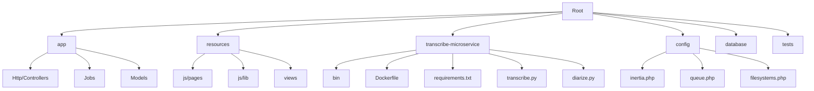
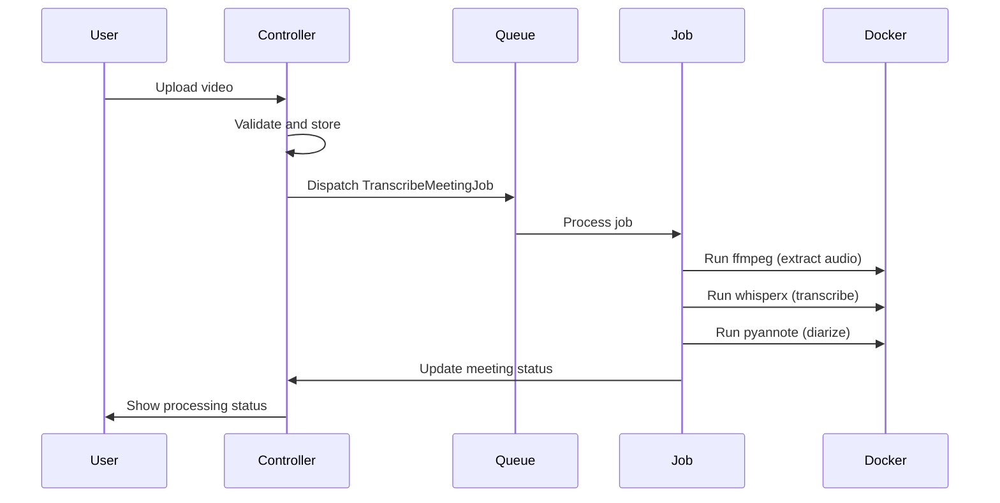
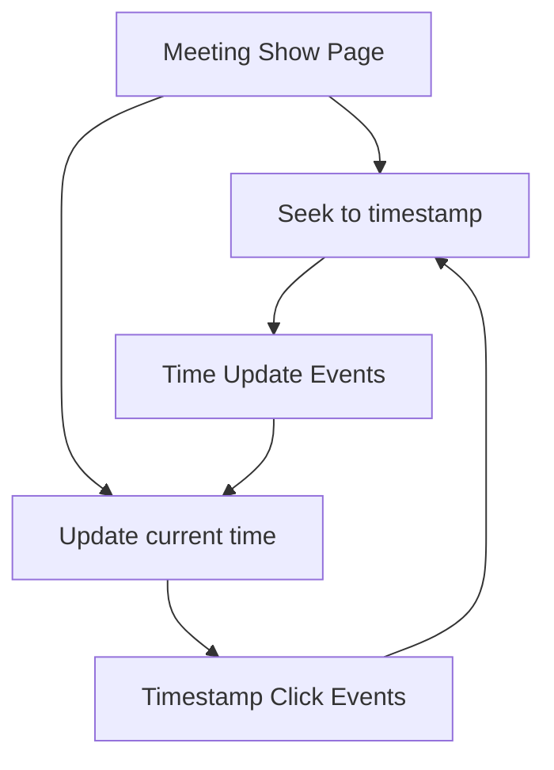
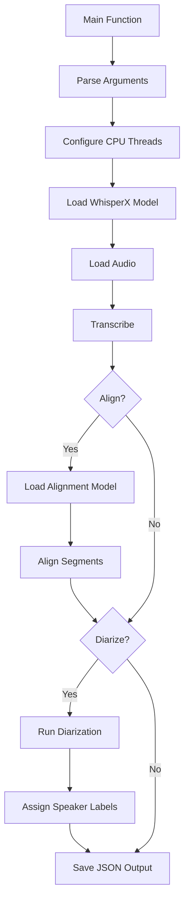
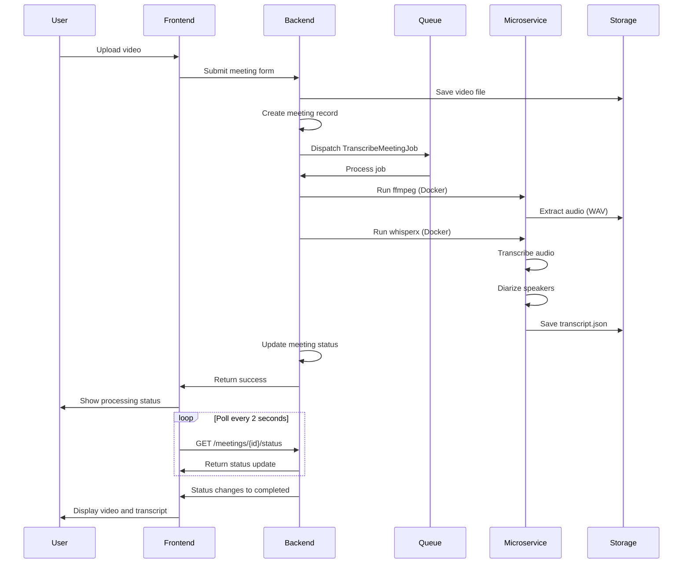
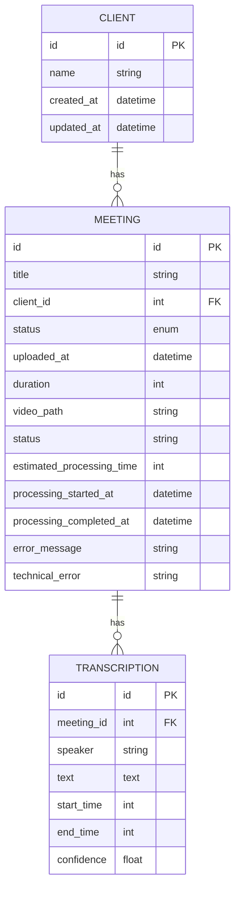

# Technology Stack


## Table of Contents
1. [Introduction](#introduction)
2. [Project Structure](#project-structure)
3. [Backend Technology Stack](#backend-technology-stack)
4. [Frontend Technology Stack](#frontend-technology-stack)
5. [Transcription Microservice](#transcription-microservice)
6. [Infrastructure and Deployment](#infrastructure-and-deployment)
7. [Integration Architecture](#integration-architecture)
8. [Performance and Error Handling](#performance-and-error-handling)
9. [Setup and Troubleshooting](#setup-and-troubleshooting)
10. [Conclusion](#conclusion)

## Introduction
The meetingai application is a comprehensive meeting transcription and analysis platform that combines modern web technologies with advanced audio processing capabilities. The system enables users to upload video meetings, automatically transcribe them with speaker diarization, and view synchronized transcripts alongside video playback. This document provides a detailed analysis of the technology stack, covering backend, frontend, microservices, infrastructure, and integration points to offer a complete understanding of the system architecture and implementation.

## Project Structure
The project follows a Laravel-based MVC structure with a Vue.js frontend integrated via Inertia.js. The repository is organized into standard Laravel directories with additional components for the transcription microservice.





**Diagram sources**
- [app/Http/Controllers/MeetingController.php](file://app/Http/Controllers/MeetingController.php)
- [resources/js/pages/Meetings/Show.vue](file://resources/js/pages/Meetings/Show.vue)
- [transcribe-microservice/transcribe.py](file://transcribe-microservice/transcribe.py)

**Section sources**
- [app/Http/Controllers/MeetingController.php](file://app/Http/Controllers/MeetingController.php)
- [resources/js/pages/Meetings/Show.vue](file://resources/js/pages/Meetings/Show.vue)
- [transcribe-microservice/transcribe.py](file://transcribe-microservice/transcribe.py)

## Backend Technology Stack

### Laravel 12 MVC Structure
The backend is built on Laravel 12, following the Model-View-Controller architectural pattern. The application uses Laravel's Eloquent ORM for database interactions and implements RESTful API endpoints through controller methods.

The MeetingController handles all meeting-related operations including listing, creating, updating, and deleting meetings. It integrates with Inertia.js to render Vue components while maintaining server-side state management.


```php
public function store(Request $request): RedirectResponse
{
    $validated = $request->validate([
        'title' => 'required|string|max:255',
        'client_id' => 'required|exists:clients,id',
        'video' => [
            'required',
            'file',
            File::types(['mp4', 'mov', 'avi', 'webm'])
                ->max(500 * 1024)
                ->min(1024)
        ]
    ]);
    
    // Create meeting record
    $meeting = Meeting::create([
        'title' => $validated['title'],
        'client_id' => $validated['client_id'],
        'status' => 'pending',
        'uploaded_at' => now(),
    ]);
    
    // Store video file
    $videoPath = $videoFile->storeAs($storagePath, $fileName, 'public');
    
    // Dispatch transcription job
    TranscribeMeetingJob::dispatch($meeting);
}
```


**Section sources**
- [app/Http/Controllers/MeetingController.php](file://app/Http/Controllers/MeetingController.php#L1-L305)

### Inertia.js Integration
Inertia.js provides seamless integration between Laravel and Vue.js, allowing server-side controllers to directly render Vue components without building a separate API.

The Inertia configuration enables server-side rendering (SSR) for improved performance and SEO:


```php
'ssr' => [
    'enabled' => true,
    'url' => 'http://127.0.0.1:13714',
],
```


The HandleInertiaRequests middleware automatically shares authentication and authorization data with the frontend.

**Section sources**
- [config/inertia.php](file://config/inertia.php#L1-L53)

### Queue System for Job Processing
The application uses Laravel's queue system to handle time-consuming transcription tasks asynchronously. The TranscribeMeetingJob processes video files through a multi-step workflow:





**Diagram sources**
- [app/Jobs/TranscribeMeetingJob.php](file://app/Jobs/TranscribeMeetingJob.php#L1-L400)
- [config/queue.php](file://config/queue.php#L1-L113)

The queue configuration supports multiple drivers with database as the default:


```php
'default' => env('QUEUE_CONNECTION', 'database'),

'connections' => [
    'database' => [
        'driver' => 'database',
        'connection' => env('DB_QUEUE_CONNECTION'),
        'table' => env('DB_QUEUE_TABLE', 'jobs'),
        'queue' => env('DB_QUEUE', 'default'),
        'retry_after' => (int) env('DB_QUEUE_RETRY_AFTER', 90),
    ],
],
```


**Section sources**
- [config/queue.php](file://config/queue.php#L1-L113)
- [app/Jobs/TranscribeMeetingJob.php](file://app/Jobs/TranscribeMeetingJob.php#L1-L400)

### File Storage Mechanisms
The application uses Laravel's filesystem abstraction to manage file storage with multiple disk configurations:


```php
'disks' => [
    'local' => [
        'driver' => 'local',
        'root' => storage_path('app/private'),
        'serve' => true,
    ],
    'public' => [
        'driver' => 'local',
        'root' => storage_path('app/public'),
        'url' => env('APP_URL').'/storage',
        'visibility' => 'public',
    ],
    's3' => [
        'driver' => 's3',
        'key' => env('AWS_ACCESS_KEY_ID'),
        'secret' => env('AWS_SECRET_ACCESS_KEY'),
        'region' => env('AWS_DEFAULT_REGION'),
        'bucket' => env('AWS_BUCKET'),
    ],
],
```


Videos are stored on the public disk for direct access, while temporary processing files use the local private disk.

**Section sources**
- [config/filesystems.php](file://config/filesystems.php#L1-L81)

## Frontend Technology Stack

### Vue.js 3 with TypeScript
The frontend is built with Vue.js 3 using the Composition API and TypeScript for type safety. Components are organized in a feature-based structure within the resources/js/pages directory.

The main application entry point initializes Inertia.js and configures global error handling:


```typescript
createInertiaApp({
    title: (title) => (title ? `${title} - ${appName}` : appName),
    resolve: (name) => resolvePageComponent(`./pages/${name}.vue`, import.meta.glob<DefineComponent>('./pages/**/*.vue')),
    setup({ el, App, props, plugin }) {
        const app = createApp({ render: () => h(App, props) })
            .use(plugin)
            .use(ZiggyVue);

        app.config.errorHandler = (error, instance, info) => {
            console.error('Vue error:', error, info);
            errorHandler.handleError(error, {
                component: instance?.$options.name || 'unknown',
                action: 'vue_error',
                data: { info }
            });
        };
    },
});
```


**Section sources**
- [resources/js/app.ts](file://resources/js/app.ts#L1-L44)

### Component Architecture
The frontend uses a component-based architecture with reusable UI elements in the lib directory:

- AppLayout.vue: Main application layout
- VideoPlayer.vue: Video playback component
- TranscriptionViewer.vue: Transcript display with time synchronization
- MeetingStatusBadge.vue: Visual status indicators
- FormField.vue: Form input components

The Meetings/Show.vue component demonstrates the integration between video playback and transcription:





**Diagram sources**
- [resources/js/pages/Meetings/Show.vue](file://resources/js/pages/Meetings/Show.vue#L1-L344)

**Section sources**
- [resources/js/pages/Meetings/Show.vue](file://resources/js/pages/Meetings/Show.vue#L1-L344)

### Real-time Updates
The frontend implements real-time status updates using polling to monitor transcription progress:


```typescript
export function useRealTimeUpdates<T extends BaseMeeting>(meetings: T[]) {
    const updatedMeetings = shallowRef<T[]>([...meetings]);
    let intervalId: number | null = null

    const updateMeetingStatuses = async () => {
        const activeMeetings = updatedMeetings.value.filter(
            (meeting) => meeting.status === 'pending' || meeting.status === 'processing'
        )

        if (activeMeetings.length === 0) {
            return
        }

        const updatePromises = activeMeetings.map(async (meeting) => {
            try {
                const response = await axios.get(`/meetings/${meeting.id}/status`)
                const updatedData = response.data as Partial<T>
                
                const index = updatedMeetings.value.findIndex((m) => m.id === meeting.id)
                if (index !== -1) {
                    updatedMeetings.value[index] = {
                        ...(updatedMeetings.value[index] as T),
                        ...(updatedData as T),
                    }
                }
            } catch (error) {
                console.error(`Failed to update status for meeting ${meeting.id}:`, error)
            }
        })

        await Promise.all(updatePromises)
    }

    const startUpdates = () => {
        updateMeetingStatuses()
        intervalId = window.setInterval(updateMeetingStatuses, 2000)
    }
}
```


**Section sources**
- [resources/js/lib/useRealTimeUpdates.ts](file://resources/js/lib/useRealTimeUpdates.ts#L1-L88)

### Build System with Vite
The frontend uses Vite as the build tool with Laravel-specific configuration:


```typescript
export default defineConfig({
    plugins: [
        laravel({
            input: ['resources/js/app.ts'],
            ssr: 'resources/js/ssr.ts',
            refresh: true,
        }),
        tailwindcss(),
        vue({
            template: {
                transformAssetUrls: {
                    base: null,
                    includeAbsolute: false,
                },
            },
        }),
    ],
});
```


Vite provides fast development server startup, hot module replacement, and optimized production builds.

**Section sources**
- [vite.config.ts](file://vite.config.ts#L1-L24)

### Styling with Tailwind CSS
The application uses Tailwind CSS for utility-first styling, enabling rapid UI development with consistent design patterns. The configuration is integrated through the @tailwindcss/vite plugin.


```json
"dependencies": {
    "tailwindcss": "^4.1.1",
    "prettier-plugin-tailwindcss": "^0.6.11",
    "tailwind-merge": "^3.2.0",
    "class-variance-authority": "^0.7.1",
    "clsx": "^2.1.1"
}
```


**Section sources**
- [package.json](file://package.json#L1-L48)
- [vite.config.ts](file://vite.config.ts#L1-L24)

## Transcription Microservice

### Python Stack with WhisperX
The transcribe-microservice implements transcription and diarization using Python with the WhisperX library for speech recognition and pyannote-audio for speaker diarization.


```txt
numpy==2.3.2
whisperx==3.4.2
faster-whisper==1.2.0
pyannote-audio==3.3.2
pyannote-core==5.0.0
pyannote-pipeline==3.0.1
pyannote-database==5.1.3
pyannote-metrics==3.2.1
```


The transcribe.py script handles the complete transcription workflow:





**Diagram sources**
- [transcribe-microservice/transcribe.py](file://transcribe-microservice/transcribe.py#L1-L201)

**Section sources**
- [transcribe-microservice/requirements.txt](file://transcribe-microservice/requirements.txt#L1-L9)
- [transcribe-microservice/transcribe.py](file://transcribe-microservice/transcribe.py#L1-L201)

### Diarization Implementation
The diarize.py module implements speaker diarization by combining WhisperX transcription with pyannote-audio speaker identification:


```python
def diarize_transcript(audio_file, transcript, device="cpu", model_name="pyannote/speaker-diarization-3.1"):
    # Load diarization model
    diarize_model = whisperx.diarize.DiarizationPipeline(
        model_name=model_name,
        device=device,
        use_auth_token=hf_token if hf_token else None
    )
    
    # Run diarization on audio
    diarize_segments = diarize_model(audio_file)
    
    # Assign speaker labels to transcript words
    diarized_result = whisperx.assign_word_speakers(diarize_segments, transcript)
    
    # Group words by consecutive speakers
    new_segments = []
    current_segment = None
    
    for word in all_words:
        speaker = word.get("speaker", "unknown")
        
        if current_segment is None:
            current_segment = {
                "start": word["start"],
                "end": word["end"],
                "text": word["word"],
                "speaker": speaker,
                "words": [word]
            }
        elif speaker == current_segment["speaker"]:
            current_segment["end"] = word["end"]
            current_segment["text"] += " " + word["word"]
            current_segment["words"].append(word)
        else:
            new_segments.append(current_segment)
            current_segment = {
                "start": word["start"],
                "end": word["end"],
                "text": word["word"],
                "speaker": speaker,
                "words": [word]
            }
    
    return {"segments": new_segments}
```


**Section sources**
- [transcribe-microservice/diarize.py](file://transcribe-microservice/diarize.py#L1-L131)

## Infrastructure and Deployment

### Docker Containerization
The transcription microservice is containerized using Docker for consistent deployment across environments:


```dockerfile
FROM python:3.11-slim AS base

RUN apt-get update -y && apt-get install -y --no-install-recommends \
      ffmpeg git ca-certificates curl tini \
    && rm -rf /var/lib/apt/lists/*

COPY requirements.txt /app/requirements.txt

RUN set -eux; \
    pip install --no-cache-dir "numpy<2.0"; \
    if [ "$WITH_CUDA" = "true" ]; then \
      pip install --no-cache-dir --extra-index-url https://download.pytorch.org/whl/cu118 torch torchvision torchaudio; \
    else \
      pip install --no-cache-dir --index-url https://download.pytorch.org/whl/cpu torch torchvision torchaudio; \
    fi

RUN pip install --no-cache-dir -r /app/requirements.txt

COPY transcribe.py /app/transcribe.py
COPY diarize.py /app/diarize.py

CMD ["transcribe.py", "--help"]
ENTRYPOINT ["/usr/bin/tini", "--"]
```


The Dockerfile includes optimizations for layer caching and supports both CPU and GPU execution through build arguments.

**Section sources**
- [transcribe-microservice/Dockerfile](file://transcribe-microservice/Dockerfile#L1-L54)

### Dependency Management

#### Backend Dependencies
The Laravel application uses Composer for PHP dependency management:


```json
"require": {
    "php": "^8.2",
    "inertiajs/inertia-laravel": "^2.0",
    "laravel/framework": "^12.0",
    "laravel/tinker": "^2.10.1",
    "prism-php/prism": "^0.83.2",
    "tightenco/ziggy": "^2.4"
},
"require-dev": {
    "fakerphp/faker": "^1.23",
    "laravel/pail": "^1.2.2",
    "laravel/pint": "^1.18",
    "laravel/sail": "^1.41",
    "mockery/mockery": "^1.6",
    "nunomaduro/collision": "^8.6",
    "pestphp/pest": "4.x-dev",
    "pestphp/pest-plugin-browser": "4.x-dev",
    "pestphp/pest-plugin-laravel": "4.x-dev"
}
```


**Section sources**
- [composer.json](file://composer.json#L1-L92)

#### Frontend Dependencies
The frontend uses npm for JavaScript/TypeScript dependency management:


```json
"dependencies": {
    "@inertiajs/vue3": "^2.0.0",
    "@tailwindcss/vite": "^4.1.11",
    "@vitejs/plugin-vue": "^6.0.0",
    "@vueuse/core": "^12.8.2",
    "class-variance-authority": "^0.7.1",
    "clsx": "^2.1.1",
    "concurrently": "^9.0.1",
    "laravel-vite-plugin": "^2.0.0",
    "playwright": "^1.54.2",
    "tailwind-merge": "^3.2.0",
    "tailwindcss": "^4.1.1",
    "typescript": "^5.2.2",
    "vite": "^7.0.4",
    "vue": "^3.5.13",
    "ziggy-js": "^2.4.2"
},
"devDependencies": {
    "@eslint/js": "^9.19.0",
    "@types/node": "^22.13.5",
    "@vue/eslint-config-typescript": "^14.3.0",
    "eslint": "^9.17.0",
    "eslint-config-prettier": "^10.0.1",
    "eslint-plugin-vue": "^9.32.0",
    "prettier": "^3.4.2",
    "prettier-plugin-organize-imports": "^4.1.0",
    "prettier-plugin-tailwindcss": "^0.6.11",
    "typescript-eslint": "^8.23.0",
    "vue-tsc": "^2.2.4"
}
```


**Section sources**
- [package.json](file://package.json#L1-L48)

## Integration Architecture

### End-to-End Workflow
The complete workflow from video upload to transcription display:





**Diagram sources**
- [app/Http/Controllers/MeetingController.php](file://app/Http/Controllers/MeetingController.php#L1-L305)
- [app/Jobs/TranscribeMeetingJob.php](file://app/Jobs/TranscribeMeetingJob.php#L1-L400)
- [resources/js/pages/Meetings/Show.vue](file://resources/js/pages/Meetings/Show.vue#L1-L344)

### Data Model
The core data model consists of meetings, clients, and transcriptions:





**Diagram sources**
- [app/Models/Client.php](file://app/Models/Client.php)
- [app/Models/Meeting.php](file://app/Models/Meeting.php)
- [app/Models/Transcription.php](file://app/Models/Transcription.php)

## Performance and Error Handling

### Performance Considerations
The system implements several performance optimizations:

1. **Server-side rendering** through Inertia.js for faster initial page loads
2. **Asynchronous processing** of transcription jobs to avoid blocking the main application
3. **Docker containerization** of the transcription service for resource isolation
4. **CPU thread optimization** in the transcription script to maximize processing efficiency
5. **Layered caching** in Docker builds to speed up deployment

The TranscribeMeetingJob configures CPU threading based on available cores:


```php
private function getCpuThreads(): int
{
    $env = getenv('NUMBER_OF_PROCESSORS');
    if ($env && is_numeric($env) && (int)$env > 0) {
        return (int) $env;
    }
    
    switch (PHP_OS_FAMILY) {
        case 'Windows':
            $commands = [
                'powershell -NoProfile -Command "(Get-CimInstance -ClassName Win32_ComputerSystem).NumberOfLogicalProcessors"',
            ];
            break;
        case 'Darwin':
            $commands = [
                'sysctl -n hw.logicalcpu',
            ];
            break;
        default:
            $commands = [
                'nproc',
                'getconf _NPROCESSORS_ONLN',
            ];
            break;
    }
    
    foreach ($commands as $cmd) {
        try {
            $p = Process::fromShellCommandline($cmd, base_path(), null, null, 5);
            $p->run();
            if (!$p->isSuccessful()) {
                continue;
            }
            $out = trim($p->getOutput() ?: $p->getErrorOutput());
            
            $val = (int) preg_replace('/[^0-9]/', '', $out);
            if ($val > 0) {
                return $val;
            }
        } catch (\Throwable $e) {
            // Ignore and try the next strategy
        }
    }
    
    return 2;
}
```


**Section sources**
- [app/Jobs/TranscribeMeetingJob.php](file://app/Jobs/TranscribeMeetingJob.php#L1-L400)

### Error Handling Strategies
The application implements comprehensive error handling at multiple levels:

**Backend Job Error Handling:**

```php
public function failed(\Throwable $exception): void
{
    Log::error("TranscribeMeetingJob failed for meeting {$this->meeting->id}", [
        'error' => $exception->getMessage(),
        'trace' => $exception->getTraceAsString(),
        'meeting_id' => $this->meeting->id,
        'video_path' => $this->meeting->video_path,
        'attempts' => $this->attempts()
    ]);

    $this->meeting->update([
        'status' => 'failed',
        'processing_completed_at' => now(),
        'error_message' => $this->getUserFriendlyErrorMessage($exception),
        'technical_error' => $exception->getMessage()
    ]);

    $this->cleanupTempFiles();
}
```


**Frontend Error Handling:**

```typescript
app.config.errorHandler = (error, instance, info) => {
    console.error('Vue error:', error, info);
    errorHandler.handleError(error, {
        component: instance?.$options.name || 'unknown',
        action: 'vue_error',
        data: { info }
    });
};
```


**User-Friendly Error Messages:**

```php
private function getUserFriendlyErrorMessage(\Throwable $exception): string
{
    $message = $exception->getMessage();

    if (str_contains($message, 'Video file not found')) {
        return 'The video file could not be found. It may have been moved or deleted.';
    }

    if (str_contains($message, 'WAV conversion')) {
        return 'Failed to process the video file. The file may be corrupted or in an unsupported format.';
    }

    if (str_contains($message, 'docker') || str_contains($message, 'Docker')) {
        return 'Transcription service is temporarily unavailable. Please try again later.';
    }

    if (str_contains($message, 'timeout') || str_contains($message, 'timed out')) {
        return 'Transcription took too long to complete. This may happen with very large files.';
    }

    if (str_contains($message, 'disk') || str_contains($message, 'space')) {
        return 'Insufficient storage space available for processing.';
    }

    return 'An unexpected error occurred during transcription. Please try uploading the file again.';
}
```


**Section sources**
- [app/Jobs/TranscribeMeetingJob.php](file://app/Jobs/TranscribeMeetingJob.php#L1-L400)
- [resources/js/app.ts](file://resources/js/app.ts#L1-L44)

## Setup and Troubleshooting

### Development Environment Setup
To set up the development environment:

1. Install PHP 8.2+, Node.js 18+, and Docker
2. Clone the repository and install dependencies:
   
```bash
   composer install
   npm install
   ```

3. Configure environment variables in .env file
4. Run migrations:
   
```bash
   php artisan migrate
   ```

5. Start development servers:
   
```bash
   npm run dev
   ```


The dev script starts multiple services concurrently:

```json
"dev": [
    "Composer\\Config::disableProcessTimeout",
    "npx concurrently -c \"#93c5fd,#c4b5fd,#fdba74\" \"php artisan serve\" \"php artisan queue:listen --tries=1 --timeout=3600 --memory=512\" \"npm run dev\" --names='server,queue,vite'"
]
```


### Common Issues and Solutions

**Docker Permission Issues:**
- Ensure Docker daemon is running
- Verify user has Docker group membership
- Check file permissions for mounted volumes

**Transcription Service Failures:**
- Verify ffmpeg is available in Docker container
- Check available disk space for temporary files
- Ensure proper CPU/GPU configuration in Docker run commands

**Queue Processing Problems:**
- Verify queue connection configuration in .env
- Check database connection for queue table
- Ensure queue worker is running

**Real-time Updates Not Working:**
- Verify CORS configuration allows requests
- Check network connectivity between frontend and backend
- Ensure polling interval is properly configured

**Section sources**
- [composer.json](file://composer.json#L1-L92)
- [package.json](file://package.json#L1-L48)
- [transcribe-microservice/Dockerfile](file://transcribe-microservice/Dockerfile#L1-L54)

## Conclusion
The meetingai application demonstrates a sophisticated integration of modern web technologies with advanced audio processing capabilities. The architecture effectively separates concerns between the Laravel/Vue.js frontend application and the Python-based transcription microservice, enabling scalable and maintainable development.

Key strengths of the technology stack include:
- **Seamless integration** between Laravel and Vue.js through Inertia.js
- **Robust job processing** with Laravel's queue system for handling long-running transcription tasks
- **Advanced audio processing** using state-of-the-art models like WhisperX and pyannote-audio
- **Containerized deployment** for consistent execution across environments
- **Comprehensive error handling** at both application and user levels

The system provides a solid foundation for meeting transcription and analysis, with opportunities for future enhancements such as real-time transcription, improved speaker identification, and enhanced analytics capabilities.

**Referenced Files in This Document**   
- [composer.json](file://composer.json)
- [package.json](file://package.json)
- [vite.config.ts](file://vite.config.ts)
- [config/inertia.php](file://config/inertia.php)
- [config/queue.php](file://config/queue.php)
- [config/filesystems.php](file://config/filesystems.php)
- [transcribe-microservice/Dockerfile](file://transcribe-microservice/Dockerfile)
- [transcribe-microservice/requirements.txt](file://transcribe-microservice/requirements.txt)
- [app/Http/Controllers/MeetingController.php](file://app/Http/Controllers/MeetingController.php)
- [app/Jobs/TranscribeMeetingJob.php](file://app/Jobs/TranscribeMeetingJob.php)
- [resources/js/app.ts](file://resources/js/app.ts)
- [resources/js/pages/Meetings/Show.vue](file://resources/js/pages/Meetings/Show.vue)
- [resources/js/lib/useRealTimeUpdates.ts](file://resources/js/lib/useRealTimeUpdates.ts)
- [transcribe-microservice/transcribe.py](file://transcribe-microservice/transcribe.py)
- [transcribe-microservice/diarize.py](file://transcribe-microservice/diarize.py)
- [app/Models/Meeting.php](file://app/Models/Meeting.php)