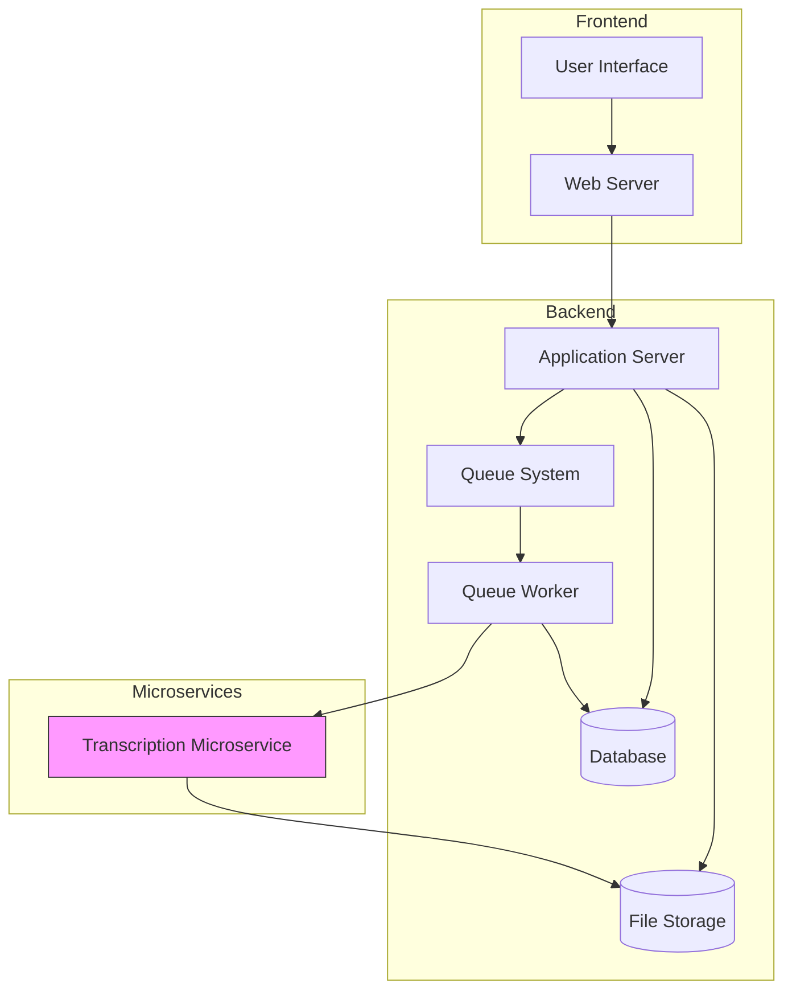
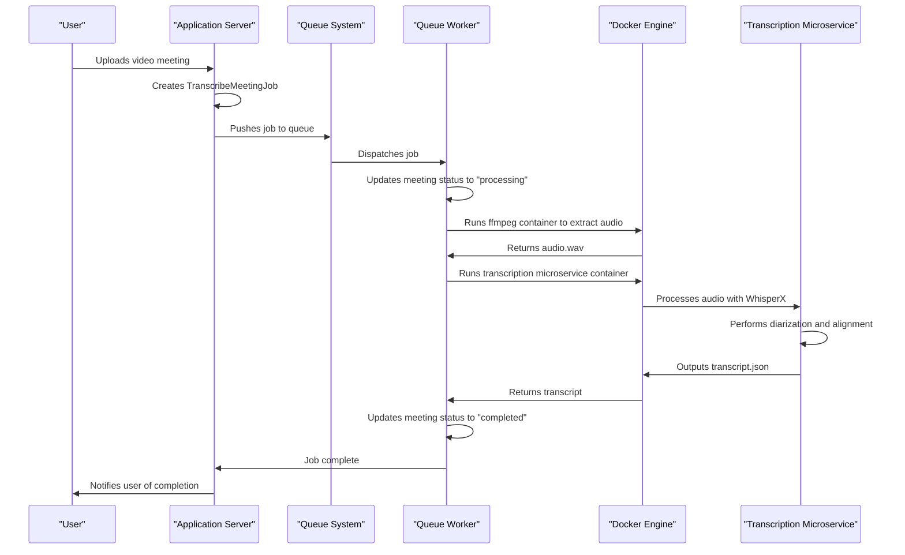
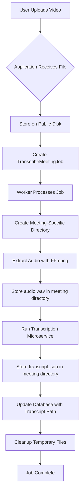
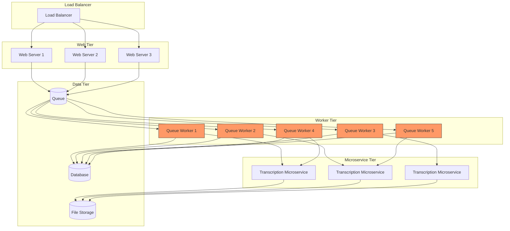
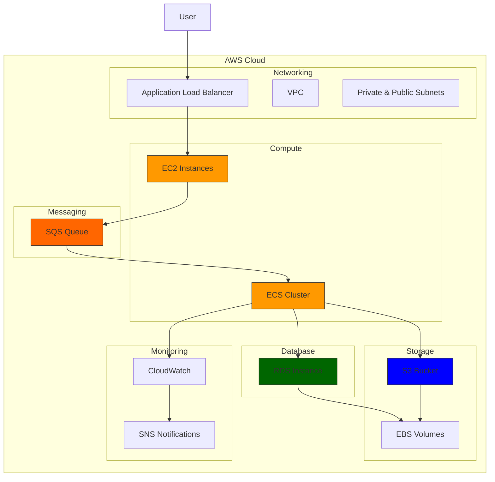
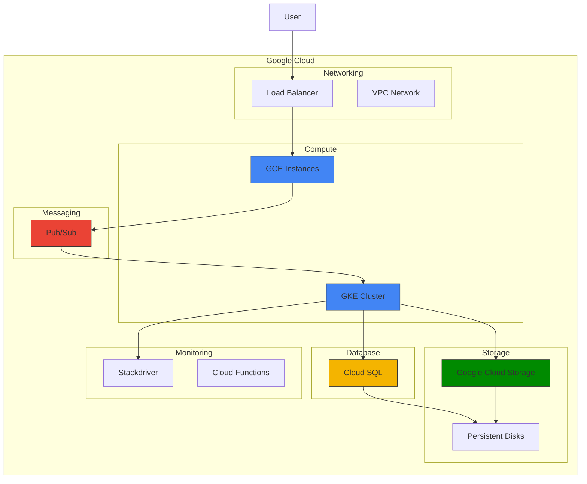
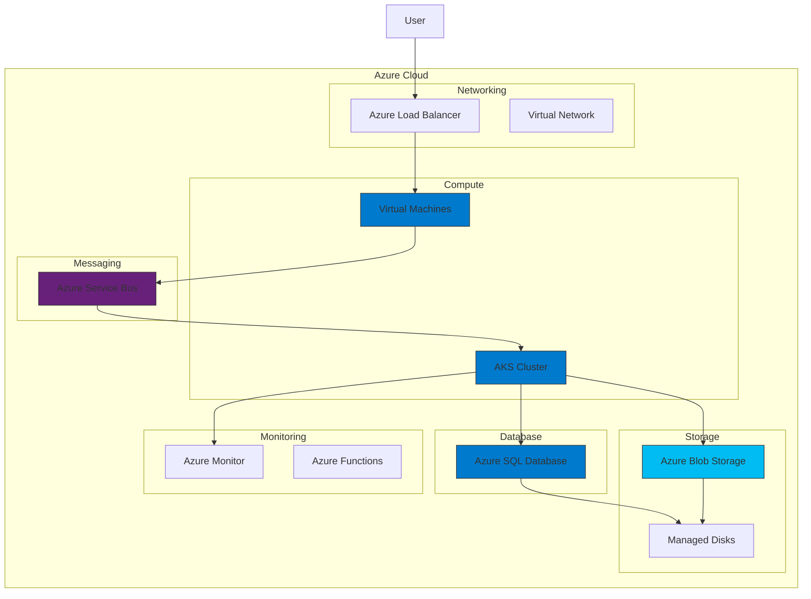

# Deployment Architecture


## Table of Contents
1. [Introduction](#introduction)
2. [Production Environment Topology](#production-environment-topology)
3. [Docker Configuration](#docker-configuration)
4. [Queue System Setup](#queue-system-setup)
5. [File Storage Configuration](#file-storage-configuration)
6. [Transcription Workflow](#transcription-workflow)
7. [Deployment Workflows and Scaling Strategies](#deployment-workflows-and-scaling-strategies)
8. [Monitoring and Logging Setup](#monitoring-and-logging-setup)
9. [High Availability and Disaster Recovery](#high-availability-and-disaster-recovery)
10. [Infrastructure-as-Code and Cloud Deployment Patterns](#infrastructure-as-code-and-cloud-deployment-patterns)

## Introduction
This document provides comprehensive architectural documentation for the deployment architecture of the meetingai application. The system is designed to process video meetings through transcription and speaker diarization using a microservice-based approach. The architecture leverages Docker containers, Laravel's queue system, and distributed processing to handle computationally intensive transcription tasks. This document details the production environment topology, Docker configuration, queue system setup, file storage mechanisms, deployment workflows, scaling strategies, monitoring setup, and high availability considerations.

## Production Environment Topology
The meetingai application follows a distributed microservices architecture with clear separation between the main Laravel application and the transcription processing microservice. The production environment consists of several key components:

- **Web Server**: Serves the Laravel application and handles user interactions
- **Application Server**: Runs the Laravel backend and processes HTTP requests
- **Queue Workers**: Process transcription jobs asynchronously using Laravel's queue system
- **Transcription Microservice**: Containerized Python service that performs audio transcription and speaker diarization
- **Database**: Stores meeting metadata, transcription results, and job status
- **Storage System**: Handles uploaded video files and generated transcripts

The architecture follows a producer-consumer pattern where the main application creates transcription jobs, which are then processed by dedicated workers that orchestrate the transcription microservice.





**Diagram sources**
- [TranscribeMeetingJob.php](file://app/Jobs/TranscribeMeetingJob.php)
- [filesystems.php](file://config/filesystems.php)

## Docker Configuration
The deployment architecture utilizes Docker containers for both the main application and the transcription microservice, ensuring consistent environments across development and production.

### Main Application Docker Configuration
While the main Laravel application's Docker configuration is not directly visible in the provided files, the system is designed to work with Laravel Sail, as evidenced by the presence of Sail runtime Dockerfiles in the vendor directory. The application is expected to use standard PHP-FPM and Nginx containers with appropriate volume mounts for code and storage.

### Transcription Microservice Docker Configuration
The transcription microservice has a dedicated Dockerfile that defines its container configuration:


```dockerfile
# syntax=docker/dockerfile:1.7
ARG PYTHON_VERSION=3.11
FROM python:${PYTHON_VERSION}-slim AS base

ENV DEBIAN_FRONTEND=noninteractive \
    PIP_NO_CACHE_DIR=1 \
    PYTHONDONTWRITEBYTECODE=1 \
    PYTHONUNBUFFERED=1 \
    HF_HUB_DISABLE_TELEMETRY=1 \
    TRUST_REMOTE_CODE=1 \
    PYTHONWARNINGS=ignore

# ffmpeg is required by whisper/whisperx
RUN apt-get update -y && apt-get install -y --no-install-recommends \
      ffmpeg git ca-certificates curl tini \
    && rm -rf /var/lib/apt/lists/*

WORKDIR /app

# Copy only what we need first to leverage Docker layer caching
COPY requirements.txt /app/requirements.txt

# Optional CUDA support toggle: default is CPU
ARG WITH_CUDA=false
# Ensure NumPy < 2.0 is installed before any dependency that might pull NumPy 2.x
# Then install torch according to the toggle for a more deterministic env
RUN set -eux; \
    pip install --no-cache-dir "numpy<2.0"; \
    if [ "$WITH_CUDA" = "true" ]; then \
      pip install --no-cache-dir --extra-index-url https://download.pytorch.org/whl/cu118 torch torchvision torchaudio; \
    else \
      pip install --no-cache-dir --index-url https://download.pytorch.org/whl/cpu torch torchvision torchaudio; \
    fi

# Then the rest of Python deps
RUN pip install --no-cache-dir -r /app/requirements.txt

# Models/cache directories (bind-mount friendly)
RUN mkdir -p /scriberr/models /scriberr/temp /scriberr/uploads \
 && chmod -R 755 /scriberr

# Copy application code
COPY transcribe.py /app/transcribe.py
COPY diarize.py /app/diarize.py

# CLI shim so `transcribe.py` is directly runnable as in the requested UX
COPY bin/transcribe.py /usr/local/bin/transcribe.py

# Default command prints help. Users override with their own args or call `transcribe.py ...`
CMD ["transcribe.py", "--help"]

# Use tini as a minimal init to handle signals properly
ENTRYPOINT ["/usr/bin/tini", "--"]
```


Key aspects of the Docker configuration:
- Based on Python 3.11 slim image for minimal footprint
- Includes ffmpeg for audio processing
- Uses tini as a minimal init system to handle signals properly
- Supports optional CUDA acceleration through build argument
- Pre-installs PyTorch with CPU or CUDA support based on configuration
- Creates dedicated directories for models, temporary files, and uploads
- Exposes the transcribe.py script as a command-line interface

**Section sources**
- [Dockerfile](file://transcribe-microservice/Dockerfile)

## Queue System Setup
The queue system is configured through Laravel's queue.php configuration file and is central to the application's asynchronous processing capabilities.

### Queue Configuration
The application supports multiple queue drivers with database as the default:


```php
'default' => env('QUEUE_CONNECTION', 'database'),

'connections' => [
    'sync' => [
        'driver' => 'sync',
    ],
    'database' => [
        'driver' => 'database',
        'connection' => env('DB_QUEUE_CONNECTION'),
        'table' => env('DB_QUEUE_TABLE', 'jobs'),
        'queue' => env('DB_QUEUE', 'default'),
        'retry_after' => (int) env('DB_QUEUE_RETRY_AFTER', 90),
        'after_commit' => false,
    ],
    'beanstalkd' => [
        'driver' => 'beanstalkd',
        'host' => env('BEANSTALKD_QUEUE_HOST', 'localhost'),
        'queue' => env('BEANSTALKD_QUEUE', 'default'),
        'retry_after' => (int) env('BEANSTALKD_QUEUE_RETRY_AFTER', 90),
        'block_for' => 0,
        'after_commit' => false,
    ],
    'sqs' => [
        'driver' => 'sqs',
        'key' => env('AWS_ACCESS_KEY_ID'),
        'secret' => env('AWS_SECRET_ACCESS_KEY'),
        'prefix' => env('SQS_PREFIX', 'https://sqs.us-east-1.amazonaws.com/your-account-id'),
        'queue' => env('SQS_QUEUE', 'default'),
        'suffix' => env('SQS_SUFFIX'),
        'region' => env('AWS_DEFAULT_REGION', 'us-east-1'),
        'after_commit' => false,
    ],
    'redis' => [
        'driver' => 'redis',
        'connection' => env('REDIS_QUEUE_CONNECTION', 'default'),
        'queue' => env('REDIS_QUEUE', 'default'),
        'retry_after' => (int) env('REDIS_QUEUE_RETRY_AFTER', 90),
        'block_for' => null,
        'after_commit' => false,
    ],
],
```


### Job Processing
The TranscribeMeetingJob class implements the queue processing logic:





**Diagram sources**
- [queue.php](file://config/queue.php)
- [TranscribeMeetingJob.php](file://app/Jobs/TranscribeMeetingJob.php)

**Section sources**
- [queue.php](file://config/queue.php)
- [TranscribeMeetingJob.php](file://app/Jobs/TranscribeMeetingJob.php)

## File Storage Configuration
The file storage system is configured through the filesystems.php configuration file and handles both uploaded videos and generated transcripts.

### Filesystem Configuration

```php
'default' => env('FILESYSTEM_DISK', 'local'),

'disks' => [
    'local' => [
        'driver' => 'local',
        'root' => storage_path('app/private'),
        'serve' => true,
        'throw' => false,
        'report' => false,
    ],
    'public' => [
        'driver' => 'local',
        'root' => storage_path('app/public'),
        'url' => env('APP_URL').'/storage',
        'visibility' => 'public',
        'throw' => false,
        'report' => false,
    ],
    's3' => [
        'driver' => 's3',
        'key' => env('AWS_ACCESS_KEY_ID'),
        'secret' => env('AWS_SECRET_ACCESS_KEY'),
        'region' => env('AWS_DEFAULT_REGION'),
        'bucket' => env('AWS_BUCKET'),
        'url' => env('AWS_URL'),
        'endpoint' => env('AWS_ENDPOINT'),
        'use_path_style_endpoint' => env('AWS_USE_PATH_STYLE_ENDPOINT', false),
        'throw' => false,
        'report' => false,
    ],
],
```


### Storage Workflow
The system uses two primary storage locations:
1. **Public disk**: Stores uploaded video files with public visibility
2. **Local disk**: Stores private application data and temporary files

When a meeting is uploaded, the video file is stored on the public disk. During transcription processing, a dedicated directory is created under storage/{meeting_id} to store the extracted audio (audio.wav) and the generated transcript (transcript.json).





**Diagram sources**
- [filesystems.php](file://config/filesystems.php)
- [TranscribeMeetingJob.php](file://app/Jobs/TranscribeMeetingJob.php)

**Section sources**
- [filesystems.php](file://config/filesystems.php)
- [TranscribeMeetingJob.php](file://app/Jobs/TranscribeMeetingJob.php)

## Transcription Workflow
The transcription workflow is implemented in the TranscribeMeetingJob class and follows a multi-step process to convert video meetings into structured transcripts with speaker diarization.

### Workflow Steps
1. **Job Initialization**: The job is created with a Meeting model instance
2. **Status Update**: Meeting status is updated to "processing"
3. **Path Resolution**: Determines storage paths for input and output files
4. **Audio Extraction**: Uses FFmpeg to extract audio from the video file
5. **Transcription**: Runs the transcription microservice to convert audio to text
6. **Diarization**: Identifies and labels different speakers in the conversation
7. **Alignment**: Synchronizes transcript text with precise timestamps
8. **Result Storage**: Saves the transcript to JSON file and updates database
9. **Status Update**: Meeting status is updated to "completed" or "failed"

### Error Handling
The workflow includes comprehensive error handling with user-friendly error messages:


```php
private function getUserFriendlyErrorMessage(\Throwable $exception): string
{
    $message = $exception->getMessage();

    if (str_contains($message, 'Video file not found')) {
        return 'The video file could not be found. It may have been moved or deleted.';
    }

    if (str_contains($message, 'WAV conversion')) {
        return 'Failed to process the video file. The file may be corrupted or in an unsupported format.';
    }

    if (str_contains($message, 'docker') || str_contains($message, 'Docker')) {
        return 'Transcription service is temporarily unavailable. Please try again later.';
    }

    if (str_contains($message, 'timeout') || str_contains($message, 'timed out')) {
        return 'Transcription took too long to complete. This may happen with very large files.';
    }

    if (str_contains($message, 'disk') || str_contains($message, 'space')) {
        return 'Insufficient storage space available for processing.';
    }

    return 'An unexpected error occurred during transcription. Please try uploading the file again.';
}
```


### Resource Management
The system dynamically determines CPU thread allocation based on the host system:


```php
private function getCpuThreads(): int
{
    // Windows often exposes NUMBER_OF_PROCESSORS
    $env = getenv('NUMBER_OF_PROCESSORS');
    if ($env && is_numeric($env) && (int)$env > 0) {
        return (int) $env;
    }

    $commands = [];
    switch (PHP_OS_FAMILY) {
        case 'Windows':
            $commands = [
                'powershell -NoProfile -Command "(Get-CimInstance -ClassName Win32_ComputerSystem).NumberOfLogicalProcessors"',
                'powershell -NoProfile -Command "(Get-WmiObject -Class Win32_ComputerSystem).NumberOfLogicalProcessors"',
                'wmic cpu get NumberOfLogicalProcessors /value',
            ];
            break;
        case 'Darwin':
            $commands = [
                'sysctl -n hw.logicalcpu',
                'getconf _NPROCESSORS_ONLN',
            ];
            break;
        default: // Linux/Unix
            $commands = [
                'nproc',
                'getconf _NPROCESSORS_ONLN',
                'grep -c ^processor /proc/cpuinfo',
            ];
            break;
    }
    // ... execution logic
}
```


**Section sources**
- [TranscribeMeetingJob.php](file://app/Jobs/TranscribeMeetingJob.php)

## Deployment Workflows and Scaling Strategies
The deployment architecture supports various workflows and scaling strategies to handle multiple concurrent transcriptions efficiently.

### Horizontal Scaling
The system can be scaled horizontally by adding more queue workers to process transcription jobs in parallel. Each worker operates independently and can be deployed on separate machines or containers.

### Resource Allocation
The transcription microservice is configured to utilize available CPU resources efficiently:
- Automatically detects the number of CPU cores on the host system
- Configures PyTorch threading based on available cores
- Uses int8 compute type to reduce memory footprint
- Implements memory management for CUDA operations

### Concurrency Control
The system handles multiple concurrent transcriptions through:
- Database-backed queue system that supports multiple workers
- Isolated processing directories for each meeting (storage/{meeting_id})
- Docker containers that provide process isolation
- Job retry mechanism with exponential backoff





**Diagram sources**
- [TranscribeMeetingJob.php](file://app/Jobs/TranscribeMeetingJob.php)
- [queue.php](file://config/queue.php)

## Monitoring and Logging Setup
The system includes comprehensive monitoring and logging capabilities through Laravel's logging configuration.

### Logging Configuration
The logging system is configured in logging.php to support multiple channels:


```php
'default' => env('LOG_CHANNEL', 'stack'),

'channels' => [
    'stack' => [
        'driver' => 'stack',
        'channels' => explode(',', env('LOG_STACK', 'single')),
        'ignore_exceptions' => false,
    ],
    'single' => [
        'driver' => 'single',
        'path' => storage_path('logs/laravel.log'),
        'level' => env('LOG_LEVEL', 'debug'),
        'replace_placeholders' => true,
    ],
    'daily' => [
        'driver' => 'daily',
        'path' => storage_path('logs/laravel.log'),
        'level' => env('LOG_LEVEL', 'debug'),
        'days' => env('LOG_DAILY_DAYS', 14),
        'replace_placeholders' => true,
    ],
    'slack' => [
        'driver' => 'slack',
        'url' => env('LOG_SLACK_WEBHOOK_URL'),
        'username' => env('LOG_SLACK_USERNAME', 'Laravel Log'),
        'emoji' => env('LOG_SLACK_EMOJI', ':boom:'),
        'level' => env('LOG_LEVEL', 'critical'),
        'replace_placeholders' => true,
    ],
    'papertrail' => [
        'driver' => 'monolog',
        'level' => env('LOG_LEVEL', 'debug'),
        'handler' => env('LOG_PAPERTRAIL_HANDLER', SyslogUdpHandler::class),
        'handler_with' => [
            'host' => env('PAPERTRAIL_URL'),
            'port' => env('PAPERTRAIL_PORT'),
            'connectionString' => 'tls://'.env('PAPERTRAIL_URL').':'.env('PAPERTRAIL_PORT'),
        ],
        'processors' => [PsrLogMessageProcessor::class],
    ],
    'stderr' => [
        'driver' => 'monolog',
        'level' => env('LOG_LEVEL', 'debug'),
        'handler' => StreamHandler::class,
        'handler_with' => [
            'stream' => 'php://stderr',
        ],
        'formatter' => env('LOG_STDERR_FORMATTER'),
        'processors' => [PsrLogMessageProcessor::class],
    ],
    'syslog' => [
        'driver' => 'syslog',
        'level' => env('LOG_LEVEL', 'debug'),
        'facility' => env('LOG_SYSLOG_FACILITY', LOG_USER),
        'replace_placeholders' => true,
    ],
    'errorlog' => [
        'driver' => 'errorlog',
        'level' => env('LOG_LEVEL', 'debug'),
        'replace_placeholders' => true,
    ],
    'null' => [
        'driver' => 'monolog',
        'handler' => NullHandler::class,
    ],
    'emergency' => [
        'path' => storage_path('logs/laravel.log'),
    ],
],
```


### Monitoring Features
The system includes several monitoring features:
- Detailed logging of job execution with timestamps
- Error logging with stack traces and context
- Slack notifications for critical errors
- Papertrail integration for centralized log management
- Standardized error messages for user communication

**Section sources**
- [logging.php](file://config/logging.php)
- [TranscribeMeetingJob.php](file://app/Jobs/TranscribeMeetingJob.php)

## High Availability and Disaster Recovery
The deployment architecture includes several features to ensure high availability and support disaster recovery.

### High Availability Considerations
- **Queue Persistence**: Jobs are stored in the database, ensuring they survive application restarts
- **Job Retries**: Failed jobs are automatically retried with exponential backoff (1 minute, 5 minutes, 15 minutes)
- **Worker Isolation**: Multiple queue workers can run simultaneously without interfering with each other
- **Container Isolation**: Each transcription process runs in its own Docker container

### Backup Strategies
The system should implement the following backup strategies:
- **Database Backups**: Regular backups of the database containing meeting metadata and transcription results
- **File Storage Backups**: Regular backups of the storage directory containing video files and transcripts
- **Configuration Backups**: Version control of configuration files and environment variables

### Disaster Recovery Procedures
In the event of a system failure, the following recovery procedures should be followed:
1. Restore database from latest backup
2. Restore file storage from latest backup
3. Restart queue workers to process pending jobs
4. Verify system functionality with test jobs

The system's design supports disaster recovery because:
- Jobs in the queue will be reprocessed after recovery
- The idempotent nature of transcription jobs allows safe reprocessing
- Meeting status tracking prevents duplicate processing

**Section sources**
- [TranscribeMeetingJob.php](file://app/Jobs/TranscribeMeetingJob.php)
- [queue.php](file://config/queue.php)

## Infrastructure-as-Code and Cloud Deployment Patterns
The deployment architecture can be implemented using infrastructure-as-code patterns for various cloud platforms.

### AWS Deployment Pattern




### GCP Deployment Pattern




### Azure Deployment Pattern




### Infrastructure-as-Code Example (Terraform)

```hcl
# AWS infrastructure as code example
provider "aws" {
  region = "us-east-1"
}

# VPC Configuration
resource "aws_vpc" "main" {
  cidr_block = "10.0.0.0/16"
  
  tags = {
    Name = "meetingai-vpc"
  }
}

# Database Configuration
resource "aws_db_instance" "meetingai" {
  allocated_storage    = 100
  engine               = "mysql"
  engine_version       = "8.0"
  instance_class       = "db.t3.medium"
  name                 = "meetingai"
  username             = var.db_username
  password             = var.db_password
  parameter_group_name = "default.mysql8.0"
  
  storage_encrypted = true
  backup_retention_period = 7
}

# S3 Bucket for file storage
resource "aws_s3_bucket" "meetingai_storage" {
  bucket = "meetingai-storage-${random_id.suffix.hex}"
  
  versioning {
    enabled = true
  }
  
  server_side_encryption_configuration {
    rule {
      apply_server_side_encryption_by_default {
        sse_algorithm = "AES256"
      }
    }
  }
}

# ECS Cluster for transcription workers
resource "aws_ecs_cluster" "meetingai_workers" {
  name = "meetingai-workers"
}

# SQS Queue for job processing
resource "aws_sqs_queue" "transcription_jobs" {
  name = "transcription-jobs"
  
  visibility_timeout_seconds = 180
  message_retention_seconds = 1209600
}

# Auto Scaling Group for web servers
resource "aws_autoscaling_group" "web_servers" {
  name = "web-servers"
  min_size = 2
  max_size = 10
  desired_capacity = 2
  
  vpc_zone_identifier = [aws_subnet.public.id]
  
  launch_template {
    id = aws_launch_template.web.id
  }
  
  tag {
    key = "Name"
    value = "web-server"
    propagate_at_launch = true
  }
}
```


**Section sources**
- [TranscribeMeetingJob.php](file://app/Jobs/TranscribeMeetingJob.php)
- [queue.php](file://config/queue.php)
- [filesystems.php](file://config/filesystems.php)

**Referenced Files in This Document**   
- [TranscribeMeetingJob.php](file://app/Jobs/TranscribeMeetingJob.php)
- [filesystems.php](file://config/filesystems.php)
- [queue.php](file://config/queue.php)
- [services.php](file://config/services.php)
- [Dockerfile](file://transcribe-microservice/Dockerfile)
- [transcribe.py](file://transcribe-microservice/transcribe.py)
- [diarize.py](file://transcribe-microservice/diarize.py)
- [requirements.txt](file://transcribe-microservice/requirements.txt)
- [logging.php](file://config/logging.php)