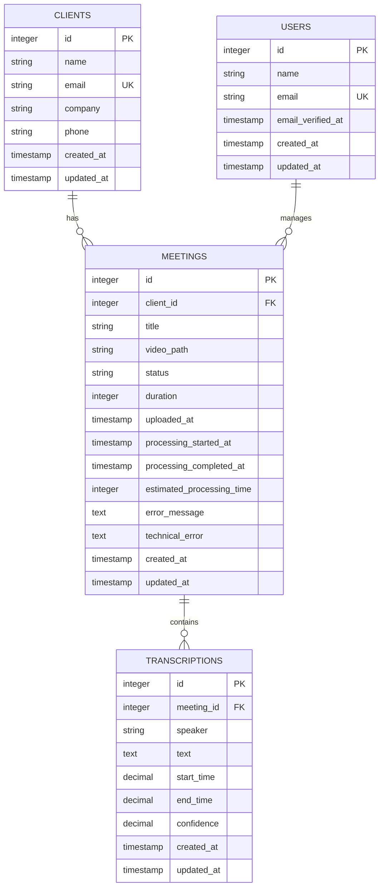

# Data Model


## Table of Contents
1. [Data Model Overview](#data-model-overview)
2. [Entity Definitions](#entity-definitions)
   - [Clients](#clients)
   - [Meetings](#meetings)
   - [Transcriptions](#transcriptions)
   - [Users](#users)
3. [Relationships and Constraints](#relationships-and-constraints)
4. [Business Rules and Calculated Fields](#business-rules-and-calculated-fields)
5. [Data Lifecycle](#data-lifecycle)
6. [Data Validation](#data-validation)
7. [Privacy and Access Control](#privacy-and-access-control)
8. [Sample Data](#sample-data)
9. [Schema Diagram](#schema-diagram)

## Data Model Overview
The meetingai application manages audio/video meeting recordings and their transcriptions through a relational database model. The core entities are **clients**, **meetings**, and **transcriptions**, with **users** managing the system. The data model supports the complete lifecycle from meeting upload through processing to archival, with robust error handling and real-time status tracking.

**Section sources**
- [2025_08_10_135157_create_clients_table.php](file://database/migrations/2025_08_10_135157_create_clients_table.php#L1-L31)
- [2025_08_10_135205_create_meetings_table.php](file://database/migrations/2025_08_10_135205_create_meetings_table.php#L1-L40)
- [2025_08_10_135210_create_transcriptions_table.php](file://database/migrations/2025_08_10_135210_create_transcriptions_table.php#L1-L38)

## Entity Definitions

### Clients
The **clients** table stores organizational or individual client information associated with meetings.

**Field Definitions:**
- `id`: Primary key (auto-incrementing integer)
- `name`: Client name (string, required)
- `email`: Client email address (string, unique, nullable)
- `company`: Company name (string, nullable)
- `phone`: Phone number (string, nullable)
- `created_at`: Record creation timestamp
- `updated_at`: Record update timestamp

**Constraints:**
- `name` field is required
- `email` must be unique when provided
- Soft delete not implemented

**Indexes:**
- Primary key on `id`
- Unique index on `email`

**Section sources**
- [2025_08_10_135157_create_clients_table.php](file://database/migrations/2025_08_10_135157_create_clients_table.php#L1-L31)
- [Client.php](file://app/Models/Client.php#L1-L27)

### Meetings
The **meetings** table stores metadata about uploaded meeting recordings and their processing status.

**Field Definitions:**
- `id`: Primary key (auto-incrementing integer)
- `client_id`: Foreign key to clients table (integer, required)
- `title`: Meeting title (string, required)
- `video_path`: File system path to video/audio file (string, 500 characters, required)
- `status`: Processing status (string, 50 characters, default: 'pending')
- `duration`: Meeting duration in seconds (integer, nullable)
- `uploaded_at`: Timestamp when meeting was uploaded (timestamp, nullable)
- `processing_started_at`: Timestamp when processing began (timestamp, nullable)
- `processing_completed_at`: Timestamp when processing completed (timestamp, nullable)
- `estimated_processing_time`: Estimated processing duration in seconds (integer, nullable)
- `error_message`: User-friendly error message (text, nullable)
- `technical_error`: Detailed technical error information (text, nullable)
- `created_at`: Record creation timestamp
- `updated_at`: Record update timestamp

**Status Values:**
- `pending`: Meeting is queued for processing
- `processing`: Transcription is currently being generated
- `completed`: Transcription successfully completed
- `failed`: Processing encountered an error

**Constraints:**
- `client_id` references `clients.id` with cascade delete
- `status` defaults to 'pending'
- Foreign key constraint ensures referential integrity

**Indexes:**
- Primary key on `id`
- Index on `client_id` for relationship queries
- Index on `status` for status-based filtering
- Index on `uploaded_at` for chronological queries

**Section sources**
- [2025_08_10_135205_create_meetings_table.php](file://database/migrations/2025_08_10_135205_create_meetings_table.php#L1-L40)
- [2025_08_10_145951_add_estimated_processing_time_to_meetings_table.php](file://database/migrations/2025_08_10_145951_add_estimated_processing_time_to_meetings_table.php#L1-L28)
- [2025_08_10_160251_add_error_fields_to_meetings_table.php](file://database/migrations/2025_08_10_160251_add_error_fields_to_meetings_table.php#L1-L28)
- [Meeting.php](file://app/Models/Meeting.php#L1-L178)

### Transcriptions
The **transcriptions** table stores the detailed transcription output for each meeting, including speaker identification and timing.

**Field Definitions:**
- `id`: Primary key (auto-incrementing integer)
- `meeting_id`: Foreign key to meetings table (integer, required)
- `speaker`: Identified speaker name (string, nullable)
- `text`: Transcribed text content (text, required)
- `start_time`: Start time in seconds (decimal, 10,3 precision)
- `end_time`: End time in seconds (decimal, 10,3 precision)
- `confidence`: Speech recognition confidence score (decimal, 3,2 precision, default: 1.00)
- `created_at`: Record creation timestamp
- `updated_at`: Record update timestamp

**Constraints:**
- `meeting_id` references `meetings.id` with cascade delete
- `text` field is required
- `confidence` ranges from 0.00 to 1.00
- `start_time` and `end_time` have millisecond precision

**Indexes:**
- Primary key on `id`
- Index on `meeting_id` for relationship queries
- Index on `start_time` for chronological ordering within meetings

**Section sources**
- [2025_08_10_135210_create_transcriptions_table.php](file://database/migrations/2025_08_10_135210_create_transcriptions_table.php#L1-L38)
- [Transcription.php](file://app/Models/Transcription.php#L1-L50)

### Users
The **users** table stores application user accounts for system authentication and authorization.

**Field Definitions:**
- `id`: Primary key (auto-incrementing integer)
- `name`: User's full name (string, required)
- `email`: User's email address (string, unique, required)
- `email_verified_at`: Timestamp when email was verified (timestamp, nullable)
- `password`: Hashed password (string, required)
- `remember_token`: Token for "remember me" functionality (string, nullable)
- `created_at`: Record creation timestamp
- `updated_at`: Record update timestamp

**Additional Tables:**
- `password_reset_tokens`: Stores password reset tokens with email as primary key
- `sessions`: Stores session data with id as primary key and user_id as foreign key

**Constraints:**
- `email` must be unique
- `password` is stored in hashed format
- Email verification is supported but not required

**Section sources**
- [0001_01_01_000000_create_users_table.php](file://database/migrations/0001_01_01_000000_create_users_table.php#L1-L49)
- [User.php](file://app/Models/User.php#L1-L48)

## Relationships and Constraints
The data model implements a hierarchical relationship structure where clients own meetings, and meetings contain transcriptions.

**Foreign Key Relationships:**
- `meetings.client_id` → `clients.id` (One-to-Many)
  - A client can have multiple meetings
  - When a client is deleted, all associated meetings are cascade deleted
  - Index on `client_id` ensures efficient querying

- `transcriptions.meeting_id` → `meetings.id` (One-to-Many)
  - A meeting can have multiple transcription segments
  - When a meeting is deleted, all associated transcriptions are cascade deleted
  - Index on `meeting_id` ensures efficient retrieval of transcription data

**Referential Integrity:**
All foreign key relationships enforce referential integrity at the database level. The cascade delete behavior ensures data consistency when parent records are removed.

**Section sources**
- [2025_08_10_135205_create_meetings_table.php](file://database/migrations/2025_08_10_135205_create_meetings_table.php#L12-L13)
- [2025_08_10_135210_create_transcriptions_table.php](file://database/migrations/2025_08_10_135210_create_transcriptions_table.php#L12-L13)
- [Meeting.php](file://app/Models/Meeting.php#L35-L40)
- [Transcription.php](file://app/Models/Transcription.php#L28-L33)

## Business Rules and Calculated Fields
The data model enforces several business rules through Eloquent model attributes and application logic.

**Meeting Status Transitions:**
- Initial status is 'pending' when a meeting is created
- Status changes to 'processing' when transcription job begins
- Status changes to 'completed' when transcription finishes successfully
- Status changes to 'failed' when processing encounters an error
- Status transitions are immutable (cannot revert to previous states)

**Processing Time Calculations:**
The Meeting model provides several calculated attributes for real-time status tracking:

- `elapsed_time`: Seconds since processing started (or total processing time if completed)
- `estimated_remaining_time`: Projected seconds remaining based on video duration
- `processing_progress`: Percentage completion (0-100) of processing
- `queue_progress`: Percentage progress (0-100) for pending meetings in queue
- `formatted_elapsed_time`: Human-readable elapsed time (MM:SS)
- `formatted_estimated_remaining_time`: Human-readable remaining time (MM:SS)
- `formatted_estimated_processing_time`: Human-readable estimated duration (MM:SS)

**Business Logic:**
- Estimated processing time is calculated as 1 second per minute of video (minimum 10 seconds)
- Queue progress simulates wait time with a 30-second estimated wait before processing begins
- Clients cannot be deleted if they have existing meetings (enforced at application level)

**Section sources**
- [Meeting.php](file://app/Models/Meeting.php#L42-L178)
- [Client.php](file://app/Models/Client.php#L25-L27)
- [tests/Feature/RealTimeStatusTest.php](file://tests/Feature/RealTimeStatusTest.php#L1-L74)

## Data Lifecycle
The data lifecycle spans from meeting upload through processing to archival.

**Upload Phase:**
1. User uploads meeting file through UI
2. System creates meeting record with status 'pending'
3. File is stored on disk, path recorded in `video_path`
4. `uploaded_at` timestamp is set
5. `estimated_processing_time` is calculated based on video duration

**Processing Phase:**
1. Background job (TranscribeMeetingJob) picks up pending meeting
2. Meeting status changes to 'processing'
3. `processing_started_at` timestamp is set
4. Transcription microservice processes audio/video
5. System updates real-time status via calculated fields

**Completion Phase:**
1. Transcription completes successfully
2. Meeting status changes to 'completed'
3. `processing_completed_at` timestamp is set
4. Transcription records are created for each segment
5. User is notified of completion

**Error Phase:**
1. Processing encounters an error
2. Meeting status changes to 'failed'
3. `error_message` stores user-friendly explanation
4. `technical_error` stores detailed error information
5. System logs error for debugging

**Archival:**
- Completed meetings and transcriptions are retained indefinitely
- Failed meetings are retained for troubleshooting
- No automatic archival or deletion policy implemented

**Section sources**
- [Meeting.php](file://app/Models/Meeting.php#L42-L178)
- [Transcription.php](file://app/Models/Transcription.php#L1-L50)
- [tests/Feature/TranscribeMeetingJobTest.php](file://tests/Feature/TranscribeMeetingJobTest.php#L1-L102)

## Data Validation
Data validation is enforced at both the database and application levels.

**Database Constraints:**
- `clients.email` has unique constraint
- `meetings.status` has default value 'pending'
- Foreign key constraints ensure referential integrity
- `transcriptions.confidence` has check constraint (0.00-1.00)

**Eloquent Model Validation:**
- `Client` model: `name` is required, `email` is unique
- `Meeting` model: `client_id`, `title`, `video_path` are required
- `Transcription` model: `meeting_id`, `text`, `start_time`, `end_time` are required

**Application-Level Validation:**
- Client creation requires name field
- Client email must be unique when provided
- Clients with meetings cannot be deleted
- Meeting uploads require valid video/audio files

**Section sources**
- [Client.php](file://app/Models/Client.php#L10-L15)
- [Meeting.php](file://app/Models/Meeting.php#L10-L22)
- [Transcription.php](file://app/Models/Transcription.php#L10-L16)
- [tests/Feature/ClientManagementTest.php](file://tests/Feature/ClientManagementTest.php#L1-L82)

## Privacy and Access Control
The data model incorporates privacy considerations for sensitive meeting content.

**Data Privacy:**
- Meeting files are stored on secure file system
- Transcription text may contain sensitive information
- User passwords are hashed using Laravel's default hashing
- Email addresses are stored but not publicly exposed

**Access Control Patterns:**
- Users can access all clients, meetings, and transcriptions
- No multi-tenant isolation implemented
- All users have administrative privileges
- Future implementation could add client-based access control

**Security Considerations:**
- File upload validation prevents malicious file types
- Input sanitization protects against injection attacks
- HTTPS recommended for production deployment
- Regular backups should be implemented for data protection

**Section sources**
- [User.php](file://app/Models/User.php#L35-L40)
- [Meeting.php](file://app/Models/Meeting.php#L10-L22)
- [Client.php](file://app/Models/Client.php#L10-L15)

## Sample Data

### Sample Client Record

```json
{
  "id": 1,
  "name": "Acme Corporation",
  "email": "contact@acme.com",
  "company": "Acme Corp",
  "phone": "+1 (555) 123-4567",
  "created_at": "2025-08-10T13:52:00Z",
  "updated_at": "2025-08-10T13:52:00Z"
}
```


### Sample Meeting Record

```json
{
  "id": 1,
  "client_id": 1,
  "title": "Q3 Strategy Meeting",
  "video_path": "/storage/meetings/abc123.mp4",
  "status": "completed",
  "duration": 1800,
  "uploaded_at": "2025-08-10T14:00:00Z",
  "processing_started_at": "2025-08-10T14:05:00Z",
  "processing_completed_at": "2025-08-10T14:10:00Z",
  "estimated_processing_time": 30,
  "created_at": "2025-08-10T13:52:05Z",
  "updated_at": "2025-08-10T14:10:00Z"
}
```


### Sample Transcription Record

```json
{
  "id": 1,
  "meeting_id": 1,
  "speaker": "John Doe",
  "text": "Welcome to the Q3 strategy meeting. Let's review our objectives.",
  "start_time": 0.000,
  "end_time": 5.234,
  "confidence": 0.98,
  "created_at": "2025-08-10T14:10:05Z",
  "updated_at": "2025-08-10T14:10:05Z"
}
```


### Sample User Record

```json
{
  "id": 1,
  "name": "Admin User",
  "email": "admin@example.com",
  "email_verified_at": "2025-08-10T13:50:00Z",
  "created_at": "2025-08-10T13:50:00Z",
  "updated_at": "2025-08-10T13:50:00Z"
}
```


**Section sources**
- [ClientSeeder.php](file://database/seeders/ClientSeeder.php#L1-L43)
- [MeetingFactory.php](file://database/factories/MeetingFactory.php#L1-L80)
- [TranscriptionFactory.php](file://database/factories/TranscriptionFactory.php#L1-L50)
- [UserFactory.php](file://database/factories/UserFactory.php#L1-L50)

## Schema Diagram




**Diagram sources**
- [2025_08_10_135157_create_clients_table.php](file://database/migrations/2025_08_10_135157_create_clients_table.php#L1-L31)
- [2025_08_10_135205_create_meetings_table.php](file://database/migrations/2025_08_10_135205_create_meetings_table.php#L1-L40)
- [2025_08_10_135210_create_transcriptions_table.php](file://database/migrations/2025_08_10_135210_create_transcriptions_table.php#L1-L38)
- [0001_01_01_000000_create_users_table.php](file://database/migrations/0001_01_01_000000_create_users_table.php#L1-L49)

**Referenced Files in This Document**   
- [2025_08_10_135157_create_clients_table.php](file://database/migrations/2025_08_10_135157_create_clients_table.php)
- [2025_08_10_135205_create_meetings_table.php](file://database/migrations/2025_08_10_135205_create_meetings_table.php)
- [2025_08_10_135210_create_transcriptions_table.php](file://database/migrations/2025_08_10_135210_create_transcriptions_table.php)
- [0001_01_01_000000_create_users_table.php](file://database/migrations/0001_01_01_000000_create_users_table.php)
- [2025_08_10_145951_add_estimated_processing_time_to_meetings_table.php](file://database/migrations/2025_08_10_145951_add_estimated_processing_time_to_meetings_table.php)
- [2025_08_10_160251_add_error_fields_to_meetings_table.php](file://database/migrations/2025_08_10_160251_add_error_fields_to_meetings_table.php)
- [Client.php](file://app/Models/Client.php)
- [Meeting.php](file://app/Models/Meeting.php)
- [Transcription.php](file://app/Models/Transcription.php)
- [User.php](file://app/Models/User.php)