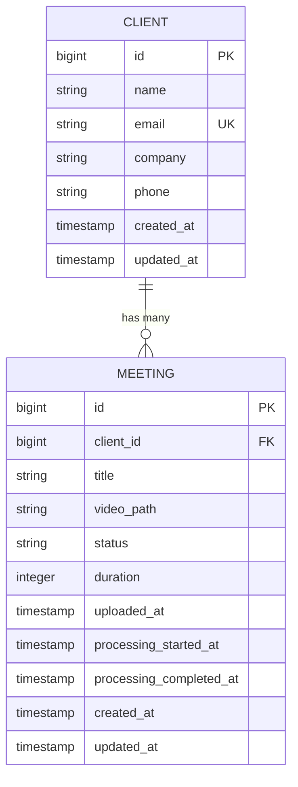
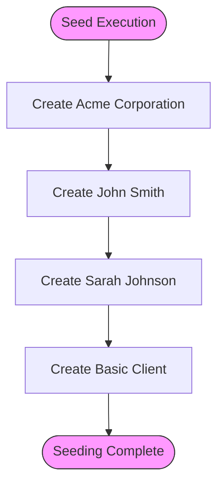

# Client Model


## Table of Contents
1. [Client Model](#client-model)
2. [Database Schema](#database-schema)
3. [Primary Key and UUID Usage](#primary-key-and-uuid-usage)
4. [Relationship with Meetings](#relationship-with-meetings)
5. [Business Rules](#business-rules)
6. [Eloquent Model Methods](#eloquent-model-methods)
7. [Sample Data Record](#sample-data-record)
8. [Factory and Seeding Patterns](#factory-and-seeding-patterns)
9. [Data Privacy and Access Control](#data-privacy-and-access-control)

## Database Schema

The `clients` table is defined in the migration file `2025_08_10_135157_create_clients_table.php`. It contains the following fields:

- **id**: Auto-incrementing primary key (bigint)
- **name**: String field, required, no uniqueness constraint enforced at database level
- **email**: String field, nullable, with a unique constraint to prevent duplicate email addresses
- **company**: String field, nullable
- **phone**: String field, nullable
- **created_at**: Timestamp automatically set on record creation
- **updated_at**: Timestamp automatically updated on record modification

The schema uses Laravel's `$table->id()` which creates an unsigned big integer auto-incrementing primary key by default, not UUIDs as initially assumed.


```php
Schema::create('clients', function (Blueprint $table) {
    $table->id();
    $table->string('name');
    $table->string('email')->unique()->nullable();
    $table->string('company')->nullable();
    $table->string('phone')->nullable();
    $table->timestamps();
});
```


**Section sources**
- [2025_08_10_135157_create_clients_table.php](file://database/migrations/2025_08_10_135157_create_clients_table.php#L10-L18)

## Primary Key and UUID Usage

Contrary to the initial assumption in the documentation objective, the `clients` table does **not** use UUIDs for identification. Instead, it uses Laravel's default `$table->id()` method, which generates an auto-incrementing bigint primary key.

This means:
- Primary key type: `BIGINT UNSIGNED AUTO_INCREMENT`
- Not UUID-based
- Sequential integer values
- Efficient for indexing and joining

If UUIDs were intended, the migration should have used `$table->uuid('id')->primary();` instead of `$table->id();`.

**Section sources**
- [2025_08_10_135157_create_clients_table.php](file://database/migrations/2025_08_10_135157_create_clients_table.php#L10)

## Relationship with Meetings

The `Client` model has a one-to-many relationship with the `Meeting` model. This relationship is established through a foreign key `client_id` in the `meetings` table that references the `id` column in the `clients` table.

In the `meetings` table migration:

```php
$table->foreignId('client_id')->constrained()->onDelete('cascade');
```


This creates:
- A foreign key constraint named `meetings_client_id_foreign`
- References `clients.id`
- Enables cascading delete (when a client is deleted, all associated meetings are automatically deleted)

The Eloquent relationship is defined in both models:

**In Client.php:**

```php
public function meetings(): HasMany
{
    return $this->hasMany(Meeting::class);
}
```


**In Meeting.php:**

```php
public function client(): BelongsTo
{
    return $this->belongsTo(Client::class);
}
```





**Diagram sources**
- [2025_08_10_135157_create_clients_table.php](file://database/migrations/2025_08_10_135157_create_clients_table.php#L10-L18)
- [2025_08_10_135205_create_meetings_table.php](file://database/migrations/2025_08_10_135205_create_meetings_table.php#L10-L15)
- [Client.php](file://app/Models/Client.php#L16-L19)
- [Meeting.php](file://app/Models/Meeting.php#L28-L31)

## Business Rules

### Client Name Uniqueness
While the database schema does not enforce uniqueness on the `name` field, business logic may require unique client names. This would need to be enforced at the application level through validation rules in controllers or form requests.

### Soft Deletion Implications
The current implementation does **not** use soft deletion. When a client is deleted:
- The record is permanently removed from the `clients` table
- All associated meetings are cascaded and deleted due to the foreign key constraint
- No `deleted_at` column exists in the schema

If soft deletion were needed, the following changes would be required:
1. Add `$table->softDeletes();` in the migration
2. Use `SoftDeletes` trait in the Client model
3. Update relationships to handle soft-deleted parents appropriately

**Section sources**
- [Client.php](file://app/Models/Client.php#L1-L28)
- [2025_08_10_135157_create_clients_table.php](file://database/migrations/2025_08_10_135157_create_clients_table.php#L10-L18)

## Eloquent Model Methods

The `Client` model defines the following relationship method:


```php
public function meetings(): HasMany
{
    return $this->hasMany(Meeting::class);
}
```


This method:
- Returns a `HasMany` relationship instance
- Links to the `Meeting` model
- Uses the conventional foreign key `client_id` in the `meetings` table
- Allows eager loading via `Client::with('meetings')`
- Enables operations like `client->meetings()->count()` or `client->meetings()->get()`

The model also includes:
- `HasFactory` trait for test data generation
- `$fillable` array specifying mass-assignable attributes: `name`, `email`, `company`, `phone`
- Casts for `email_verified_at` as datetime (though this column doesn't exist in current schema)

**Section sources**
- [Client.php](file://app/Models/Client.php#L1-L28)

## Sample Data Record

A typical client record in the database would look like:

| Field | Value |
|-------|-------|
| **id** | 1 |
| **name** | Acme Corporation |
| **email** | contact@acme.com |
| **company** | Acme Corp |
| **phone** | +1 (555) 123-4567 |
| **created_at** | 2025-08-10 14:30:00 |
| **updated_at** | 2025-08-10 14:30:00 |

Another example with minimal data:
| Field | Value |
|-------|-------|
| **id** | 4 |
| **name** | Basic Client |
| **email** | NULL |
| **company** | NULL |
| **phone** | NULL |
| **created_at** | 2025-08-10 14:30:05 |
| **updated_at** | 2025-08-10 14:30:05 |

These examples are based on the seeding pattern in `ClientSeeder.php`.

**Section sources**
- [ClientSeeder.php](file://database/seeders/ClientSeeder.php#L10-L38)

## Factory and Seeding Patterns

### ClientFactory
The `ClientFactory` class defines how test clients are generated:


```php
class ClientFactory extends Factory
{
    protected $model = Client::class;

    public function definition(): array
    {
        return [
            'name' => fake()->name(),
            'email' => fake()->unique()->safeEmail(),
            'company' => fake()->company(),
            'phone' => fake()->phoneNumber(),
        ];
    }

    public function withoutEmail(): static
    {
        return $this->state(fn (array $attributes) => [
            'email' => null,
        ]);
    }

    // Similar methods for withoutCompany() and withoutPhone()
}
```


Key features:
- Uses Laravel's `fake()` helper with FakerPHP
- Ensures unique emails via `unique()` modifier
- Provides state modifiers to create clients without optional fields
- All fields are optional in the factory definition

### ClientSeeder
The `ClientSeeder` creates four sample clients:
1. Acme Corporation with full details
2. John Smith with full details
3. Sarah Johnson with full details  
4. Basic Client with only name provided (others null)

The seeder uses `Client::factory()->create([...])` to create instances with specific attributes, bypassing the factory's random data generation.





**Diagram sources**
- [ClientFactory.php](file://database/factories/ClientFactory.php#L1-L59)
- [ClientSeeder.php](file://database/seeders/ClientSeeder.php#L1-L44)

## Data Privacy and Access Control

### Data Storage Considerations
The `clients` table stores personally identifiable information (PII):
- Full name
- Email address
- Phone number
- Company name

Best practices for handling this data:
- Ensure database encryption at rest
- Use HTTPS for all transmissions
- Hash sensitive data if possible (though not applicable for contact info)
- Implement proper access logging

### Access Control
Currently, no explicit access control is visible in the model. Access control should be implemented at the application level:
- In `ClientController` using middleware or policies
- Using Laravel's authorization policies to determine who can view/edit clients
- Role-based access (e.g., only managers can create clients)

Recommended security measures:
- Validate input thoroughly (especially email format)
- Sanitize output when displaying client data
- Implement rate limiting on client-related endpoints
- Use Laravel's built-in validation rules for email, phone, etc.

**Section sources**
- [Client.php](file://app/Models/Client.php#L1-L28)
- [ClientFactory.php](file://database/factories/ClientFactory.php#L1-L59)
- [ClientSeeder.php](file://database/seeders/ClientSeeder.php#L1-L44)

**Referenced Files in This Document**   
- [Client.php](file://app/Models/Client.php#L1-L28)
- [2025_08_10_135157_create_clients_table.php](file://database/migrations/2025_08_10_135157_create_clients_table.php#L1-L32)
- [ClientFactory.php](file://database/factories/ClientFactory.php#L1-L59)
- [ClientSeeder.php](file://database/seeders/ClientSeeder.php#L1-L44)
- [Meeting.php](file://app/Models/Meeting.php#L1-L179)
- [2025_08_10_135205_create_meetings_table.php](file://database/migrations/2025_08_10_135205_create_meetings_table.php#L1-L39)