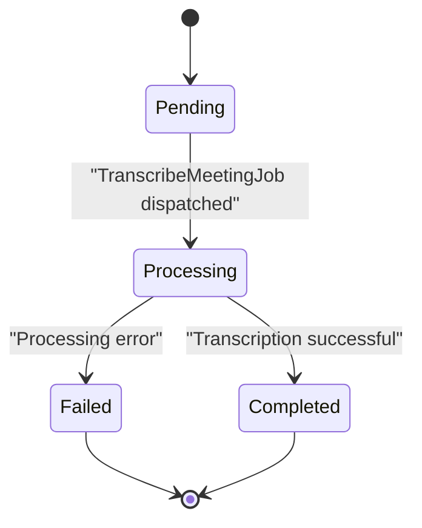
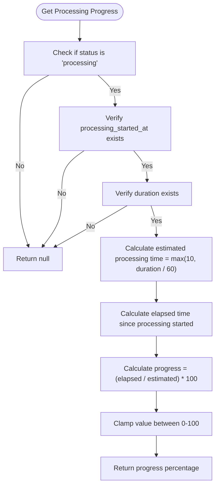
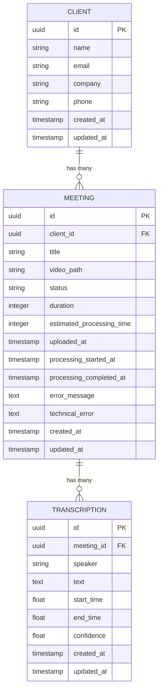

# Meeting Model


## Table of Contents
1. [Meeting Data Model](#meeting-data-model)
2. [Database Schema](#database-schema)
3. [Indexes](#indexes)
4. [Status Lifecycle](#status-lifecycle)
5. [Business Logic](#business-logic)
6. [Relationships](#relationships)
7. [Sample Data](#sample-data)
8. [Validation Rules](#validation-rules)
9. [Access Patterns](#access-patterns)

## Meeting Data Model

This document provides comprehensive documentation for the Meeting entity in the meetingai application. The Meeting model represents a recorded meeting that undergoes transcription processing. It tracks the entire lifecycle from upload through processing to completion or failure.

**Section sources**
- [Meeting.php](file://app/Models/Meeting.php#L1-L179)

## Database Schema

The meetings table schema is defined across multiple migration files, with the initial structure and subsequent alterations.

### Initial Schema Definition


```php
Schema::create('meetings', function (Blueprint $table) {
    $table->id();
    $table->foreignId('client_id')->constrained()->onDelete('cascade');
    $table->string('title');
    $table->string('video_path', 500);
    $table->string('status', 50)->default('pending');
    $table->integer('duration')->nullable(); // in seconds
    $table->timestamp('uploaded_at')->nullable();
    $table->timestamp('processing_started_at')->nullable();
    $table->timestamp('processing_completed_at')->nullable();
    $table->timestamps();
});
```


### Schema Alterations

#### Estimated Processing Time Addition

```php
Schema::table('meetings', function (Blueprint $table) {
    $table->integer('estimated_processing_time')->nullable()->after('duration')->comment('Estimated processing time in seconds');
});
```


#### Error Fields Addition

```php
Schema::table('meetings', function (Blueprint $table) {
    $table->text('error_message')->nullable()->after('processing_completed_at');
    $table->text('technical_error')->nullable()->after('error_message');
});
```


### Final Schema

The complete meetings table schema includes the following fields:

- **id**: UUID (Primary Key)
- **client_id**: Foreign key referencing clients table
- **title**: String (max 255 characters)
- **video_path**: String (max 500 characters)
- **status**: Enum string with values 'pending', 'processing', 'completed', 'failed'
- **duration**: Integer, nullable (in seconds)
- **estimated_processing_time**: Integer, nullable (in seconds)
- **uploaded_at**: Timestamp, nullable
- **processing_started_at**: Timestamp, nullable
- **processing_completed_at**: Timestamp, nullable
- **error_message**: Text, nullable (user-friendly error message)
- **technical_error**: Text, nullable (detailed technical error)
- **created_at**: Timestamp
- **updated_at**: Timestamp

**Section sources**
- [2025_08_10_135205_create_meetings_table.php](file://database/migrations/2025_08_10_135205_create_meetings_table.php#L1-L41)
- [2025_08_10_145951_add_estimated_processing_time_to_meetings_table.php](file://database/migrations/2025_08_10_145951_add_estimated_processing_time_to_meetings_table.php#L1-L29)
- [2025_08_10_160251_add_error_fields_to_meetings_table.php](file://database/migrations/2025_08_10_160251_add_error_fields_to_meetings_table.php#L1-L29)

## Indexes

The meetings table includes several indexes to optimize query performance:

- **client_id index**: Optimizes queries filtering by client
- **status index**: Optimizes queries filtering by status
- **uploaded_at index**: Optimizes queries filtering by upload date

These indexes are defined in the initial migration:


```php
$table->index('client_id');
$table->index('status');
$table->index('uploaded_at');
```


**Section sources**
- [2025_08_10_135205_create_meetings_table.php](file://database/migrations/2025_08_10_135205_create_meetings_table.php#L20-L23)

## Status Lifecycle

The Meeting entity follows a well-defined lifecycle with four possible status states: pending, processing, completed, and failed.

### State Transition Diagram





**Diagram sources**
- [TranscribeMeetingJob.php](file://app/Jobs/TranscribeMeetingJob.php#L1-L400)
- [Meeting.php](file://app/Models/Meeting.php#L1-L179)

### Status Transitions

1. **Upload**: When a meeting is created via the MeetingController, it starts with status 'pending' and uploaded_at timestamp set.
2. **Queue to Processing**: The TranscribeMeetingJob updates the status to 'processing' and sets processing_started_at when execution begins.
3. **Processing to Completion**: If transcription completes successfully, status is updated to 'completed' and processing_completed_at is set.
4. **Processing to Failure**: If an error occurs during transcription, status is updated to 'failed' and processing_completed_at is set, with error details recorded.

### Status Methods

The Meeting model provides convenience methods for checking status:


```php
public function isProcessing(): bool
{
    return $this->status === 'processing';
}

public function isCompleted(): bool
{
    return $this->status === 'completed';
}

public function isFailed(): bool
{
    return $this->status === 'failed';
}
```


**Section sources**
- [Meeting.php](file://app/Models/Meeting.php#L45-L57)
- [TranscribeMeetingJob.php](file://app/Jobs/TranscribeMeetingJob.php#L1-L400)

## Business Logic

The Meeting model implements several business logic features for calculating processing metrics and progress.

### Processing Progress Calculation

The processing progress is calculated as a percentage based on elapsed time versus estimated processing time:


```php
public function getProcessingProgressAttribute(): ?float
{
    if (!$this->isProcessing() || !$this->processing_started_at || !$this->duration) {
        return null;
    }

    $estimatedTotalProcessingTime = max(10, $this->duration / 60);
    $elapsedTime = $this->elapsed_time;
    
    return min(100, ($elapsedTime / $estimatedTotalProcessingTime) * 100);
}
```


The estimated processing time is calculated as 1 second per minute of video duration, with a minimum of 10 seconds.

### Queue Progress Simulation

For meetings in 'pending' status, the system simulates queue progress based on time since upload:


```php
public function getQueueProgressAttribute(): ?float
{
    if ($this->status !== 'pending' || !$this->estimated_processing_time || !$this->uploaded_at) {
        return null;
    }

    // Simulate queue progress based on time since upload
    // Assume it takes 30 seconds to start processing after upload
    $queueWaitTime = 30;
    $elapsedSinceUpload = $this->uploaded_at->diffInSeconds(now());
    
    return min(100, ($elapsedSinceUpload / $queueWaitTime) * 100);
}
```


### Time Calculations

The model calculates various time-related attributes:

- **Elapsed time**: Time since processing started (or since upload for pending meetings)
- **Estimated remaining time**: Projected time remaining for processing
- **Formatted time strings**: Human-readable time displays (MM:SS format)





**Diagram sources**
- [Meeting.php](file://app/Models/Meeting.php#L75-L155)

**Section sources**
- [Meeting.php](file://app/Models/Meeting.php#L59-L155)

## Relationships

The Meeting model has defined relationships with other entities in the system.

### Client Relationship (Many-to-One)

Each meeting belongs to a single client:


```php
public function client(): BelongsTo
{
    return $this->belongsTo(Client::class);
}
```


This relationship enables accessing client information from a meeting instance and supports eager loading to prevent N+1 query problems.

### Transcription Relationship (One-to-Many)

Each meeting has many transcription segments:


```php
public function transcriptions(): HasMany
{
    return $this->hasMany(Transcription::class);
}
```


The transcriptions are ordered by start_time when loaded.

### Relationship Diagram





**Diagram sources**
- [Meeting.php](file://app/Models/Meeting.php#L40-L43)
- [Client.php](file://app/Models/Client.php)
- [Transcription.php](file://app/Models/Transcription.php)

**Section sources**
- [Meeting.php](file://app/Models/Meeting.php#L38-L43)

## Sample Data

Sample records illustrating each status state:

### Pending Meeting

```json
{
  "id": "1",
  "client_id": "5",
  "title": "Client Onboarding Meeting",
  "video_path": "meetings/5/1/video.mp4",
  "status": "pending",
  "duration": 1800,
  "estimated_processing_time": 30,
  "uploaded_at": "2025-08-10T14:30:00Z",
  "processing_started_at": null,
  "processing_completed_at": null,
  "error_message": null,
  "technical_error": null,
  "created_at": "2025-08-10T14:30:00Z",
  "updated_at": "2025-08-10T14:30:00Z"
}
```


### Processing Meeting

```json
{
  "id": "2",
  "client_id": "3",
  "title": "Project Kickoff",
  "video_path": "meetings/3/2/video.mov",
  "status": "processing",
  "duration": 3600,
  "estimated_processing_time": 60,
  "uploaded_at": "2025-08-10T13:15:00Z",
  "processing_started_at": "2025-08-10T13:20:00Z",
  "processing_completed_at": null,
  "error_message": null,
  "technical_error": null,
  "created_at": "2025-08-10T13:15:00Z",
  "updated_at": "2025-08-10T13:20:00Z"
}
```


### Completed Meeting

```json
{
  "id": "3",
  "client_id": "7",
  "title": "Quarterly Review",
  "video_path": "meetings/7/3/video.webm",
  "status": "completed",
  "duration": 2700,
  "estimated_processing_time": 45,
  "uploaded_at": "2025-08-09T10:00:00Z",
  "processing_started_at": "2025-08-09T10:05:00Z",
  "processing_completed_at": "2025-08-09T10:10:00Z",
  "error_message": null,
  "technical_error": null,
  "created_at": "2025-08-09T10:00:00Z",
  "updated_at": "2025-08-09T10:10:00Z"
}
```


### Failed Meeting

```json
{
  "id": "4",
  "client_id": "2",
  "title": "Team Meeting",
  "video_path": "meetings/2/4/video.avi",
  "status": "failed",
  "duration": 1200,
  "estimated_processing_time": 20,
  "uploaded_at": "2025-08-10T09:30:00Z",
  "processing_started_at": "2025-08-10T09:35:00Z",
  "processing_completed_at": "2025-08-10T09:36:00Z",
  "error_message": "Failed to process the video file. The file may be corrupted or in an unsupported format.",
  "technical_error": "WAV conversion did not produce expected file at: /app/storage/4/audio.wav",
  "created_at": "2025-08-10T09:30:00Z",
  "updated_at": "2025-08-10T09:36:00Z"
}
```


**Section sources**
- [Meeting.php](file://app/Models/Meeting.php#L1-L179)
- [TranscribeMeetingJob.php](file://app/Jobs/TranscribeMeetingJob.php#L1-L400)

## Validation Rules

The Meeting model and its controller enforce several validation rules:

### Model Fillable Attributes

```php
protected $fillable = [
    'client_id',
    'title',
    'video_path',
    'status',
    'duration',
    'estimated_processing_time',
    'uploaded_at',
    'processing_started_at',
    'processing_completed_at',
    'error_message',
    'technical_error',
];
```


### Model Casts

```php
protected $casts = [
    'uploaded_at' => 'datetime',
    'processing_started_at' => 'datetime',
    'processing_completed_at' => 'datetime',
    'duration' => 'integer',
    'estimated_processing_time' => 'integer',
];
```


### Controller Validation
When creating a meeting, the MeetingController validates:
- Title is required and ≤ 255 characters
- Client_id is required and references an existing client
- Video file is required and of type MP4, MOV, AVI, or WebM
- Video file size is between 1MB and 500MB


```php
$validated = $request->validate([
    'title' => 'required|string|max:255',
    'client_id' => 'required|exists:clients,id',
    'video' => [
        'required',
        'file',
        File::types(['mp4', 'mov', 'avi', 'webm'])
            ->max(500 * 1024) // 500MB max
            ->min(1024) // 1MB min
    ]
]);
```


**Section sources**
- [Meeting.php](file://app/Models/Meeting.php#L15-L36)
- [MeetingController.php](file://app/Http/Controllers/MeetingController.php#L75-L95)

## Access Patterns

The application uses several access patterns for retrieving and displaying meeting data.

### List View with Filtering
The index method supports filtering by client, status, and date range:


```php
$query = Meeting::query()->with('client');

if ($request->filled('client_id')) {
    $query->where('client_id', $request->client_id);
}

if ($request->filled('status')) {
    $query->where('status', $request->status);
}

if ($request->filled('date_from')) {
    $query->whereDate('uploaded_at', '>=', $request->date_from);
}

if ($request->filled('date_to')) {
    $query->whereDate('uploaded_at', '<=', $request->date_to);
}
```


### Real-time Status Updates
The status endpoint provides real-time progress information:


```php
public function status(Meeting $meeting)
{
    return response()->json([
        'success' => true,
        'data' => [
            'id' => $meeting->id,
            'status' => $meeting->status,
            'elapsed_time' => $meeting->elapsed_time,
            'estimated_remaining_time' => $meeting->estimated_remaining_time,
            'processing_progress' => $meeting->processing_progress,
            'formatted_elapsed_time' => $meeting->formatted_elapsed_time,
            'formatted_estimated_remaining_time' => $meeting->formatted_estimated_remaining_time,
            'queue_progress' => $meeting->queue_progress,
            'formatted_estimated_processing_time' => $meeting->formatted_estimated_processing_time,
        ]
    ]);
}
```


### Eager Loading
The application uses eager loading to optimize performance:


```php
$meeting->load(['client', 'transcriptions' => function ($query) {
    $query->orderBy('start_time');
}]);
```


**Section sources**
- [MeetingController.php](file://app/Http/Controllers/MeetingController.php#L25-L73)
- [MeetingController.php](file://app/Http/Controllers/MeetingController.php#L275-L304)
- [MeetingController.php](file://app/Http/Controllers/MeetingController.php#L235-L255)

**Referenced Files in This Document**   
- [Meeting.php](file://app/Models/Meeting.php)
- [MeetingController.php](file://app/Http/Controllers/MeetingController.php)
- [TranscribeMeetingJob.php](file://app/Jobs/TranscribeMeetingJob.php)
- [2025_08_10_135205_create_meetings_table.php](file://database/migrations/2025_08_10_135205_create_meetings_table.php)
- [2025_08_10_145951_add_estimated_processing_time_to_meetings_table.php](file://database/migrations/2025_08_10_145951_add_estimated_processing_time_to_meetings_table.php)
- [2025_08_10_160251_add_error_fields_to_meetings_table.php](file://database/migrations/2025_08_10_160251_add_error_fields_to_meetings_table.php)
- [index.ts](file://resources/js/types/index.ts)