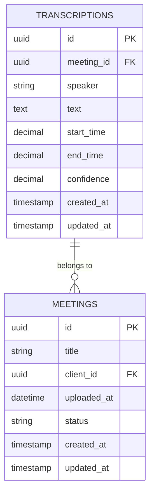
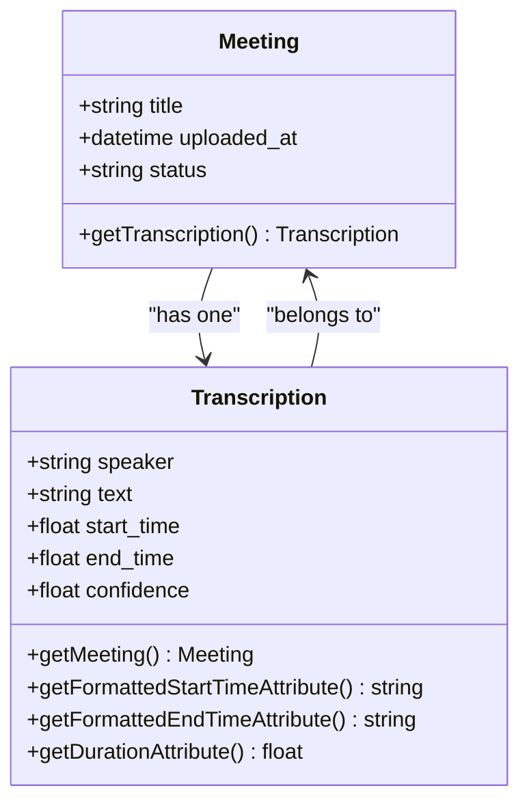
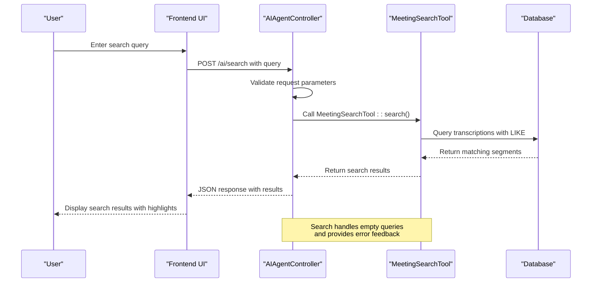

# Transcription Model


## Table of Contents
1. [Introduction](#introduction)
2. [Transcriptions Table Schema](#transcriptions-table-schema)
3. [Content JSON Structure](#content-json-structure)
4. [Relationship with Meetings](#relationship-with-meetings)
5. [AI Search Functionality](#ai-search-functionality)
6. [Data Access Methods](#data-access-methods)
7. [Sample Data Record](#sample-data-record)
8. [Performance Considerations](#performance-considerations)

## Introduction
The Transcription model in the meetingai application represents the textual content extracted from audio recordings of meetings. This document provides comprehensive documentation of the Transcription entity, detailing its database schema, JSON structure, relationships, and functionality. The model plays a critical role in enabling AI-powered search and analysis of meeting content, allowing users to find specific discussions, quotes, and topics across their meeting history.

## Transcriptions Table Schema
The transcriptions table stores the segmented text content of meeting recordings with timing information and speaker identification. Based on the migration file, the schema includes the following fields:

- **id**: Primary key (UUID) - Automatically generated unique identifier for each transcription segment
- **meeting_id**: Foreign key - References the meeting to which this transcription belongs, with cascade delete behavior
- **speaker**: String (nullable) - Name or identifier of the speaker for this segment
- **text**: Text - The transcribed text content of the segment
- **start_time**: Decimal (10,3) - Start time of the segment in seconds with millisecond precision
- **end_time**: Decimal (10,3) - End time of the segment in seconds with millisecond precision
- **confidence**: Decimal (3,2) - Confidence score of the transcription (0.00 to 1.00), defaulting to 1.00
- **created_at**: Timestamp - When the transcription record was created
- **updated_at**: Timestamp - When the transcription record was last updated

The schema includes indexes on `meeting_id` and `start_time` to optimize query performance for common access patterns. The foreign key constraint ensures referential integrity with the meetings table.





**Diagram sources**
- [2025_08_10_135210_create_transcriptions_table.php](file://database/migrations/2025_08_10_135210_create_transcriptions_table.php#L10-L30)
- [Transcription.php](file://app/Models/Transcription.php#L10-L25)

**Section sources**
- [2025_08_10_135210_create_transcriptions_table.php](file://database/migrations/2025_08_10_135210_create_transcriptions_table.php#L10-L30)
- [Transcription.php](file://app/Models/Transcription.php#L10-L25)

## Content JSON Structure
The transcription content is stored as structured JSON data, with each transcription consisting of multiple segments. Each segment contains timing information, speaker identification, and text content. Based on the example in storage/22/transcript.json, the JSON structure is organized as follows:

- **segments**: Array of transcription segments
  - Each segment contains:
    - **start**: Float - Start time in seconds
    - **end**: Float - End time in seconds
    - **text**: String - Transcribed text for the segment
    - **words**: Array of individual word objects with timing and confidence
      - **word**: String - Individual word text
      - **start**: Float - Word start time in seconds
      - **end**: Float - Word end time in seconds
      - **score**: Float - Confidence score for the word (0.00 to 1.00)
    - **speaker**: String - Speaker identifier for the segment (e.g., "unknown", "Dr. Sarah Johnson")

The JSON structure enables precise timing of individual words and phrases, supporting features like synchronized playback and detailed confidence analysis. The speaker field allows for speaker diarization, identifying who spoke each segment of the conversation.

**Section sources**
- [transcript.json](file://storage/22/transcript.json#L1-L80)
- [Transcription.php](file://app/Models/Transcription.php#L10-L25)

## Relationship with Meetings
The Transcription model has a one-to-one relationship with the Meeting model through the `meeting_id` foreign key. This relationship is defined in the Transcription model with the `meeting()` method that returns a `BelongsTo` relationship. The migration file establishes this relationship with a foreign key constraint that cascades deletes, ensuring that when a meeting is deleted, all associated transcriptions are also removed.

The relationship enables efficient retrieval of transcription data for a specific meeting and supports reverse lookups from meetings to their transcriptions. This one-to-one mapping ensures that each meeting has exactly one transcription record, maintaining data integrity and preventing duplication.





**Diagram sources**
- [Transcription.php](file://app/Models/Transcription.php#L30-L45)
- [2025_08_10_135210_create_transcriptions_table.php](file://database/migrations/2025_08_10_135210_create_transcriptions_table.php#L15)

**Section sources**
- [Transcription.php](file://app/Models/Transcription.php#L30-L45)
- [2025_08_10_135210_create_transcriptions_table.php](file://database/migrations/2025_08_10_135210_create_transcriptions_table.php#L15)

## AI Search Functionality
The Transcription model supports AI search functionality through the AIAgentController and MeetingSearchTool components. The search endpoint allows users to query transcribed content using natural language, enabling full-text search across all meeting transcripts.

The search functionality is implemented in the `search` method of AIAgentController, which validates the search query and delegates to the MeetingSearchTool. The system performs text-based searches on the `text` field of transcription records, returning results with highlighted matching terms. Search results include contextual information such as meeting title, client name, speaker, text content, and timestamp.

The AI search supports filtering by client and speaker, allowing users to narrow their search to specific contexts. When no results are found, the system provides helpful suggestions to guide the user. The search interface is accessible through both the AI chat interface and direct API calls, making it easy to integrate into various workflows.





**Diagram sources**
- [AIAgentController.php](file://app/Http/Controllers/AIAgentController.php#L130-L182)
- [Transcription.php](file://app/Models/Transcription.php#L10-L25)

**Section sources**
- [AIAgentController.php](file://app/Http/Controllers/AIAgentController.php#L130-L182)

## Data Access Methods
The Transcription model provides several helper methods for accessing and formatting transcription data:

- **getFormattedStartTimeAttribute()**: Returns the start time formatted as MM:SS.milliseconds (e.g., "10:30.456")
- **getFormattedEndTimeAttribute()**: Returns the end time formatted as MM:SS.milliseconds (e.g., "10:35.789")
- **getDurationAttribute()**: Calculates and returns the duration of the segment in seconds (end_time - start_time)
- **meeting()**: Returns the BelongsTo relationship with the Meeting model

These accessor methods provide convenient ways to work with the transcription data without requiring manual calculations or formatting. The formatted time attributes are particularly useful for display purposes in the user interface, while the duration attribute simplifies analysis of segment lengths.

The model also inherits standard Eloquent methods for querying and manipulating transcription records, including support for filtering by meeting, speaker, time range, and text content.

**Section sources**
- [Transcription.php](file://app/Models/Transcription.php#L40-L55)

## Sample Data Record
The following is a sample transcription record based on the structure observed in the transcript.json file:


```json
{
  "segments": [
    {
      "start": 669.293,
      "end": 674.641,
      "text": " Upstairs, as I'm sure you're well aware of where the coffee is at this point.",
      "words": [
        {
          "word": "Upstairs,",
          "start": 669.293,
          "end": 670.154,
          "score": 0.615
        },
        {
          "word": "as",
          "start": 670.174,
          "end": 670.314,
          "score": 0.424
        },
        {
          "word": "I'm",
          "start": 670.335,
          "end": 670.435,
          "score": 0.423
        },
        {
          "word": "sure",
          "start": 670.455,
          "end": 670.655,
          "score": 0.575
        }
      ],
      "speaker": "unknown"
    },
    {
      "start": 674.761,
      "end": 677.605,
      "text": "And lunch will be brought in again so we can hang here.",
      "words": [
        {
          "word": "And",
          "start": 674.761,
          "end": 675.102,
          "score": 0.455
        },
        {
          "word": "lunch",
          "start": 675.122,
          "end": 675.222,
          "score": 0.039
        }
      ],
      "speaker": "unknown"
    }
  ]
}
```


Typical values for the fields include:
- **start/end times**: Floating-point numbers representing seconds from the beginning of the recording
- **text**: Natural language text of the spoken content
- **words**: Array of individual words with precise timing and confidence scores
- **speaker**: String identifier, which may be "unknown" for segments where speaker identification failed

## Performance Considerations
Querying large transcription texts presents several performance considerations that are addressed through indexing and query optimization strategies:

The transcriptions table includes indexes on `meeting_id` and `start_time` to optimize common query patterns. The `meeting_id` index enables fast retrieval of all transcriptions for a specific meeting, while the `start_time` index supports chronological queries and time-based filtering.

For full-text search operations, the application uses LIKE queries since SQLite (the database system in use) does not support full-text indexes. This approach is sufficient for the current scale but may require optimization as the dataset grows. Potential performance improvements could include:

- Implementing a dedicated search engine like Elasticsearch or Algolia for complex text searches
- Adding a word_count field to quickly assess transcription length without processing the text
- Caching frequent search queries to reduce database load
- Implementing pagination for large result sets

The current indexing strategy balances query performance with storage efficiency, ensuring responsive access to transcription data while maintaining data integrity through foreign key constraints.

**Section sources**
- [2025_08_10_135210_create_transcriptions_table.php](file://database/migrations/2025_08_10_135210_create_transcriptions_table.php#L25-L28)
- [Transcription.php](file://app/Models/Transcription.php#L10-L25)

**Referenced Files in This Document**   
- [Transcription.php](file://app/Models/Transcription.php)
- [2025_08_10_135210_create_transcriptions_table.php](file://database/migrations/2025_08_10_135210_create_transcriptions_table.php)
- [transcript.json](file://storage/22/transcript.json)
- [AIAgentController.php](file://app/Http/Controllers/AIAgentController.php)