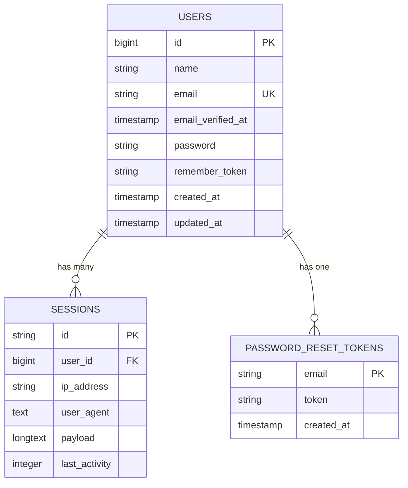

# User Model


## Table of Contents
1. [User Model](#user-model)
2. [Database Schema](#database-schema)
3. [Eloquent Model Implementation](#eloquent-model-implementation)
4. [Authentication and Authorization Integration](#authentication-and-authorization-integration)
5. [Security Considerations](#security-considerations)
6. [Sample Data](#sample-data)
7. [Relationships and Context](#relationships-and-context)

## Database Schema

The `users` table schema is defined in the migration file `0001_01_01_000000_create_users_table.php`. This table serves as the foundation for user authentication and stores essential user information.

### Field Definitions
- **id**: `bigIncrements` - Primary key for the users table, automatically incremented.
- **name**: `string` - Stores the full name of the user.
- **email**: `string`, `unique` - Stores the user's email address, which must be unique across the system.
- **email_verified_at**: `timestamp`, `nullable` - Timestamp indicating when the user's email was verified. Null if not yet verified.
- **password**: `string` - Stores the hashed password for the user.
- **remember_token**: `string`, `nullable` - Token used for "remember me" functionality during login.
- **created_at**: `timestamp` - Timestamp when the record was created.
- **updated_at**: `timestamp` - Timestamp when the record was last updated.

### Indexes
- **Primary Key**: On the `id` field.
- **Unique Index**: On the `email` field to enforce uniqueness.

Additional tables created in the same migration:
- `password_reset_tokens`: Stores tokens for password reset functionality.
- `sessions`: Stores session data when using database session driver.





**Diagram sources**
- [0001_01_01_000000_create_users_table.php](file://database/migrations/0001_01_01_000000_create_users_table.php#L15-L35)

**Section sources**
- [0001_01_01_000000_create_users_table.php](file://database/migrations/0001_01_01_000000_create_users_table.php#L1-L50)

## Eloquent Model Implementation

The `User` model is located at `app/Models/User.php` and extends Laravel's `Authenticatable` class, enabling built-in authentication features.

### Class Definition

```php
class User extends Authenticatable
{
    use HasFactory, Notifiable;
}
```


### Key Features

#### Traits Used
- **HasFactory**: Enables the use of Eloquent model factories for testing and seeding.
- **Notifiable**: Provides functionality for sending notifications via various channels (e.g., mail, database).

#### Mass Assignment Protection

```php
protected $fillable = [
    'name',
    'email',
    'password',
];
```

These attributes can be mass-assigned during model creation.

#### Hidden Attributes

```php
protected $hidden = [
    'password',
    'remember_token',
];
```

These attributes are excluded when the model is serialized to an array or JSON, enhancing security by preventing sensitive data exposure.

#### Attribute Casting

```php
protected function casts(): array
{
    return [
        'email_verified_at' => 'datetime',
        'password' => 'hashed',
    ];
}
```

- **email_verified_at**: Automatically cast to a `Carbon` datetime object.
- **password**: Automatically hashed when assigned, using Laravel's default hashing driver (typically Bcrypt).

**Section sources**
- [User.php](file://app/Models/User.php#L1-L47)

## Authentication and Authorization Integration

The User model integrates seamlessly with Laravel's built-in authentication system through configuration and framework conventions.

### Authentication Configuration
The `auth.php` configuration file defines:
- **Default Guard**: `web` using session driver.
- **User Provider**: Eloquent driver with `App\Models\User` as the model.
- **Password Broker**: Uses the `password_reset_tokens` table for password resets.


```php
'providers' => [
    'users' => [
        'driver' => 'eloquent',
        'model' => App\Models\User::class,
    ],
],
```


### Session Management
The application uses database-driven sessions:

```php
'driver' => env('SESSION_DRIVER', 'database'),
'table' => env('SESSION_TABLE', 'sessions'),
```

This ensures session persistence and scalability.

### Middleware Integration
The `HandleInertiaRequests` middleware shares the authenticated user's basic information (id, name, email) with the frontend via Inertia.js, enabling client-side personalization.

**Section sources**
- [auth.php](file://config/auth.php#L37-L71)
- [session.php](file://config/session.php#L1-L10)
- [HandleInertiaRequests.php](file://app/Http/Middleware/HandleInertiaRequests.php#L30-L67)

## Security Considerations

The User model and associated system implement multiple security best practices.

### Password Hashing
Passwords are automatically hashed using Laravel's `Hash` facade due to the `'password' => 'hashed'` cast. This uses Bcrypt by default, providing strong protection against brute-force attacks.

### Email Verification
The `email_verified_at` field supports Laravel's email verification system. Although the `MustVerifyEmail` interface is commented out, the field exists to support this feature if enabled.

### Session Security
Session configuration includes:
- **HTTP Only Cookies**: Prevents JavaScript access to session cookies.
- **Secure Cookies**: Ensures cookies are only sent over HTTPS (configurable via env).
- **Same-Site Protection**: Set to "lax" to mitigate CSRF attacks.

### Sensitive Data Protection
The `password` and `remember_token` fields are hidden from model serialization, preventing accidental exposure in API responses or logs.

**Section sources**
- [User.php](file://app/Models/User.php#L35-L45)
- [session.php](file://config/session.php#L158-L184)
- [auth.php](file://config/auth.php#L67-L114)

## Sample Data

Example user record with hashed password placeholder:


```json
{
  "id": 1,
  "name": "John Doe",
  "email": "john.doe@example.com",
  "email_verified_at": "2025-08-10T10:00:00Z",
  "password": "$2y$10$92IXUNpkjO0rOQ5byMi.Ye4oKoEa3Ro9llC/.og/at2.uheWG/igi", // Laravel default hash for 'password'
  "remember_token": "abc123xyz456",
  "created_at": "2025-08-10T09:30:00Z",
  "updated_at": "2025-08-10T09:30:00Z"
}
```


This data structure reflects the actual database schema and Eloquent model behavior.

**Section sources**
- [UserFactory.php](file://database/factories/UserFactory.php#L25-L35)

## Relationships and Context

### Current Relationships
The User model does not have explicit Eloquent relationships defined with `Client` or `Meeting` models in the current schema. Users act as authenticated principals who access the system but are not directly linked to business entities.

### System Role
- **Authentication Principal**: Users log in and are authenticated via Laravel's guard system.
- **Session Management**: User sessions are tracked in the `sessions` table.
- **Access Control**: While no explicit authorization roles are defined, the authenticated user is the context for all operations.

### Potential Future Extensions
Relationships could be added to associate users with:
- Meetings they create
- Clients they manage
- Transcriptions they own

Currently, access appears to be global for authenticated users, with no multi-tenancy or ownership model implemented.

**Section sources**
- [User.php](file://app/Models/User.php#L1-L47)
- [Client.php](file://app/Models/Client.php#L1-L26)
- [Meeting.php](file://app/Models/Meeting.php#L1-L25)

**Referenced Files in This Document**   
- [User.php](file://app/Models/User.php)
- [0001_01_01_000000_create_users_table.php](file://database/migrations/0001_01_01_000000_create_users_table.php)
- [auth.php](file://config/auth.php)
- [session.php](file://config/session.php)
- [UserFactory.php](file://database/factories/UserFactory.php)
- [HandleInertiaRequests.php](file://app/Http/Middleware/HandleInertiaRequests.php)