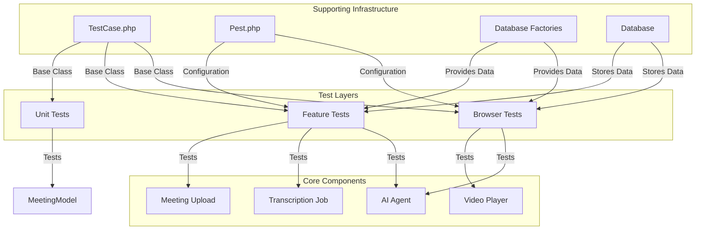
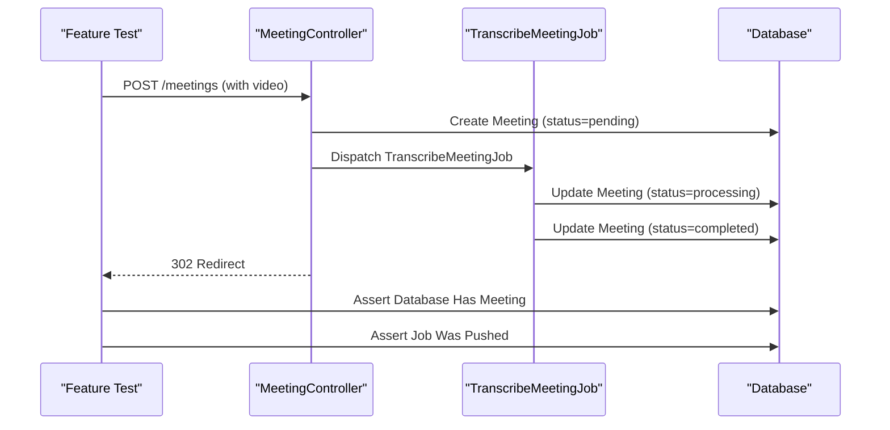
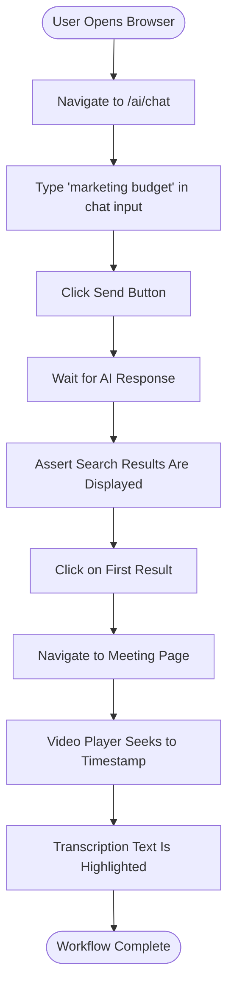
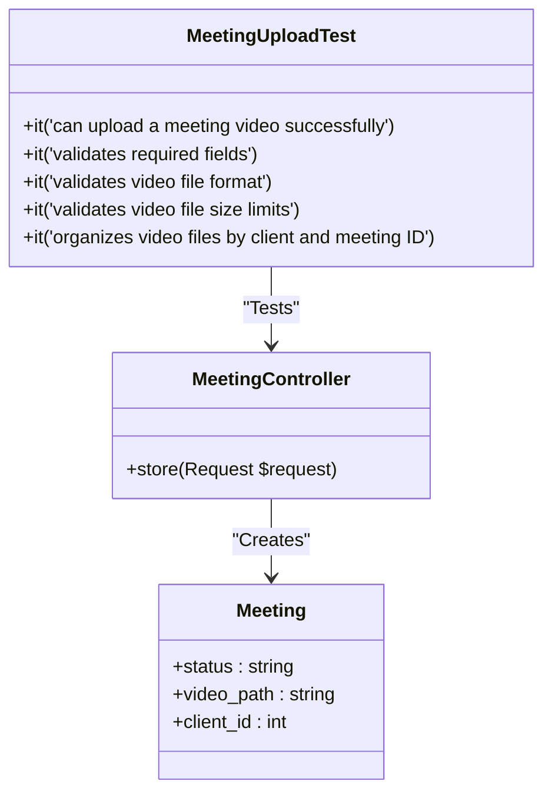
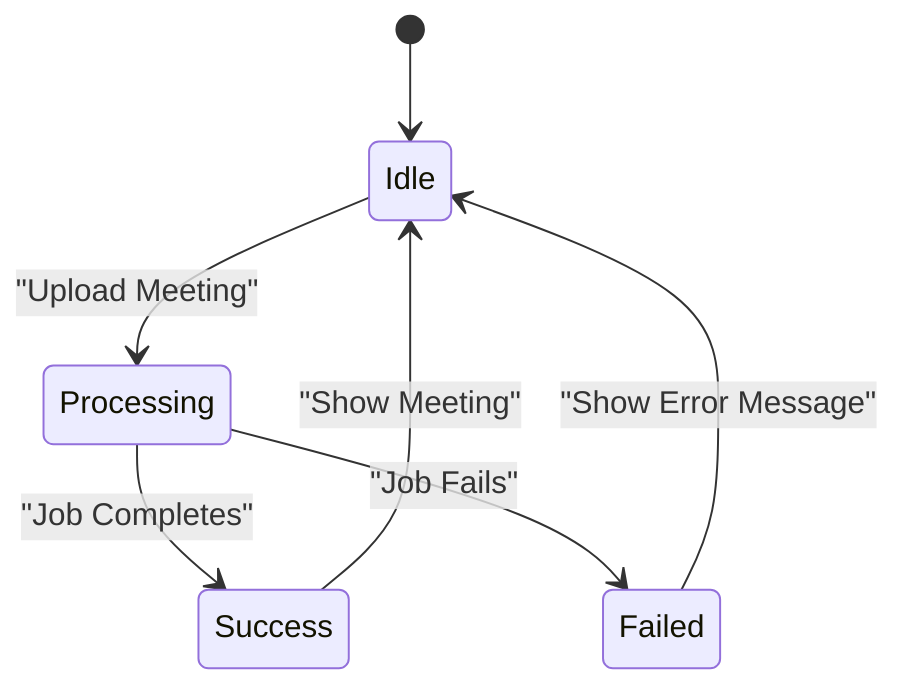

# Testing Strategy


## Table of Contents
1. [Introduction](#introduction)
2. [Test Architecture Overview](#test-architecture-overview)
3. [Test Types and Their Purposes](#test-types-and-their-purposes)
4. [Key Test Files and Workflows](#key-test-files-and-workflows)
5. [Test Setup and Configuration](#test-setup-and-configuration)
6. [Database and Data Management](#database-and-data-management)
7. [Critical Workflow Validation](#critical-workflow-validation)
8. [Error Handling and Edge Cases](#error-handling-and-edge-cases)
9. [Running Tests and CI/CD Integration](#running-tests-and-cicd-integration)
10. [Testing Challenges and Solutions](#testing-challenges-and-solutions)

## Introduction
The meetingai application employs a comprehensive multi-layered testing strategy using PestPHP, a modern PHP testing framework built on top of PHPUnit. This strategy ensures the reliability, stability, and correctness of the application's core functionalities, including meeting uploads, AI-powered search, transcription processing, and user interface interactions. The testing approach is structured into three distinct layers: Unit tests for isolated logic, Feature tests for HTTP endpoints and business logic, and Browser tests for end-to-end user workflows. This document provides a detailed overview of the testing strategy, explaining the purpose of each test type, analyzing key test files, describing the test setup, and outlining how critical workflows are validated. It also covers instructions for running tests, generating coverage reports, and integrating with CI/CD pipelines, while addressing specific testing challenges such as mocking external services.

## Test Architecture Overview





**Diagram sources**
- [TestCase.php](file://tests/TestCase.php)
- [Pest.php](file://tests/Pest.php)
- [MeetingUploadTest.php](file://tests/Feature/MeetingUploadTest.php)
- [TranscribeMeetingJobTest.php](file://tests/Feature/TranscribeMeetingJobTest.php)
- [AIAgentInteractionTest.php](file://tests/Browser/AIAgentInteractionTest.php)
- [VideoPlayerAndTranscriptionTest.php](file://tests/Browser/VideoPlayerAndTranscriptionTest.php)
- [ClientFactory.php](file://database/factories/ClientFactory.php)
- [MeetingFactory.php](file://database/factories/MeetingFactory.php)
- [TranscriptionFactory.php](file://database/factories/TranscriptionFactory.php)

## Test Types and Their Purposes

### Unit Tests
Unit tests are designed to verify the correctness of isolated units of code, typically individual methods or functions, without any external dependencies. In the meetingai application, the Unit test suite is minimal, currently containing only an `ExampleTest.php` file. The primary purpose of unit tests here is to validate the internal logic of models and utility classes in complete isolation. For instance, a unit test could verify that a method on the `Meeting` model correctly calculates the formatted elapsed time based on timestamps. These tests are fast and provide granular feedback on the core logic of the application.

**Section sources**
- [tests/Unit/ExampleTest.php](file://tests/Unit/ExampleTest.php)

### Feature Tests
Feature tests are the cornerstone of the meetingai testing strategy. They validate the application's business logic, HTTP endpoints, and the interaction between multiple components. These tests operate at a higher level than unit tests, simulating real-world usage scenarios such as uploading a meeting, searching for AI insights, or handling errors. Feature tests use Laravel's testing helpers to make HTTP requests, assert responses, and interact with the database. They are crucial for ensuring that the controllers, jobs, and services work together as expected. For example, a Feature test can verify that a `POST` request to the meeting upload endpoint creates a new `Meeting` record in the database and dispatches a `TranscribeMeetingJob`.





**Diagram sources**
- [MeetingController.php](file://app/Http/Controllers/MeetingController.php)
- [TranscribeMeetingJob.php](file://app/Jobs/TranscribeMeetingJob.php)
- [MeetingUploadTest.php](file://tests/Feature/MeetingUploadTest.php)

### Browser Tests
Browser tests, also known as end-to-end (E2E) tests, simulate real user interactions with the application through a web browser. In meetingai, these tests use a Dusk-like approach provided by Pest's browser testing capabilities to validate complex user workflows that involve JavaScript, dynamic content, and UI interactions. These tests are essential for ensuring that the frontend and backend work seamlessly together. For example, a Browser test can verify that a user can type a query into the AI chat interface, click on a search result, and be navigated to the correct meeting page with the video player seeking to the precise timestamp of the discussion.





**Diagram sources**
- [AIAgentInteractionTest.php](file://tests/Browser/AIAgentInteractionTest.php)
- [VideoPlayerAndTranscriptionTest.php](file://tests/Browser/VideoPlayerAndTranscriptionTest.php)
- [AIAgentController.php](file://app/Http/Controllers/AIAgentController.php)

## Key Test Files and Workflows

### MeetingUploadTest
The `MeetingUploadTest.php` file contains a suite of Feature tests that comprehensively validate the meeting upload workflow. These tests cover the entire lifecycle, from displaying the upload form to verifying the successful creation of a meeting record and the dispatching of the transcription job. Key test cases include:
- **Displaying the upload form**: Verifies that the `meetings.create` route returns a successful response and loads the correct Inertia component with a list of clients.
- **Successful upload**: Tests that a valid `POST` request to `meetings.store` with a video file creates a new `Meeting` record with a `pending` status, stores the video file in the correct location (`meetings/{client_id}/{meeting_id}/video.mp4`), and redirects the user with a success message.
- **Validation**: Ensures that the endpoint properly validates required fields (title, client_id, video), file format (MP4, MOV, AVI, WebM), file size (max 500MB), and the existence of the selected client, returning appropriate error messages for each failure case.
- **File organization**: Confirms that video files are organized in a structured directory hierarchy based on the client and meeting ID.





**Diagram sources**
- [MeetingUploadTest.php](file://tests/Feature/MeetingUploadTest.php)
- [MeetingController.php](file://app/Http/Controllers/MeetingController.php)
- [Meeting.php](file://app/Models/Meeting.php)

### TranscribeMeetingJobTest
The `TranscribeMeetingJobTest.php` file focuses on testing the `TranscribeMeetingJob`, which is responsible for processing uploaded meeting videos and generating transcriptions. These Feature tests validate the job's logic, state transitions, and integration with the database. Key test cases include:
- **Status updates**: Verifies that when the job's `handle()` method is executed, it correctly updates the meeting's status from `pending` to `processing` and finally to `completed`, while setting the `processing_started_at` and `processing_completed_at` timestamps.
- **Job dispatching**: Uses Laravel's `Queue::fake()` to confirm that a `TranscribeMeetingJob` is dispatched to the queue when a new meeting is uploaded via the `MeetingController@store` method.
- **Progress tracking**: Tests the calculation of progress-related attributes on the `Meeting` model, such as `elapsed_time`, `estimated_remaining_time`, and `processing_progress`, ensuring they return accurate values during the processing phase.
- **Real-time status**: Validates the `/meetings/{meeting}/status` API endpoint, which returns a JSON structure containing the current status and progress information for real-time updates in the UI.
- **Queue progress**: Ensures that the `queue_progress` attribute correctly simulates progress for meetings that are still in the `pending` state, based on the time since upload.

**Section sources**
- [TranscribeMeetingJobTest.php](file://tests/Feature/TranscribeMeetingJobTest.php)
- [TranscribeMeetingJob.php](file://app/Jobs/TranscribeMeetingJob.php)
- [Meeting.php](file://app/Models/Meeting.php)
- [MeetingController.php](file://app/Http/Controllers/MeetingController.php)

### AIAgentInteractionTest
The `AIAgentInteractionTest.php` file contains Browser tests that validate the end-to-end functionality of the AI agent interaction feature. These tests simulate a user's journey through the AI chat interface, ensuring that search, navigation, and conversation features work correctly. Key test cases include:
- **Accessing the chat interface**: Confirms that the `/ai/chat` route loads the correct page.
- **Direct search**: Tests that a `POST` request to the `ai.search` endpoint with a query like "marketing budget" returns relevant results from the transcriptions, including the meeting title, client name, speaker, and highlighted text.
- **Clicking search results**: Uses browser automation to type a query, submit it, and then click on a search result. The test verifies that this action navigates the user to the correct meeting page and that the video player seeks to the exact timestamp (`currentTime`) of the discussion.
- **Filtering results**: Tests that search results can be filtered by client and speaker, both through the API and the UI.
- **Follow-up questions**: Simulates a conversation by sending a follow-up question after an initial query, ensuring the AI context is maintained.
- **Searching for specific content**: Validates that users can search for specific types of content like "action items" or "decisions," with the results being properly highlighted.
- **Handling no results**: Tests that the UI provides helpful suggestions when a search query returns no results.
- **Exporting results**: Verifies that users can export conversation history and search results in various formats (PDF, JSON).

**Section sources**
- [AIAgentInteractionTest.php](file://tests/Browser/AIAgentInteractionTest.php)
- [AIAgentController.php](file://app/Http/Controllers/AIAgentController.php)
- [MeetingSearchTool.php](file://app/Tools/MeetingSearchTool.php)

### VideoPlayerAndTranscriptionTest
The `VideoPlayerAndTranscriptionTest.php` file contains Browser tests that validate the integration between the video player and the transcription display. These tests ensure a seamless user experience for reviewing meeting content. Key test cases include:
- **Displaying meeting data**: Verifies that the meeting detail page loads the video player and all associated transcription segments.
- **Highlighting current segment**: Tests that when the video is played or the user jumps to a specific timestamp, the corresponding transcription segment is visually highlighted.
- **Keyboard controls**: Validates that keyboard shortcuts (spacebar for play/pause, arrow keys for seeking) work correctly.
- **Playback speed**: Tests that users can adjust the playback speed (e.g., 0.5x, 1.5x, 2x) and that the video respects the new speed.
- **Searching within transcriptions**: Verifies that users can search for text within the transcription list, with matching results being highlighted and the "next result" button allowing navigation through them.
- **Filtering by speaker**: Tests that users can filter the transcription list to show only segments from a specific speaker.
- **Exporting transcriptions**: Validates that users can export the full transcription in various formats (TXT, SRT, VTT).
- **Confidence scores**: Tests that transcription confidence scores are displayed and that users can filter segments based on their confidence level (e.g., high confidence only).

**Section sources**
- [VideoPlayerAndTranscriptionTest.php](file://tests/Browser/VideoPlayerAndTranscriptionTest.php)
- [MeetingController.php](file://app/Http/Controllers/MeetingController.php)
- [Transcription.php](file://app/Models/Transcription.php)

## Test Setup and Configuration

### Base Test Case
All tests in the application extend the `TestCase.php` class, which itself extends Laravel's base test case. This class serves as a central location for shared setup and helper methods. Currently, it is minimal, but it provides a foundation for future additions like custom assertions or authentication helpers.


```php
<?php

namespace Tests;

use Illuminate\Foundation\Testing\TestCase as BaseTestCase;

abstract class TestCase extends BaseTestCase
{
    //
}
```


**Section sources**
- [TestCase.php](file://tests/TestCase.php)

### PestPHP Configuration
The `Pest.php` configuration file is the heart of the testing setup. It defines how PestPHP should behave for different test directories. The configuration uses the `pest()` function to extend the base `TestCase` and apply specific traits.

- **Feature Tests**: Tests in the `Feature` directory use the `RefreshDatabase` trait, which wraps each test in a database transaction. This ensures that any database changes made during a test are automatically rolled back, keeping tests isolated and fast.
- **Browser Tests**: Tests in the `Browser` directory use both the `RefreshDatabase` and `Browsable` traits. The `Browsable` trait enables the browser testing capabilities.
- **Global Expectations**: The configuration defines a custom expectation `toBeOne` for convenience.
- **Global Functions**: It allows for the definition of global helper functions that can be used across all test files.


```php
<?php

pest()->extend(Tests\TestCase::class)
    ->use(Illuminate\Foundation\Testing\RefreshDatabase::class)
    ->in('Feature');

pest()->extend(Tests\TestCase::class)
    ->use(Illuminate\Foundation\Testing\RefreshDatabase::class)
    ->use(Pest\Browser\Browsable::class)
    ->in('Browser');

expect()->extend('toBeOne', function () {
    return $this->toBe(1);
});
```


**Section sources**
- [Pest.php](file://tests/Pest.php)

## Database and Data Management

### Database Transactions
The `RefreshDatabase` trait, applied to both Feature and Browser tests, is crucial for maintaining test isolation. It uses database transactions to ensure that the database state is pristine for each test. When a test begins, a database transaction is started. All database operations (inserts, updates, deletes) performed during the test occur within this transaction. At the end of the test, the transaction is rolled back, effectively undoing all changes. This approach is much faster than migrating the database up and down for each test.

**Section sources**
- [Pest.php](file://tests/Pest.php)

### Factories
The application uses Laravel's Eloquent model factories, located in the `database/factories` directory, to generate test data. These factories define the default attributes for creating instances of models like `Client`, `Meeting`, and `Transcription`. They are used extensively in tests to create the necessary data without hardcoding values.

- **ClientFactory.php**: Defines how to create a `Client` model instance.
- **MeetingFactory.php**: Defines how to create a `Meeting` model instance. It may include states like `completed()` to set the status to 'completed'.
- **TranscriptionFactory.php**: Defines how to create a `Transcription` model instance with attributes like `speaker`, `text`, `start_time`, and `end_time`.


```php
// Example usage in a test
$client = Client::factory()->create();
$meeting = Meeting::factory()->create(['client_id' => $client->id]);
```


**Section sources**
- [ClientFactory.php](file://database/factories/ClientFactory.php)
- [MeetingFactory.php](file://database/factories/MeetingFactory.php)
- [TranscriptionFactory.php](file://database/factories/TranscriptionFactory.php)

## Critical Workflow Validation

### Meeting Upload and Processing
The meeting upload and processing workflow is validated through a combination of Feature and Browser tests. The Feature test `MeetingUploadTest` ensures the backend logic is correct: the form is displayed, the validation rules are enforced, the meeting record is created, the video is stored in the correct location, and the `TranscribeMeetingJob` is dispatched. The `TranscribeMeetingJobTest` then validates that the job processes the video, updates the meeting status, and populates the transcription data. Browser tests like `MeetingUploadAndProcessingTest` could further validate the entire user journey, from uploading a file to seeing the processing progress in the UI.

### AI Search and Interaction
The AI search functionality is validated through the `AIAgentInteractionTest`. This test suite ensures that users can ask natural language questions, that the AI agent uses the `MeetingSearchTool` to find relevant information in the transcriptions, and that the results are presented in a helpful manner. It validates both the API endpoint (`ai.search`) and the UI interactions, including clicking on results to navigate to the correct timestamp in the video player. The test also covers edge cases like no results found and provides suggestions.

### Error Handling
Error handling is a critical aspect of the application and is thoroughly tested in the `ErrorHandlingTest.php` file. This Feature test suite validates that the application gracefully handles various error conditions:
- **Validation errors**: Tests that missing fields, invalid file types, and file size limits return appropriate session error messages.
- **API validation errors**: Verifies that the `ai.chat` endpoint returns a `422 Unprocessable Entity` response with validation errors for empty or overly long messages.
- **Missing resources**: Confirms that requesting the status of a non-existent meeting returns a `404 Not Found` response.
- **Processing failures**: Tests that when a meeting's processing fails, the `error_message` and `technical_error` fields are populated in the database, as defined by the migration `2025_08_10_160251_add_error_fields_to_meetings_table.php`.
- **Graceful degradation**: Ensures that if the video file is missing when viewing a meeting, the UI displays an appropriate error message instead of crashing.





**Diagram sources**
- [ErrorHandlingTest.php](file://tests/Feature/ErrorHandlingTest.php)
- [TranscribeMeetingJob.php](file://app/Jobs/TranscribeMeetingJob.php)
- [2025_08_10_160251_add_error_fields_to_meetings_table.php](file://database/migrations/2025_08_10_160251_add_error_fields_to_meetings_table.php)

## Running Tests and CI/CD Integration

### Running Tests
Tests can be run using the PestPHP command-line interface. The basic command to run all tests is:

```bash
./vendor/bin/pest
```


To run tests in a specific directory:

```bash
./vendor/bin/pest tests/Feature
./vendor/bin/pest tests/Browser
```


To run a specific test file:

```bash
./vendor/bin/pest tests/Feature/MeetingUploadTest.php
```


### Generating Coverage Reports
PestPHP can generate code coverage reports to measure how much of the application code is covered by tests. This can be done with the `--coverage` flag:

```bash
./vendor/bin/pest --coverage
```

This will generate an HTML report in the `coverage` directory, allowing developers to identify untested code.

### CI/CD Integration
The testing strategy is designed for seamless integration into a CI/CD pipeline. The repository includes a `pest-4-beta-docs` directory, which suggests the use of PestPHP's documentation and potentially its CI/CD features. A typical CI/CD workflow would:
1.  Check out the code.
2.  Install dependencies (`composer install`, `npm install`).
3.  Run the test suite (`./vendor/bin/pest`).
4.  Generate a coverage report and fail the build if coverage falls below a threshold.
5.  If all tests pass, proceed with deployment.

This ensures that no new code is deployed unless it passes all automated tests, maintaining the application's quality and stability.

## Testing Challenges and Solutions

### Mocking the Transcription Microservice
The `TranscribeMeetingJob` interacts with an external transcription microservice via Docker containers (ffmpeg and scriberr). Testing this integration presents a challenge, as it involves external processes and can be slow and flaky.

**Solution**: The tests do not attempt to mock the entire Docker process chain. Instead, they focus on testing the job's logic and state transitions. The `TranscribeMeetingJobTest` verifies that the job updates the meeting status correctly and that the `handle()` method executes without throwing an exception under normal conditions. For true integration testing of the microservice, a separate suite of tests within the `transcribe-microservice` directory would be more appropriate. The current approach ensures the application's workflow is correct, even if the actual transcription process is not fully mocked.

### Mocking AI API Calls
The `AIAgentController` makes calls to an external AI provider (OpenRouter) via the Prism library. These calls are expensive, rate-limited, and can be slow, making them unsuitable for automated tests.

**Solution**: The `AIAgentInteractionTest` primarily focuses on the UI and the direct search functionality (`ai.search`), which uses the `MeetingSearchTool` and does not require the external AI call. For the chat functionality, a mocking strategy would be ideal. The test could use a mocking library to intercept calls to the `Prism::text()` method and return a predefined response. This would allow the test to verify the controller's logic and the UI's behavior without making actual API calls. While the current tests may interact with the real API, a robust solution would involve mocking to ensure reliability and speed.

**Referenced Files in This Document**   
- [TestCase.php](file://tests/TestCase.php)
- [Pest.php](file://tests/Pest.php)
- [MeetingUploadTest.php](file://tests/Feature/MeetingUploadTest.php)
- [TranscribeMeetingJobTest.php](file://tests/Feature/TranscribeMeetingJobTest.php)
- [AIAgentInteractionTest.php](file://tests/Browser/AIAgentInteractionTest.php)
- [VideoPlayerAndTranscriptionTest.php](file://tests/Browser/VideoPlayerAndTranscriptionTest.php)
- [ErrorHandlingTest.php](file://tests/Feature/ErrorHandlingTest.php)
- [TranscribeMeetingJob.php](file://app/Jobs/TranscribeMeetingJob.php)
- [Meeting.php](file://app/Models/Meeting.php)
- [MeetingController.php](file://app/Http/Controllers/MeetingController.php)
- [AIAgentController.php](file://app/Http/Controllers/AIAgentController.php)
- [MeetingSearchTool.php](file://app/Tools/MeetingSearchTool.php)
- [Transcription.php](file://app/Models/Transcription.php)
- [2025_08_10_160251_add_error_fields_to_meetings_table.php](file://database/migrations/2025_08_10_160251_add_error_fields_to_meetings_table.php)
- [2025_08_10_145951_add_estimated_processing_time_to_meetings_table.php](file://database/migrations/2025_08_10_145951_add_estimated_processing_time_to_meetings_table.php)
- [ClientFactory.php](file://database/factories/ClientFactory.php)
- [MeetingFactory.php](file://database/factories/MeetingFactory.php)
- [TranscriptionFactory.php](file://database/factories/TranscriptionFactory.php)
- [UserFactory.php](file://database/factories/UserFactory.php)