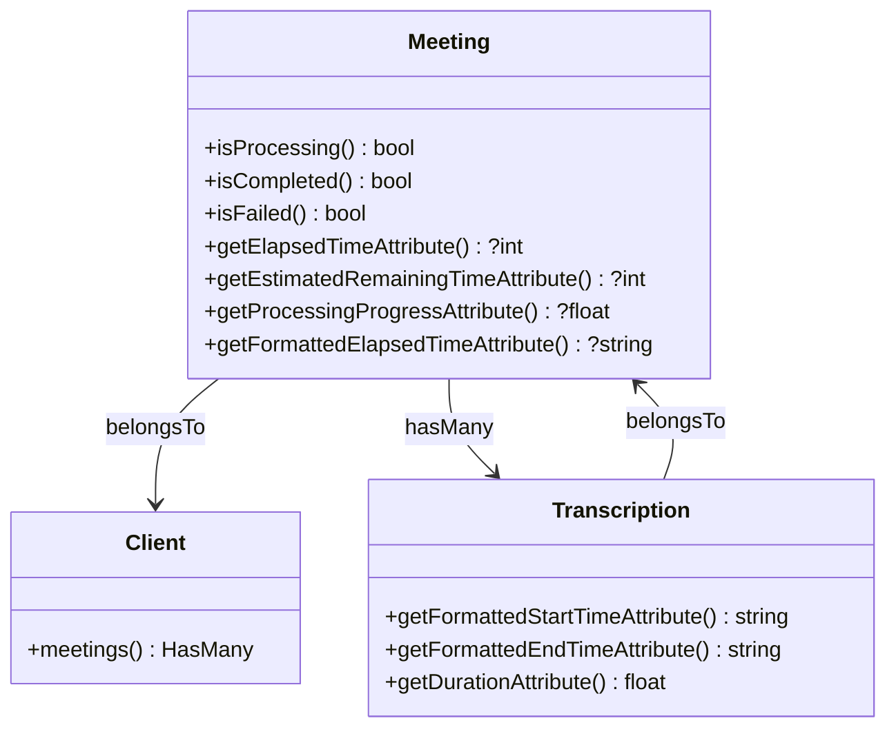

# Unit Testing


## Table of Contents
1. [Introduction](#introduction)
2. [Testing Framework Overview](#testing-framework-overview)
3. [Current Unit Testing Implementation](#current-unit-testing-implementation)
4. [Base Test Class Configuration](#base-test-class-configuration)
5. [Model Testing Strategy](#model-testing-strategy)
6. [Best Practices for Unit Testing](#best-practices-for-unit-testing)
7. [Sample Unit Tests](#sample-unit-tests)
8. [Conclusion](#conclusion)

## Introduction
This document provides a comprehensive overview of the unit testing strategy for the meetingai application. Unit testing focuses on verifying the correctness of isolated components and pure logic, such as model methods, helper functions, and utility classes. The current implementation uses PestPHP as the testing framework, which offers a clean, expressive syntax built on top of PHPUnit. This guide details the existing setup, identifies opportunities for expansion, and provides practical examples for enhancing test coverage across key models like Meeting, Client, and Transcription.

## Testing Framework Overview

The meetingai application utilizes **PestPHP** as its primary testing framework. PestPHP is a lightweight, expressive testing framework built on top of PHPUnit, designed to make tests more readable and maintainable by adopting a functional syntax inspired by RSpec and Jest. Its clean API reduces boilerplate code and enhances test clarity, making it particularly well-suited for Laravel applications.

PestPHP integrates seamlessly with Laravel through configuration in the `tests/Pest.php` file, where test suites are bound to appropriate base classes and traits. This integration enables developers to leverage Laravel's testing utilities—such as database refreshing and HTTP assertions—while benefiting from Pest’s elegant syntax.

Key advantages of PestPHP include:
- **Simplified syntax**: Tests are written using `test()` or `it()` functions instead of class methods.
- **Improved readability**: Test descriptions read like natural language.
- **Powerful expectations**: The `expect()` API provides intuitive assertion methods.
- **Seamless Laravel integration**: Full access to Laravel’s testing helpers and service container.

**Section sources**
- [Pest.php](file://tests/Pest.php#L1-L62)

## Current Unit Testing Implementation

Currently, the unit testing suite in the `tests/Unit` directory contains only a single placeholder test file: `ExampleTest.php`. This file includes a minimal test that verifies a basic boolean condition.


```php
<?php

test('that true is true', function () {
    expect(true)->toBeTrue();
});
```


While this serves as a starting point, it does not reflect any actual business logic from the application. The test passes trivially and provides no meaningful coverage of the system's functionality. This indicates that the unit testing suite is in its early stages and requires significant expansion to ensure robustness and reliability.

To evolve this foundation, the team should begin writing tests for core model logic, accessors, mutators, and custom methods in classes such as `Meeting`, `Client`, and `Transcription`.

**Section sources**
- [ExampleTest.php](file://tests/Unit/ExampleTest.php#L1-L5)

## Base Test Class Configuration

The `TestCase.php` file defines the base test class used across the application. It extends Laravel’s `Illuminate\Foundation\Testing\TestCase`, providing essential bootstrapping for Laravel application testing. Although currently empty, this class can be enhanced with shared setup logic, helper methods, or common assertions used across multiple test suites.


```php
<?php

namespace Tests;

use Illuminate\Foundation\Testing\TestCase as BaseTestCase;

abstract class TestCase extends BaseTestCase
{
    //
}
```


In the `Pest.php` configuration file, this base class is assigned to specific test directories using the `pest()->extend()` method. For example, feature and browser tests are configured to use `Tests\TestCase` along with traits like `RefreshDatabase` and `Browsable`.


```php
pest()->extend(Tests\TestCase::class)
    ->use(Illuminate\Foundation\Testing\RefreshDatabase::class)
    ->in('Feature');
```


This ensures that all feature and browser tests have access to Laravel’s testing tools, including database transactions and HTTP client utilities, while maintaining clean separation between test types.

**Section sources**
- [TestCase.php](file://tests/TestCase.php#L1-L11)
- [Pest.php](file://tests/Pest.php#L1-L62)

## Model Testing Strategy

The application contains several Eloquent models located in the `app/Models` directory, including `Meeting`, `Client`, and `Transcription`. These models encapsulate business logic through custom methods, accessors, and relationships. Unit tests should target these components to verify correctness in isolation.

### Meeting Model
The `Meeting` model includes several computed attributes (via accessors) that calculate processing progress, elapsed time, and estimated remaining time. These are ideal candidates for unit testing due to their deterministic logic.

Key methods to test:
- `isProcessing()`, `isCompleted()`, `isFailed()` – status checks
- `getElapsedTimeAttribute()` – time since processing started
- `getEstimatedRemainingTimeAttribute()` – prediction based on video duration
- `getProcessingProgressAttribute()` – percentage completion
- `getFormattedElapsedTimeAttribute()` – human-readable time display

### Client Model
The `Client` model is simpler but includes a relationship method:
- `meetings()` – defines a one-to-many relationship with `Meeting`

This can be tested to ensure proper Eloquent binding.

### Transcription Model
The `Transcription` model includes formatting and calculation logic:
- `getFormattedStartTimeAttribute()` and `getFormattedEndTimeAttribute()` – time formatting
- `getDurationAttribute()` – calculates segment duration

These methods should be tested for correct output across various input values.





**Diagram sources**
- [Meeting.php](file://app/Models/Meeting.php#L1-L179)
- [Client.php](file://app/Models/Client.php#L1-L28)
- [Transcription.php](file://app/Models/Transcription.php#L1-L51)

## Best Practices for Unit Testing

To ensure high-quality, maintainable unit tests, follow these best practices:

### Test Independence
Each test must be self-contained and not rely on the state or outcome of another test. Avoid shared state between tests. Use Pest’s `setUp()` and `tearDown()` hooks if needed, or leverage Laravel’s `RefreshDatabase` trait for database isolation.

### Fast Execution
Unit tests should execute quickly. Avoid hitting external services (e.g., APIs, file systems, databases) unless absolutely necessary. When dependencies exist, use **mocking** to simulate behavior.

### Mocking Dependencies
Use **Mockery** (integrated with Pest) to mock external dependencies. For example, if a service calls an API, mock the client to return predefined responses.

Example:

```php
use Mockery;

it('processes meeting without calling external API', function () {
    $apiClient = Mockery::mock('App\Services\TranscriptionService');
    $apiClient->shouldReceive('transcribe')->andReturn(['status' => 'success']);

    $service = new MeetingProcessingService($apiClient);
    $result = $service->process($meeting);

    expect($result['status'])->toBe('success');
});
```


### Avoid External Service Calls
Ensure unit tests do not make real HTTP requests, write to disk, or connect to databases unless under controlled conditions (e.g., using `RefreshDatabase`). This keeps tests fast and deterministic.

### Test Edge Cases
Include tests for boundary conditions:
- Null values
- Zero durations
- Invalid timestamps
- Empty relationships
- Status transitions

For example, test `getElapsedTimeAttribute()` when `processing_started_at` is null.

**Section sources**
- [Meeting.php](file://app/Models/Meeting.php#L1-L179)
- [Pest.php](file://tests/Pest.php#L1-L62)
- [mocking.md](file://pest-4-beta-docs/mocking.md)

## Sample Unit Tests

Below are practical examples of unit tests that can be added to the `tests/Unit` directory to improve coverage.

### Testing Model Accessors


```php
// tests/Unit/MeetingTest.php
use App\Models\Meeting;
use Illuminate\Support\Carbon;

it('calculates elapsed time correctly', function () {
    $meeting = new Meeting([
        'processing_started_at' => Carbon::now()->subSeconds(90),
    ]);

    expect($meeting->elapsed_time)->toBe(90);
});

it('returns null for elapsed time when processing has not started', function () {
    $meeting = new Meeting([
        'processing_started_at' => null,
    ]);

    expect($meeting->elapsed_time)->toBeNull();
});

it('formats elapsed time as MM:SS', function () {
    $meeting = new Meeting([
        'processing_started_at' => Carbon::now()->subMinutes(2)->subSeconds(30),
    ]);

    expect($meeting->formatted_elapsed_time)->toBe('2:30');
});
```


### Testing Status Methods


```php
it('identifies processing status correctly', function () {
    $meeting = new Meeting(['status' => 'processing']);
    expect($meeting->isProcessing())->toBeTrue();
});

it('identifies completed status correctly', function () {
    $meeting = new Meeting(['status' => 'completed']);
    expect($meeting->isCompleted())->toBeTrue();
});
```


### Testing Edge Cases


```php
it('handles zero duration video for estimated time', function () {
    $meeting = new Meeting([
        'status' => 'processing',
        'processing_started_at' => Carbon::now()->subSeconds(5),
        'duration' => 0,
    ]);

    // Minimum estimated time is 10 seconds
    expect($meeting->estimated_remaining_time)->toBe(5);
});
```


### Testing Transcription Formatting


```php
use App\Models\Transcription;

it('formats start time correctly', function () {
    $transcription = new Transcription(['start_time' => 123.45]);
    expect($transcription->formatted_start_time)->toBe('02:03.45');
});

it('calculates duration correctly', function () {
    $transcription = new Transcription([
        'start_time' => 100.0,
        'end_time' => 150.5
    ]);
    expect($transcription->duration)->toBe(50.5);
});
```


These tests should be placed in appropriately named files under `tests/Unit/`, such as `MeetingTest.php`, `ClientTest.php`, and `TranscriptionTest.php`.

**Section sources**
- [Meeting.php](file://app/Models/Meeting.php#L1-L179)
- [Transcription.php](file://app/Models/Transcription.php#L1-L51)

## Conclusion

The current unit testing implementation in the meetingai application is minimal, consisting of only a placeholder test. However, the foundation is solid with PestPHP providing a modern, expressive syntax and seamless Laravel integration. To strengthen the codebase, the team should expand unit test coverage to include all model accessors, mutators, and business logic methods.

Priority should be given to testing the `Meeting` model due to its complex time-based calculations and status logic. Following best practices—such as ensuring test independence, avoiding external dependencies, and covering edge cases—will result in a reliable, fast, and maintainable test suite. With targeted effort, the unit testing strategy can evolve into a critical asset for ensuring application quality and enabling safe refactoring.

**Referenced Files in This Document**   
- [ExampleTest.php](file://tests/Unit/ExampleTest.php)
- [TestCase.php](file://tests/TestCase.php)
- [Pest.php](file://tests/Pest.php)
- [Meeting.php](file://app/Models/Meeting.php)
- [Client.php](file://app/Models/Client.php)
- [Transcription.php](file://app/Models/Transcription.php)